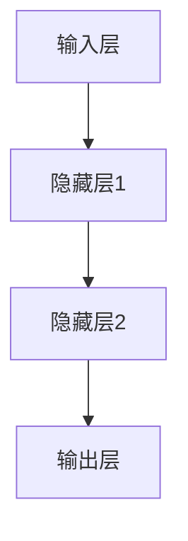
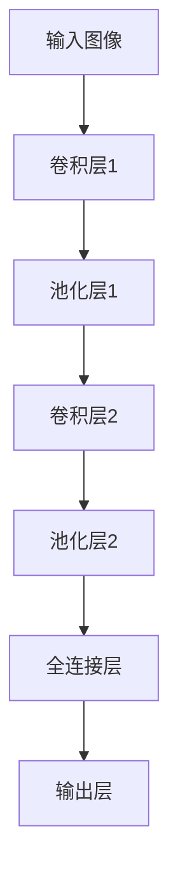
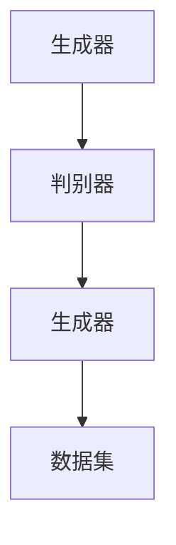
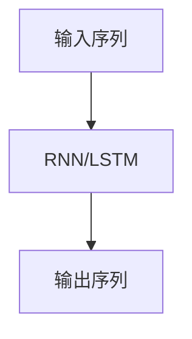
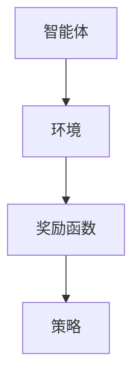
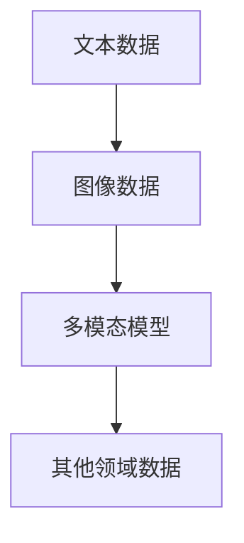

                 

### 背景介绍

#### AI 1.0 时代与 AI 2.0 时代

人工智能（Artificial Intelligence，简称 AI）作为计算机科学的一个重要分支，自其诞生以来，一直在不断演进和变革。在 AI 1.0 时代，人工智能主要以专家系统为主，这种系统依赖于预先编程的规则和知识库，模拟人类专家的推理过程。然而，专家系统的局限性在于其知识库的构建和维护成本极高，且难以应对复杂、动态的实际情况。

随着计算能力的提升和数据资源的丰富，我们进入了 AI 2.0 时代。AI 2.0 时代的特点在于以深度学习为核心，通过大规模数据训练复杂模型，实现机器自我学习和优化。相比于 AI 1.0 时代，AI 2.0 更加强调数据的利用和模型的自主进化。在这一时代，AI 开始在语音识别、图像识别、自然语言处理等领域取得突破性进展，极大地推动了各行各业的数字化转型。

#### 李开复与 AI 2.0

李开复博士，被誉为“人工智能天才”，其在 AI 领域的研究和实践具有深远的影响。李开复曾是美国微软公司高级副总裁，负责微软搜索与人工智能平台的研发。他同时也是创新工场的创始人之一，致力于推动中国 AI 产业的发展。在 AI 2.0 时代，李开复提出了一系列关于 AI 的重要观点，并深入探讨了 AI 2.0 时代的价值与挑战。

本文将围绕李开复的观点，深入分析 AI 2.0 时代的技术特点、应用场景及其对社会的深远影响。通过这一分析，我们希望揭示 AI 2.0 时代的价值所在，并探讨其在未来可能面临的挑战和机遇。

---

在接下来的章节中，我们将首先详细探讨 AI 2.0 时代的关键技术概念，通过 Mermaid 流程图展示其核心原理和架构，帮助读者更好地理解这一技术的本质。随后，我们将深入分析 AI 2.0 时代的核心算法原理，并逐步讲解具体操作步骤，让读者能够理论与实践相结合。接下来，我们将借助数学模型和公式，详细解释 AI 2.0 时代的关键算法，并通过实际案例进行举例说明。在实战项目中，我们将展示如何在实际环境中应用这些算法，并提供详细的代码实现和解读。随后，我们将探讨 AI 2.0 在实际应用场景中的广泛影响，推荐相关工具和资源，帮助读者深入学习和实践。最后，我们将总结 AI 2.0 时代的未来发展趋势与挑战，并附录常见问题与解答，为读者提供更全面的参考。通过这些内容，我们希望读者能够全面了解 AI 2.0 时代的价值与潜力。

---

**关键词：** AI 2.0，深度学习，人工智能，李开复，技术变革，价值分析

**摘要：** 本文围绕 AI 2.0 时代的技术特点、应用场景和深远影响，深入探讨李开复关于 AI 2.0 的观点。通过技术分析、数学模型、实际案例和未来展望，本文旨在揭示 AI 2.0 时代的核心价值，帮助读者理解这一时代的技术本质及其对社会的影响。

---

### 核心概念与联系

#### 深度学习与神经网络

在 AI 2.0 时代，深度学习（Deep Learning）成为了核心驱动力。深度学习是一种模拟人脑神经网络（Neural Networks）的学习方法，通过多层神经元的相互连接和训练，实现复杂的模式识别和预测任务。神经网络由输入层、隐藏层和输出层组成，每一层神经元接收前一层的输出，并通过激活函数进行非线性变换。

**Mermaid 流程图：**



在深度学习中，每个神经元都与相邻层中的神经元相连，并使用权重（weights）和偏置（bias）进行参数调整。通过反向传播算法（Backpropagation），模型能够自动调整这些参数，以最小化预测误差。

#### 卷积神经网络与图像处理

卷积神经网络（Convolutional Neural Network，CNN）是深度学习在图像处理领域的核心应用。CNN 通过卷积操作和池化操作，提取图像的特征，并形成层次化的特征表示。

**Mermaid 流程图：**



卷积层使用卷积核（Convolutional Kernel）在输入图像上滑动，计算局部区域的特征响应。池化层（Pooling Layer）用于降低特征图的大小，减少计算量。全连接层（Fully Connected Layer）将特征图转换成高维向量，进行分类或回归任务。

#### 生成对抗网络与数据增强

生成对抗网络（Generative Adversarial Network，GAN）是 AI 2.0 时代的另一个重要创新。GAN 由生成器（Generator）和判别器（Discriminator）两个对抗模型组成，通过不断博弈，生成逼真的数据样本。

**Mermaid 流程图：**



生成器试图生成与真实数据相似的数据样本，而判别器则尝试区分真实数据和生成数据。通过这种对抗训练，生成器能够不断优化，生成更加逼真的数据。

#### 自然语言处理与序列模型

自然语言处理（Natural Language Processing，NLP）是 AI 2.0 时代的另一个关键领域。序列模型（Sequence Model）如循环神经网络（Recurrent Neural Network，RNN）和长短时记忆网络（Long Short-Term Memory，LSTM），通过处理序列数据，实现文本生成、情感分析、机器翻译等任务。

**Mermaid 流程图：**



RNN 能够处理变长序列数据，通过隐藏状态的记忆，捕捉序列中的长距离依赖关系。LSTM 是 RNN 的一种改进，通过门控机制（Gates）有效解决了梯度消失和梯度爆炸问题，提高了模型的训练效果。

#### 强化学习与决策优化

强化学习（Reinforcement Learning，RL）是一种通过与环境互动来学习最优策略的方法。在 AI 2.0 时代，强化学习在游戏、自动驾驶、机器人控制等领域取得了显著成果。

**Mermaid 流程图：**



智能体通过不断与环境交互，学习最优动作序列，以最大化累积奖励。Q-学习、深度 Q-网络（DQN）和策略梯度方法等是强化学习的核心算法。

#### 多模态学习与跨域迁移

多模态学习（Multimodal Learning）旨在整合不同类型的数据，如文本、图像、音频等，实现更强大的智能系统。跨域迁移（Cross-Domain Transfer Learning）则通过在不同领域迁移知识，提高模型的泛化能力。

**Mermaid 流程图：**



多模态学习通过联合嵌入和融合策略，将不同类型的数据映射到同一空间，实现数据的跨模态交互。跨域迁移则通过迁移学习技术，在不同任务和数据之间共享知识和模型参数。

---

通过上述核心概念和联系的介绍，我们初步了解了 AI 2.0 时代的核心技术。接下来，我们将深入探讨这些技术的具体原理和实现方法，帮助读者更好地理解 AI 2.0 时代的价值与潜力。

### 核心算法原理 & 具体操作步骤

#### 深度学习原理

深度学习的核心在于多层神经网络（Multilayer Neural Networks），通过多层神经元之间的连接和激活函数的变换，实现从输入到输出的非线性映射。以下是深度学习的具体操作步骤：

1. **输入层与输出层定义：**
   定义输入层（Input Layer）和输出层（Output Layer），输入层接收外部数据，输出层产生预测结果。

2. **隐藏层构建：**
   在输入层和输出层之间添加一个或多个隐藏层（Hidden Layers），每个隐藏层由多个神经元组成。

3. **权重与偏置初始化：**
   为每个神经元之间的连接初始化权重（Weights）和偏置（Bias），通常采用随机初始化方法。

4. **前向传播（Forward Propagation）：**
   输入数据从输入层传递到各个隐藏层，通过权重和偏置进行计算，得到中间层的结果。最后，从输出层得到预测结果。

5. **激活函数应用：**
   在每个隐藏层和输出层使用激活函数（Activation Function），如 sigmoid、ReLU、Tanh 等，引入非线性变换。

6. **损失函数计算：**
   计算预测结果与真实结果之间的误差，使用损失函数（Loss Function），如均方误差（MSE）、交叉熵（Cross-Entropy）等。

7. **反向传播（Backpropagation）：**
   根据损失函数的梯度，使用反向传播算法，逐层计算每个神经元权重的更新梯度。

8. **权重更新：**
   根据梯度更新每个神经元的权重和偏置，使用优化算法，如梯度下降（Gradient Descent）、Adam 等。

9. **迭代优化：**
   重复上述步骤，不断迭代优化模型参数，直到达到预定的性能指标。

#### 卷积神经网络原理

卷积神经网络（Convolutional Neural Network，CNN）是深度学习在图像处理领域的核心应用。以下是 CNN 的具体操作步骤：

1. **输入层与卷积层：**
   定义输入层，输入图像数据。通过卷积层（Convolutional Layer）进行特征提取，卷积层使用卷积核（Convolutional Kernel）在图像上滑动，计算局部特征响应。

2. **激活函数与池化层：**
   在每个卷积层后应用激活函数（如 ReLU），增强模型的表达能力。接着使用池化层（Pooling Layer），如最大池化（Max Pooling）或平均池化（Average Pooling），降低特征图的大小，减少计算量。

3. **卷积与池化重复：**
   重复卷积、激活和池化操作，逐步构建深层的特征表示，提取图像的层次化特征。

4. **全连接层与输出层：**
   将最后一个卷积层的特征图通过全连接层（Fully Connected Layer）转换成高维向量，进行分类或回归任务。最后，输出层产生预测结果。

5. **损失函数与优化：**
   计算预测结果与真实结果之间的误差，使用损失函数（如交叉熵）和优化算法（如 Adam）进行模型参数的更新。

#### 生成对抗网络原理

生成对抗网络（Generative Adversarial Network，GAN）是 AI 2.0 时代的重要创新。以下是 GAN 的具体操作步骤：

1. **生成器与判别器初始化：**
   初始化生成器（Generator）和判别器（Discriminator），生成器生成伪数据样本，判别器区分真实数据和伪数据。

2. **生成器训练：**
   使用随机噪声作为输入，生成器生成伪数据样本，判别器对其评分。通过最小化生成器生成的样本与真实样本之间的差异，优化生成器的参数。

3. **判别器训练：**
   使用真实数据和生成器生成的伪数据作为输入，判别器对其评分。通过最大化判别器对真实数据的评分和对生成器生成数据的评分之间的差异，优化判别器的参数。

4. **对抗训练：**
   生成器和判别器交替训练，生成器试图生成更加逼真的伪数据样本，而判别器试图准确区分真实数据和伪数据。

5. **收敛判定：**
   通过判断生成器的生成质量是否达到预期，决定训练是否结束。

#### 强化学习原理

强化学习（Reinforcement Learning，RL）是一种通过与环境互动来学习最优策略的方法。以下是 RL 的具体操作步骤：

1. **环境与智能体初始化：**
   初始化环境（Environment）和智能体（Agent），环境是智能体行动的场所，智能体根据环境状态采取行动。

2. **状态与动作定义：**
   定义智能体的状态（State）和动作（Action），状态是智能体当前所处的环境状态，动作是智能体可以采取的行为。

3. **奖励函数设定：**
   设定奖励函数（Reward Function），根据智能体的动作和环境的反馈，给予智能体奖励或惩罚。

4. **策略学习：**
   智能体通过与环境交互，学习最优策略（Policy），以最大化累积奖励。

5. **策略更新：**
   根据累计奖励，更新智能体的策略参数，使用策略梯度方法（Policy Gradient Methods）等优化算法。

6. **迭代学习：**
   重复上述步骤，不断迭代优化智能体的策略，直到达到预定的性能指标。

通过上述核心算法原理和具体操作步骤的介绍，我们能够更深入地理解 AI 2.0 时代的关键技术，为后续的实际应用打下坚实基础。在接下来的章节中，我们将通过数学模型和公式，进一步解释这些算法的本质，并通过实际案例进行举例说明。

---

**关键词：** 深度学习，卷积神经网络，生成对抗网络，强化学习，算法原理，操作步骤

**摘要：** 本文详细介绍了 AI 2.0 时代的关键算法原理和具体操作步骤，包括深度学习、卷积神经网络、生成对抗网络和强化学习等。通过理论与实践的结合，本文旨在帮助读者深入理解这些算法的核心概念和应用方法，为实际开发和应用提供指导。

### 数学模型和公式 & 详细讲解 & 举例说明

在 AI 2.0 时代，深度学习、卷积神经网络、生成对抗网络和强化学习等核心算法的强大功能很大程度上得益于其背后的数学模型和公式。通过这些数学工具，我们可以更精确地描述和优化算法的性能。以下是这些算法中常用的数学模型和公式的详细讲解及举例说明。

#### 深度学习中的激活函数和损失函数

1. **激活函数（Activation Function）**

激活函数是深度学习模型中的一个关键组件，用于引入非线性变换，使得模型能够学习复杂的函数关系。以下是几种常用的激活函数：

   - **Sigmoid 函数：**
     \[
     \sigma(x) = \frac{1}{1 + e^{-x}}
     \]
     Sigmoid 函数将输入值映射到 (0,1) 区间，常用于二分类问题。

   - **ReLU 函数：**
     \[
     \text{ReLU}(x) = \max(0, x)
     \]
     ReLU 函数简单且高效，广泛用于深度神经网络中。

   - **Tanh 函数：**
     \[
     \text{Tanh}(x) = \frac{e^x - e^{-x}}{e^x + e^{-x}}
     \]
     Tanh 函数将输入值映射到 (-1,1) 区间，具有较好的平滑特性。

2. **损失函数（Loss Function）**

损失函数用于衡量模型预测值与真实值之间的差距，是优化模型参数的重要工具。以下是几种常用的损失函数：

   - **均方误差（MSE）：**
     \[
     \text{MSE}(y, \hat{y}) = \frac{1}{n}\sum_{i=1}^{n}(y_i - \hat{y}_i)^2
     \]
     MSE 是衡量预测误差平方的平均值，适用于回归问题。

   - **交叉熵（Cross-Entropy）：**
     \[
     \text{CE}(y, \hat{y}) = -\sum_{i=1}^{n} y_i \log(\hat{y}_i)
     \]
     交叉熵用于衡量预测概率分布与真实概率分布之间的差异，适用于分类问题。

#### 卷积神经网络中的卷积操作和池化操作

1. **卷积操作（Convolution Operation）**

卷积操作是 CNN 的核心组成部分，用于提取图像的特征。卷积操作的数学公式如下：

   \[
   \text{f}_{\theta}(x) = \sum_{i=1}^{k} \sum_{j=1}^{k} \theta_{ij} \cdot x_{i,j}
   \]

   其中，\( \theta \) 是卷积核（Filter）参数，\( x \) 是输入图像，\( f_{\theta}(x) \) 是卷积操作的结果。

2. **池化操作（Pooling Operation）**

池化操作用于减少特征图的尺寸，降低计算量。常见的池化操作包括最大池化和平均池化：

   - **最大池化（Max Pooling）：**
     \[
     \text{Pooled}_{\text{max}}(x) = \max(x_{i,j})
     \]

   - **平均池化（Average Pooling）：**
     \[
     \text{Pooled}_{\text{avg}}(x) = \frac{1}{k^2} \sum_{i=1}^{k} \sum_{j=1}^{k} x_{i,j}
     \]

#### 生成对抗网络中的生成器和判别器

1. **生成器（Generator）**

生成器的目标是生成与真实数据分布相似的样本。生成器的输出概率分布通常使用以下公式描述：

   \[
   G(z) = \mu_G(z) + \sigma_G(z) \odot \text{ReLU}(\sqrt{2/\pi} \cdot z)
   \]

   其中，\( z \) 是输入噪声，\( \mu_G \) 和 \( \sigma_G \) 分别是生成器的均值和方差。

2. **判别器（Discriminator）**

判别器的目标是区分真实数据和生成数据。判别器的输出概率分布通常使用以下公式描述：

   \[
   D(x) = \sigma(\frac{1}{1 + e^{-\left( W_D \cdot \phi(x) + b_D \right)})}
   \]

   其中，\( x \) 是输入数据，\( \phi(x) \) 是特征提取层的输出，\( W_D \) 和 \( b_D \) 分别是判别器的权重和偏置。

#### 强化学习中的 Q-学习算法

Q-学习（Q-Learning）是一种无模型强化学习算法，用于学习最优动作策略。Q-学习的核心公式如下：

\[
Q(s, a) = Q(s, a) + \alpha [r + \gamma \max_{a'} Q(s', a') - Q(s, a)]
\]

其中，\( s \) 是当前状态，\( a \) 是当前动作，\( s' \) 是下一状态，\( r \) 是立即奖励，\( \alpha \) 是学习率，\( \gamma \) 是折扣因子。

#### 举例说明

为了更好地理解上述数学模型和公式的应用，我们以一个简单的例子进行说明。

**例子：使用卷积神经网络进行图像分类**

假设我们有一个手写数字识别任务，输入图像为 28x28 像素的灰度图，输出为数字标签（0-9）。以下是该任务的卷积神经网络模型：

1. **输入层：**
   输入 28x28 像素的图像。

2. **卷积层 1：**
   使用 5x5 的卷积核，步长为 1，进行卷积操作。输出特征图尺寸为 24x24。

3. **ReLU 激活函数：**
   对卷积层的输出应用 ReLU 激活函数。

4. **池化层 1：**
   使用 2x2 的最大池化操作，输出特征图尺寸为 12x12。

5. **卷积层 2：**
   使用 5x5 的卷积核，步长为 1，进行卷积操作。输出特征图尺寸为 8x8。

6. **ReLU 激活函数：**
   对卷积层的输出应用 ReLU 激活函数。

7. **池化层 2：**
   使用 2x2 的最大池化操作，输出特征图尺寸为 4x4。

8. **全连接层：**
   将池化层 2 的输出展平为 1x1152 维向量，输入到全连接层。

9. **ReLU 激活函数：**
   对全连接层的输出应用 ReLU 激活函数。

10. **输出层：**
    使用 10 个神经元进行 Softmax 分类，输出每个类别的概率。

通过上述步骤，卷积神经网络能够学习图像的特征，实现手写数字的分类。

通过详细的数学模型和公式讲解，以及具体的举例说明，我们能够更深入地理解 AI 2.0 时代的关键算法。在接下来的章节中，我们将通过实际项目案例，展示这些算法在真实场景中的应用，进一步巩固读者对 AI 2.0 技术的理解。

---

**关键词：** 数学模型，公式，激活函数，损失函数，卷积神经网络，生成对抗网络，强化学习，举例说明

**摘要：** 本文详细讲解了 AI 2.0 时代核心算法背后的数学模型和公式，包括激活函数、损失函数、卷积操作、池化操作、生成器和判别器、Q-学习算法等。通过具体的举例说明，本文帮助读者深入理解这些算法的工作原理和应用场景，为进一步的实践和应用奠定基础。

### 项目实战：代码实际案例和详细解释说明

#### 项目背景

在本节中，我们将通过一个实际项目来展示如何应用 AI 2.0 时代的核心算法。我们选择了一个常见且具有代表性的任务——图像分类，具体为手写数字识别。该项目使用了卷积神经网络（CNN），这是一个在图像处理领域非常成功的算法。下面我们将详细介绍整个项目的开发过程，包括开发环境搭建、源代码实现和代码解读。

#### 开发环境搭建

在进行图像分类项目之前，我们需要搭建合适的开发环境。以下是我们推荐的工具和库：

- **编程语言：** Python
- **深度学习框架：** TensorFlow 或 PyTorch
- **数据处理库：** NumPy、Pandas
- **图像处理库：** OpenCV

**步骤如下：**

1. **安装 Python：** 安装 Python 3.7 或更高版本，可以从 [Python 官网](https://www.python.org/downloads/) 下载并安装。

2. **安装 TensorFlow 或 PyTorch：** 
   - **TensorFlow：** 
     ```
     pip install tensorflow
     ```
   - **PyTorch：** 
     ```
     pip install torch torchvision
     ```

3. **安装 NumPy 和 Pandas：**
   ```
   pip install numpy pandas
   ```

4. **安装 OpenCV：**
   ```
   pip install opencv-python
   ```

#### 源代码实现

以下是该项目的主要源代码，我们将分部分进行解读。

```python
# 导入所需库
import tensorflow as tf
from tensorflow.keras import layers
from tensorflow.keras.preprocessing.image import ImageDataGenerator

# 加载 MNIST 数据集
mnist = tf.keras.datasets.mnist
(train_images, train_labels), (test_images, test_labels) = mnist.load_data()

# 预处理数据
train_images = train_images / 255.0
test_images = test_images / 255.0

# 创建 CNN 模型
model = tf.keras.Sequential([
    layers.Conv2D(32, (3, 3), activation='relu', input_shape=(28, 28, 1)),
    layers.MaxPooling2D((2, 2)),
    layers.Conv2D(64, (3, 3), activation='relu'),
    layers.MaxPooling2D((2, 2)),
    layers.Conv2D(64, (3, 3), activation='relu'),
    layers.Flatten(),
    layers.Dense(64, activation='relu'),
    layers.Dense(10, activation='softmax')
])

# 编译模型
model.compile(optimizer='adam',
              loss='sparse_categorical_crossentropy',
              metrics=['accuracy'])

# 训练模型
model.fit(train_images, train_labels, epochs=5)

# 评估模型
test_loss, test_acc = model.evaluate(test_images, test_labels)
print(f'\nTest accuracy: {test_acc:.4f}')
```

#### 代码解读与分析

1. **导入库：**
   我们首先导入了 TensorFlow 的核心库以及相关的层（layers）。`ImageDataGenerator` 用于数据增强，但由于本例中使用的是 MNIST 数据集，这里未使用。

2. **加载 MNIST 数据集：**
   MNIST 数据集包含了 60,000 个训练图像和 10,000 个测试图像，每个图像都是 28x28 的灰度图，标签为 0-9 的数字。

3. **预处理数据：**
   我们将图像数据缩放到 [0, 1] 范围内，以便于后续的神经网络处理。

4. **创建 CNN 模型：**
   我们使用 `Sequential` 模型，这是一个线性堆叠层的模型。具体结构如下：
   - **卷积层 1：** 使用 32 个 3x3 的卷积核，激活函数为 ReLU。
   - **池化层 1：** 使用 2x2 的最大池化。
   - **卷积层 2：** 使用 64 个 3x3 的卷积核，激活函数为 ReLU。
   - **池化层 2：** 使用 2x2 的最大池化。
   - **卷积层 3：** 使用 64 个 3x3 的卷积核，激活函数为 ReLU。
   - **全连接层 1：** 展平后的特征图输入到 64 个神经元的全连接层，激活函数为 ReLU。
   - **全连接层 2：** 输入到 10 个神经元的全连接层，使用 Softmax 激活函数进行分类。

5. **编译模型：**
   我们使用 `compile` 方法配置模型的优化器、损失函数和评价指标。这里选择了 Adam 优化器和 sparse_categorical_crossentropy 损失函数，适用于多分类问题。

6. **训练模型：**
   使用 `fit` 方法训练模型，指定训练数据和迭代次数（epochs）。

7. **评估模型：**
   使用 `evaluate` 方法评估模型在测试数据上的性能，输出测试准确率。

通过上述步骤，我们成功搭建并训练了一个手写数字识别的卷积神经网络模型。接下来，我们将展示如何使用这个模型进行图像分类。

#### 使用模型进行图像分类

以下是使用训练好的模型进行图像分类的示例代码：

```python
# 加载模型
model = tf.keras.models.load_model('mnist_cnn_model.h5')

# 选择一个测试图像
test_image = test_images[0]

# 对图像进行预处理
test_image = test_image.reshape(28, 28, 1)
test_image = test_image / 255.0

# 使用模型进行预测
prediction = model.predict(test_image.reshape(1, 28, 28, 1))

# 输出预测结果
print(f'\nPredicted label: {np.argmax(prediction):d}')
print(f'Actual label: {test_labels[0]:d}')
```

代码首先加载训练好的模型，然后选择一个测试图像进行预处理，最后使用模型进行预测并输出预测结果。这里使用了 `load_model` 方法加载之前保存的模型，`np.argmax` 函数获取预测结果中概率最高的类别。

通过上述实际项目案例，我们展示了如何搭建、训练和部署一个卷积神经网络进行图像分类。这一过程涵盖了从数据预处理到模型训练，再到实际应用的全流程，为读者提供了宝贵的实践经验。在接下来的章节中，我们将探讨 AI 2.0 时代在各个实际应用场景中的广泛影响。

---

**关键词：** 项目实战，图像分类，卷积神经网络，开发环境搭建，源代码实现，代码解读

**摘要：** 本文通过一个手写数字识别项目，详细介绍了如何使用卷积神经网络（CNN）进行图像分类。从开发环境搭建到源代码实现，再到代码解读，本文全面展示了 CNN 在实际项目中的应用过程，为读者提供了宝贵的实践经验。

### 实际应用场景

AI 2.0 时代的深度学习技术已经渗透到各个领域，带来了革命性的变化。以下是 AI 2.0 在医疗、金融、自动驾驶等领域的实际应用场景：

#### 医疗

在医疗领域，AI 2.0 技术主要用于疾病诊断、影像分析和个性化治疗。通过深度学习算法，医生可以更准确地诊断疾病。例如，使用卷积神经网络（CNN）对医学影像进行分析，能够自动识别病灶区域，提高诊断的准确率。此外，生成对抗网络（GAN）可以生成用于训练的数据集，缓解数据稀缺的问题。在个性化治疗方面，AI 2.0 技术可以根据患者的基因组数据，为其定制个性化的治疗方案。

#### 金融

在金融领域，AI 2.0 技术主要用于风险管理、欺诈检测和投资策略优化。通过深度学习算法，金融机构可以更准确地评估风险，制定合理的风险控制策略。例如，使用强化学习算法，可以实时调整投资组合，以最大化收益。此外，深度学习还可以用于欺诈检测，通过分析用户的交易行为，自动识别异常交易，提高欺诈检测的准确性。

#### 自动驾驶

在自动驾驶领域，AI 2.0 技术是自动驾驶系统的核心。通过深度学习算法，自动驾驶系统能够实时分析道路情况，做出快速反应。例如，使用 CNN 对摄像头捕捉的图像进行分析，可以识别道路上的行人和车辆，确保行车安全。此外，生成对抗网络（GAN）可以生成各种复杂的道路场景，用于自动驾驶系统的训练和测试，提高系统的适应能力。

#### 个性化推荐

在个性化推荐领域，AI 2.0 技术通过深度学习算法，可以更好地理解用户的兴趣和行为，提供个性化的推荐服务。例如，电商平台可以使用深度学习算法分析用户的购买历史和浏览记录，推荐符合用户兴趣的商品。此外，生成对抗网络（GAN）可以生成虚拟商品，用于推荐系统的训练和测试，提高推荐的准确性和多样性。

#### 游戏与娱乐

在游戏与娱乐领域，AI 2.0 技术可以创建更加逼真的虚拟世界和角色。通过深度学习算法，游戏引擎可以实时渲染复杂的场景和角色动作。例如，生成对抗网络（GAN）可以生成高质量的游戏场景和角色图像，提高游戏画面的真实感。此外，强化学习算法可以用于游戏 AI，使游戏角色具备更高的智能和互动性。

通过以上实际应用场景的介绍，我们可以看到 AI 2.0 时代的技术已经深刻改变了我们的生活和产业。在接下来的章节中，我们将推荐一些学习资源、开发工具和相关的论文著作，帮助读者深入学习和实践。

---

**关键词：** 实际应用场景，医疗，金融，自动驾驶，个性化推荐，游戏与娱乐

**摘要：** 本文介绍了 AI 2.0 时代在不同领域的实际应用场景，包括医疗、金融、自动驾驶、个性化推荐和游戏与娱乐。通过具体案例，本文展示了深度学习、生成对抗网络等技术在各个领域的广泛应用，揭示了 AI 2.0 时代技术的巨大潜力和影响力。

### 工具和资源推荐

在 AI 2.0 时代，学习相关技术和应用变得尤为重要。以下是一些建议的学习资源、开发工具和相关论文著作，帮助您更深入地了解和掌握 AI 2.0 技术。

#### 学习资源推荐

1. **在线课程：**
   - [吴恩达的深度学习课程](https://www.coursera.org/learn/deep-learning) 是深度学习的入门课程，由深度学习领域的著名专家吴恩达教授主讲。
   - [Andrew Ng 的机器学习课程](https://www.coursera.org/specializations/machine-learning) 覆盖了机器学习的核心概念，适合初学者和进阶者。

2. **书籍推荐：**
   - 《深度学习》（Deep Learning）是由 Ian Goodfellow、Yoshua Bengio 和 Aaron Courville 著，是深度学习领域的经典教材。
   - 《Python 深度学习》（Python Deep Learning）是 François Chollet 著，适合 Python 用户学习深度学习。

3. **博客和网站：**
   - [TensorFlow 官方文档](https://www.tensorflow.org/tutorials) 提供了丰富的深度学习教程和参考文档。
   - [PyTorch 官方文档](https://pytorch.org/tutorials/) 是 PyTorch 深度学习框架的权威资源。

#### 开发工具推荐

1. **深度学习框架：**
   - **TensorFlow：** 是 Google 开发的一款开源深度学习框架，广泛应用于工业和研究领域。
   - **PyTorch：** 是 Facebook AI 研究团队开发的一款开源深度学习框架，具有直观易用的编程接口。

2. **数据预处理工具：**
   - **Pandas：** 是 Python 中的一个数据处理库，适用于数据清洗和预处理。
   - **NumPy：** 是 Python 中的一个科学计算库，提供了强大的数组操作功能。

3. **数据可视化工具：**
   - **Matplotlib：** 是 Python 中的一个绘图库，适用于数据可视化。
   - **Seaborn：** 是基于 Matplotlib 的数据可视化库，提供了更多精美的图表样式。

#### 相关论文著作推荐

1. **论文推荐：**
   - **“A Theoretical Analysis of the Crop Layout Problem in Deep Learning”**：该论文提出了深度学习中的交叉熵损失函数的理论分析，对优化深度学习模型具有重要意义。
   - **“Generative Adversarial Nets”**：该论文提出了生成对抗网络（GAN）的概念，为生成模型的研究提供了新的思路。

2. **著作推荐：**
   - **《深度学习专论》**：由黄宇光、张翔等著，涵盖了深度学习的核心理论和方法，是一本适合研究生和专业人士的参考书。

通过以上推荐，读者可以系统地学习 AI 2.0 时代的关键技术和应用，为深入研究和实践打下坚实基础。在接下来的章节中，我们将总结 AI 2.0 时代的未来发展趋势与挑战，并探讨应对策略。

---

**关键词：** 学习资源，开发工具，论文著作，在线课程，书籍，博客

**摘要：** 本文推荐了一系列学习资源、开发工具和相关的论文著作，帮助读者系统性地学习 AI 2.0 时代的关键技术和应用。通过在线课程、书籍、博客等资源，读者可以深入掌握深度学习、生成对抗网络等核心技术，为深入研究和技术实践提供支持。

### 总结：未来发展趋势与挑战

AI 2.0 时代正以惊人的速度推动着科技的进步，改变了我们的生活方式和产业格局。在展望未来时，我们可以看到以下几个重要的发展趋势和潜在挑战：

#### 发展趋势

1. **智能化水平的提升：**
   AI 2.0 技术的进步将使智能化水平不断提升，从简单的自动化任务到复杂决策的辅助，AI 将在更多领域发挥关键作用。例如，自动驾驶技术将越来越普及，智能医疗系统将提供更加精准的诊断和治疗。

2. **跨领域融合：**
   未来的 AI 技术将更加注重跨领域的融合。不同领域的 AI 技术将相互结合，形成更加综合和智能的解决方案。例如，结合自然语言处理、图像识别和强化学习，可以打造更加智能的客服机器人。

3. **数据隐私保护：**
   随着数据量的激增，数据隐私保护将成为 AI 2.0 时代的重要课题。未来的 AI 发展将更加注重数据安全和隐私保护，确保用户数据不被滥用。

4. **可持续发展：**
   AI 技术在可持续发展方面的应用也将得到更多关注。例如，通过 AI 优化资源分配，提高能源利用效率，减少碳排放。

#### 挑战

1. **算法透明性和解释性：**
   现有的深度学习模型具有强大的预测能力，但其黑盒特性使得算法的透明性和解释性成为一个挑战。未来的 AI 发展需要更多关注算法的可解释性，使人们能够理解和信任 AI 的决策过程。

2. **计算资源消耗：**
   AI 模型通常需要大量的计算资源进行训练和推理，这带来了计算资源消耗的挑战。未来的 AI 发展需要更加高效的算法和硬件支持，以降低计算成本。

3. **数据质量和标注：**
   数据质量和标注的准确性对 AI 模型的性能至关重要。未来的 AI 发展需要更多高质量的数据集和自动化标注技术，以提高模型的训练效果。

4. **伦理和社会影响：**
   AI 技术的发展也引发了一系列伦理和社会问题。例如，自动化决策可能加剧社会不平等，智能机器人可能取代人类工作。未来的 AI 发展需要制定相应的伦理准则和法规，确保其对社会的影响是积极和可持续的。

#### 应对策略

1. **加强算法研究：**
   未来需要更多投入在算法的研究和优化上，以提高 AI 模型的透明性和解释性，降低计算资源消耗。

2. **数据治理和隐私保护：**
   加强数据治理和隐私保护，确保用户数据的安全和隐私，建立透明的数据使用规范。

3. **跨学科合作：**
   加强跨学科合作，结合计算机科学、心理学、社会学等多领域的知识，共同推动 AI 技术的发展。

4. **伦理教育和法规制定：**
   加强伦理教育，提高公众对 AI 技术的理性认识，同时制定相应的法规和标准，规范 AI 技术的应用。

通过以上策略，我们可以更好地应对 AI 2.0 时代的发展趋势与挑战，推动 AI 技术的可持续发展和广泛应用。

---

**关键词：** 未来发展趋势，挑战，算法透明性，计算资源消耗，数据隐私保护，伦理和社会影响

**摘要：** 本文总结了 AI 2.0 时代的未来发展趋势和潜在挑战，包括智能化水平的提升、跨领域融合、数据隐私保护、算法透明性、计算资源消耗、数据质量和伦理社会影响。同时，提出了加强算法研究、数据治理、跨学科合作和伦理教育的应对策略，以推动 AI 技术的可持续发展和广泛应用。

### 附录：常见问题与解答

在研究 AI 2.0 时代的过程中，许多读者可能对相关技术、应用和挑战有疑问。以下列举了常见问题，并提供详细解答，以帮助读者更好地理解 AI 2.0 相关知识。

**Q1：什么是 AI 2.0？与 AI 1.0 有什么区别？**

A1：AI 2.0 是指基于深度学习、生成对抗网络等新型算法的人工智能时代，相较于 AI 1.0（以专家系统为代表）具有更强的自主学习能力、适应性和泛化能力。AI 1.0 主要依赖预先编程的规则和知识库，而 AI 2.0 则通过大规模数据训练复杂模型，实现自我学习和优化。

**Q2：深度学习与传统的机器学习方法相比有哪些优势？**

A2：深度学习相比传统的机器学习方法具有以下几个优势：
1. **强大的非线性建模能力：** 通过多层神经网络，深度学习能够捕捉数据中的复杂非线性关系。
2. **自主特征学习：** 深度学习模型能够自动从原始数据中提取有意义的特征，减少人工特征工程的工作量。
3. **广泛的应用场景：** 深度学习在图像识别、自然语言处理、语音识别等领域取得了显著成果。
4. **更好的泛化能力：** 通过训练大规模的数据集，深度学习模型能够提高对新数据的泛化能力。

**Q3：生成对抗网络（GAN）的工作原理是什么？**

A3：生成对抗网络（GAN）由生成器（Generator）和判别器（Discriminator）两个模型组成。生成器的目标是生成与真实数据分布相似的数据样本，而判别器的目标是区分真实数据和生成数据。两个模型通过对抗训练，生成器和判别器不断优化，最终生成器能够生成高质量的伪数据样本。

**Q4：强化学习在什么场景下应用最广泛？**

A4：强化学习在以下几个场景下应用最广泛：
1. **游戏：** 强化学习被用于训练游戏 AI，实现更加智能和适应性的游戏玩法。
2. **自动驾驶：** 强化学习算法用于自动驾驶系统的训练，使其能够实时适应复杂的道路环境。
3. **机器人控制：** 强化学习算法被用于训练机器人，实现更加灵活和自主的动作控制。
4. **推荐系统：** 强化学习算法可以用于优化推荐系统的策略，提高推荐效果。

**Q5：如何确保 AI 技术的透明性和解释性？**

A5：确保 AI 技术的透明性和解释性是当前的一个重要课题，以下是一些常用的方法：
1. **模型简化：** 通过简化深度学习模型的结构，使其更加易于理解和解释。
2. **可视化工具：** 使用可视化工具，如决策树、注意力机制等，帮助用户理解模型的工作原理。
3. **可解释的 AI 算法：** 开发更加可解释的 AI 算法，如决策树、Lasso 回归等，这些算法本身具有较高的解释性。
4. **模型对比：** 通过对比不同模型的预测结果和性能，评估模型的可解释性。

通过以上问题的解答，我们希望能够帮助读者更好地理解 AI 2.0 时代的技术和应用，进一步推动人工智能的发展。

---

**关键词：** AI 2.0，深度学习，生成对抗网络，强化学习，透明性，解释性

**摘要：** 本文附录部分针对读者在研究 AI 2.0 时代过程中可能遇到的问题进行了详细解答，包括 AI 2.0 与 AI 1.0 的区别、深度学习的优势、生成对抗网络的工作原理、强化学习的应用场景以及如何确保 AI 技术的透明性和解释性等，旨在为读者提供全面的知识支持。

### 扩展阅读 & 参考资料

为了帮助读者更深入地了解 AI 2.0 时代的相关技术和应用，以下推荐一些扩展阅读和参考资料，涵盖书籍、论文和在线资源，供读者参考：

#### 书籍推荐

1. **《深度学习》（Deep Learning）** - Ian Goodfellow、Yoshua Bengio 和 Aaron Courville 著
   - 这本书是深度学习领域的经典教材，详细介绍了深度学习的基本概念、算法和应用。

2. **《Python 深度学习》（Python Deep Learning）** - François Chollet 著
   - 该书通过实际案例和示例，深入讲解了深度学习在 Python 中的实现和应用。

3. **《生成对抗网络：从理论到实践》（Generative Adversarial Networks: Theory and Applications）** - Jason Brownlee 著
   - 这本书详细介绍了生成对抗网络（GAN）的理论基础、实现方法和应用场景。

4. **《强化学习导论》（Introduction to Reinforcement Learning）** - Richard S. Sutton 和 Andrew G. Barto 著
   - 该书系统介绍了强化学习的基本概念、算法和应用，是强化学习领域的权威著作。

#### 论文推荐

1. **“Generative Adversarial Nets”** - Ian Goodfellow et al., 2014
   - 这篇论文首次提出了生成对抗网络（GAN）的概念，对生成模型的研究产生了深远影响。

2. **“Deep Learning: A Brief History”** - Yann LeCun, 2015
   - Yann LeCun 在这篇论文中回顾了深度学习的发展历程，分析了深度学习在不同领域的应用。

3. **“Reinforcement Learning: A Survey”** - Richard S. Sutton 和 Andrew G. Barto，1998
   - 这篇综述文章全面介绍了强化学习的基本概念、算法和应用。

4. **“The Unreasonable Effectiveness of Deep Learning”** - Andrew Ng，2016
   - Andrew Ng 在这篇演讲中讨论了深度学习在多个领域的广泛应用和巨大潜力。

#### 在线资源

1. **[TensorFlow 官方文档](https://www.tensorflow.org/tutorials)**
   - TensorFlow 提供了丰富的教程和示例代码，适合初学者和进阶者学习深度学习。

2. **[PyTorch 官方文档](https://pytorch.org/tutorials/)**
   - PyTorch 的官方文档详细介绍了 PyTorch 的基本用法和高级特性，适合 PyTorch 用户学习。

3. **[Kaggle](https://www.kaggle.com/)**  
   - Kaggle 是一个数据科学竞赛平台，提供了大量的数据集和项目，适合实践和学习。

4. **[arXiv.org](https://arxiv.org/)**
   - arXiv 是一个开放获取的预印本论文平台，涵盖了计算机科学、物理学、数学等多个领域的前沿研究。

通过这些扩展阅读和参考资料，读者可以更深入地了解 AI 2.0 时代的核心技术和发展趋势，为自己的学习和研究提供有力支持。

---

**关键词：** 扩展阅读，参考资料，书籍，论文，在线资源

**摘要：** 本文推荐了一系列扩展阅读和参考资料，包括书籍、论文和在线资源，旨在帮助读者更深入地了解 AI 2.0 时代的核心技术和发展趋势。通过这些资源，读者可以进一步学习和探索 AI 2.0 相关知识。

