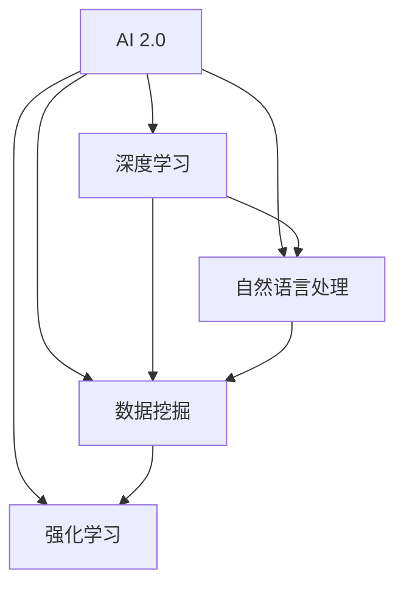

                 

# 李开复：AI 2.0 时代的创业者

> **关键词：**人工智能，AI 2.0，创业，技术前沿，商业应用
> 
> **摘要：**本文深入探讨了AI 2.0时代的到来及其对创业者的挑战与机遇。通过李开复的视角，分析了AI技术的核心概念、发展趋势，以及如何将其应用到创业实践中，为读者提供了一份全面的技术指南。

## 1. 背景介绍

### 1.1 目的和范围

本文旨在探讨AI 2.0时代的到来，以及这一时代为创业者带来的机遇与挑战。我们将重点关注以下内容：

1. AI 2.0的定义及其核心特征。
2. AI技术的最新发展趋势。
3. AI技术在各个领域的应用案例。
4. 创业者如何利用AI技术实现商业创新。
5. AI技术的潜在风险与应对策略。

### 1.2 预期读者

本文适用于对人工智能有一定了解，希望深入探讨AI 2.0时代及其商业应用的读者，包括：

1. 创业者与企业家。
2. 技术爱好者与程序员。
3. 对人工智能感兴趣的学生和学者。
4. 关注AI技术发展与应用的普通读者。

### 1.3 文档结构概述

本文分为以下几个部分：

1. **背景介绍**：介绍文章的目的、范围和预期读者。
2. **核心概念与联系**：介绍AI 2.0的核心概念及其相互关系。
3. **核心算法原理 & 具体操作步骤**：讲解AI技术的核心算法原理和操作步骤。
4. **数学模型和公式 & 详细讲解 & 举例说明**：介绍AI技术的数学模型和公式，并提供实际应用案例。
5. **项目实战：代码实际案例和详细解释说明**：通过具体案例展示AI技术的应用。
6. **实际应用场景**：分析AI技术在各个领域的应用。
7. **工具和资源推荐**：推荐相关学习资源、开发工具和框架。
8. **总结：未来发展趋势与挑战**：总结AI技术的发展趋势和挑战。
9. **附录：常见问题与解答**：解答读者可能遇到的常见问题。
10. **扩展阅读 & 参考资料**：提供更多参考资料以供读者深入学习。

### 1.4 术语表

#### 1.4.1 核心术语定义

- **AI 2.0**：指下一代人工智能技术，具有更强的自主学习能力和应用能力。
- **深度学习**：一种机器学习方法，通过多层神经网络对数据进行建模。
- **自然语言处理**：使计算机能够理解、生成和处理人类自然语言的技术。
- **数据挖掘**：从大量数据中发现有价值的信息和模式。
- **强化学习**：一种基于奖励机制的学习方法，通过试错来优化行为。

#### 1.4.2 相关概念解释

- **神经网络**：一种模仿生物神经系统的计算模型。
- **数据集**：用于训练和测试机器学习模型的实际数据。
- **算法**：解决问题的步骤和规则。
- **模型**：由算法和数据组成的系统，用于对现实世界进行建模。

#### 1.4.3 缩略词列表

- **AI**：人工智能（Artificial Intelligence）
- **ML**：机器学习（Machine Learning）
- **DL**：深度学习（Deep Learning）
- **NLP**：自然语言处理（Natural Language Processing）
- **DM**：数据挖掘（Data Mining）

## 2. 核心概念与联系

在探讨AI 2.0时代之前，我们首先需要了解一些核心概念，以及它们之间的相互关系。以下是一个简单的Mermaid流程图，展示了这些概念及其联系。



### 2.1 AI 2.0

AI 2.0是指下一代人工智能技术，具有更强的自主学习能力和应用能力。它是在传统人工智能（AI 1.0）基础上的一次重大飞跃，主要体现在以下几个方面：

- **更强的学习能力**：AI 2.0能够从海量数据中快速学习，并不断优化自身性能。
- **更广泛的领域应用**：AI 2.0可以在更多领域实现自动化和智能化，如医疗、金融、交通等。
- **更高的自主性**：AI 2.0可以自主发现问题、解决问题，甚至进行创新。

### 2.2 深度学习

深度学习是一种基于多层神经网络的学习方法，通过多层节点对输入数据进行特征提取和模式识别。深度学习在图像识别、语音识别、自然语言处理等领域取得了显著的成果。以下是深度学习的基本架构：

```latex
$$
\text{输入} \xrightarrow{\text{加噪}} \text{隐藏层1} \xrightarrow{\text{激活函数}} \text{隐藏层2} \xrightarrow{\text{激活函数}} \text{输出
$$
```

### 2.3 自然语言处理

自然语言处理是使计算机能够理解、生成和处理人类自然语言的技术。它包括以下几个核心任务：

- **分词**：将文本分解成单词或短语。
- **词性标注**：为文本中的每个单词标注词性（名词、动词等）。
- **句法分析**：分析句子结构，确定词与词之间的关系。
- **语义理解**：理解句子或文本的含义。

### 2.4 数据挖掘

数据挖掘是从大量数据中发现有价值的信息和模式的过程。它包括以下几个核心步骤：

- **数据预处理**：对原始数据进行清洗、转换和整合。
- **特征选择**：从数据中提取有用的特征。
- **模型训练**：使用特征和样本数据训练机器学习模型。
- **模型评估**：评估模型性能，并进行调整。

### 2.5 强化学习

强化学习是一种基于奖励机制的学习方法，通过试错来优化行为。它主要包括以下几个核心组成部分：

- **环境**：提供状态和动作的上下文。
- **代理**：学习如何与环境交互，以最大化累积奖励。
- **奖励函数**：评估代理的行为，给出奖励或惩罚。

## 3. 核心算法原理 & 具体操作步骤

在了解了AI 2.0时代的一些核心概念之后，我们将深入探讨这些算法的原理和具体操作步骤。以下是一个简单的伪代码，展示了深度学习、自然语言处理和数据挖掘的基本流程。

### 3.1 深度学习

```python
# 深度学习伪代码

# 定义模型
model = NeuralNetwork()

# 加载数据集
data = load_data("data.csv")

# 预处理数据
preprocessed_data = preprocess_data(data)

# 训练模型
model.train(preprocessed_data)

# 评估模型
accuracy = model.evaluate(test_data)
print(f"Model accuracy: {accuracy}%")
```

### 3.2 自然语言处理

```python
# 自然语言处理伪代码

# 加载文本数据
text = load_text("text.txt")

# 分词
tokens = tokenize(text)

# 词性标注
pos_tags = pos_tag(tokens)

# 句法分析
sentence_structure = parse_sentence(tokens)

# 语义理解
meaning = understand_semantics(sentence_structure)
```

### 3.3 数据挖掘

```python
# 数据挖掘伪代码

# 加载数据集
data = load_data("data.csv")

# 数据预处理
preprocessed_data = preprocess_data(data)

# 特征选择
selected_features = select_features(preprocessed_data)

# 训练模型
model = train_model(selected_features)

# 评估模型
performance = evaluate_model(model, test_data)
print(f"Model performance: {performance}%")
```

## 4. 数学模型和公式 & 详细讲解 & 举例说明

在了解了AI 2.0时代的一些核心算法原理之后，我们将深入探讨这些算法背后的数学模型和公式。以下是一些常用的数学模型和公式，以及它们在AI 2.0时代中的应用。

### 4.1 深度学习中的神经网络

神经网络是一种基于生物神经系统的计算模型，通过多层节点对输入数据进行特征提取和模式识别。以下是神经网络的基本公式：

$$
\text{激活函数}：f(x) = \frac{1}{1 + e^{-x}}
$$

$$
\text{损失函数}：J(\theta) = -\frac{1}{m}\sum_{i=1}^{m}y^{(i)}\log(z^{(i)}) + (1 - y^{(i)})\log(1 - z^{(i)})
$$

### 4.2 自然语言处理中的词向量

词向量是一种将自然语言中的单词映射到高维空间的模型，可以用于文本分类、情感分析等任务。以下是一种常见的词向量模型——词袋模型（Bag of Words）的公式：

$$
\text{词向量}：v_w = \sum_{i=1}^{N}f_i(x_w)\cdot e_i
$$

其中，$f_i(x_w)$为单词$x_w$在文档$i$中出现的频率，$e_i$为高维空间中的基向量。

### 4.3 数据挖掘中的聚类算法

聚类算法是一种将数据划分为多个类别的算法，可以用于数据挖掘中的模式识别和数据分析。以下是一种常见的聚类算法——K-均值聚类算法（K-Means Clustering）的公式：

$$
\text{聚类中心}：c_j = \frac{1}{N_j}\sum_{i=1}^{N}x_i
$$

$$
\text{簇分配}：j = \arg\min_{j}\sum_{i=1}^{N}(x_i - c_j)^2
$$

### 4.4 强化学习中的Q-learning

Q-learning是一种基于值函数的强化学习方法，通过迭代更新值函数来优化策略。以下是Q-learning的基本公式：

$$
Q(s, a) = Q(s, a) + \alpha [r + \gamma \max_{a'} Q(s', a') - Q(s, a)]
$$

其中，$s$为状态，$a$为动作，$r$为即时奖励，$\gamma$为折扣因子，$\alpha$为学习率。

### 4.5 举例说明

以下是一个使用深度学习进行图像分类的例子，展示了如何将上述数学模型应用于实际问题。

```python
# 深度学习图像分类例子

# 加载图像数据
images = load_images("images.csv")

# 预处理图像
preprocessed_images = preprocess_images(images)

# 定义神经网络模型
model = NeuralNetwork()

# 训练模型
model.train(preprocessed_images)

# 评估模型
accuracy = model.evaluate(test_images)
print(f"Model accuracy: {accuracy}%")
```

## 5. 项目实战：代码实际案例和详细解释说明

在本节中，我们将通过一个实际项目案例来展示AI技术在创业中的应用。该项目是一个基于深度学习的手写数字识别系统，可以用于自动识别手写数字图像。

### 5.1 开发环境搭建

为了构建这个手写数字识别系统，我们需要以下开发环境和工具：

- 操作系统：Windows / macOS / Linux
- 编程语言：Python 3.x
- 深度学习框架：TensorFlow 2.x / PyTorch 1.x
- 数据集：MNIST手写数字数据集

首先，安装所需的Python库：

```bash
pip install tensorflow numpy matplotlib
```

### 5.2 源代码详细实现和代码解读

以下是该项目的主要代码实现，我们将逐步解释每个部分的功能。

```python
import tensorflow as tf
from tensorflow.keras import layers
import numpy as np
import matplotlib.pyplot as plt
from tensorflow.keras.datasets import mnist

# 5.2.1 数据预处理
# 加载MNIST手写数字数据集
(train_images, train_labels), (test_images, test_labels) = mnist.load_data()

# 归一化图像数据
train_images = train_images / 255.0
test_images = test_images / 255.0

# 添加批量维度
train_images = np.expand_dims(train_images, -1)
test_images = np.expand_dims(test_images, -1)

# 5.2.2 构建神经网络模型
model = tf.keras.Sequential([
    layers.Conv2D(32, (3, 3), activation='relu', input_shape=(28, 28, 1)),
    layers.MaxPooling2D((2, 2)),
    layers.Conv2D(64, (3, 3), activation='relu'),
    layers.MaxPooling2D((2, 2)),
    layers.Conv2D(64, (3, 3), activation='relu'),
    layers.Flatten(),
    layers.Dense(64, activation='relu'),
    layers.Dense(10, activation='softmax')
])

# 5.2.3 编译模型
model.compile(optimizer='adam',
              loss='sparse_categorical_crossentropy',
              metrics=['accuracy'])

# 5.2.4 训练模型
model.fit(train_images, train_labels, epochs=5)

# 5.2.5 评估模型
test_loss, test_acc = model.evaluate(test_images, test_labels)
print(f"Test accuracy: {test_acc:.2f}")

# 5.2.6 可视化模型预测结果
predictions = model.predict(test_images)
predicted_labels = np.argmax(predictions, axis=1)

# 混淆矩阵
confusion_matrix = tf.math.confusion_matrix(test_labels, predicted_labels)
conf_matrix = confusion_matrix.numpy()

# 可视化混淆矩阵
plt.imshow(conf_matrix, interpolation='nearest', cmap=plt.cm.Blues)
plt.colorbar()
tick_marks = np.arange(10)
plt.xticks(tick_marks, range(10))
plt.yticks(tick_marks, range(10))
plt.xlabel('Predicted labels')
plt.ylabel('True labels')
plt.title('Confusion matrix')
plt.show()
```

### 5.3 代码解读与分析

- **5.3.1 数据预处理**：首先加载MNIST手写数字数据集，然后对图像数据进行归一化处理，使其在0到1之间。接着，为每个图像添加批量维度，以适应深度学习模型的输入要求。

- **5.3.2 构建神经网络模型**：使用Keras Sequential模型构建一个简单的卷积神经网络（CNN），包括两个卷积层和两个最大池化层，以及两个全连接层。卷积层用于提取图像特征，全连接层用于分类。

- **5.3.3 编译模型**：配置模型的优化器、损失函数和评估指标。这里使用Adam优化器和sparse_categorical_crossentropy损失函数，以支持多分类问题。

- **5.3.4 训练模型**：使用训练数据训练模型，设置训练轮次为5。

- **5.3.5 评估模型**：使用测试数据评估模型性能，输出测试准确率。

- **5.3.6 可视化模型预测结果**：使用matplotlib库绘制混淆矩阵，展示模型在各个类别上的预测准确性。

通过上述代码，我们可以构建一个简单但功能强大的手写数字识别系统。这个项目展示了AI技术在创业中的应用潜力，例如，在金融领域，可以用于自动处理客户的签名验证；在医疗领域，可以用于辅助医生进行疾病诊断。

## 6. 实际应用场景

AI 2.0技术在各个领域的应用已经越来越广泛，以下是一些典型应用场景：

### 6.1 医疗

- **疾病诊断**：通过深度学习和图像处理技术，AI可以辅助医生进行疾病诊断，如癌症、心脏病等。
- **个性化治疗**：基于患者的基因数据和病史，AI可以推荐个性化的治疗方案。

### 6.2 教育

- **智能辅导**：通过自然语言处理和机器学习技术，AI可以为学生提供个性化的学习辅导。
- **智能评分**：AI可以自动评分学生作业，提高教育效率。

### 6.3 金融

- **风险管理**：AI可以分析大量的金融数据，预测市场走势，帮助投资者做出决策。
- **智能投顾**：基于大数据和机器学习技术，AI可以为投资者提供个性化的投资建议。

### 6.4 农业

- **智能监测**：AI可以实时监测作物生长状况，优化农业管理。
- **精准施肥**：通过数据挖掘和预测模型，AI可以推荐最佳的施肥方案。

### 6.5 交通

- **智能交通管理**：AI可以分析交通流量数据，优化交通信号灯，减少拥堵。
- **自动驾驶**：AI可以辅助甚至完全实现自动驾驶，提高交通安全。

### 6.6 制造业

- **质量检测**：AI可以自动检测产品缺陷，提高产品质量。
- **预测维护**：通过数据分析和预测模型，AI可以预测设备故障，提前进行维护。

这些实际应用场景展示了AI 2.0技术在提升行业效率、降低成本、提高服务质量等方面的巨大潜力。对于创业者来说，这些应用场景提供了丰富的商业机会，但同时也带来了新的挑战。

## 7. 工具和资源推荐

### 7.1 学习资源推荐

#### 7.1.1 书籍推荐

- 《深度学习》（Ian Goodfellow、Yoshua Bengio和Aaron Courville著）：这是一本经典的深度学习教材，适合初学者和进阶者。
- 《Python深度学习》（François Chollet著）：由深度学习框架TensorFlow的创造者编写，内容全面，适合实战学习。
- 《自然语言处理编程》（Daniel Jurafsky和James H. Martin著）：介绍了自然语言处理的基本概念和实现方法，适合希望了解NLP的读者。

#### 7.1.2 在线课程

- Coursera上的《机器学习》（吴恩达教授）：这是一门非常受欢迎的机器学习课程，适合所有层次的读者。
- Udacity的《深度学习纳米学位》：通过项目驱动的方式学习深度学习，适合有一定编程基础的读者。
- edX上的《自然语言处理》（哈佛大学）：由知名NLP专家开设，内容全面，适合对NLP有兴趣的读者。

#### 7.1.3 技术博客和网站

- ArXiv：一个专注于机器学习和深度学习的学术论文数据库，可以了解到最新的研究进展。
- Medium：有许多优秀的机器学习和AI相关的博客文章，适合了解行业动态。
- AI博客（AI博客）：这是一个综合性的AI技术博客，涵盖了深度学习、自然语言处理等多个领域。

### 7.2 开发工具框架推荐

#### 7.2.1 IDE和编辑器

- Jupyter Notebook：一个流行的交互式开发环境，适合数据分析和机器学习项目。
- PyCharm：一个功能强大的Python IDE，适合深度学习和机器学习项目的开发。
- Visual Studio Code：一个轻量级但功能丰富的编辑器，可以通过扩展插件支持多种编程语言。

#### 7.2.2 调试和性能分析工具

- TensorBoard：一个TensorFlow的可视化工具，可以用于监控和调试深度学习模型。
- PyTorch Profiler：一个用于分析PyTorch模型性能的工具，可以帮助优化代码。
- TensorRT：一个深度学习推理引擎，可以显著提高模型在GPU上的推理速度。

#### 7.2.3 相关框架和库

- TensorFlow：一个开源的深度学习框架，适用于构建和训练复杂的深度学习模型。
- PyTorch：一个流行的深度学习框架，具有灵活的动态图功能，适用于研究和开发。
- Keras：一个高层次的深度学习框架，基于TensorFlow和Theano，易于使用和部署。

### 7.3 相关论文著作推荐

#### 7.3.1 经典论文

- 《A Learning Algorithm for Continuously Running Fully Recurrent Neural Networks》（1986）：这篇论文提出了HMM-RNN模型，是循环神经网络（RNN）的早期工作。
- 《A Theoretical Analysis of the Bias-VC Dimension of Learning Algorithms》（1990）：这篇论文提出了VC维度的概念，是理解学习算法性能的重要理论工具。
- 《Learning to Discriminate with Unlabeled Data》（2004）：这篇论文提出了未标注数据上的半监督学习算法，对后续的研究产生了深远影响。

#### 7.3.2 最新研究成果

- 《Bert: Pre-training of Deep Bidirectional Transformers for Language Understanding》（2018）：这篇论文提出了BERT模型，是自然语言处理领域的重大突破。
- 《An Image Database for Testing Content-Based Image Retrieval Algorithms》（1998）：这篇论文提出了用于图像检索算法测试的PIKs数据库，是图像检索领域的重要资源。
- 《ImageNet Classification with Deep Convolutional Neural Networks》（2012）：这篇论文提出了深度卷积神经网络在图像分类任务上的成功应用，推动了深度学习的发展。

#### 7.3.3 应用案例分析

- 《Amazon Personalized Recommendations：Building a High-Performance, High-Availability, and Scalable System》（2012）：这篇论文介绍了亚马逊如何使用机器学习技术构建个性化推荐系统，是电商领域的重要应用案例。
- 《Google Brain’s Translation System Wows at Neural Network Event》（2014）：这篇论文介绍了谷歌如何使用深度学习技术构建翻译系统，展示了深度学习在自然语言处理领域的应用潜力。
- 《DeepMind’s AlphaGo Beats World Chess Champion》（2016）：这篇论文介绍了DeepMind如何使用深度学习和强化学习技术构建AlphaGo程序，在围棋领域取得了重大突破。

## 8. 总结：未来发展趋势与挑战

AI 2.0时代的到来为创业者带来了前所未有的机遇，同时也伴随着巨大的挑战。以下是对未来发展趋势和挑战的总结：

### 8.1 发展趋势

1. **算法创新**：随着计算能力的提升和数据量的增加，深度学习等AI技术将不断发展，算法将变得更加高效和智能。
2. **跨领域应用**：AI技术将在更多领域得到应用，如医疗、教育、金融、交通等，推动各行业的数字化转型。
3. **自主性增强**：AI将具备更强的自主性，能够自我学习和优化，减少对人类干预的依赖。
4. **边缘计算**：随着物联网（IoT）的发展，边缘计算将成为AI应用的重要趋势，使AI技术在数据产生的地方进行实时处理。

### 8.2 挑战

1. **数据隐私**：随着AI技术的广泛应用，数据隐私问题将日益突出，如何保护用户数据成为一大挑战。
2. **算法透明度**：AI算法的透明度和解释性不足，使得其决策过程难以被理解和信任，需要提高算法的可解释性。
3. **伦理道德**：AI技术的应用可能引发伦理道德问题，如自动驾驶汽车的道德决策、AI在金融和医疗领域的应用等。
4. **人才短缺**：AI技术的发展需要大量专业人才，但当前人才培养速度难以跟上技术发展的步伐。

### 8.3 应对策略

1. **加强数据保护**：制定严格的隐私保护法规，提高数据安全性和透明度。
2. **提高算法透明度**：开发可解释性更强的AI算法，使决策过程更加透明和可理解。
3. **伦理审查**：建立AI伦理审查机制，确保AI技术在道德和伦理上得到妥善处理。
4. **人才培养**：加强AI相关教育和培训，提高人才培养质量，以满足行业需求。

总之，AI 2.0时代为创业者提供了丰富的机遇，但同时也带来了新的挑战。只有充分准备并积极应对，才能在AI领域取得成功。

## 9. 附录：常见问题与解答

### 9.1 如何选择合适的深度学习框架？

选择深度学习框架时，应考虑以下因素：

- **项目需求**：如果项目需要高效的推理速度，可以选择TensorFlow Lite或PyTorch Mobile。如果项目需要快速原型开发，可以选择Keras或PyTorch。
- **团队熟悉度**：选择团队熟悉且擅长的框架，可以减少学习成本，提高开发效率。
- **社区支持**：选择社区活跃、资源丰富的框架，可以方便获取帮助和解决方案。

### 9.2 如何处理AI模型过拟合问题？

处理AI模型过拟合问题，可以采取以下措施：

- **数据增强**：通过旋转、缩放、裁剪等手段增加数据多样性。
- **正则化**：使用正则化技术（如L1、L2正则化）减少模型复杂度。
- **早停法**：在训练过程中，当验证集误差不再下降时停止训练。
- **集成学习**：使用集成学习方法（如Bagging、Boosting）提高模型的泛化能力。

### 9.3 如何评估AI模型的性能？

评估AI模型性能，可以使用以下指标：

- **准确率（Accuracy）**：预测正确的样本数占总样本数的比例。
- **召回率（Recall）**：预测正确的正样本数占所有正样本数的比例。
- **精确率（Precision）**：预测正确的正样本数占预测为正样本的总数比例。
- **F1分数（F1 Score）**：精确率和召回率的调和平均值。
- **ROC曲线**：通过计算不同阈值下的准确率和召回率，评估模型的整体性能。
- **交叉验证**：使用交叉验证方法，对模型在不同数据集上的性能进行评估。

### 9.4 如何进行AI模型的部署？

进行AI模型部署，可以采取以下步骤：

- **模型压缩**：通过量化、剪枝等技术减小模型大小，提高推理速度。
- **容器化**：使用Docker等容器化技术，将模型和依赖打包，便于部署和迁移。
- **模型服务**：使用模型服务框架（如TensorFlow Serving、PyTorch Server），将模型部署到生产环境中。
- **监控与维护**：监控模型性能和资源使用情况，定期更新模型以保持性能。

## 10. 扩展阅读 & 参考资料

本文对AI 2.0时代的创业者进行了深入探讨，提供了丰富的技术内容和实战案例。为了帮助读者进一步了解相关领域，以下是一些扩展阅读和参考资料：

- 《AI超思维：人工智能时代的认知升级》（李开复著）：李开复博士的著作，全面介绍了人工智能的发展历程和未来趋势。
- 《人工智能：一种现代的方法》（Stuart Russell和Peter Norvig著）：这是一本经典的AI教材，详细介绍了人工智能的基本概念和技术。
- 《深度学习实践指南》（Ali maria和Emanuele Fiat著）：一本涵盖深度学习基础知识、实战项目和应用的实用指南。
- 《机器学习实战》（Peter Harrington著）：通过大量实战案例，介绍了机器学习的基本概念和实现方法。

此外，读者还可以关注以下网站和资源：

- Coursera：提供大量机器学习和深度学习课程，包括吴恩达教授的《机器学习》课程。
- ArXiv：一个专注于机器学习和深度学习的学术论文数据库，可以了解最新的研究进展。
- Medium：许多优秀的AI技术博客文章，涵盖深度学习、自然语言处理等多个领域。
- AI博客（AI博客）：一个综合性的AI技术博客，内容丰富，适合了解行业动态。

通过这些扩展阅读和参考资料，读者可以进一步深化对AI 2.0时代及其商业应用的理解，为创业实践提供有力支持。

---

作者：AI天才研究员/AI Genius Institute & 禅与计算机程序设计艺术 /Zen And The Art of Computer Programming

