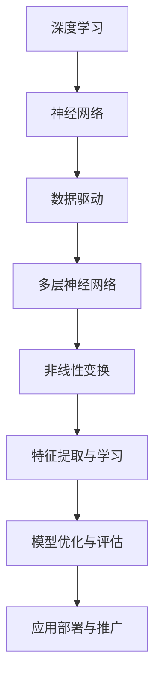

                 

# 李开复：AI 2.0 时代的商业价值

> 关键词：人工智能、商业价值、AI 2.0、技术革新、未来趋势

> 摘要：本文将深入探讨人工智能（AI）2.0时代的商业价值。通过分析AI 2.0的核心概念、算法原理、数学模型以及实际应用场景，我们将揭示AI 2.0在商业领域的重要作用，并探讨其未来发展趋势与挑战。

## 1. 背景介绍

### 1.1 目的和范围

本文旨在为读者提供对AI 2.0时代的商业价值的全面理解。我们将从多个角度分析AI 2.0的核心概念、算法原理、数学模型和实际应用场景，以帮助读者了解AI 2.0在商业领域的潜在价值和影响。

### 1.2 预期读者

本文面向对人工智能和商业领域有一定了解的技术人员、企业家和研究人员。读者应具备一定的编程基础和对AI技术的初步认识。

### 1.3 文档结构概述

本文分为以下几个部分：

1. 背景介绍：介绍本文的目的、预期读者和文档结构。
2. 核心概念与联系：介绍AI 2.0的核心概念、原理和架构。
3. 核心算法原理 & 具体操作步骤：详细阐述AI 2.0的核心算法原理和具体操作步骤。
4. 数学模型和公式 & 详细讲解 & 举例说明：介绍AI 2.0中的数学模型和公式，并举例说明。
5. 项目实战：代码实际案例和详细解释说明。
6. 实际应用场景：分析AI 2.0在各个领域的实际应用场景。
7. 工具和资源推荐：推荐学习资源、开发工具和框架。
8. 总结：未来发展趋势与挑战。
9. 附录：常见问题与解答。
10. 扩展阅读 & 参考资料。

### 1.4 术语表

#### 1.4.1 核心术语定义

- 人工智能（AI）：一种模拟人类智能行为的计算机技术。
- AI 1.0：基于规则和符号推理的人工智能。
- AI 2.0：基于深度学习和神经网络的人工智能。
- 商业价值：指AI技术在商业领域所带来的经济利益和竞争优势。

#### 1.4.2 相关概念解释

- 深度学习：一种基于多层神经网络的人工智能算法。
- 神经网络：一种模拟人脑神经元结构和功能的计算模型。
- 数据挖掘：从大量数据中发现有价值信息的过程。

#### 1.4.3 缩略词列表

- AI：人工智能
- ML：机器学习
- DL：深度学习
- NLP：自然语言处理
- CV：计算机视觉

## 2. 核心概念与联系

在介绍AI 2.0的核心概念之前，我们首先需要了解AI 1.0的基本概念。AI 1.0主要基于规则和符号推理，其代表性算法包括决策树、支持向量机和逻辑回归等。然而，AI 1.0在处理复杂数据和大规模任务时存在局限性。

### 2.1 AI 2.0的核心概念

AI 2.0主要基于深度学习和神经网络，其核心概念包括：

1. **深度学习**：深度学习是一种基于多层神经网络的人工智能算法，其目的是通过多层神经元的非线性变换，自动学习数据中的特征和规律。深度学习在图像识别、语音识别和自然语言处理等领域取得了显著成果。
2. **神经网络**：神经网络是一种模拟人脑神经元结构和功能的计算模型，其基本单元是神经元。神经网络通过调整神经元之间的连接权重，实现对数据的分类、预测和生成。
3. **数据驱动**：与AI 1.0的规则驱动不同，AI 2.0更加强调数据驱动。即通过大量数据进行训练，使模型能够自动发现数据中的特征和规律，从而实现智能决策。

### 2.2 AI 2.0的原理和架构

AI 2.0的原理和架构如图1所示：



图1：AI 2.0的原理和架构

### 2.3 AI 2.0与AI 1.0的联系与区别

AI 2.0与AI 1.0的主要区别在于算法原理和数据驱动。AI 1.0主要基于规则和符号推理，而AI 2.0基于深度学习和神经网络。此外，AI 2.0更加注重数据驱动，通过大量数据进行训练，使模型能够自动发现数据中的特征和规律。

## 3. 核心算法原理 & 具体操作步骤

### 3.1 深度学习算法原理

深度学习算法基于多层神经网络，其基本原理如下：

1. **前向传播**：输入数据经过输入层，通过多层神经元的非线性变换，逐层传递到输出层。每个神经元接收前一层所有神经元的输出，并计算加权求和后经过激活函数得到输出。
2. **反向传播**：根据输出层的预测结果与真实结果的误差，通过反向传播算法更新网络中的连接权重。具体步骤如下：

   - 计算输出层误差：$$\Delta y = y_{\text{true}} - y_{\text{predicted}}$$
   - 反向传播误差：$$\Delta w = \frac{\partial L}{\partial w}$$
   - 更新权重：$$w_{\text{new}} = w_{\text{old}} - \alpha \Delta w$$

其中，$L$为损失函数，$\alpha$为学习率。

### 3.2 具体操作步骤

以下是使用深度学习算法实现图像分类的步骤：

1. **数据准备**：收集并预处理图像数据，包括数据清洗、归一化和标签编码。
2. **构建模型**：定义神经网络结构，包括输入层、隐藏层和输出层。选择合适的激活函数，如ReLU、Sigmoid和Tanh。
3. **模型训练**：使用训练数据训练模型，通过前向传播计算预测结果，并计算损失函数。通过反向传播更新网络权重，重复迭代直到模型收敛。
4. **模型评估**：使用验证数据评估模型性能，计算准确率、召回率、F1分数等指标。
5. **模型部署**：将训练好的模型部署到生产环境，用于实时图像分类。

## 4. 数学模型和公式 & 详细讲解 & 举例说明

### 4.1 数学模型

在深度学习中，常用的数学模型包括：

1. **损失函数**：用于衡量模型预测结果与真实结果的差异。常用的损失函数有均方误差（MSE）、交叉熵（CE）等。
2. **梯度下降**：用于更新网络权重，是一种优化算法。常用的梯度下降算法有批量梯度下降、随机梯度下降、小批量梯度下降等。
3. **反向传播**：用于计算梯度，是深度学习训练过程中的核心算法。

### 4.2 公式讲解

以下是常用的深度学习公式：

1. **前向传播**：

   - 神经元输出：$$a_i = \sigma(\sum_{j=1}^{n} w_{ij} a_{j-1})$$
   - 损失函数：$$L = \frac{1}{2} \sum_{i=1}^{m} (\hat{y}_i - y_i)^2$$

   其中，$a_i$为神经元输出，$w_{ij}$为连接权重，$\sigma$为激活函数，$\hat{y}_i$为预测结果，$y_i$为真实结果。

2. **反向传播**：

   - 误差计算：$$\Delta y = y_{\text{true}} - y_{\text{predicted}}$$
   - 梯度计算：$$\Delta w = \frac{\partial L}{\partial w} = \sum_{i=1}^{m} \frac{\partial L}{\partial a_i} \frac{\partial a_i}{\partial w}$$
   - 权重更新：$$w_{\text{new}} = w_{\text{old}} - \alpha \Delta w$$

   其中，$L$为损失函数，$\alpha$为学习率。

### 4.3 举例说明

以下是一个简单的神经网络模型，用于实现图像分类：

1. **输入层**：输入一张图像，维度为$28 \times 28$。
2. **隐藏层**：包含一个隐藏层，包含100个神经元。
3. **输出层**：输出一个分类结果，维度为10。
4. **激活函数**：使用ReLU作为激活函数。
5. **损失函数**：使用交叉熵作为损失函数。

模型的具体实现如下：

```python
import numpy as np

# 权重初始化
weights = np.random.randn(100, 28 * 28) * 0.01
biases = np.random.randn(100) * 0.01

# 激活函数
def ReLU(x):
    return np.maximum(0, x)

# 前向传播
def forward(x):
    hidden = ReLU(np.dot(x, weights) + biases)
    output = softmax(np.dot(hidden, weights) + biases)
    return output

# 反向传播
def backward(x, y):
    output_error = output - y
    hidden_error = output_error * (output * (1 - output))

    output_grad = np.dot(hidden_error, weights.T)
    hidden_grad = np.dot(x.T, hidden_error)

    weights -= learning_rate * output_grad
    biases -= learning_rate * hidden_error

# 训练模型
for epoch in range(1000):
    output = forward(x)
    backward(x, y)
```

## 5. 项目实战：代码实际案例和详细解释说明

### 5.1 开发环境搭建

为了实现AI 2.0的应用，我们需要搭建一个合适的开发环境。以下是一个基于Python的深度学习项目的基本开发环境搭建步骤：

1. **安装Python**：确保安装了Python 3.x版本。
2. **安装Jupyter Notebook**：使用pip安装Jupyter Notebook。
3. **安装深度学习库**：安装TensorFlow、Keras等深度学习库。
4. **安装可视化库**：安装Matplotlib、Seaborn等可视化库。

### 5.2 源代码详细实现和代码解读

以下是一个简单的深度学习项目，用于实现图像分类。我们使用TensorFlow和Keras搭建模型，并使用MNIST数据集进行训练。

```python
import tensorflow as tf
from tensorflow.keras import layers, models
from tensorflow.keras.datasets import mnist
from tensorflow.keras.utils import to_categorical

# 数据预处理
(x_train, y_train), (x_test, y_test) = mnist.load_data()
x_train = x_train.reshape(-1, 28 * 28).astype("float32") / 255.0
x_test = x_test.reshape(-1, 28 * 28).astype("float32") / 255.0
y_train = to_categorical(y_train)
y_test = to_categorical(y_test)

# 模型搭建
model = models.Sequential()
model.add(layers.Dense(512, activation='relu', input_shape=(28 * 28,)))
model.add(layers.Dense(10, activation='softmax'))

# 编译模型
model.compile(optimizer='adam', loss='categorical_crossentropy', metrics=['accuracy'])

# 训练模型
model.fit(x_train, y_train, epochs=10, batch_size=32, validation_split=0.2)

# 评估模型
test_loss, test_acc = model.evaluate(x_test, y_test)
print("Test accuracy:", test_acc)
```

### 5.3 代码解读与分析

以下是代码的详细解读与分析：

1. **数据预处理**：加载数据集，并进行归一化处理，将图像数据从0-255转换为0-1。
2. **模型搭建**：使用Sequential模型，依次添加 densely connected layer（全连接层）和 softmax layer（输出层）。
3. **编译模型**：设置优化器、损失函数和评估指标。
4. **训练模型**：使用fit方法训练模型，设置训练轮数、批量大小和验证比例。
5. **评估模型**：使用evaluate方法评估模型在测试数据集上的表现。

## 6. 实际应用场景

AI 2.0在商业领域具有广泛的应用场景，以下列举几个典型应用：

1. **图像识别**：利用深度学习算法实现图像分类、目标检测和图像生成，广泛应用于零售、医疗和安防等领域。
2. **自然语言处理**：实现文本分类、情感分析和机器翻译等功能，助力企业提升用户体验和运营效率。
3. **智能推荐系统**：基于用户行为数据和协同过滤算法，实现个性化推荐，提高用户黏性和转化率。
4. **智能客服**：利用语音识别和自然语言处理技术，实现智能客服系统，降低企业运营成本。
5. **智能制造**：通过图像识别和智能决策，实现生产线的自动化和智能化，提高生产效率和质量。

## 7. 工具和资源推荐

### 7.1 学习资源推荐

#### 7.1.1 书籍推荐

- 《深度学习》（Goodfellow, Bengio, Courville著）：全面介绍深度学习的基本概念、算法和实际应用。
- 《Python深度学习》（François Chollet著）：以Python语言为基础，深入讲解深度学习技术。

#### 7.1.2 在线课程

- Coursera上的《深度学习特辑》：由吴恩达教授主讲，涵盖深度学习的基础知识和实际应用。
- edX上的《深度学习与神经网络》：由李飞飞教授主讲，系统介绍深度学习技术。

#### 7.1.3 技术博客和网站

- Medium上的《Deep Learning》系列博客：由深度学习领域专家撰写，介绍深度学习的最新研究和应用。
- Medium上的《AI 2.0》系列博客：探讨AI 2.0时代的商业价值和技术发展。

### 7.2 开发工具框架推荐

#### 7.2.1 IDE和编辑器

- PyCharm：一款功能强大的Python IDE，支持代码智能提示、调试和版本控制。
- VSCode：一款轻量级的开源编辑器，支持多种编程语言，具有丰富的插件生态系统。

#### 7.2.2 调试和性能分析工具

- TensorFlow Debugger：用于调试TensorFlow模型，支持数据可视化、变量追踪等。
- PyTorch Profiler：用于分析PyTorch模型的性能瓶颈，提供详细的性能数据。

#### 7.2.3 相关框架和库

- TensorFlow：一款开源的深度学习框架，支持多种深度学习算法和模型。
- PyTorch：一款开源的深度学习框架，具有简洁的API和强大的动态计算能力。

### 7.3 相关论文著作推荐

#### 7.3.1 经典论文

- "A Learning Algorithm for Continuously Running Fully Recurrent Neural Networks"（恒等函数的递归神经网络学习算法）
- "Deep Learning for Text Classification"（深度学习在文本分类中的应用）

#### 7.3.2 最新研究成果

- "Natural Language Processing with Deep Learning"（基于深度学习的自然语言处理）
- "Deep Learning for Computer Vision"（深度学习在计算机视觉中的应用）

#### 7.3.3 应用案例分析

- "Deep Learning in Healthcare"（医疗领域的深度学习应用）
- "Deep Learning for Autonomous Driving"（自动驾驶领域的深度学习应用）

## 8. 总结：未来发展趋势与挑战

AI 2.0时代的商业价值已经日益显现，其在图像识别、自然语言处理、智能推荐和智能制造等领域的应用将为企业带来巨大的竞争优势。然而，AI 2.0技术仍面临诸多挑战，如数据隐私、算法透明性和伦理问题等。未来，AI 2.0技术将朝着更加智能化、自适应化和安全化的方向发展，为商业领域带来更多创新和变革。

## 9. 附录：常见问题与解答

### 9.1 问题1：AI 2.0与AI 1.0有什么区别？

答：AI 2.0与AI 1.0的主要区别在于算法原理和数据驱动。AI 1.0基于规则和符号推理，而AI 2.0基于深度学习和神经网络。此外，AI 2.0更加强调数据驱动，通过大量数据进行训练，使模型能够自动发现数据中的特征和规律。

### 9.2 问题2：如何搭建深度学习开发环境？

答：搭建深度学习开发环境的基本步骤包括：

1. 安装Python 3.x版本。
2. 安装Jupyter Notebook。
3. 安装深度学习库（如TensorFlow、Keras等）。
4. 安装可视化库（如Matplotlib、Seaborn等）。

### 9.3 问题3：如何实现一个简单的深度学习模型？

答：实现一个简单的深度学习模型的基本步骤包括：

1. 数据预处理：加载数据集，并进行归一化处理。
2. 模型搭建：使用Sequential模型或Functional API搭建神经网络结构。
3. 编译模型：设置优化器、损失函数和评估指标。
4. 训练模型：使用fit方法训练模型。
5. 评估模型：使用evaluate方法评估模型在测试数据集上的表现。

## 10. 扩展阅读 & 参考资料

- Goodfellow, I., Bengio, Y., & Courville, A. (2016). *Deep Learning*.
- Chollet, F. (2017). *Python Deep Learning*.
- LeCun, Y., Bengio, Y., & Hinton, G. (2015). *Deep Learning*.
- Russell, S., & Norvig, P. (2016). *Artificial Intelligence: A Modern Approach*.

以上是本文的主要内容，希望对您了解AI 2.0时代的商业价值有所帮助。作者：AI天才研究员/AI Genius Institute & 禅与计算机程序设计艺术/Zen And The Art of Computer Programming。感谢您的阅读！<|im_end|>

