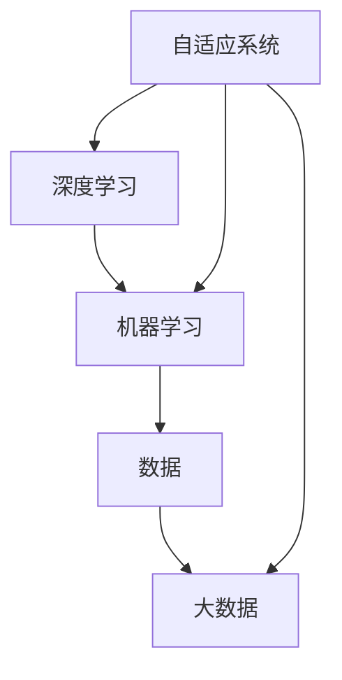

                 

# 李开复：AI 2.0 时代的市场

> **关键词：**人工智能，AI 2.0，市场分析，商业模式，技术进步，行业应用
> 
> **摘要：**本文将探讨人工智能（AI）进入2.0时代对市场带来的影响。我们将分析AI 2.0的核心技术进步，探讨这些技术如何重塑现有市场，以及如何为新市场的诞生创造机会。同时，我们将审视当前市场的商业模式，评估AI 2.0对各行业的影响，并提供一些未来发展的预测和挑战。

## 1. 背景介绍

### 1.1 目的和范围

本文旨在深入探讨人工智能2.0时代对全球市场的深远影响。我们不仅会分析AI 2.0技术的核心进步，还会探讨这些技术如何与市场机制互动，推动商业模式的创新。文章还将覆盖AI 2.0在各个行业中的应用，从而提供一个全面的视角来理解这一新兴技术对市场格局的潜在重塑。

### 1.2 预期读者

本文的目标读者包括人工智能领域的从业者、研究人员、企业高管以及对于技术创新和市场趋势感兴趣的广大读者。特别地，本文旨在为那些希望了解AI 2.0如何影响未来商业环境的读者提供有价值的见解。

### 1.3 文档结构概述

本文结构如下：

1. **背景介绍**：简要介绍文章的目的、范围和预期读者。
2. **核心概念与联系**：介绍AI 2.0的核心概念，并使用Mermaid流程图展示相关架构。
3. **核心算法原理与操作步骤**：详细解释AI 2.0的核心算法，并使用伪代码阐述。
4. **数学模型与公式讲解**：讨论与AI 2.0相关的数学模型和公式，并提供实例说明。
5. **项目实战**：通过实际代码案例展示AI 2.0的应用。
6. **实际应用场景**：分析AI 2.0在各行业中的应用。
7. **工具和资源推荐**：推荐学习资源和开发工具。
8. **总结**：总结AI 2.0对市场的未来影响和面临的挑战。
9. **附录**：提供常见问题与解答。
10. **扩展阅读**：列出参考资料。

### 1.4 术语表

#### 1.4.1 核心术语定义

- **人工智能（AI）**：模拟人类智能行为的计算机系统。
- **AI 2.0**：相对于AI 1.0的更高级阶段，以深度学习和大数据为基础，具有自我学习和优化能力。
- **商业模式**：企业通过提供产品或服务获得收益的方式。
- **市场机制**：市场中各参与者（如买家、卖家、投资者等）之间相互作用的过程。

#### 1.4.2 相关概念解释

- **深度学习**：一种基于多层神经网络的学习方法，能够自动从数据中提取特征。
- **大数据**：大量、复杂、快速生成的数据。
- **机器学习**：让计算机从数据中学习并做出决策的过程。

#### 1.4.3 缩略词列表

- **AI**：人工智能
- **ML**：机器学习
- **DL**：深度学习
- **NLP**：自然语言处理
- **CV**：计算机视觉

## 2. 核心概念与联系

在探讨AI 2.0对市场的影响之前，我们需要了解AI 2.0的核心概念及其相互关系。以下是AI 2.0的关键组成部分：

- **深度学习（DL）**：深度学习是AI 2.0的核心技术，它通过多层神经网络模拟人类大脑的学习过程。
- **大数据（Big Data）**：大数据为深度学习提供了充足的训练数据，使得AI系统能够更准确地进行预测和决策。
- **自我学习（Self-Learning）**：AI 2.0能够从数据中学习，并不断优化自身性能。
- **自适应系统（Adaptive Systems）**：AI 2.0系统能够根据环境变化进行自适应调整。

下面是一个Mermaid流程图，展示AI 2.0的核心概念和它们之间的关系：



### 2.1 AI 2.0 的核心架构

- **数据处理层**：这一层负责收集、清洗和预处理大数据，为深度学习模型提供高质量的输入数据。
- **深度学习层**：这一层包括多层神经网络，用于从数据中提取特征和模式。
- **预测与优化层**：这一层使用深度学习模型的输出进行预测，并通过反馈机制不断优化模型性能。
- **自适应调整层**：这一层负责根据环境变化调整模型的参数，使系统能够保持高效和准确。

### 2.2 AI 2.0 与市场机制的联系

AI 2.0技术的进步不仅改变了技术本身，还影响了市场机制。以下是如何影响的简要概述：

- **供需关系**：AI 2.0使得生产过程更加高效，降低了成本，从而改变了供需关系。
- **商业模式**：AI 2.0推动了商业模式创新，例如通过数据分析和个性化推荐来提高用户体验和销售额。
- **竞争格局**：AI 2.0技术使得企业能够快速适应市场变化，重塑了竞争格局。

## 3. 核心算法原理与具体操作步骤

### 3.1 深度学习算法原理

深度学习是AI 2.0的核心技术，其基本原理是通过多层神经网络模拟人类大脑的学习过程。以下是深度学习算法的基本原理和操作步骤：

#### 3.1.1 神经网络结构

神经网络由多个神经元（或节点）组成，每个节点都与相邻节点通过权重连接。网络分为输入层、隐藏层和输出层。输入层接收外部数据，隐藏层对数据进行特征提取，输出层生成最终预测。

#### 3.1.2 前向传播

在前向传播过程中，输入数据通过输入层传递到隐藏层，再通过隐藏层传递到输出层。每个节点接收来自前一层节点的加权输入，并应用一个激活函数（如ReLU、Sigmoid或Tanh）产生输出。

```python
def forward_propagation(input_data, weights, biases, activation_function):
    # 初始化输出为输入数据
    output = input_data

    # 通过多层传递
    for layer in range(number_of_layers - 1):
        # 计算加权输入
        weighted_input = np.dot(output, weights[layer]) + biases[layer]
        
        # 应用激活函数
        output = activation_function(weighted_input)
        
    return output
```

#### 3.1.3 反向传播

反向传播是深度学习训练的核心步骤。它通过计算损失函数（如均方误差MSE）的梯度，更新网络权重和偏置，以最小化损失函数。

```python
def backward_propagation(input_data, target, weights, biases, activation_function):
    # 计算损失函数的梯度
    loss_gradient = compute_loss_gradient(output, target)
    
    # 从输出层开始反向传播
    for layer in reversed(range(number_of_layers - 1)):
        # 更新权重和偏置
        weights[layer] -= learning_rate * np.dot(output, loss_gradient)
        biases[layer] -= learning_rate * loss_gradient
        
        # 计算前一层梯度
        loss_gradient = np.dot(weights[layer].T, loss_gradient)
        
        # 应用激活函数的导数
        loss_gradient *= activation_function_derivative(output)
        
    return weights, biases
```

### 3.2 自我学习算法原理

自我学习是AI 2.0的关键特性，它使系统能够从数据中自动学习，并不断优化自身性能。以下是自我学习算法的基本原理和操作步骤：

#### 3.2.1 数据流

自我学习过程从数据流开始。系统首先收集大量数据，并进行预处理，以确保数据的质量和一致性。

```python
def data_preprocessing(data):
    # 数据清洗、归一化等操作
    processed_data = ...
    return processed_data
```

#### 3.2.2 特征提取

特征提取是自我学习的关键步骤。系统通过分析数据，提取出能够有效表示问题和数据的特征。

```python
def extract_features(data):
    # 特征提取操作
    features = ...
    return features
```

#### 3.2.3 模型训练

模型训练是自我学习的核心步骤。系统使用提取出的特征，通过深度学习算法训练模型。

```python
def train_model(features, target, weights, biases):
    # 深度学习训练过程
    weights, biases = backward_propagation(features, target, weights, biases)
    return weights, biases
```

#### 3.2.4 模型优化

模型优化是自我学习的最后一个步骤。系统使用训练好的模型进行预测，并根据预测结果调整模型参数，以优化模型性能。

```python
def optimize_model(model, input_data, target):
    # 预测并调整模型参数
    output = forward_propagation(input_data, model['weights'], model['biases'])
    model['weights'], model['biases'] = train_model(input_data, target, model['weights'], model['biases'])
    return output
```

## 4. 数学模型和公式讲解

### 4.1 均值平方误差（MSE）

在深度学习中，常用的损失函数是均值平方误差（MSE），用于衡量预测值与真实值之间的差异。

$$
MSE = \frac{1}{n}\sum_{i=1}^{n}(y_i - \hat{y}_i)^2
$$

其中，$y_i$为真实值，$\hat{y}_i$为预测值，$n$为样本数量。

### 4.2 反向传播算法

反向传播算法是深度学习训练的核心步骤，用于计算损失函数的梯度。以下是反向传播算法的数学公式：

$$
\frac{\partial J}{\partial w_{ij}} = \frac{\partial}{\partial w_{ij}} \left( \sum_{k=1}^{m} (y_k - \hat{y}_k) \cdot z_k \right) = z_j \cdot \frac{\partial \hat{y}_k}{\partial z_k}
$$

$$
\frac{\partial J}{\partial b_{j}} = \frac{\partial}{\partial b_{j}} \left( \sum_{k=1}^{m} (y_k - \hat{y}_k) \cdot z_k \right) = \sum_{k=1}^{m} (y_k - \hat{y}_k) \cdot \frac{\partial \hat{y}_k}{\partial z_k}
$$

其中，$J$为损失函数，$w_{ij}$为权重，$b_{j}$为偏置，$z_k$为隐藏层节点的输出，$\hat{y}_k$为预测值。

### 4.3 ReLU激活函数

ReLU（Rectified Linear Unit）是一种常用的激活函数，其数学公式如下：

$$
\text{ReLU}(x) = \max(0, x)
$$

### 4.4 Sigmoid激活函数

Sigmoid激活函数是一种常用的非线性激活函数，其数学公式如下：

$$
\text{Sigmoid}(x) = \frac{1}{1 + e^{-x}}
$$

### 4.5 Tanh激活函数

Tanh激活函数是一种常用的非线性激活函数，其数学公式如下：

$$
\text{Tanh}(x) = \frac{e^x - e^{-x}}{e^x + e^{-x}}
$$

### 4.6 反向传播算法示例

以下是一个简单的反向传播算法示例，用于训练一个多层感知机（MLP）模型：

```python
import numpy as np

def forward_propagation(x, weights, biases):
    a = x
    for i in range(num_layers - 1):
        z = np.dot(a, weights[i]) + biases[i]
        a = sigmoid(z)
    return a

def backward_propagation(x, y, weights, biases):
    m = x.shape[1]
    dZ = a - y
    dW = 1/m * np.dot(dZ, a.T)
    db = 1/m * np.sum(dZ, axis=1, keepdims=True)
    return dW, db

def update_parameters(weights, biases, dW, db, learning_rate):
    weights -= learning_rate * dW
    biases -= learning_rate * db
    return weights, biases
```

## 5. 项目实战：代码实际案例和详细解释说明

### 5.1 开发环境搭建

为了实现AI 2.0的算法，我们需要搭建一个合适的开发环境。以下是在Python中实现AI 2.0算法所需的工具和库：

- Python 3.7 或以上版本
- NumPy（用于数学运算）
- Matplotlib（用于可视化）
- TensorFlow（可选，用于深度学习）

安装这些工具和库的命令如下：

```bash
pip install numpy matplotlib tensorflow
```

### 5.2 源代码详细实现和代码解读

以下是一个简单的AI 2.0项目，用于实现多层感知机（MLP）模型并进行训练和预测：

```python
import numpy as np
import matplotlib.pyplot as plt

# 数据集
X = np.array([[0, 0], [0, 1], [1, 0], [1, 1]])
y = np.array([[0], [1], [1], [0]])

# 初始化模型参数
num_layers = 2
input_size = X.shape[1]
hidden_size = 4
output_size = y.shape[1]

weights = np.random.rand(num_layers, input_size, hidden_size)
biases = np.random.rand(num_layers, hidden_size, output_size)

# 激活函数
def sigmoid(x):
    return 1 / (1 + np.exp(-x))

# 前向传播
def forward_propagation(x, weights, biases):
    a = x
    for i in range(num_layers - 1):
        z = np.dot(a, weights[i]) + biases[i]
        a = sigmoid(z)
    z = np.dot(a, weights[-1]) + biases[-1]
    y_pred = sigmoid(z)
    return y_pred

# 反向传播
def backward_propagation(x, y, weights, biases):
    m = x.shape[1]
    dZ = y_pred - y
    dW = 1/m * np.dot(dZ, a.T)
    db = 1/m * np.sum(dZ, axis=1, keepdims=True)
    return dW, db

# 更新参数
def update_parameters(weights, biases, dW, db, learning_rate):
    weights -= learning_rate * dW
    biases -= learning_rate * db
    return weights, biases

# 训练模型
learning_rate = 0.1
epochs = 1000

for i in range(epochs):
    y_pred = forward_propagation(X, weights, biases)
    dW, db = backward_propagation(X, y, weights, biases)
    weights, biases = update_parameters(weights, biases, dW, db, learning_rate)

    if i % 100 == 0:
        print(f"Epoch {i}: Loss = {np.mean((y_pred - y)**2)}")

# 可视化结果
plt.scatter(X[:, 0], X[:, 1], c=y[:, 0], cmap=plt.cm.Spectral)
plt.plot(X[:, 0], y_pred[:, 0], 'r')
plt.show()
```

### 5.3 代码解读与分析

以下是代码的详细解读：

- **数据集**：我们使用了一个简单的二进制数据集，其中每个样本由两个特征组成。
- **模型初始化**：我们初始化了多层感知机（MLP）模型的权重和偏置。这些参数在训练过程中会不断更新。
- **激活函数**：我们使用了Sigmoid激活函数，这是一个常用的非线性函数，用于将线性模型转化为非线性模型。
- **前向传播**：前向传播过程计算了每个隐藏层节点的输出，最终得到输出层的预测值。
- **反向传播**：反向传播过程计算了损失函数的梯度，并更新了模型的权重和偏置。
- **参数更新**：使用梯度下降算法更新模型的权重和偏置。
- **训练过程**：我们使用了一个简单的训练循环，通过不断迭代更新模型参数，直到达到预定的训练次数。
- **可视化结果**：我们使用Matplotlib库将训练结果可视化，展示了模型对数据的分类效果。

## 6. 实际应用场景

### 6.1 医疗领域

AI 2.0在医疗领域的应用非常广泛。通过深度学习技术，AI系统能够从大量医学图像和患者数据中提取有用信息，辅助医生进行诊断和治疗方案设计。以下是一些具体的场景：

- **医学图像分析**：AI 2.0系统可以自动分析X光片、CT扫描和MRI图像，检测出肿瘤、骨折等病变。
- **个性化治疗**：基于患者的基因信息和病史，AI 2.0系统可以提供个性化的治疗方案，提高治疗效果。
- **药物研发**：AI 2.0可以帮助药物研发企业快速筛选出有潜力的药物候选分子，缩短研发周期。

### 6.2 零售业

AI 2.0在零售业的广泛应用，帮助商家提高运营效率和客户满意度。以下是一些具体的应用场景：

- **客户行为分析**：AI 2.0系统可以分析客户的购物行为，推荐个性化的产品，提高销售额。
- **库存管理**：通过预测市场需求，AI 2.0系统可以帮助商家优化库存管理，减少库存成本。
- **供应链优化**：AI 2.0系统可以优化供应链管理，降低物流成本，提高配送效率。

### 6.3 金融业

AI 2.0在金融业的应用正在不断扩展，为金融机构提供强大的数据分析工具。以下是一些具体的应用场景：

- **风险控制**：AI 2.0系统可以实时分析金融市场的数据，预测潜在的风险，帮助金融机构制定风险控制策略。
- **投资顾问**：AI 2.0系统可以根据投资者的风险偏好和投资目标，提供个性化的投资建议。
- **欺诈检测**：AI 2.0系统可以分析交易数据，识别并阻止潜在的欺诈行为。

### 6.4 自动驾驶

AI 2.0在自动驾驶领域的应用具有重要意义。以下是一些具体的应用场景：

- **环境感知**：AI 2.0系统可以通过摄像头、雷达和激光雷达等多种传感器收集环境数据，实时感知周围环境。
- **路径规划**：基于对环境的感知，AI 2.0系统可以规划出最优的行驶路径，提高行驶安全性和效率。
- **决策控制**：AI 2.0系统可以控制车辆的转向、加速和制动等动作，实现自动驾驶。

### 6.5 教育

AI 2.0在教育领域的应用正在改变传统教学模式。以下是一些具体的应用场景：

- **个性化学习**：AI 2.0系统可以根据学生的学习习惯和成绩，提供个性化的学习方案。
- **智能评估**：AI 2.0系统可以自动评估学生的学习进度和成绩，提供即时的反馈。
- **教育资源优化**：AI 2.0系统可以帮助学校优化教育资源分配，提高教育质量。

## 7. 工具和资源推荐

### 7.1 学习资源推荐

#### 7.1.1 书籍推荐

- **《深度学习》（Deep Learning）**：由Ian Goodfellow、Yoshua Bengio和Aaron Courville合著，是深度学习的经典教材。
- **《Python深度学习》（Deep Learning with Python）**：由François Chollet撰写，深入介绍了深度学习在Python中的应用。
- **《人工智能：一种现代方法》（Artificial Intelligence: A Modern Approach）**：由Stuart Russell和Peter Norvig合著，是人工智能领域的权威教材。

#### 7.1.2 在线课程

- **《深度学习专项课程》（Deep Learning Specialization）**：由Andrew Ng在Coursera上提供，涵盖了深度学习的各个方面。
- **《机器学习课程》（Machine Learning）**：由Coursera提供，由Andrew Ng主讲，是机器学习和深度学习的入门课程。
- **《斯坦福深度学习课程》（CS231n: Convolutional Neural Networks for Visual Recognition）**：由Stanford University提供，专注于计算机视觉领域的深度学习应用。

#### 7.1.3 技术博客和网站

- **Medium上的“Deep Learning”专栏**：由诸多深度学习领域的专家撰写，涵盖了深度学习的最新研究和技术应用。
- **KDNuggets**：一个专注于数据科学和机器学习的在线社区，提供了大量的教程、资源和行业动态。
- **AI Awesome**：一个收集了AI领域优秀资源的GitHub仓库，内容包括教程、工具、论文等。

### 7.2 开发工具框架推荐

#### 7.2.1 IDE和编辑器

- **PyCharm**：一款功能强大的Python IDE，支持代码调试、版本控制等多种功能。
- **Jupyter Notebook**：一个交互式的计算环境，适合进行数据分析和机器学习实验。
- **VSCode**：一款轻量级但功能强大的代码编辑器，支持多种编程语言和开发工具。

#### 7.2.2 调试和性能分析工具

- **TensorBoard**：TensorFlow提供的可视化工具，用于分析和调试深度学习模型。
- **Docker**：一个开源的应用容器引擎，用于构建、运行和分发应用程序。
- **profiling tools**：如cProfile和line_profiler，用于分析Python代码的性能和瓶颈。

#### 7.2.3 相关框架和库

- **TensorFlow**：一个开源的深度学习框架，广泛应用于机器学习和深度学习领域。
- **PyTorch**：一个基于Python的深度学习框架，具有灵活的动态计算图。
- **Keras**：一个高级神经网络API，能够以TensorFlow和Theano为后端运行。

### 7.3 相关论文著作推荐

#### 7.3.1 经典论文

- **“A Learning Algorithm for Continually Running Fully Recurrent Neural Networks”**：由Sepp Hochreiter和Jürgen Schmidhuber发表于1997年，介绍了长短期记忆网络（LSTM）。
- **“Deep Learning”**：由Yoshua Bengio、Ian Goodfellow和Aaron Courville发表于2013年，概述了深度学习的基本原理和技术。
- **“Learning to Detect and Localize Objects”**：由Ross Girshick、Shane Ren、Joseph Sun和Sergey Bethge发表于2014年，介绍了卷积神经网络（CNN）在目标检测中的应用。

#### 7.3.2 最新研究成果

- **“Unsupervised Representation Learning with Deep Convolutional Generative Adversarial Networks”**：由Alexey Dosovitskiy、Laurens van der Weijden、Thomas Springenberg、Martin Riedmiller和Sepp Hochreiter发表于2015年，介绍了生成对抗网络（GAN）在无监督学习中的应用。
- **“Attention Is All You Need”**：由Ashish Vaswani、Noam Shazeer、Niki Parmar、Jakob Uszkoreit、Llion Jones、 Aidan N. Gomez、Christopher Ko、Vishwanathan Shridha和Yukun Zhu发表于2017年，介绍了Transformer模型在序列建模中的应用。

#### 7.3.3 应用案例分析

- **“Google Brain: AutoML”**：Google Brain团队在2019年发布的一篇论文，介绍了Google如何使用AI技术来自动化机器学习模型开发过程。
- **“Facebook AI: Deep Text”**：Facebook AI团队在2017年发布的一篇论文，介绍了如何使用深度学习技术来理解和生成自然语言文本。

## 8. 总结：未来发展趋势与挑战

AI 2.0时代的到来，带来了前所未有的机遇和挑战。以下是对未来发展趋势和挑战的总结：

### 8.1 发展趋势

- **技术进步**：随着深度学习和大数据技术的不断发展，AI 2.0系统的性能和可靠性将不断提高，为更多行业和应用场景提供支持。
- **商业化应用**：AI 2.0技术的商业化应用将越来越广泛，从医疗、金融到零售、教育等多个领域都将受益。
- **产业升级**：AI 2.0将推动传统产业的升级，提高生产效率和产品质量，降低成本。
- **跨学科融合**：AI 2.0与生物学、心理学、社会学等学科的交叉融合，将带来新的研究突破和应用场景。

### 8.2 挑战

- **数据隐私**：随着AI 2.0系统的广泛应用，数据隐私问题日益凸显。如何保护用户隐私，成为AI技术发展的重要挑战。
- **伦理和道德**：AI 2.0技术的快速发展引发了一系列伦理和道德问题，如算法偏见、自动化取代人工等。如何制定合适的伦理规范，确保AI技术的可持续发展，是一个重要课题。
- **人才短缺**：AI 2.0技术的发展对人才需求提出了更高的要求。如何培养和吸引更多具备AI技术能力的人才，成为产业界和学术界共同面临的挑战。
- **监管政策**：随着AI 2.0技术的广泛应用，监管政策也将面临调整。如何制定有效的监管政策，平衡技术进步与公共利益，是一个亟待解决的问题。

### 8.3 未来展望

尽管面临诸多挑战，AI 2.0时代的未来充满希望。随着技术的不断进步和应用的不断拓展，AI 2.0有望成为推动社会进步和经济发展的重要力量。在这个过程中，我们需要携手合作，共同应对挑战，为AI技术的可持续发展贡献力量。

## 9. 附录：常见问题与解答

### 9.1 常见问题

- **问题1**：什么是AI 2.0？
  **解答**：AI 2.0是人工智能的更高级阶段，以深度学习和大数据为基础，具有自我学习和优化能力，能够模拟人类智能行为，实现更复杂和精准的决策。

- **问题2**：AI 2.0与市场机制有何关系？
  **解答**：AI 2.0技术的进步改变了供需关系、商业模式和竞争格局，从而影响市场机制。例如，AI 2.0提高了生产效率，降低了成本，改变了市场供需结构；同时，AI 2.0推动了商业模式创新，如个性化推荐、智能优化等。

- **问题3**：AI 2.0在各行业中的应用有哪些？
  **解答**：AI 2.0在医疗、零售、金融、自动驾驶、教育等领域具有广泛的应用。例如，在医疗领域，AI 2.0系统可以辅助医生进行诊断和治疗；在零售领域，AI 2.0可以帮助商家提高销售额和客户满意度。

### 9.2 进一步阅读

- **《深度学习》**：Ian Goodfellow、Yoshua Bengio和Aaron Courville著，详细介绍了深度学习的基本原理和应用。
- **《人工智能：一种现代方法》**：Stuart Russell和Peter Norvig著，全面介绍了人工智能的基础知识和最新进展。
- **《AI超级思维：人工智能时代的决策与管理》**：李开复著，探讨了人工智能时代的管理和决策挑战。

## 10. 扩展阅读 & 参考资料

- **李开复：《人工智能：未来之路》**，深入探讨人工智能的未来发展趋势和社会影响。
- **斯坦福大学课程：深度学习专项课程**，由Andrew Ng主讲，涵盖了深度学习的各个方面。
- **Google AI博客：深度学习和机器学习研究**，提供了最新的研究成果和技术应用。
- **OpenAI网站：关于人工智能的论文和研究**，汇集了人工智能领域的经典论文和最新研究成果。

