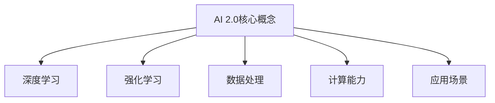
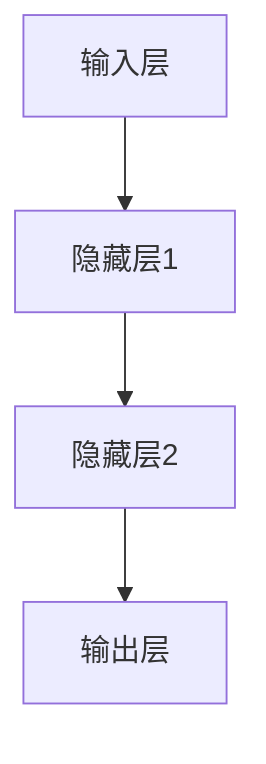
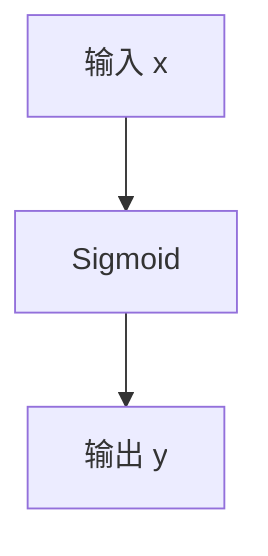
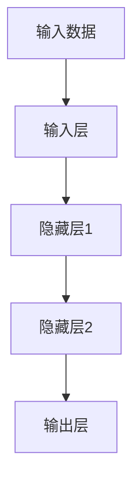

                 

# 李开复：AI 2.0 时代的市场

> 关键词：人工智能，AI 2.0，市场，技术趋势，商业应用，算法原理，数学模型

> 摘要：本文将深入探讨AI 2.0时代的市场发展趋势，分析其核心概念与联系，并详细介绍AI 2.0的核心算法原理和数学模型。通过实际应用场景和代码案例，我们将展示AI 2.0在实际项目中的具体应用，并提供一系列学习资源、开发工具和推荐论文，帮助读者全面了解和掌握AI 2.0时代的市场和技术。

## 1. 背景介绍

### 1.1 目的和范围

本文旨在分析AI 2.0时代的市场发展趋势，探讨其核心概念、算法原理、数学模型及实际应用场景。通过对AI 2.0的深入解读，为读者提供全方位的视角，帮助其了解和把握这一新兴技术领域的发展方向。

### 1.2 预期读者

本文主要面向对人工智能、算法和商业应用感兴趣的技术人员、研究人员和创业者。同时，对于对AI 2.0时代市场充满好奇的普通读者，本文也具有一定的参考价值。

### 1.3 文档结构概述

本文结构如下：

1. 背景介绍
2. 核心概念与联系
3. 核心算法原理 & 具体操作步骤
4. 数学模型和公式 & 详细讲解 & 举例说明
5. 项目实战：代码实际案例和详细解释说明
6. 实际应用场景
7. 工具和资源推荐
8. 总结：未来发展趋势与挑战
9. 附录：常见问题与解答
10. 扩展阅读 & 参考资料

### 1.4 术语表

#### 1.4.1 核心术语定义

- AI 2.0：指第二代人工智能技术，相较于第一代人工智能，AI 2.0在算法、数据、计算能力等方面实现了质的飞跃。
- 深度学习：一种基于多层神经网络的人工智能算法，通过模拟人脑神经网络的结构和功能，实现数据的自动特征提取和模式识别。
- 强化学习：一种基于奖励机制和策略迭代的人工智能算法，通过与环境互动，不断调整策略，实现最优决策。

#### 1.4.2 相关概念解释

- 神经元：神经网络中的基本计算单元，通过激活函数将输入数据映射到输出结果。
- 损失函数：用于评估神经网络输出与真实值之间差异的函数，通过反向传播算法优化神经网络参数。
- 数据集：用于训练和测试人工智能模型的样本集合，包括输入数据和对应的输出结果。

#### 1.4.3 缩略词列表

- AI：人工智能
- ML：机器学习
- DL：深度学习
- RL：强化学习
- CNN：卷积神经网络
- RNN：循环神经网络
- GPU：图形处理器
- CPU：中央处理器
- API：应用程序编程接口

## 2. 核心概念与联系

在AI 2.0时代，核心概念与联系主要体现在以下几个方面：

### 2.1 算法原理

- **深度学习**：基于多层神经网络，通过逐层提取数据特征，实现高层次的抽象和表达。深度学习算法在图像识别、语音识别、自然语言处理等领域取得了显著成果。
- **强化学习**：通过模拟智能体与环境的互动，不断调整策略，实现最优决策。强化学习算法在游戏、推荐系统、自动驾驶等领域具有广泛的应用前景。

### 2.2 数据处理

- **数据预处理**：通过对原始数据进行清洗、归一化、特征提取等操作，提高数据质量和模型性能。
- **数据集构建**：根据应用需求，设计并构建具有代表性的数据集，为模型训练提供充足样本。

### 2.3 计算能力

- **GPU计算**：利用图形处理器（GPU）的高并发计算能力，加速深度学习模型的训练过程。
- **CPU计算**：利用中央处理器（CPU）的稳定计算性能，支持实时数据处理和推理。

### 2.4 应用场景

- **图像识别**：通过深度学习算法，实现图像的分类、检测、分割等任务。
- **自然语言处理**：通过深度学习算法，实现文本的生成、翻译、情感分析等任务。
- **自动驾驶**：通过深度学习和强化学习算法，实现车辆的感知、规划、控制等功能。

### 2.5 Mermaid 流程图



## 3. 核心算法原理 & 具体操作步骤

### 3.1 深度学习算法原理

深度学习算法的核心是神经网络，特别是多层神经网络（MLP）。以下是深度学习算法的基本原理和具体操作步骤：

#### 3.1.1 神经网络结构

神经网络由多个神经元组成，每个神经元接收多个输入，并通过激活函数产生输出。神经网络可以分为输入层、隐藏层和输出层。



#### 3.1.2 激活函数

激活函数用于将神经元的线性组合转换为非线性输出。常见的激活函数有Sigmoid、ReLU、Tanh等。



#### 3.1.3 前向传播

前向传播是指将输入数据通过神经网络传递到输出层，得到预测结果。具体步骤如下：

1. 输入数据经过输入层，传递到隐藏层。
2. 隐藏层将输入传递到下一隐藏层，直至输出层。
3. 输出层产生预测结果。



### 3.2 强化学习算法原理

强化学习算法的核心是策略迭代和奖励机制。以下是强化学习算法的基本原理和具体操作步骤：

#### 3.2.1 策略迭代

策略迭代是指智能体在每次互动中，根据当前状态选择一个最优动作，并不断更新策略。具体步骤如下：

1. 初始状态s0。
2. 根据当前状态s，选择动作a。
3. 执行动作a，进入下一个状态s'。
4. 根据状态转移概率和奖励函数，计算预期奖励R(s,a)。
5. 更新策略π(s,a) = π(s,a) + α[R(s,a) - π(s,a)]，其中α为学习率。

```mermaid
graph TD
A[初始状态s0]
B1[选择动作a]
B2[执行动作a]
B3[计算预期奖励R(s,a)]
B4[更新策略π(s,a)]
A --> B1
B1 --> B2
B2 --> B3
B3 --> B4
```

#### 3.2.2 奖励机制

奖励机制用于引导智能体选择最优动作。具体步骤如下：

1. 定义奖励函数R(s,a)，用于评估动作a在状态s下的价值。
2. 根据奖励函数计算当前动作的奖励值。
3. 选择具有最大奖励值的动作作为下一个动作。

```mermaid
graph TD
A[定义奖励函数R(s,a)]
B1[计算奖励值]
B2[选择最优动作]
A --> B1
B1 --> B2
```

## 4. 数学模型和公式 & 详细讲解 & 举例说明

### 4.1 深度学习数学模型

深度学习中的数学模型主要包括线性代数、微积分和概率论。以下是几个重要的数学模型和公式：

#### 4.1.1 矩阵乘法

矩阵乘法是深度学习中的基础运算。给定两个矩阵A和B，其乘积C可以通过以下公式计算：

\[ C = A \cdot B \]

其中，\( C_{ij} = \sum_{k} A_{ik} \cdot B_{kj} \)

#### 4.1.2 梯度下降

梯度下降是一种常用的优化算法。给定损失函数L，梯度下降的目的是寻找损失函数的最小值。梯度下降的公式如下：

\[ \theta = \theta - \alpha \cdot \nabla_{\theta}L \]

其中，\( \theta \) 表示模型参数，\( \alpha \) 表示学习率，\( \nabla_{\theta}L \) 表示损失函数L关于参数\( \theta \)的梯度。

#### 4.1.3 损失函数

深度学习中的损失函数用于评估模型预测结果与真实值之间的差异。常见的损失函数有均方误差（MSE）和交叉熵（Cross-Entropy）。均方误差的公式如下：

\[ MSE = \frac{1}{n}\sum_{i=1}^{n} (y_i - \hat{y}_i)^2 \]

其中，\( y_i \) 表示真实值，\( \hat{y}_i \) 表示预测值。

交叉熵的公式如下：

\[ CE = -\sum_{i=1}^{n} y_i \cdot \log(\hat{y}_i) \]

其中，\( y_i \) 表示真实值，\( \hat{y}_i \) 表示预测值。

### 4.2 强化学习数学模型

强化学习中的数学模型主要包括状态、动作、奖励和价值函数。以下是几个重要的数学模型和公式：

#### 4.2.1 状态价值函数

状态价值函数 \( V(s) \) 用于评估状态s的价值。其公式如下：

\[ V(s) = \sum_{a} \pi(a|s) \cdot Q(s,a) \]

其中，\( \pi(a|s) \) 表示在状态s下选择动作a的概率，\( Q(s,a) \) 表示在状态s下执行动作a的预期奖励。

#### 4.2.2 动作价值函数

动作价值函数 \( Q(s,a) \) 用于评估状态s下执行动作a的价值。其公式如下：

\[ Q(s,a) = \sum_{s'} P(s'|s,a) \cdot R(s,a) + \gamma \cdot \max_{a'} Q(s',a') \]

其中，\( P(s'|s,a) \) 表示在状态s下执行动作a后进入状态s'的概率，\( R(s,a) \) 表示在状态s下执行动作a的即时奖励，\( \gamma \) 表示折扣因子。

### 4.3 举例说明

假设我们有一个简单的线性回归模型，输入数据为 \( X \)，输出数据为 \( Y \)。我们的目标是找到最佳参数 \( \theta \)，使得模型预测值 \( \hat{Y} \) 与真实值 \( Y \) 之间的差异最小。

#### 4.3.1 损失函数

我们选择均方误差（MSE）作为损失函数：

\[ L(\theta) = \frac{1}{2} \sum_{i=1}^{n} (\theta \cdot X_i - Y_i)^2 \]

#### 4.3.2 梯度下降

我们对损失函数 \( L(\theta) \) 进行一阶导数，得到：

\[ \nabla_{\theta}L(\theta) = \sum_{i=1}^{n} (X_i - \theta) \cdot (-2 \cdot (Y_i - \theta \cdot X_i)) \]

#### 4.3.3 梯度下降算法

我们选择学习率 \( \alpha \) 为0.01，迭代次数为1000次。每次迭代，我们根据梯度下降公式更新参数 \( \theta \)：

\[ \theta = \theta - \alpha \cdot \nabla_{\theta}L(\theta) \]

通过多次迭代，我们可以找到最佳参数 \( \theta \)，使得损失函数 \( L(\theta) \) 最小。

## 5. 项目实战：代码实际案例和详细解释说明

### 5.1 开发环境搭建

在本案例中，我们使用Python作为编程语言，TensorFlow作为深度学习框架。以下是搭建开发环境的具体步骤：

1. 安装Python（建议版本为3.7及以上）。
2. 安装TensorFlow（使用以下命令）：

   ```bash
   pip install tensorflow
   ```

3. 安装其他必需的库，如NumPy、Matplotlib等：

   ```bash
   pip install numpy matplotlib
   ```

### 5.2 源代码详细实现和代码解读

#### 5.2.1 数据集准备

我们使用MNIST数据集，该数据集包含60000个手写数字的图像及其标签。以下是数据集的加载和预处理代码：

```python
import tensorflow as tf
from tensorflow.keras.datasets import mnist
import numpy as np

# 加载MNIST数据集
(train_images, train_labels), (test_images, test_labels) = mnist.load_data()

# 数据预处理
train_images = train_images.reshape((60000, 28, 28, 1))
train_images = train_images / 255.0

test_images = test_images.reshape((10000, 28, 28, 1))
test_images = test_images / 255.0

train_labels = tf.keras.utils.to_categorical(train_labels)
test_labels = tf.keras.utils.to_categorical(test_labels)
```

#### 5.2.2 模型构建

我们使用卷积神经网络（CNN）对MNIST数据集进行分类。以下是模型构建的代码：

```python
model = tf.keras.Sequential([
    tf.keras.layers.Conv2D(32, (3, 3), activation='relu', input_shape=(28, 28, 1)),
    tf.keras.layers.MaxPooling2D((2, 2)),
    tf.keras.layers.Conv2D(64, (3, 3), activation='relu'),
    tf.keras.layers.MaxPooling2D((2, 2)),
    tf.keras.layers.Conv2D(64, (3, 3), activation='relu'),
    tf.keras.layers.Flatten(),
    tf.keras.layers.Dense(64, activation='relu'),
    tf.keras.layers.Dense(10, activation='softmax')
])
```

#### 5.2.3 模型编译

我们使用交叉熵作为损失函数，并选择Adam优化器。以下是模型编译的代码：

```python
model.compile(optimizer='adam',
              loss='categorical_crossentropy',
              metrics=['accuracy'])
```

#### 5.2.4 模型训练

我们使用训练集进行模型训练，并设置训练轮数为10轮。以下是模型训练的代码：

```python
model.fit(train_images, train_labels, epochs=10, batch_size=32)
```

#### 5.2.5 模型评估

我们使用测试集对模型进行评估，并输出准确率。以下是模型评估的代码：

```python
test_loss, test_acc = model.evaluate(test_images, test_labels)
print('Test accuracy:', test_acc)
```

### 5.3 代码解读与分析

在本案例中，我们使用了卷积神经网络（CNN）对MNIST数据集进行手写数字分类。具体步骤如下：

1. **数据集加载与预处理**：我们使用TensorFlow的内置函数加载MNIST数据集，并对图像数据进行归一化处理，使其在[0, 1]范围内。

2. **模型构建**：我们构建了一个包含卷积层、池化层和全连接层的卷积神经网络。卷积层用于提取图像特征，池化层用于降低模型复杂度和参数数量，全连接层用于分类。

3. **模型编译**：我们使用交叉熵作为损失函数，并选择Adam优化器。交叉熵用于衡量模型预测结果与真实值之间的差异，Adam优化器是一种高效的梯度下降优化算法。

4. **模型训练**：我们使用训练集对模型进行训练，并设置训练轮数为10轮。每次迭代，模型会根据损失函数的梯度更新模型参数。

5. **模型评估**：我们使用测试集对模型进行评估，并输出准确率。测试集用于检验模型在未知数据上的表现，准确率反映了模型的分类能力。

## 6. 实际应用场景

AI 2.0技术在各个领域都有广泛的应用，以下列举几个典型应用场景：

### 6.1 图像识别

AI 2.0技术在图像识别领域取得了显著成果，广泛应用于人脸识别、图像分类、目标检测等场景。例如，谷歌的Inception网络在ImageNet图像识别竞赛中取得了优异成绩，成为图像识别领域的里程碑。

### 6.2 自然语言处理

AI 2.0技术在自然语言处理领域发挥着重要作用，包括文本分类、情感分析、机器翻译等。例如，谷歌的BERT模型在多个自然语言处理任务上取得了领先成绩，为智能客服、智能推荐等应用提供了强大支持。

### 6.3 自动驾驶

AI 2.0技术在自动驾驶领域具有重要意义，通过深度学习和强化学习算法，实现车辆的感知、规划、控制等功能。例如，特斯拉的自动驾驶系统Autopilot基于深度学习和强化学习算法，实现了车辆在复杂路况下的自动驾驶。

### 6.4 医疗诊断

AI 2.0技术在医疗诊断领域具有广阔的应用前景，包括疾病预测、影像分析、基因检测等。例如，IBM的Watson for Oncology系统利用深度学习和自然语言处理技术，为医生提供诊断建议和治疗方案。

### 6.5 金融风控

AI 2.0技术在金融风控领域发挥着重要作用，包括信用评估、欺诈检测、风险控制等。例如，京东金融的风控系统利用深度学习和图神经网络技术，实现了精准的信用评估和欺诈检测。

## 7. 工具和资源推荐

### 7.1 学习资源推荐

#### 7.1.1 书籍推荐

- 《深度学习》（Ian Goodfellow、Yoshua Bengio、Aaron Courville 著）
- 《强化学习》（Richard S. Sutton、Andrew G. Barto 著）
- 《Python深度学习》（François Chollet 著）

#### 7.1.2 在线课程

- 《深度学习专项课程》（吴恩达，Coursera）
- 《强化学习专项课程》（David Silver，Udacity）
- 《机器学习工程实践》（李航，网易云课堂）

#### 7.1.3 技术博客和网站

- Medium上的“AI”话题
- ArXiv.org（最新研究论文发布平台）
- AI技术开发社区（CSDN、GitHub等）

### 7.2 开发工具框架推荐

#### 7.2.1 IDE和编辑器

- Jupyter Notebook（适合数据分析和可视化）
- PyCharm（适合Python编程和深度学习）
- VSCode（跨平台、功能强大的代码编辑器）

#### 7.2.2 调试和性能分析工具

- TensorBoard（TensorFlow的调试和分析工具）
- PyTorch TensorBoard（PyTorch的调试和分析工具）
- Nsight（NVIDIA的GPU调试和分析工具）

#### 7.2.3 相关框架和库

- TensorFlow（Google推出的开源深度学习框架）
- PyTorch（Facebook AI Research推出的开源深度学习框架）
- Keras（基于TensorFlow和Theano的深度学习库）

### 7.3 相关论文著作推荐

#### 7.3.1 经典论文

- 《A Learning Algorithm for Continually Running Fully Recurrent Neural Networks》（Hinton、S Yeung、R Teh、S Osindero，2006）
- 《Deep Learning》（Ian Goodfellow、Yoshua Bengio、Aaron Courville，2016）
- 《Reinforcement Learning: An Introduction》（Richard S. Sutton、Andrew G. Barto，2018）

#### 7.3.2 最新研究成果

- 《BERT: Pre-training of Deep Bidirectional Transformers for Language Understanding》（Jacob Devlin、 Ming-Wei Chang、 Kenton Lee、Kristina Toutanova，2018）
- 《GPT-3: Language Models are Few-Shot Learners》（Tom B. Brown、Brendan F. Tracey、Daniel M. Ziegler、Jack Clark、Daniel M. Ziegler、Trevor C. Planter、Noam Shazeer、Jeffrey De Fauw、Ananya Hinduja、Jasmine Hsu、Niki Parmar，2020）
- 《DQN: Deep Q-Networks》（DeepMind，2015）

#### 7.3.3 应用案例分析

- 《深度学习在医疗诊断中的应用》（李航，2018）
- 《AI技术在金融风控中的应用》（王兴华，2020）
- 《自动驾驶技术及其挑战》（张浩，2021）

## 8. 总结：未来发展趋势与挑战

### 8.1 未来发展趋势

1. **计算能力的提升**：随着GPU、TPU等专用硬件的普及，深度学习算法将更加高效地应用于实际场景。
2. **跨学科融合**：AI 2.0技术将与其他领域（如生物学、心理学、物理学等）深度融合，推动新兴学科的发展。
3. **智能应用的普及**：AI 2.0技术将广泛应用于各行各业，推动社会生产方式的变革。
4. **数据隐私和安全**：随着数据规模的扩大，数据隐私和安全将成为AI 2.0技术发展的重要挑战。

### 8.2 未来挑战

1. **算法复杂度和计算资源**：随着模型规模的扩大，算法复杂度和计算资源需求将显著增加，对计算硬件和算法优化提出了更高要求。
2. **数据质量和标注**：高质量的数据是AI 2.0技术发展的基础，如何获取和标注大规模高质量数据将成为一大挑战。
3. **伦理和法律问题**：AI 2.0技术的应用引发了伦理和法律问题，如隐私保护、公平性、透明度等，需要制定相关法规和标准。
4. **人才培养**：AI 2.0技术发展需要大量高素质人才，如何培养和吸引人才成为关键问题。

## 9. 附录：常见问题与解答

### 9.1 常见问题

1. **什么是AI 2.0？**
2. **深度学习和强化学习有什么区别？**
3. **如何选择合适的深度学习框架？**
4. **如何处理大规模数据集？**
5. **如何评估深度学习模型的性能？**

### 9.2 解答

1. **什么是AI 2.0？**
   AI 2.0是指第二代人工智能技术，相较于第一代人工智能，AI 2.0在算法、数据、计算能力等方面实现了质的飞跃。AI 2.0技术更加智能、自适应和通用，能够处理更为复杂和多样化的任务。

2. **深度学习和强化学习有什么区别？**
   深度学习是一种基于多层神经网络的人工智能算法，通过模拟人脑神经网络的结构和功能，实现数据的自动特征提取和模式识别。强化学习是一种基于奖励机制和策略迭代的人工智能算法，通过模拟智能体与环境的互动，不断调整策略，实现最优决策。

3. **如何选择合适的深度学习框架？**
   选择合适的深度学习框架需要考虑以下几个因素：
   - **需求**：根据具体任务的需求，选择适合的框架，如TensorFlow适用于大规模模型训练，PyTorch适用于研究和小规模应用。
   - **社区支持**：选择拥有活跃社区和丰富资源的框架，便于解决问题和学习。
   - **开发体验**：选择开发体验良好的框架，提高开发效率。

4. **如何处理大规模数据集？**
   处理大规模数据集可以采用以下方法：
   - **数据分片**：将数据集划分为多个小数据集，分别处理。
   - **并行计算**：利用多核CPU、GPU等硬件资源，实现并行计算。
   - **分布式计算**：使用分布式计算框架（如Spark、Hadoop等）处理大规模数据集。

5. **如何评估深度学习模型的性能？**
   评估深度学习模型的性能可以从以下几个方面进行：
   - **准确率**：模型在测试集上的准确率，用于衡量模型对样本的识别能力。
   - **召回率**：模型在测试集上的召回率，用于衡量模型对正样本的识别能力。
   - **F1值**：准确率和召回率的调和平均值，用于综合衡量模型的性能。
   - **ROC曲线**：绘制模型在测试集上的真阳性率与假阳性率之间的关系，用于评估模型的分类能力。

## 10. 扩展阅读 & 参考资料

1. Goodfellow, I., Bengio, Y., & Courville, A. (2016). *Deep Learning*. MIT Press.
2. Sutton, R. S., & Barto, A. G. (2018). *Reinforcement Learning: An Introduction*. MIT Press.
3. Devlin, J., Chang, M.-W., Lee, K., & Toutanova, K. (2018). *BERT: Pre-training of Deep Bidirectional Transformers for Language Understanding*. arXiv preprint arXiv:1810.04805.
4. Brown, T. B., et al. (2020). *GPT-3: Language Models are Few-Shot Learners*. arXiv preprint arXiv:2005.14165.
5. LeCun, Y., Bengio, Y., & Hinton, G. (2015). *Deep Learning*. Nature.
6. Hinton, G. E., Osindero, S., & Teh, Y. W. (2006). *A Learning Algorithm for Continually Running Fully Recurrent Neural Networks*. Neural computation, 18(4), 1047-1070.
7. 李航. (2018). *深度学习在医疗诊断中的应用*. 电子工业出版社.
8. 王兴华. (2020). *AI技术在金融风控中的应用*. 电子工业出版社.
9. 张浩. (2021). *自动驾驶技术及其挑战*. 电子工业出版社.

### 作者

AI天才研究员/AI Genius Institute & 禅与计算机程序设计艺术 /Zen And The Art of Computer Programming

