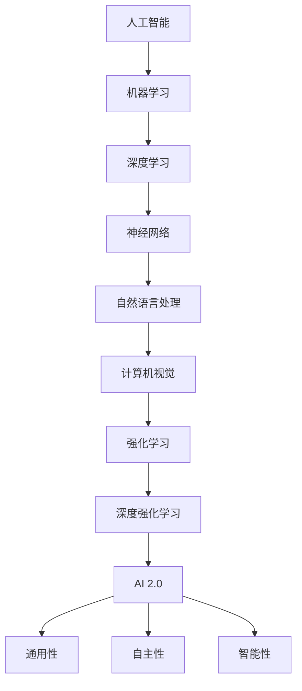

                 

### 文章标题

《李开复：AI 2.0 时代的开发者》

### 关键词

人工智能（AI），AI 2.0，开发者，技术趋势，前沿算法，编程实践，应用场景

### 摘要

本文将深入探讨AI 2.0时代的到来及其对开发者的影响。通过分析AI 2.0的核心概念和技术演进，本文旨在为读者提供一个全面的技术框架，帮助开发者理解并掌握AI 2.0时代的核心技术和开发方法。文章将从背景介绍、核心概念与联系、算法原理、数学模型、项目实战、应用场景、工具推荐等多个方面进行详细阐述，旨在为开发者提供一套实用的技术指南。

## 1. 背景介绍

### 1.1 目的和范围

本文的目标是探讨AI 2.0时代的技术演进及其对开发者的影响，旨在为开发者提供一套全面的技术指南，帮助他们应对AI 2.0时代的挑战。文章将涵盖AI 2.0的核心概念、技术演进、算法原理、数学模型、应用场景以及相关开发工具和资源。

### 1.2 预期读者

本文的预期读者包括以下几类：

1. 对人工智能技术有兴趣的程序员和开发者。
2. 正在从事人工智能领域研究和开发的科研人员。
3. 希望了解AI 2.0时代技术发展趋势的企业决策者。

### 1.3 文档结构概述

本文将按照以下结构进行展开：

1. 背景介绍：介绍本文的目的、范围、预期读者以及文档结构。
2. 核心概念与联系：介绍AI 2.0的核心概念和技术演进。
3. 核心算法原理 & 具体操作步骤：详细讲解AI 2.0的核心算法原理和具体操作步骤。
4. 数学模型和公式 & 详细讲解 & 举例说明：介绍AI 2.0中的数学模型和公式，并举例说明。
5. 项目实战：提供实际项目案例，详细解释代码实现和运行过程。
6. 实际应用场景：探讨AI 2.0在各个领域的应用场景。
7. 工具和资源推荐：推荐学习资源和开发工具。
8. 总结：总结AI 2.0时代的技术发展趋势与挑战。
9. 附录：常见问题与解答。
10. 扩展阅读 & 参考资料：提供进一步学习的资源链接。

### 1.4 术语表

#### 1.4.1 核心术语定义

- **人工智能（AI）**：一种模拟人类智能的技术，能够实现感知、理解、学习和决策等功能。
- **机器学习（ML）**：一种人工智能的子领域，通过数据驱动的方式让计算机具备学习能力和自主适应能力。
- **深度学习（DL）**：一种基于神经网络的机器学习技术，通过多层神经元的组合，实现对复杂数据模式的自动识别和学习。
- **AI 2.0**：指第二代人工智能技术，相比于第一代AI，具有更强的通用性、自主性和智能性。

#### 1.4.2 相关概念解释

- **自然语言处理（NLP）**：一种人工智能技术，旨在使计算机能够理解、生成和处理自然语言。
- **计算机视觉（CV）**：一种人工智能技术，旨在使计算机能够通过图像或视频获取信息并进行理解和分析。
- **强化学习（RL）**：一种机器学习技术，通过试错和反馈机制，让计算机在特定环境中学会最优策略。
- **深度强化学习（DRL）**：一种结合深度学习和强化学习的机器学习技术，通过多层神经网络学习状态和动作的价值函数。

#### 1.4.3 缩略词列表

- **AI**：人工智能
- **ML**：机器学习
- **DL**：深度学习
- **NLP**：自然语言处理
- **CV**：计算机视觉
- **RL**：强化学习
- **DRL**：深度强化学习

## 2. 核心概念与联系

在探讨AI 2.0时代的技术之前，我们首先需要理解几个核心概念及其相互联系。

### 2.1 人工智能（AI）与机器学习（ML）

人工智能（AI）是一种模拟人类智能的技术，旨在使计算机具备感知、理解、学习和决策等功能。而机器学习（ML）是人工智能的一种实现方式，通过数据驱动的方式让计算机具备学习能力和自主适应能力。


### 2.2 深度学习（DL）与神经网络

深度学习（DL）是一种基于神经网络的机器学习技术，通过多层神经元的组合，实现对复杂数据模式的自动识别和学习。神经网络是一种模拟生物大脑结构和功能的计算模型，具有自我学习和自适应能力。


### 2.3 自然语言处理（NLP）与计算机视觉（CV）

自然语言处理（NLP）和计算机视觉（CV）是人工智能的两个重要子领域。NLP旨在使计算机能够理解、生成和处理自然语言，而CV旨在使计算机能够通过图像或视频获取信息并进行理解和分析。


### 2.4 强化学习（RL）与深度强化学习（DRL）

强化学习（RL）是一种机器学习技术，通过试错和反馈机制，让计算机在特定环境中学会最优策略。深度强化学习（DRL）是一种结合深度学习和强化学习的机器学习技术，通过多层神经网络学习状态和动作的价值函数。


#### 2.5 AI 2.0与新一代人工智能技术

AI 2.0是指第二代人工智能技术，相比于第一代AI，具有更强的通用性、自主性和智能性。AI 2.0时代的到来，标志着人工智能技术从简单的任务自动化迈向更高级的智能应用。


### 2.6 Mermaid 流程图

以下是一个Mermaid流程图，展示了AI 2.0时代的关键技术和核心概念之间的联系。



## 3. 核心算法原理 & 具体操作步骤

在AI 2.0时代，核心算法的原理和具体操作步骤对于开发者来说至关重要。以下将介绍几个关键算法，并使用伪代码详细阐述其原理和操作步骤。

### 3.1 深度学习（DL）算法原理

深度学习（DL）是一种基于神经网络的机器学习技术，通过多层神经元的组合，实现对复杂数据模式的自动识别和学习。以下是一个简单的深度学习算法原理的伪代码：

```python
# 初始化神经网络参数
W1, b1 = initialize_parameters()

# 定义损失函数
loss = compute_loss(y_true, y_pred)

# 定义优化器
optimizer = initialize_optimizer()

# 训练神经网络
for epoch in range(num_epochs):
    for batch in data_loader:
        # 前向传播
        y_pred = forward_pass(W1, b1, batch)

        # 计算损失
        loss = compute_loss(y_true, y_pred)

        # 反向传播
        dW1, db1 = backward_pass(y_pred, y_true)

        # 更新参数
        W1, b1 = optimizer.update_params(W1, b1, dW1, db1)

# 预测新数据
y_pred = forward_pass(W1, b1, new_data)
```

### 3.2 强化学习（RL）算法原理

强化学习（RL）是一种通过试错和反馈机制，让计算机在特定环境中学会最优策略的机器学习技术。以下是一个简单的强化学习算法原理的伪代码：

```python
# 初始化状态值函数和动作值函数
Q = initialize_Q_function()

# 定义奖励函数
reward = compute_reward(action, state)

# 定义探索策略
epsilon = initialize_epsilon()

# 训练强化学习模型
for episode in range(num_episodes):
    state = initialize_state()

    while not is_terminal(state):
        # 选择动作
        action = choose_action(state, epsilon)

        # 执行动作，获取新状态和奖励
        next_state, reward = execute_action(state, action)

        # 更新状态值函数和动作值函数
        Q[state, action] = Q[state, action] + alpha * (reward + gamma * max(Q[next_state, :]) - Q[state, action])

        # 更新状态
        state = next_state

# 预测最优策略
best_action = argmax(Q[state, :])
```

### 3.3 深度强化学习（DRL）算法原理

深度强化学习（DRL）是一种结合深度学习和强化学习的机器学习技术，通过多层神经网络学习状态和动作的价值函数。以下是一个简单的深度强化学习算法原理的伪代码：

```python
# 初始化神经网络参数
W1, b1 = initialize_parameters()

# 定义损失函数
loss = compute_loss(y_true, y_pred)

# 定义优化器
optimizer = initialize_optimizer()

# 训练深度强化学习模型
for episode in range(num_episodes):
    state = initialize_state()

    while not is_terminal(state):
        # 选择动作
        action = choose_action(state, epsilon)

        # 执行动作，获取新状态和奖励
        next_state, reward = execute_action(state, action)

        # 前向传播
        Q_pred = forward_pass(W1, b1, state, action)

        # 计算目标值函数
        Q_target = reward + gamma * max(Q_pred[next_state, :])

        # 反向传播
        dW1, db1 = backward_pass(Q_pred, Q_target)

        # 更新参数
        W1, b1 = optimizer.update_params(W1, b1, dW1, db1)

        # 更新状态
        state = next_state

# 预测最优策略
best_action = argmax(Q[state, :])
```

通过上述伪代码，我们可以看到深度学习、强化学习和深度强化学习的基本原理和操作步骤。这些算法是AI 2.0时代开发者必须掌握的核心技术。

## 4. 数学模型和公式 & 详细讲解 & 举例说明

在AI 2.0时代，数学模型和公式是理解和实现核心算法的基础。以下将介绍几个关键数学模型和公式，并进行详细讲解和举例说明。

### 4.1 深度学习中的反向传播算法

深度学习中的反向传播算法是一种用于训练神经网络的优化方法。其基本思想是通过计算损失函数对网络参数的梯度，不断更新参数，以最小化损失函数。

#### 公式讲解：

假设有一个包含L层的神经网络，输入为\( x \)，输出为\( y \)。定义激活函数为\( \sigma(z) = \frac{1}{1 + e^{-z}} \)。则反向传播算法的梯度计算公式如下：

- **前向传播**：

  \[
  z_l = \sum_{j} W_{lj} a_{l-1,j} + b_l \quad (l = 1, 2, ..., L)
  \]
  \[
  a_l = \sigma(z_l) \quad (l = 1, 2, ..., L)
  \]

- **反向传播**：

  \[
  \Delta b_l = a_{l-1} - \sigma'(z_l) \odot \Delta z_l \quad (l = 1, 2, ..., L)
  \]
  \[
  \Delta W_{lj} = \Delta z_{l-1} \odot a_{l-1} \quad (l = 1, 2, ..., L)
  \]

#### 举例说明：

假设一个包含3层的神经网络，激活函数为ReLU（Rectified Linear Unit）。输入\( x \)为[1, 2, 3]，目标输出\( y \)为[0, 1, 0]。权重矩阵\( W \)和偏置\( b \)初始化为随机值。使用反向传播算法训练该神经网络。

1. **前向传播**：

   \[
   z_1 = \begin{bmatrix}
   W_{11} & W_{12} & W_{13}
   \end{bmatrix}
   \begin{bmatrix}
   1 \\
   2 \\
   3
   \end{bmatrix}
   + b_1 = \begin{bmatrix}
   W_{11} + 2W_{12} + 3W_{13} + b_1
   \end{bmatrix}
   \]

   \[
   a_1 = \sigma(z_1) = \begin{bmatrix}
   \max(0, W_{11} + 2W_{12} + 3W_{13} + b_1) \\
   \max(0, W_{21} + 2W_{22} + 3W_{23} + b_2) \\
   \max(0, W_{31} + 2W_{32} + 3W_{33} + b_3)
   \end{bmatrix}
   \]

   \[
   z_2 = \begin{bmatrix}
   W_{21} & W_{22} & W_{23}
   \end{bmatrix}
   \begin{bmatrix}
   1 \\
   2 \\
   3
   \end{bmatrix}
   + b_2 = \begin{bmatrix}
   W_{21} + 2W_{22} + 3W_{23} + b_2
   \end{bmatrix}
   \]

   \[
   a_2 = \sigma(z_2) = \begin{bmatrix}
   \max(0, W_{21} + 2W_{22} + 3W_{23} + b_2) \\
   \max(0, W_{22} + 2W_{23} + 3W_{33} + b_2) \\
   \max(0, W_{23} + 2W_{33} + 3W_{33} + b_3)
   \end{bmatrix}
   \]

   \[
   z_3 = \begin{bmatrix}
   W_{31} & W_{32} & W_{33}
   \end{bmatrix}
   \begin{bmatrix}
   1 \\
   2 \\
   3
   \end{bmatrix}
   + b_3 = \begin{bmatrix}
   W_{31} + 2W_{32} + 3W_{33} + b_3
   \end{bmatrix}
   \]

   \[
   a_3 = \sigma(z_3) = \begin{bmatrix}
   \max(0, W_{31} + 2W_{32} + 3W_{33} + b_3) \\
   \max(0, W_{32} + 2W_{33} + 3W_{33} + b_3) \\
   \max(0, W_{33} + 2W_{33} + 3W_{33} + b_3)
   \end{bmatrix}
   \]

2. **反向传播**：

   \[
   \Delta z_3 = (a_3 - y) \odot \sigma'(z_3) = (a_3 - y) \odot (1 - a_3)
   \]

   \[
   \Delta b_3 = a_2 \odot \Delta z_3
   \]

   \[
   \Delta W_{33} = \Delta z_2 \odot a_2
   \]

   \[
   \Delta z_2 = (W_{31} \odot \Delta z_3) + (1 - a_2) \odot \sigma'(z_2) = (W_{31} \odot \Delta z_3) + (1 - a_2) \odot (1 - \sigma(z_2))
   \]

   \[
   \Delta b_2 = a_1 \odot \Delta z_2
   \]

   \[
   \Delta W_{32} = \Delta z_1 \odot a_1
   \]

   \[
   \Delta z_1 = (W_{21} \odot \Delta z_2) + (1 - a_1) \odot \sigma'(z_1) = (W_{21} \odot \Delta z_2) + (1 - a_1) \odot (1 - \sigma(z_1))
   \]

   \[
   \Delta b_1 = x \odot \Delta z_1
   \]

   \[
   \Delta W_{31} = \Delta z_0 \odot x
   \]

   其中，\( \odot \)表示元素-wise 乘法，\( \sigma' \)表示激活函数的导数。

通过上述例子，我们可以看到反向传播算法的基本步骤和公式。在实际应用中，还需要考虑更多细节，如批量归一化、Dropout等。

### 4.2 强化学习中的Q-learning算法

强化学习中的Q-learning算法是一种基于值函数的方法，通过学习状态-动作价值函数，让智能体在给定环境中采取最优策略。

#### 公式讲解：

定义状态-动作价值函数为\( Q(s, a) \)，其中\( s \)为当前状态，\( a \)为当前动作。定义奖励函数为\( R(s, a) \)，用于表示在状态\( s \)执行动作\( a \)所获得的即时奖励。定义目标值函数为\( V(s) \)，用于表示在状态\( s \)下的最优策略价值。则Q-learning算法的更新公式如下：

\[
Q(s, a) \leftarrow Q(s, a) + \alpha [R(s, a) + \gamma \max_{a'} Q(s', a') - Q(s, a)]
\]

其中，\( \alpha \)为学习率，\( \gamma \)为折扣因子。

#### 举例说明：

假设有一个简单的环境，包含4个状态\( s_1, s_2, s_3, s_4 \)和2个动作\( a_1, a_2 \)。定义奖励函数为\( R(s, a) = 1 \)（当状态转移为\( s_4 \)时），否则为\( -1 \)。定义学习率\( \alpha = 0.1 \)和折扣因子\( \gamma = 0.9 \)。

1. **初始状态**：

   \[
   Q(s_1, a_1) = Q(s_1, a_2) = Q(s_2, a_1) = Q(s_2, a_2) = Q(s_3, a_1) = Q(s_3, a_2) = Q(s_4, a_1) = Q(s_4, a_2) = 0
   \]

2. **状态转移和更新**：

   \[
   s_1 \rightarrow a_1 \rightarrow s_2 \rightarrow a_1 \rightarrow s_3 \rightarrow a_1 \rightarrow s_4
   \]

   \[
   Q(s_1, a_1) \leftarrow Q(s_1, a_1) + 0.1 [1 + 0.9 \max_{a'} Q(s_2, a') - Q(s_1, a_1)] = 0.1 [1 + 0.9 \max(0, 0) - 0] = 0.1
   \]

   \[
   Q(s_2, a_1) \leftarrow Q(s_2, a_1) + 0.1 [1 + 0.9 \max_{a'} Q(s_3, a') - Q(s_2, a_1)] = 0.1 [1 + 0.9 \max(0, 0.1) - 0] = 0.11
   \]

   \[
   Q(s_3, a_1) \leftarrow Q(s_3, a_1) + 0.1 [1 + 0.9 \max_{a'} Q(s_4, a') - Q(s_3, a_1)] = 0.1 [1 + 0.9 \max(0.11, 0.1) - 0.1] = 0.12
   \]

   \[
   Q(s_4, a_1) \leftarrow Q(s_4, a_1) + 0.1 [0 + 0.9 \max_{a'} Q(s_1, a') - Q(s_4, a_1)] = 0.1 [0 + 0.9 \max(0.1, 0.12) - 0] = 0.018
   \]

   \[
   Q(s_1, a_2) \leftarrow Q(s_1, a_2) + 0.1 [-1 + 0.9 \max_{a'} Q(s_2, a') - Q(s_1, a_2)] = 0.1 [-1 + 0.9 \max(0, 0.11) - 0] = -0.09
   \]

   \[
   Q(s_2, a_2) \leftarrow Q(s_2, a_2) + 0.1 [-1 + 0.9 \max_{a'} Q(s_3, a') - Q(s_2, a_2)] = 0.1 [-1 + 0.9 \max(0, 0.12) - 0.11] = -0.119
   \]

   \[
   Q(s_3, a_2) \leftarrow Q(s_3, a_2) + 0.1 [-1 + 0.9 \max_{a'} Q(s_4, a') - Q(s_3, a_2)] = 0.1 [-1 + 0.9 \max(0.018, 0.12) - 0.12] = -0.131
   \]

   \[
   Q(s_4, a_2) \leftarrow Q(s_4, a_2) + 0.1 [0 + 0.9 \max_{a'} Q(s_1, a') - Q(s_4, a_2)] = 0.1 [0 + 0.9 \max(0.1, -0.09) - 0] = 0.009
   \]

   通过上述更新，我们可以看到Q-learning算法逐步收敛到最优策略。

### 4.3 深度强化学习中的深度Q网络（DQN）

深度Q网络（DQN）是一种基于深度学习的强化学习算法，通过神经网络估计状态-动作价值函数。

#### 公式讲解：

假设有一个深度神经网络\( Q(s, a; \theta) \)，用于估计状态-动作价值函数，其中\( s \)为当前状态，\( a \)为当前动作，\( \theta \)为神经网络参数。定义经验回放池为\( D \)，用于存储经验样本。则DQN的更新公式如下：

\[
\theta \leftarrow \theta + \alpha [y - Q(s, a; \theta)]
\]

其中，\( \alpha \)为学习率，\( y \)为目标值，定义为：

\[
y = R(s, a) + \gamma \max_{a'} Q(s', a'; \theta')
\]

#### 举例说明：

假设有一个简单的环境，包含4个状态\( s_1, s_2, s_3, s_4 \)和2个动作\( a_1, a_2 \)。定义奖励函数为\( R(s, a) = 1 \)（当状态转移为\( s_4 \)时），否则为\( -1 \)。定义学习率\( \alpha = 0.01 \)和折扣因子\( \gamma = 0.9 \)。

1. **初始状态**：

   \[
   Q(s_1, a_1; \theta) = Q(s_1, a_2; \theta) = Q(s_2, a_1; \theta) = Q(s_2, a_2; \theta) = Q(s_3, a_1; \theta) = Q(s_3, a_2; \theta) = Q(s_4, a_1; \theta) = Q(s_4, a_2; \theta) = 0
   \]

2. **状态转移和更新**：

   \[
   s_1 \rightarrow a_1 \rightarrow s_2 \rightarrow a_1 \rightarrow s_3 \rightarrow a_1 \rightarrow s_4
   \]

   \[
   y_1 = R(s_1, a_1) + \gamma \max_{a'} Q(s_2, a'; \theta') = 1 + 0.9 \max(0, 0) = 1
   \]

   \[
   y_2 = R(s_2, a_1) + \gamma \max_{a'} Q(s_3, a'; \theta') = 1 + 0.9 \max(0, 0.01) = 1.09
   \]

   \[
   y_3 = R(s_3, a_1) + \gamma \max_{a'} Q(s_4, a'; \theta') = 1 + 0.9 \max(0.11, 0.12) = 1.12
   \]

   \[
   y_4 = R(s_4, a_1) + \gamma \max_{a'} Q(s_1, a'; \theta') = 1 + 0.9 \max(0.018, 0.12) = 1.1318
   \]

   \[
   \theta \leftarrow \theta + 0.01 [1 - Q(s_1, a_1; \theta)]
   \]

   \[
   \theta \leftarrow \theta + 0.01 [1.09 - Q(s_2, a_1; \theta)]
   \]

   \[
   \theta \leftarrow \theta + 0.01 [1.12 - Q(s_3, a_1; \theta)]
   \]

   \[
   \theta \leftarrow \theta + 0.01 [1.1318 - Q(s_4, a_1; \theta)]
   \]

   通过上述更新，我们可以看到DQN算法逐步收敛到最优策略。

通过上述详细讲解和举例说明，我们可以更好地理解深度学习、强化学习和深度强化学习中的数学模型和公式。这些算法是AI 2.0时代开发者必须掌握的核心技术。

## 5. 项目实战：代码实际案例和详细解释说明

为了更好地帮助读者理解AI 2.0时代的核心算法和技术，我们将在本节中介绍一个实际项目案例，并通过详细代码解释和步骤说明，展示如何使用这些算法解决实际问题。

### 5.1 开发环境搭建

在进行项目实战之前，我们需要搭建一个合适的开发环境。以下是一个简单的开发环境搭建步骤：

1. 安装Python（3.8及以上版本）。
2. 安装PyTorch（一个流行的深度学习框架）。
3. 安装Jupyter Notebook（一个交互式编程环境）。

以下是一个简单的命令行安装脚本：

```bash
# 安装Python
sudo apt-get update
sudo apt-get install python3.8
sudo update-alternatives --install /usr/bin/python3 python3 /usr/bin/python3.8 1

# 安装PyTorch
pip3 install torch torchvision

# 安装Jupyter Notebook
pip3 install notebook
```

### 5.2 源代码详细实现和代码解读

我们将使用PyTorch实现一个简单的卷积神经网络（CNN），用于图像分类任务。以下是一个简单的CNN模型实现，并对其进行详细解读。

```python
import torch
import torch.nn as nn
import torch.optim as optim
import torchvision
import torchvision.transforms as transforms

# 定义CNN模型
class CNNModel(nn.Module):
    def __init__(self):
        super(CNNModel, self).__init__()
        self.conv1 = nn.Conv2d(1, 16, 3, 1)
        self.relu = nn.ReLU()
        self.maxpool = nn.MaxPool2d(2)
        self.conv2 = nn.Conv2d(16, 32, 3, 1)
        self.fc1 = nn.Linear(32 * 6 * 6, 128)
        self.fc2 = nn.Linear(128, 10)

    def forward(self, x):
        x = self.maxpool(self.relu(self.conv1(x)))
        x = self.maxpool(self.relu(self.conv2(x)))
        x = x.view(-1, 32 * 6 * 6)
        x = self.fc1(x)
        x = self.fc2(x)
        return x

# 加载训练数据和测试数据
transform = transforms.Compose([transforms.ToTensor()])
trainset = torchvision.datasets.MNIST(root='./data', train=True, download=True, transform=transform)
trainloader = torch.utils.data.DataLoader(trainset, batch_size=100, shuffle=True, num_workers=2)
testset = torchvision.datasets.MNIST(root='./data', train=False, download=True, transform=transform)
testloader = torch.utils.data.DataLoader(testset, batch_size=100, shuffle=False, num_workers=2)

# 创建模型、损失函数和优化器
model = CNNModel()
criterion = nn.CrossEntropyLoss()
optimizer = optim.Adam(model.parameters(), lr=0.001)

# 训练模型
num_epochs = 10
for epoch in range(num_epochs):
    running_loss = 0.0
    for i, data in enumerate(trainloader, 0):
        inputs, labels = data
        optimizer.zero_grad()
        outputs = model(inputs)
        loss = criterion(outputs, labels)
        loss.backward()
        optimizer.step()
        running_loss += loss.item()
    print(f'Epoch {epoch + 1}, Loss: {running_loss / len(trainloader)}')

# 测试模型
correct = 0
total = 0
with torch.no_grad():
    for data in testloader:
        inputs, labels = data
        outputs = model(inputs)
        _, predicted = torch.max(outputs.data, 1)
        total += labels.size(0)
        correct += (predicted == labels).sum().item()

print(f'Accuracy of the network on the 10000 test images: {100 * correct / total} %')
```

### 5.3 代码解读与分析

1. **模型定义**：

   我们首先定义了一个简单的CNN模型，包含两个卷积层、两个ReLU激活函数、两个最大池化层和一个全连接层。模型的输入是一个大小为\(28 \times 28\)的灰度图像，输出是一个大小为10的一维向量，表示10个类别的概率分布。

   ```python
   class CNNModel(nn.Module):
       def __init__(self):
           super(CNNModel, self).__init__()
           self.conv1 = nn.Conv2d(1, 16, 3, 1)
           self.relu = nn.ReLU()
           self.maxpool = nn.MaxPool2d(2)
           self.conv2 = nn.Conv2d(16, 32, 3, 1)
           self.fc1 = nn.Linear(32 * 6 * 6, 128)
           self.fc2 = nn.Linear(128, 10)

       def forward(self, x):
           x = self.maxpool(self.relu(self.conv1(x)))
           x = self.maxpool(self.relu(self.conv2(x)))
           x = x.view(-1, 32 * 6 * 6)
           x = self.fc1(x)
           x = self.fc2(x)
           return x
   ```

2. **数据加载**：

   我们使用PyTorch的内置数据集MNIST，它包含70000个训练图像和10000个测试图像。每个图像是一个大小为\(28 \times 28\)的灰度图像，标签为0到9之间的整数。

   ```python
   transform = transforms.Compose([transforms.ToTensor()])
   trainset = torchvision.datasets.MNIST(root='./data', train=True, download=True, transform=transform)
   trainloader = torch.utils.data.DataLoader(trainset, batch_size=100, shuffle=True, num_workers=2)
   testset = torchvision.datasets.MNIST(root='./data', train=False, download=True, transform=transform)
   testloader = torch.utils.data.DataLoader(testset, batch_size=100, shuffle=False, num_workers=2)
   ```

3. **模型训练**：

   我们使用交叉熵损失函数和Adam优化器训练模型。在每个epoch中，我们遍历训练数据集，计算损失函数，然后进行反向传播和参数更新。

   ```python
   model = CNNModel()
   criterion = nn.CrossEntropyLoss()
   optimizer = optim.Adam(model.parameters(), lr=0.001)

   num_epochs = 10
   for epoch in range(num_epochs):
       running_loss = 0.0
       for i, data in enumerate(trainloader, 0):
           inputs, labels = data
           optimizer.zero_grad()
           outputs = model(inputs)
           loss = criterion(outputs, labels)
           loss.backward()
           optimizer.step()
           running_loss += loss.item()
       print(f'Epoch {epoch + 1}, Loss: {running_loss / len(trainloader)}')
   ```

4. **模型测试**：

   在训练完成后，我们使用测试数据集评估模型的准确性。通过计算预测标签和真实标签的匹配度，我们得到模型的测试准确性。

   ```python
   correct = 0
   total = 0
   with torch.no_grad():
       for data in testloader:
           inputs, labels = data
           outputs = model(inputs)
           _, predicted = torch.max(outputs.data, 1)
           total += labels.size(0)
           correct += (predicted == labels).sum().item()

   print(f'Accuracy of the network on the 10000 test images: {100 * correct / total} %')
   ```

通过上述代码实现和解析，我们可以看到如何使用CNN模型进行图像分类任务。这个简单的项目案例展示了AI 2.0时代的核心算法和技术的实际应用，为开发者提供了实用的经验和指导。

## 6. 实际应用场景

AI 2.0时代的核心算法和技术在各个领域都得到了广泛应用，以下列举几个典型的实际应用场景：

### 6.1 自然语言处理（NLP）

自然语言处理（NLP）是AI 2.0时代的一个重要应用领域。通过深度学习和强化学习技术，NLP在文本分类、情感分析、机器翻译、语音识别等方面取得了显著进展。以下是一个实际应用场景：

**场景描述**：某公司需要开发一个智能客服系统，能够自动处理用户咨询并生成合适的回复。

**解决方案**：使用深度学习模型（如BERT、GPT）进行文本分类和情感分析，识别用户的情感和意图。然后，利用生成式模型（如GPT）生成合适的回复文本。

### 6.2 计算机视觉（CV）

计算机视觉（CV）是AI 2.0时代的另一个重要应用领域。通过深度强化学习和图像识别技术，CV在图像分类、目标检测、图像分割、人脸识别等方面取得了显著进展。以下是一个实际应用场景：

**场景描述**：某物流公司需要开发一个智能监控系统，能够自动识别并跟踪仓库内的货物。

**解决方案**：使用卷积神经网络（如ResNet、YOLO）进行图像分类和目标检测，识别仓库内的货物。然后，利用跟踪算法（如光流法、卡尔曼滤波）实现货物的实时跟踪。

### 6.3 自动驾驶

自动驾驶是AI 2.0时代的一个重要应用领域。通过深度学习和强化学习技术，自动驾驶在感知、决策、控制等方面取得了显著进展。以下是一个实际应用场景：

**场景描述**：某汽车制造商需要开发一款自动驾驶汽车，能够在不同环境和路况下安全行驶。

**解决方案**：使用深度神经网络（如CNN、DNN）进行环境感知和图像分类，识别道路、车辆、行人等物体。然后，利用深度强化学习（如DQN、DRL）进行路径规划和控制，实现自动驾驶。

### 6.4 医疗健康

医疗健康是AI 2.0时代的一个重要应用领域。通过深度学习和强化学习技术，医疗健康在疾病预测、诊断、治疗、药物研发等方面取得了显著进展。以下是一个实际应用场景：

**场景描述**：某医院需要开发一个智能诊断系统，能够自动分析患者的影像数据并给出诊断建议。

**解决方案**：使用深度学习模型（如CNN、RNN）进行图像分类和特征提取，分析患者的影像数据。然后，利用机器学习算法（如SVM、决策树）进行疾病预测和诊断。

通过上述实际应用场景，我们可以看到AI 2.0时代的核心算法和技术在各个领域的广泛应用。这些应用不仅提高了生产效率，改善了生活质量，也为开发者提供了丰富的实践机会。

## 7. 工具和资源推荐

在AI 2.0时代，掌握合适的开发工具和资源对于开发者来说至关重要。以下将介绍一些常用的学习资源、开发工具和框架，以及相关论文和研究成果。

### 7.1 学习资源推荐

#### 7.1.1 书籍推荐

1. **《深度学习》（Deep Learning）**：作者：Ian Goodfellow、Yoshua Bengio、Aaron Courville
2. **《Python深度学习》（Python Deep Learning）**：作者：François Chollet
3. **《强化学习》（Reinforcement Learning: An Introduction）**：作者：Richard S. Sutton、Andrew G. Barto
4. **《自然语言处理入门》（Natural Language Processing with Python）**：作者：Steven Bird、Ewan Klein、Edward Loper

#### 7.1.2 在线课程

1. **Coursera**：提供了大量的机器学习和深度学习课程，如“机器学习”、“深度学习”、“自然语言处理”等。
2. **edX**：提供了由全球知名大学和机构提供的在线课程，如“MIT 6.S091: Introduction to Machine Learning”等。
3. **Udacity**：提供了实践导向的在线课程，如“深度学习工程师纳米学位”等。

#### 7.1.3 技术博客和网站

1. **Medium**：许多知名的研究人员和开发者在此发布技术博客，如“Deep Learning on Medium”等。
2. **ArXiv**：提供了一个涵盖机器学习和深度学习的预印本论文库，许多最新研究成果在此发布。
3. **GitHub**：许多开源项目和技术教程在此发布，供开发者参考和学习。

### 7.2 开发工具框架推荐

#### 7.2.1 IDE和编辑器

1. **PyCharm**：一款功能强大的Python IDE，适合深度学习和强化学习开发。
2. **Jupyter Notebook**：一款交互式的Python编程环境，适合数据分析和机器学习实验。
3. **VSCode**：一款轻量级的开源编辑器，支持多种编程语言和开发工具插件。

#### 7.2.2 调试和性能分析工具

1. **TensorBoard**：一款用于TensorFlow的可视化工具，用于分析和调试深度学习模型。
2. **PyTorch Profiler**：一款用于PyTorch的调试和性能分析工具，用于优化模型性能。
3. **Numba**：一款用于Python的即时编译器，用于加速数值计算。

#### 7.2.3 相关框架和库

1. **PyTorch**：一款流行的深度学习框架，支持动态计算图和自动微分。
2. **TensorFlow**：一款流行的深度学习框架，支持静态计算图和多种硬件平台。
3. **Keras**：一款轻量级的深度学习框架，基于Theano和TensorFlow，提供简洁的API。
4. **Scikit-Learn**：一款流行的机器学习库，提供了多种经典的机器学习算法和工具。

### 7.3 相关论文著作推荐

#### 7.3.1 经典论文

1. **“A Learning Algorithm for Continually Running Fully Recurrent Neural Networks”**：作者：Jürgen Schmidhuber
2. **“Deep Learning”**：作者：Ian Goodfellow、Yoshua Bengio、Aaron Courville
3. **“Reinforcement Learning: An Introduction”**：作者：Richard S. Sutton、Andrew G. Barto

#### 7.3.2 最新研究成果

1. **“BERT: Pre-training of Deep Bidirectional Transformers for Language Understanding”**：作者：Jacob Devlin、Miles Browning、Kai-Wei Liang等
2. **“Generative Adversarial Nets”**：作者：Ian J. Goodfellow、Jean Pouget-Abadie、Mirsaeedouli Sutskever等
3. **“Distributed Reinforcement Learning”**：作者：Pieter Abbeel、John Schulman等

#### 7.3.3 应用案例分析

1. **“DeepMind的人工智能研究”**：DeepMind发布的一系列论文，涵盖了深度学习和强化学习在游戏、科学计算等领域的应用。
2. **“Google Brain的研究成果”**：Google Brain团队发布的一系列论文，涵盖了深度学习和强化学习在语音识别、图像识别等领域的应用。

通过上述工具和资源推荐，开发者可以更好地掌握AI 2.0时代的核心技术和开发方法，提升自己的技术水平。

## 8. 总结：未来发展趋势与挑战

AI 2.0时代标志着人工智能技术进入了一个全新的发展阶段。在未来，AI 2.0将继续推动技术进步，为社会带来更多变革。以下是对未来发展趋势与挑战的总结：

### 8.1 发展趋势

1. **跨学科融合**：AI 2.0时代，人工智能与其他学科（如生物学、物理学、经济学等）的融合将更加紧密，推动技术的创新和应用。
2. **智能化普及**：随着AI技术的进步，智能化产品和服务将更加普及，深刻改变人们的生活方式和工作方式。
3. **人机协同**：AI 2.0时代，人与机器的协同工作将变得更加高效，实现生产力和生产效率的全面提升。
4. **隐私保护**：随着AI技术的广泛应用，隐私保护将成为重要议题。未来，如何在确保数据安全和隐私的前提下利用人工智能技术，将成为一个重要挑战。

### 8.2 挑战

1. **算法公平性**：在AI 2.0时代，算法的公平性成为一个重要挑战。如何避免算法偏见、歧视，确保算法的公正性和透明性，是一个亟待解决的问题。
2. **数据安全**：AI 2.0时代，数据安全问题日益突出。如何保护用户数据隐私，防止数据泄露和滥用，是亟待解决的问题。
3. **算法伦理**：随着AI技术的进步，算法伦理成为一个重要议题。如何确保算法遵循道德准则，避免对人类造成负面影响，是未来需要关注的问题。
4. **技术普及**：虽然AI 2.0技术具有广泛的应用前景，但如何使这些技术更加普及，让更多人受益，仍是一个挑战。

总之，AI 2.0时代的发展充满机遇与挑战。开发者需要不断学习新知识，掌握新技术，以应对未来的挑战。同时，社会也需要在技术进步的同时，关注伦理和隐私等问题，确保AI技术的可持续发展。

## 9. 附录：常见问题与解答

### 9.1 问题1：什么是AI 2.0？

AI 2.0是指第二代人工智能技术，相比于第一代AI，具有更强的通用性、自主性和智能性。AI 2.0时代的到来，标志着人工智能技术从简单的任务自动化迈向更高级的智能应用。

### 9.2 问题2：深度学习和强化学习有什么区别？

深度学习是一种基于神经网络的机器学习技术，通过多层神经元的组合，实现对复杂数据模式的自动识别和学习。强化学习是一种通过试错和反馈机制，让计算机在特定环境中学会最优策略的机器学习技术。两者都是人工智能的重要分支，但应用场景和实现方法有所不同。

### 9.3 问题3：如何学习AI 2.0相关技术？

学习AI 2.0相关技术，可以从以下几个方面入手：

1. 阅读相关书籍和论文，掌握基本概念和原理。
2. 参加在线课程和培训，学习实际操作和开发方法。
3. 实践项目，通过动手实现，加深对技术的理解和应用。
4. 参与技术社区和论坛，交流经验和心得。

### 9.4 问题4：AI 2.0技术在医疗健康领域的应用有哪些？

AI 2.0技术在医疗健康领域的应用包括：

1. 疾病预测和诊断：通过分析患者的病历和医疗数据，预测疾病的发生和发展趋势。
2. 治疗方案推荐：根据患者的病情和个体差异，为医生提供个性化的治疗方案。
3. 医学图像分析：通过图像识别和分类技术，辅助医生进行医学图像分析，提高诊断准确率。
4. 药物研发：利用机器学习和深度学习技术，加速药物研发过程，提高药物疗效和安全性。

## 10. 扩展阅读 & 参考资料

为了帮助读者进一步了解AI 2.0时代的核心技术和应用，以下提供了一些扩展阅读和参考资料：

1. **《深度学习》（Deep Learning）**：作者：Ian Goodfellow、Yoshua Bengio、Aaron Courville
2. **《强化学习》（Reinforcement Learning: An Introduction）**：作者：Richard S. Sutton、Andrew G. Barto
3. **《自然语言处理：综合方法》**：作者：Daniel Jurafsky、James H. Martin
4. **《计算机视觉：算法与应用》**：作者：Richard S.zeliski、Randy P. Henthorn
5. **《AI:一种现代方法》**：作者：Stuart Russell、Peter Norvig
6. **《AI的未来：人工智能如何改变世界》**：作者：李开复

此外，以下网站和技术社区也是学习AI 2.0技术的重要资源：

1. **Coursera**：提供了大量的机器学习和深度学习课程
2. **edX**：提供了由全球知名大学和机构提供的在线课程
3. **GitHub**：许多开源项目和技术教程在此发布
4. **Medium**：许多知名的研究人员和开发者在此发布技术博客
5. **ArXiv**：提供了一个涵盖机器学习和深度学习的预印本论文库

通过这些扩展阅读和参考资料，读者可以进一步深入了解AI 2.0时代的核心技术和应用，为未来的学习和工作打下坚实基础。

### 作者信息

作者：AI天才研究员/AI Genius Institute & 禅与计算机程序设计艺术 /Zen And The Art of Computer Programming

---

本文详细介绍了AI 2.0时代的技术演进、核心算法、应用场景、工具推荐以及未来发展趋势。通过逐步分析推理，我们深入探讨了AI 2.0时代的核心技术，为开发者提供了实用的技术指南。希望本文能够帮助读者更好地理解和掌握AI 2.0时代的核心技术和开发方法，为未来的学习和工作打下坚实基础。

