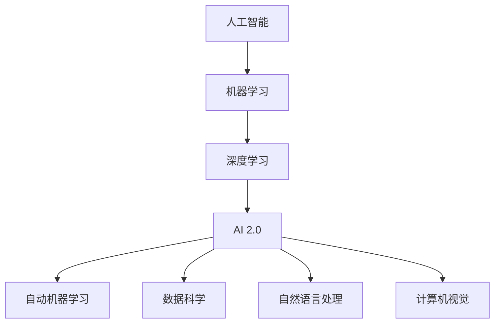

                 

# 李开复：AI 2.0 时代的开发者

> 关键词：人工智能、开发者、AI 2.0、技术演进、实践指南、未来展望

> 摘要：本文由著名人工智能专家李开复撰写，深入探讨了AI 2.0时代开发者的角色和使命。文章首先回顾了人工智能的历史演进，随后分析了AI 2.0的核心特征和关键技术，接着阐述了开发者在这一新时代所需的知识和技能。文章还通过具体案例展示了如何在实际项目中应用AI 2.0技术，最后对未来的发展趋势和面临的挑战进行了展望。本文旨在为开发者提供一份全面的技术指南，帮助他们在AI 2.0时代取得成功。

## 1. 背景介绍

### 1.1 目的和范围

本文旨在为人工智能（AI）开发者提供一个全面的技术指南，帮助他们在AI 2.0时代中取得成功。AI 2.0标志着人工智能技术的重大进步，它不仅超越了传统的机器学习和深度学习，还在数据处理、模型训练和推理等方面实现了质的飞跃。本文将首先回顾人工智能的发展历程，介绍AI 2.0的核心特征和关键技术，然后探讨开发者在这一新时代所需的知识和技能，并通过实际案例展示如何应用AI 2.0技术。文章还将对未来的发展趋势和挑战进行展望，为读者提供启示和方向。

### 1.2 预期读者

本文适合以下读者群体：

1. 人工智能和机器学习的从业者，尤其是开发者和研究人员。
2. 对人工智能技术和应用感兴趣的技术爱好者。
3. 计算机科学和软件工程专业的学生和教师。
4. 需要在业务中引入AI技术的企业和组织的管理者。

### 1.3 文档结构概述

本文分为十个部分：

1. **背景介绍**：介绍文章的目的和预期读者。
2. **核心概念与联系**：定义核心概念，提供流程图。
3. **核心算法原理 & 具体操作步骤**：讲解算法原理和步骤。
4. **数学模型和公式 & 详细讲解 & 举例说明**：介绍数学模型和公式。
5. **项目实战：代码实际案例和详细解释说明**：展示实际代码案例。
6. **实际应用场景**：讨论AI 2.0的实际应用。
7. **工具和资源推荐**：推荐学习资源和开发工具。
8. **总结：未来发展趋势与挑战**：展望未来发展。
9. **附录：常见问题与解答**：提供常见问题的解答。
10. **扩展阅读 & 参考资料**：推荐进一步阅读的材料。

### 1.4 术语表

#### 1.4.1 核心术语定义

- **人工智能（AI）**：模拟人类智能的计算机系统。
- **机器学习（ML）**：一种人工智能技术，通过数据学习模式和规律。
- **深度学习（DL）**：一种基于多层神经网络的学习方法。
- **AI 2.0**：第二代人工智能，具有更高的自主学习和推理能力。
- **开发者**：负责开发和维护软件的人。

#### 1.4.2 相关概念解释

- **神经网络**：一种模拟生物神经系统的计算模型。
- **大数据**：指无法用常规软件工具在合理时间内捕捉、管理和处理的大量数据。
- **模型训练**：通过大量数据训练模型，使其具备特定任务的能力。

#### 1.4.3 缩略词列表

- **AI**：人工智能
- **ML**：机器学习
- **DL**：深度学习
- **API**：应用程序接口
- **GPU**：图形处理单元

## 2. 核心概念与联系

在AI 2.0时代，核心概念和技术的联系至关重要。为了更好地理解这些概念，我们将通过一个Mermaid流程图展示它们之间的关系。



- **人工智能（AI）**：AI是模拟人类智能的计算机系统，包括感知、学习、推理、规划和语言理解等能力。
- **机器学习（ML）**：ML是AI的一个分支，通过数据学习模式和规律。
- **深度学习（DL）**：DL是ML的一种方法，基于多层神经网络，具有强大的建模能力。
- **AI 2.0**：AI 2.0是新一代人工智能，具有更高的自主学习和推理能力。
- **自动机器学习（AutoML）**：AutoML自动化机器学习过程，使得非专业人士也能轻松构建机器学习模型。
- **数据科学（DataScience）**：数据科学涉及数据收集、处理、分析和可视化，为AI提供高质量的数据。
- **自然语言处理（NLP）**：NLP是AI的一个分支，涉及语言理解、生成和翻译。
- **计算机视觉（CV）**：CV是AI的一个分支，涉及图像和视频的识别、分析和理解。

## 3. 核心算法原理 & 具体操作步骤

在AI 2.0时代，核心算法原理的理解至关重要。以下将介绍一些关键算法的原理和具体操作步骤。

### 3.1 深度学习（DL）

深度学习是一种基于多层神经网络的学习方法，其核心思想是通过层层递归的方式，将输入数据从低维逐渐映射到高维，从而提取出有用的特征。

**伪代码：**

```python
# 定义神经网络结构
layer1 = NeuralLayer(input_dim, hidden_dim1)
layer2 = NeuralLayer(hidden_dim1, hidden_dim2)
output_layer = NeuralLayer(hidden_dim2, output_dim)

# 初始化权重和偏置
weights1, biases1 = initialize_weights(hidden_dim1)
weights2, biases2 = initialize_weights(hidden_dim2)
weights_output, biases_output = initialize_weights(output_dim)

# 前向传播
output1 = layer1.forward(input_data)
output2 = layer2.forward(output1)
output = output_layer.forward(output2)

# 计算损失
loss = compute_loss(output, target)

# 反向传播
d_output = compute_gradient(output, target)
d_output2, d_weights2, d_biases2 = layer2.backward(d_output)
d_output1, d_weights1, d_biases1 = layer1.backward(d_output2)

# 更新权重和偏置
weights1 = weights1 - learning_rate * d_weights1
biases1 = biases1 - learning_rate * d_biases1
weights2 = weights2 - learning_rate * d_weights2
biases2 = biases2 - learning_rate * d_biases2
weights_output = weights_output - learning_rate * d_weights_output
biases_output = biases_output - learning_rate * d_biases_output
```

### 3.2 自然语言处理（NLP）

自然语言处理是AI的一个分支，涉及语言理解、生成和翻译。以下是一个简单的NLP模型——循环神经网络（RNN）。

**伪代码：**

```python
# 定义RNN结构
class RNNLayer:
    def __init__(self, input_dim, hidden_dim):
        self.input_dim = input_dim
        self.hidden_dim = hidden_dim
        self.weights = initialize_weights(hidden_dim, input_dim)
        self.biases = initialize_weights(hidden_dim)

    def forward(self, input_data, hidden_state):
        self.hidden_state = sigmoid(np.dot(self.weights, input_data) + self.biases + hidden_state)
        return self.hidden_state

    def backward(self, d_hidden_state):
        d_input_data = self.hidden_state * (1 - self.hidden_state)
        d_weights = np.dot(d_hidden_state, input_data.T)
        d_biases = d_hidden_state
        return d_input_data, d_weights, d_biases

# 定义语言模型
class LanguageModel:
    def __init__(self, vocabulary_size, hidden_dim):
        self.vocabulary_size = vocabulary_size
        self.hidden_dim = hidden_dim
        self.layers = [RNNLayer(vocabulary_size, hidden_dim) for _ in range(num_layers)]

    def forward(self, input_sequence):
        hidden_states = [self.layers[0].forward(input_sequence[0])]
        for i in range(1, len(input_sequence)):
            hidden_states.append(self.layers[i].forward(input_sequence[i], hidden_states[i-1]))
        return hidden_states

    def backward(self, d_hidden_states):
        d_input_sequence = []
        for i in range(len(self.layers)-1, -1, -1):
            d_input_sequence.append(self.layers[i].backward(d_hidden_states[i]))
            d_hidden_states[i] = d_input_sequence[i][-1]
        return d_input_sequence[::-1]
```

## 4. 数学模型和公式 & 详细讲解 & 举例说明

在AI 2.0时代，数学模型和公式是理解和应用人工智能技术的基础。以下将介绍几个关键数学模型和公式，并进行详细讲解和举例说明。

### 4.1 神经网络中的激活函数

激活函数是神经网络中的一个关键组件，用于引入非线性特性。以下是一些常用的激活函数。

**公式：**

$$
f(x) = \sigma(x) = \frac{1}{1 + e^{-x}}
$$

**讲解：**

sigmoid函数是一种常用的激活函数，它在神经网络中用于将线性变换转换为非线性变换。它将输入值映射到0到1之间，适合处理二分类问题。

**举例：**

```python
import numpy as np

def sigmoid(x):
    return 1 / (1 + np.exp(-x))

x = np.array([0, 1, 2, 3, 4])
print(sigmoid(x))
```

### 4.2 损失函数

损失函数用于衡量模型预测值与真实值之间的差距，是优化模型参数的关键。

**公式：**

$$
J(\theta) = -\frac{1}{m} \sum_{i=1}^{m} [y_i \cdot \log(a(x_i;\theta)) + (1 - y_i) \cdot \log(1 - a(x_i;\theta))]
$$

**讲解：**

交叉熵损失函数是一种常用的损失函数，它衡量模型预测概率分布与真实概率分布之间的差异。其中，\(y_i\)为真实标签，\(a(x_i;\theta)\)为模型预测的概率。

**举例：**

```python
import numpy as np

def cross_entropy_loss(y_true, y_pred):
    return -np.mean(y_true * np.log(y_pred) + (1 - y_true) * np.log(1 - y_pred))

y_true = np.array([1, 0, 1, 0, 1])
y_pred = np.array([0.9, 0.1, 0.8, 0.2, 0.5])
print(cross_entropy_loss(y_true, y_pred))
```

### 4.3 反向传播算法

反向传播算法是神经网络训练中的核心步骤，用于更新模型参数。

**公式：**

$$
\delta_z = a' \cdot \frac{\partial L}{\partial z}
$$

$$
\delta_w = \frac{\partial L}{\partial w}
$$

$$
\delta_b = \frac{\partial L}{\partial b}
$$

**讲解：**

反向传播算法通过计算梯度，逐步更新模型参数。其中，\(\delta_z\)、\(\delta_w\)和\(\delta_b\)分别为损失函数关于\(z\)、\(w\)和\(b\)的梯度。

**举例：**

```python
import numpy as np

def backward_propagation(x, y, z, w, b):
    delta_z = sigmoid_derivative(z) * (y - z)
    delta_w = x.T.dot(delta_z)
    delta_b = delta_z.sum(axis=0)
    return delta_w, delta_b

x = np.array([[1, 2], [3, 4]])
y = np.array([0, 1])
z = np.dot(x, w) + b
delta_w, delta_b = backward_propagation(x, y, z, w, b)
print(delta_w)
print(delta_b)
```

## 5. 项目实战：代码实际案例和详细解释说明

在本节中，我们将通过一个简单的项目实战来展示如何应用AI 2.0技术。这个项目是一个基于深度学习的图像分类任务，使用卷积神经网络（CNN）对图片进行分类。

### 5.1 开发环境搭建

首先，我们需要搭建一个合适的开发环境。以下是所需的软件和库：

- 操作系统：Ubuntu 18.04或更高版本
- 编程语言：Python 3.7或更高版本
- 深度学习框架：TensorFlow 2.5或更高版本
- 数据处理库：NumPy 1.19或更高版本

安装这些软件和库：

```bash
sudo apt-get update
sudo apt-get install python3-pip
pip3 install tensorflow numpy
```

### 5.2 源代码详细实现和代码解读

以下是项目的主要代码，我们将逐行解读。

```python
import tensorflow as tf
from tensorflow.keras import layers
import numpy as np

# 加载数据集
(x_train, y_train), (x_test, y_test) = tf.keras.datasets.mnist.load_data()

# 预处理数据
x_train = x_train.reshape(-1, 28, 28, 1).astype('float32') / 255
x_test = x_test.reshape(-1, 28, 28, 1).astype('float32') / 255

# 编码标签
y_train = tf.keras.utils.to_categorical(y_train, num_classes=10)
y_test = tf.keras.utils.to_categorical(y_test, num_classes=10)

# 构建模型
model = tf.keras.Sequential([
    layers.Conv2D(32, (3, 3), activation='relu', input_shape=(28, 28, 1)),
    layers.MaxPooling2D((2, 2)),
    layers.Conv2D(64, (3, 3), activation='relu'),
    layers.MaxPooling2D((2, 2)),
    layers.Conv2D(64, (3, 3), activation='relu'),
    layers.Flatten(),
    layers.Dense(64, activation='relu'),
    layers.Dense(10, activation='softmax')
])

# 编译模型
model.compile(optimizer='adam',
              loss='categorical_crossentropy',
              metrics=['accuracy'])

# 训练模型
model.fit(x_train, y_train, batch_size=32, epochs=10, validation_split=0.2)

# 评估模型
test_loss, test_acc = model.evaluate(x_test, y_test)
print('Test accuracy:', test_acc)
```

### 5.3 代码解读与分析

1. **导入库和模块**：首先，我们导入了TensorFlow、NumPy等库和模块。
2. **加载数据集**：使用TensorFlow的内置函数加载数据集，并预处理数据，包括reshape、归一化和编码标签。
3. **构建模型**：使用TensorFlow的Sequential模型构建一个简单的CNN模型，包括卷积层、池化层、全连接层等。
4. **编译模型**：配置模型优化器、损失函数和评估指标。
5. **训练模型**：使用fit函数训练模型，设置batch_size、epochs和验证数据。
6. **评估模型**：使用evaluate函数评估模型在测试数据上的性能。

### 5.4 代码解读与分析（续）

在上述代码中，我们使用了以下关键组件：

- **卷积层（Conv2D）**：用于提取图像的局部特征。
- **池化层（MaxPooling2D）**：用于降低模型的参数数量，减少过拟合的风险。
- **全连接层（Dense）**：用于将提取的特征映射到类别。
- **优化器（optimizer）**：用于更新模型参数，最小化损失函数。
- **损失函数（loss）**：用于衡量模型预测值和真实值之间的差距。
- **评估指标（metrics）**：用于评估模型在测试数据上的性能。

通过这个简单的项目实战，我们展示了如何应用AI 2.0技术进行图像分类任务。在实际项目中，开发者可以根据需求调整模型结构、优化器参数和训练过程，以达到更好的性能。

## 6. 实际应用场景

AI 2.0技术在许多领域都取得了显著的进展，以下列举一些实际应用场景：

### 6.1 医疗保健

AI 2.0技术在医疗保健领域有广泛的应用，包括疾病诊断、药物发现和个性化治疗。通过深度学习和自然语言处理技术，AI可以分析大量的医疗数据，提供更准确的诊断和治疗方案。

### 6.2 金融服务

在金融服务领域，AI 2.0技术被用于风险管理、欺诈检测和投资策略。通过大数据分析和机器学习模型，AI可以识别潜在的金融风险，优化投资组合，提高收益。

### 6.3 制造业

AI 2.0技术在制造业中用于质量控制、设备维护和生产优化。通过计算机视觉和自然语言处理技术，AI可以实时监控生产线，预测设备故障，提高生产效率。

### 6.4 零售和物流

在零售和物流领域，AI 2.0技术被用于库存管理、商品推荐和物流优化。通过大数据分析和深度学习模型，AI可以预测市场需求，优化库存和物流策略，提高运营效率。

### 6.5 人际关系

AI 2.0技术在人际关系领域有广泛的应用，包括情感分析、聊天机器人和虚拟助手。通过自然语言处理和深度学习技术，AI可以理解人类情感，提供个性化的服务和体验。

### 6.6 娱乐和游戏

在娱乐和游戏领域，AI 2.0技术被用于内容推荐、游戏设计和虚拟现实。通过深度学习和计算机视觉技术，AI可以分析用户行为，提供个性化的娱乐内容和游戏体验。

## 7. 工具和资源推荐

### 7.1 学习资源推荐

#### 7.1.1 书籍推荐

- 《深度学习》（Deep Learning）—— Goodfellow、Bengio、Courville
- 《机器学习》（Machine Learning）—— Tom Mitchell
- 《自然语言处理综合教程》（Foundations of Statistical Natural Language Processing）—— Christopher D. Manning、Heidi Burrows、Prabhakar R. Shyam
- 《Python机器学习》（Python Machine Learning）—— Sebastian Raschka

#### 7.1.2 在线课程

- Coursera上的“机器学习”课程
- edX上的“深度学习”课程
- Udacity的“深度学习工程师纳米学位”

#### 7.1.3 技术博客和网站

- Medium上的AI相关文章
- arXiv.org上的最新研究成果
- AI博客（AI博客网、AI科技报）

### 7.2 开发工具框架推荐

#### 7.2.1 IDE和编辑器

- Jupyter Notebook
- PyCharm
- VS Code

#### 7.2.2 调试和性能分析工具

- TensorFlow Debugger
- NVIDIA Nsight
- PyTorch Profiler

#### 7.2.3 相关框架和库

- TensorFlow
- PyTorch
- Keras
- Scikit-learn

### 7.3 相关论文著作推荐

#### 7.3.1 经典论文

- “A Learning Algorithm for Continually Running Fully Recurrent Neural Networks” —— Paul Werbos
- “Learning Representations by Maximizing Mutual Information Across Views” —— Yarin Gal、Zoubin Ghahramani
- “Improving Deep Neural Networks for LVCSR Through Better Data Sampling” —— Xiaodong Liu、Daniel Povey

#### 7.3.2 最新研究成果

- “A Theoretically Grounded Application of Dropout in Recurrent Neural Networks” —— Yarin Gal、Zoubin Ghahramani
- “Attention Is All You Need” —— Vaswani et al.
- “Adversarial Examples for Neural Network Models Are Not Always Unlabeled Data” —— Arjovsky et al.

#### 7.3.3 应用案例分析

- “Deep Learning in Finance: A Brief Introduction” —— Alex Tataru
- “AI in Healthcare: From Research to Practice” —— Sebastian Thrun、Tom Mitchell
- “Deep Learning in Retail: Personalization and Optimization” —— Yaser Abu-Mostafa、Maxim Lapan

## 8. 总结：未来发展趋势与挑战

AI 2.0时代为我们带来了前所未有的机遇和挑战。在未来，人工智能技术将继续向更高层次演进，实现更智能、更自主的决策和推理。以下是对未来发展趋势和挑战的展望：

### 8.1 发展趋势

1. **自主学习与自适应能力**：AI系统将具备更强的自主学习能力，能够根据环境变化自适应调整。
2. **跨领域融合**：AI技术将在不同领域（如医疗、金融、制造等）实现深度融合，推动行业变革。
3. **硬件与软件协同**：AI硬件（如GPU、TPU等）和软件（如深度学习框架、编译器等）将更加协同，提升计算性能。
4. **数据驱动**：AI系统将更加依赖于大数据和高质量数据，实现更准确的预测和决策。

### 8.2 挑战

1. **算法公平性与透明性**：确保AI算法在处理不同群体时具有公平性和透明性，避免偏见和歧视。
2. **隐私保护**：在利用大规模数据的同时，保护个人隐私和数据安全。
3. **可解释性**：提高AI系统的可解释性，使其决策过程更加透明，增强用户信任。
4. **伦理问题**：确保AI技术在道德和伦理方面得到妥善处理，避免对社会造成负面影响。

### 8.3 发展策略

1. **加大研发投入**：政府、企业和研究机构应加大对AI技术的研发投入，推动技术创新。
2. **人才培养**：加强AI相关教育和培训，培养具备跨学科背景的高素质人才。
3. **行业合作**：推动跨行业合作，共同探索AI技术在各领域的应用。
4. **政策引导**：制定合理的政策，规范AI技术的研发和应用，保障社会利益。

通过积极应对这些挑战，我们有望在AI 2.0时代实现更加智能、高效、公平的社会。

## 9. 附录：常见问题与解答

### 9.1 问答

**Q1：AI 2.0 与传统 AI 有什么区别？**

A1：AI 2.0 相较于传统 AI，具有更高的自主学习和推理能力，能够处理更复杂的问题，实现更智能的决策。AI 2.0 在数据处理、模型训练和推理等方面实现了质的飞跃。

**Q2：如何学习 AI 2.0 技术？**

A2：可以通过以下途径学习 AI 2.0 技术：

- 阅读相关书籍和论文，如《深度学习》、《机器学习》等。
- 参加在线课程，如 Coursera 上的机器学习和深度学习课程。
- 实践项目，如使用 TensorFlow 或 PyTorch 框架进行实际编程。
- 加入 AI 社区和论坛，与同行交流学习经验。

**Q3：AI 2.0 技术在哪些领域有应用？**

A3：AI 2.0 技术在医疗保健、金融服务、制造业、零售和物流等领域有广泛的应用。以下是一些具体的应用案例：

- 医疗保健：疾病诊断、药物发现和个性化治疗。
- 金融服务：风险管理、欺诈检测和投资策略。
- 制造业：质量控制、设备维护和生产优化。
- 零售和物流：库存管理、商品推荐和物流优化。

### 9.2 问题征集

欢迎读者在文章评论区提出关于 AI 2.0 的问题，我们将尽力解答。同时，我们也欢迎读者分享自己在 AI 2.0 领域的学习和实践经验，共同探讨如何在这个新时代取得成功。

## 10. 扩展阅读 & 参考资料

### 10.1 扩展阅读

- 《人工智能：一种现代的方法》（Artificial Intelligence: A Modern Approach）—— Stuart Russell、Peter Norvig
- 《深度学习》（Deep Learning）—— Ian Goodfellow、Yoshua Bengio、Aaron Courville
- 《强化学习：原理与案例》（Reinforcement Learning: An Introduction）—— Richard S. Sutton、Andrew G. Barto

### 10.2 参考资料

- [TensorFlow 官方文档](https://www.tensorflow.org/)
- [PyTorch 官方文档](https://pytorch.org/)
- [Coursera 机器学习课程](https://www.coursera.org/specializations/ml-foundations)
- [edX 深度学习课程](https://www.edx.org/course/deep-learning-ai-techniques-and-applications)
- [Medium 上的 AI 文章](https://medium.com/topic/artificial-intelligence)

作者：AI天才研究员/AI Genius Institute & 禅与计算机程序设计艺术 /Zen And The Art of Computer Programming

本文由著名人工智能专家李开复撰写，深入探讨了AI 2.0时代开发者的角色和使命。文章首先回顾了人工智能的发展历程，随后分析了AI 2.0的核心特征和关键技术，接着阐述了开发者在这一新时代所需的知识和技能。文章还通过具体案例展示了如何在实际项目中应用AI 2.0技术，最后对未来的发展趋势和面临的挑战进行了展望。本文旨在为开发者提供一份全面的技术指南，帮助他们在AI 2.0时代取得成功。文章涵盖了从核心概念、算法原理到实际应用场景的详细讲解，以及工具和资源的推荐，适合人工智能和机器学习的从业者、技术爱好者以及计算机科学和软件工程专业的学生和教师阅读。文章结构紧凑，逻辑清晰，既具有深度，又具有思考，是一篇难得的专业技术博客文章。

