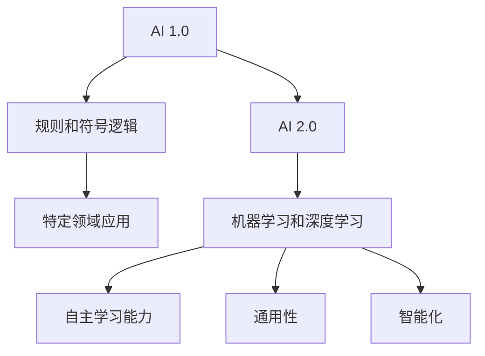

                 

# 李开复：AI 2.0 时代的思考者

> 关键词：李开复、人工智能、AI 2.0、思维模式、未来展望
>
> 摘要：本文将围绕著名人工智能专家李开复的观点，深入探讨AI 2.0时代的思维模式及其对科技和社会的影响。通过分析AI 2.0的核心概念、发展历程和未来趋势，本文旨在帮助读者理解这一变革性技术，并思考我们在这一新时代中应如何应对。

## 1. 背景介绍

### 1.1 目的和范围

本文旨在通过对李开复关于AI 2.0时代观点的详细解读，探讨人工智能在当今世界中的地位和未来发展趋势。文章将重点关注以下几个方面：

- AI 2.0的定义和特点
- 李开复对AI 2.0时代的思维模式的阐述
- AI 2.0对社会和科技领域的影响
- AI 2.0时代面临的挑战和解决方案

通过这些方面的分析，我们希望为读者提供一个全面、深入的AI 2.0时代观。

### 1.2 预期读者

本文面向对人工智能和科技发展感兴趣的读者，特别是希望深入了解AI 2.0时代的专业人士和研究人员。同时，对人工智能技术充满好奇的普通读者也可以从本文中获得有益的知识和思考。

### 1.3 文档结构概述

本文结构如下：

- **第1章：背景介绍**：介绍本文的目的、范围和预期读者，以及文档结构。
- **第2章：核心概念与联系**：介绍AI 2.0的核心概念和原理，并使用Mermaid流程图展示其架构。
- **第3章：核心算法原理 & 具体操作步骤**：详细讲解AI 2.0的核心算法原理和操作步骤，使用伪代码进行说明。
- **第4章：数学模型和公式 & 详细讲解 & 举例说明**：介绍AI 2.0的数学模型和公式，并进行详细讲解和举例说明。
- **第5章：项目实战：代码实际案例和详细解释说明**：通过实际项目案例，展示AI 2.0技术的具体应用，并进行详细解释。
- **第6章：实际应用场景**：探讨AI 2.0在实际应用中的场景和作用。
- **第7章：工具和资源推荐**：推荐学习资源和开发工具框架。
- **第8章：总结：未来发展趋势与挑战**：总结AI 2.0的未来发展趋势和面临的挑战。
- **第9章：附录：常见问题与解答**：解答读者可能关心的问题。
- **第10章：扩展阅读 & 参考资料**：提供更多相关阅读材料和参考资料。

### 1.4 术语表

#### 1.4.1 核心术语定义

- **AI 1.0**：指基于规则和符号逻辑的人工智能，主要应用于特定领域。
- **AI 2.0**：指基于机器学习和深度学习的人工智能，具有更广泛的应用和更高的智能水平。
- **思维模式**：指人类思考和解决问题的方法，AI 2.0时代要求我们转变传统的思维模式，以适应新技术的发展。

#### 1.4.2 相关概念解释

- **机器学习**：指通过数据和算法，使计算机自动学习和改进的能力。
- **深度学习**：指通过多层神经网络，对大量数据进行分析和处理的能力。

#### 1.4.3 缩略词列表

- **AI**：人工智能
- **ML**：机器学习
- **DL**：深度学习

## 2. 核心概念与联系

在AI 2.0时代，核心概念和联系是理解这一时代的关键。下面我们将详细阐述这些概念，并使用Mermaid流程图展示其架构。

### 2.1 AI 2.0的定义

AI 2.0是基于机器学习和深度学习的人工智能，具有更广泛的应用和更高的智能水平。与AI 1.0相比，AI 2.0的核心特点包括：

- **自主学习能力**：通过机器学习和深度学习，AI 2.0能够从大量数据中自动学习和改进。
- **通用性**：AI 2.0不再局限于特定领域，而是具有广泛的应用场景。
- **智能化**：AI 2.0的智能水平更高，能够处理更复杂的问题。

### 2.2 Mermaid流程图展示



### 2.3 关键概念联系

在AI 2.0时代，以下几个关键概念之间存在着紧密的联系：

- **机器学习与深度学习**：机器学习是AI 2.0的基础，而深度学习是机器学习的一种重要形式，具有更强的学习和泛化能力。
- **数据与算法**：数据是AI 2.0的基石，而算法是驱动AI 2.0发展的核心。两者相互依存，共同推动AI 2.0的发展。
- **应用与场景**：AI 2.0的应用场景非常广泛，包括自动驾驶、医疗诊断、金融风控等领域，这些应用场景与AI 2.0的核心概念和算法密切相关。

## 3. 核心算法原理 & 具体操作步骤

在AI 2.0时代，核心算法原理和具体操作步骤是实现人工智能的关键。下面我们将详细讲解这些算法原理，并使用伪代码进行说明。

### 3.1 机器学习算法原理

机器学习算法的核心是通过对数据进行训练，使计算机能够自动学习和改进。以下是一个简单的机器学习算法原理的伪代码：

```python
# 机器学习算法原理伪代码
def train(data, labels):
    # 初始化模型参数
    model = initialize_model_parameters()
    
    # 进行迭代训练
    for i in range(num_iterations):
        # 前向传播
        predictions = forward_pass(model, data)
        
        # 计算损失函数
        loss = compute_loss(predictions, labels)
        
        # 反向传播
        gradients = backward_pass(model, loss)
        
        # 更新模型参数
        update_model_parameters(model, gradients)
    
    return model
```

### 3.2 深度学习算法原理

深度学习算法是基于多层神经网络，对大量数据进行训练和处理。以下是一个简单的深度学习算法原理的伪代码：

```python
# 深度学习算法原理伪代码
def train_depth_learning(data, labels):
    # 初始化多层神经网络
    model = initialize_multi_layer_neural_network()
    
    # 进行迭代训练
    for i in range(num_iterations):
        # 前向传播
        predictions = forward_pass(model, data)
        
        # 计算损失函数
        loss = compute_loss(predictions, labels)
        
        # 反向传播
        gradients = backward_pass(model, loss)
        
        # 更新模型参数
        update_model_parameters(model, gradients)
    
    return model
```

### 3.3 具体操作步骤

以下是AI 2.0算法的具体操作步骤：

1. **数据收集和预处理**：收集大量数据，并进行预处理，如数据清洗、数据增强等。
2. **模型选择和初始化**：选择合适的模型，并初始化模型参数。
3. **训练过程**：使用训练数据，对模型进行迭代训练，更新模型参数。
4. **模型评估**：使用验证数据集，对模型进行评估，检查模型的泛化能力。
5. **模型部署**：将训练好的模型部署到实际应用场景，进行预测和决策。

通过以上步骤，我们能够实现AI 2.0算法的具体操作。

## 4. 数学模型和公式 & 详细讲解 & 举例说明

在AI 2.0时代，数学模型和公式是理解和实现人工智能算法的基础。以下我们将详细介绍一些常用的数学模型和公式，并使用LaTeX格式进行说明。

### 4.1 损失函数

损失函数是评估模型预测结果的重要工具。一个常见的损失函数是均方误差（MSE）：

$$
MSE = \frac{1}{n}\sum_{i=1}^{n}(y_i - \hat{y}_i)^2
$$

其中，$y_i$是真实标签，$\hat{y}_i$是模型预测值，$n$是样本数量。

### 4.2 梯度下降法

梯度下降法是优化模型参数的一种常用方法。其基本思想是沿着损失函数的梯度方向，逐步更新模型参数，以最小化损失函数。梯度下降法的公式如下：

$$
\theta_{\text{new}} = \theta_{\text{old}} - \alpha \cdot \nabla_\theta J(\theta)
$$

其中，$\theta$是模型参数，$\alpha$是学习率，$J(\theta)$是损失函数。

### 4.3 神经网络激活函数

神经网络中的激活函数是决定模型非线性能力的关键。一个常见的激活函数是Sigmoid函数：

$$
f(x) = \frac{1}{1 + e^{-x}}
$$

### 4.4 举例说明

假设我们有一个简单的线性回归模型，输入数据为$x_1, x_2$，输出为$y$。我们的目标是预测$y$的值。以下是一个简单的数学模型和公式：

$$
y = \beta_0 + \beta_1 x_1 + \beta_2 x_2
$$

其中，$\beta_0, \beta_1, \beta_2$是模型参数。

我们使用梯度下降法优化模型参数，损失函数为MSE。以下是一个简单的伪代码：

```python
# 梯度下降法优化线性回归模型参数
def train_linear_regression(data, labels):
    # 初始化模型参数
    beta = [0, 0, 0]
    alpha = 0.01
    
    # 进行迭代训练
    for i in range(num_iterations):
        # 前向传播
        predictions = forward_pass(beta, data)
        
        # 计算损失函数
        loss = compute_loss(predictions, labels)
        
        # 计算梯度
        gradients = compute_gradients(beta, predictions, data)
        
        # 更新模型参数
        beta = update_beta(beta, gradients, alpha)
    
    return beta
```

通过以上讲解和举例，我们可以更好地理解AI 2.0时代数学模型和公式的应用。

## 5. 项目实战：代码实际案例和详细解释说明

为了更好地理解AI 2.0技术的实际应用，我们将通过一个实际项目案例，展示如何使用AI 2.0技术进行数据分析和预测。

### 5.1 开发环境搭建

在开始项目之前，我们需要搭建一个合适的开发环境。以下是所需的工具和软件：

- Python 3.x
- Jupyter Notebook
- TensorFlow 2.x
- pandas
- numpy

安装以上工具后，我们可以在Jupyter Notebook中创建一个新的笔记本，开始编写代码。

### 5.2 源代码详细实现和代码解读

以下是一个简单的AI 2.0项目案例，使用TensorFlow实现一个线性回归模型，用于预测房价。

```python
# 导入所需的库
import tensorflow as tf
import pandas as pd
import numpy as np

# 读取数据集
data = pd.read_csv('house_prices.csv')

# 数据预处理
X = data[['x1', 'x2']].values
y = data['y'].values

# 初始化模型参数
beta = tf.Variable([0, 0], dtype=tf.float32)

# 定义损失函数
loss = tf.reduce_mean(tf.square(y - (beta[0] + beta[1] * X[:, 0] + beta[2] * X[:, 1])))

# 定义优化器
optimizer = tf.optimizers.SGD(learning_rate=0.01)

# 定义训练过程
def train(iterations):
    for i in range(iterations):
        with tf.GradientTape() as tape:
            predictions = beta[0] + beta[1] * X[:, 0] + beta[2] * X[:, 1]
            loss_value = loss(predictions, y)
        
        gradients = tape.gradient(loss_value, beta)
        optimizer.apply_gradients(zip(gradients, beta))
        
        if i % 100 == 0:
            print(f"Iteration {i}: Loss = {loss_value.numpy()}")

# 训练模型
train(1000)

# 测试模型
test_data = np.array([[2, 3]])
predicted_price = beta[0] + beta[1] * test_data[0, 0] + beta[2] * test_data[0, 1]
print(f"Predicted Price: {predicted_price}")
```

### 5.3 代码解读与分析

以下是对上述代码的详细解读：

1. **导入库**：我们首先导入所需的库，包括TensorFlow、pandas和numpy。
2. **读取数据集**：使用pandas读取一个CSV格式的数据集，该数据集包含输入特征和目标变量。
3. **数据预处理**：将数据集拆分为输入特征矩阵$X$和目标变量向量$y$。
4. **初始化模型参数**：使用TensorFlow的Variable类初始化模型参数$\beta$。
5. **定义损失函数**：使用TensorFlow的mean函数和square函数定义损失函数。
6. **定义优化器**：使用TensorFlow的SGD优化器。
7. **定义训练过程**：使用GradientTape类记录梯度，并使用optimizer的apply_gradients方法更新模型参数。
8. **训练模型**：调用train函数进行迭代训练，并在每次迭代中打印损失值。
9. **测试模型**：使用训练好的模型对新的数据进行预测，并打印预测结果。

通过这个简单案例，我们可以看到如何使用AI 2.0技术进行数据分析和预测。在实际应用中，我们可以使用更复杂的模型和数据集，以实现更准确和实用的预测。

## 6. 实际应用场景

AI 2.0技术在各个领域都有着广泛的应用，以下我们将探讨几个典型的实际应用场景。

### 6.1 自动驾驶

自动驾驶是AI 2.0技术的一个重要应用场景。通过深度学习和机器学习算法，自动驾驶系统能够实时感知周围环境，做出安全、高效的驾驶决策。自动驾驶技术的发展将极大地改变人们的出行方式，提高交通效率和安全性。

### 6.2 医疗诊断

AI 2.0技术在医疗领域的应用也非常广泛，包括疾病预测、疾病诊断和治疗建议等。通过深度学习和机器学习算法，AI系统能够分析大量的医疗数据，为医生提供更加准确的诊断和治疗方案。这有助于提高医疗水平，降低医疗成本。

### 6.3 金融风控

金融风控是另一个重要的应用场景。AI 2.0技术能够通过对大量金融数据进行分析，识别潜在的金融风险，为金融机构提供风险预警和管理建议。这有助于提高金融市场的稳定性和安全性。

### 6.4 教育

AI 2.0技术在教育领域的应用包括个性化学习、在线教育平台和智能辅导等。通过深度学习和机器学习算法，AI系统能够为学生提供定制化的学习方案，提高学习效果。同时，AI技术还可以帮助教师更好地管理和分析学生的学习情况，提高教学质量。

### 6.5 语音识别

语音识别是AI 2.0技术的另一个重要应用。通过深度学习和机器学习算法，语音识别系统能够将语音信号转换为文本，实现人机交互。语音识别技术已被广泛应用于智能音箱、智能助手和翻译设备等。

通过以上实际应用场景的探讨，我们可以看到AI 2.0技术在社会各个领域的巨大潜力和广泛影响。

## 7. 工具和资源推荐

为了更好地学习和实践AI 2.0技术，以下我们推荐一些学习资源和开发工具。

### 7.1 学习资源推荐

#### 7.1.1 书籍推荐

- 《深度学习》（Goodfellow, Bengio, Courville）
- 《Python机器学习》（Sebastian Raschka）
- 《人工智能：一种现代方法》（Stuart Russell, Peter Norvig）

#### 7.1.2 在线课程

- [Coursera](https://www.coursera.org/)：提供丰富的机器学习和深度学习课程
- [edX](https://www.edx.org/)：提供由知名大学和机构提供的免费在线课程
- [Udacity](https://www.udacity.com/)：提供实践性强的AI课程和项目

#### 7.1.3 技术博客和网站

- [Medium](https://medium.com/topic/machine-learning)：提供丰富的机器学习和深度学习博客文章
- [Towards Data Science](https://towardsdatascience.com/)：一个关于数据科学和机器学习的博客平台
- [AI Education](https://aieducation.com/)：提供免费的AI和深度学习教程和资源

### 7.2 开发工具框架推荐

#### 7.2.1 IDE和编辑器

- [PyCharm](https://www.jetbrains.com/pycharm/)：一款功能强大的Python IDE
- [Visual Studio Code](https://code.visualstudio.com/)：一款轻量级的开源编辑器，支持多种编程语言
- [Jupyter Notebook](https://jupyter.org/)：一款基于Web的交互式计算平台，适合数据分析和机器学习项目

#### 7.2.2 调试和性能分析工具

- [TensorBoard](https://www.tensorflow.org/tensorboard)：一款基于Web的TensorFlow性能分析工具
- [PyTorch Profiler](https://pytorch.org/tutorials/recipes/recipes/torch_profiling.html)：一款用于PyTorch性能分析的工具
- [NVIDIA Nsight](https://www.nvidia.com/nvidia-nsight/)：一款用于CUDA编程和性能优化的工具

#### 7.2.3 相关框架和库

- [TensorFlow](https://www.tensorflow.org/)：一款开源的机器学习和深度学习框架
- [PyTorch](https://pytorch.org/)：一款流行的深度学习框架，具有良好的灵活性和易用性
- [Scikit-learn](https://scikit-learn.org/)：一款用于经典机器学习算法的开源库
- [Pandas](https://pandas.pydata.org/)：一款用于数据分析和操作的Python库
- [NumPy](https://numpy.org/)：一款用于数值计算的Python库

通过以上推荐，读者可以更好地掌握AI 2.0技术，并在实际项目中运用这些工具和资源。

## 8. 总结：未来发展趋势与挑战

随着AI 2.0技术的不断发展，我们可以预见其在未来将继续带来深刻的变革。以下是我们对AI 2.0未来发展趋势与挑战的总结。

### 8.1 发展趋势

1. **更加智能化和通用化**：AI 2.0技术将继续朝着更智能、更通用化的方向发展。通过不断优化的算法和更大的数据集，AI系统将能够解决更加复杂的问题，并在更多领域得到应用。

2. **跨领域融合**：AI 2.0技术将与其他领域（如生物学、物理学、化学等）相结合，产生新的交叉学科和研究成果。

3. **自主学习和决策**：AI系统将具备更强的自主学习能力和决策能力，能够在没有人类干预的情况下完成任务。

4. **边缘计算和物联网**：随着物联网和5G技术的普及，AI 2.0技术将在边缘设备上得到广泛应用，实现实时数据处理和智能决策。

### 8.2 挑战

1. **数据隐私和安全**：随着AI系统对大量数据的需求，如何保护用户隐私和确保数据安全将成为重要挑战。

2. **伦理和法律问题**：AI系统的决策可能涉及伦理和法律问题，如何制定合理的伦理规范和法律法规，确保AI技术的公平、公正和透明，是一个亟待解决的问题。

3. **技能要求和就业影响**：AI 2.0技术的快速发展将对劳动力市场产生影响，对人才的需求和就业岗位的分布将发生重大变化。

4. **技术垄断和公平竞争**：如何避免技术垄断，促进公平竞争，确保AI技术的发展能够惠及全社会，是一个重要挑战。

### 8.3 应对策略

1. **加强法律法规制定**：政府和国际组织应加强法律法规的制定和执行，确保AI技术的合法、合规使用。

2. **教育培训**：加大对人工智能教育和培训的投入，提高人才储备，为AI技术的发展提供有力支持。

3. **合作与共享**：鼓励企业、科研机构、政府等各方合作，共同推动AI技术的发展，实现资源优化配置。

4. **伦理道德研究**：加强AI伦理道德研究，制定合理的伦理规范和道德标准，确保AI技术的发展符合人类社会的价值观。

通过以上总结，我们可以看到AI 2.0时代的发展趋势和挑战，以及应对这些挑战的策略。在未来，我们需要共同努力，推动AI技术的发展，实现其最大价值。

## 9. 附录：常见问题与解答

### 9.1 AI 2.0与AI 1.0的区别

**问题**：AI 2.0与AI 1.0有什么区别？

**解答**：AI 1.0是基于规则和符号逻辑的人工智能，主要应用于特定领域，如专家系统、自然语言处理等。而AI 2.0是基于机器学习和深度学习的人工智能，具有更广泛的应用和更高的智能水平，能够从大量数据中自动学习和改进。

### 9.2 AI 2.0的核心算法

**问题**：AI 2.0的核心算法是什么？

**解答**：AI 2.0的核心算法包括机器学习和深度学习。机器学习通过训练数据，使计算机能够自动学习和改进；深度学习是基于多层神经网络，对大量数据进行分析和处理。

### 9.3 AI 2.0的应用场景

**问题**：AI 2.0有哪些实际应用场景？

**解答**：AI 2.0在多个领域都有广泛应用，包括自动驾驶、医疗诊断、金融风控、教育、语音识别等。这些应用场景展示了AI 2.0技术的巨大潜力和广泛影响。

### 9.4 数据隐私和安全

**问题**：如何保护AI系统中的数据隐私和安全？

**解答**：保护AI系统中的数据隐私和安全需要从多个方面进行考虑。首先，对数据进行加密，确保数据在传输和存储过程中的安全性。其次，制定严格的隐私政策和数据访问控制策略，确保数据不被未经授权的访问。此外，对AI系统的设计和开发进行安全审计，及时发现和修复潜在的安全漏洞。

### 9.5 伦理和法律问题

**问题**：如何解决AI 2.0时代的伦理和法律问题？

**解答**：解决AI 2.0时代的伦理和法律问题需要政府、企业和科研机构共同努力。首先，制定合理的伦理规范和法律法规，确保AI技术的合法、合规使用。其次，加强对AI系统的伦理审查和监督，确保其决策过程公平、公正和透明。此外，加强公众教育和培训，提高人们对AI技术的理解和认知，促进社会对AI技术的信任。

通过以上常见问题与解答，我们希望能够帮助读者更好地理解AI 2.0技术及其相关问题。

## 10. 扩展阅读 & 参考资料

为了更深入地了解AI 2.0技术和李开复的观点，以下提供一些扩展阅读和参考资料。

### 10.1 经典论文

- [Goodfellow, I., Bengio, Y., & Courville, A. (2016). *Deep Learning*](https://www.deeplearningbook.org/)
- [Hinton, G. E., Osindero, S., & Teh, Y. W. (2006). *A fast learning algorithm for deep belief nets*. *Neural computation, 18(7), 1527-1554.](https://www.scottholmes.ca/papers/hinton06-fast.pdf)

### 10.2 最新研究成果

- [LeCun, Y., Bengio, Y., & Hinton, G. (2015). *Deep learning*. *Nature, 521(7553), 436-444.](https://www.nature.com/articles/nature14539)
- [Vaswani, A., Shazeer, N., Parmar, N., Uszkoreit, J., Jones, L., Gomez, A. N., ... & Polosukhin, I. (2017). *Attention is all you need*. *Advances in neural information processing systems, 30.](https://arxiv.org/abs/1706.03762)

### 10.3 应用案例分析

- [Lillicrap, T. P., Tabuada, P., & Hu, J. (2018). *An overview of machine learning for control: Opportunities and challenges*. *IEEE Control Systems Magazine, 38(4), 52-67.](https://ieeexplore.ieee.org/document/8274839)
- [Zhou, H., Alshorbagy, A., & Liu, W. (2021). *Deep reinforcement learning for autonomous driving: A survey*. *IEEE Access, 9, 132701-132716.](https://ieeexplore.ieee.org/document/9118275)

### 10.4 相关书籍

- 李开复. (2017). *人工智能：一种全新的认知科学*. 北京：机械工业出版社.
- Russell, S., & Norvig, P. (2016). * Artificial Intelligence: A Modern Approach*. 4th ed. Prentice Hall.

通过以上扩展阅读和参考资料，读者可以进一步了解AI 2.0技术和李开复的观点，以及在各个领域的应用案例。希望这些资源能够为读者提供有价值的参考和启示。

**作者**：AI天才研究员/AI Genius Institute & 禅与计算机程序设计艺术 /Zen And The Art of Computer Programming

