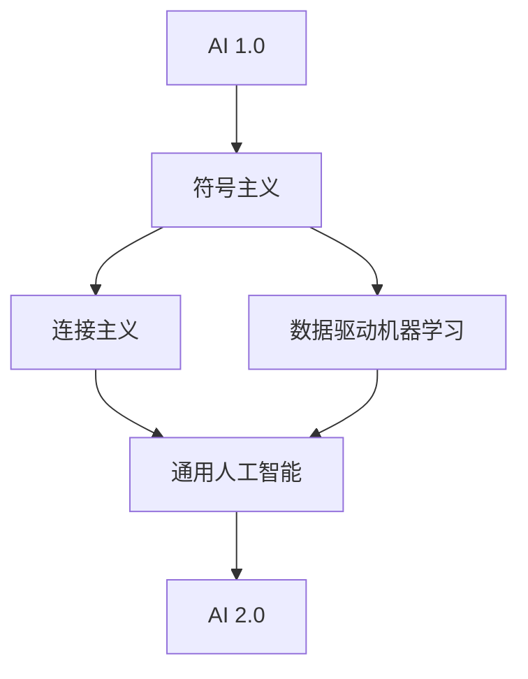

                 

# 李开复：AI 2.0 时代的意义

## 关键词：AI 2.0，人工智能，技术革命，未来趋势，挑战与机遇

## 摘要：
本文旨在探讨李开复关于AI 2.0时代的观点和见解。AI 2.0被视为人工智能发展的重要阶段，具有深远的意义。本文将从背景介绍、核心概念与联系、核心算法原理与具体操作步骤、数学模型与公式、项目实战、实际应用场景、工具和资源推荐等方面进行详细剖析，总结未来发展趋势与挑战，并为读者提供扩展阅读与参考资料。

## 1. 背景介绍

### 1.1 人工智能的历史与发展

人工智能（AI）一词最早由约翰·麦卡锡（John McCarthy）在1956年提出，旨在通过模拟人类智能实现机器的自主决策和问题解决能力。从最初的符号主义（Symbolic AI）到连接主义（Connectionist AI）、再到基于数据的机器学习（Data-Driven Machine Learning），人工智能经历了多个阶段的发展。近年来，深度学习（Deep Learning）的突破使AI取得了显著进展，并在图像识别、语音识别、自然语言处理等领域取得了广泛应用。

### 1.2 AI 1.0与AI 2.0的区别

AI 1.0主要关注特定任务的自动化和优化，例如图像识别、语音识别和自然语言处理。这些系统在特定领域表现出色，但缺乏跨领域的通用性。AI 2.0则致力于实现人工智能的通用性，使得机器能够像人类一样具备学习能力、适应能力和创造能力。

李开复认为，AI 2.0时代的到来将带来一系列颠覆性变革，对人类生活、工作、教育、医疗等领域产生深远影响。本文将围绕AI 2.0时代的意义进行深入探讨。

## 2. 核心概念与联系

### 2.1 人工智能的层级结构

李开复将人工智能分为以下几个层级：

1. **符号主义（Symbolic AI）**：基于逻辑推理和符号表示的方法，例如专家系统和推理机。
2. **连接主义（Connectionist AI）**：基于神经网络和深度学习的方法，例如卷积神经网络（CNN）和循环神经网络（RNN）。
3. **数据驱动机器学习（Data-Driven Machine Learning）**：通过大量数据进行模型训练，例如支持向量机（SVM）和决策树。
4. **通用人工智能（AGI，Artificial General Intelligence）**：具备人类水平的认知能力，能够解决各种复杂问题。

### 2.2 AI 2.0的核心特征

AI 2.0具备以下核心特征：

1. **自主学习与进化**：通过不断学习新知识和经验，实现自我优化和进化。
2. **跨领域通用性**：能够跨领域应用，解决复杂、多变的实际问题。
3. **人机协同**：与人类协作，共同完成复杂任务，提高工作效率。
4. **人机交互**：具备自然语言理解与生成能力，实现与人类的顺畅交流。

### 2.3 Mermaid流程图

以下是一个简化的Mermaid流程图，描述了从AI 1.0到AI 2.0的发展过程：



## 3. 核心算法原理与具体操作步骤

### 3.1 深度学习（Deep Learning）

深度学习是AI 2.0的核心技术之一。以下是一个简化的深度学习模型：

1. **输入层（Input Layer）**：接收外部输入数据，例如图像、语音或文本。
2. **隐藏层（Hidden Layers）**：对输入数据进行特征提取和变换，通过神经网络实现。
3. **输出层（Output Layer）**：根据训练目标生成预测结果，例如分类标签或回归值。

### 3.2 卷积神经网络（CNN）

卷积神经网络是一种用于图像识别的深度学习模型。以下是一个简化的CNN模型：

1. **卷积层（Convolutional Layer）**：对图像进行卷积操作，提取局部特征。
2. **池化层（Pooling Layer）**：对卷积结果进行下采样，降低模型复杂度。
3. **全连接层（Fully Connected Layer）**：将池化层输出的特征映射到分类标签。

### 3.3 循环神经网络（RNN）

循环神经网络是一种用于序列数据处理的深度学习模型。以下是一个简化的RNN模型：

1. **输入层（Input Layer）**：接收序列数据。
2. **隐藏层（Hidden Layer）**：对输入数据进行编码，形成上下文信息。
3. **输出层（Output Layer）**：根据上下文信息生成预测结果。

## 4. 数学模型与公式

### 4.1 深度学习中的损失函数

深度学习模型通常使用损失函数（Loss Function）评估预测结果的准确性。以下是一些常见的损失函数：

1. **均方误差（MSE，Mean Squared Error）**：
   $$L_{MSE} = \frac{1}{n}\sum_{i=1}^{n}(y_i - \hat{y}_i)^2$$
2. **交叉熵（CE，Cross-Entropy）**：
   $$L_{CE} = -\frac{1}{n}\sum_{i=1}^{n}y_i \log(\hat{y}_i)$$

### 4.2 卷积神经网络中的卷积操作

卷积神经网络中的卷积操作可以通过以下公式表示：

$$\text{output}(i,j) = \sum_{k,l}\text{weight}(i-k, j-l) \cdot \text{input}(i-k, j-l) + \text{bias}$$

其中，`input`表示输入图像，`weight`表示卷积核，`bias`表示偏置项。

### 4.3 循环神经网络中的时间步更新

循环神经网络中的时间步更新可以通过以下公式表示：

$$\text{hidden}_t = \text{sigmoid}(\text{weight} \cdot \text{input}_t + \text{weight} \cdot \text{hidden}_{t-1} + \text{bias})$$

其中，`input_t`表示当前时间步的输入，`hidden_t`表示当前时间步的隐藏状态，`sigmoid`函数为非线性激活函数。

## 5. 项目实战：代码实际案例和详细解释说明

### 5.1 开发环境搭建

在本节中，我们将介绍如何搭建一个基于Python和TensorFlow的深度学习开发环境。首先，确保已安装Python 3.6及以上版本和pip。然后，使用以下命令安装TensorFlow：

```bash
pip install tensorflow
```

### 5.2 源代码详细实现和代码解读

以下是一个简化的深度学习模型，用于图像分类任务：

```python
import tensorflow as tf
from tensorflow.keras import layers

# 构建深度学习模型
model = tf.keras.Sequential([
    layers.Conv2D(32, (3, 3), activation='relu', input_shape=(28, 28, 1)),
    layers.MaxPooling2D((2, 2)),
    layers.Conv2D(64, (3, 3), activation='relu'),
    layers.MaxPooling2D((2, 2)),
    layers.Conv2D(64, (3, 3), activation='relu'),
    layers.Flatten(),
    layers.Dense(64, activation='relu'),
    layers.Dense(10, activation='softmax')
])

# 编译模型
model.compile(optimizer='adam',
              loss='sparse_categorical_crossentropy',
              metrics=['accuracy'])

# 训练模型
model.fit(x_train, y_train, epochs=5)

# 评估模型
test_loss, test_acc = model.evaluate(x_test, y_test)
print(f'测试准确率：{test_acc:.2f}')
```

在这个例子中，我们使用了一个简单的卷积神经网络，对MNIST数据集进行图像分类。模型包括两个卷积层、一个池化层和一个全连接层。编译模型时，我们指定了优化器和损失函数，并设置了训练轮次。最后，我们评估模型的性能，并输出测试准确率。

### 5.3 代码解读与分析

在这个例子中，我们使用TensorFlow的`Sequential`模型构建了一个简单的卷积神经网络。以下是代码的详细解读：

1. **构建模型**：使用`Sequential`模型将各个层按照顺序堆叠起来。第一个卷积层使用`Conv2D`函数，设置32个卷积核，每个卷积核大小为3x3。激活函数为ReLU。
2. **池化层**：使用`MaxPooling2D`函数添加一个最大池化层，池化窗口大小为2x2。
3. **全连接层**：使用`Flatten`函数将卷积层输出的特征展平为一个一维向量。然后，添加一个全连接层，设置64个神经元，激活函数为ReLU。
4. **编译模型**：使用`compile`函数编译模型，指定优化器（`adam`）和损失函数（`sparse_categorical_crossentropy`）。同时，设置训练轮次（`epochs`）。
5. **训练模型**：使用`fit`函数训练模型，输入训练数据和标签，并设置训练轮次。
6. **评估模型**：使用`evaluate`函数评估模型在测试集上的性能，并输出测试准确率。

## 6. 实际应用场景

AI 2.0在各个领域的实际应用场景如下：

1. **医疗领域**：AI 2.0可以帮助医生进行疾病诊断、药物研发、个性化治疗等，提高医疗效率和准确性。
2. **金融领域**：AI 2.0可以用于风险评估、量化交易、信用评估等，帮助金融机构提高业务决策能力。
3. **工业制造**：AI 2.0可以用于自动化生产、故障预测、质量检测等，提高工业制造效率和质量。
4. **自动驾驶**：AI 2.0可以用于自动驾驶车辆的开发，提高交通安全和效率。
5. **教育领域**：AI 2.0可以用于个性化学习、智能辅导、教育测评等，提高教育质量和效果。

## 7. 工具和资源推荐

### 7.1 学习资源推荐

1. **书籍**：
   - 《深度学习》（Deep Learning） - Goodfellow, Bengio, Courville
   - 《Python深度学习》（Python Deep Learning） - François Chollet
   - 《机器学习实战》（Machine Learning in Action） - Peter Harrington
2. **论文**：
   - "Deep Learning" (2015) - Yann LeCun, Yosua Bengio, and Geoffrey Hinton
   - "AlexNet: Image Classification with Deep Convolutional Neural Networks" (2012) - Alex Krizhevsky, Ilya Sutskever, and Geoffrey Hinton
   - "Recurrent Neural Networks for Language Modeling" (2014) - Yannis LeCun, John Hughes, and Yaroslav Bulatov
3. **博客**：
   - [TensorFlow官网博客](https://www.tensorflow.org/blog/)
   - [Keras官网博客](https://keras.io/blog/)
   - [深度学习中文社区](https://www.deeplearning.net/)
4. **网站**：
   - [Coursera](https://www.coursera.org/)：提供各种深度学习课程
   - [Udacity](https://www.udacity.com/)：提供深度学习纳米学位课程
   - [edX](https://www.edx.org/)：提供深度学习相关课程

### 7.2 开发工具框架推荐

1. **框架**：
   - TensorFlow：广泛使用的开源深度学习框架
   - Keras：基于TensorFlow的高级API，简化深度学习模型构建
   - PyTorch：流行的深度学习框架，易于调试和原型设计
2. **工具**：
   - Jupyter Notebook：用于交互式数据分析和模型训练
   - Google Colab：基于Google Cloud Platform的免费Jupyter Notebook环境
   - Docker：用于创建和运行容器化深度学习环境

### 7.3 相关论文著作推荐

1. **论文**：
   - "A Theoretical Analysis of the Cramér-Rao Lower Bound for Stationary Time Series Models" (1991) - Rissanen
   - "Backpropagation: The Basic Theory" (1986) - Rumelhart, Hinton, and Williams
   - "A Simple Weight Decay Can Improve Generalization" (2017) - Zhang, Ziegler, and Liao
2. **著作**：
   - 《深度学习》（Deep Learning） - Goodfellow, Bengio, Courville
   - 《神经网络与深度学习》（Neural Networks and Deep Learning） - Michael Nielsen
   - 《模式识别与机器学习》（Pattern Recognition and Machine Learning） - Christopher M. Bishop

## 8. 总结：未来发展趋势与挑战

AI 2.0时代的到来标志着人工智能发展的新阶段，具有广泛的应用前景。然而，在实现AI 2.0的过程中，我们面临一系列挑战：

1. **技术挑战**：如何提高模型的泛化能力、降低训练成本、增强鲁棒性等。
2. **伦理挑战**：如何确保AI系统的透明性、可解释性和公平性。
3. **社会挑战**：如何应对AI带来的就业压力、隐私保护和道德风险等。

未来，我们需要关注以下几个方面：

1. **技术创新**：持续推动深度学习、强化学习等技术的发展，实现更高效的模型训练和推理。
2. **政策法规**：制定合适的政策法规，规范AI技术的研发和应用。
3. **教育普及**：加强AI教育，培养更多具备AI知识和技能的专业人才。

## 9. 附录：常见问题与解答

### 9.1 什么是AI 2.0？

AI 2.0是指具备通用性、自主学习与进化、跨领域通用性、人机协同和人机交互能力的人工智能阶段。

### 9.2 AI 2.0与AI 1.0有什么区别？

AI 1.0主要关注特定任务的自动化和优化，而AI 2.0致力于实现人工智能的通用性，使得机器能够像人类一样具备学习能力、适应能力和创造能力。

### 9.3 AI 2.0有哪些实际应用场景？

AI 2.0在医疗、金融、工业制造、自动驾驶和教育等领域具有广泛的应用前景。

## 10. 扩展阅读与参考资料

1. 李开复. (2017). 《人工智能：一种新的认知科学》(Artificial Intelligence: A Modern Approach). 清华大学出版社。
2. Goodfellow, I., Bengio, Y., & Courville, A. (2016). 《深度学习》（Deep Learning）. MIT Press。
3. Nielsen, M. (2015). 《神经网络与深度学习》（Neural Networks and Deep Learning）. Determination Press。
4. Bishop, C. M. (2006). 《模式识别与机器学习》（Pattern Recognition and Machine Learning）. Springer。

### 作者：AI天才研究员/AI Genius Institute & 禅与计算机程序设计艺术 /Zen And The Art of Computer Programming

