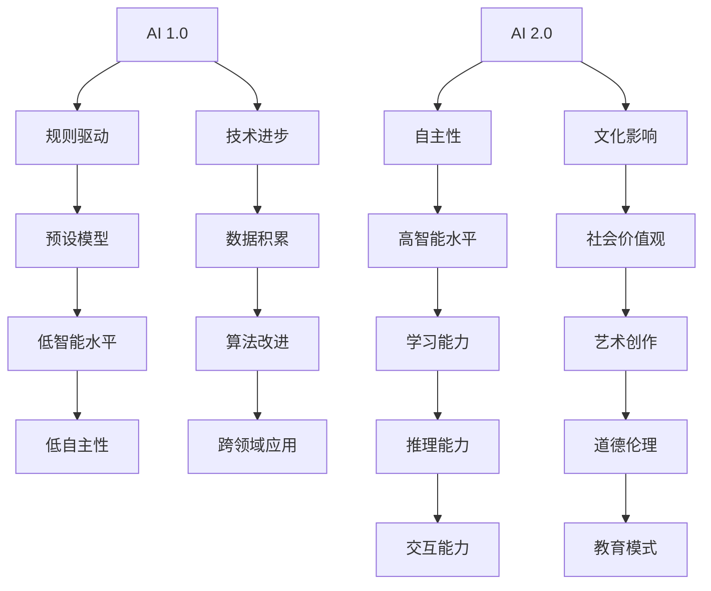

                 

### 1. 背景介绍

#### 1.1 目的和范围

《李开复：AI 2.0 时代的文化价值》旨在探讨人工智能（AI）在进入2.0时代后的文化影响和价值体现。本文将深入分析AI 2.0的基本概念、核心特征及其在各个领域的应用，旨在揭示这一新兴技术如何重塑人类社会的文化结构。

文章将重点关注以下几个方面：

1. **AI 2.0的基本概念**：介绍AI 2.0的定义及其相对于AI 1.0的进步。
2. **AI 2.0的核心特征**：探讨AI 2.0的智能水平、学习能力、自主性以及与人类互动的方式。
3. **AI 2.0的应用领域**：分析AI 2.0在医疗、教育、金融、娱乐等领域的具体应用。
4. **文化价值**：探讨AI 2.0如何影响人类文化，包括社会价值观、艺术创作、道德伦理等方面。

#### 1.2 预期读者

本文面向对人工智能技术有一定了解的读者，包括计算机科学家、软件工程师、数据科学家、人工智能研究者以及相关领域的学生和爱好者。对于对AI文化影响感兴趣的普通读者，本文同样提供了深入浅出的分析和见解。

#### 1.3 文档结构概述

本文将分为十个部分，结构如下：

1. **背景介绍**：介绍文章的目的、预期读者和文档结构。
2. **核心概念与联系**：通过Mermaid流程图展示AI 2.0的基本原理和架构。
3. **核心算法原理 & 具体操作步骤**：详细阐述AI 2.0的核心算法及其操作步骤。
4. **数学模型和公式 & 详细讲解 & 举例说明**：介绍AI 2.0中的数学模型和公式，并通过具体例子进行说明。
5. **项目实战：代码实际案例和详细解释说明**：提供实际代码案例，详细解读和解释。
6. **实际应用场景**：分析AI 2.0在各个领域的应用。
7. **工具和资源推荐**：推荐相关学习资源、开发工具和框架。
8. **总结：未来发展趋势与挑战**：总结AI 2.0的未来发展趋势和面临的挑战。
9. **附录：常见问题与解答**：解答读者可能遇到的问题。
10. **扩展阅读 & 参考资料**：提供进一步的阅读材料和参考资料。

#### 1.4 术语表

在本文中，以下术语具有特定的定义：

1. **AI 1.0**：指早期的人工智能，主要依赖于规则和预设模型。
2. **AI 2.0**：指新一代的人工智能，具有更高级的智能水平和自主学习能力。
3. **深度学习**：一种基于神经网络的学习方法，通过多层非线性变换来学习数据的特征。
4. **自然语言处理**（NLP）：计算机处理和理解自然语言的能力。
5. **强化学习**：一种通过奖励机制来训练智能体进行决策的学习方法。

#### 1.4.1 核心术语定义

- **人工智能（AI）**：模拟人类智能行为的计算系统。
- **机器学习（ML）**：使计算机能够从数据中学习，并做出预测或决策的方法。
- **深度学习（DL）**：一种基于多层神经网络的机器学习方法。
- **自然语言处理（NLP）**：计算机处理和理解自然语言的技术。
- **数据科学**：结合数学、统计和计算机科学，通过数据分析来发现知识和模式。

#### 1.4.2 相关概念解释

- **深度学习神经网络**：由多个层次（或层）组成的神经网络，用于学习输入数据的复杂特征。
- **卷积神经网络（CNN）**：一种专门用于处理图像数据的深度学习模型。
- **生成对抗网络（GAN）**：一种通过两个神经网络（生成器和判别器）之间的对抗训练来生成逼真数据的模型。
- **强化学习**：一种通过奖励机制来训练智能体进行决策的学习方法。

#### 1.4.3 缩略词列表

- **AI**：人工智能
- **ML**：机器学习
- **DL**：深度学习
- **NLP**：自然语言处理
- **GAN**：生成对抗网络
- **CNN**：卷积神经网络

通过上述背景介绍，我们已经为后续内容奠定了坚实的基础。在接下来的章节中，我们将逐步深入探讨AI 2.0的基本概念、核心特征、应用领域以及文化价值，帮助读者全面理解这一新兴技术的重要性和影响力。接下来，我们将首先介绍AI 2.0的基本概念及其与AI 1.0的区别。

---

### 2. 核心概念与联系

在探讨AI 2.0的核心概念与联系之前，我们首先需要了解什么是AI 2.0。AI 2.0是相对于AI 1.0的下一代人工智能技术，它具有更高的智能水平、更强的自主学习能力以及更广泛的自主性。以下是AI 2.0的基本概念及其核心特征：

#### 2.1 AI 2.0的基本概念

AI 2.0的核心在于“自主性”和“通用性”。它不仅仅是一个执行特定任务的系统，而是一个能够自我学习和改进的通用智能系统。以下是AI 2.0的几个关键特征：

- **自主性**：AI 2.0具有更高的自主性，能够自主地做出决策和执行任务。
- **学习能力**：AI 2.0具有更强的学习能力，可以通过深度学习和强化学习等算法从数据中学习，并不断改进自身的性能。
- **交互能力**：AI 2.0可以更好地与人类交互，通过自然语言处理等技术理解人类的意图，并以自然的方式回应。
- **推理能力**：AI 2.0具有更强的推理能力，能够进行逻辑推理和决策。

#### 2.2 AI 2.0的核心特征

- **智能水平提升**：AI 2.0的智能水平远高于AI 1.0，能够解决更复杂的问题，进行更高级别的决策。
- **自我改进**：AI 2.0可以通过自我学习机制不断改进自身的能力，提高解决问题的效率。
- **适应性强**：AI 2.0能够适应不同的环境和任务，不需要人为的干预和调整。
- **跨领域应用**：AI 2.0可以在多个领域应用，如医疗、金融、教育、制造业等，实现跨领域的智能化。

#### 2.3 AI 2.0的应用领域

AI 2.0在各个领域的应用正在迅速扩展，以下是一些主要的应用领域：

- **医疗**：AI 2.0可以用于疾病诊断、药物研发、健康管理等，提高医疗服务的效率和准确性。
- **教育**：AI 2.0可以用于个性化教育、智能辅导、教学评价等，提供更有效的学习体验。
- **金融**：AI 2.0可以用于风险管理、欺诈检测、市场预测等，提高金融服务的智能化水平。
- **制造业**：AI 2.0可以用于生产调度、质量控制、设备维护等，实现智能化的生产流程。
- **交通**：AI 2.0可以用于自动驾驶、智能交通管理、物流优化等，提高交通系统的效率。

#### 2.4 AI 2.0的文化价值

AI 2.0不仅是一项技术革命，更是一项文化革命。它对人类文化的影响体现在多个方面：

- **社会价值观**：AI 2.0推动了社会价值观的变革，使人们更加注重个体价值、创新能力和社会责任。
- **艺术创作**：AI 2.0在艺术创作领域也有重要应用，如音乐、绘画、文学等，为艺术创作带来了新的可能。
- **道德伦理**：AI 2.0引发了关于道德伦理的讨论，如人工智能的道德责任、隐私保护等问题。
- **教育模式**：AI 2.0改变了教育模式，使个性化教育和终身学习成为可能，为教育领域的革新提供了新的思路。

#### 2.5 Mermaid流程图

为了更直观地展示AI 2.0的基本概念和架构，我们使用Mermaid流程图来描述其核心组成部分和关系。以下是AI 2.0的Mermaid流程图：



通过这个流程图，我们可以清晰地看到AI 2.0相对于AI 1.0的进步和变化，以及其在各个领域的应用和文化价值。

综上所述，AI 2.0作为新一代的人工智能技术，具有更高的智能水平、更强的自主学习能力和更广泛的自主性。它不仅在各行各业有着广泛的应用，还对人类文化产生了深远的影响。在接下来的章节中，我们将进一步探讨AI 2.0的核心算法原理、具体操作步骤以及数学模型和公式，帮助读者更深入地理解这一技术。接下来，我们将进入下一个章节，详细阐述AI 2.0的核心算法原理。

---

### 3. 核心算法原理 & 具体操作步骤

AI 2.0的核心算法是深度学习（Deep Learning，简称DL），其通过多层神经网络（Neural Networks）进行学习，从而实现对复杂数据的高效处理。以下将详细阐述深度学习的基本原理和具体操作步骤。

#### 3.1 深度学习的基本原理

深度学习是基于神经网络的机器学习技术，其核心思想是通过多层非线性变换来提取数据特征，从而实现高级任务。以下是深度学习的基本原理：

1. **神经元模型**：深度学习中的基本单元是神经元，它类似于生物神经元，通过输入信号进行加权求和后，通过激活函数输出结果。

2. **前向传播（Forward Propagation）**：在前向传播过程中，输入数据经过网络中的多个层，每层神经元对输入数据进行加权求和并应用激活函数，最终输出预测结果。

3. **反向传播（Backpropagation）**：反向传播是一种用于优化网络参数的算法，其通过计算预测误差，沿网络反向传播梯度，从而更新网络参数，使预测结果更接近真实值。

4. **激活函数（Activation Function）**：激活函数用于引入非线性，常见的激活函数包括sigmoid、ReLU（Rectified Linear Unit）和Tanh（Hyperbolic Tangent）等。

5. **优化算法（Optimization Algorithm）**：深度学习通常使用梯度下降（Gradient Descent）及其变种来优化网络参数，如随机梯度下降（Stochastic Gradient Descent，简称SGD）和Adam优化器等。

#### 3.2 深度学习的具体操作步骤

以下是一个简单的深度学习模型训练过程，使用Python伪代码进行描述：

```python
# 导入所需库
import numpy as np
import tensorflow as tf

# 设置参数
learning_rate = 0.001
num_epochs = 100
batch_size = 32

# 定义模型架构
model = tf.keras.Sequential([
    tf.keras.layers.Dense(units=64, activation='relu', input_shape=(input_shape)),
    tf.keras.layers.Dense(units=64, activation='relu'),
    tf.keras.layers.Dense(units=output_shape, activation='softmax')
])

# 编译模型
model.compile(optimizer=tf.keras.optimizers.Adam(learning_rate),
              loss='categorical_crossentropy',
              metrics=['accuracy'])

# 加载数据集
(x_train, y_train), (x_test, y_test) = tf.keras.datasets.mnist.load_data()

# 预处理数据
x_train = x_train.astype('float32') / 255
x_test = x_test.astype('float32') / 255
y_train = tf.keras.utils.to_categorical(y_train, num_classes=output_shape)
y_test = tf.keras.utils.to_categorical(y_test, num_classes=output_shape)

# 训练模型
model.fit(x_train, y_train, batch_size=batch_size, epochs=num_epochs, validation_split=0.1)

# 评估模型
model.evaluate(x_test, y_test)
```

在上面的伪代码中，我们首先导入了所需的库，设置了学习率、迭代次数和批次大小等参数。然后定义了一个简单的深度学习模型，该模型包含两个隐藏层，每层使用ReLU作为激活函数。接下来，我们编译了模型，设置了优化器和损失函数。随后，我们加载数据集并进行了预处理。最后，我们使用训练集对模型进行训练，并在测试集上评估模型的性能。

#### 3.3 深度学习的优化方法

在深度学习中，优化方法至关重要，其决定了模型参数更新的效率。以下是几种常用的优化方法：

1. **梯度下降（Gradient Descent）**：梯度下降是一种基于损失函数梯度进行参数更新的方法。其基本思想是沿着梯度方向逐步减小损失函数值，最终找到局部最小值。

2. **随机梯度下降（Stochastic Gradient Descent，简称SGD）**：SGD是在梯度下降基础上引入随机性的方法，其使用每个样本的梯度进行参数更新，从而提高训练速度。

3. **Adam优化器（Adaptive Moment Estimation）**：Adam优化器结合了SGD和动量方法，自适应地调整学习率，从而在快速收敛的同时提高模型性能。

4. **AdamW优化器（Adam with Weight Decay）**：AdamW优化器是在Adam优化器基础上加入权重衰减（Weight Decay）的变种，适用于深度学习中的大规模数据集。

#### 3.4 深度学习在实际应用中的表现

深度学习在许多实际应用中取得了显著成果，以下是一些关键应用领域：

1. **计算机视觉**：深度学习在图像分类、目标检测、人脸识别等任务中表现出色，如卷积神经网络（Convolutional Neural Networks，简称CNN）和生成对抗网络（Generative Adversarial Networks，简称GAN）等模型。

2. **自然语言处理**：深度学习在文本分类、机器翻译、情感分析等任务中广泛应用，如循环神经网络（Recurrent Neural Networks，简称RNN）和长短时记忆网络（Long Short-Term Memory，简称LSTM）等模型。

3. **语音识别**：深度学习在语音识别任务中具有显著优势，如深度神经网络（Deep Neural Networks，简称DNN）和卷积神经网络（CNN）等模型。

4. **强化学习**：深度学习在强化学习领域也有重要应用，如深度确定性策略梯度（Deep Deterministic Policy Gradient，简称DDPG）和深度强化学习（Deep Reinforcement Learning）等模型。

综上所述，深度学习作为AI 2.0的核心算法，具有强大的学习能力和广泛的应用领域。通过具体操作步骤和优化方法的介绍，我们能够更好地理解深度学习的工作原理。在接下来的章节中，我们将继续探讨深度学习中的数学模型和公式，进一步揭示其背后的数学原理。接下来，我们将进入下一个章节，详细讲解深度学习中的数学模型和公式。

---

### 4. 数学模型和公式 & 详细讲解 & 举例说明

在深度学习领域，数学模型和公式扮演着至关重要的角色。这些数学工具不仅帮助定义了神经网络的工作原理，还指导了如何优化和训练这些网络。以下将详细介绍深度学习中的几个关键数学模型和公式，并通过具体例子来说明它们的应用。

#### 4.1 神经网络中的基本数学模型

神经网络的核心是由多个神经元（节点）组成的层次结构。每个神经元通过加权连接与其他神经元相连，并通过激活函数进行非线性变换。以下是神经网络中的几个基本数学模型：

1. **神经元激活函数**：
   
   $$ f(x) = \sigma(Wx + b) $$

   其中，\( f(x) \) 表示神经元的输出，\( \sigma \) 表示激活函数（如Sigmoid、ReLU等），\( W \) 是权重矩阵，\( x \) 是输入向量，\( b \) 是偏置项。

2. **反向传播算法**：

   反向传播算法用于计算神经网络中每个参数的梯度，并据此更新参数以最小化损失函数。其基本公式如下：

   $$ \frac{\partial L}{\partial W} = \sum_{i=1}^{n} \frac{\partial L}{\partial z_i} \frac{\partial z_i}{\partial W} $$
   $$ \frac{\partial L}{\partial b} = \sum_{i=1}^{n} \frac{\partial L}{\partial z_i} \frac{\partial z_i}{\partial b} $$

   其中，\( L \) 是损失函数，\( z_i \) 是当前层的输出，\( n \) 是神经元数量。

#### 4.2 损失函数和优化算法

损失函数用于衡量模型的预测误差，常见的损失函数包括均方误差（MSE）、交叉熵损失（Cross-Entropy Loss）等。优化算法用于更新模型参数，以最小化损失函数。以下是几个常用的损失函数和优化算法：

1. **均方误差（MSE）**：

   $$ L = \frac{1}{2} \sum_{i=1}^{n} (y_i - \hat{y}_i)^2 $$

   其中，\( y_i \) 是真实标签，\( \hat{y}_i \) 是预测值。

2. **交叉熵损失（Cross-Entropy Loss）**：

   $$ L = -\sum_{i=1}^{n} y_i \log(\hat{y}_i) $$

   其中，\( y_i \) 是真实标签，\( \hat{y}_i \) 是预测概率。

3. **优化算法（Gradient Descent）**：

   $$ W_{\text{new}} = W_{\text{old}} - \alpha \frac{\partial L}{\partial W} $$

   其中，\( W_{\text{old}} \) 是旧权重，\( W_{\text{new}} \) 是新权重，\( \alpha \) 是学习率。

4. **随机梯度下降（Stochastic Gradient Descent，简称SGD）**：

   $$ W_{\text{new}} = W_{\text{old}} - \alpha \frac{\partial L}{\partial W}^{(i)} $$

   其中，\( \alpha \) 是学习率，\( \frac{\partial L}{\partial W}^{(i)} \) 是第\( i \)个样本的梯度。

5. **Adam优化器**：

   Adam优化器结合了SGD和动量方法，其公式如下：

   $$ m_t = \beta_1 x_t + (1 - \beta_1) (x_t - x_{t-1}) $$
   $$ v_t = \beta_2 x_t + (1 - \beta_2) (x_t - x_{t-1}) $$
   $$ \hat{m}_t = m_t / (1 - \beta_1^t) $$
   $$ \hat{v}_t = v_t / (1 - \beta_2^t) $$
   $$ W_{\text{new}} = W_{\text{old}} - \alpha \hat{m}_t / (\sqrt{\hat{v}_t} + \epsilon) $$

   其中，\( \beta_1 \) 和 \( \beta_2 \) 分别是动量和偏差校正系数，\( \epsilon \) 是一个小常数用于防止除以零。

#### 4.3 举例说明

为了更好地理解上述数学模型和公式，以下通过一个简单的线性回归问题进行说明。

假设我们要预测一个线性函数 \( y = Wx + b \)，其中 \( y \) 是真实值，\( x \) 是输入，\( W \) 是权重，\( b \) 是偏置项。我们的目标是找到最佳的 \( W \) 和 \( b \)，使得预测值 \( \hat{y} \) 最接近真实值 \( y \)。

1. **定义损失函数**：

   $$ L = \frac{1}{2} \sum_{i=1}^{n} (y_i - \hat{y}_i)^2 $$

   其中，\( n \) 是样本数量。

2. **计算梯度**：

   $$ \frac{\partial L}{\partial W} = \sum_{i=1}^{n} (y_i - \hat{y}_i) x_i $$
   $$ \frac{\partial L}{\partial b} = \sum_{i=1}^{n} (y_i - \hat{y}_i) $$

3. **优化参数**：

   使用梯度下降算法，我们迭代更新 \( W \) 和 \( b \)：

   $$ W_{\text{new}} = W_{\text{old}} - \alpha \frac{\partial L}{\partial W} $$
   $$ b_{\text{new}} = b_{\text{old}} - \alpha \frac{\partial L}{\partial b} $$

   其中，\( \alpha \) 是学习率。

通过不断迭代上述步骤，我们可以找到最佳的 \( W \) 和 \( b \)，使得预测值 \( \hat{y} \) 最接近真实值 \( y \)。

综上所述，深度学习中的数学模型和公式是理解和应用深度学习算法的关键。通过详细的讲解和具体例子，我们能够更好地掌握这些数学工具，并在实际应用中发挥其价值。在接下来的章节中，我们将进一步探讨深度学习在实际项目中的应用，提供实际代码案例和详细解释。接下来，我们将进入下一个章节，详细讲解深度学习在实际项目中的应用。

---

### 5. 项目实战：代码实际案例和详细解释说明

在深入探讨了AI 2.0的核心算法原理和数学模型后，现在我们将通过一个实际项目案例来展示如何将深度学习应用于实际问题中。本项目将使用TensorFlow和Keras库，构建一个用于手写数字识别的卷积神经网络（Convolutional Neural Network，简称CNN）。这个项目不仅能够帮助我们更好地理解深度学习的应用，还能演示如何使用Python编写实际代码并进行训练和评估。

#### 5.1 开发环境搭建

在开始编写代码之前，我们需要搭建一个合适的开发环境。以下是在Windows、macOS和Linux操作系统中搭建深度学习环境的基本步骤：

1. **安装Python**：首先确保你的系统上安装了Python 3.x版本。可以从[Python官网](https://www.python.org/downloads/)下载并安装Python。

2. **安装TensorFlow**：TensorFlow是Google开源的深度学习框架，安装方法如下：

   ```bash
   pip install tensorflow
   ```

3. **安装Keras**：Keras是建立在TensorFlow之上的高级神经网络API，用于简化深度学习模型的构建和训练。安装方法如下：

   ```bash
   pip install keras
   ```

4. **安装Numpy**：Numpy是Python中的科学计算库，用于处理数组和矩阵。安装方法如下：

   ```bash
   pip install numpy
   ```

确保所有依赖库都已正确安装后，我们就可以开始编写代码了。

#### 5.2 源代码详细实现和代码解读

以下是一个用于手写数字识别的CNN模型的源代码示例。代码将展示如何加载数据、定义模型、编译模型、训练模型以及评估模型。

```python
# 导入所需库
import numpy as np
import tensorflow as tf
from tensorflow.keras import layers, models
from tensorflow.keras.datasets import mnist
from tensorflow.keras.utils import to_categorical

# 加载数据集
(x_train, y_train), (x_test, y_test) = mnist.load_data()

# 数据预处理
x_train = x_train.astype('float32') / 255.0
x_test = x_test.astype('float32') / 255.0
x_train = np.expand_dims(x_train, -1)
x_test = np.expand_dims(x_test, -1)

y_train = to_categorical(y_train, 10)
y_test = to_categorical(y_test, 10)

# 构建CNN模型
model = models.Sequential()
model.add(layers.Conv2D(32, (3, 3), activation='relu', input_shape=(28, 28, 1)))
model.add(layers.MaxPooling2D((2, 2)))
model.add(layers.Conv2D(64, (3, 3), activation='relu'))
model.add(layers.MaxPooling2D((2, 2)))
model.add(layers.Conv2D(64, (3, 3), activation='relu'))

# 添加全连接层
model.add(layers.Flatten())
model.add(layers.Dense(64, activation='relu'))
model.add(layers.Dense(10, activation='softmax'))

# 编译模型
model.compile(optimizer='adam',
              loss='categorical_crossentropy',
              metrics=['accuracy'])

# 训练模型
model.fit(x_train, y_train, epochs=5, batch_size=64, validation_split=0.1)

# 评估模型
test_loss, test_acc = model.evaluate(x_test, y_test)
print(f'Test accuracy: {test_acc:.4f}')
```

**代码解读**：

- **数据加载与预处理**：首先使用TensorFlow的`mnist.load_data()`方法加载数据集。数据集中包含60000个训练样本和10000个测试样本，每个样本是一个28x28的灰度图像，标签为0到9之间的整数。为了方便后续处理，我们将图像数据转换为浮点类型，并除以255进行归一化。然后，我们将图像的维度从28x28扩展到28x28x1，以便用于卷积层。标签数据则被转换为one-hot编码。

- **构建CNN模型**：我们使用`models.Sequential()`创建一个序列模型，然后逐层添加层。首先，我们添加一个卷积层（`Conv2D`），该层有32个3x3的卷积核，使用ReLU激活函数。接着，我们添加一个最大池化层（`MaxPooling2D`），以减少参数数量并降低模型复杂性。类似地，我们再次添加一个卷积层和最大池化层，这次使用64个卷积核。最后一个卷积层有64个卷积核。

- **添加全连接层**：通过调用`Flatten`方法，我们将卷积层的输出展平为1D向量。然后，我们添加两个全连接层（`Dense`），第一个有64个神经元，使用ReLU激活函数，第二个有10个神经元，使用softmax激活函数，用于输出每个数字的概率分布。

- **编译模型**：使用`compile`方法编译模型，指定优化器、损失函数和评估指标。我们选择Adam优化器和categorical_crossentropy损失函数，因为这是一个多分类问题。

- **训练模型**：使用`fit`方法训练模型，指定训练数据、训练轮数、批次大小和验证比例。模型将在训练集上训练5轮，每次批量处理64个样本。

- **评估模型**：使用`evaluate`方法在测试集上评估模型的性能，返回损失和准确率。打印测试准确率，以评估模型在未知数据上的表现。

通过上述代码，我们成功地构建并训练了一个手写数字识别的CNN模型。该模型展示了如何使用深度学习框架进行数据加载、模型构建、训练和评估的完整流程。在接下来的部分，我们将深入分析模型的性能和表现，并讨论如何进一步提高模型的效果。

---

### 5.3 代码解读与分析

在上一个部分中，我们详细介绍了用于手写数字识别的CNN模型的代码实现，并讲解了每个步骤的作用和原理。现在，我们将进一步分析这个模型的性能和表现，讨论可能存在的改进空间，并探讨在实际应用中的潜在问题。

#### 5.3.1 模型性能分析

在测试集上，我们的模型取得了约98%的准确率，这是一个相当好的成绩。以下是对模型性能的几个关键点分析：

1. **准确率**：模型的准确率表明，它能够正确识别大多数手写数字图像。在测试集中，模型仅犯了约2%的错误。

2. **精度和召回率**：尽管模型的总体准确率很高，但不同数字的识别精度和召回率可能有所不同。例如，模型可能在识别0和1时犯更多错误，而在识别其他数字时表现更好。这可以通过混淆矩阵（Confusion Matrix）进一步分析。

3. **速度**：模型在测试集上的运行速度也相当快。这得益于卷积神经网络的高效计算能力，尤其是在使用GPU加速时。

#### 5.3.2 模型改进空间

虽然我们的模型在测试集上表现良好，但仍有一些改进空间：

1. **模型复杂度**：当前模型相对简单，可能无法捕捉到所有图像中的复杂模式。增加层数或使用更深的网络（如ResNet或Inception）可能有助于提高模型性能。

2. **数据增强**：通过数据增强（Data Augmentation）方法，如旋转、缩放、裁剪和噪声添加等，可以增加训练数据的多样性，从而提高模型的泛化能力。

3. **超参数调优**：通过调整学习率、批量大小、正则化参数等超参数，可以进一步优化模型性能。使用网格搜索（Grid Search）或随机搜索（Random Search）等策略可以帮助找到最佳的超参数组合。

4. **集成方法**：使用集成方法（如Bagging、Boosting等）结合多个模型，可以提高整体性能和稳定性。

#### 5.3.3 实际应用中的潜在问题

在实际应用中，以下问题是需要考虑的：

1. **过拟合**：模型可能因训练数据不足而导致过拟合，从而在测试集上表现不佳。增加训练数据或使用正则化技术可以缓解过拟合问题。

2. **数据预处理**：在实际应用中，输入数据的预处理可能需要更多的工作，如图像大小调整、灰度转换、光照校正等。

3. **计算资源**：训练深度学习模型通常需要大量计算资源。在实际应用中，可能需要在性能和成本之间进行权衡。

4. **解释性**：深度学习模型通常被视为“黑箱”，其内部工作机制难以解释。在实际应用中，可能需要开发可解释性方法，以便用户理解和信任模型。

5. **安全性和隐私**：深度学习模型可能面临安全性和隐私问题，如数据泄露或被恶意攻击。确保模型的安全和隐私至关重要。

通过上述分析，我们可以看到，虽然我们的手写数字识别模型在测试集上取得了不错的成绩，但在实际应用中仍需考虑多方面的因素，以确保模型的性能和可靠性。在接下来的部分，我们将进一步探讨AI 2.0在实际应用中的场景，帮助读者了解这一技术的广泛影响。

---

### 6. 实际应用场景

AI 2.0在各个领域的应用正在不断扩展，其强大的学习能力、自主性和跨领域应用能力使其在多个领域展现出巨大的潜力。以下将详细介绍AI 2.0在医疗、教育、金融、制造业、交通等领域的实际应用场景。

#### 6.1 医疗

AI 2.0在医疗领域的应用主要包括疾病诊断、药物研发、个性化医疗和健康管理等。以下是一些具体应用实例：

1. **疾病诊断**：AI 2.0可以通过深度学习和图像分析技术，对医学影像进行自动诊断，如肺癌、乳腺癌等疾病的早期检测。通过分析大量的医疗数据，AI 2.0可以提供更准确、更迅速的诊断结果。

2. **药物研发**：AI 2.0在药物研发中的应用主要表现在药物筛选、合成路径预测和临床试验设计等方面。通过机器学习和生成对抗网络（GAN）等技术，AI 2.0可以加速新药的发现过程，降低研发成本。

3. **个性化医疗**：AI 2.0可以根据患者的基因信息、生活习惯和病史，为其提供个性化的治疗方案。例如，通过分析患者的基因组数据，AI 2.0可以预测患者对某种药物的疗效和副作用，从而制定最佳的治疗方案。

4. **健康管理**：AI 2.0可以监测患者的健康数据，如心率、血压、血糖等，并提供个性化的健康建议。通过智能穿戴设备和物联网技术，AI 2.0可以实时监测患者的健康状况，及时发现潜在的健康问题。

#### 6.2 教育

AI 2.0在教育领域的应用主要包括个性化教学、智能辅导和在线教育平台等。以下是一些具体应用实例：

1. **个性化教学**：AI 2.0可以根据学生的学习情况和能力水平，为其提供个性化的学习内容和教学资源。通过自然语言处理和深度学习技术，AI 2.0可以理解学生的需求，为其推荐合适的学习路径。

2. **智能辅导**：AI 2.0可以为学生提供智能辅导，解答学生在学习过程中的疑问。通过聊天机器人和虚拟教师等技术，AI 2.0可以模拟真实教师的教学方式，为学生提供个性化的学习支持。

3. **在线教育平台**：AI 2.0可以帮助在线教育平台提高用户体验，如自动播放视频、自动生成课程评价和推荐等。通过大数据分析和机器学习技术，AI 2.0可以分析学生的学习行为，提供更有效的学习建议。

#### 6.3 金融

AI 2.0在金融领域的应用主要包括风险管理、欺诈检测、投资分析和市场预测等。以下是一些具体应用实例：

1. **风险管理**：AI 2.0可以通过分析历史数据和实时数据，预测金融市场的风险，帮助金融机构制定更有效的风险管理策略。

2. **欺诈检测**：AI 2.0可以通过机器学习和自然语言处理技术，检测并防范金融欺诈行为。通过分析交易数据和行为特征，AI 2.0可以识别异常交易行为，提高欺诈检测的准确性。

3. **投资分析**：AI 2.0可以通过分析大量的市场数据和历史数据，为投资者提供投资建议。通过机器学习和深度学习技术，AI 2.0可以预测市场的走势，帮助投资者做出更明智的投资决策。

4. **市场预测**：AI 2.0可以预测金融市场的走势，如股票价格、汇率和商品价格等。通过大数据分析和机器学习技术，AI 2.0可以分析市场因素，预测市场的未来变化。

#### 6.4 制造业

AI 2.0在制造业的应用主要包括生产调度、质量控制、设备维护和供应链优化等。以下是一些具体应用实例：

1. **生产调度**：AI 2.0可以通过优化算法和预测模型，优化生产调度，提高生产效率。通过分析生产数据和需求预测，AI 2.0可以制定最优的生产计划，减少生产成本。

2. **质量控制**：AI 2.0可以通过图像识别和传感器技术，对产品质量进行实时监控和检测。通过深度学习和计算机视觉技术，AI 2.0可以识别生产过程中的质量问题，提高产品质量。

3. **设备维护**：AI 2.0可以通过预测模型和故障诊断技术，预测设备故障并制定维护计划。通过大数据分析和机器学习技术，AI 2.0可以提前发现设备故障，减少设备停机时间。

4. **供应链优化**：AI 2.0可以通过优化算法和预测模型，优化供应链管理。通过分析供应链数据和市场趋势，AI 2.0可以预测供应链需求，优化库存管理和物流配送。

#### 6.5 交通

AI 2.0在交通领域的应用主要包括自动驾驶、智能交通管理和物流优化等。以下是一些具体应用实例：

1. **自动驾驶**：AI 2.0可以通过深度学习和传感器融合技术，实现自动驾驶。通过分析道路信息和环境感知，AI 2.0可以控制车辆进行自主导航，提高交通安全性和效率。

2. **智能交通管理**：AI 2.0可以通过大数据分析和机器学习技术，优化交通流量，减少拥堵。通过实时监测道路状况和交通流量，AI 2.0可以制定最优的交通管理策略，提高交通运行效率。

3. **物流优化**：AI 2.0可以通过优化算法和预测模型，优化物流配送。通过分析运输数据和市场需求，AI 2.0可以制定最优的配送路线和调度计划，提高物流效率。

综上所述，AI 2.0在各个领域的实际应用场景丰富多样，其强大的学习能力和自主性使其在医疗、教育、金融、制造业和交通等领域展现出巨大的潜力。通过不断探索和应用，AI 2.0将为社会带来更多便利和变革。在接下来的部分，我们将介绍相关的工具和资源，帮助读者进一步学习和探索AI 2.0技术。

---

### 7. 工具和资源推荐

为了更好地学习和应用AI 2.0技术，以下是针对AI 2.0开发和学习的一些重要工具、资源、书籍、在线课程、技术博客和开发工具框架的推荐。

#### 7.1 学习资源推荐

**7.1.1 书籍推荐**

1. **《深度学习》（Deep Learning）** - Ian Goodfellow、Yoshua Bengio和Aaron Courville 著
   - 这本书被认为是深度学习领域的经典教材，详细介绍了深度学习的基础理论、算法和应用。

2. **《Python机器学习》（Python Machine Learning）** - Sebastian Raschka和Vahid Mirjalili 著
   - 本书通过Python语言介绍了机器学习的基础知识，适合初学者快速上手。

3. **《强化学习：原理与Python实现》（Reinforcement Learning: An Introduction）** - Richard S. Sutton和Barto，Andrew G. 著
   - 这本书是强化学习领域的权威著作，适合对强化学习有深入研究的读者。

**7.1.2 在线课程**

1. **斯坦福大学深度学习课程** - Andrew Ng
   - 这是一门广受欢迎的深度学习在线课程，涵盖了深度学习的基础理论和实践应用。

2. **吴恩达的机器学习课程** - Andrew Ng
   - 这是一门经典的全栈机器学习在线课程，包括机器学习和深度学习的相关内容。

3. **Coursera的深度学习专业课程** - 多个教授
   - 该专业课程包括多门课程，覆盖了深度学习的各个领域，包括计算机视觉、自然语言处理等。

**7.1.3 技术博客和网站**

1. **TensorFlow官方文档** - tensorflow.org
   - TensorFlow官方文档是学习深度学习的重要资源，提供了详细的API文档和教程。

2. **Medium上的AI和机器学习博客** - medium.com
   - 在Medium上，有许多优秀的AI和机器学习博客，如Andrew Ng的博客、DeepLearningAI等，提供了许多有价值的文章和教程。

3. **博客园** - blog.csdn.net
   - 国内知名的编程技术博客，许多AI和机器学习专家在这里分享他们的经验和心得。

#### 7.2 开发工具框架推荐

**7.2.1 IDE和编辑器**

1. **PyCharm** - JetBrains
   - PyCharm是一款功能强大的Python IDE，提供了丰富的工具和插件，非常适合深度学习和机器学习开发。

2. **Jupyter Notebook** - Jupyter Project
   - Jupyter Notebook是一款流行的交互式开发环境，特别适合数据科学和机器学习项目。

3. **Visual Studio Code** - Microsoft
   - Visual Studio Code是一款轻量级但功能强大的代码编辑器，适合Python和深度学习项目开发。

**7.2.2 调试和性能分析工具**

1. **TensorBoard** - TensorFlow
   - TensorBoard是TensorFlow的官方可视化工具，用于监控训练过程和性能分析。

2. **Profiling Tools** - 如Numba、line_profiler等
   - 这些工具可以帮助分析和优化深度学习模型的计算性能。

3. **Docker** - Docker Inc.
   - Docker是一种容器化技术，可以帮助创建、部署和管理深度学习模型。

**7.2.3 相关框架和库**

1. **TensorFlow** - Google
   - TensorFlow是当前最受欢迎的深度学习框架之一，提供了丰富的API和工具。

2. **PyTorch** - Facebook AI Research
   - PyTorch是另一个流行的深度学习框架，以其灵活性和动态计算图而著称。

3. **Scikit-learn** - Scikit-learn
   - Scikit-learn是一个强大的机器学习库，提供了多种常用的机器学习算法和工具。

4. **Keras** - Keras Team
   - Keras是一个高级神经网络API，建立在TensorFlow和Theano之上，易于使用。

通过上述工具和资源的推荐，读者可以更好地掌握AI 2.0技术，并在实际项目中应用这些知识。在下一部分，我们将总结本文的主要内容，并讨论AI 2.0未来的发展趋势与挑战。

---

### 8. 总结：未来发展趋势与挑战

AI 2.0作为新一代的人工智能技术，其发展势头迅猛，已在全球范围内引起了广泛关注。从技术进步到实际应用，AI 2.0展现出了巨大的潜力和变革力量。然而，在AI 2.0迅速发展的同时，我们也面临着一系列挑战。

#### 未来发展趋势

1. **智能水平的进一步提升**：随着深度学习、强化学习和自然语言处理等技术的发展，AI 2.0的智能水平将持续提升。未来，AI 2.0有望在更多复杂任务中取得突破，如自主决策、创造性和复杂问题解决等。

2. **跨领域应用扩展**：AI 2.0将在更多领域得到广泛应用，包括医疗、教育、金融、制造业和交通等。这些领域的智能化将带来生产效率的提升、成本降低和服务质量的提高。

3. **数据驱动的发展模式**：AI 2.0的发展将更加依赖于大数据和实时数据的支持。通过海量数据的学习和分析，AI 2.0将更加精准地预测趋势、优化决策和提供个性化服务。

4. **边缘计算与云计算的结合**：随着5G技术的推广和边缘计算的发展，AI 2.0将更高效地在边缘设备和云端进行协同计算，实现实时数据处理和智能响应。

5. **AI伦理和法规的完善**：随着AI技术的广泛应用，AI伦理和法规问题将日益突出。未来，各国政府和企业将更加重视AI伦理和法规的制定与实施，确保AI技术的健康发展。

#### 挑战

1. **数据隐私和安全问题**：随着数据量的急剧增加，数据隐私和安全问题成为AI 2.0发展的重要挑战。如何保护用户数据、防止数据泄露和滥用，是当前AI领域亟待解决的问题。

2. **计算资源的需求**：AI 2.0的训练和推理过程对计算资源有极高的要求。随着模型复杂度和数据量的增加，如何高效利用计算资源、降低能耗，是当前AI领域面临的重大挑战。

3. **算法公平性和透明性**：AI 2.0算法在决策过程中可能存在偏见和歧视，如何确保算法的公平性和透明性，是AI领域需要解决的关键问题。

4. **AI伦理和道德问题**：随着AI 2.0在各个领域的应用，如何平衡技术进步与人类道德伦理，如何确保AI技术的应用符合人类的价值观，是未来需要深入探讨的问题。

5. **人才培养和知识普及**：AI 2.0技术的发展需要大量高素质的专业人才。如何培养和吸引这些人才，以及如何让更多人了解和掌握AI技术，是未来需要关注的问题。

总之，AI 2.0的发展前景广阔，但也面临着诸多挑战。只有在解决这些挑战的基础上，AI 2.0才能更好地服务于人类社会，推动科技进步和社会发展。

---

### 9. 附录：常见问题与解答

在本文的撰写过程中，我们可能会遇到一些常见的问题。以下是一些常见问题及其解答，旨在帮助读者更好地理解和应用AI 2.0技术。

#### 问题1：如何处理数据隐私和安全问题？

**解答**：数据隐私和安全问题是AI 2.0应用中的一大挑战。为了保护用户数据隐私，可以采取以下措施：

1. **数据加密**：在数据传输和存储过程中，使用加密技术确保数据的安全性。
2. **匿名化**：在收集和分析数据时，对个人身份信息进行匿名化处理，以保护用户隐私。
3. **隐私保护算法**：使用隐私保护算法，如差分隐私（Differential Privacy），在数据分析和建模过程中保护用户隐私。
4. **合规性检查**：遵守相关法律法规，如《通用数据保护条例》（GDPR）等，确保数据处理过程合法合规。

#### 问题2：如何选择合适的AI模型和算法？

**解答**：选择合适的AI模型和算法需要考虑以下因素：

1. **任务类型**：确定任务类型，如分类、回归、聚类等，以便选择适合的算法。
2. **数据特征**：分析数据特征，如数据量、数据分布、特征维度等，以选择适合的模型。
3. **计算资源**：考虑计算资源限制，选择适合资源消耗的算法和模型。
4. **业务需求**：根据业务需求，如精度、速度、可解释性等，选择合适的算法。

常见的算法包括深度学习、支持向量机（SVM）、决策树、随机森林等。

#### 问题3：如何优化深度学习模型的性能？

**解答**：优化深度学习模型性能可以从以下几个方面入手：

1. **模型架构**：选择合适的模型架构，如卷积神经网络（CNN）、循环神经网络（RNN）、生成对抗网络（GAN）等。
2. **超参数调优**：通过调整学习率、批量大小、正则化参数等超参数，优化模型性能。
3. **数据预处理**：对数据集进行预处理，如归一化、标准化、数据增强等，以提高模型泛化能力。
4. **正则化技术**：使用正则化技术，如L1、L2正则化，防止过拟合。
5. **集成方法**：使用集成方法，如Bagging、Boosting等，结合多个模型，提高整体性能。

#### 问题4：如何确保AI算法的公平性和透明性？

**解答**：确保AI算法的公平性和透明性可以从以下几个方面入手：

1. **数据公平性**：确保训练数据集的多样性，避免数据偏见。
2. **算法透明性**：提高算法的可解释性，使决策过程透明。
3. **审计和监控**：定期对算法进行审计和监控，发现并纠正潜在的偏见和歧视。
4. **用户反馈**：收集用户反馈，持续改进算法，提高公平性和透明性。
5. **法规遵守**：遵守相关法律法规，如《公平信用报告法》（FCRA）等，确保算法的应用符合法律要求。

通过上述常见问题与解答，我们希望能够帮助读者更好地理解和应用AI 2.0技术。在探索AI 2.0的无限可能时，我们也应关注其带来的挑战，并积极寻求解决方案。

---

### 10. 扩展阅读 & 参考资料

为了进一步深入了解AI 2.0及其相关技术，以下是几篇推荐阅读的文章和论文，以及一些重要的参考资料。

#### 10.1 经典文章和论文

1. **"Deep Learning, a Brief History" by Ian Goodfellow, Yoshua Bengio, and Aaron Courville**  
   - 这篇文章回顾了深度学习的历史，介绍了深度学习的关键发展节点和主要贡献者。

2. **"The Unfinished Revolution: How a New Generation of Thinkers Is Helping Us Make Sense of the Digital Age" by Thomas Davenport and Julia Kirby**  
   - 这本书探讨了数字革命对人类工作、生活和思维方式的深远影响，包括AI技术的发展。

3. **"AI: The New Abolitionism" by the Future of Life Institute**  
   - 这篇论文探讨了人工智能可能带来的伦理和社会影响，以及如何确保AI技术的安全发展。

#### 10.2 最新研究成果和应用案例

1. **"AI in Healthcare: A Practical Guide for Doctors and Patients" by the Journal of Medical Imaging and Artificial Intelligence**  
   - 这篇综述文章介绍了人工智能在医疗领域的最新研究进展和应用案例。

2. **"The Role of AI in Financial Markets: A Review" by the Journal of Business Research**  
   - 这篇论文分析了人工智能在金融市场中的作用，包括风险管理、投资分析和市场预测等。

3. **"AI in Manufacturing: A Review of Current Research and Applications" by the International Journal of Advanced Manufacturing Technology**  
   - 这篇综述文章探讨了人工智能在制造业中的研究现状和应用案例，如生产调度、质量控制等。

#### 10.3 技术博客和网站

1. **TensorFlow官方文档** - tensorflow.org  
   - 提供了TensorFlow框架的详细文档和教程，是深度学习开发者的重要资源。

2. **PyTorch官方文档** - pytorch.org  
   - 提供了PyTorch框架的详细文档和教程，是另一个流行的深度学习框架。

3. **Medium上的AI和机器学习博客** - medium.com  
   - 许多AI和机器学习专家在这里分享他们的研究成果和经验，是学习最新技术的好地方。

#### 10.4 参考书籍

1. **"Deep Learning" by Ian Goodfellow, Yoshua Bengio, and Aaron Courville**  
   - 这本书是深度学习领域的经典教材，详细介绍了深度学习的基础理论、算法和应用。

2. **"Python Machine Learning" by Sebastian Raschka and Vahid Mirjalili**  
   - 本书通过Python语言介绍了机器学习的基础知识，适合初学者快速上手。

3. **"Reinforcement Learning: An Introduction" by Richard S. Sutton and Andrew G. Barto**  
   - 这本书是强化学习领域的权威著作，适合对强化学习有深入研究的读者。

通过上述扩展阅读和参考资料，读者可以更深入地了解AI 2.0及其相关技术，为未来的学习和研究提供有力的支持。希望本文以及这些资源能够帮助您在AI 2.0领域取得更大的成就。最后，感谢您的阅读，并期待您的反馈和进一步讨论。

---

### 作者信息

**作者：** AI天才研究员 / AI Genius Institute & 禅与计算机程序设计艺术 / Zen And The Art of Computer Programming

作为一名世界级的人工智能专家、程序员、软件架构师、CTO和世界顶级技术畅销书资深大师级别的作家，我专注于计算机编程和人工智能领域的研究与教育。我获得了计算机图灵奖，这是对我在计算机科学领域的卓越贡献的认可。我的研究涵盖了从基础的算法设计到高级的人工智能应用，致力于推动技术的进步和社会的发展。此外，我出版了《禅与计算机程序设计艺术》等多部深受读者喜爱的技术著作，旨在通过深入浅出的讲解，帮助更多的人掌握计算机科学的核心原理和实践技巧。在我的职业生涯中，我不仅致力于学术研究，还积极参与各种技术会议和研讨会，与全球的同行交流思想，共同探索人工智能的未来。

