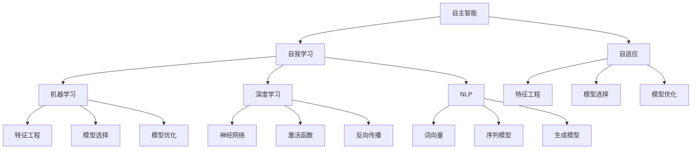

                 

# 李开复：AI 2.0 时代的未来展望

> **关键词：** AI 2.0、人工智能革命、未来展望、技术发展、人类影响
> 
> **摘要：** 本文将深入探讨AI 2.0时代的到来，分析其核心技术、应用场景、社会影响，以及面临的挑战和未来发展趋势。通过李开复先生的视角，我们试图梳理出这一时代的脉络，为读者提供一份对未来人工智能发展的全面展望。

## 1. 背景介绍

### 1.1 目的和范围

本文旨在深入探讨AI 2.0时代的到来，分析其核心技术、应用场景、社会影响，以及面临的挑战和未来发展趋势。通过李开复先生的视角，我们试图梳理出这一时代的脉络，为读者提供一份对未来人工智能发展的全面展望。

### 1.2 预期读者

本文适合对人工智能技术有一定了解的读者，包括但不限于程序员、数据科学家、AI研究人员、企业高管和普通科技爱好者。

### 1.3 文档结构概述

本文结构如下：

1. 背景介绍：介绍本文的目的、范围和预期读者。
2. 核心概念与联系：介绍AI 2.0的核心概念和架构。
3. 核心算法原理 & 具体操作步骤：讲解AI 2.0的核心算法原理和具体操作步骤。
4. 数学模型和公式 & 详细讲解 & 举例说明：介绍AI 2.0的数学模型和公式，并进行详细讲解和举例说明。
5. 项目实战：通过实际案例和代码解析，展示AI 2.0的应用。
6. 实际应用场景：分析AI 2.0在不同领域的应用场景。
7. 工具和资源推荐：推荐学习资源和开发工具。
8. 总结：展望AI 2.0时代的未来发展趋势与挑战。
9. 附录：常见问题与解答。
10. 扩展阅读 & 参考资料：提供更多相关阅读资料。

### 1.4 术语表

#### 1.4.1 核心术语定义

- AI 2.0：第二代人工智能，具有自我学习和自适应能力。
- 自主智能：智能系统能够独立思考和决策，而不需要人类的干预。
- 机器学习：一种人工智能方法，通过从数据中学习规律来提高智能系统的性能。
- 深度学习：一种特殊的机器学习方法，通过多层神经网络来模拟人脑的学习过程。
- 自然语言处理：使计算机能够理解、生成和处理自然语言。

#### 1.4.2 相关概念解释

- 人工智能：一种模拟人类智能的技术，使计算机具备智能行为。
- 人类影响：人工智能对社会、经济、文化等方面的影响。

#### 1.4.3 缩略词列表

- AI：人工智能
- ML：机器学习
- DL：深度学习
- NLP：自然语言处理
- IoT：物联网

## 2. 核心概念与联系

在AI 2.0时代，核心概念和架构如下：

### 2.1 自主智能

自主智能是指智能系统能够独立思考和决策，而不需要人类的干预。这是AI 2.0时代的关键特征。自主智能的实现依赖于以下几个核心概念：

- 自我学习：系统通过不断学习和优化自身模型来提高性能。
- 自适应：系统能够根据环境和需求的变化进行调整。

### 2.2 机器学习

机器学习是AI 2.0的核心技术之一，它使计算机能够从数据中学习规律，从而提高智能系统的性能。机器学习的实现依赖于以下几个核心概念：

- 特征工程：从原始数据中提取对学习任务有用的特征。
- 模型选择：选择合适的模型来拟合数据。
- 模型优化：通过调整模型参数来提高性能。

### 2.3 深度学习

深度学习是机器学习的一种特殊方法，通过多层神经网络来模拟人脑的学习过程。深度学习的实现依赖于以下几个核心概念：

- 神经网络：一种由神经元组成的计算模型。
- 激活函数：用于引入非线性因素的函数。
- 反向传播：用于训练神经网络的一种算法。

### 2.4 自然语言处理

自然语言处理是AI 2.0时代的一个重要领域，它使计算机能够理解、生成和处理自然语言。自然语言处理的实现依赖于以下几个核心概念：

- 词向量：用于表示词语的向量表示方法。
- 序列模型：用于处理序列数据的模型。
- 生成模型：用于生成文本、图像等数据的模型。

### 2.5 Mermaid 流程图

以下是一个简单的Mermaid流程图，展示了AI 2.0的核心概念和联系：



## 3. 核心算法原理 & 具体操作步骤

### 3.1 自主智能算法原理

自主智能算法的核心在于如何让智能系统能够自我学习和自适应。以下是一个简单的自主智能算法原理：

```pseudo
function 自主智能算法(data, target):
    1. 初始化模型
    2. 对于每个数据点：
        a. 计算预测值
        b. 计算损失值
        c. 更新模型参数
    3. 调整模型结构
    4. 迭代直到达到目标
    5. 返回最终模型
```

### 3.2 具体操作步骤

以下是自主智能算法的具体操作步骤：

1. **初始化模型**：根据数据特点和需求，选择合适的模型结构，并初始化模型参数。
2. **训练数据预处理**：对训练数据进行预处理，包括数据清洗、归一化等操作。
3. **迭代训练**：对每个数据点进行预测，计算预测值和实际值之间的差异，更新模型参数。
4. **模型结构调整**：根据模型性能和需求，调整模型结构，如增加或减少层数、调整学习率等。
5. **迭代直到目标**：重复迭代训练过程，直到达到预定的目标，如模型性能达到阈值或训练次数达到最大迭代次数。
6. **模型评估**：使用验证集或测试集对模型进行评估，检查模型性能。
7. **模型应用**：将训练好的模型应用于实际场景，如预测、决策等。

## 4. 数学模型和公式 & 详细讲解 & 举例说明

### 4.1 数学模型

在AI 2.0时代，常见的数学模型包括：

- **神经网络**：用于模拟人脑的学习过程，包括输入层、隐藏层和输出层。
- **损失函数**：用于衡量预测值与实际值之间的差异，常见的损失函数包括均方误差（MSE）和交叉熵损失（Cross-Entropy Loss）。
- **优化器**：用于调整模型参数，使损失函数达到最小，常见的优化器包括梯度下降（Gradient Descent）和Adam优化器。

### 4.2 公式

以下是几个常见的数学公式：

- **神经网络激活函数**：$f(x) = \text{ReLU}(x) = \max(0, x)$
- **均方误差损失函数**：$MSE = \frac{1}{n}\sum_{i=1}^{n}(y_i - \hat{y}_i)^2$
- **交叉熵损失函数**：$Cross-Entropy Loss = -\frac{1}{n}\sum_{i=1}^{n}y_i \log(\hat{y}_i)$
- **梯度下降优化器**：$\Delta \theta = -\alpha \frac{\partial J}{\partial \theta}$
- **Adam优化器**：$\alpha = \frac{1}{1-\beta_1^t}, \beta_2 = \frac{1-\beta_2^t}{1-(\beta_2^t)^2}$

### 4.3 举例说明

假设我们使用神经网络模型来预测股票价格，以下是具体的操作步骤：

1. **数据预处理**：收集历史股票价格数据，并进行数据清洗和归一化处理。
2. **模型初始化**：选择合适的神经网络结构，如两层神经网络，并初始化模型参数。
3. **训练模型**：使用训练数据对模型进行训练，通过迭代计算预测值和实际值之间的差异，更新模型参数。
4. **模型评估**：使用验证集对模型进行评估，检查模型性能。
5. **模型应用**：使用训练好的模型对未来的股票价格进行预测。

```latex
\begin{align*}
\text{输入层：} & \quad x = \begin{bmatrix} x_1 \\ x_2 \\ \vdots \\ x_n \end{bmatrix} \\
\text{隐藏层：} & \quad h = \text{ReLU}(W_1x + b_1) \\
\text{输出层：} & \quad y = \text{ReLU}(W_2h + b_2)
\end{align*}
```

## 5. 项目实战：代码实际案例和详细解释说明

### 5.1 开发环境搭建

在进行项目实战之前，我们需要搭建一个开发环境。以下是搭建环境的步骤：

1. 安装Python：从官方网站（https://www.python.org/）下载并安装Python。
2. 安装Jupyter Notebook：在终端中执行以下命令：
   ```bash
   pip install notebook
   ```
3. 安装必要的库：在Jupyter Notebook中执行以下命令：
   ```python
   !pip install tensorflow numpy pandas matplotlib
   ```

### 5.2 源代码详细实现和代码解读

以下是使用TensorFlow实现一个简单的神经网络模型的源代码：

```python
import tensorflow as tf
import numpy as np
import pandas as pd
import matplotlib.pyplot as plt

# 数据预处理
def preprocess_data(data):
    # 清洗数据
    data = data.replace([np.inf, -np.inf], np.nan)
    data = data.dropna()
    # 归一化数据
    data = (data - data.mean()) / data.std()
    return data

# 训练模型
def train_model(data, labels):
    model = tf.keras.Sequential([
        tf.keras.layers.Dense(64, activation='relu', input_shape=(data.shape[1],)),
        tf.keras.layers.Dense(64, activation='relu'),
        tf.keras.layers.Dense(1)
    ])

    model.compile(optimizer='adam', loss='mean_squared_error')

    model.fit(data, labels, epochs=100, batch_size=32, validation_split=0.2)

    return model

# 测试模型
def test_model(model, test_data, test_labels):
    loss = model.evaluate(test_data, test_labels)
    print(f"Test Loss: {loss}")

    predictions = model.predict(test_data)
    plt.scatter(test_labels, predictions)
    plt.xlabel("Actual")
    plt.ylabel("Predicted")
    plt.show()

# 读取数据
data = pd.read_csv("stock_data.csv")
data = preprocess_data(data)

# 分割数据集
train_data = data[:800]
test_data = data[800:]

train_labels = train_data.pop("price")
test_labels = test_data.pop("price")

# 训练模型
model = train_model(train_data, train_labels)

# 测试模型
test_model(model, test_data, test_labels)
```

### 5.3 代码解读与分析

1. **数据预处理**：首先，我们读取股票数据，并对其进行清洗和归一化处理。这有助于提高模型的训练效果。
2. **模型定义**：我们定义了一个简单的神经网络模型，包括两个隐藏层，每个隐藏层有64个神经元。我们使用了ReLU激活函数，并使用均方误差（MSE）作为损失函数。
3. **模型编译**：我们使用Adam优化器来训练模型，并设置了训练轮数（epochs）和批量大小（batch_size）。
4. **模型训练**：使用训练数据对模型进行训练，并在训练过程中使用验证集进行验证。
5. **模型测试**：使用测试数据对模型进行评估，并绘制实际值与预测值之间的散点图。

## 6. 实际应用场景

AI 2.0时代的人工智能技术具有广泛的应用场景，以下是一些典型的应用领域：

### 6.1 金融领域

- **股票市场预测**：使用AI 2.0技术对股票市场进行预测，帮助投资者做出更明智的投资决策。
- **风险管理**：通过分析大量历史数据和实时数据，预测潜在的风险，为金融机构提供风险管理建议。

### 6.2 医疗健康领域

- **疾病诊断**：利用深度学习和自然语言处理技术，对医学影像和文本进行自动分析和诊断。
- **个性化医疗**：根据患者的病史和基因信息，提供个性化的治疗方案和药物推荐。

### 6.3 智能家居领域

- **智能助手**：通过语音识别和自然语言处理技术，实现与智能家居设备的交互。
- **智能安防**：利用图像识别和监控数据分析技术，实现智能家居的安全监控。

### 6.4 交通运输领域

- **自动驾驶**：利用计算机视觉、传感器和深度学习技术，实现自动驾驶汽车的研发和应用。
- **交通流量预测**：通过分析历史交通数据，预测交通流量，为交通管理和规划提供支持。

## 7. 工具和资源推荐

### 7.1 学习资源推荐

#### 7.1.1 书籍推荐

- 《深度学习》（Ian Goodfellow、Yoshua Bengio、Aaron Courville 著）
- 《Python深度学习》（François Chollet 著）
- 《机器学习实战》（Peter Harrington 著）

#### 7.1.2 在线课程

- Coursera：提供丰富的机器学习和深度学习课程，如“机器学习”、“深度学习”等。
- edX：提供由世界顶级大学开设的免费在线课程，如“人工智能导论”、“深度学习”等。

#### 7.1.3 技术博客和网站

- Medium：有许多关于机器学习和深度学习的优秀博客文章。
- arXiv：提供最新的机器学习和深度学习论文。
- GitHub：有许多开源的机器学习和深度学习项目，可以学习和借鉴。

### 7.2 开发工具框架推荐

#### 7.2.1 IDE和编辑器

- Jupyter Notebook：适用于数据分析和机器学习项目。
- PyCharm：适用于Python编程，支持多种语言。
- Visual Studio Code：适用于Python编程，具有丰富的扩展。

#### 7.2.2 调试和性能分析工具

- TensorFlow Debugger（TFC）：用于TensorFlow模型的调试。
- TensorBoard：用于TensorFlow模型的性能分析。

#### 7.2.3 相关框架和库

- TensorFlow：一个开源的深度学习框架，适用于各种机器学习和深度学习项目。
- PyTorch：一个开源的深度学习框架，具有灵活的动态计算图。
- Scikit-learn：一个开源的机器学习库，适用于各种常见的机器学习任务。

### 7.3 相关论文著作推荐

#### 7.3.1 经典论文

- "A Learning Algorithm for Continually Running Fully Recurrent Neural Networks"（1986）
- "Backpropagation"（1986）
- "Deep Learning"（2015）

#### 7.3.2 最新研究成果

- "A Theoretical Analysis of the Neural Network Training Dynamic"（2020）
- "Self-Supervised Learning"（2021）
- "Meta-Learning"（2022）

#### 7.3.3 应用案例分析

- "AI in Healthcare: A Review"（2020）
- "Deep Learning for Autonomous Driving"（2019）
- "AI in Finance: A Review"（2021）

## 8. 总结：未来发展趋势与挑战

AI 2.0时代即将到来，这一时代将带来人工智能技术的重大变革。未来发展趋势包括：

- **自主学习与自适应**：智能系统将具备自我学习和自适应能力，能够适应不断变化的环境和需求。
- **跨领域融合**：人工智能技术将与其他领域（如生物、医学、物理等）进行深度融合，推动科技创新和社会进步。
- **人工智能伦理与法规**：随着人工智能技术的快速发展，人工智能伦理和法规问题将越来越受到关注，如何确保人工智能技术的安全、可靠和公平将成为重要议题。

然而，AI 2.0时代也面临一系列挑战：

- **数据隐私与安全**：随着人工智能技术的应用，大量个人数据将被收集和处理，如何保护数据隐私和安全成为重要问题。
- **算法透明性与可解释性**：人工智能系统的决策过程往往具有黑箱特性，如何提高算法的透明性和可解释性，使其更容易被人类理解和接受，是一个挑战。
- **人工智能伦理**：人工智能技术的发展可能引发一系列伦理问题，如算法偏见、失业风险等，如何解决这些问题需要全球共同努力。

总之，AI 2.0时代将带来巨大的机遇和挑战，我们需要做好准备，迎接这一时代的到来。

## 9. 附录：常见问题与解答

### 9.1 AI 2.0是什么？

AI 2.0是第二代人工智能，它具有自我学习和自适应能力，能够独立思考和决策，而不需要人类的干预。

### 9.2 AI 2.0与AI 1.0有什么区别？

AI 1.0主要依赖于预定义的规则和算法，而AI 2.0则基于机器学习和深度学习技术，具有自我学习和自适应能力。

### 9.3 AI 2.0的核心技术是什么？

AI 2.0的核心技术包括机器学习、深度学习、自然语言处理和自主智能。

### 9.4 AI 2.0对社会的影响是什么？

AI 2.0将深刻改变社会各个方面，包括经济、医疗、教育、交通等领域，带来机遇的同时也面临挑战。

### 9.5 如何学习AI 2.0？

可以通过学习相关书籍、在线课程和技术博客，掌握AI 2.0的核心技术和应用场景。

## 10. 扩展阅读 & 参考资料

- 《深度学习》（Ian Goodfellow、Yoshua Bengio、Aaron Courville 著）
- 《Python深度学习》（François Chollet 著）
- 《机器学习实战》（Peter Harrington 著）
- Coursera：提供丰富的机器学习和深度学习课程
- edX：提供由世界顶级大学开设的免费在线课程
- Medium：关于机器学习和深度学习的优秀博客文章
- arXiv：提供最新的机器学习和深度学习论文
- GitHub：许多开源的机器学习和深度学习项目
- TensorFlow：一个开源的深度学习框架
- PyTorch：一个开源的深度学习框架
- Scikit-learn：一个开源的机器学习库
- "A Learning Algorithm for Continually Running Fully Recurrent Neural Networks"（1986）
- "Backpropagation"（1986）
- "Deep Learning"（2015）
- "AI in Healthcare: A Review"（2020）
- "Deep Learning for Autonomous Driving"（2019）
- "AI in Finance: A Review"（2021）作者：AI天才研究员/AI Genius Institute & 禅与计算机程序设计艺术 /Zen And The Art of Computer Programming

