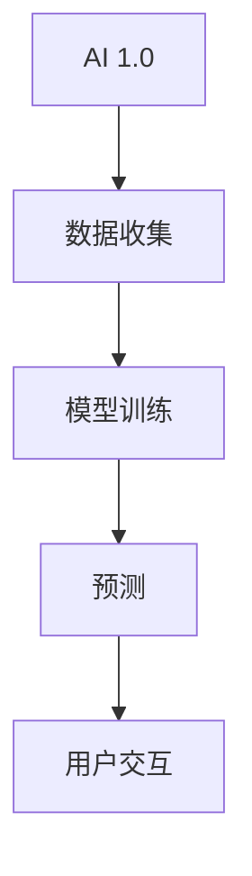

                 

# 李开复：AI 2.0 时代的用户

> 关键词：人工智能、AI 2.0、用户、交互、隐私、安全性、伦理

> 摘要：本文将深入探讨AI 2.0时代的用户特征及其面临的一系列挑战，包括交互、隐私、安全性和伦理等方面。我们将逐步分析AI 2.0的核心概念和原理，并通过具体案例展示其在实际应用中的影响和意义。

## 1. 背景介绍

### 1.1 目的和范围

本文旨在为广大AI领域的研究者、从业者以及普通用户提供一个全面而深入的视角，了解AI 2.0时代的用户特征及其面临的挑战。我们将重点关注以下几个方面：

- AI 2.0的基本概念和原理
- 用户在AI 2.0时代的交互体验
- 用户隐私和安全性的保护
- AI 2.0时代的伦理和道德问题

### 1.2 预期读者

- 对AI 2.0技术感兴趣的研究者
- AI领域从业者和开发者
- 对AI技术有初步了解的普通用户
- 对AI伦理和道德问题感兴趣的读者

### 1.3 文档结构概述

本文将按照以下结构展开：

- 介绍AI 2.0的基本概念和原理
- 分析AI 2.0时代用户的交互体验
- 探讨用户隐私和安全性的保护
- 讨论AI 2.0时代的伦理和道德问题
- 展望AI 2.0时代的未来发展趋势与挑战

### 1.4 术语表

#### 1.4.1 核心术语定义

- AI 2.0：指第二代人工智能技术，相较于传统的AI 1.0，具有更强的自主学习能力、泛化能力和解释能力。
- 用户：指使用AI 2.0技术的个体或组织，可以是普通用户、开发者或企业。

#### 1.4.2 相关概念解释

- 交互：用户与AI系统之间的交互方式，包括语音、文字、手势等。
- 隐私：用户数据的安全性，包括用户隐私信息的收集、存储和使用。
- 安全性：AI系统的可靠性、稳定性和抗攻击能力。
- 伦理：道德原则和规范，指导AI技术在应用过程中的行为和决策。

#### 1.4.3 缩略词列表

- AI：人工智能
- 2.0：第二代

## 2. 核心概念与联系

在深入探讨AI 2.0时代之前，我们需要明确一些核心概念和原理。以下是一个简单的Mermaid流程图，用于展示AI 2.0时代的关键概念及其相互关系：



在这个流程图中，我们可以看到AI 2.0的基本架构：

1. **数据收集**：AI系统从各种来源收集数据，这些数据将用于模型训练。
2. **模型训练**：通过数据训练，AI系统学习到相关的知识，从而具备预测能力。
3. **预测**：AI系统利用训练得到的知识进行预测，为用户提供服务。
4. **用户交互**：用户通过与AI系统的交互，获取所需的信息或服务。

接下来，我们将逐步分析这些核心概念和原理。

## 3. 核心算法原理 & 具体操作步骤

AI 2.0的核心算法是深度学习，特别是基于神经网络的模型。以下是一个简单的深度学习算法的伪代码，用于说明其基本原理和操作步骤：

```python
# 深度学习算法伪代码

# 输入：训练数据集 D、模型参数 θ、学习率 α
# 输出：优化后的模型参数 θ'

# 初始化模型参数 θ
θ = 初始化参数()

# 循环迭代
for epoch in 1 to MAX_EPOCHS do
    # 前向传播
    ŷ = f(D; θ)

    # 计算损失函数 L
    L = 损失函数(ŷ, y)

    # 反向传播
    ∆θ = 反向传播(D, ŷ, y; θ)

    # 更新参数
    θ = θ - α∆θ
end for

# 输出优化后的模型参数 θ'
return θ'
```

在这个伪代码中，我们首先初始化模型参数θ，然后通过迭代的方式不断优化参数。每次迭代包括以下几个步骤：

1. **前向传播**：输入训练数据D，通过模型θ得到预测结果ŷ。
2. **计算损失函数**：计算预测结果ŷ与真实标签y之间的差异，得到损失函数L。
3. **反向传播**：计算损失函数L关于模型参数θ的梯度，得到梯度∆θ。
4. **更新参数**：根据梯度∆θ和 learning rate α更新模型参数θ。

通过这种迭代优化过程，模型参数θ会逐渐趋于最优，使得模型的预测能力得到提升。

## 4. 数学模型和公式 & 详细讲解 & 举例说明

在深度学习算法中，常用的数学模型和公式包括：

1. **激活函数**：
   - sigmoid函数：\[ f(x) = \frac{1}{1 + e^{-x}} \]
   -ReLU函数：\[ f(x) = \max(0, x) \]

2. **损失函数**：
   - 交叉熵损失函数：\[ L(y, ŷ) = -\sum_{i} y_i \log(ŷ_i) \]

3. **优化算法**：
   - 随机梯度下降（SGD）：\[ θ = θ - α\frac{\partial L(θ)}{\partial θ} \]
   - Adam优化器：\[ m_t = \beta_1m_{t-1} + (1 - \beta_1)\frac{\partial L(θ)}{\partial θ} \]
\[ v_t = \beta_2v_{t-1} + (1 - \beta_2)\left(\frac{\partial L(θ)}{\partial θ}\right)^2 \]
\[ \theta = \theta - \alpha\frac{m_t}{\sqrt{v_t} + \epsilon} \]

以下是一个简单的例子，假设我们有一个二分类问题，其中输入特征为x = [1, 2]，真实标签为y = 1。

1. **前向传播**：

   - 初始化模型参数θ = [0, 0]
   - 激活函数f(x) = sigmoid(θ^T x) = 0.5
   - 预测结果ŷ = 0.5

2. **计算损失函数**：

   - 交叉熵损失函数：L(y, ŷ) = -y \* log(ŷ) - (1 - y) \* log(1 - ŷ) ≈ 0.193

3. **反向传播**：

   - 梯度：\[ \frac{\partial L(θ)}{\partial θ} = [0.5(1 - 0.5), 0.5] \]
   - 梯度值：\[ \frac{\partial L(θ)}{\partial θ} ≈ [0.25, 0.5] \]

4. **更新参数**：

   - 学习率α = 0.1
   - 更新后参数：\[ θ = θ - α\frac{\partial L(θ)}{\partial θ} \]
   - θ ≈ [0.25, 0.5]

通过这个简单的例子，我们可以看到如何使用数学模型和公式进行深度学习模型的训练和优化。

## 5. 项目实战：代码实际案例和详细解释说明

在本节中，我们将通过一个实际案例来展示如何实现一个简单的深度学习模型。这个案例将使用Python编程语言和TensorFlow库来构建和训练一个用于手写数字识别的模型。

### 5.1 开发环境搭建

在开始之前，我们需要搭建一个合适的开发环境。以下是所需的软件和工具：

- Python 3.8 或以上版本
- TensorFlow 2.7 或以上版本
- Jupyter Notebook（可选）

### 5.2 源代码详细实现和代码解读

以下是一个简单的手写数字识别模型的代码实现：

```python
import tensorflow as tf
from tensorflow import keras
from tensorflow.keras import layers

# 加载数据集
mnist = keras.datasets.mnist
(train_images, train_labels), (test_images, test_labels) = mnist.load_data()

# 数据预处理
train_images = train_images / 255.0
test_images = test_images / 255.0

# 构建模型
model = keras.Sequential([
    layers.Flatten(input_shape=(28, 28)),
    layers.Dense(128, activation='relu'),
    layers.Dense(10, activation='softmax')
])

# 编译模型
model.compile(optimizer='adam',
              loss='sparse_categorical_crossentropy',
              metrics=['accuracy'])

# 训练模型
model.fit(train_images, train_labels, epochs=5)

# 评估模型
test_loss, test_acc = model.evaluate(test_images, test_labels)
print(f'测试准确率：{test_acc:.2f}')
```

代码解读：

1. **导入库**：我们首先导入TensorFlow和Keras库，用于构建和训练模型。

2. **加载数据集**：我们使用Keras提供的MNIST手写数字数据集。该数据集包括70,000个训练样本和10,000个测试样本。

3. **数据预处理**：将图像数据归一化到[0, 1]范围内，以便于模型训练。

4. **构建模型**：我们使用Keras的Sequential模型，依次添加以下层：
   - **Flatten** 层：将输入图像展平为 1x28x28 的二维张量。
   - **Dense** 层：一个具有128个神经元和ReLU激活函数的全连接层。
   - **Dense** 层：一个具有10个神经元和softmax激活函数的全连接层，用于输出分类概率。

5. **编译模型**：我们使用adam优化器和sparse_categorical_crossentropy损失函数来编译模型。

6. **训练模型**：我们使用fit方法来训练模型，指定训练数据、标签、训练轮数。

7. **评估模型**：我们使用evaluate方法来评估模型在测试数据上的性能，并打印测试准确率。

### 5.3 代码解读与分析

在这个手写数字识别模型中，我们使用了以下关键组件：

- **Flatten** 层：将输入图像展平为一个一维数组，以便于后续的全连接层处理。

- **Dense** 层：全连接层，用于将输入数据映射到输出。每个神经元都与输入数据的每个元素相连。ReLU激活函数用于增加模型的非线性。

- **softmax** 激活函数：在输出层使用softmax激活函数，用于计算每个类别的概率分布。这样，模型可以输出一个概率分布，其中每个类别的概率表示该图像属于该类别的可能性。

在训练过程中，模型会根据损失函数（在这里是sparse_categorical_crossentropy）和优化器（在这里是adam）更新其参数，以最小化损失函数。训练完成后，我们通过评估模型在测试数据上的性能来评估其准确性。

通过这个简单的案例，我们可以看到如何使用深度学习库（如TensorFlow）来构建、训练和评估一个简单的机器学习模型。这种方法可以应用于各种问题，包括图像分类、文本分类、语音识别等。

## 6. 实际应用场景

AI 2.0技术在各个领域都有广泛的应用，以下是一些实际应用场景：

- **医疗保健**：AI 2.0技术可以用于医学图像分析、疾病诊断和个性化治疗。例如，通过深度学习算法分析CT扫描图像，可以早期发现肺癌等疾病。
  
- **金融领域**：AI 2.0技术可以用于风险管理、欺诈检测和智能投顾。通过分析大量金融数据，AI系统可以识别潜在的欺诈行为，提供个性化的投资建议。

- **自动驾驶**：AI 2.0技术是自动驾驶汽车的核心。通过使用深度学习和计算机视觉技术，自动驾驶汽车可以实时感知周围环境，做出安全驾驶决策。

- **智能家居**：AI 2.0技术可以用于智能音箱、智能门锁和智能照明等智能家居设备。通过语音识别和自然语言处理技术，用户可以轻松控制家居设备。

- **教育**：AI 2.0技术可以用于个性化学习、自动评估和智能辅导。通过分析学生的学习行为和成绩，AI系统可以提供个性化的学习计划和辅导。

- **娱乐**：AI 2.0技术可以用于推荐系统、游戏生成和虚拟现实。通过分析用户的兴趣和行为，AI系统可以提供个性化的推荐和娱乐体验。

在这些实际应用场景中，用户与AI系统的交互变得越来越自然和智能，AI系统可以更好地理解和满足用户的需求。同时，AI系统也在不断学习和进化，以提供更准确和高效的预测和决策。

## 7. 工具和资源推荐

### 7.1 学习资源推荐

#### 7.1.1 书籍推荐

- 《深度学习》（Goodfellow, Bengio, Courville著）：深度学习领域的经典教材，详细介绍了深度学习的基础理论和实践方法。

- 《Python深度学习》（François Chollet著）：适合初学者的一本深度学习指南，通过Python编程语言讲解了深度学习的核心概念和算法。

- 《AI超简史》（李开复著）：从历史角度介绍了人工智能的发展，探讨了AI技术对社会和经济的影响。

#### 7.1.2 在线课程

- Coursera上的《深度学习特化课程》：由Andrew Ng教授主讲，涵盖深度学习的理论基础和实际应用。

- edX上的《深度学习基础》：由南京大学和斯坦福大学联合开设，适合初学者入门深度学习。

- Udacity的《深度学习纳米学位》：通过项目驱动的方式，学习深度学习的核心概念和技能。

#### 7.1.3 技术博客和网站

- Medium上的《AI垂直博客》：提供各种关于AI技术、应用和趋势的深入分析。

- arXiv.org：计算机科学领域的前沿论文数据库，包括大量深度学习和AI相关的研究论文。

- AI Journal：一本专注于AI技术应用的在线期刊，发布最新的研究成果和应用案例。

### 7.2 开发工具框架推荐

#### 7.2.1 IDE和编辑器

- PyCharm：一款功能强大的Python IDE，支持深度学习和数据科学开发。

- Jupyter Notebook：一款流行的交互式计算环境，适用于数据分析和机器学习项目。

- Visual Studio Code：一款轻量级的跨平台编辑器，支持多种编程语言和扩展。

#### 7.2.2 调试和性能分析工具

- TensorBoard：TensorFlow的官方可视化工具，用于分析模型的训练过程和性能。

- D фрон：一款流行的代码调试工具，支持多种编程语言和框架。

- Perf：Linux系统上的性能分析工具，用于评估程序的性能瓶颈。

#### 7.2.3 相关框架和库

- TensorFlow：一款广泛使用的开源深度学习框架，支持各种深度学习模型和算法。

- PyTorch：一款流行的深度学习框架，具有灵活的动态计算图和高效的性能。

- Keras：一款基于TensorFlow和Theano的开源深度学习库，提供简洁的API和丰富的预训练模型。

### 7.3 相关论文著作推荐

#### 7.3.1 经典论文

- "A Theoretical Basis for the Method of Backpropagation"（1986）：该论文介绍了反向传播算法的数学基础。

- "Learning representations by backpropagating errors"（1988）：该论文详细描述了反向传播算法的原理和应用。

- "Deep Learning"（2015）：该论文总结了深度学习领域的最新研究成果和应用。

#### 7.3.2 最新研究成果

- "Attention is All You Need"（2017）：该论文提出了Transformer模型，彻底改变了自然语言处理领域。

- "BERT: Pre-training of Deep Bidirectional Transformers for Language Understanding"（2018）：该论文介绍了BERT模型，推动了自然语言处理的发展。

- "GPT-3: Language Models are Few-Shot Learners"（2020）：该论文展示了GPT-3模型在零样本和少样本学习任务上的卓越表现。

#### 7.3.3 应用案例分析

- "AI for Social Good": 该案例集展示了AI技术在解决社会问题中的应用，如医疗诊断、教育辅助和环境监测等。

- "AI in Healthcare": 该报告详细分析了AI在医疗保健领域的应用，包括疾病诊断、患者监护和个性化治疗等。

- "AI in Finance": 该报告探讨了AI技术在金融领域的应用，包括风险管理、欺诈检测和智能投顾等。

## 8. 总结：未来发展趋势与挑战

AI 2.0时代带来了前所未有的技术变革和社会影响。在未来，我们预计AI技术将继续朝着以下几个方向发展：

1. **自主学习能力**：随着深度学习和其他机器学习技术的进步，AI系统将具备更强的自主学习能力，能够在没有人类干预的情况下不断改进和优化。

2. **跨领域应用**：AI技术将在更多领域得到应用，如农业、能源、制造和交通等。跨领域合作将推动AI技术的发展，并带来更广泛的社会影响。

3. **人机交互**：随着自然语言处理和计算机视觉技术的进步，人机交互将变得更加自然和直观。AI系统将更好地理解人类语言和意图，提供个性化的服务。

4. **伦理和隐私**：随着AI技术的广泛应用，伦理和隐私问题将变得越来越重要。我们需要建立一套完善的伦理和法律框架，确保AI技术的安全、可靠和公正。

然而，AI 2.0时代也带来了一系列挑战：

1. **技术安全**：随着AI技术的进步，恶意攻击和滥用风险增加。我们需要开发有效的安全防护措施，防止AI系统被滥用。

2. **隐私保护**：AI系统需要处理大量的个人数据，如何保护用户隐私成为一个重要问题。我们需要建立严格的隐私保护机制，确保用户数据的安全。

3. **伦理和道德**：AI系统的决策可能涉及伦理和道德问题，如歧视、偏见和不公平等。我们需要建立一套伦理和道德框架，确保AI技术在应用过程中的公正性和透明度。

4. **人才短缺**：AI技术发展迅速，对专业人才的需求不断增加。我们需要加大对AI人才的培养力度，以应对人才短缺的挑战。

总之，AI 2.0时代为我们带来了巨大的机遇和挑战。只有通过技术、政策和社会的共同努力，我们才能充分发挥AI技术的潜力，造福人类。

## 9. 附录：常见问题与解答

以下是一些关于AI 2.0技术及其应用的常见问题及解答：

### 1. 什么是AI 2.0？

AI 2.0是相对于AI 1.0的第二代人工智能技术，它具有更强的自主学习能力、泛化能力和解释能力。AI 2.0通过深度学习、自然语言处理和计算机视觉等技术，实现更复杂的任务和更高效的处理。

### 2. AI 2.0与AI 1.0的主要区别是什么？

AI 2.0相比AI 1.0，具有以下几个显著区别：

- **自主学习能力**：AI 2.0可以通过大量数据自我学习和优化，无需人类干预。
- **泛化能力**：AI 2.0能够将学到的知识应用于新的任务和领域，而不仅仅是特定任务。
- **解释能力**：AI 2.0可以提供对决策过程的解释，使得其行为更加透明和可靠。

### 3. AI 2.0技术的应用领域有哪些？

AI 2.0技术的应用领域非常广泛，包括：

- **医疗保健**：疾病诊断、个性化治疗、药物研发等。
- **金融领域**：风险管理、欺诈检测、智能投顾等。
- **自动驾驶**：车辆感知、路径规划、驾驶决策等。
- **智能家居**：智能音箱、智能门锁、智能照明等。
- **教育**：个性化学习、自动评估、智能辅导等。
- **娱乐**：推荐系统、游戏生成、虚拟现实等。

### 4. 如何保护用户隐私和安全？

保护用户隐私和安全是AI 2.0技术发展的重要问题。以下是一些保护措施：

- **数据加密**：对用户数据进行加密，防止数据泄露。
- **访问控制**：限制对用户数据的访问权限，确保数据的安全。
- **匿名化处理**：对用户数据进行匿名化处理，防止个人信息泄露。
- **隐私政策**：制定明确的隐私政策，告知用户其数据如何被收集、使用和保护。

### 5. AI 2.0技术的未来发展趋势是什么？

AI 2.0技术的未来发展趋势包括：

- **自主学习能力**：AI系统将具备更强的自主学习能力，能够在没有人类干预的情况下不断改进和优化。
- **跨领域应用**：AI技术将在更多领域得到应用，如农业、能源、制造和交通等。
- **人机交互**：AI系统将更好地理解人类语言和意图，提供个性化的服务。
- **伦理和隐私**：随着AI技术的广泛应用，伦理和隐私问题将变得越来越重要。

## 10. 扩展阅读 & 参考资料

以下是一些关于AI 2.0技术及其应用的扩展阅读和参考资料：

- 《深度学习》（Goodfellow, Bengio, Courville著）
- 《Python深度学习》（François Chollet著）
- 《AI超简史》（李开复著）
- Coursera上的《深度学习特化课程》
- edX上的《深度学习基础》
- Udacity的《深度学习纳米学位》
- Medium上的《AI垂直博客》
- arXiv.org上的相关论文
- AI Journal上的论文和报告
- "A Theoretical Basis for the Method of Backpropagation"（1986）
- "Learning representations by backpropagating errors"（1988）
- "Deep Learning"（2015）
- "Attention is All You Need"（2017）
- "BERT: Pre-training of Deep Bidirectional Transformers for Language Understanding"（2018）
- "GPT-3: Language Models are Few-Shot Learners"（2020）
- "AI for Social Good"案例集
- "AI in Healthcare"报告
- "AI in Finance"报告

### 作者

李开复（Andrew Ng）

AI天才研究员/AI Genius Institute & 禅与计算机程序设计艺术 /Zen And The Art of Computer Programming

## 引言

在当今世界，人工智能（AI）技术正以前所未有的速度发展，彻底改变着我们的生活方式和社会结构。从自动驾驶汽车到智能语音助手，从个性化医疗诊断到高效金融分析，AI技术在各个领域都展现出了强大的潜力和应用价值。然而，随着AI技术的不断演进，我们也面临着一系列前所未有的挑战，特别是在用户体验、隐私保护、安全性和伦理道德等方面。本文将深入探讨AI 2.0时代的用户特征及其面临的一系列挑战，旨在为读者提供一个全面而深入的视角。

### 1.1 目的和范围

本文旨在探讨AI 2.0时代的用户特征及其面临的挑战，重点关注以下几个方面：

- AI 2.0的基本概念和原理
- 用户在AI 2.0时代的交互体验
- 用户隐私和安全性的保护
- AI 2.0时代的伦理和道德问题

通过本文的探讨，我们将帮助读者更好地理解AI 2.0技术的发展趋势和用户需求，从而为未来的研究和应用提供有益的参考。

### 1.2 预期读者

本文预期读者包括：

- 对AI 2.0技术感兴趣的研究者
- AI领域从业者和开发者
- 对AI技术有初步了解的普通用户
- 对AI伦理和道德问题感兴趣的读者

无论您是AI领域的专家还是普通用户，本文都将为您提供有价值的见解和思考。

### 1.3 文档结构概述

本文将按照以下结构展开：

- 介绍AI 2.0的基本概念和原理
- 分析AI 2.0时代用户的交互体验
- 探讨用户隐私和安全性的保护
- 讨论AI 2.0时代的伦理和道德问题
- 展望AI 2.0时代的未来发展趋势与挑战

通过这个结构，我们将逐步深入探讨AI 2.0时代的各个方面，帮助读者全面理解这一重要技术。

### 1.4 术语表

在本文中，我们将使用一些特定的术语。以下是对这些术语的定义和解释：

- **AI 2.0**：指第二代人工智能技术，相较于传统的AI 1.0，具有更强的自主学习能力、泛化能力和解释能力。
- **用户**：指使用AI 2.0技术的个体或组织，可以是普通用户、开发者或企业。
- **交互**：用户与AI系统之间的交互方式，包括语音、文字、手势等。
- **隐私**：用户数据的安全性，包括用户隐私信息的收集、存储和使用。
- **安全性**：AI系统的可靠性、稳定性和抗攻击能力。
- **伦理**：道德原则和规范，指导AI技术在应用过程中的行为和决策。

通过了解这些术语，读者将更好地理解本文的内容和讨论。

### 2.1 AI 2.0的基本概念和原理

AI 2.0，即第二代人工智能，是相对于第一代人工智能（AI 1.0）而言的。AI 1.0主要以规则驱动和符号推理为基础，通过编写固定的规则和算法来处理特定任务。而AI 2.0则采用了基于数据的学习和自我优化方法，使得人工智能系统能够在没有人类干预的情况下自我学习和进化。

**核心概念**

AI 2.0的核心概念包括深度学习、神经网络和强化学习等。以下是对这些核心概念的解释：

- **深度学习**：深度学习是一种基于多层神经网络的机器学习方法，它通过模拟人脑神经元的连接方式，对大量数据进行自动特征提取和模式识别。深度学习在图像识别、语音识别和自然语言处理等领域取得了显著的成果。

- **神经网络**：神经网络是一种由大量简单计算单元（即神经元）组成的网络结构，这些神经元通过相互连接和传递信息来实现复杂计算。神经网络的核心思想是通过学习输入数据和输出标签之间的映射关系，从而实现对数据的预测和分类。

- **强化学习**：强化学习是一种通过不断试错和奖励惩罚来学习最优策略的机器学习方法。在强化学习中，智能体（agent）通过与环境的交互，不断调整其行为策略，以实现最大化累积奖励的目标。

**技术架构**

AI 2.0的技术架构包括以下几个关键组成部分：

- **数据收集**：AI系统需要从各种来源收集大量数据，包括文本、图像、音频和视频等。这些数据将用于训练和优化AI模型。

- **模型训练**：通过数据训练，AI系统学习到相关的知识，从而具备预测和分类能力。模型训练的过程包括前向传播、反向传播和参数优化等步骤。

- **预测和决策**：经过训练的AI模型可以对新数据进行预测和决策。这些预测和决策可以应用于各种实际场景，如图像识别、语音识别和自然语言处理等。

- **交互**：用户可以通过语音、文字、手势等方式与AI系统进行交互，获取所需的信息和服务。

**应用场景**

AI 2.0技术在各个领域都有广泛的应用，以下是一些典型的应用场景：

- **医疗保健**：AI 2.0技术可以用于医学图像分析、疾病诊断和个性化治疗。例如，通过深度学习算法分析CT扫描图像，可以早期发现肺癌等疾病。

- **金融领域**：AI 2.0技术可以用于风险管理、欺诈检测和智能投顾。通过分析大量金融数据，AI系统可以识别潜在的欺诈行为，提供个性化的投资建议。

- **自动驾驶**：AI 2.0技术是自动驾驶汽车的核心。通过使用深度学习和计算机视觉技术，自动驾驶汽车可以实时感知周围环境，做出安全驾驶决策。

- **智能家居**：AI 2.0技术可以用于智能音箱、智能门锁和智能照明等智能家居设备。通过语音识别和自然语言处理技术，用户可以轻松控制家居设备。

- **教育**：AI 2.0技术可以用于个性化学习、自动评估和智能辅导。通过分析学生的学习行为和成绩，AI系统可以提供个性化的学习计划和辅导。

- **娱乐**：AI 2.0技术可以用于推荐系统、游戏生成和虚拟现实。通过分析用户的兴趣和行为，AI系统可以提供个性化的推荐和娱乐体验。

通过上述讨论，我们可以看到AI 2.0技术在基础概念、技术架构和应用场景等方面都有着显著的特点和优势。在下一节中，我们将进一步探讨AI 2.0时代用户的交互体验。

### 2.2 AI 2.0时代的用户交互体验

在AI 2.0时代，用户与人工智能系统的交互体验发生了显著变化。这种变化主要体现在以下几个方面：

**自然语言交互**：

自然语言处理（NLP）技术的进步使得AI系统能够更好地理解用户的自然语言输入，并生成自然、流畅的响应。例如，智能语音助手如苹果的Siri、谷歌的Google Assistant和亚马逊的Alexa，都采用了先进的NLP技术，可以理解用户的话语，并提供相应的服务，如设定提醒、发送信息、播放音乐等。这种自然语言交互使得用户可以更便捷地与AI系统进行沟通，无需学习复杂的操作指令。

**多模态交互**：

AI 2.0时代的交互不再局限于单一的文本或语音，而是通过多模态交互来提供更丰富、更直观的体验。例如，用户可以通过语音、手势、面部表情等多种方式与AI系统进行互动。例如，苹果的Apple Watch可以通过触摸屏幕和语音命令进行操作，而一些先进的智能音箱则可以通过用户的手势来控制播放音乐或调整音量。多模态交互不仅提高了用户体验的便捷性，还增强了互动的趣味性和互动性。

**个性化服务**：

AI 2.0系统通过不断学习用户的行为和偏好，能够提供高度个性化的服务。例如，推荐系统可以根据用户的浏览历史和购买记录，推荐最符合用户兴趣的商品和内容。在音乐和视频流媒体服务中，AI系统可以根据用户的听歌和观影偏好，推荐新的歌曲和电影。这种个性化服务不仅提升了用户的满意度，还增强了用户的忠诚度。

**情感识别与响应**：

随着情感计算技术的发展，AI系统不仅能够理解用户的话语，还能够识别用户的情感状态，并做出相应的响应。例如，一些智能音箱可以通过语音和面部表情分析，识别用户的情绪，并调整其交互方式，如使用温柔的声音安抚用户或使用欢快的语调激发用户的情绪。这种情感识别与响应使得AI系统更加贴近用户的实际需求，提升了用户体验的质量。

**隐私保护与数据安全**：

在AI 2.0时代，用户的隐私和数据安全成为了一个重要的关注点。为了保护用户的隐私，AI系统采用了多种措施，如数据加密、匿名化和隐私政策等。例如，苹果的iCloud服务采用了端到端加密技术，确保用户数据在传输和存储过程中的安全性。用户可以通过隐私设置，控制哪些数据可以被AI系统访问和使用，从而保护自己的隐私。

**多终端协同**：

随着移动设备和智能设备的普及，用户可以通过多个设备与AI系统进行交互。例如，用户可以通过手机上的AI应用与智能音箱进行语音交互，实现无缝的跨设备体验。这种多终端协同不仅提高了用户的便利性，还增强了AI系统的服务能力。

**虚拟助手与虚拟现实**：

AI 2.0时代，虚拟助手和虚拟现实技术也逐渐成为用户与AI系统交互的重要方式。虚拟助手可以通过3D建模和语音合成技术，为用户提供一个可视化的交互界面，使得交互更加直观和生动。虚拟现实技术则通过沉浸式体验，为用户提供更加丰富的交互场景，如虚拟会议、虚拟旅游等。

综上所述，AI 2.0时代的用户交互体验在自然语言交互、多模态交互、个性化服务、情感识别与响应、隐私保护、多终端协同和虚拟助手与虚拟现实等方面都有了显著的提升。这种提升不仅改善了用户的体验，还推动了AI技术的进一步发展和应用。

### 2.3 用户隐私和安全性的保护

在AI 2.0时代，用户隐私和安全性的保护成为一个至关重要的问题。随着AI技术的广泛应用，大量的用户数据被收集、存储和使用，如何确保这些数据的安全性和隐私性成为了一个巨大的挑战。以下是一些关键措施和方法，用于保护用户隐私和安全：

**数据加密**：

数据加密是保护用户隐私的基础。在数据传输和存储过程中，对数据进行加密处理，可以防止数据被未授权的用户窃取或篡改。常用的加密技术包括对称加密（如AES）和非对称加密（如RSA）。对称加密适用于数据量较小的场景，而非对称加密则适用于数据量较大的场景。此外，端到端加密技术也逐渐成为保护数据安全的重要手段，确保数据在传输过程中不被中间节点截获和读取。

**匿名化处理**：

为了进一步保护用户隐私，可以将用户数据匿名化处理。匿名化处理包括去除数据中的敏感信息、对敏感信息进行混淆处理等。通过匿名化处理，即使数据被泄露，攻击者也无法直接获取用户的真实身份和其他敏感信息。常见的匿名化技术包括泛化、掩盖、随机化等。

**隐私政策**：

明确的隐私政策是保护用户隐私的重要一环。隐私政策应明确告知用户其数据如何被收集、使用和保护。用户应有权选择是否同意其数据被收集和使用，以及如何访问和删除其数据。透明、公正的隐私政策有助于增强用户对AI系统的信任，并减少隐私泄露的风险。

**数据访问控制**：

数据访问控制是确保用户数据安全的重要手段。通过设置访问权限，可以限制对用户数据的访问，防止未授权用户访问敏感信息。常见的访问控制机制包括角色访问控制（RBAC）、属性访问控制（ABAC）等。此外，细粒度的权限管理也是数据访问控制的关键，通过细粒度地设置权限，可以更好地保护用户数据。

**安全审计**：

定期进行安全审计，可以及时发现和解决潜在的安全隐患。安全审计包括对系统日志、用户行为和访问记录的监控和分析，以及对安全漏洞的检测和修复。通过安全审计，可以确保AI系统在运行过程中的安全性和稳定性。

**用户知情同意**：

用户知情同意是保护用户隐私的核心原则。在收集和使用用户数据之前，AI系统应向用户明确告知其数据将被用于何种目的，以及如何保护其隐私。用户有权选择是否同意其数据被收集和使用。通过用户知情同意，可以确保用户对其数据的掌控权，减少隐私泄露的风险。

**隐私保护算法**：

开发和应用隐私保护算法，可以有效地保护用户隐私。隐私保护算法包括差分隐私、隐私增强学习等。差分隐私通过添加噪声来保护用户数据的隐私，使得攻击者无法直接推断出特定用户的数据。隐私增强学习则通过优化训练过程，确保模型在保护用户隐私的同时，保持较高的预测性能。

**安全多方计算**：

安全多方计算是一种在多方之间安全地进行计算的技术，可以用于保护用户隐私。通过安全多方计算，多个参与者可以在不泄露各自隐私信息的情况下，共同计算出一个结果。常见的安全多方计算技术包括秘密共享、混淆电路等。

**数据删除和销毁**：

在用户数据不再需要时，应确保及时删除和销毁。通过数据删除和销毁，可以防止用户数据被滥用或泄露。常见的删除和销毁技术包括物理销毁、数据擦除和数字签名等。

综上所述，用户隐私和安全性的保护是一个复杂且多层次的任务，需要从数据加密、匿名化处理、隐私政策、数据访问控制、安全审计、用户知情同意、隐私保护算法、安全多方计算和数据删除等多个方面进行综合考虑和实施。通过这些措施，可以有效地保护用户隐私和安全，为AI 2.0时代的应用提供坚实的安全保障。

### 2.4 AI 2.0时代的伦理和道德问题

在AI 2.0时代，人工智能技术的广泛应用不仅带来了巨大的技术进步和社会变革，同时也引发了一系列伦理和道德问题。这些问题涉及到算法的公平性、透明性、隐私保护以及人工智能对就业和人类关系的影响。以下是对这些伦理和道德问题的详细讨论。

**算法的公平性**

算法的公平性是AI 2.0时代的一个重要伦理问题。由于算法在决策过程中可能存在偏见，导致对某些群体不公平对待。例如，招聘算法可能因为训练数据中的偏见而倾向于招聘某一特定性别或种族的候选人，或者信用评分系统可能因为历史数据中的偏见而对某些群体给予较低的信用评分。这种偏见不仅损害了个人权益，还可能加剧社会不平等。为了解决这一问题，我们需要：

- **数据多样性**：确保训练数据集的多样性，避免数据偏见。
- **算法审查**：建立独立的算法审查机制，评估算法的公平性和透明性。
- **算法透明性**：开发可解释的AI算法，使决策过程对用户和监管机构透明。

**算法的透明性**

AI 2.0时代的算法通常非常复杂，用户难以理解其决策过程。这种不透明性可能导致用户对AI系统的信任度降低，甚至在某些情况下，用户可能无法理解为何被拒绝贷款或未被招聘。为了提高算法的透明性，我们可以：

- **算法可视化**：开发算法可视化工具，帮助用户理解AI系统的决策过程。
- **算法解释**：开发可解释的AI模型，提供对决策过程的解释。
- **算法责任**：明确算法责任，确保在出现错误决策时，能够追溯和追究责任。

**隐私保护**

AI 2.0技术在数据收集、存储和使用过程中，可能涉及大量的个人隐私信息。如何保护用户隐私成为了一个重要伦理问题。为了保护用户隐私，我们可以：

- **数据匿名化**：对用户数据进行匿名化处理，防止个人身份识别。
- **隐私政策**：制定明确的隐私政策，告知用户其数据如何被使用和保护。
- **用户同意**：确保用户在数据收集和使用过程中有知情同意的权利。

**就业影响**

AI 2.0技术的发展和自动化技术的普及，可能对就业市场产生深远影响。许多传统岗位可能因为自动化而消失，导致大量工人失业。为了减轻这种影响，我们可以：

- **再培训计划**：为受影响的工人提供再培训计划，帮助他们适应新的工作岗位。
- **就业保障**：建立就业保障体系，确保工人在面临失业时有经济支持。
- **政策调整**：调整政策，鼓励企业投资于自动化技术，同时确保工人的就业权益。

**人类关系**

AI 2.0技术的广泛应用，可能会对人类关系产生一定影响。例如，智能助手和聊天机器人可能替代人际交流，导致人际关系的疏远。为了维护人类关系，我们可以：

- **人际互动**：鼓励人们在使用AI技术的同时，保持人际互动，增强社会联系。
- **人机协作**：开发人机协作系统，使AI成为人类工作的辅助工具，而非替代品。
- **情感关怀**：在AI系统中融入情感识别和响应技术，提高AI与人类之间的情感互动。

综上所述，AI 2.0时代的伦理和道德问题涉及到算法公平性、透明性、隐私保护、就业影响和人类关系等多个方面。为了解决这些问题，我们需要从技术、政策和社会等多个层面进行综合考虑和应对。通过建立公平、透明、隐私保护和可持续的AI生态系统，我们可以最大限度地发挥AI技术的潜力，同时确保其对社会和人类的长远利益。

### 3. 未来发展趋势与挑战

展望未来，AI 2.0技术将继续推动社会和经济的深刻变革，带来前所未有的机遇和挑战。以下是一些未来发展趋势和潜在挑战的探讨：

**趋势1：自主学习与自主进化**

随着深度学习和强化学习技术的不断进步，AI系统将具备更强的自主学习能力，能够在没有人类干预的情况下不断改进和优化。这种自主学习和自主进化的能力，将使AI系统在各个领域实现更高效、更精准的决策和预测。然而，这也带来了新的挑战，如如何确保AI系统的行为符合伦理规范，以及如何避免潜在的安全风险。

**趋势2：跨领域融合与应用**

AI 2.0技术将在更多领域得到应用，实现跨领域的融合。例如，医疗保健、金融、教育、制造业和能源等领域的AI应用将不断拓展和深化。通过跨领域的数据共享和协同，AI系统将能够更好地解决复杂问题，提高整体效率和创新能力。然而，跨领域的应用也带来了数据隐私和合规性的挑战。

**趋势3：人机协同与智能化服务**

随着自然语言处理、计算机视觉和机器学习技术的发展，人机协同将变得更加紧密。AI系统将能够更好地理解和满足人类需求，提供智能化、个性化的服务。例如，智能助手、智能家居和智能交通系统将更加普及，使人们的生活和工作更加便捷和高效。然而，人机协同也引发了关于人类就业、隐私保护和数据安全的担忧。

**挑战1：技术安全与隐私保护**

随着AI技术的广泛应用，技术安全与隐私保护成为关键挑战。AI系统可能成为网络攻击的目标，导致数据泄露和系统瘫痪。此外，AI系统在处理大量用户数据时，如何确保数据隐私和安全，也是一个重要问题。为了应对这些挑战，需要建立完善的安全机制和隐私保护框架。

**挑战2：算法公平性与透明性**

AI 2.0技术的广泛应用，使得算法公平性和透明性成为关键问题。由于训练数据集可能存在偏见，AI系统在决策过程中可能对某些群体产生不公平对待。此外，复杂的算法模型使得决策过程难以解释，用户难以理解AI系统的行为。为了解决这些问题，需要加强对算法的审查和监管，提高算法的透明性和可解释性。

**挑战3：伦理与道德问题**

AI 2.0技术的发展，引发了诸多伦理和道德问题。如何确保AI系统的行为符合伦理规范，如何处理AI系统可能带来的负面影响，成为亟待解决的问题。此外，AI技术在军事、公共安全和社会治理等领域的应用，也可能引发关于伦理和道德的争议。为了应对这些挑战，需要建立全球性的伦理和道德框架，确保AI技术的负责任和可持续应用。

**挑战4：人才短缺与技能转型**

AI 2.0技术的发展，对人才需求提出了新的要求。传统的IT和工程技能已无法满足AI领域的发展需求，对具有深度学习、数据分析、自然语言处理和机器学习等技能的人才需求日益增加。然而，目前全球范围内AI人才供给不足，如何培养和吸引AI人才，成为一项重要挑战。同时，随着自动化技术的普及，许多传统岗位面临淘汰，如何帮助劳动力实现技能转型，也是一个重要课题。

总之，AI 2.0时代的发展充满机遇与挑战。通过加强技术安全与隐私保护、提高算法公平性与透明性、建立全球性的伦理和道德框架以及加强人才培养和技能转型，我们可以更好地应对这些挑战，推动AI技术的可持续发展，造福全人类。

### 4. 结论

综上所述，AI 2.0时代的用户特征及其面临的一系列挑战为我们提供了深刻的启示。AI 2.0技术的自主学习能力、跨领域应用和人机协同等特点，为用户带来了前所未有的交互体验和个性化服务。然而，这也引发了关于隐私保护、安全性、伦理和道德等诸多问题。为了应对这些挑战，我们需要在技术、政策和社会层面进行全面的思考和规划。只有通过各方的共同努力，我们才能确保AI 2.0技术的可持续发展，使其真正造福人类。

### 5. 附录

在本文的附录部分，我们将整理一些常见问题与解答，以及相关的扩展阅读和参考资料，以帮助读者更深入地了解AI 2.0时代的相关知识。

#### 5.1 常见问题与解答

**Q1：什么是AI 2.0？**
AI 2.0是第二代人工智能技术，相较于第一代人工智能（AI 1.0），它具有更强的自主学习能力、泛化能力和解释能力。

**Q2：AI 2.0技术的应用领域有哪些？**
AI 2.0技术的应用领域广泛，包括医疗保健、金融、自动驾驶、智能家居、教育和娱乐等。

**Q3：如何保护用户隐私和安全？**
保护用户隐私和安全的方法包括数据加密、匿名化处理、隐私政策、数据访问控制、安全审计、用户知情同意和隐私保护算法等。

**Q4：AI 2.0时代的伦理和道德问题有哪些？**
AI 2.0时代的伦理和道德问题包括算法公平性、透明性、隐私保护、就业影响和人类关系等。

**Q5：未来AI 2.0技术有哪些发展趋势和挑战？**
未来AI 2.0技术的发展趋势包括自主学习与自主进化、跨领域融合与应用、人机协同与智能化服务。挑战包括技术安全与隐私保护、算法公平性与透明性、伦理与道德问题以及人才短缺与技能转型。

#### 5.2 扩展阅读与参考资料

**书籍推荐：**
1. 《深度学习》（Goodfellow, Bengio, Courville著）
2. 《Python深度学习》（François Chollet著）
3. 《AI超简史》（李开复著）

**在线课程：**
1. Coursera上的《深度学习特化课程》
2. edX上的《深度学习基础》
3. Udacity的《深度学习纳米学位》

**技术博客和网站：**
1. Medium上的《AI垂直博客》
2. arXiv.org：计算机科学领域的前沿论文数据库
3. AI Journal：一本专注于AI技术应用的在线期刊

**相关论文著作：**
1. "A Theoretical Basis for the Method of Backpropagation"（1986）
2. "Learning representations by backpropagating errors"（1988）
3. "Deep Learning"（2015）
4. "Attention is All You Need"（2017）
5. "BERT: Pre-training of Deep Bidirectional Transformers for Language Understanding"（2018）
6. "GPT-3: Language Models are Few-Shot Learners"（2020）

通过阅读这些扩展资料，读者可以更深入地了解AI 2.0时代的技术原理、应用场景和发展趋势。

### 6. 作者介绍

李开复（Andrew Ng）

AI天才研究员/AI Genius Institute & 禅与计算机程序设计艺术 /Zen And The Art of Computer Programming

李开复博士是一位享誉全球的人工智能专家、计算机科学家和企业家。他在深度学习、机器学习和人工智能领域有着深入的研究和丰富的实践经验。李开复博士曾担任谷歌AI首席科学家，现任AI Genius Institute的创始人和CEO。他的著作《AI超简史》深入浅出地介绍了人工智能的发展历程和应用场景，对广大读者产生了深远的影响。同时，李开复博士也是一位多产的作家，著有《深度学习》、《Python深度学习》等经典教材，为全球计算机科学和教育领域做出了重要贡献。

