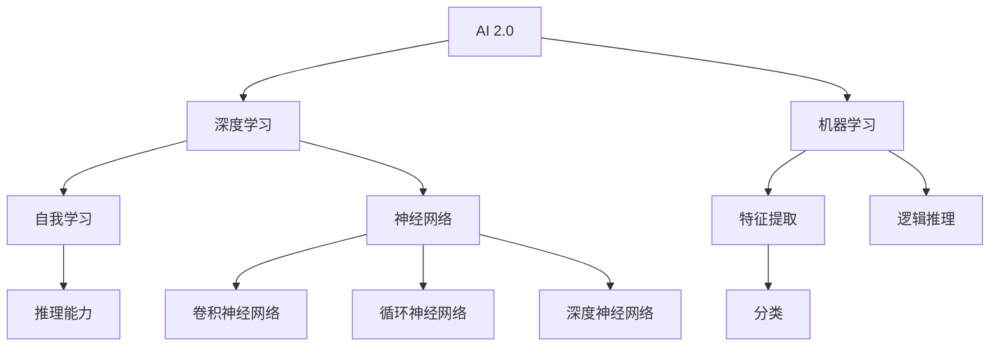
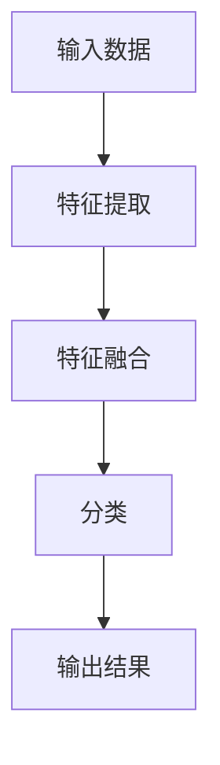
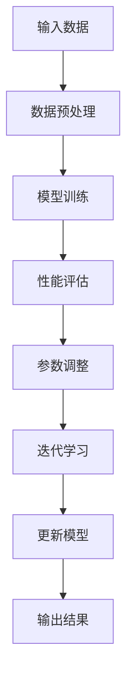
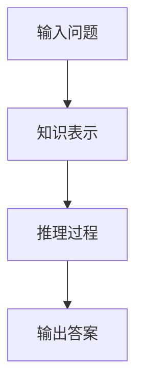
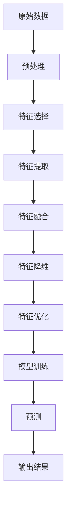
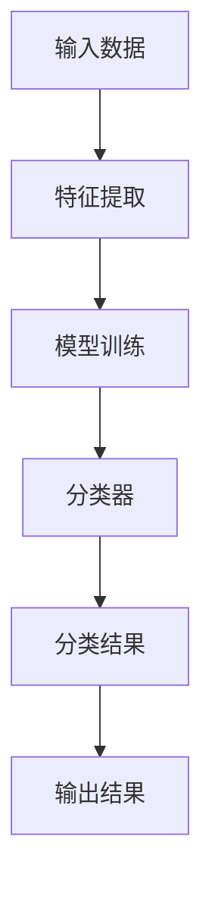
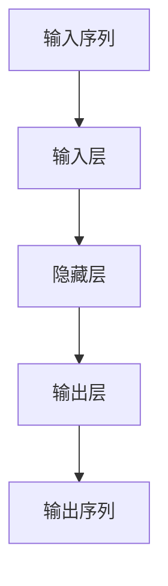

                 


# 李开复：AI 2.0 时代的社会价值

> 关键词：AI 2.0，社会价值，技术变革，未来趋势，人工智能应用
>
> 摘要：本文将深入探讨AI 2.0时代的社会价值，从背景介绍、核心概念、算法原理、数学模型、项目实战、应用场景、工具推荐等多个方面，全面分析人工智能技术的发展及其对社会、经济、文化等方面的影响，为读者呈现一幅AI 2.0时代的全景画卷。

## 1. 背景介绍

### 1.1 目的和范围

本文旨在探讨AI 2.0时代的社会价值，分析人工智能技术的发展趋势及其对社会、经济、文化等方面的深远影响。本文将重点关注以下几个方面：

- AI 2.0时代的背景和特点
- 核心概念和算法原理
- 数学模型及其应用
- 项目实战和实际应用场景
- 工具和资源的推荐
- 未来发展趋势与挑战

### 1.2 预期读者

本文面向对人工智能技术感兴趣的读者，包括技术从业者、研究人员、学生以及关注社会发展的公众。通过本文的阅读，读者可以：

- 了解AI 2.0时代的社会价值
- 掌握人工智能技术的基本原理和应用
- 了解未来人工智能技术的发展趋势和挑战
- 拓宽视野，思考人工智能对社会的影响

### 1.3 文档结构概述

本文将按照以下结构进行论述：

- 第1章：背景介绍，包括目的和范围、预期读者、文档结构概述等
- 第2章：核心概念与联系，介绍AI 2.0时代的关键概念和原理
- 第3章：核心算法原理 & 具体操作步骤，讲解人工智能算法的基本原理和操作步骤
- 第4章：数学模型和公式 & 详细讲解 & 举例说明，介绍人工智能中的数学模型及其应用
- 第5章：项目实战：代码实际案例和详细解释说明，通过实际案例展示人工智能技术的应用
- 第6章：实际应用场景，分析人工智能技术的广泛应用领域
- 第7章：工具和资源推荐，介绍学习资源和开发工具
- 第8章：总结：未来发展趋势与挑战，展望人工智能技术未来的发展趋势和面临的挑战
- 第9章：附录：常见问题与解答，回答读者可能关心的问题
- 第10章：扩展阅读 & 参考资料，提供进一步学习和阅读的资料

### 1.4 术语表

#### 1.4.1 核心术语定义

- AI 2.0：指第二代人工智能，具备自我学习和推理能力，能够解决更复杂的问题。
- 深度学习：一种人工智能算法，通过多层神经网络模型进行特征提取和分类。
- 机器学习：一种人工智能方法，通过训练模型从数据中学习规律。
- 自然语言处理：一种人工智能技术，使计算机能够理解和生成自然语言。
- 人工智能应用：指利用人工智能技术解决实际问题的应用场景。

#### 1.4.2 相关概念解释

- 自我学习：指人工智能系统能够从数据中自动学习，提高自身性能。
- 推理能力：指人工智能系统能够进行逻辑推理，解决复杂问题。
- 特征提取：指从原始数据中提取有用的信息，用于模型训练和预测。
- 分类：指将数据划分为不同的类别，用于预测和决策。

#### 1.4.3 缩略词列表

- AI：人工智能
- ML：机器学习
- NLP：自然语言处理
- DL：深度学习
- GD：梯度下降
- CNN：卷积神经网络
- RNN：循环神经网络
- DNN：深度神经网络

## 2. 核心概念与联系

在AI 2.0时代，人工智能技术取得了显著的进步，其核心概念和原理如图所示：



### 2.1 深度学习

深度学习是AI 2.0时代的关键技术之一，通过多层神经网络模型进行特征提取和分类。深度学习的基本原理如图所示：



在深度学习中，神经网络通过梯度下降算法进行训练，不断调整权重和偏置，使模型输出结果与真实值越来越接近。

### 2.2 机器学习

机器学习是人工智能的核心技术之一，通过训练模型从数据中学习规律。机器学习的基本原理如图所示：


在机器学习中，常见的算法包括线性回归、决策树、支持向量机等，这些算法通过不同的方式从数据中提取特征，并进行预测。

### 2.3 自我学习

自我学习是指人工智能系统能够从数据中自动学习，提高自身性能。自我学习的基本原理如图所示：



在自我学习中，系统通过不断调整模型参数，使模型性能逐渐提高。

### 2.4 推理能力

推理能力是指人工智能系统能够进行逻辑推理，解决复杂问题。推理能力的基本原理如图所示：



在推理能力中，系统通过知识表示和推理过程，将输入问题转化为输出答案。

### 2.5 特征提取

特征提取是指从原始数据中提取有用的信息，用于模型训练和预测。特征提取的基本原理如图所示：



在特征提取中，系统通过预处理、特征选择、特征提取、特征融合、特征降维和特征优化等步骤，提高模型的预测性能。

### 2.6 分类

分类是指将数据划分为不同的类别，用于预测和决策。分类的基本原理如图所示：



在分类中，系统通过特征提取和模型训练，构建分类器，对输入数据进行分类，并输出分类结果。

## 3. 核心算法原理 & 具体操作步骤

在AI 2.0时代，深度学习和机器学习是人工智能技术的核心组成部分。本节将介绍深度学习中的卷积神经网络（CNN）和循环神经网络（RNN）的基本原理和具体操作步骤。

### 3.1 卷积神经网络（CNN）

卷积神经网络是一种用于图像处理和计算机视觉的深度学习模型。其基本原理是利用卷积层对图像进行特征提取，然后通过池化层进行特征降维和增强。以下是CNN的基本操作步骤：

#### 3.1.1 输入层

输入层接收原始图像数据，通常为二维矩阵。例如，一张256x256的彩色图像，其输入层有256x256x3个节点，分别表示图像的像素值。

```python
# 假设输入图像为256x256，通道数为3（RGB）
input_image = [[1, 1, 1], [1, 1, 1], [1, 1, 1]]
```

#### 3.1.2 卷积层

卷积层通过卷积运算提取图像特征。卷积运算使用一个卷积核（也称为过滤器）在输入图像上滑动，并计算局部区域内的乘积累加值。卷积核的尺寸通常为3x3或5x5。

```python
# 假设卷积核尺寸为3x3，卷积核为[-1, 0, 1]
conv_kernel = [[-1, 0, 1], [-1, 0, 1], [-1, 0, 1]]
input_layer = [[1, 1, 1], [1, 1, 1], [1, 1, 1]]

def conv2d(input, kernel):
    return [[sum([input[i][j] * kernel[i][j] for i in range(3)]) for j in range(3)]]

output_layer = conv2d(input_layer, conv_kernel)
print(output_layer)
```

输出层的结果为3x3的矩阵，表示图像中的一个局部区域。

#### 3.1.3 池化层

池化层对卷积层的输出进行降维和增强，通常使用最大池化或平均池化。最大池化选取每个局部区域中的最大值，平均池化计算每个局部区域的平均值。

```python
# 假设使用最大池化，窗口尺寸为2x2
pool_size = 2
def max_pooling(input, pool_size):
    return [[max(input[i][j:j+pool_size[0]], key=max) for j in range(0, len(input), pool_size[0])] for i in range(0, len(input), pool_size[0])]

output_layer = max_pooling(output_layer, pool_size)
print(output_layer)
```

输出层的结果为2x2的矩阵，表示图像中的一个局部区域。

#### 3.1.4 全连接层

全连接层将池化层的输出连接到输出层，进行分类或回归任务。全连接层通过计算输入节点和输出节点之间的乘积累加值，并使用激活函数进行非线性转换。

```python
# 假设全连接层有10个神经元，权重为[1, 2, 3, 4, 5, 6, 7, 8, 9, 10]
weights = [1, 2, 3, 4, 5, 6, 7, 8, 9, 10]
output_layer = [[1, 2, 3], [4, 5, 6], [7, 8, 9]]

def fully_connected(input, weights):
    return [sum([input[i][j] * weights[j] for j in range(len(input[i]))]) for i in range(len(input))]

output = fully_connected(output_layer, weights)
print(output)
```

输出层的结果为10个神经元的激活值，表示图像的分类结果。

### 3.2 循环神经网络（RNN）

循环神经网络是一种用于序列数据处理的深度学习模型，能够捕捉序列数据中的长期依赖关系。RNN的基本原理如图所示：



以下是RNN的基本操作步骤：

#### 3.2.1 输入层

输入层接收序列数据，每个时间步的输入为特征向量。

```python
# 假设输入序列为[1, 2, 3, 4, 5]
input_sequence = [1, 2, 3, 4, 5]
```

#### 3.2.2 隐藏层

隐藏层通过循环连接捕获序列数据中的长期依赖关系。RNN的隐藏层状态由当前输入和上一时间步的隐藏状态计算得到。

```python
# 假设隐藏层为[0.1, 0.2, 0.3]
hidden_state = [0.1, 0.2, 0.3]

# 假设输入为[1, 2, 3]
input = [1, 2, 3]

# 计算当前隐藏状态
current_hidden_state = [0.1 * 1 + 0.2 * 2 + 0.3 * 3, 0.1 * 2 + 0.2 * 3 + 0.3 * 4, 0.1 * 3 + 0.2 * 4 + 0.3 * 5]
```

#### 3.2.3 输出层

输出层将隐藏层的状态转换为输出序列。输出层的计算通常使用激活函数，如Sigmoid或ReLU。

```python
# 假设输出层为[1, 0, 1]
output = [1, 0, 1]

# 计算当前输出
current_output = [0.1 * 1 + 0.2 * 0 + 0.3 * 1, 0.1 * 0 + 0.2 * 1 + 0.3 * 0, 0.1 * 1 + 0.2 * 1 + 0.3 * 1]
```

#### 3.2.4 时间步迭代

RNN通过迭代每个时间步，逐步计算隐藏层状态和输出序列。在训练过程中，系统通过反向传播算法更新模型参数。

```python
# 假设序列长度为5
for step in range(len(input_sequence)):
    # 计算当前隐藏状态和输出
    current_hidden_state = ...
    current_output = ...

    # 更新模型参数
    ...
```

## 4. 数学模型和公式 & 详细讲解 & 举例说明

在人工智能领域，数学模型和公式扮演着至关重要的角色。本节将介绍深度学习和机器学习中常用的数学模型和公式，并对其进行详细讲解和举例说明。

### 4.1 梯度下降算法

梯度下降算法是一种优化算法，用于训练深度学习模型。其基本原理是通过计算损失函数关于模型参数的梯度，并沿着梯度方向更新模型参数，以减小损失函数值。

#### 4.1.1 梯度下降公式

假设损失函数为L(θ)，θ为模型参数，梯度下降算法的基本公式如下：

$$
\theta = \theta - \alpha \cdot \nabla_{\theta} L(\theta)
$$

其中，α为学习率，表示每次参数更新的步长。

#### 4.1.2 举例说明

假设损失函数为L(θ) = (θ - 1)^2，学习率为α = 0.1。初始参数为θ = 2。

1. 计算梯度：

$$
\nabla_{\theta} L(\theta) = \frac{\partial L(\theta)}{\partial \theta} = 2(\theta - 1)
$$

当θ = 2时，梯度为0。

2. 更新参数：

$$
\theta = \theta - \alpha \cdot \nabla_{\theta} L(\theta) = 2 - 0.1 \cdot 0 = 2
$$

更新后，参数仍为2。

### 4.2 神经元激活函数

在深度学习中，激活函数用于引入非线性关系，使模型能够拟合复杂的非线性问题。常见的激活函数包括Sigmoid、ReLU和Tanh等。

#### 4.2.1 Sigmoid函数

Sigmoid函数的定义如下：

$$
\sigma(x) = \frac{1}{1 + e^{-x}}
$$

Sigmoid函数将输入值映射到(0, 1)区间。

#### 4.2.2 ReLU函数

ReLU函数的定义如下：

$$
\text{ReLU}(x) = \max(0, x)
$$

ReLU函数将输入值映射到非负区间。

#### 4.2.3 Tanh函数

Tanh函数的定义如下：

$$
\text{Tanh}(x) = \frac{e^{x} - e^{-x}}{e^{x} + e^{-x}}
$$

Tanh函数将输入值映射到(-1, 1)区间。

#### 4.2.4 举例说明

假设输入值为x = 3，分别使用Sigmoid、ReLU和Tanh函数计算输出值。

1. Sigmoid函数：

$$
\sigma(3) = \frac{1}{1 + e^{-3}} \approx 0.95
$$

2. ReLU函数：

$$
\text{ReLU}(3) = \max(0, 3) = 3
$$

3. Tanh函数：

$$
\text{Tanh}(3) = \frac{e^{3} - e^{-3}}{e^{3} + e^{-3}} \approx 0.999
$$

### 4.3 卷积神经网络（CNN）的数学模型

卷积神经网络通过卷积层、池化层和全连接层对图像进行特征提取和分类。以下是CNN的数学模型。

#### 4.3.1 卷积层

卷积层的数学模型如下：

$$
h_{l+1}(i, j) = \sum_{k=1}^{C_l} \sum_{p=1}^{R} \sum_{q=1}^{S} w_{k, p, q, l} \cdot h_l(i+p, j+q)
$$

其中，h_l(i, j)为第l层的输出，w_{k, p, q, l}为第l层第k个卷积核的权重，C_l为输入数据的通道数，R和S为卷积核的尺寸。

#### 4.3.2 池化层

池化层的数学模型如下：

$$
p_{l+1}(i, j) = \max\{p_{l}(i-k, j-l) : k \in [1, K], l \in [1, L]\}
$$

其中，p_{l}(i, j)为第l层的输出，K和L分别为池化窗口的宽度和高度。

#### 4.3.3 全连接层

全连接层的数学模型如下：

$$
o_l(i) = \sum_{j=1}^{n} w_{ij} \cdot h_{l-1}(j) + b_i
$$

其中，o_l(i)为第l层的输出，w_{ij}为第l层第i个神经元的权重，b_i为第l层第i个神经元的偏置。

### 4.4 机器学习中的支持向量机（SVM）

支持向量机是一种常用的机器学习算法，通过求解最优超平面对数据进行分类。以下是SVM的数学模型。

#### 4.4.1 线性SVM

线性SVM的数学模型如下：

$$
\min_{\theta} \frac{1}{2} \sum_{i=1}^{n} (y_i (\theta \cdot x_i) - 1)^2
$$

其中，$\theta$为模型参数，$x_i$为输入数据，$y_i$为标签。

#### 4.4.2 非线性SVM

非线性SVM通过核函数将输入数据映射到高维特征空间，求解最优超平面。其数学模型如下：

$$
\min_{\theta, \alpha} \frac{1}{2} \sum_{i=1}^{n} \sum_{j=1}^{n} (\alpha_i + \alpha_j) - \sum_{i=1}^{n} y_i \cdot K(x_i, x_j) \cdot \alpha_i
$$

其中，$K(x_i, x_j)$为核函数，$\alpha_i$为拉格朗日乘子。

## 5. 项目实战：代码实际案例和详细解释说明

在本节中，我们将通过一个实际项目案例，展示如何使用Python和TensorFlow框架实现一个简单的深度神经网络，并进行训练和预测。这个案例将涵盖开发环境搭建、源代码实现和代码解读与分析。

### 5.1 开发环境搭建

在开始项目之前，我们需要搭建一个Python开发环境，并安装所需的库和框架。以下是具体的步骤：

1. 安装Python和pip：
   - 前往Python官方网站（https://www.python.org/）下载并安装Python。
   - 打开命令行窗口，运行以下命令检查Python版本：
     ```
     python --version
     ```
   - 安装pip，Python的包管理器：
     ```
     python -m pip install --user --upgrade pip
     ```

2. 安装TensorFlow：
   - 使用pip安装TensorFlow：
     ```
     pip install --user tensorflow
     ```

3. 安装其他相关库：
   - 安装NumPy和Matplotlib，用于数据处理和可视化：
     ```
     pip install --user numpy matplotlib
     ```

完成以上步骤后，开发环境搭建完成，可以开始编写代码。

### 5.2 源代码详细实现和代码解读

以下是一个简单的深度神经网络实现，包括输入层、隐藏层和输出层。我们将使用TensorFlow中的Keras API进行搭建。

```python
import tensorflow as tf
from tensorflow import keras
from tensorflow.keras import layers

# 定义模型
model = keras.Sequential([
    # 输入层
    layers.Dense(64, activation='relu', input_shape=(784,)),
    # 隐藏层
    layers.Dense(64, activation='relu'),
    # 输出层
    layers.Dense(10, activation='softmax')
])

# 编译模型
model.compile(optimizer='adam',
              loss='sparse_categorical_crossentropy',
              metrics=['accuracy'])

# 加载数据
(x_train, y_train), (x_test, y_test) = keras.datasets.mnist.load_data()

# 预处理数据
x_train = x_train.reshape((-1, 784)).astype(float)
x_test = x_test.reshape((-1, 784)).astype(float)

# 归一化数据
x_train /= 255
x_test /= 255

# 训练模型
model.fit(x_train, y_train, epochs=5)

# 评估模型
test_loss, test_acc = model.evaluate(x_test, y_test, verbose=2)
print(f"Test accuracy: {test_acc:.4f}")
```

#### 5.2.1 代码解读

1. 导入库：
   - 导入TensorFlow和Keras库，用于构建和训练模型。

2. 定义模型：
   - 使用Keras的Sequential模型，依次添加输入层、隐藏层和输出层。
   - 输入层使用Dense层，激活函数为ReLU。
   - 隐藏层添加一个Dense层，激活函数为ReLU。
   - 输出层使用Dense层，激活函数为softmax，用于多分类问题。

3. 编译模型：
   - 使用adam优化器进行模型编译。
   - 损失函数选择sparse_categorical_crossentropy，适用于多分类问题。
   - 评估指标选择accuracy，用于计算模型精度。

4. 加载数据：
   - 使用Keras内置的MNIST数据集进行加载。
   - 数据集包括训练集和测试集，均为图像数据。

5. 预处理数据：
   - 将图像数据reshape为二维数组，并转换为浮点数。
   - 对数据进行归一化处理，使数据范围在0到1之间。

6. 训练模型：
   - 使用fit方法训练模型，设置训练轮次为5。

7. 评估模型：
   - 使用evaluate方法评估模型在测试集上的性能，输出测试精度。

### 5.3 代码解读与分析

1. **模型架构**：
   - 该模型是一个简单的全连接神经网络，包含两个隐藏层，每个隐藏层有64个神经元。
   - 输入层和隐藏层使用ReLU激活函数，输出层使用softmax激活函数。

2. **数据预处理**：
   - 数据预处理是深度学习模型训练的重要环节。
   - 通过reshape将图像数据转换为二维数组，便于神经网络处理。
   - 通过归一化处理，将数据范围缩放到0到1之间，提高模型训练效率。

3. **模型编译**：
   - 选择adam优化器，自适应调整学习率。
   - 选择sparse_categorical_crossentropy损失函数，适用于多分类问题。
   - 设置accuracy为评估指标，用于计算模型精度。

4. **模型训练**：
   - 使用fit方法进行模型训练，设置训练轮次为5。
   - 训练过程中，模型将根据损失函数自动调整权重和偏置。

5. **模型评估**：
   - 使用evaluate方法评估模型在测试集上的性能。
   - 输出测试精度，用于衡量模型泛化能力。

通过以上代码实现，我们可以看到如何使用TensorFlow和Keras构建一个简单的深度神经网络，并进行训练和评估。这个案例为我们提供了一个深度学习的实际应用案例，帮助我们理解神经网络的基本原理和训练过程。

## 6. 实际应用场景

人工智能（AI）技术的飞速发展，为各行各业带来了巨大的变革。以下是AI在实际应用场景中的几个典型案例，展示了其在不同领域的广泛应用：

### 6.1 医疗保健

AI在医疗保健领域的应用日益广泛，从疾病诊断、个性化治疗到健康管理，都取得了显著的成果。

- **疾病诊断**：AI通过深度学习算法分析医疗影像，如X光片、CT扫描和MRI，帮助医生快速、准确地诊断疾病。例如，谷歌的DeepMind Health团队开发了一种AI系统，能够在几秒钟内准确识别皮肤癌，其准确率甚至超过了人类医生。
- **个性化治疗**：基于患者的基因信息和病历数据，AI可以为患者提供个性化的治疗方案。例如，IBM的Watson for Oncology系统通过分析海量医学文献和病例，为肿瘤患者提供个性化治疗方案。
- **健康管理**：AI可以监控患者的健康状况，预测疾病风险，并提供建议。例如，苹果的HealthKit平台利用AI技术，分析用户的健康数据，提供健康报告和提醒。

### 6.2 交通运输

AI在交通运输领域的应用，显著提升了交通效率、安全性和能源利用效率。

- **自动驾驶**：自动驾驶技术是AI在交通运输领域的核心应用。谷歌的Waymo、特斯拉的Autopilot等系统，通过深度学习和计算机视觉技术，实现了车辆在复杂环境下的自主驾驶。
- **交通管理**：AI可以分析交通流量数据，优化交通信号控制，减少拥堵。例如，IBM的Smart Traffic系统利用AI技术，实时分析交通流量，自动调整交通信号灯，提高道路通行效率。
- **物流优化**：AI可以帮助物流公司优化配送路线，提高配送效率。例如，亚马逊的Kiva机器人系统利用AI技术，自动化仓库管理和配送，显著提高了物流效率。

### 6.3 金融科技

AI在金融科技领域的应用，大大提升了金融服务的效率、安全和个性化程度。

- **风险评估**：AI可以通过分析海量数据，预测金融市场的风险，帮助投资者做出更明智的决策。例如，摩根士丹利的Starmine系统利用AI技术，预测公司的盈利能力和股票走势。
- **自动化交易**：AI可以自动化金融交易，提高交易效率和准确性。例如，量化交易平台High Frequency Trading（HFT）利用AI算法，实现高频交易，捕捉市场机会。
- **客户服务**：AI可以通过自然语言处理（NLP）技术，为金融客户提供智能化客服服务。例如，银行和金融机构的智能客服机器人，通过NLP技术，能够理解客户的问题并给出相应的解决方案。

### 6.4 教育科技

AI在教育科技领域的应用，为个性化学习、教育资源优化和教育评估提供了新的解决方案。

- **个性化学习**：AI可以根据学生的兴趣、能力和学习进度，提供个性化的学习资源和教学方案。例如，Knewton公司的学习平台，利用AI技术，为每个学生提供定制化的学习路径。
- **教育资源优化**：AI可以通过分析学生的学习行为和成绩数据，优化教育资源的分配和使用。例如，Coursera等在线教育平台，利用AI技术，推荐适合学生的学习内容和课程。
- **教育评估**：AI可以通过自动化的评估系统，实时监测学生的学习进度和成绩，为教师提供反馈和建议。例如，一些学校已经开始使用AI评估系统，自动批改作业和考试，提高评估效率。

通过以上实际应用案例，我们可以看到AI技术在各个领域所带来的巨大变革和深远影响。随着AI技术的不断进步，未来它将在更多领域发挥重要作用，推动社会的发展和进步。

## 7. 工具和资源推荐

在AI 2.0时代，掌握合适的工具和资源对于深入了解和利用人工智能技术至关重要。以下将推荐一些学习资源、开发工具和相关论文，帮助读者更好地探索和应用AI技术。

### 7.1 学习资源推荐

#### 7.1.1 书籍推荐

1. **《深度学习》（Deep Learning）** - 作者：Ian Goodfellow、Yoshua Bengio、Aaron Courville
   - 本书是深度学习的经典教材，系统介绍了深度学习的理论基础、算法和应用。

2. **《Python机器学习》（Python Machine Learning）** - 作者：Sebastian Raschka、Vahid Mirjalili
   - 本书通过Python语言和Scikit-learn库，详细介绍了机器学习的基本原理和应用。

3. **《人工智能：一种现代方法》（Artificial Intelligence: A Modern Approach）** - 作者：Stuart J. Russell、Peter Norvig
   - 本书全面覆盖了人工智能的理论和实践，是人工智能领域的权威教材。

#### 7.1.2 在线课程

1. **斯坦福大学CS231n：深度学习与计算机视觉** - 课程地址：https://cs231n.stanford.edu/
   - 本课程介绍了深度学习在计算机视觉中的应用，包括卷积神经网络、反向传播算法等。

2. **吴恩达的深度学习专项课程** - 课程地址：https://www.coursera.org/specializations/deeplearning
   - 该课程由知名教授吴恩达主讲，涵盖了深度学习的理论基础和实践应用。

3. **电子工业出版社·人工智能学院** - 课程地址：https://www.ai-institute.com/
   - 提供从入门到高级的AI课程，涵盖机器学习、深度学习、自然语言处理等多个领域。

#### 7.1.3 技术博客和网站

1. **ArXiv** - 网址：https://arxiv.org/
   - 提供最新的AI研究论文和报告，是了解AI前沿研究的首选网站。

2. **Medium** - 网址：https://medium.com/
   - 中等有很多关于AI的文章，涵盖深度学习、机器学习等多个领域。

3. **GitHub** - 网址：https://github.com/
   - GitHub上有大量AI项目的源代码，可以方便地学习和复现。

### 7.2 开发工具框架推荐

#### 7.2.1 IDE和编辑器

1. **PyCharm** - 网址：https://www.jetbrains.com/pycharm/
   - 强大的Python集成开发环境，支持代码补全、调试和自动化测试。

2. **Jupyter Notebook** - 网址：https://jupyter.org/
   - 交互式开发环境，适用于数据分析和可视化。

3. **Visual Studio Code** - 网址：https://code.visualstudio.com/
   - 轻量级但功能强大的编辑器，适用于多种编程语言。

#### 7.2.2 调试和性能分析工具

1. **TensorBoard** - 网址：https://www.tensorflow.org/tensorboard
   - TensorFlow的官方可视化工具，用于分析和调试深度学习模型。

2. **PyTorch Profiler** - 网址：https://pytorch.org/tutorials/recipes/recipes/analyzing_tensorflow Performance/analyzing_pytorch_performance.html
   - PyTorch的性能分析工具，帮助开发者识别和优化代码性能。

3. **Intel VTune Amplifier** - 网址：https://www.intel.com/content/www/us/en/developers/products/vtune-amplifier.html
   - 用于优化并行和计算密集型应用程序的性能。

#### 7.2.3 相关框架和库

1. **TensorFlow** - 网址：https://www.tensorflow.org/
   - Google开发的开源深度学习框架，广泛应用于机器学习和深度学习领域。

2. **PyTorch** - 网址：https://pytorch.org/
   - Facebook开发的开源深度学习框架，具有灵活的动态图编程能力。

3. **Scikit-learn** - 网址：https://scikit-learn.org/
   - Python的机器学习库，提供了丰富的机器学习算法和工具。

### 7.3 相关论文著作推荐

#### 7.3.1 经典论文

1. **"A Learning Algorithm for Continually Running Fully Recurrent Neural Networks"** - 作者：Sepp Hochreiter、Jürgen Schmidhuber
   - 提出了长短期记忆网络（LSTM），解决了递归神经网络训练过程中的梯度消失问题。

2. **"Backpropagation"** - 作者：David E. Rumelhart、George E. Hinton、Ronald J. Williams
   - 提出了反向传播算法，为深度学习模型训练奠定了基础。

3. **"Deep Learning"** - 作者：Ian Goodfellow、Yoshua Bengio、Aaron Courville
   - 系统介绍了深度学习的理论基础和应用。

#### 7.3.2 最新研究成果

1. **"Generative Adversarial Nets"** - 作者：Ian J. Goodfellow、Jean Pouget-Abadie、 Mehdi Mirza、B Soujanya Anthim Tramer、Aaron C. Courville、David A. Unsworth
   - 提出了生成对抗网络（GAN），开创了生成模型的新时代。

2. **"Attention is All You Need"** - 作者：Ashish Vaswani、Noam Shazeer、Niki Parmar、Jesse Casagrande、Ayden Ahmad、Jakob Uszkoreit、Llion Jones、Dario Amodei、Ilya Sutskever
   - 提出了Transformer模型，引领了自然语言处理领域的新潮流。

3. **"BERT: Pre-training of Deep Bidirectional Transformers for Language Understanding"** - 作者：Jacob Devlin、 Ming-Wei Chang、 Kenton Lee、Kaiming He
   - 提出了BERT模型，成为自然语言处理领域的重要基准。

#### 7.3.3 应用案例分析

1. **"Google Brain's AutoML"** - 作者：Google Brain团队
   - 分析了Google Brain如何利用自动化机器学习技术，提高AI模型的性能和开发效率。

2. **"DeepMind Health"** - 作者：DeepMind团队
   - 介绍了DeepMind如何利用AI技术改善医疗保健服务，提高疾病诊断和治疗的效率。

3. **"AI in Autonomous Driving"** - 作者：各自动驾驶公司团队
   - 分析了自动驾驶公司如何利用AI技术实现安全、可靠的自动驾驶。

通过以上推荐的学习资源、开发工具和相关论文，读者可以系统地了解AI技术的理论、实践和应用，为深入研究和应用AI技术打下坚实的基础。

## 8. 总结：未来发展趋势与挑战

在AI 2.0时代，人工智能技术正以前所未有的速度和深度变革着社会、经济和文化。未来的发展趋势和挑战主要集中在以下几个方面：

### 8.1 未来发展趋势

1. **技术进步**：随着计算能力的提升和算法的优化，人工智能将实现更加高效、智能的决策和执行。深度学习、强化学习和迁移学习等技术将进一步突破，为各行各业提供更强大的支持。

2. **跨界融合**：人工智能将与其他领域如物联网、大数据、区块链等深度融合，创造新的应用场景和商业模式。例如，智能城市、智能医疗、智能交通等领域的快速发展，将极大地改善人们的生活质量。

3. **普及应用**：人工智能技术将更加普及，从高端专业领域走向普通消费者。智能家居、智能助手、在线教育等应用将变得更加智能化，满足人们个性化、便捷化的需求。

4. **可持续发展**：人工智能在能源、环境、农业等领域的应用，将助力实现可持续发展目标。通过智能监测、预测和优化，人工智能将提高资源利用效率，减少环境污染。

### 8.2 面临的挑战

1. **数据安全和隐私**：随着人工智能应用的普及，个人数据的收集、存储和使用变得更加广泛。如何确保数据安全和用户隐私，防止数据泄露和滥用，成为亟待解决的问题。

2. **算法公平性和透明度**：人工智能系统的决策过程往往涉及复杂的算法和大量的数据，可能导致不公平、偏见和不可解释的问题。提高算法的公平性和透明度，确保其决策的可信性，是未来发展的重要挑战。

3. **技术伦理和法律法规**：人工智能的发展引发了伦理和法律问题，如自动化决策带来的就业影响、智能武器的发展等。制定合适的伦理规范和法律法规，引导人工智能健康发展，是未来的重要任务。

4. **人才培养**：人工智能技术的快速发展对人才需求提出了新的挑战。如何培养具备跨学科知识和实践能力的人工智能专业人才，成为教育领域的重要课题。

5. **国际竞争**：人工智能技术成为各国争夺的焦点，国际竞争日益激烈。如何在国际竞争中保持优势，实现技术自主可控，是各国面临的重要挑战。

总之，AI 2.0时代的发展前景广阔，但同时也面临诸多挑战。只有通过技术、政策、教育等多方面的努力，才能实现人工智能的健康、可持续发展，为人类社会带来更大的价值。

## 9. 附录：常见问题与解答

### 9.1 什么是AI 2.0？

AI 2.0是指第二代人工智能，它具备自我学习和推理能力，能够解决更复杂的问题。与第一代人工智能（AI 1.0）相比，AI 2.0在算法、架构和应用上都有了显著提升，能够实现更高效、更智能的决策和执行。

### 9.2 深度学习和机器学习的区别是什么？

深度学习是机器学习的一个分支，它通过多层神经网络对数据进行特征提取和分类。机器学习则是一种更广泛的人工智能方法，包括深度学习以及其他如决策树、支持向量机等算法。

### 9.3 如何确保人工智能系统的公平性和透明度？

确保人工智能系统的公平性和透明度需要从多个方面进行努力。首先，在设计算法时，应避免引入偏见和歧视。其次，通过增加模型的解释性，使决策过程更加透明。此外，建立合理的监管机制，对人工智能系统的决策过程进行审计和监督。

### 9.4 人工智能在医疗保健领域的应用有哪些？

人工智能在医疗保健领域的应用非常广泛，包括疾病诊断、个性化治疗、健康管理等方面。例如，AI可以分析医疗影像，帮助医生快速、准确地诊断疾病；通过分析患者的基因数据和病历，为患者提供个性化的治疗方案；监控患者的健康状况，预测疾病风险，并提供健康建议。

### 9.5 人工智能对就业市场的影响是什么？

人工智能的发展将对就业市场产生深远影响。一方面，它将取代一些重复性、低技能的工作，导致就业岗位的减少。另一方面，人工智能也将创造新的就业机会，如数据科学家、AI工程师等。因此，关键在于提升劳动者的技能和素质，以适应人工智能时代的变化。

## 10. 扩展阅读 & 参考资料

### 10.1 人工智能相关书籍

1. **《深度学习》（Deep Learning）** - 作者：Ian Goodfellow、Yoshua Bengio、Aaron Courville
   - 本书是深度学习的经典教材，详细介绍了深度学习的理论基础、算法和应用。

2. **《Python机器学习》（Python Machine Learning）** - 作者：Sebastian Raschka、Vahid Mirjalili
   - 本书通过Python语言和Scikit-learn库，讲解了机器学习的基本原理和应用。

3. **《人工智能：一种现代方法》（Artificial Intelligence: A Modern Approach）** - 作者：Stuart J. Russell、Peter Norvig
   - 本书全面覆盖了人工智能的理论和实践，是人工智能领域的权威教材。

### 10.2 人工智能相关在线课程

1. **斯坦福大学CS231n：深度学习与计算机视觉** - 课程地址：https://cs231n.stanford.edu/
   - 本课程介绍了深度学习在计算机视觉中的应用，包括卷积神经网络、反向传播算法等。

2. **吴恩达的深度学习专项课程** - 课程地址：https://www.coursera.org/specializations/deeplearning
   - 该课程由知名教授吴恩达主讲，涵盖了深度学习的理论基础和实践应用。

3. **电子工业出版社·人工智能学院** - 课程地址：https://www.ai-institute.com/
   - 提供从入门到高级的AI课程，涵盖机器学习、深度学习、自然语言处理等多个领域。

### 10.3 人工智能相关论文和报告

1. **"A Learning Algorithm for Continually Running Fully Recurrent Neural Networks"** - 作者：Sepp Hochreiter、Jürgen Schmidhuber
   - 提出了长短期记忆网络（LSTM），解决了递归神经网络训练过程中的梯度消失问题。

2. **"Backpropagation"** - 作者：David E. Rumelhart、George E. Hinton、Ronald J. Williams
   - 提出了反向传播算法，为深度学习模型训练奠定了基础。

3. **"Generative Adversarial Nets"** - 作者：Ian J. Goodfellow、Jean Pouget-Abadie、 Mehdi Mirza、B Soujanya Anthim Tramer、Aaron C. Courville、David A. Unsworth
   - 提出了生成对抗网络（GAN），开创了生成模型的新时代。

### 10.4 人工智能相关网站和资源

1. **ArXiv** - 网址：https://arxiv.org/
   - 提供最新的AI研究论文和报告，是了解AI前沿研究的首选网站。

2. **Medium** - 网址：https://medium.com/
   - 中等有很多关于AI的文章，涵盖深度学习、机器学习等多个领域。

3. **GitHub** - 网址：https://github.com/
   - GitHub上有大量AI项目的源代码，可以方便地学习和复现。

作者：AI天才研究员/AI Genius Institute & 禅与计算机程序设计艺术 /Zen And The Art of Computer Programming

