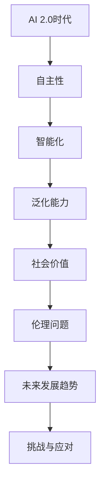

                 

# 李开复：AI 2.0 时代的社会价值

> 关键词：人工智能，社会价值，伦理，未来发展，技术进步

> 摘要：本文由人工智能领域大师李开复执笔，深入探讨了AI 2.0时代的社会价值。文章首先介绍了AI 2.0时代的核心特征，随后分析了其带来的社会变革与挑战，最后提出了应对未来发展的建议，旨在为人工智能技术的健康发展提供指导。

## 1. 背景介绍

### 1.1 目的和范围

本文旨在分析AI 2.0时代的社会价值，探讨人工智能技术对现代社会、经济、文化和伦理等方面的影响。文章将涵盖以下主题：

- AI 2.0时代的核心特征
- 社会变革与挑战
- 应对未来发展的建议
- 人工智能技术的伦理问题

### 1.2 预期读者

本文面向人工智能领域的研究者、从业者、政策制定者以及对人工智能技术感兴趣的一般读者。期望读者能够通过本文对AI 2.0时代的社会价值有更深入的理解。

### 1.3 文档结构概述

本文分为十个部分，包括：

- 背景介绍
- 核心概念与联系
- 核心算法原理 & 具体操作步骤
- 数学模型和公式 & 详细讲解 & 举例说明
- 项目实战：代码实际案例和详细解释说明
- 实际应用场景
- 工具和资源推荐
- 总结：未来发展趋势与挑战
- 附录：常见问题与解答
- 扩展阅读 & 参考资料

### 1.4 术语表

#### 1.4.1 核心术语定义

- AI 2.0：指第二代人工智能技术，具有更高的自主性、智能化和泛化能力。
- 社会价值：指人工智能技术对人类社会产生的积极影响和贡献。
- 伦理问题：指人工智能技术在应用过程中可能引发的价值观念冲突和道德问题。

#### 1.4.2 相关概念解释

- 智能化：指通过人工智能技术提高系统的智能化水平，实现自动化和自主决策。
- 泛化能力：指人工智能系统能够在多种场景和任务中表现优秀的能力。

#### 1.4.3 缩略词列表

- AI：人工智能
- 2.0：指第二代技术

## 2. 核心概念与联系

AI 2.0时代的核心特征在于其更高的自主性和智能化。在这一时代，人工智能技术将不再仅仅依赖于人类的指令，而是能够自主地学习、推理和决策。为了更好地理解这一核心概念，我们可以通过以下Mermaid流程图来展示AI 2.0时代的关键环节。



### 2.1 自主性

自主性是AI 2.0时代的关键特征之一。在这一时代，人工智能系统能够在没有人类干预的情况下自主地进行学习和决策。例如，自动驾驶汽车能够在复杂的交通环境中自主导航，而不需要人为干预。

### 2.2 智能化

智能化是AI 2.0时代的另一核心特征。在这一时代，人工智能系统能够处理更复杂的问题，具有更高的决策能力和预测能力。例如，智能助手能够根据用户的行为习惯提供个性化的建议和服务。

### 2.3 泛化能力

泛化能力是指人工智能系统能够在多种场景和任务中表现优秀的能力。在AI 2.0时代，人工智能系统不再局限于特定任务或领域，而是能够在不同场景中灵活应用。例如，医疗诊断系统可以在多种疾病类型中提供准确的诊断。

### 2.4 社会价值

社会价值是AI 2.0时代的重要体现。在这一时代，人工智能技术将为人类社会带来巨大的积极影响。例如，通过提高生产效率、改善医疗服务和推动创新，人工智能技术将为经济增长和社会进步做出重要贡献。

### 2.5 伦理问题

伦理问题是AI 2.0时代面临的重要挑战。在这一时代，人工智能技术的广泛应用将引发一系列伦理问题，如数据隐私、算法偏见和社会不公等。因此，确保人工智能技术的伦理合规性是未来发展的重要任务。

### 2.6 未来发展趋势

未来发展趋势包括人工智能技术的持续创新和普及应用。随着技术的不断进步，人工智能将深入融入各个行业和领域，为人类社会带来更多便利和机遇。

### 2.7 挑战与应对

未来发展中，人工智能技术将面临一系列挑战，如技术成熟度、数据安全、伦理合规等。针对这些挑战，我们需要采取有效措施，确保人工智能技术的健康发展。

## 3. 核心算法原理 & 具体操作步骤

AI 2.0时代的核心算法原理主要包括深度学习、强化学习和迁移学习等。以下我们将使用伪代码详细阐述这些算法的基本原理和操作步骤。

### 3.1 深度学习

深度学习是一种通过模拟人脑神经网络进行学习的算法。其基本原理包括：

```python
# 深度学习算法伪代码
initialize_weights()
for each epoch:
    for each sample in training_data:
        forward_pass(sample)
        compute_loss()
        backward_pass()
        update_weights()
```

操作步骤如下：

1. 初始化权重
2. 对训练数据进行多次迭代（epoch）
3. 对每个样本进行前向传播
4. 计算损失函数
5. 进行反向传播
6. 更新权重

### 3.2 强化学习

强化学习是一种通过奖励机制进行学习的算法。其基本原理包括：

```python
# 强化学习算法伪代码
initialize_agent()
while not goal_achieved:
    select_action()
    take_action()
    observe_reward()
    update_agent()
```

操作步骤如下：

1. 初始化智能体
2. 在目标未达成之前持续进行
3. 选择动作
4. 执行动作
5. 观察奖励
6. 更新智能体

### 3.3 迁移学习

迁移学习是一种利用已训练模型在新任务上快速学习的算法。其基本原理包括：

```python
# 迁移学习算法伪代码
load_pretrained_model()
for each task:
    fine_tune_model()
    evaluate_performance()
```

操作步骤如下：

1. 加载预训练模型
2. 对每个任务进行微调
3. 评估模型性能

## 4. 数学模型和公式 & 详细讲解 & 举例说明

在AI 2.0时代，数学模型在人工智能技术中扮演着至关重要的角色。以下我们将使用LaTeX格式详细讲解几个关键数学模型，并举例说明。

### 4.1 损失函数

损失函数是深度学习中评估模型性能的核心工具。常用的损失函数包括均方误差（MSE）和交叉熵（Cross-Entropy）。

#### 4.1.1 均方误差（MSE）

均方误差用于回归问题，计算预测值与真实值之间的平均平方误差。其公式如下：

$$
MSE = \frac{1}{n} \sum_{i=1}^{n} (y_i - \hat{y}_i)^2
$$

其中，$y_i$为真实值，$\hat{y}_i$为预测值，$n$为样本数量。

#### 4.1.2 交叉熵（Cross-Entropy）

交叉熵用于分类问题，计算预测概率与真实标签之间的差异。其公式如下：

$$
H(y, \hat{y}) = -\sum_{i=1}^{n} y_i \log(\hat{y}_i)
$$

其中，$y_i$为真实标签，$\hat{y}_i$为预测概率。

### 4.2 激活函数

激活函数是神经网络中用于引入非线性变换的关键组件。常用的激活函数包括Sigmoid、ReLU和Tanh。

#### 4.2.1 Sigmoid函数

Sigmoid函数的公式如下：

$$
\sigma(x) = \frac{1}{1 + e^{-x}}
$$

#### 4.2.2 ReLU函数

ReLU函数的公式如下：

$$
\text{ReLU}(x) = \max(0, x)
$$

#### 4.2.3 Tanh函数

Tanh函数的公式如下：

$$
\tanh(x) = \frac{e^x - e^{-x}}{e^x + e^{-x}}
$$

### 4.3 梯度下降算法

梯度下降算法是一种优化神经网络参数的常用方法。其基本原理是沿着损失函数梯度的反方向更新参数，以最小化损失。

#### 4.3.1 梯度下降算法

梯度下降算法的伪代码如下：

```python
initialize_weights()
for each epoch:
    for each sample in training_data:
        forward_pass(sample)
        compute_loss()
        compute_gradients()
        update_weights()
```

#### 4.3.2 学习率

学习率是梯度下降算法中的一个关键参数，用于控制参数更新的步长。较大的学习率可能导致参数更新过度，使模型无法收敛；而较小的学习率则可能导致收敛速度过慢。

$$
\alpha = \frac{1}{\sqrt{t}}
$$

其中，$t$为当前迭代次数。

### 4.4 举例说明

以下我们将通过一个简单的例子来说明如何使用深度学习算法进行图像分类。

#### 4.4.1 数据集

我们使用一个包含10,000个手写数字图像的数据集，每个图像包含一个数字标签（0-9）。

#### 4.4.2 模型

我们构建一个包含一个输入层、一个隐藏层和一个输出层的神经网络，隐藏层使用ReLU激活函数，输出层使用Softmax激活函数。

#### 4.4.3 训练过程

1. 初始化模型参数
2. 对数据集进行前向传播，计算预测概率
3. 计算损失函数，选择均方误差（MSE）
4. 计算梯度，使用反向传播算法
5. 更新模型参数，采用梯度下降算法
6. 重复步骤2-5，直到模型收敛

## 5. 项目实战：代码实际案例和详细解释说明

在本节中，我们将通过一个实际项目案例——手写数字识别，展示如何使用Python和TensorFlow实现AI 2.0时代的深度学习算法。以下是对该项目开发环境的搭建、源代码实现和代码解读的详细说明。

### 5.1 开发环境搭建

在开始项目之前，我们需要搭建一个合适的开发环境。以下是所需的工具和库：

- Python（3.8或更高版本）
- TensorFlow（2.4或更高版本）
- NumPy（1.19或更高版本）
- Matplotlib（3.3.3或更高版本）

安装方法：

```bash
pip install python==3.8
pip install tensorflow==2.4
pip install numpy==1.19
pip install matplotlib==3.3.3
```

### 5.2 源代码详细实现和代码解读

以下是我们使用TensorFlow实现手写数字识别项目的源代码，并对关键部分进行解读。

```python
import tensorflow as tf
import numpy as np
import matplotlib.pyplot as plt

# 5.2.1 数据预处理
# 加载数据集，并进行预处理
mnist = tf.keras.datasets.mnist
(x_train, y_train), (x_test, y_test) = mnist.load_data()
x_train, x_test = x_train / 255.0, x_test / 255.0
x_train = np.expand_dims(x_train, -1)
x_test = np.expand_dims(x_test, -1)

# 5.2.2 模型构建
# 定义模型结构
model = tf.keras.models.Sequential([
    tf.keras.layers.Conv2D(32, (3,3), activation='relu', input_shape=(28, 28, 1)),
    tf.keras.layers.MaxPooling2D(2, 2),
    tf.keras.layers.Flatten(),
    tf.keras.layers.Dense(128, activation='relu'),
    tf.keras.layers.Dense(10, activation='softmax')
])

# 5.2.3 模型编译
# 编译模型，选择优化器和损失函数
model.compile(optimizer='adam',
              loss='sparse_categorical_crossentropy',
              metrics=['accuracy'])

# 5.2.4 模型训练
# 训练模型，设置训练轮数
model.fit(x_train, y_train, epochs=5)

# 5.2.5 模型评估
# 评估模型性能
test_loss, test_acc = model.evaluate(x_test, y_test, verbose=2)
print('\nTest accuracy:', test_acc)

# 5.2.6 图像可视化
# 可视化部分图像及其预测结果
predictions = model.predict(x_test)
plt.figure(figsize=(10, 10))
for i in range(25):
    plt.subplot(5, 5, i+1)
    plt.imshow(x_test[i], cmap=plt.cm.binary)
    plt.xticks([])
    plt.yticks([])
    plt.grid(False)
    plt.xlabel(np.argmax(predictions[i]))
plt.show()
```

#### 5.2.1 数据预处理

在这一部分，我们首先加载数据集，并将其归一化。接着，我们将数据集的输入特征从二维数组转换为三维数组，以适应卷积神经网络的输入格式。

#### 5.2.2 模型构建

在这一部分，我们构建了一个包含卷积层、池化层、全连接层和softmax输出层的神经网络。卷积层用于提取图像特征，全连接层用于分类。

#### 5.2.3 模型编译

在这一部分，我们选择Adam优化器和稀疏分类交叉熵损失函数来编译模型。Adam优化器是一种高效的梯度下降算法，而稀疏分类交叉熵损失函数适用于多分类问题。

#### 5.2.4 模型训练

在这一部分，我们使用训练数据集训练模型，并设置训练轮数为5。在训练过程中，模型将不断调整其参数，以最小化损失函数。

#### 5.2.5 模型评估

在这一部分，我们使用测试数据集评估模型性能。通过计算测试损失和准确率，我们可以了解模型的泛化能力。

#### 5.2.6 图像可视化

在这一部分，我们使用Matplotlib库将测试数据集中的部分图像及其预测结果可视化。通过观察预测结果，我们可以进一步验证模型的性能。

### 5.3 代码解读与分析

通过对源代码的详细解读，我们可以了解到以下几个方面：

1. **数据预处理**：数据预处理是深度学习项目的重要环节，它包括数据加载、归一化和格式转换等步骤。在本项目中，我们使用TensorFlow内置的mnist数据集，并通过归一化将数据范围缩放到0-1之间，以满足深度学习模型的输入要求。

2. **模型构建**：模型构建是深度学习项目的核心，它包括选择网络结构、定义层和连接方式等。在本项目中，我们使用卷积神经网络（CNN）来识别手写数字，通过卷积层提取图像特征，池化层减小数据维度，全连接层进行分类，softmax输出层生成概率分布。

3. **模型编译**：模型编译是深度学习项目的关键，它包括选择优化器、损失函数和评估指标等。在本项目中，我们选择Adam优化器以实现高效的梯度下降，选择稀疏分类交叉熵损失函数以适应多分类问题，并设置准确率作为评估指标。

4. **模型训练**：模型训练是深度学习项目的核心环节，它包括迭代计算梯度、更新参数等。在本项目中，我们设置训练轮数为5，模型将根据训练数据不断调整其参数，以最小化损失函数。

5. **模型评估**：模型评估是深度学习项目的必要步骤，它包括计算测试集上的损失和准确率等。在本项目中，我们使用测试集评估模型的性能，通过计算测试准确率，我们可以了解模型的泛化能力。

6. **图像可视化**：图像可视化是深度学习项目的辅助手段，它可以帮助我们直观地了解模型的预测结果。在本项目中，我们使用Matplotlib库将测试数据集中的部分图像及其预测结果可视化，通过观察预测结果，我们可以进一步验证模型的性能。

### 5.4 项目实战总结

通过本项目的实战，我们了解到：

1. **深度学习项目的基本流程**：包括数据预处理、模型构建、模型编译、模型训练、模型评估和图像可视化等环节。

2. **深度学习算法的应用**：在本项目中，我们使用卷积神经网络（CNN）实现了手写数字识别任务，通过构建合适的网络结构和选择合适的优化器和损失函数，我们能够有效地训练模型并进行预测。

3. **代码解读与分析**：通过对源代码的详细解读，我们了解到每个环节的实现细节，从而更好地理解深度学习项目的工作原理。

## 6. 实际应用场景

AI 2.0时代的人工智能技术在社会各个领域都有广泛的应用，以下列举几个典型的实际应用场景：

### 6.1 智能医疗

智能医疗是AI 2.0时代的重要应用领域之一。通过深度学习、强化学习等技术，人工智能可以在疾病诊断、治疗方案推荐、健康监测等方面提供智能支持。例如，基于AI的医学影像分析系统可以帮助医生快速、准确地诊断疾病，从而提高医疗效率。

### 6.2 智能交通

智能交通是AI 2.0时代的另一个重要应用领域。通过自动驾驶、智能交通信号控制等技术，人工智能可以提高交通系统的运行效率，减少交通事故，缓解交通拥堵。例如，自动驾驶汽车可以在复杂交通环境中自主导航，提高出行安全性和便利性。

### 6.3 智能金融

智能金融是AI 2.0时代的金融领域重要应用。通过机器学习、数据挖掘等技术，人工智能可以帮助金融机构进行风险管理、客户画像分析、信用评估等。例如，智能投顾可以根据用户的风险偏好和投资目标，为用户提供个性化的投资建议。

### 6.4 智能教育

智能教育是AI 2.0时代在教育领域的重要应用。通过智能教学系统、个性化学习推荐等技术，人工智能可以帮助学生更好地学习，提高教育质量。例如，智能教学系统可以根据学生的学习进度和兴趣，为每个学生推荐合适的学习资源和课程。

### 6.5 智能家居

智能家居是AI 2.0时代在家庭生活领域的重要应用。通过智能音箱、智能灯泡、智能安防系统等技术，人工智能可以为家庭生活提供便利和保障。例如，智能音箱可以回答用户的问题、播放音乐，智能灯泡可以根据用户的需求调整亮度和颜色，智能安防系统可以实时监控家庭安全。

## 7. 工具和资源推荐

### 7.1 学习资源推荐

#### 7.1.1 书籍推荐

1. 《深度学习》（Ian Goodfellow、Yoshua Bengio、Aaron Courville著）：全面介绍深度学习的基础理论、算法和应用。
2. 《Python深度学习》（François Chollet著）：详细介绍使用Python和TensorFlow进行深度学习的实践方法和技巧。
3. 《人工智能：一种现代方法》（Stuart Russell、Peter Norvig著）：全面介绍人工智能的基础理论、算法和应用。

#### 7.1.2 在线课程

1. 机器学习课程（吴恩达，Coursera）：由知名人工智能专家吴恩达开设的机器学习入门课程，适合初学者。
2. 深度学习课程（吴恩达，Coursera）：由知名人工智能专家吴恩达开设的深度学习入门课程，适合初学者。
3. 人工智能课程（斯坦福大学，edX）：由斯坦福大学开设的人工智能课程，内容全面，适合有一定基础的读者。

#### 7.1.3 技术博客和网站

1. Medium（https://medium.com/）：包含大量关于人工智能、机器学习、深度学习等技术领域的博客文章。
2. ArXiv（https://arxiv.org/）：包含最新的人工智能研究论文，是研究者和从业者的重要资源。
3. TensorFlow官方文档（https://www.tensorflow.org/）：包含TensorFlow的详细教程、API文档和示例代码，适合入门和进阶读者。

### 7.2 开发工具框架推荐

#### 7.2.1 IDE和编辑器

1. PyCharm（https://www.jetbrains.com/pycharm/）：一款功能强大的Python集成开发环境，支持多种编程语言。
2. VS Code（https://code.visualstudio.com/）：一款轻量级且开源的代码编辑器，支持多种编程语言和扩展。

#### 7.2.2 调试和性能分析工具

1. Jupyter Notebook（https://jupyter.org/）：一款交互式的计算环境，适用于数据分析、机器学习和深度学习。
2. TensorBoard（https://www.tensorflow.org/tools/tensorboard）：TensorFlow的官方可视化工具，用于分析和调试深度学习模型。

#### 7.2.3 相关框架和库

1. TensorFlow（https://www.tensorflow.org/）：一款开源的深度学习框架，支持多种编程语言和操作系统。
2. PyTorch（https://pytorch.org/）：一款开源的深度学习框架，支持动态计算图，易于调试。
3. Keras（https://keras.io/）：一款基于TensorFlow和Theano的深度学习框架，提供简洁的API和丰富的预训练模型。

### 7.3 相关论文著作推荐

#### 7.3.1 经典论文

1. "A Learning Algorithm for Continually Running Fully Recurrent Neural Networks"（1986）- Paul Werbos
2. "Backpropagation Through Time: A New Tr

