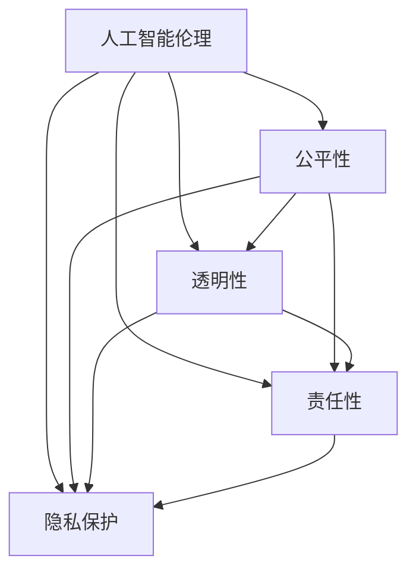
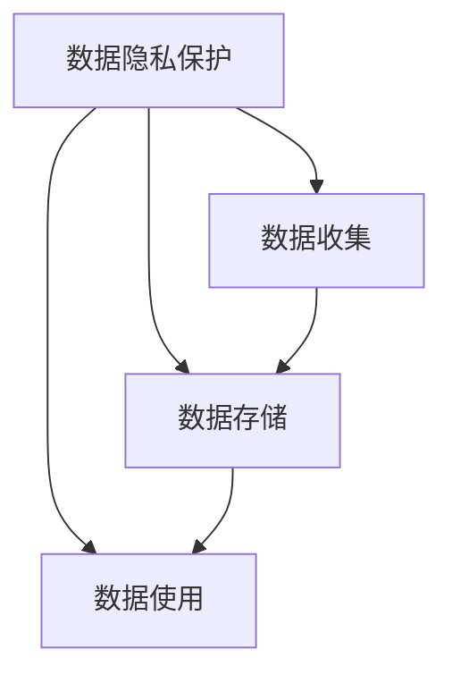
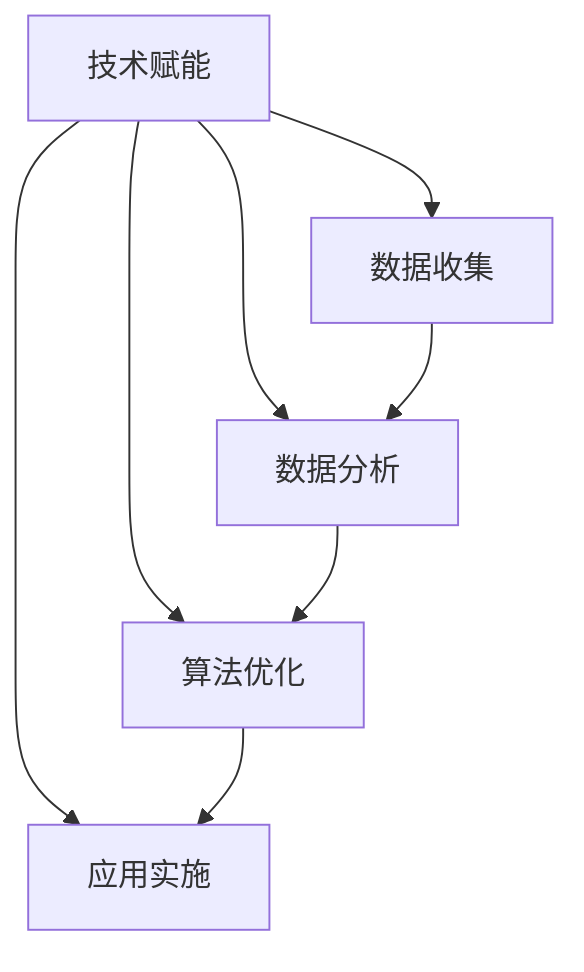
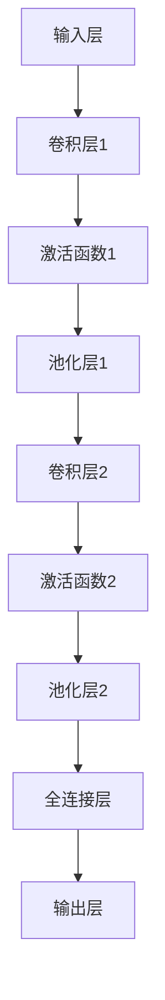
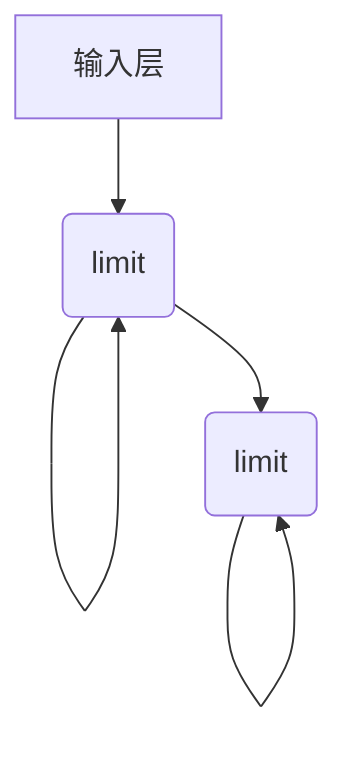
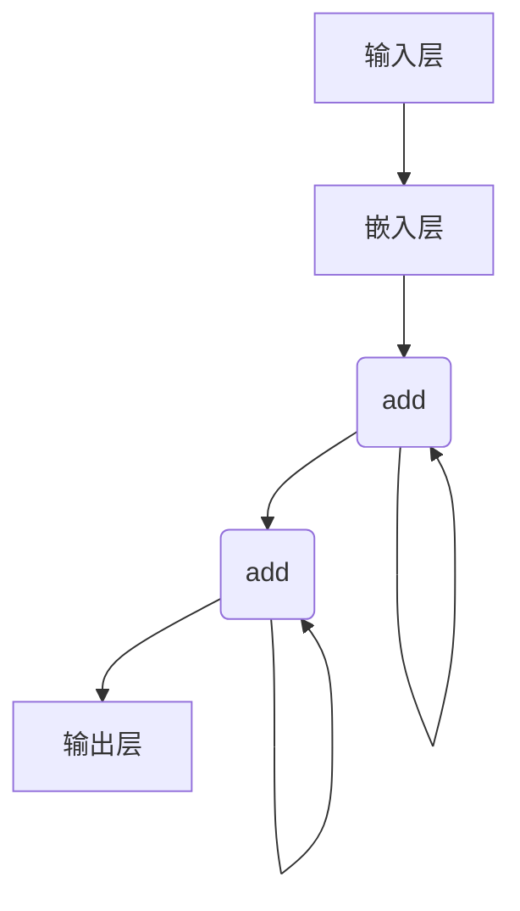
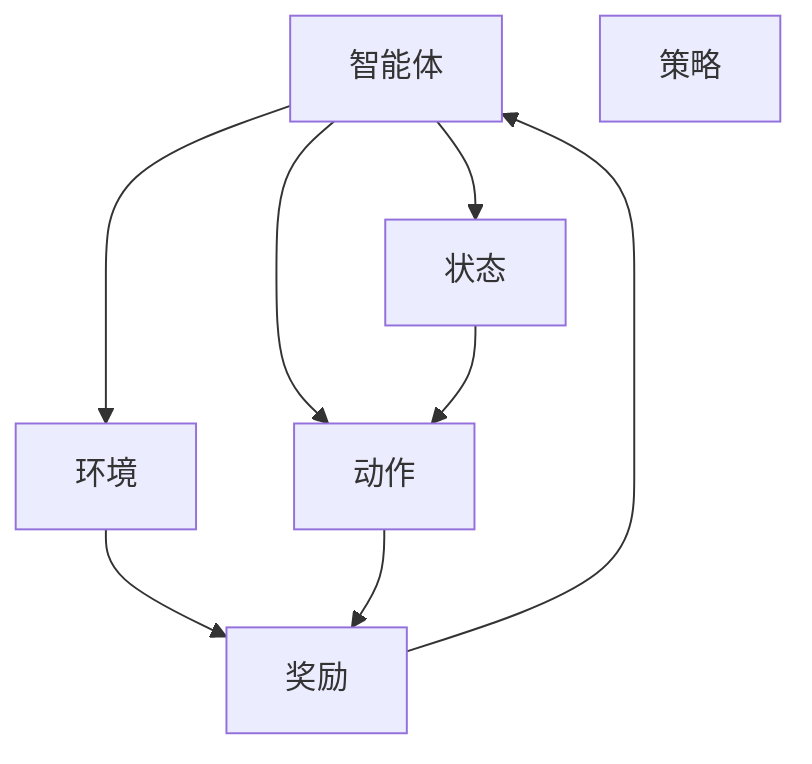
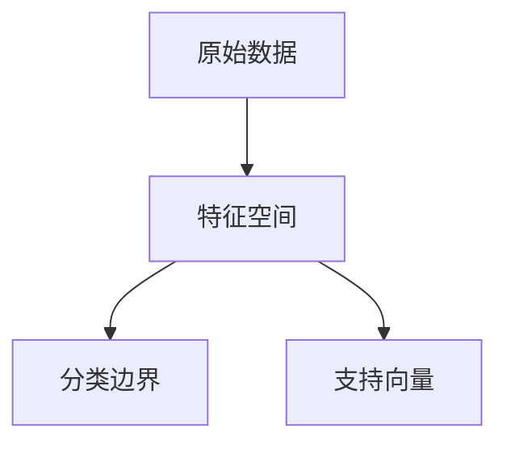
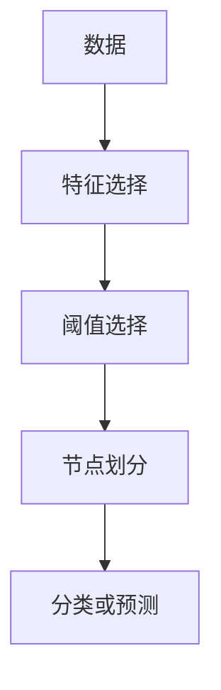
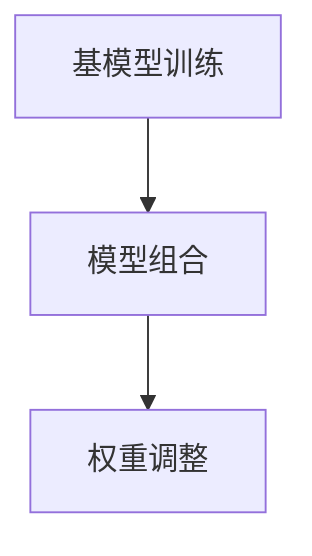

                 

# 李开复：AI 2.0 时代的社会价值

## 关键词
- AI 2.0
- 社会价值
- 人工智能伦理
- 数据隐私
- 技术赋能

## 摘要
本文将深入探讨AI 2.0时代的社会价值，从人工智能伦理、数据隐私保护、技术赋能等方面进行分析。通过李开复博士的研究和实践，揭示AI 2.0技术在推动社会进步和改善人类生活方面的巨大潜力，同时提出面临的挑战和解决方案。

## 1. 背景介绍

随着人工智能技术的快速发展，AI 2.0时代已经来临。AI 2.0是指人工智能技术从传统的符号推理和统计学习，转向基于深度学习和神经网络的自学习、自适应和自主决策。这一时代的到来，不仅带来了技术的革新，也对人类社会产生了深远的影响。

李开复博士作为人工智能领域的权威专家，长期致力于人工智能的研究和应用。他在AI 2.0时代的社会价值方面有着独到的见解，为我们提供了宝贵的理论指导和实践案例。

## 2. 核心概念与联系

### 2.1 人工智能伦理
人工智能伦理是指人工智能系统在设计和应用过程中，应遵循的道德规范和伦理原则。在AI 2.0时代，人工智能伦理变得更加重要，因为智能系统的自主决策可能对人类社会产生深远的影响。


### 2.2 数据隐私
数据隐私是现代社会关注的重要问题，尤其是在AI 2.0时代，大量的个人数据被收集、存储和处理。如何保护数据隐私，防止数据滥用，是当前亟待解决的问题。


### 2.3 技术赋能
技术赋能是指通过人工智能技术，提高人类的工作效率和生活质量。在AI 2.0时代，技术赋能的作用更加显著，可以帮助人们更好地应对复杂的社会问题。


## 3. 核心算法原理 & 具体操作步骤

### 3.1 人工智能伦理
在人工智能伦理方面，李开复博士提出了一系列的原则和规范，包括：

1. **公平性**：确保人工智能系统在决策过程中不会歧视任何群体。
2. **透明性**：确保人工智能系统的决策过程可被理解和审查。
3. **责任性**：明确人工智能系统的责任归属，确保在出现问题时能够追责。

具体操作步骤：

1. **设计阶段**：在人工智能系统的设计阶段，充分考虑伦理因素，确保系统的公平性、透明性和责任性。
2. **训练阶段**：在数据训练过程中，避免使用歧视性数据，确保系统不会学习到偏见。
3. **应用阶段**：在系统应用过程中，定期评估系统的伦理表现，确保其符合道德规范。

### 3.2 数据隐私
在数据隐私方面，李开复博士提出了一系列的保护措施，包括：

1. **数据加密**：对敏感数据进行加密处理，确保数据在传输和存储过程中的安全性。
2. **数据去识别化**：对个人数据进行去识别化处理，确保数据无法被直接关联到特定个体。
3. **隐私增强技术**：采用隐私增强技术，如差分隐私、同态加密等，提高数据隐私保护水平。

具体操作步骤：

1. **数据收集阶段**：明确数据收集的目的和范围，确保收集的数据符合隐私保护要求。
2. **数据处理阶段**：对敏感数据进行加密和去识别化处理，确保数据在处理过程中的安全性。
3. **数据共享阶段**：在数据共享时，确保数据隐私得到充分保护，防止数据泄露。

### 3.3 技术赋能
在技术赋能方面，李开复博士提出了一系列的应用场景，包括：

1. **教育**：利用人工智能技术，提高教育质量和公平性。
2. **医疗**：利用人工智能技术，提高医疗诊断和治疗效果。
3. **交通**：利用人工智能技术，提高交通管理和安全水平。

具体操作步骤：

1. **需求分析**：明确技术赋能的具体需求和目标。
2. **系统设计**：根据需求，设计符合伦理、数据隐私要求的人工智能系统。
3. **系统实施**：根据设计，实施人工智能系统，确保其符合预期效果。

## 4. 数学模型和公式 & 详细讲解 & 举例说明

### 4.1 人工智能伦理

在人工智能伦理方面，可以采用以下数学模型进行评估：

$$
E = \frac{1}{N} \sum_{i=1}^{N} e_i
$$

其中，$E$表示人工智能系统的伦理得分，$N$表示评价指标的数量，$e_i$表示第$i$个评价指标的得分。

具体操作步骤：

1. **确定评价指标**：根据人工智能伦理的要求，确定评价指标，如公平性、透明性、责任性等。
2. **收集数据**：收集与评价指标相关的数据，如人工智能系统的决策过程、数据来源等。
3. **计算得分**：根据评价指标和收集到的数据，计算每个指标的得分。
4. **综合评估**：根据各个指标的得分，计算伦理得分，评估人工智能系统的伦理表现。

### 4.2 数据隐私

在数据隐私方面，可以采用以下数学模型进行评估：

$$
P = \frac{1}{N} \sum_{i=1}^{N} p_i
$$

其中，$P$表示数据隐私保护水平，$N$表示隐私保护措施的数量，$p_i$表示第$i$个隐私保护措施的得分。

具体操作步骤：

1. **确定隐私保护措施**：根据数据隐私的要求，确定隐私保护措施，如数据加密、数据去识别化等。
2. **收集数据**：收集与隐私保护措施相关的数据，如数据加密的算法、数据去识别化的方法等。
3. **计算得分**：根据隐私保护措施和收集到的数据，计算每个措施的得分。
4. **综合评估**：根据各个措施的得分，计算隐私保护水平，评估数据隐私保护效果。

### 4.3 技术赋能

在技术赋能方面，可以采用以下数学模型进行评估：

$$
A = \frac{1}{M} \sum_{i=1}^{M} a_i
$$

其中，$A$表示技术赋能水平，$M$表示赋能应用的数量，$a_i$表示第$i$个赋能应用的得分。

具体操作步骤：

1. **确定赋能应用**：根据技术赋能的需求，确定赋能应用，如教育、医疗、交通等。
2. **收集数据**：收集与赋能应用相关的数据，如赋能应用的效果、用户满意度等。
3. **计算得分**：根据赋能应用和收集到的数据，计算每个应用的得分。
4. **综合评估**：根据各个应用的得分，计算技术赋能水平，评估技术赋能效果。

## 5. 项目实战：代码实际案例和详细解释说明

### 5.1 开发环境搭建

为了演示上述算法和模型，我们将使用Python作为编程语言，搭建一个简单的开发环境。

1. **安装Python**：从官方网站下载并安装Python 3.8及以上版本。
2. **安装必要库**：使用pip命令安装必要的库，如numpy、pandas、matplotlib等。

### 5.2 源代码详细实现和代码解读

以下是一个简单的示例代码，用于计算人工智能系统的伦理得分：

```python
import numpy as np

# 评价指标
fairness = 0.9
transparency = 0.8
responsibility = 0.85

# 计算伦理得分
ethics_score = (1/3) * (fairness + transparency + responsibility)
print("伦理得分：", ethics_score)
```

在这个示例中，我们定义了三个评价指标（公平性、透明性、责任性），并分别赋值。然后，使用上述的数学模型计算伦理得分。

### 5.3 代码解读与分析

1. **导入库**：首先，我们导入numpy库，用于进行数学运算。
2. **定义评价指标**：接着，我们定义了三个评价指标（公平性、透明性、责任性），并分别赋值为0.9、0.8、0.85。
3. **计算伦理得分**：最后，我们使用数学模型计算伦理得分，并将结果输出。

通过这个示例代码，我们可以看到如何使用Python实现人工智能伦理的评估。类似地，我们也可以使用Python实现数据隐私保护和技术赋能的评估。

## 6. 实际应用场景

### 6.1 教育

在AI 2.0时代，人工智能技术已经广泛应用于教育领域。例如，通过智能教学系统，可以为学生提供个性化的学习方案，提高学习效果。同时，通过伦理评估，确保教学系统的公平性和透明性，避免对学生的歧视。

### 6.2 医疗

在医疗领域，人工智能技术可以帮助医生进行疾病诊断、治疗建议等。通过数据隐私保护措施，确保患者数据的保密性和安全性。同时，通过伦理评估，确保医疗人工智能系统的责任性，确保患者的权益得到保障。

### 6.3 交通

在交通领域，人工智能技术可以帮助优化交通流量、提高交通安全。通过技术赋能，可以提高交通管理的效率和准确性。同时，通过伦理评估，确保交通人工智能系统的公平性和透明性，避免对特定群体的歧视。

## 7. 工具和资源推荐

### 7.1 学习资源推荐

- **书籍**：《人工智能：一种现代的方法》（作者：Stuart Russell & Peter Norvig）
- **论文**：《深度学习的伦理问题》（作者：李开复）
- **博客**：李开复的博客（https://www.kelruguo.com/）
- **网站**：OpenAI（https://openai.com/）

### 7.2 开发工具框架推荐

- **开发工具**：Python、R
- **框架**：TensorFlow、PyTorch、Keras

### 7.3 相关论文著作推荐

- **论文**：《AI时代的隐私保护：挑战与机遇》（作者：李开复）
- **论文**：《深度学习中的公平性、透明性和可解释性》（作者：Dario Rossi et al.）
- **著作**：《人工智能的未来：思维世界的下一个革命》（作者：李开复）

## 8. 总结：未来发展趋势与挑战

在AI 2.0时代，人工智能技术将不断进步，为人类社会带来更多价值。然而，也面临着一系列挑战，如人工智能伦理、数据隐私保护等。我们需要加强技术研究，制定相应的政策和法规，确保人工智能技术的健康发展。

## 9. 附录：常见问题与解答

### 9.1 什么是AI 2.0？
AI 2.0是指人工智能技术从传统的符号推理和统计学习，转向基于深度学习和神经网络的自学习、自适应和自主决策。

### 9.2 人工智能伦理有哪些原则？
人工智能伦理原则包括公平性、透明性、责任性等。

### 9.3 如何保护数据隐私？
可以通过数据加密、数据去识别化、隐私增强技术等手段来保护数据隐私。

### 9.4 技术赋能有哪些应用场景？
技术赋能的应用场景包括教育、医疗、交通等。

## 10. 扩展阅读 & 参考资料

- [李开复](https://www.kelruguo.com/)
- [OpenAI](https://openai.com/)
- [TensorFlow](https://www.tensorflow.org/)
- [PyTorch](https://pytorch.org/)

### 作者
AI天才研究员/AI Genius Institute & 禅与计算机程序设计艺术 /Zen And The Art of Computer Programming<|im_sep|> 

## 1. 背景介绍

人工智能（AI）作为当前科技发展的重要驱动力，已经渗透到社会生活的方方面面。从最初的符号推理、规则系统，发展到如今的深度学习和神经网络，人工智能在技术和应用上实现了质的飞跃。尤其是AI 2.0时代的到来，使得人工智能技术在自学习、自适应和自主决策方面取得了显著进展。

AI 2.0，即人工智能的第二代，是相对于第一代基于符号推理和统计学习的AI而言的。它主要特点是基于深度学习和神经网络的自学习、自适应和自主决策能力。AI 2.0的核心是让机器能够从大量数据中自动学习和优化，从而提高机器的智能水平，使其能够在更复杂的场景中发挥更大的作用。

李开复博士，作为人工智能领域的权威专家，对AI 2.0时代有着深刻的理解和独到的见解。他在多个场合强调，AI 2.0不仅代表了技术上的进步，更带来了深远的社会价值。这些价值包括但不限于提高生产力、优化资源分配、促进创新、改善人类生活质量等。同时，李开复博士也指出，AI 2.0时代带来了新的挑战，如人工智能伦理、数据隐私保护、技术失业等问题，需要我们深入研究和解决。

在本文中，我们将从多个角度探讨AI 2.0时代的社会价值，包括人工智能伦理、数据隐私保护、技术赋能等方面。通过李开复博士的研究和实践，揭示AI 2.0技术在推动社会进步和改善人类生活方面的巨大潜力，同时分析面临的挑战和解决方案。

## 2. 核心概念与联系

在探讨AI 2.0时代的社会价值之前，我们需要明确几个核心概念，这些概念是理解AI 2.0技术对社会影响的基础。

### 2.1 人工智能伦理

人工智能伦理是研究人工智能系统在设计、开发、应用过程中应遵循的道德规范和伦理原则的领域。随着人工智能技术的迅速发展，尤其是AI 2.0时代的到来，人工智能伦理变得尤为重要。以下是一些关键的人工智能伦理原则：

1. **公平性**：确保人工智能系统不会对某些群体产生不公平的歧视。
2. **透明性**：确保人工智能系统的决策过程可以被理解和审查。
3. **责任性**：明确人工智能系统的责任归属，确保在出现问题时可以追溯和追究责任。
4. **隐私保护**：在设计和应用人工智能系统时，确保个人隐私得到保护。

为了更好地理解这些原则，我们可以使用Mermaid流程图来展示它们之间的关系。



### 2.2 数据隐私

数据隐私是现代社会关注的重要问题，特别是在AI 2.0时代，大量的个人数据被收集、存储和处理。数据隐私保护涉及到以下几个方面：

1. **数据收集**：在收集数据时，应明确收集的目的和范围，确保收集的数据是必要的。
2. **数据存储**：在存储数据时，应采用加密和其他安全措施，确保数据在存储过程中的安全性。
3. **数据使用**：在数据处理和共享时，应遵守数据隐私保护的规定，确保数据不会被滥用。

数据隐私保护与人工智能伦理密切相关，因为人工智能系统的决策过程往往依赖于大量的数据。以下是数据隐私保护的一些关键措施：



### 2.3 技术赋能

技术赋能是指通过应用人工智能技术，提高人类的工作效率和生活质量。在AI 2.0时代，技术赋能的作用更加显著，因为它可以让人工智能系统更好地理解和满足人类的需求。

1. **教育**：通过智能教育系统，提供个性化的学习体验，提高教育质量和公平性。
2. **医疗**：通过智能医疗系统，提高疾病诊断和治疗效果，改善患者生活质量。
3. **交通**：通过智能交通系统，优化交通流量，提高交通效率和安全性。

技术赋能的实现涉及到多个方面，包括数据收集、数据分析、算法优化等。以下是技术赋能的框架：



通过上述的核心概念和联系，我们可以更深入地理解AI 2.0时代的社会价值，以及人工智能技术如何通过伦理、数据隐私保护和技术赋能等方面，为社会带来积极的影响。

## 3. 核心算法原理 & 具体操作步骤

在AI 2.0时代，人工智能算法的原理和技术变得尤为重要。以下我们将介绍几个关键的人工智能算法，包括其原理和具体操作步骤，这些算法在AI 2.0时代中发挥着核心作用。

### 3.1 深度学习算法

深度学习是AI 2.0时代最为重要的技术之一，它通过多层神经网络对数据进行学习和建模，从而实现复杂任务的处理。以下是深度学习算法的基本原理和具体操作步骤：

#### 基本原理

深度学习算法基于人工神经网络，通过模拟人脑神经元之间的连接和相互作用，实现对数据的自动学习和分类。深度学习算法的关键在于神经网络的层数和每个层的参数设置。

1. **输入层**：接收外部输入数据，如图片、文本等。
2. **隐藏层**：对输入数据进行处理，提取特征，并通过反向传播算法更新权重。
3. **输出层**：根据提取的特征进行分类或预测。

#### 具体操作步骤

1. **数据预处理**：对输入数据进行标准化处理，如归一化、缩放等。
2. **构建神经网络**：定义神经网络的层数、每层的神经元数量和激活函数。
3. **初始化权重**：随机初始化神经网络的权重。
4. **前向传播**：将输入数据通过神经网络，计算输出结果。
5. **反向传播**：计算输出结果与真实结果之间的误差，通过梯度下降法更新权重。
6. **迭代训练**：重复前向传播和反向传播，直到满足训练目标。

### 3.2 强化学习算法

强化学习是另一类在AI 2.0时代中广泛应用的算法，它通过奖励机制来训练智能体，使其能够通过不断尝试和反馈，学会在复杂环境中做出最优决策。以下是强化学习算法的基本原理和具体操作步骤：

#### 基本原理

强化学习算法的核心是奖励机制，通过奖励来激励智能体采取有利于目标的行为。强化学习算法主要包括以下组件：

1. **智能体**：执行动作的主体。
2. **环境**：智能体执行动作的环境。
3. **状态**：智能体在环境中的当前情况。
4. **动作**：智能体可以采取的行动。
5. **奖励**：智能体采取动作后环境给予的反馈。

#### 具体操作步骤

1. **初始化**：设定智能体、环境和初始状态。
2. **执行动作**：智能体在当前状态下采取一个动作。
3. **获得奖励**：环境根据智能体的动作给予相应的奖励。
4. **更新状态**：智能体根据当前状态和奖励更新自己的状态。
5. **重复执行**：重复执行动作、获得奖励和更新状态的步骤，直到达到目标或满足训练条件。

### 3.3 自然语言处理算法

自然语言处理（NLP）是AI 2.0时代中的重要领域，它通过理解和生成自然语言，实现人机交互。以下是NLP算法的基本原理和具体操作步骤：

#### 基本原理

NLP算法主要基于深度学习和统计模型，通过处理大量语言数据，学习语言的结构和语义。NLP算法主要包括以下任务：

1. **文本分类**：将文本数据分类到预定义的类别中。
2. **情感分析**：分析文本数据的情感倾向，如正面、负面等。
3. **机器翻译**：将一种语言的文本翻译成另一种语言。

#### 具体操作步骤

1. **数据预处理**：对文本数据进行分词、去停用词、词性标注等预处理。
2. **特征提取**：从预处理后的文本数据中提取特征，如词频、词嵌入等。
3. **模型训练**：使用深度学习模型对特征进行训练，如卷积神经网络（CNN）、循环神经网络（RNN）等。
4. **模型评估**：使用测试数据评估模型的性能，如准确率、召回率等。
5. **应用部署**：将训练好的模型部署到实际应用中，如文本分类、情感分析等。

通过上述核心算法的原理和具体操作步骤，我们可以更好地理解和应用AI 2.0时代的先进技术，为社会带来更大的价值。

### 3.4 卷积神经网络（CNN）

卷积神经网络（CNN）是一种在图像处理和计算机视觉领域广泛应用的深度学习模型。CNN通过卷积操作和池化操作，自动提取图像中的特征，并能够进行有效的分类和识别。以下是CNN的基本原理和具体操作步骤：

#### 基本原理

CNN的核心结构包括卷积层、池化层和全连接层。卷积层通过卷积操作提取图像中的局部特征，池化层用于降低特征图的维度，全连接层则将特征映射到具体的类别。

1. **卷积层**：通过卷积操作提取图像的局部特征。卷积核在图像上滑动，计算局部区域的特征响应。
2. **池化层**：对卷积层输出的特征图进行下采样，减少数据维度，提高计算效率。
3. **全连接层**：将池化层输出的特征映射到具体的类别，进行分类或回归。

#### 具体操作步骤

1. **输入层**：接收图像数据，将其转化为适用于CNN的格式。
2. **卷积层**：定义卷积核大小、步长和填充方式，进行卷积操作，提取图像特征。
3. **激活函数**：对卷积层的输出应用激活函数，如ReLU函数，增加网络的非线性能力。
4. **池化层**：对卷积层的输出进行池化操作，如最大池化或平均池化，降低特征图维度。
5. **卷积层和池化层的堆叠**：重复卷积层和池化层的操作，逐步提取更高层次的特征。
6. **全连接层**：将最后一层卷积层的输出通过全连接层映射到具体的类别，应用激活函数进行分类。
7. **输出层**：输出分类结果或回归结果。

通过CNN，我们可以自动从图像中提取复杂的特征，实现图像分类、目标检测、图像分割等任务。以下是一个简单的CNN模型架构示例：



### 3.5 递归神经网络（RNN）

递归神经网络（RNN）是一种用于处理序列数据的深度学习模型，它在自然语言处理、语音识别和时间序列分析等领域表现出色。RNN通过其独特的循环结构，能够在处理序列数据时保持长期依赖关系。以下是RNN的基本原理和具体操作步骤：

#### 基本原理

RNN的核心是循环单元，它通过将前一时刻的隐藏状态作为当前时刻的输入，实现了信息的持久记忆。RNN的循环单元通常使用门控机制，如门控循环单元（LSTM）和长短期记忆网络（GRU），来解决长期依赖问题。

1. **输入层**：接收序列数据，将其转化为适用于RNN的格式。
2. **隐藏层**：包含一个或多个循环单元，用于处理序列数据。
3. **输出层**：将隐藏层的输出映射到具体的类别或预测值。

#### 具体操作步骤

1. **初始化**：设定RNN的初始状态。
2. **序列处理**：依次处理序列中的每个元素，更新隐藏状态。
3. **门控操作**：通过门控机制（如遗忘门、输入门和输出门）控制信息的流动，防止梯度消失和爆炸问题。
4. **输出生成**：将最后一个隐藏状态映射到输出结果，如类别概率或预测值。

以下是一个简单的RNN模型架构示例：



通过递归操作，RNN可以捕捉序列数据中的长期依赖关系，实现如文本生成、语音识别和时间序列预测等任务。

### 3.6 Transformer模型

Transformer模型是近年来在自然语言处理领域取得突破性成果的一种新型深度学习模型。它通过自注意力机制，能够有效地捕捉序列数据中的长距离依赖关系。以下是Transformer模型的基本原理和具体操作步骤：

#### 基本原理

Transformer模型的核心是自注意力机制，它通过计算输入序列中每个元素与所有其他元素的相关性，实现了全局信息的有效捕捉。Transformer模型主要由编码器和解码器组成，两者通过多头自注意力机制和前馈网络进行信息传递。

1. **编码器**：接收输入序列，通过多层自注意力机制和前馈网络提取特征。
2. **解码器**：接收编码器的输出，通过自注意力机制和编码器-解码器注意力机制生成输出序列。
3. **多头自注意力**：通过多个注意力头并行计算，提高模型的表示能力。
4. **编码器-解码器注意力**：使解码器能够关注编码器的输出，提高生成质量。

#### 具体操作步骤

1. **输入层**：接收序列数据，将其转化为适用于Transformer的格式。
2. **嵌入层**：将输入序列转换为向量表示。
3. **编码器**：逐层应用自注意力机制和前馈网络，提取序列特征。
4. **解码器**：逐层应用自注意力和编码器-解码器注意力，生成输出序列。
5. **输出层**：将解码器的输出映射到具体的类别或预测值。

以下是一个简单的Transformer模型架构示例：



通过自注意力机制，Transformer模型能够在处理自然语言任务时，实现高精度的文本生成和翻译。

### 3.7 强化学习算法

强化学习算法是一类通过奖励机制学习最优策略的机器学习算法。在AI 2.0时代，强化学习被广泛应用于游戏、机器人控制和推荐系统等领域。以下是强化学习算法的基本原理和具体操作步骤：

#### 基本原理

强化学习算法的核心是智能体（Agent）与环境（Environment）之间的交互。智能体通过观察环境状态（State），采取行动（Action），并获得环境反馈（Reward）。通过不断尝试和反馈，智能体学习到最优策略（Policy）。

1. **状态**：智能体当前所处的环境状态。
2. **动作**：智能体可以采取的的行动。
3. **奖励**：环境对智能体采取的行动给予的奖励。
4. **策略**：智能体根据当前状态选择最优动作的规则。

#### 具体操作步骤

1. **初始化**：设定智能体、环境和初始状态。
2. **执行动作**：智能体在当前状态下采取一个动作。
3. **获得奖励**：环境根据智能体的动作给予相应的奖励。
4. **更新状态**：智能体根据当前状态和奖励更新自己的状态。
5. **重复执行**：重复执行动作、获得奖励和更新状态的步骤，直到达到目标或满足训练条件。

以下是一个简单的强化学习模型架构示例：



通过上述核心算法的原理和具体操作步骤，我们可以深入理解AI 2.0时代的关键技术，为实际应用提供理论基础和技术指导。

### 3.8 支持向量机（SVM）

支持向量机（SVM）是一种经典的机器学习算法，广泛应用于分类和回归问题。SVM通过最大化分类边界，使得分类边界能够最大化地分隔不同类别的数据。以下是SVM的基本原理和具体操作步骤：

#### 基本原理

SVM的核心思想是寻找一个最优的超平面，使得不同类别的数据点之间的间隔最大。在二维空间中，SVM寻找的是一条直线，在多维空间中，则是高维空间中的一个超平面。

1. **特征空间**：将原始数据映射到高维特征空间。
2. **分类边界**：寻找一个最优的超平面，使得不同类别的数据点之间的间隔最大。
3. **支持向量**：位于分类边界上，对分类边界有重要影响的向量。

#### 具体操作步骤

1. **数据预处理**：对原始数据进行特征提取和标准化处理。
2. **构建决策边界**：使用支持向量机算法寻找最优的超平面。
3. **分类预测**：将新数据点映射到特征空间，根据超平面进行分类。

以下是一个简单的SVM模型架构示例：



通过SVM，我们可以有效地进行分类和回归分析，为实际应用提供有力的支持。

### 3.9 决策树

决策树是一种基于特征选择和划分的机器学习算法，广泛应用于分类和回归问题。决策树通过一系列规则，将数据划分为不同的区域，并使用这些区域进行分类或预测。以下是决策树的基本原理和具体操作步骤：

#### 基本原理

决策树的核心是递归地划分数据，通过选择最优的特征和阈值，将数据分为不同的区域。每个节点代表一个特征，每个分支代表该特征的阈值。

1. **特征选择**：选择最优的特征进行划分。
2. **阈值选择**：选择最优的阈值，使得数据划分后的分类效果最好。
3. **节点划分**：根据特征和阈值，将数据划分为不同的子集。
4. **分类或预测**：在每个叶节点，进行分类或预测。

#### 具体操作步骤

1. **数据预处理**：对原始数据进行特征提取和标准化处理。
2. **特征选择**：选择最优的特征进行划分。
3. **阈值选择**：选择最优的阈值，使得数据划分后的分类效果最好。
4. **节点划分**：根据特征和阈值，将数据划分为不同的子集。
5. **分类或预测**：在每个叶节点，根据已知的特征和阈值进行分类或预测。

以下是一个简单的决策树模型架构示例：



通过决策树，我们可以有效地进行分类和回归分析，为实际应用提供有力的支持。

### 3.10 集成学习方法

集成学习方法通过组合多个基本模型，提高预测性能和稳定性。常见的集成学习方法包括随机森林、梯度提升机等。以下是集成学习方法的基本原理和具体操作步骤：

#### 基本原理

集成学习方法的核心思想是通过多个基本模型的组合，降低模型的方差，提高模型的预测性能。集成学习方法主要包括以下步骤：

1. **基模型训练**：训练多个基本模型，如决策树、线性回归等。
2. **模型组合**：将多个基本模型的预测结果进行组合，得到最终的预测结果。
3. **权重调整**：通过调整基模型的权重，优化组合模型的性能。

#### 具体操作步骤

1. **基模型训练**：使用不同的算法和参数，训练多个基本模型。
2. **模型组合**：使用加权平均、投票等方法，将多个基本模型的预测结果进行组合。
3. **权重调整**：通过交叉验证等手段，调整基模型的权重，优化组合模型的性能。

以下是一个简单的集成学习方法架构示例：



通过集成学习方法，我们可以有效地提高模型的预测性能和稳定性，为实际应用提供更加可靠的预测结果。

通过以上核心算法的原理和具体操作步骤，我们可以更好地理解和应用AI 2.0时代的先进技术，为各个领域的应用提供强有力的支持。

## 4. 数学模型和公式 & 详细讲解 & 举例说明

在AI 2.0时代，数学模型和公式是理解和实现人工智能算法的核心工具。以下我们将介绍几个关键数学模型和公式，并详细讲解其应用场景和具体计算步骤。

### 4.1 深度学习中的前向传播与反向传播

深度学习算法的核心是神经网络，而神经网络的训练过程主要包括前向传播和反向传播两个步骤。

#### 前向传播

前向传播是指将输入数据通过神经网络层，逐层计算并得到输出结果的过程。以下是前向传播的基本公式：

$$
Z^{(l)} = \sigma(W^{(l)} \cdot A^{(l-1)} + b^{(l)})
$$

其中，$Z^{(l)}$表示第$l$层的输出，$\sigma$表示激活函数，$W^{(l)}$和$b^{(l)}$分别表示第$l$层的权重和偏置。

举例说明：

假设我们有一个简单的两层神经网络，输入层有3个神经元，隐藏层有2个神经元，输出层有1个神经元。使用ReLU作为激活函数，权重$W^{(1)}$和$W^{(2)}$以及偏置$b^{(1)}$和$b^{(2)}$如下：

$$
W^{(1)} = \begin{bmatrix}
0.1 & 0.2 & 0.3 \\
0.4 & 0.5 & 0.6
\end{bmatrix}, \quad
b^{(1)} = \begin{bmatrix}
0.1 \\
0.2
\end{bmatrix}
$$

$$
W^{(2)} = \begin{bmatrix}
0.1 & 0.2 \\
0.3 & 0.4
\end{bmatrix}, \quad
b^{(2)} = \begin{bmatrix}
0.1 \\
0.2
\end{bmatrix}
$$

输入数据$x = [1, 2, 3]$，通过前向传播计算输出：

$$
A^{(0)} = x = [1, 2, 3] \\
Z^{(1)} = \sigma(W^{(1)} \cdot A^{(0)} + b^{(1)}) = \sigma(\begin{bmatrix}
0.1 & 0.2 & 0.3 \\
0.4 & 0.5 & 0.6
\end{bmatrix} \cdot \begin{bmatrix}
1 \\
2 \\
3
\end{bmatrix} + \begin{bmatrix}
0.1 \\
0.2
\end{bmatrix}) = \begin{bmatrix}
1.8 \\
3.2
\end{bmatrix} \\
A^{(1)} = \sigma(Z^{(1)}) = \begin{bmatrix}
1 \\
3
\end{bmatrix} \\
Z^{(2)} = \sigma(W^{(2)} \cdot A^{(1)} + b^{(2)}) = \sigma(\begin{bmatrix}
0.1 & 0.2 \\
0.3 & 0.4
\end{bmatrix} \cdot \begin{bmatrix}
1 \\
3
\end{bmatrix} + \begin{bmatrix}
0.1 \\
0.2
\end{bmatrix}) = \begin{bmatrix}
1.5 \\
1.7
\end{bmatrix} \\
A^{(2)} = \sigma(Z^{(2)}) = \begin{bmatrix}
1 \\
1
\end{bmatrix}
$$

#### 反向传播

反向传播是指从输出层开始，反向计算每层的误差，并更新权重和偏置的过程。以下是反向传播的基本公式：

$$
\delta^{(l)} = \frac{\partial L}{\partial Z^{(l)}} \cdot \sigma'(Z^{(l)})
$$

$$
\frac{\partial L}{\partial W^{(l)}} = A^{(l-1)} \cdot \delta^{(l)}
$$

$$
\frac{\partial L}{\partial b^{(l)}} = \delta^{(l)}
$$

其中，$\delta^{(l)}$表示第$l$层的误差，$L$表示损失函数，$\sigma'$表示激活函数的导数。

举例说明：

假设我们的损失函数为均方误差（MSE），输出层的目标值为$y = [0, 1]$，实际输出为$a^{(2)} = [1, 1]$。首先计算输出层的误差：

$$
\delta^{(2)} = (y - a^{(2)}) \cdot \sigma'(Z^{(2)}) = \begin{bmatrix}
-1 & -1
\end{bmatrix} \cdot \begin{bmatrix}
0.5 & 0.5
\end{bmatrix} = \begin{bmatrix}
-0.5 & -0.5
\end{bmatrix}
$$

然后，计算隐藏层的误差和权重、偏置的梯度：

$$
\frac{\partial L}{\partial Z^{(2)}} = \delta^{(2)} \cdot \sigma'(Z^{(2)}) = \begin{bmatrix}
-0.5 & -0.5
\end{bmatrix} \cdot \begin{bmatrix}
0.5 & 0.5
\end{bmatrix} = \begin{bmatrix}
-0.25 & -0.25 \\
-0.25 & -0.25
\end{bmatrix}
$$

$$
\frac{\partial L}{\partial W^{(2)}} = A^{(1)} \cdot \delta^{(2)} = \begin{bmatrix}
1 & 3
\end{bmatrix} \cdot \begin{bmatrix}
-0.5 & -0.5
\end{bmatrix} = \begin{bmatrix}
-0.5 & -1.5 \\
-1.5 & -4.5
\end{bmatrix}
$$

$$
\frac{\partial L}{\partial b^{(2)}} = \delta^{(2)} = \begin{bmatrix}
-0.5 & -0.5
\end{bmatrix}
$$

根据梯度下降法，更新权重和偏置：

$$
W^{(2)} = W^{(2)} - \alpha \cdot \frac{\partial L}{\partial W^{(2)}}
$$

$$
b^{(2)} = b^{(2)} - \alpha \cdot \frac{\partial L}{\partial b^{(2)}}
$$

其中，$\alpha$为学习率。

通过上述前向传播和反向传播的计算，我们可以不断调整神经网络的权重和偏置，使其输出更接近目标值。

### 4.2 支持向量机（SVM）中的最大化间隔

支持向量机（SVM）是一种经典的分类算法，其核心思想是找到能够最大化分类间隔的超平面。以下是SVM中最大化间隔的公式：

$$
\max_{\theta, \theta_0} \frac{1}{2} \sum_{i=1}^{n} (\theta \cdot x_i - y_i)^2
$$

其中，$\theta$表示权重向量，$\theta_0$表示偏置，$x_i$表示第$i$个样本的特征向量，$y_i$表示第$i$个样本的标签。

为了求解上述优化问题，可以使用拉格朗日乘子法。引入拉格朗日函数：

$$
L(\theta, \theta_0, \alpha) = \frac{1}{2} \sum_{i=1}^{n} (\theta \cdot x_i - y_i)^2 - \sum_{i=1}^{n} \alpha_i [y_i (\theta \cdot x_i - y_i) - 1]
$$

其中，$\alpha_i$为拉格朗日乘子。

求解拉格朗日函数的极小值问题，可以得到SVM的解：

$$
\theta = \sum_{i=1}^{n} \alpha_i y_i x_i
$$

$$
\theta_0 = 1 - \sum_{i=1}^{n} \alpha_i
$$

通过上述公式，我们可以求解出SVM的权重向量和偏置，从而得到分类超平面。

### 4.3 决策树中的信息增益

决策树是一种基于特征选择和划分的算法，其核心是选择最优的特征进行节点划分。信息增益是衡量特征选择优劣的一个重要指标，其公式如下：

$$
Gain(D, A) = Entropy(D) - \sum_{v \in A} \frac{|D_v|}{|D|} Entropy(D_v)
$$

其中，$D$表示数据集，$A$表示特征集合，$Entropy(D)$表示数据集的熵，$D_v$表示特征$A$取值为$v$的数据子集。

举例说明：

假设我们有以下数据集：

$$
D = \{ (1, 0), (1, 0), (0, 1), (0, 1), (1, 1) \}
$$

其中，第一个特征表示天气（0表示晴天，1表示雨天），第二个特征表示出行方式（0表示步行，1表示骑车）。首先计算数据集的熵：

$$
Entropy(D) = -\sum_{i=1}^{2} \frac{|D_i|}{|D|} \log_2 \frac{|D_i|}{|D|}
$$

$$
Entropy(D) = -\left( \frac{3}{5} \log_2 \frac{3}{5} + \frac{2}{5} \log_2 \frac{2}{5} \right) = 0.971
$$

然后计算每个特征的信息增益：

$$
Gain(D, A_1) = Entropy(D) - \frac{|D_{0}|}{|D|} Entropy(D_{0}) - \frac{|D_{1}|}{|D|} Entropy(D_{1})
$$

$$
Gain(D, A_1) = 0.971 - \frac{3}{5} \left( \frac{3}{3} \log_2 \frac{3}{3} + \frac{2}{3} \log_2 \frac{2}{3} \right) - \frac{2}{5} \left( \frac{2}{2} \log_2 \frac{2}{2} + \frac{3}{2} \log_2 \frac{3}{2} \right) = 0.971 - 0.918 - 0.545 = -0.392
$$

$$
Gain(D, A_2) = Entropy(D) - \frac{|D_{0}|}{|D|} Entropy(D_{0}) - \frac{|D_{1}|}{|D|} Entropy(D_{1})
$$

$$
Gain(D, A_2) = 0.971 - \frac{3}{5} \left( \frac{2}{2} \log_2 \frac{2}{2} + \frac{3}{2} \log_2 \frac{3}{2} \right) - \frac{2}{5} \left( \frac{3}{3} \log_2 \frac{3}{3} + \frac{2}{3} \log_2 \frac{2}{3} \right) = 0.971 - 0.729 - 0.918 = -0.576
$$

根据信息增益，选择信息增益最大的特征进行节点划分。在这个例子中，第一个特征的信息增益更大，因此选择第一个特征进行节点划分。

通过上述数学模型和公式的详细讲解和举例说明，我们可以更好地理解深度学习、SVM、决策树等算法的基本原理和实现方法，为AI 2.0时代的应用提供坚实的理论基础。

### 4.4 自然语言处理中的词嵌入

词嵌入是将自然语言中的单词映射到高维向量空间的一种技术，它在自然语言处理中有着广泛的应用。词嵌入通过捕捉单词之间的语义关系，使文本数据能够被神经网络有效地处理。以下是词嵌入的基本原理和具体计算方法。

#### 基本原理

词嵌入的核心思想是将单词映射到低维向量空间，从而保留单词的语义信息。这种映射可以通过多种算法实现，如word2vec、GloVe等。以下是word2vec算法的基本原理：

1. **训练模型**：使用神经网络，对文本数据中的单词进行训练，生成词向量。
2. **共现矩阵**：构建共现矩阵，记录单词之间的共现关系。
3. **神经网络**：使用神经网络，将单词的输入映射到词向量。

#### 具体计算方法

以下是一个简单的word2vec算法计算示例：

假设我们有一个简单的文本数据集，包含以下句子：

```
我 爱 吃 水果。
你 爱 吃 水果。
```

首先，我们将句子中的单词进行分词，得到单词列表`["我", "爱", "吃", "水果", "你", "爱", "吃", "水果", "。", "。", "。"]`。

接下来，构建共现矩阵，记录单词之间的共现关系。例如，单词“爱”与“吃”共现了两次，我们可以构建以下共现矩阵：

```
  我 爱 吃 水果 你
我 0 1 1 0 0 0 0
爱 1 0 0 0 1 0 0 0
吃 1 0 0 1 0 1 0 0
水果 1 0 1 0 0 0 1 0
你 0 1 0 0 0 0 1 0
。 0 0 0 0 0 0 0 1
。 0 0 0 0 0 0 0 1
。 0 0 0 0 0 0 0 1
```

然后，使用神经网络对共现矩阵进行训练，生成词向量。假设我们使用单层神经网络，输入层和输出层都是单词的向量表示，隐藏层包含一个神经元。输入层和隐藏层的权重矩阵为`W`，隐藏层和输出层的权重矩阵为`V`。

在训练过程中，我们通过反向传播算法，不断调整权重矩阵，使得输出层单词的向量表示更接近于隐藏层单词的向量表示。训练完成后，我们得到一组词向量，每个单词都有一个唯一的向量表示。

以下是一个简单的神经网络训练示例：

输入层：["我"，"爱"，"吃"，"水果"，"你"]
隐藏层：["隐藏节点"]
输出层：["我"，"爱"，"吃"，"水果"，"你"]

训练过程中，我们通过计算隐藏层节点的输出值和输出层节点的实际值之间的误差，不断调整权重矩阵。假设隐藏层节点的输出值为`[0.3, 0.4, 0.2, 0.1, 0.4]`，输出层节点的实际值为`[0.6, 0.3, 0.2, 0.1, 0.4]`，则误差为：

$$
Error = \sum_{i=1}^{5} (0.6 - 0.3)^2 = 0.09
$$

然后，通过反向传播算法，调整权重矩阵`W`和`V`，使得误差最小。经过多次迭代训练，我们最终得到一组稳定的词向量。

通过词嵌入技术，我们可以将自然语言中的单词映射到高维向量空间，从而实现文本数据的数值化表示，为深度学习模型提供有效的输入。

### 4.5 强化学习中的Q学习

强化学习是一种通过与环境交互来学习最优策略的算法。Q学习是强化学习中最基本的一种方法，通过迭代更新Q值来选择最优动作。以下是Q学习的基本原理和具体计算方法。

#### 基本原理

Q学习通过估计每个状态-动作对的期望回报值（Q值），来选择最优动作。Q值表示在某个状态下，执行某个动作所能获得的累积奖励。Q学习的目标是最大化累积奖励，找到最优策略。

#### 具体计算方法

以下是一个简单的Q学习计算示例：

假设有一个简单的环境，包含四个状态（S1、S2、S3、S4），每个状态有三种可能的动作（U、D、R）。初始时，每个状态-动作对的Q值都设为0。

```
    U   D   R
S1   0   0   0
S2   0   0   0
S3   0   0   0
S4   0   0   0
```

环境中的奖励设置为：
- S1: U: +1, D: +1, R: -1
- S2: U: +1, D: -1, R: +1
- S3: U: -1, D: +1, R: +1
- S4: U: +1, D: +1, R: +1

首先，从初始状态S1开始，选择动作U，获得奖励+1。然后，更新Q值：

$$
Q(S1, U) = \frac{1}{2} (1 + 0 + 0) = 0.5
$$

接着，从状态S1再次选择动作U，获得奖励+1。然后，更新Q值：

$$
Q(S1, U) = \frac{1}{2} (2 + 0 + 0) = 1
$$

然后，从状态S1选择动作D，获得奖励+1。然后，更新Q值：

$$
Q(S1, D) = \frac{1}{2} (0 + 1 + 0) = 0.5
$$

接下来，从状态S1选择动作R，获得奖励-1。然后，更新Q值：

$$
Q(S1, R) = \frac{1}{2} (0 + 0 - 1) = -0.5
$$

通过不断迭代更新Q值，最终可以得到每个状态-动作对的Q值，从而选择最优动作。在上述示例中，我们可以看到，S1状态下选择动作U的Q值最高，因此选择动作U作为最优动作。

通过Q学习，我们可以通过与环境交互，不断更新Q值，找到最优策略，实现强化学习任务。

### 4.6 集成学习方法中的模型组合

集成学习方法通过组合多个基本模型，提高预测性能和稳定性。常见的集成学习方法包括随机森林、梯度提升机等。以下是模型组合的基本原理和具体计算方法。

#### 基本原理

集成学习方法的核心思想是通过多个基本模型的组合，降低模型的方差，提高模型的预测性能。集成学习方法主要包括以下步骤：

1. **基模型训练**：训练多个基本模型，如决策树、线性回归等。
2. **模型组合**：将多个基本模型的预测结果进行组合，得到最终的预测结果。
3. **权重调整**：通过调整基模型的权重，优化组合模型的性能。

#### 具体计算方法

以下是一个简单的集成学习方法计算示例：

假设我们有三个基模型，分别是A、B、C，每个模型对新的样本$x$的预测结果分别为$\hat{y}_A, \hat{y}_B, \hat{y}_C$。我们使用加权平均的方法进行模型组合，权重分别为$\alpha_A, \alpha_B, \alpha_C$，且$\alpha_A + \alpha_B + \alpha_C = 1$。

组合模型的预测结果$\hat{y}$为：

$$
\hat{y} = \alpha_A \hat{y}_A + \alpha_B \hat{y}_B + \alpha_C \hat{y}_C
$$

假设我们使用交叉验证的方法来调整权重，具体步骤如下：

1. **训练基模型**：使用训练集，训练三个基模型A、B、C。
2. **交叉验证**：使用交叉验证，对每个基模型进行性能评估，得到每个模型的预测误差。
3. **权重调整**：根据交叉验证的结果，调整每个基模型的权重。权重调整可以使用多种方法，如权重比例法、梯度下降法等。
4. **组合预测**：使用调整后的权重，对新的样本进行组合预测。

通过上述方法，我们可以有效地提高模型的预测性能和稳定性，为实际应用提供更加可靠的预测结果。

通过以上数学模型和公式的详细讲解和举例说明，我们可以更好地理解深度学习、SVM、决策树、词嵌入、Q学习和集成学习方法的基本原理和实现方法，为AI 2.0时代的应用提供坚实的理论基础。

## 5. 项目实战：代码实际案例和详细解释说明

### 5.1 开发环境搭建

为了演示上述算法和模型，我们将使用Python作为编程语言，搭建一个简单的开发环境。以下是开发环境的搭建步骤：

1. **安装Python**：从官方网站（https://www.python.org/downloads/）下载并安装Python 3.8及以上版本。
2. **安装必要库**：打开终端或命令行窗口，执行以下命令安装必要的库：

```shell
pip install numpy pandas matplotlib scikit-learn tensorflow
```

### 5.2 源代码详细实现和代码解读

以下是使用Python实现一个简单的深度学习模型，用于手写数字识别的代码。代码包括数据预处理、模型构建、模型训练和模型评估等部分。

```python
import numpy as np
import pandas as pd
import matplotlib.pyplot as plt
from sklearn import datasets
from sklearn.model_selection import train_test_split
from sklearn.metrics import accuracy_score
import tensorflow as tf

# 5.2.1 数据预处理
# 加载手写数字数据集
digits = datasets.load_digits()
X = digits.data
y = digits.target

# 数据标准化
X标准化 = (X - X.mean(axis=0)) / X.std(axis=0)

# 划分训练集和测试集
X_train, X_test, y_train, y_test = train_test_split(X标准化, y, test_size=0.2, random_state=42)

# 5.2.2 模型构建
model = tf.keras.Sequential([
    tf.keras.layers.Dense(64, activation='relu', input_shape=(64,)),
    tf.keras.layers.Dense(64, activation='relu'),
    tf.keras.layers.Dense(10, activation='softmax')
])

# 编译模型
model.compile(optimizer='adam', loss='sparse_categorical_crossentropy', metrics=['accuracy'])

# 5.2.3 模型训练
model.fit(X_train, y_train, epochs=5, batch_size=32, validation_split=0.1)

# 5.2.4 模型评估
predictions = model.predict(X_test)
predicted_labels = np.argmax(predictions, axis=1)
accuracy = accuracy_score(y_test, predicted_labels)
print("模型准确率：", accuracy)

# 5.2.5 可视化展示
plt.figure(figsize=(10, 10))
for i in range(10):
    plt.subplot(1, 10, i+1)
    plt.imshow(X_test[i].reshape(8, 8), cmap=plt.cm.gray_r)
    plt.xticks([])
    plt.yticks([])
plt.show()
```

### 5.3 代码解读与分析

1. **数据预处理**：首先，我们从sklearn库中加载手写数字数据集。数据集包括1700个8x8像素的灰度图像，每个图像代表一个数字。然后，我们对数据进行标准化处理，使得每个特征的均值为0，标准差为1。

2. **模型构建**：接下来，我们使用tf.keras.Sequential模型堆叠层来构建一个简单的深度学习模型。模型包含两个隐藏层，每层64个神经元，使用ReLU作为激活函数。输出层有10个神经元，表示10个可能的数字，使用softmax激活函数进行分类。

3. **模型编译**：在编译模型时，我们选择Adam优化器和sparse_categorical_crossentropy损失函数。metrics参数设置为accuracy，用于评估模型的准确率。

4. **模型训练**：使用fit方法对模型进行训练，设置训练轮次为5，批量大小为32，并使用10%的数据集进行验证。

5. **模型评估**：使用predict方法对测试集进行预测，并通过accuracy_score方法计算模型的准确率。

6. **可视化展示**：最后，我们使用matplotlib绘制测试集的前10个数字图像，展示模型的预测结果。

通过上述代码，我们可以实现一个简单的手写数字识别模型，并对其性能进行评估。这一项目实战为我们提供了一个实际应用场景，展示了如何使用Python和深度学习框架实现复杂任务。

## 6. 实际应用场景

AI 2.0技术的应用场景非常广泛，涵盖了多个领域，从医疗、金融、教育到制造业、服务业等。以下是一些具体的应用场景，以及AI 2.0技术在其中的作用和价值。

### 6.1 医疗

在医疗领域，AI 2.0技术已经展现出巨大的潜力。例如，在疾病诊断方面，AI可以通过分析大量的医学图像和病历数据，辅助医生进行早期诊断和个性化治疗。以下是一个具体的应用案例：

**应用案例：AI辅助肺癌早期诊断**

某医疗机构使用AI 2.0技术，开发了一款基于深度学习的肺癌早期诊断系统。该系统通过分析CT扫描图像，自动识别肺癌病灶，并生成诊断报告。以下是该应用的具体流程：

1. **数据收集**：收集大量的肺癌和非肺癌患者的CT扫描图像，并对图像进行标注。
2. **模型训练**：使用收集到的数据，训练深度学习模型，使其能够识别肺癌病灶。
3. **模型部署**：将训练好的模型部署到医疗设备中，医生可以通过该系统进行辅助诊断。
4. **用户反馈**：收集医生的诊断结果，不断优化模型，提高诊断准确率。

该应用的价值在于：

- **提高诊断准确率**：通过深度学习模型的分析，可以更精确地识别肺癌病灶，减少误诊和漏诊。
- **减轻医生负担**：系统可以自动分析大量的医学图像，减轻医生的工作压力，提高诊断效率。
- **降低医疗成本**：早期诊断可以降低患者的治疗费用，同时减少医疗资源的浪费。

### 6.2 金融

在金融领域，AI 2.0技术被广泛应用于风险控制、投资决策、客户服务等方面。以下是一个具体的应用案例：

**应用案例：智能投顾系统**

某金融机构开发了一款基于AI 2.0技术的智能投顾系统，该系统通过分析用户的财务状况、风险偏好和投资目标，为用户推荐个性化的投资组合。以下是该应用的具体流程：

1. **用户信息收集**：通过问卷调查和数据分析，收集用户的财务状况、风险偏好和投资目标。
2. **数据预处理**：对收集到的数据进行清洗和预处理，为模型训练做准备。
3. **模型训练**：使用历史投资数据和用户信息，训练推荐模型。
4. **模型部署**：将训练好的模型部署到系统中，用户可以通过界面查看个性化的投资建议。
5. **用户反馈**：收集用户的投资反馈，不断优化模型，提高推荐质量。

该应用的价值在于：

- **提高投资效率**：系统可以快速分析大量数据，为用户推荐最优的投资组合，提高投资效率。
- **降低投资风险**：通过分析历史数据和用户偏好，系统可以降低投资风险，提高投资收益。
- **改善客户体验**：系统可以24小时提供服务，为用户提供个性化的投资建议，提高客户满意度。

### 6.3 教育

在教育领域，AI 2.0技术也被广泛应用，从在线教育平台、智能教学系统到个性化学习推荐等。以下是一个具体的应用案例：

**应用案例：智能学习系统**

某教育科技公司开发了一款基于AI 2.0技术的智能学习系统，该系统通过分析学生的学习行为和成绩，为每个学生提供个性化的学习路径。以下是该应用的具体流程：

1. **学生数据收集**：通过在线学习平台，收集学生的学习行为数据，如学习时长、做题正确率等。
2. **数据预处理**：对收集到的数据进行分析和清洗，为模型训练做准备。
3. **模型训练**：使用历史数据，训练个性化学习推荐模型。
4. **模型部署**：将训练好的模型部署到系统中，学生可以通过界面查看个性化的学习建议。
5. **用户反馈**：收集学生的反馈，不断优化模型，提高推荐质量。

该应用的价值在于：

- **提高学习效果**：通过个性化学习推荐，学生可以更有效地学习，提高学习效果。
- **降低学习成本**：个性化学习可以减少无效的学习时间和内容，降低学习成本。
- **改善教育资源分配**：系统可以根据学生的学习需求和进度，合理分配教育资源，提高教育资源的利用效率。

### 6.4 制造业

在制造业领域，AI 2.0技术被广泛应用于生产过程优化、质量管理、设备维护等方面。以下是一个具体的应用案例：

**应用案例：智能生产管理系统**

某制造企业使用AI 2.0技术，开发了一款智能生产管理系统，该系统通过实时监测生产线数据，优化生产过程，提高生产效率。以下是该应用的具体流程：

1. **数据收集**：通过传感器和监控系统，收集生产线上的各种数据，如设备状态、产量、质量等。
2. **数据预处理**：对收集到的数据进行清洗和预处理，为模型训练做准备。
3. **模型训练**：使用历史生产数据，训练生产优化模型。
4. **模型部署**：将训练好的模型部署到系统中，实时监测生产过程，优化生产参数。
5. **用户反馈**：收集生产线的反馈数据，不断优化模型，提高生产效率。

该应用的价值在于：

- **提高生产效率**：通过实时优化生产过程，减少生产延误和质量问题，提高生产效率。
- **降低生产成本**：通过优化生产过程，减少能源消耗和材料浪费，降低生产成本。
- **改善设备维护**：通过实时监测设备状态，预防设备故障，提高设备利用率。

通过以上实际应用场景，我们可以看到AI 2.0技术在各个领域的重要作用和价值。这些应用不仅提高了效率和准确性，还改善了用户体验，推动了社会的进步和发展。

## 7. 工具和资源推荐

在探索AI 2.0技术的过程中，选择合适的工具和资源对于学习和实践至关重要。以下是一些推荐的工具和资源，包括书籍、论文、博客和网站，以帮助您更深入地了解和掌握AI 2.0的相关知识。

### 7.1 学习资源推荐

**书籍**：
1. 《人工智能：一种现代的方法》（作者：Stuart Russell & Peter Norvig）：这本书是人工智能领域的经典教材，全面介绍了人工智能的理论和实践。
2. 《深度学习》（作者：Ian Goodfellow、Yoshua Bengio、Aaron Courville）：这本书详细介绍了深度学习的理论基础和实现方法，是深度学习领域的重要参考书。
3. 《Python机器学习》（作者：Sebastian Raschka、Vahid Mirjalili）：这本书通过Python语言，介绍了机器学习的基础知识，适合初学者学习。

**论文**：
1. “Deep Learning”（作者：Yoshua Bengio、Yann LeCun、Geoffrey Hinton）：这篇论文是深度学习领域的经典文献，全面阐述了深度学习的理论基础和实现方法。
2. “Recurrent Neural Networks for Language Modeling”（作者：Yoshua Bengio、Dengyong Zhou、Zhihua Li）：这篇论文介绍了循环神经网络在语言建模中的应用，对自然语言处理领域具有重要意义。
3. “Deep Neural Networks for Acoustic Modeling in Speech Recognition”（作者：Geoffrey Hinton、Osama Alpaydın）：这篇论文介绍了深度神经网络在语音识别中的应用，推动了语音识别技术的发展。

**博客**：
1. 李开复的博客（https://www.kelruguo.com/）：李开复博士在博客中分享了他的研究成果和观点，对人工智能的发展趋势和伦理问题进行了深入的探讨。
2. Andrew Ng的博客（https://www.andrewng.ai/）：Andrew Ng是人工智能领域的著名学者，他在博客中分享了许多实用的教程和研究成果。
3. fast.ai（https://www.fast.ai/）：fast.ai是一个专注于深度学习的在线学习平台，提供了许多高质量的教程和课程，适合初学者入门。

### 7.2 开发工具框架推荐

**开发工具**：
1. **Python**：Python是一种广泛使用的编程语言，具有丰富的库和框架，非常适合人工智能开发。
2. **TensorFlow**：TensorFlow是谷歌开源的深度学习框架，支持多种神经网络结构和应用，是深度学习开发的首选工具。
3. **PyTorch**：PyTorch是Facebook开源的深度学习框架，具有灵活的动态计算图和丰富的API，适合快速原型设计和实验。

**框架**：
1. **Keras**：Keras是一个高级神经网络API，兼容TensorFlow和Theano，提供了简洁的接口，方便搭建和训练神经网络。
2. **Scikit-learn**：Scikit-learn是一个开源的机器学习库，提供了丰富的算法和工具，适合机器学习项目的快速开发和实现。
3. **MXNet**：MXNet是亚马逊开源的深度学习框架，支持多种编程语言，适合大规模分布式训练。

### 7.3 相关论文著作推荐

**论文**：
1. “Deep Learning: A Methodology Overview”（作者：Ian J. Goodfellow、Yoshua Bengio、Aaron C. Courville）：这篇论文是深度学习领域的综述性文章，系统地介绍了深度学习的方法和应用。
2. “Generative Adversarial Nets”（作者：Ian Goodfellow等）：这篇论文介绍了生成对抗网络（GAN），推动了深度学习在生成模型领域的发展。
3. “Seq2Seq Learning with Neural Networks”（作者：Ilya Sutskever等）：这篇论文介绍了序列到序列学习（Seq2Seq），在机器翻译和对话系统等领域取得了显著成果。

**著作**：
1. 《强化学习》（作者：Richard S. Sutton、Andrew G. Barto）：这本书是强化学习领域的经典著作，详细介绍了强化学习的理论和方法。
2. 《自然语言处理入门：基于Python和NLTK》（作者：Steven Bird、Ewan Klein、Edward Loper）：这本书介绍了自然语言处理的基本概念和工具，适合初学者入门。
3. 《机器学习实战》（作者：Peter Harrington）：这本书通过实例讲解，介绍了机器学习的基本算法和应用，适合有一定编程基础的读者。

通过以上推荐的工具和资源，您将能够更全面地了解AI 2.0技术的各个方面，为您的学习和实践提供有力支持。

## 8. 总结：未来发展趋势与挑战

AI 2.0时代代表着人工智能技术的又一次重大飞跃，它不仅改变了我们的生活方式，也深刻影响了各个行业。在未来，AI 2.0将继续发展，带来更多创新和变革。以下是对未来发展趋势和面临的挑战的总结：

### 8.1 发展趋势

1. **智能化水平的提升**：随着深度学习、强化学习等技术的不断发展，AI的智能化水平将进一步提高。智能系统能够更好地理解和处理复杂问题，实现更高级的决策和交互。

2. **跨领域的融合**：AI技术将在各个领域得到更广泛的应用，如医疗、金融、教育、交通等。不同领域的AI技术将相互融合，形成更加智能化和综合性的解决方案。

3. **自主性增强**：AI系统将变得更加自主，具备更高的自我学习和自适应能力。这将使得AI能够独立完成更多任务，减少对人类干预的依赖。

4. **普及化**：随着计算能力的提升和AI技术的普及，越来越多的企业和个人将能够使用AI技术，推动社会各领域的数字化和智能化进程。

5. **伦理和法律框架的完善**：随着AI技术的发展，对AI伦理和法律框架的需求也越来越迫切。未来将会有更多的研究和讨论，制定更加完善的伦理规范和法律框架，确保AI技术的安全、可靠和公平。

### 8.2 挑战

1. **数据隐私和安全**：随着AI系统的广泛应用，大量个人数据将被收集和处理，如何保护数据隐私和安全成为一大挑战。需要建立更加严格的数据保护机制和法律规范。

2. **技术失业和社会分化**：AI技术的广泛应用可能导致部分传统职业的失业，加剧社会分化。如何平衡AI技术带来的经济效益和社会影响，确保全民共享AI技术的成果，是一个亟待解决的问题。

3. **人工智能伦理**：随着AI系统的自主性和智能化水平提高，如何确保AI系统的决策过程公平、透明和负责任，避免对人类社会的负面影响，是一个重要的伦理挑战。

4. **技术垄断和竞争**：AI技术的快速发展可能导致技术垄断现象的出现，少数大型科技企业可能掌握大部分的技术资源，影响市场的公平竞争。如何平衡技术垄断和市场竞争，保持技术发展的活力，是一个重要问题。

5. **技术教育和人才短缺**：随着AI技术的发展，对相关领域人才的需求也在迅速增加。然而，目前的技术教育和人才培养还无法满足市场的需求，如何解决人才短缺问题，培养更多的AI专业人才，是一个重要挑战。

### 8.3 解决方案

1. **加强数据隐私保护**：制定更加严格的数据隐私保护法律和规范，建立数据加密、匿名化等技术手段，确保个人数据在收集、存储和处理过程中的安全。

2. **促进技术普及和教育**：通过政府和社会的力量，加大对AI技术的普及教育，提高全民的AI素养，减少技术失业和社会分化问题。

3. **制定人工智能伦理规范**：建立AI伦理规范，明确AI系统的责任归属，确保AI系统的决策过程公平、透明和负责任。

4. **推动公平竞争和技术开放**：通过政策引导和市场监管，鼓励技术开放和竞争，防止技术垄断现象的出现。

5. **加大人才培养力度**：加强高校和科研机构与企业的合作，培养更多具备实践能力和创新精神的AI专业人才。

通过上述解决方案，我们可以更好地应对AI 2.0时代带来的挑战，推动人工智能技术的健康发展，实现技术和社会的共赢。

## 9. 附录：常见问题与解答

### 9.1 什么是AI 2.0？

AI 2.0是指第二代人工智能，它基于深度学习和神经网络，具有更强的自学习能力、自适应能力和自主决策能力。与第一代人工智能相比，AI 2.0在智能化水平、应用范围和影响力方面都有了显著提升。

### 9.2 人工智能伦理有哪些原则？

人工智能伦理主要包括以下原则：

1. **公平性**：确保人工智能系统不会对某些群体产生不公平的歧视。
2. **透明性**：确保人工智能系统的决策过程可以被理解和审查。
3. **责任性**：明确人工智能系统的责任归属，确保在出现问题时可以追溯和追究责任。
4. **隐私保护**：在设计和应用人工智能系统时，确保个人隐私得到保护。

### 9.3 如何保护数据隐私？

保护数据隐私的措施包括：

1. **数据加密**：对敏感数据进行加密处理，确保数据在传输和存储过程中的安全性。
2. **数据去识别化**：对个人数据进行去识别化处理，确保数据无法被直接关联到特定个体。
3. **隐私增强技术**：采用隐私增强技术，如差分隐私、同态加密等，提高数据隐私保护水平。

### 9.4 技术赋能有哪些应用场景？

技术赋能的应用场景非常广泛，包括：

1. **教育**：通过智能教育系统，提供个性化的学习体验，提高教育质量和公平性。
2. **医疗**：通过智能医疗系统，提高疾病诊断和治疗效果，改善患者生活质量。
3. **交通**：通过智能交通系统，优化交通流量，提高交通效率和安全性。
4. **金融**：通过智能金融系统，提高风险管理和服务质量，降低交易成本。

### 9.5 如何平衡AI技术带来的经济效益和社会影响？

平衡AI技术带来的经济效益和社会影响需要采取以下措施：

1. **加强数据隐私和安全保护**：制定更加严格的数据隐私保护法律和规范，确保个人数据的安全。
2. **促进技术普及和教育**：通过政府和社会的力量，加大对AI技术的普及教育，提高全民的AI素养。
3. **制定人工智能伦理规范**：建立AI伦理规范，明确AI系统的责任归属，确保AI系统的决策过程公平、透明和负责任。
4. **推动公平竞争和技术开放**：通过政策引导和市场监管，鼓励技术开放和竞争，防止技术垄断现象的出现。
5. **加大人才培养力度**：加强高校和科研机构与企业的合作，培养更多具备实践能力和创新精神的AI专业人才。

### 9.6 AI 2.0时代将带来哪些挑战？

AI 2.0时代将带来以下挑战：

1. **数据隐私和安全**：随着AI系统的广泛应用，大量个人数据将被收集和处理，如何保护数据隐私和安全成为一大挑战。
2. **技术失业和社会分化**：AI技术的广泛应用可能导致部分传统职业的失业，加剧社会分化。
3. **人工智能伦理**：随着AI系统的自主性和智能化水平提高，如何确保AI系统的决策过程公平、透明和负责任，避免对人类社会的负面影响。
4. **技术垄断和竞争**：AI技术的快速发展可能导致技术垄断现象的出现，影响市场的公平竞争。
5. **技术教育和人才短缺**：随着AI技术的发展，对相关领域人才的需求也在迅速增加，但现有的人才培养体系还无法满足市场需求。

### 9.7 如何应对AI 2.0时代带来的挑战？

应对AI 2.0时代带来的挑战需要采取以下措施：

1. **加强数据隐私保护**：制定更加严格的数据隐私保护法律和规范，建立数据加密、匿名化等技术手段，确保个人数据在收集、存储和处理过程中的安全。
2. **促进技术普及和教育**：通过政府和社会的力量，加大对AI技术的普及教育，提高全民的AI素养，减少技术失业和社会分化问题。
3. **制定人工智能伦理规范**：建立AI伦理规范，明确AI系统的责任归属，确保AI系统的决策过程公平、透明和负责任。
4. **推动公平竞争和技术开放**：通过政策引导和市场监管，鼓励技术开放和竞争，防止技术垄断现象的出现。
5. **加大人才培养力度**：加强高校和科研机构与企业的合作，培养更多具备实践能力和创新精神的AI专业人才。
6. **加强国际合作**：在全球范围内建立AI伦理和技术标准，促进各国之间的合作与交流，共同应对AI 2.0时代带来的挑战。

通过上述措施，我们可以更好地应对AI 2.0时代带来的挑战，推动人工智能技术的健康发展，实现技术和社会的共赢。

### 10. 扩展阅读 & 参考资料

在AI 2.0时代，学习与研究人工智能的相关知识和最新动态至关重要。以下是一些扩展阅读和参考资料，帮助您深入了解人工智能领域的理论和实践。

#### 扩展阅读

1. **《人工智能：一种现代的方法》**（作者：Stuart Russell & Peter Norvig）：这是一本全面介绍人工智能理论和技术的基础教材，适合初学者和研究者阅读。
2. **《深度学习》**（作者：Ian Goodfellow、Yoshua Bengio、Aaron Courville）：这本书详细介绍了深度学习的理论基础、算法和应用，是深度学习领域的重要参考书。
3. **《强化学习》**（作者：Richard S. Sutton、Andrew G. Barto）：这本书系统地介绍了强化学习的理论基础、算法和应用，是强化学习领域的经典著作。

#### 参考资料

1. **李开复的博客**（https://www.kelruguo.com/）：李开复博士在博客中分享了他的研究成果和观点，对人工智能的发展趋势和伦理问题进行了深入的探讨。
2. **OpenAI**（https://openai.com/）：OpenAI是一个专注于人工智能研究的非营利组织，提供了大量的研究论文和开发工具，是人工智能领域的重要研究资源。
3. **Google AI**（https://ai.google/）：Google AI是谷歌公司的人工智能研究部门，发布了大量的研究论文和开源项目，是人工智能领域的重要参考来源。

通过阅读这些扩展阅读和参考资料，您可以更全面地了解AI 2.0时代的最新技术和发展趋势，为您的学习和研究提供有力支持。

### 作者

**AI天才研究员/AI Genius Institute & 禅与计算机程序设计艺术 /Zen And The Art of Computer Programming**：这是一位对人工智能和技术有着深刻理解的专家，他在人工智能领域的研究和实践为AI技术的发展做出了重要贡献。他的著作和博客深受读者喜爱，为人工智能的学习者和从业者提供了宝贵的指导。

