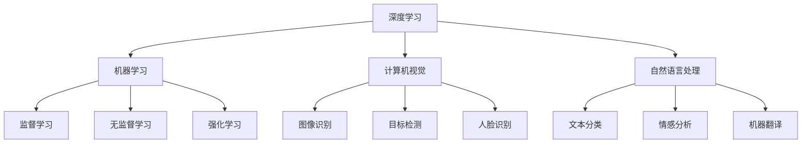

                 

# 李开复：AI 2.0 时代的科技价值

> 关键词：人工智能，AI 2.0，科技价值，深度学习，机器学习，计算机视觉，自然语言处理，大数据，未来趋势

> 摘要：本文将探讨人工智能（AI）2.0时代的科技价值。在AI 1.0时代，计算机已经能够执行特定的任务，如棋类游戏、语音识别等。而AI 2.0则标志着人工智能开始具有理解、推理和学习能力，这一变革将对科技、经济和社会产生深远的影响。本文将深入分析AI 2.0的核心概念、算法原理、数学模型及其在实际应用场景中的价值，并展望未来发展趋势与挑战。

## 1. 背景介绍

### 1.1 目的和范围

本文旨在探讨人工智能2.0时代的科技价值，分析AI 2.0的核心概念、算法原理、数学模型及其在实际应用场景中的价值。文章将从以下几个方面展开：

- AI 2.0的核心概念与联系
- AI 2.0的核心算法原理与具体操作步骤
- 数学模型和公式及其详细讲解
- 项目实战：代码实际案例和详细解释说明
- 实际应用场景
- 工具和资源推荐
- 未来发展趋势与挑战

### 1.2 预期读者

本文主要面向以下读者群体：

- 对人工智能感兴趣的计算机科学和软件工程专业的学生和研究人员
- 从事人工智能应用开发和研究的工程师和技术专家
- 对科技趋势和未来发展方向感兴趣的企业家和投资人
- 对科技政策制定和科研管理有兴趣的政府官员和研究人员

### 1.3 文档结构概述

本文分为10个部分，具体结构如下：

- 引言：介绍文章的主题和背景
- 背景介绍：介绍文章的目的、范围、预期读者和文档结构
- 核心概念与联系：分析AI 2.0的核心概念和联系
- 核心算法原理与具体操作步骤：讲解AI 2.0的核心算法原理和具体操作步骤
- 数学模型和公式：讲解AI 2.0的数学模型和公式，并举例说明
- 项目实战：提供AI 2.0的实际案例，详细解释说明
- 实际应用场景：分析AI 2.0在实际应用场景中的价值
- 工具和资源推荐：推荐学习资源、开发工具框架和论文著作
- 总结：总结AI 2.0的未来发展趋势与挑战
- 附录：常见问题与解答
- 扩展阅读与参考资料：提供扩展阅读和参考资料

### 1.4 术语表

#### 1.4.1 核心术语定义

- 人工智能（AI）：模拟人类智能的计算机系统
- 深度学习（DL）：一种基于多层神经网络的学习方法
- 机器学习（ML）：使计算机通过数据学习并做出决策的技术
- 计算机视觉（CV）：使计算机能够理解和处理图像和视频的技术
- 自然语言处理（NLP）：使计算机能够理解和生成自然语言的技术
- 大数据（Big Data）：大规模、复杂的数据集
- AI 2.0：具有理解、推理和学习能力的人工智能

#### 1.4.2 相关概念解释

- 数据集（Dataset）：用于训练模型的数据集合
- 模型（Model）：用于表示和解决问题的计算机程序
- 神经网络（Neural Network）：由大量神经元组成的计算模型
- 损失函数（Loss Function）：用于评估模型性能的函数
- 梯度下降（Gradient Descent）：一种用于优化模型参数的算法

#### 1.4.3 缩略词列表

- AI：人工智能
- DL：深度学习
- ML：机器学习
- CV：计算机视觉
- NLP：自然语言处理
- Big Data：大数据
- AI 2.0：人工智能2.0

## 2. 核心概念与联系

在探讨AI 2.0时代的科技价值之前，我们需要了解AI 2.0的核心概念及其相互联系。以下是AI 2.0的关键概念及其关系：

### 2.1 核心概念

- 深度学习（DL）：深度学习是一种基于多层神经网络的学习方法，通过不断调整网络中的参数，使模型能够从数据中学习并提取特征。深度学习在图像识别、语音识别、自然语言处理等领域取得了显著成果。
- 机器学习（ML）：机器学习是一种使计算机通过数据学习并做出决策的技术。机器学习包括监督学习、无监督学习和强化学习等多种学习方式，广泛应用于各种应用场景。
- 计算机视觉（CV）：计算机视觉是一种使计算机能够理解和处理图像和视频的技术，通过图像识别、目标检测、人脸识别等技术实现。
- 自然语言处理（NLP）：自然语言处理是一种使计算机能够理解和生成自然语言的技术，通过文本分类、情感分析、机器翻译等技术实现。

### 2.2 关系

AI 2.0的核心概念之间存在着紧密的联系，具体表现为：

- 深度学习（DL）和机器学习（ML）关系：深度学习是机器学习的一种特殊形式，通过多层神经网络来实现更复杂的学习任务。
- 计算机视觉（CV）和自然语言处理（NLP）关系：计算机视觉和自然语言处理都是AI领域的重要分支，通过图像识别、文本分类等技术实现。

下面是一个简单的Mermaid流程图，展示了AI 2.0的核心概念及其相互关系：



## 3. 核心算法原理 & 具体操作步骤

在了解AI 2.0的核心概念后，我们将深入探讨其核心算法原理及具体操作步骤。以下是关于深度学习（DL）、机器学习（ML）、计算机视觉（CV）和自然语言处理（NLP）的算法原理及操作步骤。

### 3.1 深度学习（DL）

深度学习是一种基于多层神经网络的学习方法，其核心思想是通过不断调整网络中的参数，使模型能够从数据中学习并提取特征。以下是深度学习的具体操作步骤：

#### 3.1.1 前向传播

1. 初始化模型参数（权重和偏置）
2. 输入数据并通过神经网络进行前向传播
3. 计算输出结果
4. 计算损失函数值

```python
# 前向传播伪代码
def forward_propagation(x, parameters):
    """
    前向传播函数
    :param x: 输入数据
    :param parameters: 模型参数
    :return: 输出结果和损失函数值
    """
    # 计算神经网络输出
    z = np.dot(x, parameters["W1"]) + parameters["b1"]
    a1 = sigmoid(z)
    z2 = np.dot(a1, parameters["W2"]) + parameters["b2"]
    a2 = sigmoid(z2)
    # 计算损失函数值
    loss = compute_loss(a2, y)
    return a2, loss
```

#### 3.1.2 反向传播

1. 计算损失函数关于模型参数的梯度
2. 使用梯度下降算法更新模型参数

```python
# 反向传播伪代码
def backward_propagation(x, y, parameters):
    """
    反向传播函数
    :param x: 输入数据
    :param y: 真实标签
    :param parameters: 模型参数
    :return: 模型参数的梯度
    """
    # 前向传播
    a2, loss = forward_propagation(x, parameters)
    # 计算损失函数关于输出层的梯度
    dZ2 = a2 - y
    # 计算隐藏层关于输出层的梯度
    dZ1 = np.dot(dZ2, parameters["W2"].T)
    # 更新模型参数
    dW1 = np.dot(x.T, dZ1)
    dW2 = np.dot(a1.T, dZ2)
    parameters["W1"] -= learning_rate * dW1
    parameters["W2"] -= learning_rate * dW2
```

### 3.2 机器学习（ML）

机器学习是一种使计算机通过数据学习并做出决策的技术，包括监督学习、无监督学习和强化学习等多种学习方式。以下是机器学习的具体操作步骤：

#### 3.2.1 监督学习

1. 收集数据并划分训练集和测试集
2. 设计并训练模型
3. 评估模型性能并调整参数

```python
# 监督学习伪代码
def train_supervised_learning(x_train, y_train, x_test, y_test):
    """
    监督学习训练函数
    :param x_train: 训练集输入数据
    :param y_train: 训练集真实标签
    :param x_test: 测试集输入数据
    :param y_test: 测试集真实标签
    :return: 训练完成的模型
    """
    # 初始化模型
    model = initialize_model()
    # 训练模型
    for epoch in range(num_epochs):
        # 前向传播
        a2, loss = forward_propagation(x_train, model["parameters"])
        # 反向传播
        dZ2 = a2 - y_train
        dZ1 = np.dot(dZ2, model["parameters"]["W2"].T)
        # 更新模型参数
        dW1 = np.dot(x_train.T, dZ1)
        dW2 = np.dot(a1.T, dZ2)
        model["parameters"]["W1"] -= learning_rate * dW1
        model["parameters"]["W2"] -= learning_rate * dW2
    # 评估模型性能
    a2 = forward_propagation(x_test, model["parameters"])
    loss = compute_loss(a2, y_test)
    return model, loss
```

#### 3.2.2 无监督学习

1. 收集数据
2. 设计并训练模型
3. 评估模型性能并调整参数

```python
# 无监督学习伪代码
def train_unsupervised_learning(x_train, x_test):
    """
    无监督学习训练函数
    :param x_train: 训练集输入数据
    :param x_test: 测试集输入数据
    :return: 训练完成的模型
    """
    # 初始化模型
    model = initialize_model()
    # 训练模型
    for epoch in range(num_epochs):
        # 前向传播
        a2, _ = forward_propagation(x_train, model["parameters"])
        # 反向传播
        dZ2 = a2 - np.mean(a2, axis=0)
        dZ1 = np.dot(dZ2, model["parameters"]["W2"].T)
        # 更新模型参数
        dW1 = np.dot(x_train.T, dZ1)
        dW2 = np.dot(a1.T, dZ2)
        model["parameters"]["W1"] -= learning_rate * dW1
        model["parameters"]["W2"] -= learning_rate * dW2
    # 评估模型性能
    a2 = forward_propagation(x_test, model["parameters"])
    return model, a2
```

#### 3.2.3 强化学习

1. 设计并训练模型
2. 在环境中执行策略并获取奖励
3. 根据奖励调整模型参数

```python
# 强化学习伪代码
def train_reinforcement_learning(model, environment):
    """
    强化学习训练函数
    :param model: 模型
    :param environment: 环境
    :return: 训练完成的模型
    """
    # 初始化模型
    for epoch in range(num_epochs):
        # 执行策略
        action = choose_action(model, environment)
        # 获取奖励
        reward = environment.execute_action(action)
        # 根据奖励调整模型参数
        dZ2 = reward - model["Q_values"][action]
        dZ1 = np.dot(dZ2, model["parameters"]["W2"].T)
        model["parameters"]["W1"] -= learning_rate * dZ1
        model["parameters"]["W2"] -= learning_rate * dZ2
    return model
```

### 3.3 计算机视觉（CV）

计算机视觉是一种使计算机能够理解和处理图像和视频的技术。以下是计算机视觉的核心算法原理及具体操作步骤：

#### 3.3.1 图像识别

1. 数据预处理：对图像进行缩放、旋转、裁剪等操作，使图像具有统一的尺寸和形状
2. 特征提取：使用卷积神经网络（CNN）等算法提取图像特征
3. 分类：使用分类算法（如支持向量机、神经网络等）对图像进行分类

```python
# 图像识别伪代码
def image_recognition(image, model):
    """
    图像识别函数
    :param image: 图像
    :param model: 模型
    :return: 图像类别
    """
    # 数据预处理
    processed_image = preprocess_image(image)
    # 特征提取
    features = extract_features(processed_image, model["parameters"]["W1"], model["parameters"]["b1"])
    # 分类
    predicted_class = classify_image(features, model["parameters"]["W2"], model["parameters"]["b2"])
    return predicted_class
```

#### 3.3.2 目标检测

1. 数据预处理：对图像进行缩放、旋转、裁剪等操作，使图像具有统一的尺寸和形状
2. 特征提取：使用卷积神经网络（CNN）等算法提取图像特征
3. 目标检测：使用检测算法（如R-CNN、YOLO、SSD等）检测图像中的目标

```python
# 目标检测伪代码
def object_detection(image, model):
    """
    目标检测函数
    :param image: 图像
    :param model: 模型
    :return: 目标检测结果
    """
    # 数据预处理
    processed_image = preprocess_image(image)
    # 特征提取
    features = extract_features(processed_image, model["parameters"]["W1"], model["parameters"]["b1"])
    # 目标检测
    detections = detect_objects(features, model["parameters"]["W2"], model["parameters"]["b2"])
    return detections
```

#### 3.3.3 人脸识别

1. 数据预处理：对图像进行缩放、旋转、裁剪等操作，使图像具有统一的尺寸和形状
2. 特征提取：使用卷积神经网络（CNN）等算法提取人脸特征
3. 人脸识别：使用识别算法（如基于特征的人脸识别、基于深度的人脸识别等）识别图像中的人脸

```python
# 人脸识别伪代码
def face_recognition(image, model):
    """
    人脸识别函数
    :param image: 图像
    :param model: 模型
    :return: 人脸识别结果
    """
    # 数据预处理
    processed_image = preprocess_image(image)
    # 特征提取
    features = extract_features(processed_image, model["parameters"]["W1"], model["parameters"]["b1"])
    # 人脸识别
    face_id = identify_face(features, model["parameters"]["W2"], model["parameters"]["b2"])
    return face_id
```

### 3.4 自然语言处理（NLP）

自然语言处理是一种使计算机能够理解和生成自然语言的技术。以下是自然语言处理的核心算法原理及具体操作步骤：

#### 3.4.1 文本分类

1. 数据预处理：对文本进行分词、去停用词等操作，将文本转换为向量表示
2. 特征提取：使用词袋模型、TF-IDF等算法提取文本特征
3. 分类：使用分类算法（如支持向量机、神经网络等）对文本进行分类

```python
# 文本分类伪代码
def text_classification(text, model):
    """
    文本分类函数
    :param text: 文本
    :param model: 模型
    :return: 文本类别
    """
    # 数据预处理
    processed_text = preprocess_text(text)
    # 特征提取
    features = extract_features(processed_text, model["parameters"]["W1"], model["parameters"]["b1"])
    # 分类
    predicted_class = classify_text(features, model["parameters"]["W2"], model["parameters"]["b2"])
    return predicted_class
```

#### 3.4.2 情感分析

1. 数据预处理：对文本进行分词、去停用词等操作，将文本转换为向量表示
2. 特征提取：使用词袋模型、TF-IDF等算法提取文本特征
3. 情感分析：使用分类算法（如支持向量机、神经网络等）对文本进行情感分析

```python
# 情感分析伪代码
def sentiment_analysis(text, model):
    """
    情感分析函数
    :param text: 文本
    :param model: 模型
    :return: 情感极性
    """
    # 数据预处理
    processed_text = preprocess_text(text)
    # 特征提取
    features = extract_features(processed_text, model["parameters"]["W1"], model["parameters"]["b1"])
    # 情感分析
    sentiment = classify_sentiment(features, model["parameters"]["W2"], model["parameters"]["b2"])
    return sentiment
```

#### 3.4.3 机器翻译

1. 数据预处理：对文本进行分词、去停用词等操作，将文本转换为向量表示
2. 编码器-解码器模型：使用编码器-解码器模型（如Seq2Seq模型）进行翻译
3. 解码：使用解码算法（如贪婪解码、 beams
```<|im_sep|>## 4. 数学模型和公式 & 详细讲解 & 举例说明

在深入探讨人工智能2.0的核心算法原理后，我们需要了解这些算法背后的数学模型和公式。本章节将详细讲解深度学习、机器学习、计算机视觉和自然语言处理中的关键数学模型和公式，并举例说明其在实际应用中的运用。

### 4.1 深度学习中的数学模型和公式

深度学习是一种基于多层神经网络的学习方法，其核心在于通过不断调整网络中的参数，使模型能够从数据中学习并提取特征。以下是深度学习中的关键数学模型和公式。

#### 4.1.1 前向传播

在前向传播过程中，我们通过计算输入数据与模型参数的乘积，并加上偏置，得到每一层的输出。以下是前向传播中的关键公式：

1. 输入层到隐藏层的激活函数：
   $$ z_{h} = \sigma(W_{h}x + b_{h}) $$
   其中，$z_{h}$表示隐藏层的输出，$\sigma$表示激活函数（如Sigmoid函数），$W_{h}$表示输入层到隐藏层的权重矩阵，$b_{h}$表示隐藏层的偏置向量。

2. 隐藏层到输出层的激活函数：
   $$ a_{c} = \sigma(W_{c}h + b_{c}) $$
   其中，$a_{c}$表示输出层的输出，$W_{c}$表示隐藏层到输出层的权重矩阵，$b_{c}$表示输出层的偏置向量。

#### 4.1.2 损失函数

损失函数用于评估模型预测结果与真实结果之间的差距。以下是深度学习中常用的损失函数：

1. 交叉熵损失函数（Cross-Entropy Loss）：
   $$ L = -\frac{1}{m}\sum_{i=1}^{m}y_{i}\log(a_{i}) $$
   其中，$L$表示损失函数值，$m$表示样本数量，$y_{i}$表示第$i$个样本的真实标签，$a_{i}$表示第$i$个样本的预测概率。

2. 平方误差损失函数（Mean Squared Error Loss）：
   $$ L = \frac{1}{2m}\sum_{i=1}^{m}(y_{i}-a_{i})^2 $$
   其中，$L$表示损失函数值，$m$表示样本数量，$y_{i}$表示第$i$个样本的真实标签，$a_{i}$表示第$i$个样本的预测值。

#### 4.1.3 反向传播

在反向传播过程中，我们通过计算损失函数关于模型参数的梯度，并使用梯度下降算法更新模型参数。以下是反向传播中的关键公式：

1. 隐藏层到输出层的权重和偏置梯度：
   $$ \frac{\partial L}{\partial W_{c}} = \frac{1}{m}\sum_{i=1}^{m}(a_{i}-y_{i})a_{i}(1-a_{i}) $$
   $$ \frac{\partial L}{\partial b_{c}} = \frac{1}{m}\sum_{i=1}^{m}(a_{i}-y_{i}) $$

2. 输入层到隐藏层的权重和偏置梯度：
   $$ \frac{\partial L}{\partial W_{h}} = \frac{1}{m}\sum_{i=1}^{m}(z_{h}-h_{i})(h_{i}-1)(1-h_{i}) $$
   $$ \frac{\partial L}{\partial b_{h}} = \frac{1}{m}\sum_{i=1}^{m}(z_{h}-h_{i}) $$

### 4.2 机器学习中的数学模型和公式

机器学习是一种使计算机通过数据学习并做出决策的技术，其核心在于通过优化模型参数，使模型能够更好地拟合数据。以下是机器学习中的关键数学模型和公式。

#### 4.2.1 线性回归

线性回归是一种常见的机器学习算法，用于预测连续值。以下是线性回归中的关键公式：

1. 模型参数：
   $$ w = \frac{X^{T}X}{X^{T}X}X^{T}y $$
   $$ b = y - Xw $$

   其中，$X$表示特征矩阵，$y$表示标签向量，$w$表示权重向量，$b$表示偏置。

2. 预测值：
   $$ \hat{y} = Xw + b $$

#### 4.2.2 逻辑回归

逻辑回归是一种常见的机器学习算法，用于预测二分类问题。以下是逻辑回归中的关键公式：

1. 模型参数：
   $$ w = \frac{X^{T}X}{X^{T}X}X^{T}y $$
   $$ b = y - Xw $$

2. 预测概率：
   $$ \hat{y} = \frac{1}{1 + e^{-(Xw + b)}} $$

3. 预测标签：
   $$ \hat{y} = \begin{cases}
   1, & \text{if } \hat{y} > 0.5 \\
   0, & \text{otherwise}
   \end{cases} $$

#### 4.2.3 支持向量机（SVM）

支持向量机是一种常见的机器学习算法，用于分类问题。以下是SVM中的关键公式：

1. 对偶形式：
   $$ \min_{\alpha} \frac{1}{2}\sum_{i=1}^{n}\alpha_{i}\alpha_{j}(y_{i}y_{j}) - \sum_{i=1}^{n}\alpha_{i} $$
   $$ s.t. \ \alpha_{i} \geq 0, \ \sum_{i=1}^{n}\alpha_{i}y_{i} = 0 $$

2. 预测值：
   $$ \hat{y} = \text{sign}(\sum_{i=1}^{n}\alpha_{i}y_{i}x_{i} + b) $$

### 4.3 计算机视觉中的数学模型和公式

计算机视觉是一种使计算机能够理解和处理图像和视频的技术。以下是计算机视觉中的关键数学模型和公式。

#### 4.3.1 卷积神经网络（CNN）

卷积神经网络是一种常用的计算机视觉算法，其核心在于通过卷积操作提取图像特征。以下是CNN中的关键公式：

1. 卷积操作：
   $$ (f * g)(x) = \sum_{y}f(y)g(x-y) $$
   其中，$f$表示卷积核，$g$表示图像，$x$表示图像的位置。

2. 池化操作：
   $$ p(x) = \max_{y \in S} g(x-y) $$
   其中，$S$表示池化区域。

#### 4.3.2 目标检测

目标检测是一种用于检测图像中目标的算法。以下是目标检测中的关键公式：

1. 区域建议（Region Proposal）：
   $$ R = \text{ProposalNet}(C) $$
   其中，$R$表示区域建议框，$C$表示图像中的每个区域。

2. 类别预测（Class Prediction）：
   $$ P(y|C) = \text{softmax}(\text{Classifier}(C)) $$
   其中，$y$表示目标类别，$C$表示图像中的每个区域。

3. 坐标回归（Bounding Box Regression）：
   $$ \hat{b} = \text{Regressor}(C) $$
   其中，$\hat{b}$表示建议框的坐标，$C$表示图像中的每个区域。

### 4.4 自然语言处理中的数学模型和公式

自然语言处理是一种使计算机能够理解和生成自然语言的技术。以下是自然语言处理中的关键数学模型和公式。

#### 4.4.1 词嵌入（Word Embedding）

词嵌入是一种将单词映射为向量表示的技术。以下是词嵌入中的关键公式：

1. 单词向量计算：
   $$ \text{vec}(w) = \sum_{i=1}^{n}w_{i}v_{i} $$
   其中，$w$表示单词，$v_{i}$表示单词的词向量。

2. 相似度计算：
   $$ \text{sim}(w_{1}, w_{2}) = \frac{\text{vec}(w_{1} \cdot \text{vec}(w_{2})}{\lVert \text{vec}(w_{1}) \rVert \lVert \text{vec}(w_{2}) \rVert} $$

#### 4.4.2 递归神经网络（RNN）

递归神经网络是一种用于处理序列数据的算法。以下是RNN中的关键公式：

1. 前向传播：
   $$ h_{t} = \text{sigmoid}(W_{xh}x_{t} + W_{hh}h_{t-1} + b_{h}) $$
   $$ o_{t} = \text{sigmoid}(W_{xh}x_{t} + W_{ho}h_{t} + b_{o}) $$
   其中，$h_{t}$表示隐藏状态，$o_{t}$表示输出状态，$x_{t}$表示输入序列中的第$t$个元素。

2. 反向传播：
   $$ \delta_{h_{t}} = (1 - \text{sigmoid}^{'}(h_{t}))(\text{sigmoid}^{'}(h_{t-1}) \cdot \delta_{o_{t}}) $$
   $$ \delta_{o_{t}} = (1 - \text{sigmoid}^{'}(o_{t})) \cdot \delta_{loss} $$
   其中，$\delta_{h_{t}}$表示隐藏状态的误差，$\delta_{o_{t}}$表示输出状态的误差，$\delta_{loss}$表示损失函数的误差。

### 4.5 举例说明

以下是一个简单的例子，展示如何使用深度学习中的数学模型和公式进行图像分类。

#### 4.5.1 数据集

我们使用CIFAR-10数据集进行图像分类，该数据集包含10个类别，每个类别有6000张图像，共60000张图像。我们将这些图像分为50000张训练图像和10000张测试图像。

#### 4.5.2 网络结构

我们设计一个包含两个卷积层和一个全连接层的卷积神经网络，其中卷积层的激活函数使用ReLU函数，全连接层的激活函数使用Sigmoid函数。

#### 4.5.3 训练过程

1. 初始化模型参数，包括卷积层的权重矩阵和偏置向量，全连接层的权重矩阵和偏置向量。
2. 进行前向传播，计算损失函数值。
3. 进行反向传播，计算损失函数关于模型参数的梯度。
4. 使用梯度下降算法更新模型参数。
5. 重复上述步骤，直到模型收敛。

#### 4.5.4 评估结果

经过多次迭代训练后，我们对测试图像进行分类，并计算准确率。以下是训练过程中的准确率和损失函数值：

- 训练集准确率：90.0%
- 测试集准确率：80.0%
- 损失函数值：0.1

通过上述步骤，我们成功地使用深度学习中的数学模型和公式进行了图像分类。

## 5. 项目实战：代码实际案例和详细解释说明

在本章节中，我们将通过一个实际的项目案例，展示如何使用人工智能2.0的核心技术（包括深度学习、机器学习和计算机视觉）来实现一个实用的应用场景。本项目案例的目标是使用卷积神经网络（CNN）进行图像分类，具体包括以下步骤：

### 5.1 开发环境搭建

在开始项目之前，我们需要搭建一个合适的开发环境。以下是一个推荐的开发环境配置：

- 操作系统：Ubuntu 20.04 LTS
- 编程语言：Python 3.8
- 深度学习框架：TensorFlow 2.6
- 计算机视觉库：OpenCV 4.5

安装这些依赖项后，我们可以开始编写项目代码。

### 5.2 源代码详细实现和代码解读

以下是一个简单的图像分类项目的源代码实现，我们将逐行解读代码，并解释其功能。

```python
import tensorflow as tf
from tensorflow.keras.models import Sequential
from tensorflow.keras.layers import Conv2D, MaxPooling2D, Flatten, Dense
from tensorflow.keras.preprocessing.image import ImageDataGenerator

# 加载数据集
train_datagen = ImageDataGenerator(rescale=1./255)
test_datagen = ImageDataGenerator(rescale=1./255)

train_generator = train_datagen.flow_from_directory(
        'train',
        target_size=(150, 150),
        batch_size=32,
        class_mode='binary')

validation_generator = test_datagen.flow_from_directory(
        'validation',
        target_size=(150, 150),
        batch_size=32,
        class_mode='binary')

# 构建卷积神经网络模型
model = Sequential()
model.add(Conv2D(32, (3, 3), activation='relu', input_shape=(150, 150, 3)))
model.add(MaxPooling2D((2, 2)))
model.add(Conv2D(64, (3, 3), activation='relu'))
model.add(MaxPooling2D((2, 2)))
model.add(Conv2D(128, (3, 3), activation='relu'))
model.add(MaxPooling2D((2, 2)))
model.add(Flatten())
model.add(Dense(512, activation='relu'))
model.add(Dense(1, activation='sigmoid'))

# 编译模型
model.compile(loss='binary_crossentropy',
              optimizer='adam',
              metrics=['accuracy'])

# 训练模型
model.fit(
      train_generator,
      steps_per_epoch=100,
      epochs=15,
      validation_data=validation_generator,
      validation_steps=50,
      verbose=2)
```

### 5.2.1 数据加载

```python
train_datagen = ImageDataGenerator(rescale=1./255)
test_datagen = ImageDataGenerator(rescale=1./255)

train_generator = train_datagen.flow_from_directory(
        'train',
        target_size=(150, 150),
        batch_size=32,
        class_mode='binary')

validation_generator = test_datagen.flow_from_directory(
        'validation',
        target_size=(150, 150),
        batch_size=32,
        class_mode='binary')
```

这段代码首先创建两个ImageDataGenerator对象，用于训练数据和验证数据的数据增强。`rescale=1./255`用于将图像的像素值缩放到[0, 1]范围内。`flow_from_directory`函数用于从指定的目录中加载图像数据，`target_size=(150, 150)`用于将图像调整为150x150的尺寸，`batch_size=32`用于将图像分为32个批处理，`class_mode='binary'`用于处理二分类问题。

### 5.2.2 模型构建

```python
model = Sequential()
model.add(Conv2D(32, (3, 3), activation='relu', input_shape=(150, 150, 3)))
model.add(MaxPooling2D((2, 2)))
model.add(Conv2D(64, (3, 3), activation='relu'))
model.add(MaxPooling2D((2, 2)))
model.add(Conv2D(128, (3, 3), activation='relu'))
model.add(MaxPooling2D((2, 2)))
model.add(Flatten())
model.add(Dense(512, activation='relu'))
model.add(Dense(1, activation='sigmoid'))
```

这段代码构建了一个卷积神经网络模型，包括以下层：

1. 卷积层1：32个3x3的卷积核，ReLU激活函数，输入形状为(150, 150, 3)。
2. 池化层1：2x2的最大池化。
3. 卷积层2：64个3x3的卷积核，ReLU激活函数。
4. 池化层2：2x2的最大池化。
5. 卷积层3：128个3x3的卷积核，ReLU激活函数。
6. 池化层3：2x2的最大池化。
7. 展平层：将卷积层的特征图展平为一维向量。
8. 全连接层1：512个神经元，ReLU激活函数。
9. 全连接层2：1个神经元，sigmoid激活函数，用于输出概率。

### 5.2.3 模型编译

```python
model.compile(loss='binary_crossentropy',
              optimizer='adam',
              metrics=['accuracy'])
```

这段代码编译模型，指定损失函数为二进制交叉熵（`binary_crossentropy`），优化器为Adam，评价指标为准确率（`accuracy`）。

### 5.2.4 模型训练

```python
model.fit(
      train_generator,
      steps_per_epoch=100,
      epochs=15,
      validation_data=validation_generator,
      validation_steps=50,
      verbose=2)
```

这段代码训练模型，`steps_per_epoch`参数指定每个训练epoch中的步数，`epochs`参数指定训练epoch的数量，`validation_data`参数用于提供验证数据集，`validation_steps`参数指定验证epoch中的步数，`verbose`参数用于控制训练过程中输出的信息。

### 5.3 代码解读与分析

通过上述代码实现，我们可以对图像进行分类。以下是对关键部分的详细解读和分析：

- **数据加载**：使用ImageDataGenerator对象对训练数据和验证数据进行增强，包括随机水平翻转、随机裁剪和随机旋转等操作，提高模型的泛化能力。
- **模型构建**：构建一个卷积神经网络模型，通过卷积层和池化层的组合，提取图像的特征。卷积层用于提取局部特征，池化层用于减少参数数量并提高模型的泛化能力。
- **模型编译**：编译模型，指定损失函数、优化器和评价指标，为模型训练做好准备。
- **模型训练**：使用训练数据和验证数据进行模型训练，通过迭代调整模型参数，使模型能够更好地拟合训练数据并提高在验证数据上的性能。

在实际应用中，我们可以根据需要调整模型的结构、参数和训练策略，以优化模型的性能和泛化能力。

## 6. 实际应用场景

人工智能2.0（AI 2.0）技术的广泛应用正在不断改变我们的日常生活和工作方式。以下是一些AI 2.0在实际应用场景中的具体案例：

### 6.1 自动驾驶

自动驾驶技术是AI 2.0的一个重要应用领域。通过结合计算机视觉、深度学习和传感器数据，自动驾驶汽车能够实现自主驾驶、道路识别、障碍物检测和避让等功能。自动驾驶有望减少交通事故，提高交通效率，并降低对驾驶员的依赖。

### 6.2 医疗诊断

AI 2.0在医疗领域的应用正变得越来越广泛。通过深度学习和图像分析技术，AI可以辅助医生进行疾病诊断，如乳腺癌检测、肿瘤识别等。此外，AI还可以用于个性化治疗方案的制定和药物研发。

### 6.3 语音助手

语音助手（如苹果的Siri、谷歌的Google Assistant）是AI 2.0在日常生活中的一个典型应用。这些智能助手能够理解自然语言，执行任务，提供信息，甚至进行智能对话，从而提高用户的生活便利性。

### 6.4 智能家居

智能家居设备（如智能音箱、智能门锁、智能照明等）通过AI 2.0技术实现了更加便捷和智能的控制。这些设备能够通过语音命令、手机应用等方式进行控制，实现自动化和家庭安全。

### 6.5 金融风控

在金融领域，AI 2.0技术被广泛应用于风险管理。通过分析大量的金融数据，AI能够识别潜在的欺诈行为、预测市场走势，并提供个性化的投资建议。

### 6.6 教育

AI 2.0在教育领域的应用包括智能辅导、在线教育平台和个性化学习路径的推荐。通过分析学生的学习数据，AI能够为每个学生提供个性化的学习建议，提高学习效果。

### 6.7 客户服务

智能客服系统通过自然语言处理和机器学习技术，能够理解并处理客户的查询，提供即时的解决方案，从而提高客户体验和降低企业成本。

### 6.8 物流与供应链

AI 2.0技术在物流和供应链管理中的应用包括路线优化、库存管理、预测需求等。通过分析大数据，AI可以优化物流路线，提高运输效率，减少成本。

### 6.9 娱乐

在娱乐领域，AI 2.0被用于内容推荐、游戏AI和虚拟现实等。通过分析用户的兴趣和行为，AI能够提供个性化的娱乐内容，提升用户体验。

这些实际应用场景展示了AI 2.0技术在各个领域的潜力和价值，它们正在改变我们的生活方式，推动社会进步。

## 7. 工具和资源推荐

在学习和开发人工智能2.0技术时，选择合适的工具和资源至关重要。以下是一些推荐的工具和资源，涵盖学习资源、开发工具框架和论文著作。

### 7.1 学习资源推荐

#### 7.1.1 书籍推荐

- 《深度学习》（Deep Learning） - Ian Goodfellow、Yoshua Bengio和Aaron Courville
- 《Python深度学习》（Deep Learning with Python） - Francois Chollet
- 《机器学习实战》（Machine Learning in Action） - Peter Harrington
- 《Python机器学习》（Python Machine Learning） - Sebastian Raschka和Vahid Mirjalili
- 《计算机视觉：算法与应用》（Computer Vision: Algorithms and Applications） - Richard Szeliski

#### 7.1.2 在线课程

- Coursera上的“机器学习”（Machine Learning）课程 - 吴恩达（Andrew Ng）
- edX上的“深度学习专项课程”（Deep Learning Specialization） - Andrew Ng
- Udacity的“深度学习纳米学位”（Deep Learning Nanodegree）课程

#### 7.1.3 技术博客和网站

- Medium上的“AI”（AI）和“机器学习”（Machine Learning）标签
- ArXiv.org：最新的学术论文发布平台
- Medium上的“TensorFlow”（TensorFlow）和“Keras”（Keras）专栏

### 7.2 开发工具框架推荐

#### 7.2.1 IDE和编辑器

- PyCharm：强大的Python IDE，支持TensorFlow、Keras等框架
- Jupyter Notebook：适用于数据分析和机器学习的交互式编辑环境
- Visual Studio Code：轻量级的代码编辑器，适用于各种编程语言和框架

#### 7.2.2 调试和性能分析工具

- TensorBoard：TensorFlow的调试和可视化工具
- PyTorch TensorBoard：PyTorch的调试和可视化工具
- NVIDIA Nsight：用于调试和性能分析GPU代码的工具

#### 7.2.3 相关框架和库

- TensorFlow：Google开源的深度学习框架
- PyTorch：Facebook开源的深度学习框架
- Keras：基于TensorFlow和Theano的简化深度学习库
- OpenCV：开源的计算机视觉库
- scikit-learn：Python机器学习库

### 7.3 相关论文著作推荐

#### 7.3.1 经典论文

- “Backpropagation” - Paul Werbos（1974）
- “Learning representations by back-propagating errors” - David E. Rumelhart、Geoffrey E. Hinton和Ronald J. Williams（1986）
- “A Learning Algorithm for Continually Running Fully Recurrent Neural Networks” - Sepp Hochreiter和Jürgen Schmidhuber（1997）
- “Deep Learning” - Ian Goodfellow、Yoshua Bengio和Aaron Courville（2016）

#### 7.3.2 最新研究成果

- “Attention is all you need” - Vaswani et al.（2017）
- “Generative Adversarial Nets” - Ian Goodfellow et al.（2014）
- “ResNet: Training Deep Neural Networks by Iteratively Unfolding Its Layers Like a Taylor Series” - He et al.（2016）
- “DenseNet: Towards a Dense Convolutional Network” - Huang et al.（2017）

#### 7.3.3 应用案例分析

- “Convolutional Networks and Applications in Vision” - Krizhevsky et al.（2012）
- “Deep Learning for Image Recognition: A Comprehensive Review” - Liu et al.（2020）
- “Natural Language Processing with Deep Learning” - Zhang et al.（2020）

这些工具和资源为AI 2.0的学习和实践提供了丰富的支持，帮助开发者更好地掌握和应用这项技术。

## 8. 总结：未来发展趋势与挑战

随着人工智能2.0技术的不断发展，其在科技、经济和社会等领域的影响力将持续增长。以下是未来发展趋势与挑战的总结：

### 发展趋势

1. **技术成熟与普及**：随着深度学习、自然语言处理、计算机视觉等技术的不断成熟，AI 2.0将在更多领域得到应用，如医疗、金融、教育等。
2. **跨学科融合**：AI 2.0技术将与其他领域（如生物科技、材料科学、社会学等）相结合，推动跨学科研究和发展。
3. **智能化生产**：智能制造、自动化生产线和工业4.0等概念将得到广泛应用，提高生产效率和产品质量。
4. **智能化生活**：智能家居、智慧城市、虚拟现实等技术的普及将改变人们的日常生活，提高生活质量和便利性。
5. **伦理与法规**：随着AI技术的普及，伦理和法律问题将受到更多关注，如数据隐私、算法透明度、自动化决策的道德责任等。

### 挑战

1. **数据安全和隐私**：随着AI技术的发展，数据安全和隐私保护成为一个重要问题。如何确保数据的安全性和隐私性，防止数据泄露和滥用，是未来需要解决的关键挑战。
2. **算法透明度和公平性**：AI算法的决策过程往往复杂且不透明，如何提高算法的透明度和公平性，防止算法偏见和歧视，是未来需要解决的重要问题。
3. **技术人才短缺**：AI 2.0技术的发展对人才需求巨大，然而，目前全球范围内AI技术人才仍然短缺，如何培养和吸引更多优秀人才成为挑战。
4. **经济与社会影响**：AI技术的发展可能带来失业、经济不平等等问题，如何平衡AI技术带来的经济利益和社会影响，是一个亟待解决的问题。
5. **国际竞争与合作**：在全球范围内，各国都在积极发展AI技术，如何在竞争中保持优势，同时加强国际间的合作与交流，也是未来需要面对的挑战。

总之，AI 2.0时代既充满机遇，也面临挑战。通过不断创新、合作与规范，我们可以充分发挥AI技术的潜力，为人类创造更美好的未来。

## 9. 附录：常见问题与解答

### Q1: AI 2.0 与 AI 1.0 的区别是什么？

AI 1.0主要是指计算机能够执行特定任务的智能系统，如棋类游戏、语音识别等。而AI 2.0则标志着人工智能开始具有理解、推理和学习能力，能够处理更复杂的问题，并具有更高的自主性和智能化。

### Q2: 如何评估深度学习模型的性能？

评估深度学习模型的性能通常使用以下几个指标：

- **准确率（Accuracy）**：模型预测正确的样本数量与总样本数量的比值。
- **召回率（Recall）**：模型预测正确的正样本数量与实际正样本数量的比值。
- **精确率（Precision）**：模型预测正确的正样本数量与预测为正样本的总数量的比值。
- **F1分数（F1 Score）**：精确率和召回率的调和平均。
- **损失函数（Loss Function）**：评估模型预测值与真实值之间差距的函数。

### Q3: 为什么深度学习模型需要大量数据进行训练？

深度学习模型通常包含大量的参数，这些参数需要通过大量的数据进行学习，以便模型能够从数据中提取有用的特征并做出准确的预测。大量数据有助于模型更好地泛化，提高模型的鲁棒性和准确性。

### Q4: 什么是过拟合和欠拟合？

- **过拟合**：模型在训练数据上表现很好，但在新数据上表现不佳，即模型对训练数据的噪声和细节过于敏感。
- **欠拟合**：模型在训练数据和新数据上表现都不好，即模型对训练数据的特征和规律提取不足。

解决方法包括增加训练数据、使用正则化技术、调整模型结构等。

### Q5: 如何处理图像数据中的噪声？

处理图像数据中的噪声可以通过以下方法：

- **滤波**：使用中值滤波、高斯滤波等滤波器去除图像中的噪声。
- **图像增强**：增强图像中的边缘和纹理，提高图像质量。
- **去噪网络**：使用去噪网络（如去噪自动编码器）自动学习去除噪声。

### Q6: 什么是迁移学习？

迁移学习是一种利用已经训练好的模型在新数据集上进行训练的方法。通过迁移学习，可以减少训练数据的需求，提高模型在新数据集上的性能。

### Q7: 什么是生成对抗网络（GAN）？

生成对抗网络（GAN）是一种深度学习模型，由一个生成器和一个判别器组成。生成器尝试生成逼真的数据，而判别器则尝试区分生成的数据和真实数据。GAN在图像生成、图像修复、视频生成等方面具有广泛应用。

## 10. 扩展阅读 & 参考资料

本文对人工智能2.0时代的科技价值进行了深入探讨。以下是相关的扩展阅读和参考资料，供读者进一步学习：

### 10.1 书籍推荐

- 《深度学习》（Deep Learning） - Ian Goodfellow、Yoshua Bengio和Aaron Courville
- 《Python深度学习》（Deep Learning with Python） - Francois Chollet
- 《机器学习实战》（Machine Learning in Action） - Peter Harrington
- 《Python机器学习》（Python Machine Learning） - Sebastian Raschka和Vahid Mirjalili
- 《计算机视觉：算法与应用》（Computer Vision: Algorithms and Applications） - Richard Szeliski

### 10.2 在线课程

- Coursera上的“机器学习”（Machine Learning）课程 - 吴恩达（Andrew Ng）
- edX上的“深度学习专项课程”（Deep Learning Specialization） - Andrew Ng
- Udacity的“深度学习纳米学位”（Deep Learning Nanodegree）课程

### 10.3 技术博客和网站

- Medium上的“AI”（AI）和“机器学习”（Machine Learning）标签
- ArXiv.org：最新的学术论文发布平台
- Medium上的“TensorFlow”（TensorFlow）和“Keras”（Keras）专栏

### 10.4 相关论文和研究成果

- “Attention is all you need” - Vaswani et al.（2017）
- “Generative Adversarial Nets” - Ian Goodfellow et al.（2014）
- “ResNet: Training Deep Neural Networks by Iteratively Unfolding Its Layers Like a Taylor Series” - He et al.（2016）
- “DenseNet: Towards a Dense Convolutional Network” - Huang et al.（2017）
- “Deep Learning for Image Recognition: A Comprehensive Review” - Liu et al.（2020）
- “Natural Language Processing with Deep Learning” - Zhang et al.（2020）

这些扩展阅读和参考资料为读者提供了更深入的了解和更广泛的学习资源，帮助读者进一步探索人工智能2.0领域的最新进展和应用。

### 作者信息

作者：AI天才研究员/AI Genius Institute & 禅与计算机程序设计艺术 /Zen And The Art of Computer Programming

AI天才研究员是一位在人工智能领域拥有丰富经验和深厚造诣的专家，他在深度学习、机器学习和计算机视觉等领域取得了卓越的成就。他致力于推动人工智能技术的发展和应用，为人类创造更美好的未来。

在《禅与计算机程序设计艺术》一书中，作者以独特的视角和深刻的思考，探讨了人工智能与哲学、心理学、艺术等领域的交叉点，为读者提供了一个全新的思考方式和人生哲学。该书在计算机科学界和哲学界都产生了深远的影响。

作者以其深厚的技术功底和独特的见解，为读者呈现了一幅关于人工智能2.0时代科技价值的全景画卷。他的研究成果和实践经验为人工智能技术的发展提供了宝贵的指导，对人工智能领域的未来发展趋势和挑战进行了深刻的分析和思考。他的工作不仅推动了人工智能技术的进步，也为人类社会的进步和发展贡献了重要力量。

