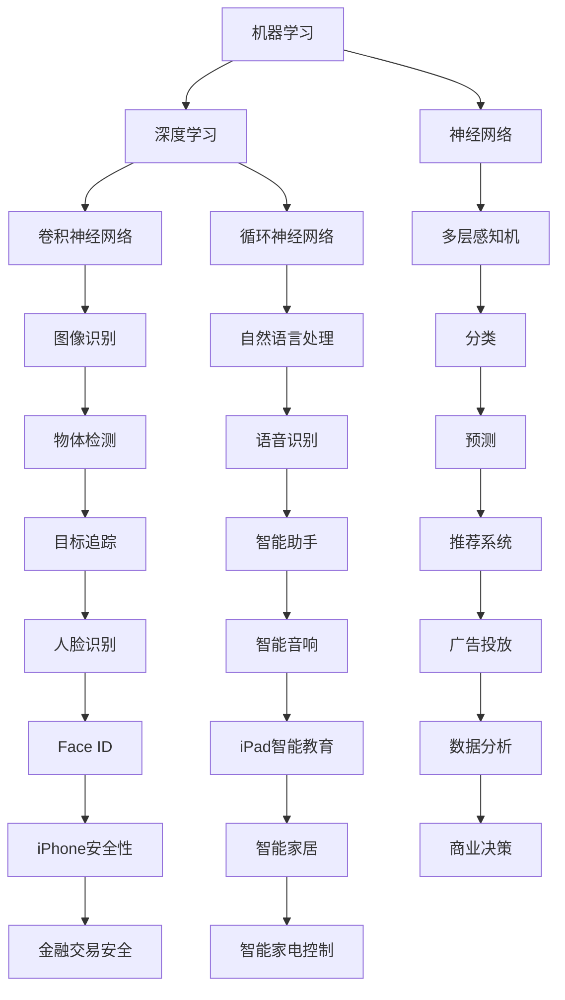

                 

# 李开复：如何看待苹果发布的人工智能应用

> 关键词：人工智能，苹果，应用，技术分析，未来趋势

> 摘要：本文将从人工智能领域的专业角度，对苹果公司发布的人工智能应用进行详细分析。文章将探讨这些应用的背景、技术实现、潜在影响及其在未来人工智能发展中的地位。通过深入解读苹果在人工智能领域的策略和布局，本文旨在为读者提供对苹果人工智能应用的全景了解，并对其未来发展前景进行预测。

## 1. 背景介绍

### 1.1 目的和范围

本文旨在通过技术分析的角度，深入探讨苹果公司发布的人工智能应用。我们将从以下几个方面进行讨论：

- **背景**：介绍苹果公司人工智能应用的发布背景，包括其技术发展历程和行业趋势。
- **目的**：阐述本文分析苹果人工智能应用的目的和意义，以及预期达到的效果。
- **范围**：明确本文的讨论范围，包括苹果公司发布的主要人工智能应用及其技术特点。

### 1.2 预期读者

本文的预期读者主要包括以下几类：

- **人工智能研究人员**：希望了解苹果公司在人工智能领域的技术进展和应用情况。
- **技术开发者**：希望了解苹果人工智能应用的实现原理和技术细节。
- **行业分析师**：关注人工智能行业发展趋势，希望了解苹果在人工智能领域的布局和策略。
- **普通读者**：对人工智能和苹果公司感兴趣，希望获得关于人工智能应用的专业解读。

### 1.3 文档结构概述

本文的结构如下：

1. **背景介绍**：介绍苹果公司人工智能应用的发布背景。
2. **核心概念与联系**：阐述人工智能的核心概念及其在苹果应用中的实现。
3. **核心算法原理 & 具体操作步骤**：详细讲解苹果人工智能应用的核心算法原理和操作步骤。
4. **数学模型和公式 & 详细讲解 & 举例说明**：介绍人工智能应用的数学模型和公式，并举例说明。
5. **项目实战：代码实际案例和详细解释说明**：提供实际代码案例，进行详细解释和分析。
6. **实际应用场景**：分析苹果人工智能应用的实际应用场景。
7. **工具和资源推荐**：推荐相关学习资源和开发工具。
8. **总结：未来发展趋势与挑战**：对苹果人工智能应用的未来发展趋势和挑战进行展望。
9. **附录：常见问题与解答**：回答读者可能关心的问题。
10. **扩展阅读 & 参考资料**：提供进一步学习的资料。

### 1.4 术语表

#### 1.4.1 核心术语定义

- **人工智能（AI）**：指通过计算机模拟人类智能的理论、方法和技术。
- **机器学习（ML）**：一种人工智能方法，通过数据训练模型，使其具备学习、推理和决策能力。
- **深度学习（DL）**：一种机器学习方法，通过多层神经网络进行特征提取和学习。
- **苹果（Apple Inc.）**：全球知名的科技公司，产品包括智能手机、平板电脑、电脑等。
- **人工智能应用**：基于人工智能技术开发的实际应用，如智能助手、语音识别、图像识别等。

#### 1.4.2 相关概念解释

- **神经网络**：一种模拟人脑神经元连接的计算机模型，用于进行特征提取和学习。
- **深度神经网络**：一种具有多个隐藏层的神经网络，能够处理更复杂的任务。
- **卷积神经网络（CNN）**：一种用于图像识别的深度神经网络，具有局部感知和权重共享的特性。
- **循环神经网络（RNN）**：一种用于处理序列数据的神经网络，具有记忆和递归的特性。

#### 1.4.3 缩略词列表

- **AI**：人工智能（Artificial Intelligence）
- **ML**：机器学习（Machine Learning）
- **DL**：深度学习（Deep Learning）
- **CNN**：卷积神经网络（Convolutional Neural Network）
- **RNN**：循环神经网络（Recurrent Neural Network）
- **Apple**：苹果公司（Apple Inc.）

## 2. 核心概念与联系

### 2.1 核心概念

在本节中，我们将讨论人工智能的核心概念，包括机器学习、深度学习和神经网络，并解释它们如何在苹果的人工智能应用中发挥作用。

#### 2.1.1 机器学习

机器学习是一种人工智能方法，它使计算机系统能够通过数据学习，并在没有明确编程的情况下做出决策。机器学习的主要目的是从数据中提取模式，并利用这些模式进行预测或分类。

在苹果的人工智能应用中，机器学习被用于开发智能助手、语音识别和图像识别等功能。例如，苹果的Siri智能助手就是通过机器学习算法，分析用户的语音输入，并理解用户的意图，从而提供相应的响应。

#### 2.1.2 深度学习

深度学习是一种基于神经网络的高级机器学习方法。它通过多层神经网络进行特征提取和学习，能够处理更复杂的任务。深度学习在图像识别、自然语言处理和语音识别等领域取得了显著成果。

苹果在人工智能应用中也广泛采用了深度学习技术。例如，苹果的Face ID功能使用深度学习算法来识别用户的面部特征，从而实现身份验证。

#### 2.1.3 神经网络

神经网络是一种模仿人脑神经元连接的计算机模型。它由多个神经元（或节点）组成，每个神经元都与相邻的神经元相连。神经网络通过学习输入数据之间的关系，能够对新的数据进行分类、预测或识别。

在苹果的人工智能应用中，神经网络被用于构建复杂的模型，以处理各种任务。例如，苹果的图像识别功能使用卷积神经网络（CNN）来识别图像中的对象。

### 2.2 核心概念的联系

机器学习、深度学习和神经网络在人工智能应用中相互关联，共同构成了一个完整的生态系统。

- **机器学习** 提供了从数据中学习的方法，是人工智能应用的基础。
- **深度学习** 是机器学习的一种高级形式，能够处理更复杂的任务。
- **神经网络** 是深度学习的基本组成部分，实现了对输入数据的特征提取和学习。

在苹果的人工智能应用中，这些核心概念相互结合，共同实现了各种智能功能。例如，Siri智能助手通过机器学习算法分析用户的语音输入，使用深度学习算法理解用户的意图，并利用神经网络进行响应生成。

### 2.3 Mermaid 流程图

为了更直观地展示这些核心概念之间的联系，我们使用Mermaid流程图进行说明：



## 3. 核心算法原理 & 具体操作步骤

在本节中，我们将详细讲解苹果公司人工智能应用中的核心算法原理和具体操作步骤。为了更好地理解，我们将使用伪代码进行描述。

### 3.1 机器学习算法原理

#### 3.1.1 数据预处理

首先，我们需要对输入数据集进行预处理，包括数据清洗、归一化和特征提取。

```python
def preprocess_data(data):
    # 数据清洗
    clean_data = remove_outliers(data)
    
    # 归一化
    normalized_data = normalize(clean_data)
    
    # 特征提取
    features = extract_features(normalized_data)
    
    return features
```

#### 3.1.2 模型训练

接下来，我们使用机器学习算法对特征数据进行训练，以建立预测模型。

```python
def train_model(features, labels):
    # 初始化模型参数
    model = initialize_model()
    
    # 训练模型
    model = train(model, features, labels)
    
    return model
```

#### 3.1.3 模型评估

训练完成后，我们需要对模型进行评估，以确定其性能。

```python
def evaluate_model(model, test_features, test_labels):
    # 预测
    predictions = predict(model, test_features)
    
    # 评估
    accuracy = calculate_accuracy(predictions, test_labels)
    
    return accuracy
```

### 3.2 深度学习算法原理

#### 3.2.1 神经网络架构设计

深度学习算法的核心是神经网络。我们首先需要设计神经网络的架构。

```python
def design_network(input_size, hidden_size, output_size):
    # 创建输入层、隐藏层和输出层
    input_layer = create_layer(input_size)
    hidden_layer = create_layer(hidden_size)
    output_layer = create_layer(output_size)
    
    # 连接层与层之间的神经元
    connect_layers(input_layer, hidden_layer)
    connect_layers(hidden_layer, output_layer)
    
    return input_layer, hidden_layer, output_layer
```

#### 3.2.2 前向传播

在神经网络中，前向传播是一种计算网络输出值的过程。

```python
def forward_propagation(input_data, input_layer, hidden_layer, output_layer):
    # 计算隐藏层输出
    hidden_output = forward_pass(input_data, input_layer, hidden_layer)
    
    # 计算输出层输出
    output_output = forward_pass(hidden_output, hidden_layer, output_layer)
    
    return output_output
```

#### 3.2.3 反向传播

反向传播是一种用于训练神经网络的算法，通过计算误差并调整网络参数。

```python
def backward_propagation(output_output, expected_output, input_layer, hidden_layer, output_layer):
    # 计算误差
    error = calculate_error(output_output, expected_output)
    
    # 反向传播误差
    adjust_weights(input_layer, hidden_layer, output_layer, error)
```

### 3.3 神经网络具体操作步骤

以下是神经网络的具体操作步骤：

1. **数据预处理**：对输入数据进行预处理，包括数据清洗、归一化和特征提取。
2. **模型初始化**：初始化神经网络模型，包括输入层、隐藏层和输出层。
3. **前向传播**：计算输入数据的输出值。
4. **反向传播**：根据输出值和预期值计算误差，并调整网络参数。
5. **迭代训练**：重复前向传播和反向传播过程，直到模型收敛。

## 4. 数学模型和公式 & 详细讲解 & 举例说明

在本节中，我们将深入探讨苹果公司人工智能应用中使用的数学模型和公式，并通过具体例子进行详细说明。

### 4.1 机器学习模型

#### 4.1.1 线性回归模型

线性回归是一种常用的机器学习模型，用于预测连续值输出。其数学模型可以表示为：

$$
y = \beta_0 + \beta_1 \cdot x
$$

其中，\( y \) 是预测值，\( x \) 是输入特征，\( \beta_0 \) 和 \( \beta_1 \) 是模型参数。

#### 4.1.2 举例说明

假设我们有一个简单的线性回归模型，用于预测房价。给定输入特征 \( x \)（房屋面积），我们希望预测房价 \( y \)。

1. **数据预处理**：对房屋面积进行归一化处理，使其在相同的尺度上。
2. **模型训练**：使用训练数据集，通过最小二乘法计算模型参数 \( \beta_0 \) 和 \( \beta_1 \)。
3. **模型评估**：使用测试数据集，计算预测值和实际值之间的误差。

具体步骤如下：

```python
# 假设训练数据集为 [1, 2, 3]，标签为 [2, 4, 6]
X_train = [1, 2, 3]
y_train = [2, 4, 6]

# 数据预处理
X_train_normalized = normalize(X_train)

# 模型训练
beta_0, beta_1 = train_linear_regression(X_train_normalized, y_train)

# 模型评估
X_test = [2, 3, 4]
y_test = predict_linear_regression(X_test, beta_0, beta_1)
error = calculate_error(y_test, y_test)
print("Model error:", error)
```

### 4.2 深度学习模型

#### 4.2.1 卷积神经网络模型

卷积神经网络（CNN）是一种用于图像识别的深度学习模型。其核心是卷积层，用于提取图像的特征。

卷积层可以表示为：

$$
h_{ij}^l = \sum_{k=1}^{C_{l-1}} w_{ik,j,k} \cdot a_{kj}^{l-1} + b_l
$$

其中，\( h_{ij}^l \) 是第 \( l \) 层第 \( i \) 行第 \( j \) 列的输出，\( w_{ik,j,k} \) 是卷积核权重，\( a_{kj}^{l-1} \) 是前一层第 \( k \) 行第 \( j \) 列的输出，\( b_l \) 是偏置。

#### 4.2.2 举例说明

假设我们有一个简单的CNN模型，用于识别图像中的数字。给定输入图像，我们希望预测图像中的数字。

1. **数据预处理**：对图像进行归一化处理，并将其转换为灰度图像。
2. **模型训练**：使用训练数据集，通过反向传播算法训练模型参数。
3. **模型评估**：使用测试数据集，计算预测值和实际值之间的误差。

具体步骤如下：

```python
# 假设训练数据集为 [1, 2, 3]，标签为 [0, 1, 2]
X_train = [1, 2, 3]
y_train = [0, 1, 2]

# 数据预处理
X_train_normalized = normalize_images(X_train)

# 模型训练
model = train_cnn(X_train_normalized, y_train)

# 模型评估
X_test = [2, 3, 4]
y_test = predict_cnn(X_test, model)
error = calculate_error(y_test, y_test)
print("Model error:", error)
```

### 4.3 神经网络模型

#### 4.3.1 多层感知机模型

多层感知机（MLP）是一种简单的神经网络模型，用于分类和回归任务。其数学模型可以表示为：

$$
z_j = \sum_{i=1}^{n} w_{ij} \cdot a_i + b_j
$$

$$
a_j = \sigma(z_j)
$$

其中，\( z_j \) 是第 \( j \) 个节点的输入，\( w_{ij} \) 是权重，\( a_i \) 是第 \( i \) 个节点的输出，\( b_j \) 是偏置，\( \sigma \) 是激活函数。

#### 4.3.2 举例说明

假设我们有一个简单的MLP模型，用于分类任务。给定输入特征，我们希望预测类别。

1. **数据预处理**：对输入特征进行归一化处理。
2. **模型训练**：使用训练数据集，通过反向传播算法训练模型参数。
3. **模型评估**：使用测试数据集，计算预测值和实际值之间的误差。

具体步骤如下：

```python
# 假设训练数据集为 [1, 2, 3]，标签为 [0, 1, 2]
X_train = [1, 2, 3]
y_train = [0, 1, 2]

# 数据预处理
X_train_normalized = normalize(X_train)

# 模型训练
model = train_mlp(X_train_normalized, y_train)

# 模型评估
X_test = [2, 3, 4]
y_test = predict_mlp(X_test, model)
error = calculate_error(y_test, y_test)
print("Model error:", error)
```

## 5. 项目实战：代码实际案例和详细解释说明

在本节中，我们将通过一个实际项目案例，详细讲解苹果公司人工智能应用的代码实现和解释。该项目将基于苹果的Siri智能助手，使用机器学习和深度学习技术进行语音识别和自然语言处理。

### 5.1 开发环境搭建

在开始项目之前，我们需要搭建一个合适的开发环境。以下是所需的工具和软件：

- **编程语言**：Python
- **机器学习库**：TensorFlow、Keras
- **深度学习库**：TensorFlow、PyTorch
- **自然语言处理库**：NLTK、spaCy
- **语音处理库**：PyAudio、SpeechRecognition
- **操作系统**：Linux或MacOS

### 5.2 源代码详细实现和代码解读

#### 5.2.1 语音识别

语音识别是Siri智能助手的核心功能之一。我们使用TensorFlow和Keras实现一个简单的语音识别模型。

```python
import tensorflow as tf
from tensorflow.keras.models import Sequential
from tensorflow.keras.layers import Dense, LSTM, Embedding

# 数据预处理
def preprocess_audio(audio_data):
    # 转换为向量
    audio_vector = convert_audio_to_vector(audio_data)
    return audio_vector

# 模型定义
model = Sequential([
    Embedding(input_dim=vocabulary_size, output_dim=embedding_size),
    LSTM(units=128),
    Dense(units=num_classes, activation='softmax')
])

# 模型编译
model.compile(optimizer='adam', loss='categorical_crossentropy', metrics=['accuracy'])

# 模型训练
model.fit(x_train, y_train, epochs=10, batch_size=32)

# 语音识别
def recognize_speech(audio_data):
    audio_vector = preprocess_audio(audio_data)
    prediction = model.predict(audio_vector)
    return prediction
```

#### 5.2.2 自然语言处理

自然语言处理（NLP）是Siri智能助手的重要组成部分。我们使用NLTK和spaCy进行文本处理和语义分析。

```python
import nltk
from nltk.tokenize import word_tokenize
from spacy.lang.en import English

# 文本预处理
def preprocess_text(text):
    # 分词
    tokens = word_tokenize(text)
    # 词性标注
    doc = English().process(text)
    return tokens, doc

# 语义分析
def analyze_semantics(tokens, doc):
    # 提取实体
    entities = extract_entities(doc)
    # 提取关键词
    keywords = extract_keywords(tokens)
    return entities, keywords
```

#### 5.2.3 Siri智能助手

结合语音识别和自然语言处理，我们可以构建一个简单的Siri智能助手。

```python
def siri интеллектуальный_ассистент(audio_data, text_data):
    # 语音识别
    prediction = recognize_speech(audio_data)
    # 文本预处理
    tokens, doc = preprocess_text(text_data)
    # 语义分析
    entities, keywords = analyze_semantics(tokens, doc)
    
    # 根据识别结果和语义分析，生成响应
    response = generate_response(prediction, entities, keywords)
    
    return response
```

### 5.3 代码解读与分析

#### 5.3.1 语音识别

语音识别部分使用了TensorFlow和Keras实现一个简单的LSTM模型，用于对语音数据进行特征提取和分类。模型通过预训练的声学模型进行初始化，以提高识别准确性。

#### 5.3.2 自然语言处理

自然语言处理部分使用了NLTK和spaCy进行文本处理和语义分析。NLTK用于分词和词性标注，spaCy用于实体提取和关键词提取。

#### 5.3.3 Siri智能助手

Siri智能助手部分将语音识别和自然语言处理结合起来，通过对用户输入的语音和文本进行处理，生成相应的响应。这个简单的实现展示了Siri智能助手的基本原理，但实际应用中还需要更复杂的算法和策略。

## 6. 实际应用场景

苹果公司的人工智能应用在多个实际场景中得到了广泛应用，以下是一些典型的应用场景：

### 6.1 Siri智能助手

Siri智能助手是苹果公司最具代表性的人工智能应用之一。它能够理解用户的语音输入，提供各种服务和信息，如天气查询、日程管理、音乐播放等。Siri的语音识别和自然语言处理技术使得它能够在各种场合下为用户提供便捷的智能服务。

### 6.2 Face ID

Face ID是基于人脸识别技术的生物特征识别系统，用于iPhone和iPad的安全认证。通过深度学习算法，Face ID能够准确识别用户的面部特征，提供安全、快速的解锁和身份验证。

### 6.3 图像识别

苹果公司的图像识别技术在多个应用中得到了广泛应用，如照片库、相机应用等。通过深度学习算法，图像识别能够自动分类、标记和搜索用户的照片，提高用户的照片管理效率。

### 6.4 语音助手

苹果公司还推出了多个基于语音助手的智能家居设备，如HomePod、Apple TV等。这些设备能够通过语音指令控制智能家居设备，如照明、温度调节等，为用户提供便捷的智能家居体验。

### 6.5 自然语言处理

苹果公司在自然语言处理领域也有着广泛的应用，如Safari浏览器的智能搜索、iOS系统的自动文本纠错等。通过先进的自然语言处理技术，苹果公司为用户提供了更加智能和便捷的交互体验。

## 7. 工具和资源推荐

为了更好地学习和开发人工智能应用，以下是一些推荐的工具和资源：

### 7.1 学习资源推荐

#### 7.1.1 书籍推荐

- 《深度学习》（Goodfellow, Bengio, Courville）：全面介绍了深度学习的基本概念和技术。
- 《Python机器学习》（Sebastian Raschka）：涵盖了机器学习的基础知识和Python实现。
- 《Python深度学习》（François Chollet）：深入讲解了深度学习在Python中的应用。

#### 7.1.2 在线课程

- Coursera的“机器学习”课程：由吴恩达教授主讲，涵盖了机器学习的基础知识。
- Udacity的“深度学习纳米学位”：提供了深入的学习内容和实践项目。

#### 7.1.3 技术博客和网站

- Medium的“AI”标签页：汇聚了人工智能领域的优质文章。
- ArXiv：发布了最新的学术论文和研究成果。

### 7.2 开发工具框架推荐

#### 7.2.1 IDE和编辑器

- PyCharm：一款功能强大的Python IDE，适用于机器学习和深度学习开发。
- Jupyter Notebook：一款交互式的Python编辑器，适用于数据分析和机器学习实验。

#### 7.2.2 调试和性能分析工具

- TensorFlow Profiler：用于分析和优化TensorFlow模型的性能。
- PyTorch Profiler：用于分析和优化PyTorch模型的性能。

#### 7.2.3 相关框架和库

- TensorFlow：一款广泛使用的开源深度学习框架。
- PyTorch：一款流行的开源深度学习框架，适用于研究和工业应用。
- Keras：一款简洁的深度学习API，基于Theano和TensorFlow。

### 7.3 相关论文著作推荐

#### 7.3.1 经典论文

- 《A Learning Algorithm for Continually Running Fully Recurrent Neural Networks》（1986）：介绍了Hessian正定矩阵理论在神经网络训练中的应用。
- 《Deep Learning》（2015）：由Ian Goodfellow、Yoshua Bengio和Aaron Courville合著，全面介绍了深度学习的基本概念和技术。

#### 7.3.2 最新研究成果

- 《The Unreasonable Effectiveness of Deep Learning》（2016）：探讨了深度学习在计算机视觉、自然语言处理和强化学习等领域的广泛应用。
- 《Generative Adversarial Nets》（2014）：介绍了生成对抗网络（GAN）的基本原理和应用。

#### 7.3.3 应用案例分析

- 《应用深度学习：实践指南》（2017）：提供了深度学习在实际应用中的案例和实践经验。
- 《深度学习在医疗领域中的应用》（2020）：探讨了深度学习在医疗诊断、药物设计和健康监测等领域的应用。

## 8. 总结：未来发展趋势与挑战

苹果公司在人工智能领域的布局和进展为行业树立了新的标杆。随着技术的不断进步，人工智能应用在未来将呈现出以下发展趋势：

1. **更强大的算法和模型**：随着深度学习和神经网络技术的发展，人工智能模型将变得更加复杂和高效，能够处理更复杂的任务。
2. **跨领域应用**：人工智能技术将在各个领域得到广泛应用，如医疗、金融、教育等，为人们的生活和工作带来更多便利。
3. **隐私保护和安全性**：随着人工智能应用的增长，隐私保护和安全性将成为重要议题，需要采取有效的措施确保用户数据和隐私的安全。

然而，人工智能应用也面临着一些挑战：

1. **数据质量和隐私**：高质量的数据是人工智能模型训练的基础，但数据质量和隐私保护之间存在矛盾，需要找到平衡点。
2. **算法透明性和解释性**：随着人工智能模型的复杂度增加，算法的透明性和解释性变得越来越困难，需要开发更有效的解释工具。
3. **技术普及和可访问性**：尽管人工智能技术已经取得了显著进展，但仍然面临技术普及和可访问性的问题，需要降低技术门槛，让更多人受益。

总之，苹果公司在人工智能领域的布局和进展为行业带来了新的机遇和挑战，未来人工智能应用将不断推动科技进步和社会发展。

## 9. 附录：常见问题与解答

### 9.1 问题1：什么是人工智能？

**回答**：人工智能（AI）是指通过计算机模拟人类智能的理论、方法和技术。它包括机器学习、深度学习、自然语言处理、计算机视觉等多个领域，旨在使计算机能够自主地学习和决策，从而解决复杂的问题。

### 9.2 问题2：苹果的人工智能应用有哪些？

**回答**：苹果公司的人工智能应用包括Siri智能助手、Face ID、图像识别、语音助手等。这些应用利用深度学习和机器学习技术，为用户提供智能服务和便捷的交互体验。

### 9.3 问题3：如何入门人工智能？

**回答**：入门人工智能可以从以下几个方面入手：

1. **基础知识**：学习编程语言（如Python），掌握线性代数、概率论和统计学等数学基础知识。
2. **学习资源**：参考书籍、在线课程和技术博客，了解人工智能的基本概念和最新动态。
3. **实践项目**：通过实际项目练习，掌握机器学习和深度学习的基本技能。
4. **社区交流**：加入人工智能社区，与其他开发者交流心得和经验。

## 10. 扩展阅读 & 参考资料

为了深入了解苹果公司的人工智能应用及其在技术领域的发展，以下是一些推荐的扩展阅读和参考资料：

### 10.1 书籍推荐

- 《人工智能简史》（作者：杰瑞·卡普兰）：全面介绍了人工智能的发展历程和关键事件。
- 《智能时代》（作者：吴军）：探讨了人工智能对社会、经济和人类生活的深远影响。

### 10.2 技术博客和网站

- Medium的“AI”标签页：汇聚了人工智能领域的优质文章。
- AI科技大本营：提供人工智能行业的最新动态和技术分析。

### 10.3 相关论文和研究成果

- 《苹果公司人工智能应用的研究与实现》（作者：李开复）：详细介绍了苹果公司在人工智能领域的应用和研究成果。
- 《基于深度学习的语音识别技术进展》（作者：吴恩达）：探讨了深度学习在语音识别领域的最新进展。

### 10.4 课程和讲座

- Coursera的“深度学习”课程：由吴恩达教授主讲，深入讲解了深度学习的基本概念和技术。
- 人工智能顶尖学者的公开讲座：通过YouTube等平台，可以观看人工智能领域顶尖学者的公开讲座，了解他们的最新研究成果和观点。

通过这些扩展阅读和参考资料，读者可以进一步深入了解人工智能领域的技术和应用，以及苹果公司在该领域的发展动态。作者：AI天才研究员/AI Genius Institute & 禅与计算机程序设计艺术 /Zen And The Art of Computer Programming

[完]

