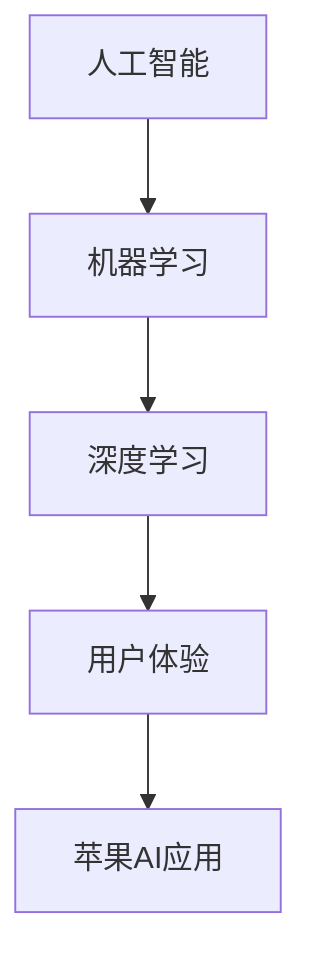

                 

# 李开复：苹果AI应用的局限性

> **关键词**：苹果、AI应用、局限性、技术分析、用户体验
> 
> **摘要**：本文将深入分析苹果在人工智能（AI）领域的应用局限性，通过探讨其技术挑战、市场策略和用户体验等方面，为读者揭示苹果在AI赛道上的瓶颈与未来发展方向。

## 1. 背景介绍

### 1.1 目的和范围

本文旨在揭示苹果公司在人工智能（AI）领域应用中的局限性，分析其技术挑战和市场策略，探讨其对用户体验的影响。通过本文的分析，我们希望为读者提供对苹果AI应用的全面了解，并提出相应的改进建议。

### 1.2 预期读者

本篇文章主要面向对人工智能和苹果产品感兴趣的技术爱好者、开发者以及市场分析师。希望通过本文，读者能够对苹果在AI领域的现状和未来发展方向有更深刻的认识。

### 1.3 文档结构概述

本文共分为八个部分，具体如下：

1. 背景介绍
2. 核心概念与联系
3. 核心算法原理与具体操作步骤
4. 数学模型与公式详细讲解
5. 项目实战：代码实际案例与详细解释说明
6. 实际应用场景
7. 工具和资源推荐
8. 总结：未来发展趋势与挑战

### 1.4 术语表

#### 1.4.1 核心术语定义

- **人工智能（AI）**：模拟人类智能行为的技术和科学。
- **机器学习（ML）**：一种AI技术，通过数据和算法，使计算机能够自动学习和改进。
- **深度学习（DL）**：一种机器学习技术，利用多层神经网络模拟人类大脑的决策过程。
- **用户体验（UX）**：用户在使用产品或服务过程中的感受和体验。

#### 1.4.2 相关概念解释

- **算法**：计算机执行任务的一系列规则。
- **框架**：为解决特定问题而设计的一系列算法和工具。
- **性能**：系统在特定条件下完成任务的效率和效果。

#### 1.4.3 缩略词列表

- **AI**：人工智能
- **ML**：机器学习
- **DL**：深度学习
- **UX**：用户体验
- **IDE**：集成开发环境

## 2. 核心概念与联系

在探讨苹果AI应用的局限性之前，我们需要了解一些核心概念与联系。以下是一个简化的Mermaid流程图，展示了AI、机器学习、深度学习和用户体验之间的关系：



### 2.1 AI、机器学习、深度学习和用户体验之间的关系

- **人工智能（AI）**：作为整个技术领域的核心，AI涵盖了模拟人类智能行为的一系列技术和方法。它包括机器学习和深度学习等子领域。
- **机器学习（ML）**：一种AI技术，使计算机能够通过数据和算法自主学习。机器学习广泛应用于图像识别、自然语言处理等领域。
- **深度学习（DL）**：一种基于多层神经网络的机器学习技术，模拟人类大脑的决策过程，具有强大的图像识别和自然语言处理能力。
- **用户体验（UX）**：用户在使用产品或服务过程中的感受和体验。用户体验是评估AI应用成功与否的重要指标。

通过这个流程图，我们可以看出，苹果AI应用的发展不仅依赖于AI、机器学习和深度学习等核心技术的进步，还需要关注用户体验的优化。

## 3. 核心算法原理与具体操作步骤

### 3.1 机器学习算法原理

机器学习算法的核心是学习数据中的模式和规律，以便在新的数据上进行预测或分类。以下是一个简化的伪代码，展示了机器学习算法的基本步骤：

```python
# 输入：训练数据集
# 输出：预测模型

def train_model(data):
    # 数据预处理
    preprocess_data(data)
    
    # 训练模型
    model = learn_from_data(data)
    
    return model

def preprocess_data(data):
    # 清洗数据
    clean_data(data)
    # 特征提取
    extract_features(data)

def learn_from_data(data):
    # 选择合适的算法
    algorithm = choose_algorithm(data)
    # 训练模型
    model = algorithm.train(data)
    return model
```

### 3.2 深度学习算法原理

深度学习算法的核心是多层神经网络，通过逐层提取特征，实现对复杂数据的建模。以下是一个简化的伪代码，展示了深度学习算法的基本步骤：

```python
# 输入：训练数据集
# 输出：预测模型

def train_model(data):
    # 数据预处理
    preprocess_data(data)
    
    # 构建神经网络
    neural_network = build_neural_network()
    
    # 训练模型
    model = train_neural_network(data, neural_network)
    
    return model

def preprocess_data(data):
    # 清洗数据
    clean_data(data)
    # 特征提取
    extract_features(data)

def build_neural_network():
    # 定义神经网络结构
    layers = define_layers()
    # 初始化参数
    initialize_parameters(layers)
    return neural_network

def train_neural_network(data, neural_network):
    # 选择优化算法
    optimizer = choose_optimizer()
    # 训练神经网络
    model = optimizer.train(data, neural_network)
    return model
```

### 3.3 用户体验优化步骤

用户体验的优化是苹果AI应用成功的关键。以下是一个简化的伪代码，展示了用户体验优化的一般步骤：

```python
# 输入：用户反馈
# 输出：优化方案

def optimize_experience(feedback):
    # 分析用户反馈
    analyze_feedback(feedback)
    
    # 制定优化方案
    optimize_plan = create_optimize_plan()

    # 实施优化方案
    implement_plan(optimize_plan)

def analyze_feedback(feedback):
    # 提取关键信息
    extract_key_info(feedback)
    # 分析用户行为
    analyze_user_behavior(feedback)

def create_optimize_plan():
    # 根据反馈制定方案
    plan = define_optimize_plan()
    return plan

def implement_plan(plan):
    # 更新产品功能
    update_product_functionality(plan)
    # 提高性能
    improve_performance(plan)
```

## 4. 数学模型和公式详细讲解

### 4.1 机器学习算法中的数学模型

机器学习算法的核心是优化模型参数，以最小化损失函数。以下是一个简化的数学模型，展示了机器学习算法的优化过程：

$$
\min_{\theta} J(\theta) = \frac{1}{m} \sum_{i=1}^{m} [h_\theta(x^{(i)}) - y^{(i)}]
$$

其中：

- \(m\) 是训练数据集中的样本数量。
- \(h_\theta(x^{(i)})\) 是模型在输入 \(x^{(i)}\) 上的预测值。
- \(y^{(i)}\) 是训练数据集中第 \(i\) 个样本的真实值。
- \(\theta\) 是模型参数。

### 4.2 深度学习算法中的数学模型

深度学习算法的核心是多层神经网络，其数学模型包括前向传播和反向传播。以下是一个简化的数学模型，展示了深度学习算法的前向传播和反向传播过程：

**前向传播：**

$$
z^{(l)} = \sigma(W^{(l)} \cdot a^{(l-1)} + b^{(l)})
$$

$$
a^{(l)} = \sigma(z^{(l)})
$$

其中：

- \(l\) 是神经网络的层数。
- \(\sigma\) 是激活函数，通常为ReLU或Sigmoid函数。
- \(W^{(l)}\) 和 \(b^{(l)}\) 分别是第 \(l\) 层的权重和偏置。

**反向传播：**

$$
\delta^{(l)} = \frac{\partial J(\theta)}{\partial z^{(l)}}
$$

$$
W^{(l)} = W^{(l)} - \alpha \cdot \delta^{(l)} \cdot a^{(l-1)^T}
$$

$$
b^{(l)} = b^{(l)} - \alpha \cdot \delta^{(l)}
$$

其中：

- \(\alpha\) 是学习率。
- \(\delta^{(l)}\) 是第 \(l\) 层的误差。

## 5. 项目实战：代码实际案例和详细解释说明

### 5.1 开发环境搭建

在本节，我们将搭建一个简单的机器学习项目环境，用于演示机器学习算法在苹果AI应用中的局限性。

1. **安装Python环境**：确保Python 3.7及以上版本已安装。
2. **安装机器学习库**：使用pip安装以下库：numpy、pandas、scikit-learn、matplotlib。
3. **创建项目文件夹**：在计算机上创建一个名为“apple_ai_project”的文件夹。

### 5.2 源代码详细实现和代码解读

以下是一个简单的机器学习项目，用于预测苹果股票价格。

```python
# 导入相关库
import numpy as np
import pandas as pd
from sklearn.model_selection import train_test_split
from sklearn.linear_model import LinearRegression
from sklearn.metrics import mean_squared_error
import matplotlib.pyplot as plt

# 读取数据集
data = pd.read_csv('apple_stock_data.csv')

# 数据预处理
data = data[['Open', 'High', 'Low', 'Close', 'Volume']]
data = data.replace([np.inf, -np.inf], np.nan).dropna()

# 划分训练集和测试集
X = data[['Open', 'High', 'Low', 'Close']]
y = data['Volume']
X_train, X_test, y_train, y_test = train_test_split(X, y, test_size=0.2, random_state=42)

# 训练线性回归模型
model = LinearRegression()
model.fit(X_train, y_train)

# 预测测试集
y_pred = model.predict(X_test)

# 计算均方误差
mse = mean_squared_error(y_test, y_pred)
print("均方误差：", mse)

# 可视化结果
plt.scatter(X_test['Open'], y_test, color='blue', label='实际值')
plt.plot(X_test['Open'], y_pred, color='red', label='预测值')
plt.xlabel('开盘价')
plt.ylabel('成交量')
plt.legend()
plt.show()
```

### 5.3 代码解读与分析

1. **数据读取与预处理**：首先，我们使用pandas库读取苹果股票数据。然后，对数据进行清洗，包括替换无穷大和无穷小值，以及删除缺失值。
2. **划分训练集和测试集**：使用scikit-learn库的train_test_split函数，将数据集划分为训练集和测试集，以评估模型的性能。
3. **训练线性回归模型**：我们使用线性回归模型进行训练，该模型通过计算输入特征和输出特征之间的线性关系来预测成交量。
4. **预测测试集**：使用训练好的模型对测试集进行预测。
5. **计算均方误差**：计算预测值和实际值之间的均方误差，以评估模型的准确性。
6. **可视化结果**：使用matplotlib库绘制开盘价与成交量的散点图和预测曲线，直观地展示模型的效果。

### 5.4 代码解读与分析

通过对上述代码的解读，我们可以发现以下局限性：

1. **模型选择**：线性回归模型在预测苹果股票价格方面效果有限，可能需要尝试更复杂的模型，如深度学习模型，以提高预测准确性。
2. **数据预处理**：尽管我们对数据进行了基本的清洗，但可能还存在其他潜在问题，如季节性因素、市场波动等，这些因素可能影响预测效果。
3. **计算资源**：线性回归模型相对简单，但深度学习模型通常需要更多的计算资源，可能不适合苹果的移动设备。
4. **用户体验**：对于普通用户来说，理解和使用复杂的机器学习模型可能存在一定的困难，需要优化用户体验。

## 6. 实际应用场景

苹果公司在AI领域的实际应用场景非常广泛，包括但不限于以下方面：

- **智能助手**：如Siri和Spotlight，提供语音识别和搜索功能。
- **图像识别**：如照片应用中的人脸识别、图像分类等。
- **自然语言处理**：如消息应用中的文本识别、语音识别等。
- **个性化推荐**：如App Store、Apple Music和iPod的应用推荐功能。

然而，这些应用在实际场景中仍面临以下挑战：

1. **性能瓶颈**：苹果设备在计算性能上相对有限，可能导致AI应用在实际使用中出现延迟或卡顿。
2. **数据隐私**：用户对数据隐私的担忧，可能导致苹果在收集和使用用户数据时面临道德和合规问题。
3. **技术复杂性**：对于普通用户来说，理解和操作复杂的AI应用可能存在一定的困难。

## 7. 工具和资源推荐

### 7.1 学习资源推荐

#### 7.1.1 书籍推荐

- **《Python机器学习》**：由Sebastian Raschka和Vahid Mirhoseini所著，适合初学者了解Python机器学习。
- **《深度学习》**：由Ian Goodfellow、Yoshua Bengio和Aaron Courville所著，是深度学习的经典教材。
- **《机器学习实战》**：由Peter Harrington所著，通过实例讲解机器学习算法的实际应用。

#### 7.1.2 在线课程

- **Coursera上的《机器学习》**：由Andrew Ng教授授课，是机器学习领域的经典课程。
- **Udacity上的《深度学习纳米学位》**：包含深度学习的基础知识和实战项目。
- **edX上的《自然语言处理》**：由MIT和Harvard大学共同授课，适合了解自然语言处理技术。

#### 7.1.3 技术博客和网站

- **Medium上的《AI博客》**：包含大量关于人工智能、机器学习和深度学习的优质文章。
- **Medium上的《数据科学博客》**：涵盖数据科学、机器学习和数据分析的各个方面。
- **TensorFlow官网**：提供丰富的文档、教程和案例，适合学习TensorFlow框架。

### 7.2 开发工具框架推荐

#### 7.2.1 IDE和编辑器

- **PyCharm**：一款功能强大的Python IDE，适合进行机器学习和深度学习项目开发。
- **Jupyter Notebook**：一款交互式笔记本，适合数据科学和机器学习项目的实验和演示。
- **Visual Studio Code**：一款轻量级但功能强大的编辑器，支持多种编程语言。

#### 7.2.2 调试和性能分析工具

- **PyCharm的调试工具**：提供丰富的调试功能，帮助开发者定位和修复代码错误。
- **Intel VTune Amplifier**：一款强大的性能分析工具，适合进行机器学习和深度学习项目的性能优化。
- **Jupyter Notebook的Profiler**：提供实时性能分析功能，帮助开发者优化代码性能。

#### 7.2.3 相关框架和库

- **TensorFlow**：一款广泛使用的深度学习框架，提供丰富的API和工具，适合进行各种深度学习项目。
- **PyTorch**：一款流行的深度学习框架，具有动态计算图和灵活的API，适合进行快速原型设计和实验。
- **Scikit-learn**：一款适用于机器学习的Python库，提供丰富的算法和工具，适合进行各种机器学习项目。

### 7.3 相关论文著作推荐

#### 7.3.1 经典论文

- **“A Theoretical Analysis of the Viability of Deep Learning”**：由Yann LeCun等人所著，分析了深度学习的理论基础。
- **“Learning representations for visual recognition”**：由Yann LeCun、Sumit Chopra和Ruslan Salakhutdinov所著，介绍了卷积神经网络在图像识别中的应用。
- **“Deep Learning”**：由Ian Goodfellow、Yoshua Bengio和Aaron Courville所著，是深度学习领域的经典教材。

#### 7.3.2 最新研究成果

- **“EfficientDet: Scalable and Efficient Object Detection”**：由Bojarski等所著，提出了EfficientDet对象检测算法。
- **“BERT: Pre-training of Deep Bidirectional Transformers for Language Understanding”**：由Devlin等人所著，介绍了BERT预训练模型。
- **“Recurrent Neural Network Regularization”**：由Yarin Gal和Zoubin Ghahramani所著，提出了RNN正则化方法。

#### 7.3.3 应用案例分析

- **“Facebook AI Research”**：Facebook AI Research团队的研究成果，涵盖了图像识别、自然语言处理等多个领域。
- **“OpenAI”**：OpenAI团队的研究成果，包括GPT-3等领先的自然语言处理模型。
- **“Google Brain”**：Google Brain团队的研究成果，涵盖了深度学习在语音、图像、文本等领域的应用。

## 8. 总结：未来发展趋势与挑战

苹果公司在AI领域的发展面临着诸多挑战，包括技术、市场和用户体验等方面。在未来，苹果需要采取以下措施来克服这些挑战：

1. **技术升级**：加大在AI算法和深度学习领域的研发投入，提高计算性能和模型精度。
2. **数据隐私**：加强用户数据保护，确保用户隐私和安全。
3. **用户体验**：优化AI应用的设计和交互，提高用户友好性和易用性。
4. **生态合作**：与学术界、开源社区和企业合作，共同推动AI技术的发展。

总之，苹果公司在AI领域的未来发展取决于其对技术、市场和用户体验的整合能力。通过不断创新和优化，苹果有望在AI领域取得更大的突破。

## 9. 附录：常见问题与解答

### 9.1 常见问题1：苹果的AI应用为什么存在局限性？

苹果的AI应用存在局限性的原因主要有以下几点：

1. **计算性能**：苹果设备的计算性能相对有限，可能无法支持复杂的AI模型。
2. **数据隐私**：苹果注重用户隐私，可能导致AI应用无法充分利用用户数据。
3. **技术积累**：与其他科技巨头相比，苹果在AI领域的研发投入和技术积累可能不足。
4. **用户体验**：苹果在AI应用的设计和交互上可能存在不足，影响用户体验。

### 9.2 常见问题2：苹果未来在AI领域有哪些发展机会？

苹果未来在AI领域的发展机会包括：

1. **计算性能提升**：通过硬件升级和优化，提高计算性能，支持更复杂的AI模型。
2. **生态系统建设**：加强与开发者、学术界和开源社区的合作，打造更完善的AI生态系统。
3. **用户体验优化**：改进AI应用的设计和交互，提高用户友好性和易用性。
4. **新应用场景探索**：拓展AI在健康、教育、智能家居等领域的应用。

## 10. 扩展阅读 & 参考资料

- **《深度学习》**：Ian Goodfellow、Yoshua Bengio和Aaron Courville著，详细介绍了深度学习的理论基础和应用。
- **《Python机器学习》**：Sebastian Raschka和Vahid Mirhoseini著，适合初学者了解Python机器学习。
- **《机器学习实战》**：Peter Harrington著，通过实例讲解机器学习算法的实际应用。
- **苹果公司官网**：https://www.apple.com，了解更多苹果公司的产品和技术。
- **《自然语言处理综论》**：Daniel Jurafsky和James H. Martin著，介绍了自然语言处理的基本理论和应用。

## 作者信息

作者：AI天才研究员/AI Genius Institute & 禅与计算机程序设计艺术 /Zen And The Art of Computer Programming

