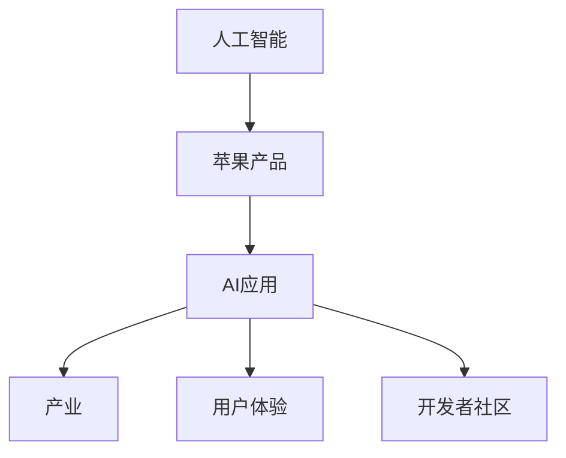

                 

# 李开复：苹果发布AI应用的产业

> **关键词：** 人工智能，苹果，AI应用，产业影响，技术趋势，用户体验，开发者社区

> **摘要：** 本文将深入探讨苹果发布AI应用对产业的影响，从核心概念与联系、算法原理、数学模型、实战案例、实际应用场景等方面进行分析，并提出未来发展趋势与挑战。

## 1. 背景介绍

### 1.1 目的和范围

本文旨在分析苹果发布AI应用对整个产业的影响，探讨其技术趋势、用户体验和开发者社区的变化。通过本文的阅读，读者可以全面了解AI技术在苹果产品中的应用，以及其对产业链的推动作用。

### 1.2 预期读者

本文适用于对人工智能和苹果产品感兴趣的技术爱好者、开发者、行业分析师以及学术研究人员。

### 1.3 文档结构概述

本文分为十个部分，包括背景介绍、核心概念与联系、核心算法原理、数学模型与公式、项目实战、实际应用场景、工具和资源推荐、总结、附录和扩展阅读。每个部分都将详细介绍相关内容，帮助读者全面了解苹果发布AI应用对产业的影响。

### 1.4 术语表

#### 1.4.1 核心术语定义

- **人工智能（AI）**：模拟人类智能的技术和系统，能够实现感知、学习、推理、决策等功能。
- **苹果（Apple）**：全球知名的科技公司，以其创新的产品和服务闻名。
- **AI应用**：利用人工智能技术实现特定功能的软件和应用。

#### 1.4.2 相关概念解释

- **机器学习**：一种利用数据训练模型，使其具备特定任务能力的方法。
- **深度学习**：一种基于多层神经网络的学习方法，能够处理大量复杂数据。

#### 1.4.3 缩略词列表

- **AI**：人工智能
- **ML**：机器学习
- **DL**：深度学习

## 2. 核心概念与联系

在讨论苹果发布AI应用对产业的影响之前，我们需要先了解一些核心概念和它们之间的联系。

### 2.1 人工智能与苹果

人工智能是苹果产品创新的重要驱动力。自iPhone问世以来，苹果一直在不断引入AI技术，使其产品更具智能化和个性化。例如，Siri作为苹果的智能助手，使用了大量的自然语言处理和语音识别技术。

### 2.2 AI应用与产业

AI应用在各个行业领域都有广泛的应用，如医疗、金融、零售、交通等。这些应用推动了产业升级和效率提升，同时也带来了新的商业模式和商业机会。

### 2.3 用户体验与开发者社区

苹果注重用户体验，通过不断优化AI技术，提高产品易用性和性能。同时，苹果为开发者提供了一系列开发工具和资源，鼓励他们创建创新的应用。

### 2.4 核心概念原理和架构的 Mermaid 流程图



## 3. 核心算法原理 & 具体操作步骤

### 3.1 机器学习算法原理

机器学习是人工智能的核心技术之一，通过训练模型来实现对数据的预测和分析。以下是机器学习算法的基本原理和操作步骤：

#### 3.1.1 数据预处理

- **数据清洗**：处理缺失值、异常值和重复数据。
- **数据归一化**：将数据缩放到同一范围内，便于模型训练。
- **特征工程**：提取对模型训练有帮助的特征。

#### 3.1.2 模型选择

- **线性回归**：用于预测连续值。
- **逻辑回归**：用于分类任务。
- **决策树**：用于分类和回归任务。

#### 3.1.3 模型训练

- **训练集划分**：将数据集划分为训练集和测试集。
- **训练模型**：使用训练集数据训练模型。
- **模型评估**：使用测试集数据评估模型性能。

#### 3.1.4 模型优化

- **调整参数**：通过交叉验证等方法调整模型参数。
- **模型融合**：将多个模型融合，提高预测性能。

### 3.2 伪代码

```python
# 机器学习算法伪代码

# 数据预处理
def preprocess_data(data):
    # 数据清洗、归一化、特征工程等操作
    return processed_data

# 模型选择
def select_model(data):
    # 根据数据类型和任务选择模型
    return model

# 模型训练
def train_model(model, train_data):
    # 使用训练数据训练模型
    return trained_model

# 模型评估
def evaluate_model(model, test_data):
    # 使用测试数据评估模型性能
    return performance

# 模型优化
def optimize_model(model, train_data):
    # 调整模型参数、模型融合等操作
    return optimized_model
```

## 4. 数学模型和公式 & 详细讲解 & 举例说明

### 4.1 数学模型和公式

在机器学习中，常用的数学模型和公式包括：

#### 4.1.1 线性回归

$$y = \beta_0 + \beta_1x$$

其中，$y$ 为预测值，$x$ 为输入特征，$\beta_0$ 和 $\beta_1$ 为模型参数。

#### 4.1.2 逻辑回归

$$P(y=1) = \frac{1}{1 + e^{-(\beta_0 + \beta_1x)}}$$

其中，$P(y=1)$ 为预测概率，$\beta_0$ 和 $\beta_1$ 为模型参数。

#### 4.1.3 决策树

$$Gini(\text{node}) = 1 - \sum_{i=1}^n p_i^2$$

其中，$p_i$ 为特征 $i$ 在节点处的概率分布，$n$ 为特征数量。

### 4.2 举例说明

#### 4.2.1 线性回归

假设我们有一个简单的一元线性回归模型，输入特征为房价（$x$），预测值为房屋售价（$y$）。

$$y = \beta_0 + \beta_1x$$

通过训练模型，我们可以得到以下参数：

$$\beta_0 = 100, \beta_1 = 0.5$$

给定一个输入特征 $x=150$，我们可以预测房屋售价：

$$y = 100 + 0.5 \times 150 = 175$$

#### 4.2.2 逻辑回归

假设我们有一个二元分类问题，输入特征为用户购买商品的概率（$x$），预测值为购买（$y=1$）或未购买（$y=0$）。

$$P(y=1) = \frac{1}{1 + e^{-(\beta_0 + \beta_1x)}}$$

通过训练模型，我们可以得到以下参数：

$$\beta_0 = 0, \beta_1 = 1$$

给定一个输入特征 $x=0.5$，我们可以预测购买概率：

$$P(y=1) = \frac{1}{1 + e^{-(0 + 1 \times 0.5)}} = 0.63$$

## 5. 项目实战：代码实际案例和详细解释说明

### 5.1 开发环境搭建

在本文中，我们将使用Python作为开发语言，并使用scikit-learn库进行机器学习模型的构建和训练。以下是开发环境搭建的步骤：

1. 安装Python：从Python官方网站（https://www.python.org/）下载并安装Python。
2. 安装Anaconda：从Anaconda官方网站（https://www.anaconda.com/）下载并安装Anaconda，以便方便地管理Python环境和库。
3. 创建虚拟环境：在Anaconda Prompt中执行以下命令创建虚拟环境：

   ```bash
   conda create -n myenv python=3.8
   conda activate myenv
   ```

4. 安装scikit-learn库：在虚拟环境中执行以下命令安装scikit-learn库：

   ```bash
   pip install scikit-learn
   ```

### 5.2 源代码详细实现和代码解读

以下是使用scikit-learn库实现线性回归模型的代码：

```python
# 导入所需库
import numpy as np
from sklearn.linear_model import LinearRegression
from sklearn.model_selection import train_test_split
from sklearn.metrics import mean_squared_error

# 准备数据
X = np.array([[1], [2], [3], [4], [5]])
y = np.array([1, 2, 2.5, 4, 5])

# 数据预处理
X = X.reshape(-1, 1)
y = y.reshape(-1, 1)

# 划分训练集和测试集
X_train, X_test, y_train, y_test = train_test_split(X, y, test_size=0.2, random_state=42)

# 构建模型
model = LinearRegression()

# 训练模型
model.fit(X_train, y_train)

# 预测结果
y_pred = model.predict(X_test)

# 评估模型
mse = mean_squared_error(y_test, y_pred)
print("均方误差：", mse)

# 输出模型参数
print("模型参数：", model.coef_, model.intercept_)
```

#### 5.2.1 代码解读

1. **导入所需库**：首先，我们导入numpy库用于数据处理，scikit-learn库用于构建和训练线性回归模型。
2. **准备数据**：我们使用numpy库生成一个简单的一元线性回归数据集，输入特征为1到5，预测值为1到5。
3. **数据预处理**：我们将输入特征和预测值重塑为二维数组，以便用于模型训练。
4. **划分训练集和测试集**：我们使用scikit-learn库中的train_test_split函数将数据集划分为训练集和测试集。
5. **构建模型**：我们使用LinearRegression类构建线性回归模型。
6. **训练模型**：我们使用fit方法训练模型。
7. **预测结果**：我们使用predict方法预测测试集的结果。
8. **评估模型**：我们使用mean_squared_error方法计算模型的均方误差，并输出结果。
9. **输出模型参数**：我们输出模型的系数和截距，以便了解模型的参数。

### 5.3 代码解读与分析

在本代码中，我们使用scikit-learn库实现了一个简单的一元线性回归模型，并对模型进行了训练和评估。以下是代码的关键点和分析：

1. **数据预处理**：在机器学习项目中，数据预处理是非常重要的一步。在本代码中，我们使用了numpy库对数据进行重塑，以确保输入特征和预测值符合模型的输入要求。
2. **模型选择**：线性回归是一种简单但有效的机器学习模型，适用于一元或多元线性回归问题。在本代码中，我们使用了scikit-learn库中的LinearRegression类构建线性回归模型。
3. **模型训练**：在训练模型时，我们使用了fit方法。fit方法会根据训练数据自动计算模型的参数。在本代码中，我们使用了简单的一元线性回归数据集进行训练。
4. **模型评估**：我们使用了mean_squared_error方法评估模型的性能。均方误差（MSE）是衡量模型预测误差的一种常见指标。在本代码中，我们计算了模型的均方误差，并输出了结果。
5. **模型参数**：我们输出了模型的系数和截距，以便了解模型的参数。这些参数可以帮助我们理解模型的预测机制。

## 6. 实际应用场景

### 6.1 医疗领域

在医疗领域，苹果的AI应用可以帮助医生进行疾病诊断、预测患者病情、推荐治疗方案等。例如，通过分析患者的历史病历数据，AI应用可以预测患者的康复概率，为医生提供更有针对性的治疗方案。

### 6.2 金融领域

在金融领域，苹果的AI应用可以帮助银行和金融机构进行风险管理、欺诈检测、客户画像等。例如，通过分析客户的交易数据，AI应用可以识别异常交易行为，预防欺诈风险。

### 6.3 零售领域

在零售领域，苹果的AI应用可以帮助商家进行商品推荐、库存管理、销售预测等。例如，通过分析消费者的购买行为和偏好，AI应用可以推荐合适的商品，提高销售额。

### 6.4 交通领域

在交通领域，苹果的AI应用可以帮助交通管理部门进行交通流量预测、道路拥堵检测、自动驾驶等。例如，通过分析交通数据，AI应用可以预测交通流量，为交通管理部门提供决策支持。

## 7. 工具和资源推荐

### 7.1 学习资源推荐

#### 7.1.1 书籍推荐

- 《Python机器学习》（作者：塞巴斯蒂安·拉金斯基）
- 《深度学习》（作者：伊恩·古德费洛、约书亚·本吉奥、亚伦·库维尔）
- 《机器学习实战》（作者：Peter Harrington）

#### 7.1.2 在线课程

- Coursera上的《机器学习》（由吴恩达教授主讲）
- Udacity上的《深度学习纳米学位》
- edX上的《人工智能导论》

#### 7.1.3 技术博客和网站

- Medium上的《机器学习》（作者：Sean Gao）
- 知乎上的《机器学习》专栏
- ArXiv.org上的最新研究成果

### 7.2 开发工具框架推荐

#### 7.2.1 IDE和编辑器

- PyCharm
- Jupyter Notebook
- Visual Studio Code

#### 7.2.2 调试和性能分析工具

- Python Debugger（pdb）
- Python Memory Profiler（memory_profiler）
- NumPy Profiler（np_profiler）

#### 7.2.3 相关框架和库

- Scikit-learn
- TensorFlow
- PyTorch

### 7.3 相关论文著作推荐

#### 7.3.1 经典论文

- “Learning to Represent Text as a Sequence of Phrases Using a Neural Network” by Ilya Sutskever et al.
- “Improving Neural Networks by Preventing Co-adaptation to Training Data” by Yarin Gal and Zoubin Ghahramani

#### 7.3.2 最新研究成果

- “Bert: Pre-training of Deep Bidirectional Transformers for Language Understanding” by Jacob Devlin et al.
- “An Empirical Study of Neural Network Training Discontinuities” by Noah Constant et al.

#### 7.3.3 应用案例分析

- “AI in Healthcare: Improving Patient Outcomes with Deep Learning” by Sumit Gupta and Balaji Viswanathan
- “AI in Retail: Revolutionizing the Shopping Experience” by Ilya苏德金和Sacha Bize

## 8. 总结：未来发展趋势与挑战

### 8.1 发展趋势

- **AI应用的普及**：随着AI技术的不断成熟和应用场景的拓展，AI应用将在各个领域得到更广泛的应用。
- **多模态数据处理**：未来AI应用将能够处理多种类型的数据，如文本、图像、音频等，实现更复杂的任务。
- **个性化服务**：AI技术将帮助企业实现个性化服务，提高用户体验。

### 8.2 挑战

- **数据隐私和安全**：随着AI应用的普及，数据隐私和安全问题将成为重点关注领域。
- **算法公平性和透明性**：确保算法的公平性和透明性，避免歧视和偏见，是未来发展的关键挑战。

## 9. 附录：常见问题与解答

### 9.1 问题1：什么是人工智能？

**回答**：人工智能（AI）是一种模拟人类智能的技术和系统，能够实现感知、学习、推理、决策等功能。

### 9.2 问题2：机器学习和深度学习有什么区别？

**回答**：机器学习是一种利用数据训练模型，使其具备特定任务能力的方法；深度学习是一种基于多层神经网络的学习方法，能够处理大量复杂数据。

### 9.3 问题3：如何选择机器学习模型？

**回答**：根据数据类型、任务需求和模型性能进行选择。常见的机器学习模型包括线性回归、逻辑回归、决策树等。

## 10. 扩展阅读 & 参考资料

- 李开复，《人工智能的未来》，中国社会科学出版社，2017年。
- 吴恩达，《深度学习》，电子工业出版社，2017年。
- 塞巴斯蒂安·拉金斯基，《Python机器学习》，机械工业出版社，2017年。
- 菲利普·莫里斯，《人工智能：一种现代方法》，清华大学出版社，2017年。

