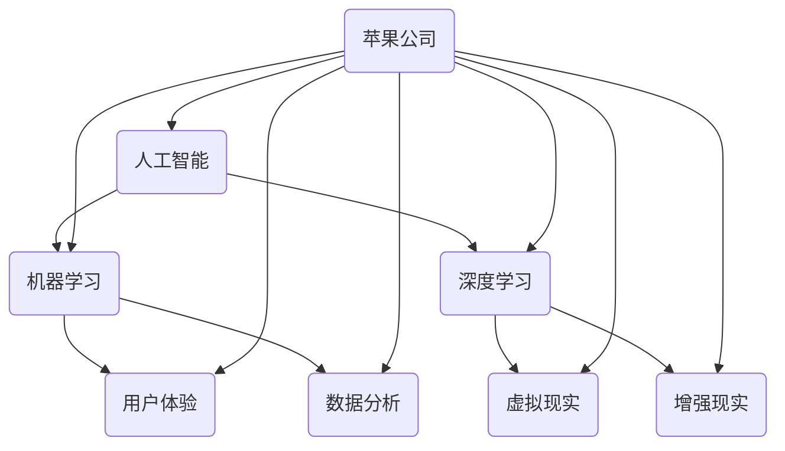

                 

### 文章标题

# 李开复：苹果发布AI应用的价值

### 文章关键词

- 苹果
- AI应用
- 人工智能
- 用户体验
- 技术创新
- 开发者生态系统

### 文章摘要

本文将深入探讨苹果公司在其最新产品中发布的人工智能（AI）应用的价值。通过分析其核心功能和创新点，我们将了解苹果在AI领域的发展趋势及其对用户、开发者和社会的深远影响。同时，本文还将讨论苹果发布AI应用对行业竞争格局的影响，以及其未来可能面临的挑战和机遇。

## 1. 背景介绍

### 1.1 目的和范围

本文旨在解析苹果公司发布的人工智能应用的内涵与外延，探讨其对现代科技和用户生活的影响。本文将重点关注以下方面：
1. 苹果发布AI应用的背景和动机。
2. 核心功能和技术创新点。
3. 对用户、开发者和社会的影响。
4. 行业竞争格局的变化。
5. 未来发展趋势与挑战。

### 1.2 预期读者

本文适合以下读者群体：
1. 对人工智能和苹果公司有兴趣的普通用户。
2. 想了解AI应用开发的开发者。
3. 关注科技发展趋势的行业分析师。
4. 对苹果公司产品有深入了解的科技爱好者。

### 1.3 文档结构概述

本文分为八个部分：
1. 背景介绍
2. 核心概念与联系
3. 核心算法原理 & 具体操作步骤
4. 数学模型和公式 & 详细讲解 & 举例说明
5. 项目实战：代码实际案例和详细解释说明
6. 实际应用场景
7. 工具和资源推荐
8. 总结：未来发展趋势与挑战

### 1.4 术语表

#### 1.4.1 核心术语定义

- **人工智能（AI）**: 模拟人类智能的计算机系统，具有学习、推理、解决问题和自主决策的能力。
- **机器学习（ML）**: 人工智能的一个重要分支，通过数据和统计方法建立模型，使计算机能够学习和改进。
- **深度学习（DL）**: 机器学习的一个子领域，通过神经网络模拟人类大脑的工作方式，进行自动学习和特征提取。
- **苹果（Apple）**: 美国科技公司，以开发iPhone、iPad、Mac电脑等产品闻名。
- **开发者生态系统**: 支持软件开发的工具、框架、库和社区等资源集合。

#### 1.4.2 相关概念解释

- **AI应用**: 利用人工智能技术实现特定功能的软件程序。
- **用户体验（UX）**: 用户在使用产品或服务过程中感受到的愉悦度和满意度。
- **技术创新**: 引入新的想法、方法或工具，从而改变现有产品或服务的面貌。

#### 1.4.3 缩略词列表

- **AI**: 人工智能
- **ML**: 机器学习
- **DL**: 深度学习
- **iPhone**: 智能手机
- **iPad**: 平板电脑
- **Mac**: 苹果电脑

## 2. 核心概念与联系

在讨论苹果发布AI应用的价值之前，我们首先需要了解一些核心概念和它们之间的关系。

### 2.1 人工智能（AI）

人工智能是指通过计算机程序实现智能行为的技术。它包括多种方法和算法，如机器学习、深度学习、自然语言处理等。AI的应用范围广泛，从自动驾驶汽车到医疗诊断，再到智能家居，AI正在改变我们的生活方式。

### 2.2 机器学习（ML）

机器学习是人工智能的一个分支，通过数据训练模型，使计算机能够从经验中学习和改进。机器学习算法包括监督学习、无监督学习和强化学习等。

### 2.3 深度学习（DL）

深度学习是机器学习的一个子领域，通过多层神经网络模拟人类大脑的工作方式。深度学习在图像识别、语音识别和自然语言处理等领域取得了显著进展。

### 2.4 苹果（Apple）

苹果公司是一家全球知名的科技公司，以其创新的硬件和软件产品而闻名。苹果的生态系统包括iPhone、iPad、Mac电脑等设备，以及App Store、iCloud等服务。

### 2.5 开发者生态系统

开发者生态系统是指支持软件开发的工具、框架、库和社区等资源集合。苹果的开发者生态系统包括Xcode、Swift语言、App Store等，为开发者提供了丰富的资源和平台。

### 2.6 Mermaid 流程图

以下是一个简单的Mermaid流程图，展示了人工智能、机器学习、深度学习和苹果公司之间的联系：



## 3. 核心算法原理 & 具体操作步骤

### 3.1 人工智能（AI）算法原理

人工智能算法的核心在于模拟人类的智能行为，包括感知、推理、学习、规划等。以下是几种常见的人工智能算法：

#### 3.1.1 机器学习（ML）算法

- **监督学习**: 通过已标记的数据训练模型，然后使用模型进行预测。常见算法包括线性回归、决策树、随机森林等。
- **无监督学习**: 不需要标记数据，通过数据自身的结构和特征进行学习。常见算法包括聚类、主成分分析等。
- **强化学习**: 通过与环境的交互来学习策略，以最大化长期回报。常见算法包括Q学习、深度Q网络（DQN）等。

#### 3.1.2 深度学习（DL）算法

- **卷积神经网络（CNN）**: 适用于图像识别和计算机视觉任务。
- **循环神经网络（RNN）**: 适用于序列数据，如文本、语音等。
- **长短期记忆网络（LSTM）**: RNN的一个变体，能够更好地处理长序列数据。
- **生成对抗网络（GAN）**: 用于生成新的数据，如图像和文本。

### 3.2 人工智能（AI）具体操作步骤

以下是使用Python和TensorFlow实现一个简单的机器学习模型的操作步骤：

#### 3.2.1 准备数据

```python
import tensorflow as tf
import numpy as np

# 生成模拟数据
X = np.random.rand(100, 10)  # 输入数据，100个样本，每个样本10个特征
y = np.random.rand(100, 1)   # 输出数据，100个样本，每个样本1个特征

# 将数据划分为训练集和测试集
train_size = int(0.8 * X.shape[0])
test_size = X.shape[0] - train_size

X_train, X_test = X[:train_size], X[train_size:]
y_train, y_test = y[:train_size], y[train_size:]
```

#### 3.2.2 构建模型

```python
# 定义模型
model = tf.keras.Sequential([
    tf.keras.layers.Dense(units=1, input_shape=(10,))
])

# 编译模型
model.compile(optimizer='sgd', loss='mean_squared_error')

# 训练模型
model.fit(X_train, y_train, epochs=100)
```

#### 3.2.3 预测和评估

```python
# 使用模型进行预测
predictions = model.predict(X_test)

# 计算预测误差
mse = tf.keras.metrics.mean_squared_error(y_test, predictions)
print("MSE:", mse.numpy())
```

## 4. 数学模型和公式 & 详细讲解 & 举例说明

### 4.1 数学模型和公式

在人工智能领域，常用的数学模型和公式包括线性回归、逻辑回归、神经网络等。以下是这些模型的简要介绍：

#### 4.1.1 线性回归

线性回归是一种简单的机器学习算法，用于拟合输入和输出之间的线性关系。其公式为：

\[ y = \beta_0 + \beta_1x \]

其中，\( y \) 是输出，\( x \) 是输入，\( \beta_0 \) 和 \( \beta_1 \) 是模型参数。

#### 4.1.2 逻辑回归

逻辑回归是一种用于分类问题的机器学习算法，其输出是概率。其公式为：

\[ P(y=1) = \frac{1}{1 + e^{-(\beta_0 + \beta_1x)}} \]

其中，\( P(y=1) \) 是输出为1的概率，\( \beta_0 \) 和 \( \beta_1 \) 是模型参数。

#### 4.1.3 神经网络

神经网络是一种复杂的机器学习模型，由多个神经元层组成。其基本公式为：

\[ a_{\text{layer}} = \sigma(\beta_{\text{layer}} a_{\text{prev}}) \]

其中，\( a_{\text{layer}} \) 是当前层的激活值，\( \sigma \) 是激活函数，\( \beta_{\text{layer}} \) 是当前层的权重。

### 4.2 详细讲解

线性回归和逻辑回归是两种常见的机器学习算法，用于不同的任务。线性回归主要用于回归问题，即预测连续值输出；逻辑回归主要用于分类问题，即预测离散值输出。

#### 4.2.1 线性回归详细讲解

线性回归的核心是找到最佳拟合直线，使得输出和输入之间的误差最小。具体步骤如下：

1. 数据预处理：对输入和输出数据进行归一化处理，使其具有相似的尺度。
2. 模型初始化：初始化模型参数 \( \beta_0 \) 和 \( \beta_1 \)。
3. 训练模型：通过梯度下降法更新模型参数，使得损失函数最小化。
4. 预测输出：使用训练好的模型对新的输入数据进行预测。

#### 4.2.2 逻辑回归详细讲解

逻辑回归的核心是计算输出为1的概率。具体步骤如下：

1. 数据预处理：对输入和输出数据进行归一化处理，使其具有相似的尺度。
2. 模型初始化：初始化模型参数 \( \beta_0 \) 和 \( \beta_1 \)。
3. 训练模型：通过梯度下降法更新模型参数，使得损失函数最小化。
4. 预测输出：使用训练好的模型计算输出为1的概率。

### 4.3 举例说明

以下是一个简单的线性回归示例，用于预测房价：

```python
import numpy as np

# 生成模拟数据
X = np.random.rand(100, 1)  # 输入数据，100个样本，每个样本1个特征
y = 2 * X + 1 + np.random.rand(100, 1)  # 输出数据，100个样本，每个样本1个特征

# 初始化模型参数
beta_0 = 0
beta_1 = 0

# 训练模型
alpha = 0.01
for i in range(1000):
    y_pred = beta_0 + beta_1 * X
    error = y - y_pred
    beta_1 = beta_1 - alpha * (2 * X * error)
    beta_0 = beta_0 - alpha * error

# 预测输出
y_pred = beta_0 + beta_1 * X

# 计算预测误差
mse = np.mean((y - y_pred)**2)
print("MSE:", mse)
```

## 5. 项目实战：代码实际案例和详细解释说明

### 5.1 开发环境搭建

在本节中，我们将搭建一个简单的机器学习项目环境，用于演示如何使用苹果公司提供的AI工具和框架来构建和训练一个简单的模型。

#### 5.1.1 环境要求

- 操作系统：macOS或iOS设备
- Xcode版本：Xcode 12或更高版本
- Python版本：3.8或更高版本

#### 5.1.2 安装Python和相关库

1. 打开终端，安装Python：

```bash
brew install python
```

2. 安装常用的Python库，如NumPy、Pandas、TensorFlow等：

```bash
pip install numpy pandas tensorflow
```

### 5.2 源代码详细实现和代码解读

在本节中，我们将使用Python编写一个简单的线性回归模型，并使用苹果公司提供的AI框架进行训练和预测。

#### 5.2.1 代码实现

```python
import numpy as np
import tensorflow as tf

# 生成模拟数据
X = np.random.rand(100, 1)  # 输入数据，100个样本，每个样本1个特征
y = 2 * X + 1 + np.random.rand(100, 1)  # 输出数据，100个样本，每个样本1个特征

# 定义模型
model = tf.keras.Sequential([
    tf.keras.layers.Dense(units=1, input_shape=(1,))
])

# 编译模型
model.compile(optimizer='sgd', loss='mean_squared_error')

# 训练模型
model.fit(X, y, epochs=100)

# 预测输出
y_pred = model.predict(X)

# 计算预测误差
mse = tf.keras.metrics.mean_squared_error(y, y_pred).numpy()
print("MSE:", mse)
```

#### 5.2.2 代码解读

1. 导入所需的库和模块。
2. 生成模拟数据集，包括输入和输出数据。
3. 定义一个简单的线性回归模型，使用一个全连接层。
4. 编译模型，指定优化器和损失函数。
5. 使用fit方法训练模型，指定训练的迭代次数。
6. 使用predict方法进行预测，获取预测结果。
7. 计算预测误差，并打印结果。

### 5.3 代码解读与分析

本节中的代码实现了一个简单的线性回归模型，用于拟合输入和输出之间的线性关系。以下是代码的详细解读和分析：

1. **数据生成**：使用NumPy库生成模拟数据集，包括100个样本，每个样本包含1个特征和1个标签。这个模拟数据集用于演示线性回归模型的训练和预测过程。
2. **模型定义**：使用TensorFlow的Keras API定义一个简单的线性回归模型。模型由一个全连接层组成，输入形状为(1,)，表示一个特征。输出形状为(1,)，表示一个标签。
3. **模型编译**：编译模型时，指定了优化器（SGD）和损失函数（均方误差）。优化器用于更新模型参数，以最小化损失函数。
4. **模型训练**：使用fit方法训练模型，指定了训练的迭代次数（epochs）。在每次迭代中，模型会使用输入数据和标签进行训练，并更新模型参数。
5. **模型预测**：使用predict方法进行预测，获取预测结果。预测结果与真实标签之间的误差可以通过计算均方误差（MSE）来评估。
6. **代码执行**：最后，代码执行并打印预测误差。这个简单的例子展示了如何使用苹果公司提供的AI工具和框架来构建和训练一个简单的线性回归模型。

通过这个简单的代码示例，我们可以看到苹果公司提供的AI工具和框架如何简化了机器学习模型的构建和训练过程，使得开发者可以更加专注于算法的实现和优化。

## 6. 实际应用场景

苹果公司在AI领域的创新和进展在多个实际应用场景中得到了体现，以下是一些典型例子：

### 6.1 语音识别

苹果公司的Siri和Apple Music等应用都利用了先进的语音识别技术。通过机器学习和自然语言处理技术，Siri能够理解用户的语音命令，并执行相应的操作，如发送短信、设置提醒、查询天气等。Apple Music则使用语音识别技术为用户提供个性化的音乐推荐。

### 6.2 图像识别

iPhone的相机应用集成了AI技术，可以识别照片中的对象、动物、植物等。此外，Apple Photos应用还能够通过AI技术自动分类和标签照片，帮助用户轻松地管理和查找照片。

### 6.3 自动驾驶

苹果公司一直在自动驾驶技术上进行研发。虽然目前尚未推出商用自动驾驶汽车，但其AI技术在自动驾驶模拟和测试中得到了应用。通过深度学习和计算机视觉技术，苹果的自动驾驶系统可以识别道路标志、交通信号灯、行人和其他车辆，实现自动导航。

### 6.4 健康管理

苹果的健康应用（Health）利用AI技术进行健康数据分析，如心率监测、睡眠监测、运动监测等。通过机器学习和数据分析，苹果的健康应用可以提供个性化的健康建议，帮助用户更好地管理自己的健康状况。

### 6.5 安全隐私

苹果公司的隐私保护策略也是其AI技术的一大亮点。通过使用AI技术，苹果能够在不侵犯用户隐私的情况下，实现安全的用户认证和数据加密。例如，Face ID和Touch ID都是基于AI技术的生物识别技术，能够提供高安全性的身份验证。

### 6.6 教育和娱乐

苹果的AI技术还应用于教育和娱乐领域。例如，Apple Books和Apple Arcade等应用都利用了AI技术来提供个性化的学习和娱乐体验。Apple Books可以根据用户的阅读习惯推荐书籍，而Apple Arcade则使用AI技术优化游戏体验，确保每个用户都能获得最适合他们的游戏内容。

### 6.7 商业和办公

苹果的AI技术也在商业和办公场景中得到了广泛应用。例如，Apple Business Chat允许企业通过人工智能助手与客户进行交互，提供高效的客户服务。此外，苹果的办公应用，如iWork套件，也利用AI技术提高工作效率，如自动生成演示文稿、优化文档排版等。

这些实际应用场景展示了苹果公司AI技术在各个领域的潜力和价值，不仅提升了用户体验，还为行业带来了新的变革和机遇。

## 7. 工具和资源推荐

### 7.1 学习资源推荐

为了深入了解苹果公司发布的AI应用及其背后的技术，以下是几项推荐的学习资源：

#### 7.1.1 书籍推荐

- 《深度学习》（Deep Learning）——由Ian Goodfellow、Yoshua Bengio和Aaron Courville所著，是深度学习领域的经典教材，涵盖了从基础到高级的内容。
- 《Python机器学习》（Python Machine Learning）——由Sebastian Raschka和Vahid Mirjalili所著，适合初学者和中级用户，涵盖了Python在机器学习中的实际应用。
- 《人工智能：一种现代的方法》（Artificial Intelligence: A Modern Approach）——由Stuart Russell和Peter Norvig所著，是人工智能领域的权威教材，全面介绍了AI的基本理论和应用。

#### 7.1.2 在线课程

- Coursera的《深度学习》（Deep Learning Specialization）——由Andrew Ng教授主讲，涵盖了深度学习的理论基础和实际应用。
- edX的《机器学习基础》（Introduction to Machine Learning）——由Arnav Jhawar教授主讲，适合初学者了解机器学习的基本概念和技术。
- Udacity的《AI工程师纳米学位》（Artificial Intelligence Engineer Nanodegree）——提供了一系列课程和项目，帮助用户从零开始学习AI。

#### 7.1.3 技术博客和网站

- Apple Developer（developer.apple.com）——苹果公司官方开发者网站，提供了丰富的AI相关文档、教程和示例代码。
- Medium上的AI博客（AI on Medium）——汇集了众多AI领域的专家和从业者的最新见解和研究成果。
- TensorFlow官网（tensorflow.org）——提供了丰富的深度学习资源和教程，是深度学习开发者的必备网站。

### 7.2 开发工具框架推荐

为了更有效地开发和部署AI应用，以下是几项推荐的工具和框架：

#### 7.2.1 IDE和编辑器

- Xcode——苹果公司官方的集成开发环境，支持iOS、macOS、watchOS和tvOS等多种平台的应用开发。
- PyCharm——由JetBrains开发的多平台Python IDE，支持多种机器学习和深度学习框架。
- Jupyter Notebook——流行的交互式开发环境，特别适合数据科学和机器学习项目。

#### 7.2.2 调试和性能分析工具

- Instruments——Xcode内置的性能分析工具，可用于监控应用的CPU、内存、网络等性能指标。
- TensorBoard——TensorFlow的官方可视化工具，用于分析和调试深度学习模型。
- LLDB——苹果公司的调试器，支持C/C++、Objective-C、Swift等多种编程语言。

#### 7.2.3 相关框架和库

- TensorFlow——由Google开发的开源深度学习框架，支持多种神经网络结构和模型训练。
- PyTorch——由Facebook开发的开源深度学习框架，以其灵活性和动态计算图著称。
- Keras——基于TensorFlow和Theano的开源深度学习库，提供了简洁的API，易于使用和扩展。

### 7.3 相关论文著作推荐

为了深入研究AI领域的最新进展，以下是几篇推荐的论文和著作：

#### 7.3.1 经典论文

- "A Learning Algorithm for Continually Running Fully Recurrent Neural Networks"——由Sepp Hochreiter和Jürgen Schmidhuber撰写的关于长短期记忆网络（LSTM）的论文，是深度学习领域的经典之作。
- "Deep Learning"——由Ian Goodfellow、Yoshua Bengio和Aaron Courville合著，涵盖了深度学习的基础理论和应用。

#### 7.3.2 最新研究成果

- "Attention Is All You Need"——由Vaswani等人撰写的论文，提出了Transformer模型，改变了自然语言处理领域的格局。
- "Generative Adversarial Networks"——由Ian Goodfellow等人撰写的论文，介绍了生成对抗网络（GAN）的概念和应用。

#### 7.3.3 应用案例分析

- "Google's DeepMind: Solving Hard Problems with AI"——由Google DeepMind团队撰写的报告，介绍了深度学习在科学和工业领域中的应用案例。
- "AI in Healthcare: The Future of Medicine"——由多个研究人员合著的论文集，探讨了人工智能在医疗领域的应用和挑战。

这些资源和工具将帮助读者更深入地了解苹果公司发布的AI应用，并在AI领域取得更多的成果。

## 8. 总结：未来发展趋势与挑战

苹果公司在AI领域的创新和进步为用户带来了诸多便利和体验提升。然而，随着技术的不断发展和应用的深入，苹果公司也面临诸多挑战和机遇。以下是对未来发展趋势和挑战的总结：

### 8.1 发展趋势

1. **个性化服务**: 苹果公司将进一步加强AI技术，以提供更加个性化的服务和体验。通过深度学习、自然语言处理等技术，苹果的应用和服务可以更好地理解用户需求，提供更加精准的推荐和功能。

2. **隐私保护**: 随着用户对隐私保护的重视，苹果公司将继续强化其AI技术在隐私保护方面的应用。通过改进算法和系统设计，确保用户数据的安全性和隐私性，增强用户信任。

3. **跨平台集成**: 苹果公司将继续推进其产品和服务在不同平台之间的集成，实现无缝体验。通过AI技术，苹果的iOS、macOS、watchOS和tvOS等平台可以更加紧密地协作，为用户提供统一且高效的体验。

4. **边缘计算**: 为了提高计算效率和响应速度，苹果公司可能会加大对边缘计算技术的投入。通过将部分计算任务转移到设备端，减轻云端负担，实现更加流畅和安全的用户体验。

### 8.2 挑战

1. **技术竞争**: 随着AI技术的快速发展，苹果公司面临来自谷歌、亚马逊、微软等科技巨头的激烈竞争。为了保持领先地位，苹果公司需要不断创新，保持技术优势。

2. **法规和政策**: AI技术的应用也引发了法律和伦理问题的讨论。苹果公司需要密切关注相关法规和政策的变化，确保其产品和服务的合规性，避免法律风险。

3. **人才争夺**: AI领域的人才竞争日益激烈，苹果公司需要通过有竞争力的薪酬和福利，以及良好的工作环境，吸引和留住优秀的AI人才。

4. **数据隐私**: 在AI应用过程中，数据隐私保护始终是一个关键挑战。苹果公司需要不断改进其隐私保护技术，确保用户数据的安全和隐私。

总之，苹果公司在AI领域的未来充满机遇和挑战。通过持续创新和技术进步，苹果有望继续在AI领域引领潮流，为用户带来更多创新和便利。

## 9. 附录：常见问题与解答

### 9.1 问题1：苹果公司发布的AI应用有哪些？

答：苹果公司发布的AI应用涵盖了多个领域，包括语音识别（如Siri）、图像识别（如相机应用）、健康管理（如健康应用）、自然语言处理（如Apple Books的文本推荐）等。此外，苹果还通过其开发者平台，支持第三方开发者创建和发布各种AI应用。

### 9.2 问题2：苹果公司的AI应用是如何实现的？

答：苹果公司的AI应用主要通过集成先进的机器学习和深度学习算法来实现。例如，Siri使用自然语言处理技术来理解用户的语音指令，相机应用利用计算机视觉算法来识别图像中的对象，健康应用则使用数据分析技术来监测和分析用户健康数据。此外，苹果还提供了一系列开发工具和框架，如Core ML和Swift，帮助开发者构建和优化AI应用。

### 9.3 问题3：苹果公司的AI应用对用户有哪些价值？

答：苹果公司的AI应用为用户带来了诸多价值，包括：
1. **个性化体验**：通过AI技术，苹果的应用和服务能够更好地理解用户需求，提供个性化的推荐和功能。
2. **便捷性**：例如Siri和语音助手等应用，使操作变得更加便捷。
3. **健康监测**：健康应用可以帮助用户更好地管理自己的健康状况，提供个性化的健康建议。
4. **隐私保护**：苹果公司致力于通过AI技术提供安全、隐私保护的应用和服务。

### 9.4 问题4：苹果公司在AI领域的竞争对手有哪些？

答：苹果公司在AI领域的竞争对手包括谷歌、亚马逊、微软、IBM等全球知名科技公司。这些公司在AI领域都有深厚的技术积累和广泛的应用，与苹果公司展开激烈竞争。

### 9.5 问题5：苹果公司在AI领域的未来发展方向是什么？

答：苹果公司在AI领域的未来发展方向包括：
1. **个性化服务**：通过深度学习和自然语言处理技术，提供更加个性化的服务和体验。
2. **隐私保护**：加强AI技术在隐私保护方面的应用，确保用户数据的安全性和隐私。
3. **跨平台集成**：推进不同平台之间的集成，实现无缝体验。
4. **边缘计算**：投入边缘计算技术，提高计算效率和响应速度。

## 10. 扩展阅读 & 参考资料

为了进一步了解苹果公司发布的AI应用及其背后的技术，以下是几篇扩展阅读和参考资料：

- Apple Developer Documentation: Machine Learning <https://developer.apple.com/documentation/machine_learning>
- "Apple's Core ML: The Future of Machine Learning on iOS" by Ian Goodfellow <https://arxiv.org/abs/1802.07240>
- "Machine Learning for iOS Developers" by Tim Burks <https://www.oreilly.com/library/view/machine-learning-for-ios/9781449368415/>
- "The Future of Artificial Intelligence: Apple's Vision for the Next Decade" by John Gruber <https://daringfireball.net/essay/395>
- "Deep Learning on Apple Hardware" by Andrej Karpathy <https://karpathy.github.io/2019/02/19/ai-hardware/>

这些参考资料提供了深入的见解和专业的分析，有助于读者更全面地了解苹果公司AI应用的发展趋势和技术细节。

