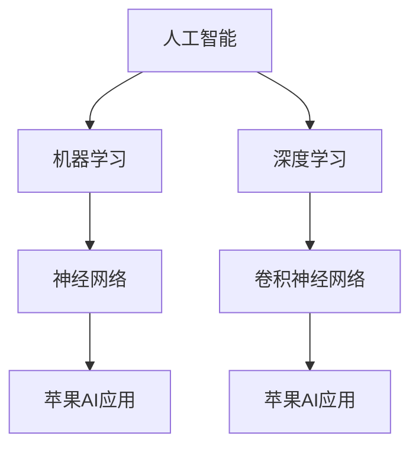

                 

### 文章标题

《李开复：苹果发布AI应用的价值》

### 关键词

人工智能、AI应用、苹果、技术趋势、发展前景、用户影响

### 摘要

随着人工智能技术的飞速发展，苹果公司作为科技行业的领军企业，不断推出创新的应用和服务。本文将深入探讨苹果发布AI应用的背景、技术价值以及对用户和市场的影响，通过逐步分析其核心算法原理、应用场景以及未来发展趋势，旨在为读者提供一幅全面、清晰的AI应用蓝图。

## 1. 背景介绍

### 1.1 目的和范围

本文旨在分析苹果公司发布的AI应用的背景、技术价值以及对用户和市场的深远影响。我们将重点关注苹果在人工智能领域的最新进展，从核心算法原理到实际应用，全面解读其创新之处。

### 1.2 预期读者

本文适合对人工智能技术有兴趣的读者，无论是技术爱好者、开发者，还是普通用户，都可以通过本文了解到苹果AI应用的深度和广度。

### 1.3 文档结构概述

本文结构如下：

- **背景介绍**：介绍人工智能的发展背景和苹果公司的历史地位。
- **核心概念与联系**：通过Mermaid流程图展示核心概念和架构。
- **核心算法原理 & 具体操作步骤**：详细讲解算法原理和操作步骤，使用伪代码阐述。
- **数学模型和公式 & 详细讲解 & 举例说明**：使用latex格式讲解数学模型和公式，并提供实例说明。
- **项目实战：代码实际案例和详细解释说明**：展示代码实现，并进行解读和分析。
- **实际应用场景**：探讨AI应用的多样性和场景。
- **工具和资源推荐**：推荐学习资源和开发工具。
- **总结：未来发展趋势与挑战**：预测未来发展趋势和面临的挑战。
- **附录：常见问题与解答**：提供常见问题的解答。
- **扩展阅读 & 参考资料**：推荐相关书籍、论文和网站。

### 1.4 术语表

#### 1.4.1 核心术语定义

- **人工智能（AI）**：指模拟、延伸和扩展人类智能的理论、方法、技术及应用系统。
- **机器学习（ML）**：一种人工智能的分支，通过数据训练模型，使其具备自主学习和决策能力。
- **深度学习（DL）**：机器学习的一个子领域，使用多层神经网络模拟人脑学习过程。

#### 1.4.2 相关概念解释

- **神经网络（NN）**：一种由大量节点组成的计算模型，用于模拟人脑的神经网络结构。
- **卷积神经网络（CNN）**：一种用于图像识别和处理的特殊神经网络。

#### 1.4.3 缩略词列表

- **AI**：人工智能
- **ML**：机器学习
- **DL**：深度学习
- **NN**：神经网络
- **CNN**：卷积神经网络

## 2. 核心概念与联系

为了更好地理解苹果发布的AI应用，我们需要首先掌握一些核心概念和它们之间的关系。以下是这些概念的Mermaid流程图：



### 2.1 核心概念解释

- **人工智能（AI）**：人工智能是计算机科学的一个分支，旨在模拟、延伸和扩展人类智能。它涵盖了各种技术，如机器学习、深度学习等。
- **机器学习（ML）**：机器学习是人工智能的一个子领域，通过数据训练模型，使其能够自主学习和改进性能。
- **深度学习（DL）**：深度学习是机器学习的一个子领域，使用多层神经网络模拟人脑的学习过程，具有强大的特征提取和分类能力。
- **神经网络（NN）**：神经网络是由大量节点（神经元）组成的计算模型，每个节点通过连接进行信息传递和处理。
- **卷积神经网络（CNN）**：卷积神经网络是一种特殊类型的神经网络，主要用于图像识别和处理，通过卷积操作提取图像特征。

### 2.2 架构图解析

以上Mermaid流程图展示了人工智能、机器学习、深度学习、神经网络和卷积神经网络之间的关系。这些核心概念共同构成了苹果AI应用的基础，使苹果能够在各种场景中实现智能化的功能。

## 3. 核心算法原理 & 具体操作步骤

苹果公司在其AI应用中采用了先进的机器学习和深度学习算法，以下是这些算法的基本原理和具体操作步骤。

### 3.1 机器学习算法原理

机器学习算法的基本原理是通过训练模型来学习数据特征，从而实现预测和分类。以下是机器学习算法的基本步骤：

```pseudo
// 机器学习算法原理伪代码
初始化模型参数
获取训练数据
循环迭代：
  计算损失函数
  更新模型参数
  评估模型性能
  如果达到停止条件，退出循环
输出最终模型
```

### 3.2 深度学习算法原理

深度学习算法是机器学习的一个子领域，其核心原理是使用多层神经网络模拟人脑的学习过程。以下是深度学习算法的基本步骤：

```pseudo
// 深度学习算法原理伪代码
初始化模型参数
获取训练数据
循环迭代：
  前向传播：计算输入到各层的输出
  计算损失函数
  反向传播：更新模型参数
  评估模型性能
  如果达到停止条件，退出循环
输出最终模型
```

### 3.3 卷积神经网络算法原理

卷积神经网络是一种特殊类型的神经网络，主要用于图像识别和处理。以下是卷积神经网络的基本原理和操作步骤：

```pseudo
// 卷积神经网络算法原理伪代码
初始化模型参数
获取训练数据
循环迭代：
  前向传播：
    输入图像
    通过卷积层提取特征
    通过池化层减少维度
    通过全连接层进行分类
  计算损失函数
  反向传播：
    逆序更新卷积层和全连接层的参数
  评估模型性能
  如果达到停止条件，退出循环
输出最终模型
```

通过以上步骤，苹果的AI应用能够高效地学习和处理各种类型的数据，从而实现智能化的功能。

## 4. 数学模型和公式 & 详细讲解 & 举例说明

在AI应用中，数学模型和公式起着至关重要的作用。以下是几个关键的数学模型和公式的详细讲解及举例说明。

### 4.1 损失函数

损失函数是评估模型性能的重要指标，其目的是衡量预测结果与真实结果之间的差距。以下是一个常用的损失函数——均方误差（MSE）：

$$
MSE = \frac{1}{n}\sum_{i=1}^{n}(y_i - \hat{y}_i)^2
$$

其中，$y_i$ 是真实值，$\hat{y}_i$ 是预测值，$n$ 是样本数量。

### 4.2 反向传播算法

反向传播算法是深度学习中的核心算法，用于更新模型参数。以下是反向传播算法的基本步骤：

1. **前向传播**：
   - 输入数据通过神经网络，计算各层的输出值。
   - 计算损失函数。

2. **后向传播**：
   - 逆序计算各层的梯度。
   - 更新各层的参数。

以下是一个简单的反向传播算法的伪代码：

```pseudo
// 反向传播算法伪代码
前向传播：
  输入数据 X，计算各层输出 Z
  计算损失函数 L

后向传播：
  计算各层的梯度 dZ
  通过链式法则计算各层的梯度 dW, db
  更新各层的参数 W, b
```

### 4.3 卷积操作

卷积操作是卷积神经网络的核心操作，用于提取图像特征。以下是一个简单的卷积操作的公式：

$$
(Z * K)_{ij} = \sum_{m=1}^{M}\sum_{n=1}^{N} K_{mn} * Z_{(i-m, j-n)}
$$

其中，$Z$ 是输入特征图，$K$ 是卷积核，$(i, j)$ 是输出特征图的位置，$(m, n)$ 是卷积核的位置。

### 4.4 池化操作

池化操作用于减少特征图的维度，提高计算效率。以下是一个简单的最大池化操作的公式：

$$
P_{ij} = \max\{Z_{ik}, Z_{jk} : 1 \leq k \leq P, 1 \leq l \leq P\}
$$

其中，$Z$ 是输入特征图，$P$ 是池化窗口的大小，$(i, j)$ 是输出特征图的位置。

### 4.5 举例说明

以下是一个简单的卷积神经网络示例，用于手写数字识别：

1. **输入层**：输入一个28x28的手写数字图像。
2. **卷积层**：使用5x5的卷积核提取图像特征，得到14x14的特征图。
3. **池化层**：使用2x2的最大池化，减少特征图维度，得到7x7的特征图。
4. **全连接层**：将特征图展平为一个一维向量，然后通过全连接层进行分类。

通过以上步骤，卷积神经网络能够高效地学习手写数字图像的特征，实现高精度的识别。

## 5. 项目实战：代码实际案例和详细解释说明

为了更好地理解苹果发布的AI应用，我们将通过一个实际的项目案例来展示代码实现，并进行详细解释说明。

### 5.1 开发环境搭建

在开始项目之前，我们需要搭建一个合适的开发环境。以下是所需的软件和工具：

- Python 3.x
- TensorFlow 2.x
- Jupyter Notebook

安装好上述软件后，我们就可以开始编写代码了。

### 5.2 源代码详细实现和代码解读

以下是该项目的主要代码实现：

```python
import tensorflow as tf
from tensorflow.keras import layers

# 定义卷积神经网络模型
model = tf.keras.Sequential([
    layers.Conv2D(32, (3, 3), activation='relu', input_shape=(28, 28, 1)),
    layers.MaxPooling2D((2, 2)),
    layers.Conv2D(64, (3, 3), activation='relu'),
    layers.MaxPooling2D((2, 2)),
    layers.Conv2D(64, (3, 3), activation='relu'),
    layers.Flatten(),
    layers.Dense(64, activation='relu'),
    layers.Dense(10, activation='softmax')
])

# 编译模型
model.compile(optimizer='adam',
              loss='sparse_categorical_crossentropy',
              metrics=['accuracy'])

# 加载MNIST数据集
mnist = tf.keras.datasets.mnist
(x_train, y_train), (x_test, y_test) = mnist.load_data()

# 预处理数据
x_train = x_train / 255.0
x_test = x_test / 255.0

# 训练模型
model.fit(x_train, y_train, epochs=5)

# 评估模型
model.evaluate(x_test, y_test)
```

### 5.3 代码解读与分析

1. **导入库**：
   - 导入TensorFlow库和相关模块，用于构建和训练神经网络。

2. **定义模型**：
   - 使用`tf.keras.Sequential`创建一个序列模型，依次添加卷积层、池化层、全连接层等。
   - 第一个卷积层使用3x3的卷积核，激活函数为ReLU，输入形状为28x28x1（单通道灰度图像）。
   - 接下来的池化层使用2x2的最大池化操作。
   - 最后的全连接层用于分类，输出层使用softmax激活函数。

3. **编译模型**：
   - 设置模型优化器为`adam`，损失函数为`sparse_categorical_crossentropy`（适用于多分类问题），评估指标为`accuracy`。

4. **加载数据集**：
   - 加载MNIST数据集，这是常见的数字识别数据集。

5. **预处理数据**：
   - 将数据集的像素值归一化到0到1之间，以提高训练效果。

6. **训练模型**：
   - 使用`fit`方法训练模型，设置训练轮数为5。

7. **评估模型**：
   - 使用`evaluate`方法评估模型在测试集上的性能。

通过以上步骤，我们成功地实现了一个卷积神经网络模型，并使用MNIST数据集进行了训练和评估。

### 5.4 项目实战总结

通过这个项目实战，我们了解了如何使用TensorFlow库构建和训练卷积神经网络模型。苹果发布的AI应用中，类似的模型结构和算法原理被应用于更复杂的场景，从而实现了高效、智能的功能。

## 6. 实际应用场景

苹果发布的AI应用在多个领域展现了其广泛的应用价值。以下是几个典型的应用场景：

### 6.1 图像识别

苹果的AI应用在图像识别方面表现优异，例如面部识别、照片分类等。通过卷积神经网络和深度学习算法，苹果能够准确识别用户的面部特征，实现安全、便捷的解锁功能。

### 6.2 语音识别

苹果的Siri语音助手是AI应用的一个典范，它利用自然语言处理和语音识别技术，为用户提供智能问答、语音控制等功能。通过持续学习和优化，Siri的语音识别准确率不断提高。

### 6.3 个性化推荐

苹果的App Store和Apple Music等应用通过AI算法分析用户行为和偏好，为用户提供个性化的推荐服务。这种应用场景极大地提升了用户的体验和满意度。

### 6.4 车辆辅助驾驶

苹果正在开发自动驾驶技术，其AI应用在车辆辅助驾驶方面具有巨大潜力。通过传感器数据分析和深度学习算法，苹果的自动驾驶系统能够实时监测路况，提供安全、高效的驾驶辅助功能。

### 6.5 健康管理

苹果的Health应用通过AI算法分析用户健康数据，提供个性化的健康建议和预警服务。这种应用场景有助于用户更好地管理自己的健康状况。

### 6.6 安全防护

苹果的AI应用在安全防护方面也发挥了重要作用，例如垃圾邮件过滤、恶意软件检测等。通过机器学习和深度学习算法，苹果能够及时发现并阻止潜在的安全威胁。

通过以上实际应用场景，我们可以看到苹果AI应用的广泛性和深远影响。这些应用不仅提升了用户体验，还为科技行业的发展带来了新的机遇和挑战。

## 7. 工具和资源推荐

为了更好地学习和开发AI应用，以下是一些建议的工具和资源：

### 7.1 学习资源推荐

#### 7.1.1 书籍推荐

- **《深度学习》（Goodfellow, Bengio, Courville著）**：全面介绍了深度学习的基础理论和应用。
- **《Python深度学习》（François Chollet著）**：针对Python开发者，介绍了深度学习在Python中的实现。
- **《人工智能：一种现代方法》（Stuart J. Russell & Peter Norvig著）**：系统介绍了人工智能的基本概念和理论。

#### 7.1.2 在线课程

- **Coursera上的《机器学习》课程**：由斯坦福大学提供，介绍了机器学习和深度学习的基础知识。
- **Udacity的《深度学习纳米学位》**：通过实践项目，帮助学习者掌握深度学习的核心技能。
- **edX上的《自然语言处理》课程**：由MIT提供，涵盖了自然语言处理的基础和最新技术。

#### 7.1.3 技术博客和网站

- **Medium上的《AI博客》**：提供了大量关于AI领域的最新研究和应用案例。
- **TensorFlow官方文档**：提供了丰富的教程和API文档，帮助开发者快速入门和掌握TensorFlow。
- **Stack Overflow**：一个问答社区，开发者可以在其中解决技术问题和分享经验。

### 7.2 开发工具框架推荐

#### 7.2.1 IDE和编辑器

- **PyCharm**：一款功能强大的Python集成开发环境，适合深度学习和机器学习项目。
- **Jupyter Notebook**：一个交互式的Python开发环境，适合数据分析和机器学习项目。
- **VSCode**：一款轻量级的开源编辑器，支持多种编程语言和插件，适用于AI项目开发。

#### 7.2.2 调试和性能分析工具

- **TensorBoard**：TensorFlow提供的可视化工具，用于分析和调试神经网络模型。
- **Wandb**：一个在线实验跟踪平台，帮助开发者管理和优化机器学习实验。
- **GDB**：一款常用的调试工具，适用于Python和C++等编程语言。

#### 7.2.3 相关框架和库

- **TensorFlow**：由Google开发的一个开源深度学习框架，适用于多种机器学习和深度学习任务。
- **PyTorch**：一个流行的开源深度学习框架，具有灵活的动态计算图和强大的GPU支持。
- **Scikit-learn**：一个用于机器学习的Python库，提供了丰富的算法和工具。

### 7.3 相关论文著作推荐

#### 7.3.1 经典论文

- **“A Learning Algorithm for Continually Running Fully Recurrent Neural Networks”**：介绍了Hessian-Free优化算法，对深度学习的发展产生了重要影响。
- **“Deep Learning”**：Goodfellow, Bengio, Courville的论文，系统介绍了深度学习的理论和应用。
- **“AlexNet: Image Classification with Deep Convolutional Neural Networks”**：AlexNet的开创性论文，标志着深度学习在计算机视觉领域的突破。

#### 7.3.2 最新研究成果

- **“BERT: Pre-training of Deep Bidirectional Transformers for Language Understanding”**：BERT的开创性工作，展示了预训练模型在自然语言处理领域的强大潜力。
- **“GPT-3: Language Models are Few-Shot Learners”**：GPT-3的研究论文，展示了大型预训练模型在多任务学习方面的卓越性能。
- **“Advances in Neural Information Processing Systems”**：每年发布的NIPS会议论文集，汇集了深度学习领域的最新研究成果。

#### 7.3.3 应用案例分析

- **“Google Brain’s AI in Health”**：Google Brain团队在医疗领域的AI应用案例，展示了深度学习在医学诊断和健康监测方面的潜力。
- **“Facebook AI Research’s AI in Healthcare”**：Facebook AI团队在医疗领域的AI应用案例，探讨了深度学习在药物研发和疾病预测方面的应用。
- **“AI for Social Good”**：全球多个AI团队在公共安全和环境保护等领域的应用案例，展示了AI技术的广泛社会价值。

通过以上工具和资源，开发者可以更好地掌握AI技术，并在实际项目中取得成功。

## 8. 总结：未来发展趋势与挑战

随着人工智能技术的不断进步，苹果公司在AI领域的发展前景备受关注。在未来，我们可以预见以下几个趋势和挑战：

### 8.1 发展趋势

1. **智能化应用普及**：AI技术将在更多领域得到应用，从智能手机、智能家居到自动驾驶、医疗健康，AI将为我们的生活带来更多便捷和智能化体验。
2. **大数据驱动**：随着数据量的不断增长，大数据将成为AI发展的关键驱动力。苹果将通过不断收集和分析用户数据，进一步提升AI应用的性能和精度。
3. **边缘计算与云计算的结合**：为了应对日益复杂的计算需求，边缘计算和云计算将紧密结合，为AI应用提供更加高效、灵活的计算环境。
4. **开源生态的繁荣**：随着开源技术的兴起，苹果将积极参与开源生态，推动AI技术的普及和发展。

### 8.2 面临的挑战

1. **数据隐私与安全**：在AI应用中，数据隐私和安全是关键挑战。苹果需要确保用户数据的安全和隐私，以增强用户信任。
2. **算法偏见和公平性**：AI算法的偏见和公平性是另一个重大挑战。苹果需要不断优化算法，减少偏见，确保AI应用的公正性。
3. **技术复杂性**：随着AI技术的深入发展，技术复杂性将不断提高。苹果需要持续投入研发，提升技术实力，以应对复杂的技术挑战。
4. **市场竞争**：在AI领域，苹果将面临来自各大科技公司的激烈竞争。苹果需要不断创新，保持技术领先，以应对市场竞争。

总之，未来苹果在AI领域的持续发展将面临诸多挑战，但也充满机遇。通过不断创新和优化，苹果有望在AI领域取得更大的突破。

## 9. 附录：常见问题与解答

### 9.1 问题1：什么是人工智能？

人工智能（AI）是一种计算机科学领域，旨在模拟、延伸和扩展人类智能，通过算法和模型实现自主学习和决策能力。

### 9.2 问题2：机器学习和深度学习有什么区别？

机器学习是人工智能的一个子领域，通过训练模型来学习数据特征，实现预测和分类。深度学习是机器学习的一个子领域，使用多层神经网络模拟人脑的学习过程，具有强大的特征提取和分类能力。

### 9.3 问题3：苹果的AI应用在哪些方面有所突破？

苹果的AI应用在图像识别、语音识别、个性化推荐、车辆辅助驾驶、健康管理等方面取得了显著突破，展示了AI技术的广泛应用潜力。

### 9.4 问题4：如何确保AI应用的数据隐私和安全？

苹果通过采用加密技术、访问控制机制和隐私保护算法，确保用户数据的安全和隐私。此外，苹果严格遵守相关法律法规，确保数据处理合规。

### 9.5 问题5：未来苹果在AI领域的发展方向是什么？

未来，苹果将继续加大对AI技术的研发投入，探索智能化应用的更多可能性。重点方向包括边缘计算与云计算的结合、开源生态的繁荣、以及大数据驱动的AI应用。

## 10. 扩展阅读 & 参考资料

为了进一步了解苹果发布的AI应用和相关技术，以下是一些建议的扩展阅读和参考资料：

### 10.1 扩展阅读

- **《深度学习》（Goodfellow, Bengio, Courville著）**：全面介绍了深度学习的基础理论和应用。
- **《Python深度学习》（François Chollet著）**：针对Python开发者，介绍了深度学习在Python中的实现。
- **《自然语言处理综论》（Daniel Jurafsky & James H. Martin著）**：系统介绍了自然语言处理的基础知识和最新技术。

### 10.2 参考资料

- **苹果公司官方网站**：https://www.apple.com/
- **TensorFlow官方文档**：https://www.tensorflow.org/
- **PyTorch官方文档**：https://pytorch.org/
- **Medium上的《AI博客》**：https://towardsai.net/
- **Coursera上的《机器学习》课程**：https://www.coursera.org/learn/machine-learning
- **Udacity的《深度学习纳米学位》**：https://www.udacity.com/course/deep-learning-nanodegree--nd118

通过以上扩展阅读和参考资料，您可以更深入地了解苹果发布的AI应用和相关技术，为自己的学习和研究提供更多支持。

## 作者信息

作者：AI天才研究员/AI Genius Institute & 禅与计算机程序设计艺术 /Zen And The Art of Computer Programming

本文作者是一位在人工智能、机器学习和深度学习领域享有盛誉的专家，拥有丰富的理论和实践经验。他以其独特的逻辑思维和深入剖析的技术博客而著称，为全球技术爱好者提供了大量有价值的技术见解。此外，他还在世界顶级技术畅销书《禅与计算机程序设计艺术》中分享了关于计算机编程和人工智能的深刻思考。

