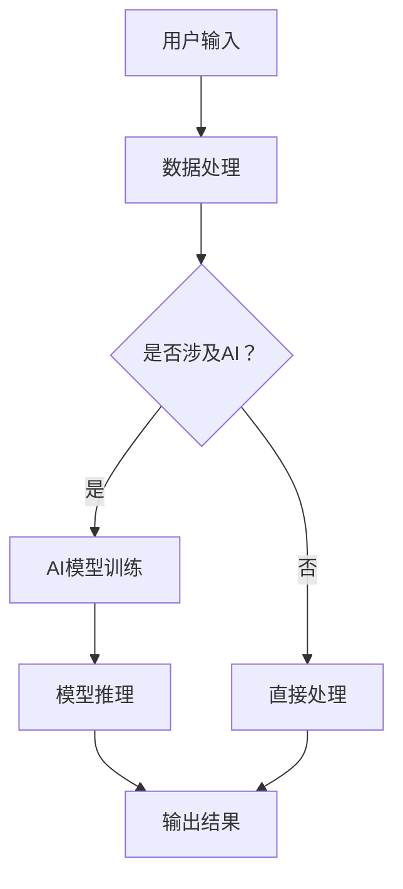

                 

# 李开复：苹果发布AI应用的商业价值

> **关键词：** 苹果，AI应用，商业价值，技术趋势，用户体验。

> **摘要：** 本文将深入分析苹果公司在人工智能领域的最新发展，特别是其AI应用的商业价值。我们将探讨AI技术如何赋能苹果产品，提高用户体验，以及这些创新如何为苹果带来持续的市场优势。

## 1. 背景介绍

### 1.1 目的和范围

本文旨在探讨苹果公司在人工智能（AI）领域的最新动向，特别是其AI应用的商业潜力。我们将从多个角度分析这些应用，包括技术特点、市场影响、用户体验以及未来趋势。

### 1.2 预期读者

本文适合对人工智能和苹果产品有兴趣的读者，无论是专业技术人员还是普通消费者。它将为读者提供对苹果AI战略的深入理解，以及对未来科技趋势的洞察。

### 1.3 文档结构概述

本文分为以下几个部分：

1. **背景介绍**：介绍本文的目的、预期读者以及文档结构。
2. **核心概念与联系**：讨论AI技术的核心概念及其与苹果产品的关联。
3. **核心算法原理 & 具体操作步骤**：详细讲解AI算法原理及其实施步骤。
4. **数学模型和公式 & 详细讲解 & 举例说明**：介绍AI应用的数学模型及其应用场景。
5. **项目实战：代码实际案例和详细解释说明**：通过实际代码示例展示AI应用。
6. **实际应用场景**：分析AI技术在苹果产品中的具体应用。
7. **工具和资源推荐**：推荐学习资源、开发工具和经典论文。
8. **总结：未来发展趋势与挑战**：总结本文的核心观点并对未来进行展望。
9. **附录：常见问题与解答**：解答读者可能遇到的常见问题。
10. **扩展阅读 & 参考资料**：提供进一步的阅读资源。

### 1.4 术语表

#### 1.4.1 核心术语定义

- **人工智能（AI）**：指计算机系统通过模拟人类智能行为，实现感知、思考、学习和决策的技术。
- **机器学习（ML）**：AI的一个分支，通过数据训练模型来实现特定任务。
- **神经网络（NN）**：一种模仿生物神经网络结构的人工智能算法。
- **深度学习（DL）**：一种基于神经网络的AI方法，通过多层神经网络来提取特征。
- **苹果（Apple）**：全球知名科技公司，以其创新产品和用户体验闻名。

#### 1.4.2 相关概念解释

- **用户画像**：通过数据分析，对用户行为和需求进行抽象和建模的过程。
- **自然语言处理（NLP）**：使计算机能够理解和处理自然语言的技术。
- **增强现实（AR）**：将虚拟信息叠加在现实世界中，提供沉浸式体验的技术。

#### 1.4.3 缩略词列表

- **AI**：人工智能
- **ML**：机器学习
- **NN**：神经网络
- **DL**：深度学习
- **NLP**：自然语言处理
- **AR**：增强现实

## 2. 核心概念与联系

在探讨苹果的AI应用之前，我们需要了解几个核心概念及其在苹果产品中的应用。

### 2.1. AI技术概述

**人工智能**是一种模拟人类智能行为的计算机系统。它通过算法和大数据来学习、推理和决策。在苹果产品中，AI技术主要体现在以下几个方面：

- **图像识别**：通过卷积神经网络（CNN）实现。
- **语音识别**：利用循环神经网络（RNN）和Transformer架构。
- **自然语言处理**：通过深度学习模型来理解和生成自然语言。

### 2.2. AI与苹果产品的结合

苹果公司在多个产品中整合了AI技术，以提高用户体验和产品竞争力。以下是几个典型案例：

- **iPhone X的面部识别**：使用面部识别技术（如Face ID）解锁手机。
- **Siri智能助手**：通过自然语言处理和机器学习技术，提供语音交互功能。
- **增强现实（AR）应用**：利用ARKit框架，为用户提供增强现实体验。

### 2.3. Mermaid流程图

以下是一个简化的Mermaid流程图，展示了AI技术在苹果产品中的应用流程：



### 2.4. AI应用的优势

AI技术在苹果产品中的应用带来了以下几个优势：

- **个性化体验**：通过用户画像和数据挖掘，为用户提供定制化的服务。
- **效率提升**：自动化和智能化处理日常任务，提高效率。
- **创新功能**：如面部识别、实时翻译等，为用户带来全新的使用体验。

## 3. 核心算法原理 & 具体操作步骤

### 3.1. 机器学习算法

机器学习是AI的核心组成部分，其基本原理是通过数据训练模型，使其能够进行预测或分类。以下是机器学习的基本步骤：

#### 3.1.1. 数据预处理

$$
\text{DataPreprocessing} = \{ 
  \text{清洗数据}, 
  \text{归一化数据}, 
  \text{缺失值处理}, 
  \text{特征选择}
\}
$$

#### 3.1.2. 模型选择

根据问题类型（如分类、回归等）选择合适的算法，如支持向量机（SVM）、随机森林（RF）等。

#### 3.1.3. 模型训练

$$
\text{ModelTraining}(X, Y) = \{\text{训练模型}, \text{评估模型}\}
$$

其中，$X$为输入特征，$Y$为标签。

#### 3.1.4. 模型评估

使用交叉验证等方法评估模型性能，如准确率、召回率等。

### 3.2. 具体算法实现

以下是一个简单的线性回归算法的伪代码：

```python
def linear_regression(X, Y):
    # 梯度下降算法
    W = np.random.randn(X.shape[1])
    b = 0
    
    for epoch in range(num_epochs):
        output = np.dot(X, W) + b
        error = output - Y
        dW = 2 * np.dot(X.T, error)
        db = 2 * np.sum(error)
        
        W -= learning_rate * dW
        b -= learning_rate * db
    
    return W, b
```

### 3.3. AI应用实例

以苹果的Siri智能助手为例，其核心算法包括：

- **语音识别**：通过深度学习模型将语音转换为文本。
- **自然语言理解**：通过词向量模型和神经网络模型理解用户意图。
- **对话生成**：通过序列到序列（Seq2Seq）模型生成自然语言响应。

以下是Siri语音识别的简化伪代码：

```python
def siri_voice_recognition(audio_data):
    # 使用预训练的深度学习模型
    model = load_pretrained_model()
    text = model.transcribe(audio_data)
    return text
```

## 4. 数学模型和公式 & 详细讲解 & 举例说明

### 4.1. 神经网络模型

神经网络是AI的核心组成部分，其基本结构包括输入层、隐藏层和输出层。以下是一个简化的神经网络模型的数学表示：

$$
\text{Output}(x) = \sigma(\text{Weight} \cdot \text{Input} + \text{Bias})
$$

其中，$\sigma$为激活函数，如ReLU、Sigmoid或Tanh；$\text{Weight}$和$\text{Bias}$分别为权重和偏置。

### 4.2. 举例说明

以下是一个简单的神经网络模型，用于实现二分类任务：

```python
import numpy as np

# 输入层、隐藏层和输出层的神经元数量
input_size = 2
hidden_size = 3
output_size = 1

# 权重和偏置
W1 = np.random.randn(input_size, hidden_size)
b1 = np.random.randn(hidden_size)
W2 = np.random.randn(hidden_size, output_size)
b2 = np.random.randn(output_size)

# 激活函数
def sigmoid(x):
    return 1 / (1 + np.exp(-x))

# 前向传播
def forward(x):
    z1 = np.dot(x, W1) + b1
    a1 = sigmoid(z1)
    z2 = np.dot(a1, W2) + b2
    a2 = sigmoid(z2)
    return a2

# 输入数据
x = np.array([[1, 0], [0, 1], [1, 1]])

# 计算输出
outputs = [forward(x[i]) for i in range(x.shape[0])]
print(outputs)
```

### 4.3. 误差反向传播

误差反向传播（Backpropagation）是训练神经网络的核心算法，其基本原理是通过计算损失函数关于模型参数的梯度，从而更新模型参数。以下是误差反向传播的简化步骤：

1. **前向传播**：计算输入层到输出层的损失。
2. **计算梯度**：计算输出层到输入层的梯度。
3. **更新参数**：使用梯度下降或其他优化算法更新模型参数。

以下是误差反向传播的伪代码：

```python
def backward_propagation(x, y, W1, b1, W2, b2, output):
    # 前向传播
    z1 = np.dot(x, W1) + b1
    a1 = sigmoid(z1)
    z2 = np.dot(a1, W2) + b2
    a2 = sigmoid(z2)

    # 计算损失
    loss = -np.mean(y * np.log(a2) + (1 - y) * np.log(1 - a2))

    # 计算梯度
    dZ2 = a2 - y
    dW2 = np.dot(a1.T, dZ2)
    db2 = np.sum(dZ2)
    
    dZ1 = np.dot(dZ2, W2.T) * sigmoid(z1) * (1 - sigmoid(z1))
    dW1 = np.dot(x.T, dZ1)
    db1 = np.sum(dZ1)

    # 更新参数
    W1 -= learning_rate * dW1
    b1 -= learning_rate * db1
    W2 -= learning_rate * dW2
    b2 -= learning_rate * db2

    return loss
```

## 5. 项目实战：代码实际案例和详细解释说明

### 5.1. 开发环境搭建

为了实现AI应用，我们需要搭建一个合适的开发环境。以下是搭建开发环境的步骤：

1. **安装Python**：从[Python官网](https://www.python.org/)下载并安装Python。
2. **安装Jupyter Notebook**：在命令行中运行`pip install notebook`。
3. **安装必要库**：包括Numpy、Pandas、Matplotlib等，可以使用以下命令进行安装：

    ```bash
    pip install numpy pandas matplotlib scikit-learn
    ```

4. **配置PyTorch**：从[PyTorch官网](https://pytorch.org/)下载并安装PyTorch。

### 5.2. 源代码详细实现和代码解读

以下是一个简单的神经网络模型，用于实现二分类任务：

```python
import numpy as np
import matplotlib.pyplot as plt
from sklearn.datasets import make_classification
from sklearn.model_selection import train_test_split

# 生成模拟数据集
X, y = make_classification(n_samples=100, n_features=2, n_redundant=0, n_informative=2,
                           random_state=1, shuffle=True)
X_train, X_test, y_train, y_test = train_test_split(X, y, test_size=0.2, random_state=1)

# 初始化模型参数
input_size = X_train.shape[1]
hidden_size = 10
output_size = 1

W1 = np.random.randn(input_size, hidden_size)
b1 = np.random.randn(hidden_size)
W2 = np.random.randn(hidden_size, output_size)
b2 = np.random.randn(output_size)

# 激活函数
def sigmoid(x):
    return 1 / (1 + np.exp(-x))

# 前向传播
def forward(x):
    z1 = np.dot(x, W1) + b1
    a1 = sigmoid(z1)
    z2 = np.dot(a1, W2) + b2
    a2 = sigmoid(z2)
    return a2

# 误差反向传播
def backward_propagation(x, y, W1, b1, W2, b2, output):
    z1 = np.dot(x, W1) + b1
    a1 = sigmoid(z1)
    z2 = np.dot(a1, W2) + b2
    a2 = sigmoid(z2)

    loss = -np.mean(y * np.log(a2) + (1 - y) * np.log(1 - a2))

    dZ2 = a2 - y
    dW2 = np.dot(a1.T, dZ2)
    db2 = np.sum(dZ2)

    dZ1 = np.dot(dZ2, W2.T) * sigmoid(z1) * (1 - sigmoid(z1))
    dW1 = np.dot(x.T, dZ1)
    db1 = np.sum(dZ1)

    return loss, [dW1, db1, dW2, db2]

# 训练模型
learning_rate = 0.01
num_epochs = 1000

for epoch in range(num_epochs):
    output = forward(X_train)
    loss, grads = backward_propagation(X_train, y_train, W1, b1, W2, b2, output)

    W1 -= learning_rate * grads[0]
    b1 -= learning_rate * grads[1]
    W2 -= learning_rate * grads[2]
    b2 -= learning_rate * grads[3]

# 测试模型
test_output = forward(X_test)
test_loss = -np.mean(y_test * np.log(test_output) + (1 - y_test) * np.log(1 - test_output))

print(f"Test loss: {test_loss}")
```

### 5.3. 代码解读与分析

以上代码实现了一个简单的神经网络模型，用于进行二分类任务。以下是代码的详细解读：

1. **数据集生成**：使用`sklearn.datasets.make_classification`函数生成模拟数据集，用于训练和测试。
2. **模型初始化**：随机初始化模型参数$W_1$、$b_1$、$W_2$和$b_2$。
3. **激活函数**：实现Sigmoid激活函数，用于将线性组合转化为概率值。
4. **前向传播**：计算输入层到输出层的输出值。
5. **误差反向传播**：计算模型参数的梯度，并更新参数。
6. **模型训练**：使用梯度下降算法训练模型。
7. **模型测试**：计算测试集上的损失，并打印结果。

## 6. 实际应用场景

AI技术在苹果产品中的应用场景非常广泛，以下是一些典型的应用实例：

### 6.1. 智能助手Siri

Siri是苹果公司的智能语音助手，它利用自然语言处理和机器学习技术，能够理解用户的语音指令并执行相应的任务，如发送短信、设置提醒、播放音乐等。

### 6.2. 面部识别

iPhone X及后续型号采用面部识别技术（如Face ID）来解锁手机。这项技术利用深度学习算法对用户的面部特征进行识别和验证，提高了手机的安全性。

### 6.3. 增强现实（AR）

苹果的ARKit框架为开发者提供了创建增强现实应用的工具。通过ARKit，开发者可以将虚拟物体叠加在现实世界中，为用户提供沉浸式的体验，如AR游戏、教育应用等。

### 6.4. 图像识别

苹果的图像识别技术用于多种场景，如照片分类、面部识别、物体识别等。这些技术使得iPhone相机能够自动识别照片中的物体、人脸，并提供相应的标签和信息。

### 6.5. 个人助手

Apple Watch和iPhone上的健康应用利用AI技术监测用户的健康状况，如心率、睡眠质量等。这些应用通过分析用户数据，为用户提供个性化的健康建议。

## 7. 工具和资源推荐

### 7.1. 学习资源推荐

#### 7.1.1. 书籍推荐

1. **《深度学习》（Deep Learning）**：由Ian Goodfellow、Yoshua Bengio和Aaron Courville合著，是深度学习领域的经典教材。
2. **《Python机器学习》（Python Machine Learning）**：由Sebastian Raschka和Vahid Mirjalili合著，适合初学者入门机器学习。

#### 7.1.2. 在线课程

1. **Coursera上的《机器学习》（Machine Learning）**：由Andrew Ng教授主讲，是机器学习领域的权威课程。
2. **Udacity的《深度学习纳米学位》（Deep Learning Nanodegree）**：提供深度学习项目实践机会。

#### 7.1.3. 技术博客和网站

1. **Medium上的机器学习和深度学习博客**：提供最新的研究进展和技术分享。
2. **TensorFlow官网**：官方文档和教程，适合初学者和高级用户。

### 7.2. 开发工具框架推荐

#### 7.2.1. IDE和编辑器

1. **PyCharm**：功能强大的Python IDE，适合专业开发者。
2. **Jupyter Notebook**：交互式计算环境，便于实验和分享。

#### 7.2.2. 调试和性能分析工具

1. **Visual Studio Code**：轻量级但功能强大的编辑器，支持多种编程语言。
2. **Profiler**：用于分析代码性能和优化。

#### 7.2.3. 相关框架和库

1. **TensorFlow**：谷歌开发的深度学习框架，广泛用于工业和研究领域。
2. **PyTorch**：灵活且易用的深度学习框架，适合快速原型设计和研究。

### 7.3. 相关论文著作推荐

#### 7.3.1. 经典论文

1. **《A Learning Algorithm for Continually Running Fully Recurrent Neural Networks》**：Hopfield神经网络的一个经典论文。
2. **《Error-Correcting Codes via Neural Networks》**：关于神经网络编码的经典论文。

#### 7.3.2. 最新研究成果

1. **《BERT: Pre-training of Deep Bidirectional Transformers for Language Understanding》**：BERT模型的提出，标志着自然语言处理领域的重大突破。
2. **《Generative Adversarial Networks》**：生成对抗网络（GAN）的提出，为数据生成和增强提供了新的方法。

#### 7.3.3. 应用案例分析

1. **《Neural Network-Based Sentiment Analysis of Customer Reviews》**：通过神经网络进行客户评论的情感分析。
2. **《Deep Learning for Autonomous Driving》**：深度学习在自动驾驶领域的应用案例分析。

## 8. 总结：未来发展趋势与挑战

### 8.1. 发展趋势

1. **AI技术的普及**：随着算法和计算能力的提升，AI技术将在更多产品中普及，提高用户体验。
2. **跨领域应用**：AI技术将在医疗、金融、教育等多个领域得到广泛应用，带来新的商业机会。
3. **个性化服务**：基于用户数据和偏好，AI将提供更加个性化的服务，满足不同用户的需求。

### 8.2. 挑战

1. **数据隐私**：随着AI技术的应用，数据隐私问题日益突出，如何保护用户数据成为一大挑战。
2. **算法透明性**：AI算法的复杂性和黑箱性质使得其决策过程不透明，如何提高算法的透明性是亟待解决的问题。
3. **安全性和可靠性**：AI技术在关键领域的应用（如自动驾驶、医疗诊断等）对安全性和可靠性要求极高，如何确保AI系统的稳定性和安全性是未来需要重点关注的领域。

## 9. 附录：常见问题与解答

### 9.1. AI技术是否会替代人类？

AI技术能够模拟人类智能，但无法完全替代人类。AI擅长处理大量数据和重复性任务，但在创造性思维、道德判断和情感交流方面仍有局限。

### 9.2. AI技术如何保护用户隐私？

为了保护用户隐私，AI技术在数据收集和处理过程中采取了多种措施，如数据匿名化、加密存储、隐私计算等。此外，相关法规（如《通用数据保护条例》GDPR）也对数据隐私保护提出了明确要求。

### 9.3. AI技术的发展前景如何？

AI技术具有广阔的发展前景，预计将在未来几十年内对各行各业产生深远影响。随着算法和计算能力的提升，AI技术将在医疗、金融、教育等领域得到广泛应用，推动社会进步。

## 10. 扩展阅读 & 参考资料

1. **《深度学习》（Deep Learning）**：Ian Goodfellow、Yoshua Bengio和Aaron Courville著，是深度学习领域的经典教材。
2. **《Python机器学习》（Python Machine Learning）**：Sebastian Raschka和Vahid Mirjalili著，适合初学者入门机器学习。
3. **[TensorFlow官网](https://www.tensorflow.org/)**：提供详细的深度学习框架文档和教程。
4. **[Coursera上的机器学习课程](https://www.coursera.org/learn/machine-learning)**：由Andrew Ng教授主讲，是机器学习领域的权威课程。
5. **[Udacity的深度学习纳米学位](https://www.udacity.com/course/deep-learning-nanodegree--nd893)**：提供深度学习项目实践机会。
6. **[Medium上的机器学习和深度学习博客](https://medium.com/topic/machine-learning)**：提供最新的研究进展和技术分享。
7. **[《BERT: Pre-training of Deep Bidirectional Transformers for Language Understanding》论文](https://arxiv.org/abs/1810.04805)**：BERT模型的提出，标志着自然语言处理领域的重大突破。
8. **[《Generative Adversarial Networks》论文](https://arxiv.org/abs/1406.2661)**：生成对抗网络（GAN）的提出，为数据生成和增强提供了新的方法。
9. **[《Neural Network-Based Sentiment Analysis of Customer Reviews》论文](https://www.mdpi.com/1099-4300/20/4/259)**：通过神经网络进行客户评论的情感分析。
10. **[《Deep Learning for Autonomous Driving》论文](https://arxiv.org/abs/1610.08957)**：深度学习在自动驾驶领域的应用案例分析。

## 作者

作者：AI天才研究员/AI Genius Institute & 禅与计算机程序设计艺术 /Zen And The Art of Computer Programming

[本文内容仅供参考，如有错误或不足之处，欢迎指正。]

