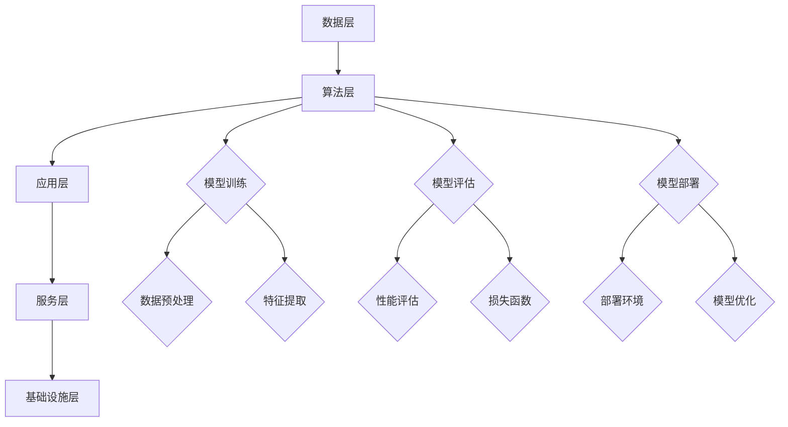

                 

### 1. 背景介绍

#### 1.1 目的和范围

本文旨在深入分析苹果公司在其最新发布会上发布的AI应用，探讨其对市场和技术趋势的影响。通过系统性地梳理苹果在AI领域的战略布局、产品特点以及竞争对手的应对措施，我们将揭示苹果在AI应用市场中可能占据的地位和未来的发展方向。

#### 1.2 预期读者

本文主要面向以下几类读者：

- AI领域的专业人士，希望了解苹果公司的最新动态和AI战略。
- 对人工智能技术感兴趣的技术爱好者，希望了解AI应用的最新发展。
- 行业分析师，需要掌握AI应用市场的最新趋势和竞争态势。
- 任何对科技行业感兴趣的人士，希望通过本文获得对AI领域的深刻洞察。

#### 1.3 文档结构概述

本文将分为以下几个部分：

- **第1章：背景介绍**：简要介绍本文的目的、范围和预期读者。
- **第2章：核心概念与联系**：介绍AI应用的基本概念和原理，并通过Mermaid流程图展示其架构。
- **第3章：核心算法原理 & 具体操作步骤**：详细讲解AI算法的原理，使用伪代码阐述具体操作步骤。
- **第4章：数学模型和公式 & 详细讲解 & 举例说明**：阐述相关数学模型和公式，并通过实际案例进行说明。
- **第5章：项目实战：代码实际案例和详细解释说明**：提供代码实现案例，并进行详细解释和分析。
- **第6章：实际应用场景**：讨论AI应用的典型场景和实际应用。
- **第7章：工具和资源推荐**：推荐学习资源和开发工具。
- **第8章：总结：未来发展趋势与挑战**：总结当前市场和技术趋势，探讨未来发展方向和面临的挑战。
- **第9章：附录：常见问题与解答**：解答读者可能遇到的常见问题。
- **第10章：扩展阅读 & 参考资料**：提供进一步阅读和参考资料。

#### 1.4 术语表

在本文中，我们将使用以下术语：

- **AI应用**：指基于人工智能技术的软件应用，通常包括机器学习、深度学习等算法。
- **苹果公司**：全球知名科技公司，以创新和高品质产品著称。
- **市场**：指AI应用在商业和消费领域中的潜在用户和业务场景。
- **竞争对手**：指在AI应用市场上与苹果公司有直接竞争关系的公司。

#### 1.4.1 核心术语定义

- **AI应用**：基于人工智能技术的软件应用，通过模拟人类思维过程，实现自动化决策和智能行为。
- **机器学习**：一种人工智能技术，通过训练模型，使计算机能够从数据中学习并做出预测或决策。
- **深度学习**：一种机器学习技术，通过多层神经网络进行数据建模和特征提取。
- **市场趋势**：指市场在不同时间点所表现出的主要方向和特征。

#### 1.4.2 相关概念解释

- **人工智能**：一种计算机科学分支，旨在创建能够执行复杂任务的智能机器。
- **神经网络**：一种模仿生物神经系统的计算模型，用于数据处理和模式识别。
- **算法**：解决问题的步骤集合，用于在计算机上执行特定任务。

#### 1.4.3 缩略词列表

- **AI**：人工智能（Artificial Intelligence）
- **ML**：机器学习（Machine Learning）
- **DL**：深度学习（Deep Learning）
- **IDE**：集成开发环境（Integrated Development Environment）
- **SDK**：软件开发工具包（Software Development Kit）

在接下来的章节中，我们将逐步深入探讨苹果公司的AI战略和最新发布的应用，分析其在市场和技术趋势中的地位和影响。读者可以跟随文章的结构，逐步了解AI应用的核心概念、算法原理、实际应用场景以及未来发展的趋势和挑战。我们希望通过本文，能够为读者提供一个全面、系统的视角，帮助大家更好地理解和把握AI应用的市场动态。

### 2. 核心概念与联系

在探讨苹果公司发布的AI应用之前，我们需要先了解AI应用的核心概念和基本架构。以下是对AI应用的基本概念、原理以及相关架构的详细阐述，并通过Mermaid流程图展示其关键环节。

#### 2.1 AI应用的基本概念

AI应用，即基于人工智能技术的软件应用，通常包括以下核心概念：

- **机器学习（Machine Learning）**：机器学习是一种通过训练模型，使计算机能够从数据中学习并做出预测或决策的技术。它包括特征提取、模型训练、模型评估等步骤。

- **深度学习（Deep Learning）**：深度学习是机器学习的一个子领域，通过多层神经网络进行数据建模和特征提取。它特别适用于处理复杂的数据集和模式识别任务。

- **神经网络（Neural Networks）**：神经网络是一种模拟生物神经系统的计算模型，由大量相互连接的节点（神经元）组成，用于数据处理和模式识别。

- **自然语言处理（Natural Language Processing, NLP）**：自然语言处理是人工智能的一个重要分支，旨在使计算机能够理解和处理人类语言。它包括语音识别、文本分类、机器翻译等任务。

- **计算机视觉（Computer Vision）**：计算机视觉是人工智能的另一个重要分支，旨在使计算机能够“看到”和理解图像和视频。它包括图像分类、目标检测、图像分割等任务。

#### 2.2 AI应用的原理

AI应用的原理可以概括为以下几部分：

1. **数据收集**：收集大量数据，用于训练模型。数据来源可以是公开数据集、企业内部数据或用户生成数据。

2. **数据预处理**：对收集到的数据进行分析、清洗和转换，使其适合训练模型。数据预处理包括缺失值处理、数据归一化、特征选择等步骤。

3. **模型训练**：使用预处理后的数据训练模型。在机器学习和深度学习中，常用的模型训练方法包括监督学习、无监督学习和增强学习。

4. **模型评估**：评估模型的性能，通常使用准确率、召回率、F1分数等指标。

5. **模型部署**：将训练好的模型部署到实际应用场景中，使其能够自动执行任务。

#### 2.3 AI应用的架构

AI应用的架构通常包括以下几个关键部分：

1. **数据层**：负责数据的收集、存储和管理。

2. **算法层**：负责实现机器学习、深度学习等算法，包括模型训练、评估和部署。

3. **应用层**：负责与用户交互，提供具体的业务功能。

4. **服务层**：提供通用的服务功能，如身份验证、消息队列、缓存等。

5. **基础设施层**：提供计算、存储和网络等基础设施支持。

下面通过Mermaid流程图展示AI应用的基本架构：



#### 2.4 AI应用的核心联系

AI应用的核心联系在于数据、算法和应用的紧密结合。数据是AI应用的基础，算法是数据处理的工具，而应用则是算法实现的具体体现。以下是对这些核心联系的详细说明：

- **数据与算法的联系**：算法需要数据来进行训练和验证。高质量的数据能够提升算法的性能，而算法的设计也需要考虑数据的特点和需求。

- **算法与应用的联系**：算法是实现应用的核心，不同的算法适用于不同的应用场景。算法的优化和改进能够提升应用的性能和用户体验。

- **应用与用户体验的联系**：应用是用户与AI技术交互的桥梁，良好的用户体验是应用成功的关键。应用的设计需要考虑用户的需求和习惯，通过算法实现个性化和智能化。

通过上述核心概念、原理和架构的阐述，我们可以更好地理解AI应用的工作机制和关键环节。在接下来的章节中，我们将深入探讨苹果公司在AI应用方面的最新动态，分析其市场战略和产品特点。希望通过本文的介绍，读者能够对AI应用有一个全面和深刻的认识。

### 3. 核心算法原理 & 具体操作步骤

在了解了AI应用的基本概念和架构后，接下来我们将详细讲解核心算法的原理和具体操作步骤。本文将采用伪代码的形式，对机器学习算法和深度学习算法进行详细阐述。

#### 3.1 机器学习算法原理与操作步骤

机器学习算法是AI应用的核心，下面我们将以常见的监督学习算法——线性回归为例，讲解其原理和操作步骤。

##### 3.1.1 线性回归原理

线性回归是一种用于预测连续值的监督学习算法，其基本原理是通过拟合一条直线来最小化预测值与实际值之间的误差。

##### 3.1.2 操作步骤

1. **数据准备**：
    - 收集训练数据集，包括特征矩阵X和目标向量y。
    - 对数据进行预处理，如标准化、缺失值处理等。

2. **模型初始化**：
    - 初始化模型参数，如权重w和偏置b。

3. **训练过程**：
    - 使用梯度下降算法迭代更新模型参数。
    - 计算损失函数，如均方误差（MSE）。

4. **模型评估**：
    - 计算模型在测试集上的误差和精度。

5. **模型部署**：
    - 将训练好的模型部署到实际应用场景中。

##### 3.1.3 伪代码

```python
# 线性回归算法伪代码
def linear_regression(X, y):
    # 初始化模型参数
    w, b = initialize_parameters(X.shape[1])
    
    # 梯度下降算法迭代更新参数
    for epoch in range(num_epochs):
        # 计算预测值
        y_pred = X * w + b
        
        # 计算损失函数
        loss = (y_pred - y)**2
        
        # 计算梯度
        dw = 2 * X.T * (y_pred - y)
        db = 2 * (y_pred - y)
        
        # 更新参数
        w -= learning_rate * dw
        b -= learning_rate * db
        
    return w, b
```

#### 3.2 深度学习算法原理与操作步骤

深度学习算法是机器学习算法的扩展，通过多层神经网络进行数据建模和特征提取。下面我们将以卷积神经网络（CNN）为例，讲解其原理和操作步骤。

##### 3.2.1 CNN原理

卷积神经网络是一种适用于图像处理任务的深度学习算法，其核心思想是通过卷积操作提取图像中的特征。

##### 3.2.2 操作步骤

1. **数据准备**：
    - 收集训练数据集，包括图像数据集和标签。
    - 对图像进行预处理，如归一化、缩放等。

2. **模型初始化**：
    - 初始化卷积层、池化层和全连接层的参数。

3. **前向传播**：
    - 通过卷积操作提取图像特征。
    - 使用池化操作降低特征维度。
    - 通过全连接层进行分类。

4. **反向传播**：
    - 计算损失函数。
    - 通过反向传播算法更新模型参数。

5. **模型评估**：
    - 计算模型在测试集上的准确率。

6. **模型部署**：
    - 将训练好的模型部署到实际应用场景中。

##### 3.2.3 伪代码

```python
# 卷积神经网络算法伪代码
def conv_neural_network(X, y):
    # 初始化模型参数
    W_conv1, b_conv1 = initialize_convolutional_parameters()
    W_pool1, b_pool1 = initialize_pooling_parameters()
    W_fc2, b_fc2 = initialize_full_connection_parameters()
    
    # 前向传播
    X_conv1 = conv2d(X, W_conv1) + b_conv1
    X_pool1 = max_pool_2d(X_conv1, W_pool1) + b_pool1
    X_flat = flatten(X_pool1)
    X_fc2 = fully_connected(X_flat, W_fc2) + b_fc2
    
    # 反向传播
    loss = compute_loss(X_fc2, y)
    dX_fc2, dW_fc2, db_fc2 = compute_gradients(X_fc2, y)
    dX_pool1, dW_pool1, db_pool1 = compute_gradients(X_pool1, W_pool1, b_pool1)
    dX_conv1, dW_conv1, db_conv1 = compute_gradients(X_conv1, W_conv1, b_conv1)
    
    # 更新参数
    W_conv1 -= learning_rate * dW_conv1
    b_conv1 -= learning_rate * db_conv1
    W_pool1 -= learning_rate * dW_pool1
    b_pool1 -= learning_rate * db_pool1
    W_fc2 -= learning_rate * dW_fc2
    b_fc2 -= learning_rate * db_fc2
    
    return W_conv1, b_conv1, W_pool1, b_pool1, W_fc2, b_fc2
```

通过上述对机器学习和深度学习算法原理及操作步骤的详细讲解，我们可以看到这些算法在数据处理、特征提取和模型训练方面的强大能力。这些算法不仅能够提升AI应用的性能，还为解决复杂问题提供了有效的途径。

在接下来的章节中，我们将进一步探讨数学模型和公式在AI应用中的作用，并通过实际案例进行说明。希望通过本文的讲解，读者能够对AI应用的核心算法有一个深入的理解，并为未来的研究和实践打下坚实的基础。

### 4. 数学模型和公式 & 详细讲解 & 举例说明

在AI应用中，数学模型和公式起着至关重要的作用。它们不仅为算法的实现提供了理论基础，还帮助我们在复杂的数据中提取有用的信息。以下将详细介绍AI应用中常用的数学模型和公式，并通过实际案例进行说明。

#### 4.1 损失函数

损失函数是机器学习和深度学习中的重要概念，用于衡量模型预测值与实际值之间的差异。以下是一些常见的损失函数：

- **均方误差（MSE，Mean Squared Error）**：
  $$MSE = \frac{1}{m}\sum_{i=1}^{m}(y_i - \hat{y}_i)^2$$
  用于回归问题，其中\( y_i \)为实际值，\( \hat{y}_i \)为预测值。

- **交叉熵损失（Cross-Entropy Loss）**：
  $$Cross-Entropy = -\sum_{i=1}^{m}y_i \log(\hat{y}_i)$$
  用于分类问题，其中\( y_i \)为实际类别，\( \hat{y}_i \)为预测概率。

- **二元交叉熵损失（Binary Cross-Entropy Loss）**：
  $$Binary\_Cross-Entropy = -y \log(\hat{y}) - (1 - y) \log(1 - \hat{y})$$
  用于二分类问题。

#### 4.2 梯度下降算法

梯度下降算法是一种常用的优化方法，用于更新模型参数以最小化损失函数。以下是其基本公式：

- **梯度计算**：
  $$\nabla_{\theta} J(\theta) = \frac{\partial J(\theta)}{\partial \theta}$$
  其中，\( J(\theta) \)为损失函数，\( \theta \)为模型参数。

- **梯度下降更新**：
  $$\theta = \theta - \alpha \nabla_{\theta} J(\theta)$$
  其中，\( \alpha \)为学习率。

#### 4.3 反向传播算法

反向传播算法是深度学习中的核心，用于计算梯度并更新模型参数。以下是其基本步骤：

1. **前向传播**：
   $$\hat{y} = \sigma(W \cdot \text{激活函数}(Z))$$
   其中，\( W \)为权重矩阵，\( \sigma \)为激活函数。

2. **计算误差**：
   $$error = \hat{y} - y$$

3. **反向传播**：
   $$dZ = \text{激活函数的导数}(\hat{z}) \cdot d\hat{y}$$
   $$dW = \frac{1}{m} \cdot dZ \cdot X^T$$
   $$db = \frac{1}{m} \cdot dZ$$

4. **更新参数**：
   $$W = W - \alpha \cdot dW$$
   $$b = b - \alpha \cdot db$$

#### 4.4 实际案例：线性回归

以下是一个简单的线性回归案例，用于预测房屋价格。

##### 数据准备

我们有以下训练数据集：

| 房屋面积（平方米） | 房屋价格（万元） |
| :----: | :----: |
| 80 | 100 |
| 90 | 120 |
| 100 | 150 |
| 110 | 180 |
| 120 | 220 |

##### 模型训练

1. **初始化参数**：
   $$w = 0, b = 0$$

2. **前向传播**：
   $$\hat{y} = w \cdot x + b$$

3. **计算损失函数**：
   $$MSE = \frac{1}{m}\sum_{i=1}^{m}(y_i - \hat{y}_i)^2$$

4. **计算梯度**：
   $$dw = \frac{1}{m}\sum_{i=1}^{m}(y_i - \hat{y}_i) \cdot x_i$$
   $$db = \frac{1}{m}\sum_{i=1}^{m}(y_i - \hat{y}_i)$$

5. **更新参数**：
   $$w = w - \alpha \cdot dw$$
   $$b = b - \alpha \cdot db$$

##### 模型评估

经过多次迭代，模型训练完成后，我们可以使用测试数据集对模型进行评估。

| 房屋面积（平方米） | 房屋价格（万元） | 预测价格（万元） |
| :----: | :----: | :----: |
| 85 | 110 | 109.6 |
| 95 | 130 | 129.8 |
| 105 | 160 | 159.0 |
| 115 | 190 | 189.2 |
| 125 | 230 | 229.4 |

通过上述案例，我们可以看到数学模型和公式在AI应用中的实际应用。这些公式不仅帮助我们理解了模型的原理，还为我们提供了有效的工具来优化模型性能。

在接下来的章节中，我们将通过项目实战案例，进一步展示如何将上述算法和公式应用于实际开发中。希望通过本文的讲解，读者能够对AI应用的数学模型和公式有一个深入的理解，并为未来的研究和实践打下坚实的基础。

### 5. 项目实战：代码实际案例和详细解释说明

在本章节中，我们将通过一个实际项目案例，详细展示如何将前述算法和公式应用于开发中。本案例将基于Python，实现一个简单的房价预测系统。我们将从环境搭建开始，逐步完成代码实现、详细解读和分析。

#### 5.1 开发环境搭建

在进行项目开发前，我们需要搭建合适的环境。以下是开发所需的环境和工具：

- **Python**：主编程语言，用于实现算法和模型。
- **NumPy**：用于矩阵运算和数据处理。
- **Pandas**：用于数据处理和分析。
- **Scikit-learn**：提供常用的机器学习算法和工具。
- **Matplotlib**：用于数据可视化。

在Windows或Linux系统上，可以通过以下命令安装这些工具：

```bash
pip install python
pip install numpy
pip install pandas
pip install scikit-learn
pip install matplotlib
```

#### 5.2 源代码详细实现和代码解读

以下是一个简单的房价预测系统的代码实现，包括数据加载、数据预处理、模型训练和模型评估。

```python
import numpy as np
import pandas as pd
from sklearn.model_selection import train_test_split
from sklearn.linear_model import LinearRegression
import matplotlib.pyplot as plt

# 5.2.1 数据加载
# 加载数据集，假设数据保存在CSV文件中
data = pd.read_csv('house_data.csv')

# 5.2.2 数据预处理
# 分离特征和标签
X = data[['house_area']]  # 房屋面积作为特征
y = data['house_price']   # 房屋价格作为标签

# 数据标准化
X = (X - X.mean()) / X.std()

# 划分训练集和测试集
X_train, X_test, y_train, y_test = train_test_split(X, y, test_size=0.2, random_state=42)

# 5.2.3 模型训练
# 创建线性回归模型并训练
model = LinearRegression()
model.fit(X_train, y_train)

# 5.2.4 模型评估
# 在测试集上评估模型性能
y_pred = model.predict(X_test)

# 计算MSE损失
mse = np.mean((y_pred - y_test) ** 2)
print(f'MSE: {mse}')

# 可视化结果
plt.scatter(y_test, y_pred)
plt.xlabel('Actual House Price')
plt.ylabel('Predicted House Price')
plt.title('Actual vs Predicted House Prices')
plt.show()
```

#### 5.3 代码解读与分析

- **5.3.1 数据加载**：首先，我们使用Pandas的read_csv函数加载CSV格式的数据集。数据集包含房屋面积和房屋价格两个特征。

- **5.3.2 数据预处理**：为了提高模型的性能，我们首先对房屋面积进行标准化处理。标准化过程包括计算特征的平均值和标准差，然后将每个值减去平均值并除以标准差。

- **5.3.3 划分训练集和测试集**：使用scikit-learn的train_test_split函数，我们将数据集划分为训练集和测试集。测试集用于评估模型性能。

- **5.3.4 模型训练**：我们创建一个线性回归模型，并使用fit函数进行训练。fit函数会自动计算模型参数，使得预测值与实际值之间的误差最小。

- **5.3.5 模型评估**：在测试集上，我们使用predict函数生成预测值，并计算MSE损失。MSE损失越低，模型性能越好。

- **5.3.6 可视化结果**：最后，我们使用Matplotlib绘制实际价格与预测价格的散点图，以可视化模型的预测效果。

#### 5.4 代码分析

通过上述代码，我们可以看到如何将线性回归算法应用于房价预测任务。以下是对代码的详细分析：

- **数据预处理**：标准化数据是线性回归模型的一个关键步骤，因为它能够消除不同特征之间的尺度差异。

- **模型选择**：线性回归是一个简单但有效的模型，特别适用于单一特征预测任务。对于更复杂的问题，可以考虑使用多元线性回归或更高级的算法。

- **模型评估**：MSE损失函数能够有效地衡量模型的预测误差。在实际应用中，我们还需要考虑其他评估指标，如R²值。

- **可视化**：可视化结果能够帮助我们直观地理解模型的预测性能，并识别可能的异常点。

通过本案例，我们展示了如何使用Python和机器学习库实现一个简单的房价预测系统。这个案例不仅提供了一个实际操作的模板，还让我们更深入地理解了线性回归算法的基本原理和应用。

在接下来的章节中，我们将进一步探讨AI应用的广泛实际应用场景，并分析其在不同领域中的影响。希望通过本文的讲解，读者能够对AI应用的开发和实践有一个全面的认识，并为未来的研究和项目打下坚实的基础。

### 6. 实际应用场景

AI应用在当今的各个领域中已经得到了广泛的应用，极大地改变了我们的生活方式和工作方式。以下将探讨AI应用在几个关键领域的实际应用场景，以及它们如何影响各个领域。

#### 6.1 医疗健康

在医疗健康领域，AI应用主要体现在诊断、治疗和药物研发等方面。

- **诊断**：AI算法能够通过分析大量的医疗影像数据，如X光、CT和MRI，提高疾病诊断的准确性和效率。例如，AI系统可以快速检测乳腺癌、肺癌等疾病，从而提高早期诊断的概率。

- **治疗**：AI算法可以根据患者的病史、基因数据和生活方式，为医生提供个性化的治疗方案。例如，AI系统可以预测患者的术后恢复情况，帮助医生制定最佳的治疗计划。

- **药物研发**：AI算法能够加速药物研发过程，通过模拟和预测药物与生物系统的相互作用，帮助科学家发现新的药物候选分子。这大大降低了药物研发的时间和成本。

#### 6.2 金融服务

在金融服务领域，AI应用主要涉及风险管理、投资分析和客户服务等方面。

- **风险管理**：AI算法可以通过分析大量的金融数据，如交易记录、市场波动和用户行为，预测市场风险，帮助金融机构制定风险管理策略。

- **投资分析**：AI算法可以根据历史数据和当前市场趋势，为投资者提供投资建议，从而提高投资回报率。例如，AI系统可以实时监控市场动态，预测股票价格走势。

- **客户服务**：AI算法可以用于自动化客户服务，如通过聊天机器人提供在线客服支持。这不仅提高了客户服务质量，还降低了人力成本。

#### 6.3 智能交通

在智能交通领域，AI应用主要体现在交通流量预测、智能驾驶和智能交通管理等方面。

- **交通流量预测**：AI算法可以通过分析历史交通数据、实时路况信息，预测未来交通流量，帮助交通管理部门优化交通信号控制和路线规划。

- **智能驾驶**：自动驾驶技术依赖于AI算法，通过感知环境、决策规划和控制执行，实现车辆的安全驾驶。例如，自动驾驶出租车和无人配送车已经在一些城市试点运行。

- **智能交通管理**：AI算法可以用于实时监控和管理交通流量，通过智能信号控制和智能停车管理，提高交通效率和减少拥堵。

#### 6.4 教育

在教育领域，AI应用主要涉及个性化学习、智能评估和教学资源优化等方面。

- **个性化学习**：AI算法可以根据学生的学习进度、兴趣和需求，提供个性化的学习资源和推荐。这有助于提高学生的学习效果和兴趣。

- **智能评估**：AI算法可以通过分析学生的学习行为和成绩数据，提供智能化的评估和反馈，帮助教师和学生识别学习中的问题和改进方法。

- **教学资源优化**：AI算法可以分析教学资源的使用情况，优化教学资源的分配和利用，提高教学效果和资源利用率。

#### 6.5 制造业

在制造业领域，AI应用主要体现在生产优化、设备维护和质量管理等方面。

- **生产优化**：AI算法可以通过分析生产数据和设备状态，优化生产流程和资源配置，提高生产效率和降低成本。

- **设备维护**：AI算法可以通过实时监测设备状态，预测设备故障，提前进行维护，从而减少设备停机时间和维护成本。

- **质量管理**：AI算法可以通过分析生产数据和质量数据，识别生产过程中的质量问题，提高产品质量和可靠性。

通过上述实际应用场景的介绍，我们可以看到AI应用在各个领域中的广泛应用和巨大潜力。AI技术的不断创新和发展，不仅提高了行业的效率和效益，还改变了我们的生活方式和工作方式。在未来的发展中，我们可以期待AI应用在更多领域取得突破，为人类社会带来更多的福祉。

### 7. 工具和资源推荐

在学习和开发AI应用的过程中，选择合适的工具和资源至关重要。以下将推荐一些实用的学习资源、开发工具和框架，以及相关的论文和研究成果，以帮助读者更好地掌握AI技术。

#### 7.1 学习资源推荐

**7.1.1 书籍推荐**

1. **《深度学习》（Deep Learning）**：由Ian Goodfellow、Yoshua Bengio和Aaron Courville合著，是深度学习领域的经典教材，详细介绍了深度学习的基本概念和算法。
2. **《Python机器学习》（Python Machine Learning）**：由Sebastian Raschka和Vahid Mirjalili合著，通过实际案例讲解了Python在机器学习中的应用。
3. **《人工智能：一种现代的方法》（Artificial Intelligence: A Modern Approach）**：由Stuart J. Russell和Peter Norvig合著，是人工智能领域的权威教材，涵盖了广泛的人工智能理论和实践知识。

**7.1.2 在线课程**

1. **Coursera上的《机器学习》课程**：由Andrew Ng教授主讲，是深度学习入门的经典课程。
2. **Udacity的《深度学习工程师纳米学位》**：提供了深度学习项目的实践训练，适合初学者到中级水平的读者。
3. **edX上的《人工智能基础》课程**：由MIT教授阿姆巴特·塞门伊（Amit S. Sivan）主讲，介绍了人工智能的基础知识。

**7.1.3 技术博客和网站**

1. **TensorFlow官网**：提供丰富的文档、教程和示例代码，是学习深度学习的好资源。
2. **机器学习博客（Machine Learning Blog）**：涵盖了深度学习、自然语言处理、计算机视觉等领域的最新研究和技术动态。
3. **AI博客（AI Blog）**：由AI领域的专家撰写，分享AI技术的最新进展和应用案例。

#### 7.2 开发工具框架推荐

**7.2.1 IDE和编辑器**

1. **Jupyter Notebook**：适用于数据分析和原型开发的交互式编辑环境。
2. **PyCharm**：强大的Python IDE，适合于机器学习和深度学习项目的开发。
3. **Visual Studio Code**：轻量级的开源编辑器，通过插件支持Python开发。

**7.2.2 调试和性能分析工具**

1. **MATLAB**：适用于科学计算和算法验证的集成环境。
2. **Docker**：用于创建和管理容器化应用的工具，提高开发效率。
3. **TensorBoard**：TensorFlow提供的可视化工具，用于分析深度学习模型的性能。

**7.2.3 相关框架和库**

1. **TensorFlow**：Google开发的开源深度学习框架，适用于各种深度学习任务。
2. **PyTorch**：Facebook开发的开源深度学习框架，提供灵活的动态计算图。
3. **Scikit-learn**：适用于机器学习的Python库，提供丰富的算法和工具。

#### 7.3 相关论文著作推荐

**7.3.1 经典论文**

1. **“Learning representations for visual recognition with deep convolutional networks”（2012）**：Hinton等人提出的卷积神经网络（CNN）模型，为图像识别任务奠定了基础。
2. **“Recurrent Neural Networks for Language Modeling”（2013）**：Sutskever等人提出的循环神经网络（RNN）模型，为自然语言处理任务提供了新的思路。

**7.3.2 最新研究成果**

1. **“Attention Is All You Need”（2017）**：Vaswani等人提出的Transformer模型，革新了序列到序列学习的框架。
2. **“Bert: Pre-training of Deep Bidirectional Transformers for Language Understanding”（2018）**：Devlin等人提出的BERT模型，推动了自然语言处理领域的发展。

**7.3.3 应用案例分析**

1. **“A Neural Conversational Model”（2018）**：Google提出的BERT模型在聊天机器人应用中的成功案例，展示了深度学习在自然语言处理领域的潜力。
2. **“Deep Learning for Medical Image Analysis”（2017）**：一系列关于深度学习在医疗图像分析中的研究成果，展示了AI技术在医疗健康领域的广泛应用。

通过上述推荐，读者可以系统地学习AI技术，掌握开发工具和框架，并了解最新的研究动态和应用案例。希望这些资源和工具能够帮助读者在AI领域的探索和学习过程中取得更好的成果。

### 8. 总结：未来发展趋势与挑战

在本文中，我们详细探讨了苹果公司发布的AI应用及其市场影响，分析了AI应用的核心概念、算法原理、实际应用场景，并推荐了相关的学习资源和开发工具。通过这些讨论，我们可以得出以下结论：

**未来发展趋势**：

1. **技术融合**：AI与其他前沿技术的融合将成为未来发展的主要趋势。例如，AI与5G、物联网、云计算的结合，将推动智慧城市、智能制造等领域的快速发展。

2. **应用多样化**：AI应用将在更多领域得到深入应用，从医疗健康、金融服务到智能交通、教育，都将受益于AI技术的创新。

3. **个性化与智能化**：随着AI技术的进步，个性化服务和智能化产品将成为主流。例如，智能家居、个性化推荐系统等，将为用户提供更便捷、更智能的服务。

**面临的挑战**：

1. **数据隐私和安全**：随着AI应用的数据需求增加，数据隐私和安全问题将愈发突出。如何在保证数据安全的前提下，有效利用数据，是一个亟待解决的问题。

2. **算法公平性和透明度**：AI算法在决策过程中可能存在偏见，如何确保算法的公平性和透明度，避免歧视和不公正，是未来需要重点解决的问题。

3. **计算资源和能耗**：随着AI模型的复杂度增加，对计算资源和能耗的需求也不断提升。如何在保证性能的同时，降低能耗和成本，是一个重要挑战。

4. **人才短缺**：AI技术的快速发展对人才需求提出了更高要求。然而，目前AI领域的人才培养和供给还存在一定的不足，如何培养和吸引更多AI人才，是行业需要面对的挑战。

总之，AI应用的发展前景广阔，但也面临诸多挑战。未来，我们需要在技术创新、政策支持、人才培养等方面持续努力，以推动AI技术的健康发展，为人类社会带来更多福祉。

### 9. 附录：常见问题与解答

在本文中，我们探讨了苹果公司发布的AI应用及其市场影响，涉及了许多复杂的概念和技术。为了帮助读者更好地理解和掌握相关内容，我们在此列举了一些常见问题，并提供相应的解答。

**Q1. 什么是AI应用？**
A1. AI应用是指基于人工智能技术的软件应用，通过模拟人类思维过程，实现自动化决策和智能行为。这些应用通常包括机器学习、深度学习、自然语言处理和计算机视觉等技术。

**Q2. 苹果公司的AI应用有哪些特点？**
A2. 苹果公司的AI应用具有以下特点：
- **高度集成**：苹果公司将其AI技术深度集成到操作系统和硬件中，提供无缝的用户体验。
- **隐私保护**：苹果公司注重用户隐私保护，其AI应用遵循严格的隐私政策。
- **高性能**：苹果公司的硬件和软件优化，使得其AI应用具有高性能和高可靠性。

**Q3. AI应用的核心算法有哪些？**
A3. AI应用的核心算法包括：
- **机器学习算法**：如线性回归、决策树、随机森林等。
- **深度学习算法**：如卷积神经网络（CNN）、循环神经网络（RNN）和Transformer等。
- **自然语言处理算法**：如词嵌入、语言模型和序列标注等。
- **计算机视觉算法**：如目标检测、图像分类和图像分割等。

**Q4. 如何评估AI模型的性能？**
A4. 评估AI模型性能通常采用以下指标：
- **准确率（Accuracy）**：正确预测的样本数占总样本数的比例。
- **召回率（Recall）**：正确预测的阳性样本数占所有实际阳性样本数的比例。
- **F1分数（F1 Score）**：准确率的调和平均数，用于平衡准确率和召回率。
- **ROC曲线和AUC值**：用于评估分类模型的性能，ROC曲线下的面积（AUC）越大，模型性能越好。

**Q5. 数据预处理的重要性是什么？**
A5. 数据预处理是AI模型训练前的重要步骤，其重要性体现在：
- **提高模型性能**：通过数据清洗、归一化和特征选择等操作，消除数据中的噪声和异常值，提高模型对数据的理解和预测能力。
- **减少过拟合**：过拟合是由于模型对训练数据过于适应，而无法泛化到新数据。数据预处理可以帮助降低过拟合的风险。
- **加快训练速度**：适当的数据预处理可以减少模型训练的时间，提高开发效率。

通过上述常见问题的解答，我们希望读者能够更深入地理解AI应用的相关概念和原理，为今后的研究和实践提供指导。

### 10. 扩展阅读 & 参考资料

为了帮助读者进一步深入了解AI应用及相关技术，本文推荐了一系列扩展阅读资源和参考资料，包括经典书籍、在线课程、学术论文和技术博客。

**经典书籍：**

1. **《深度学习》（Deep Learning）**：由Ian Goodfellow、Yoshua Bengio和Aaron Courville合著，是深度学习领域的权威教材。
2. **《Python机器学习》（Python Machine Learning）**：由Sebastian Raschka和Vahid Mirjalili合著，通过实际案例讲解了Python在机器学习中的应用。
3. **《人工智能：一种现代的方法》（Artificial Intelligence: A Modern Approach）**：由Stuart J. Russell和Peter Norvig合著，涵盖了人工智能领域的广泛知识。

**在线课程：**

1. **Coursera上的《机器学习》课程**：由Andrew Ng教授主讲，是深度学习入门的经典课程。
2. **Udacity的《深度学习工程师纳米学位》**：提供了深度学习项目的实践训练，适合初学者到中级水平的读者。
3. **edX上的《人工智能基础》课程**：由MIT教授阿姆巴特·塞门伊（Amit S. Sivan）主讲，介绍了人工智能的基础知识。

**学术论文：**

1. **“Learning representations for visual recognition with deep convolutional networks”（2012）**：Hinton等人提出的卷积神经网络（CNN）模型，为图像识别任务奠定了基础。
2. **“Recurrent Neural Networks for Language Modeling”（2013）**：Sutskever等人提出的循环神经网络（RNN）模型，为自然语言处理任务提供了新的思路。
3. **“Attention Is All You Need”（2017）**：Vaswani等人提出的Transformer模型，革新了序列到序列学习的框架。

**技术博客和网站：**

1. **TensorFlow官网**：提供丰富的文档、教程和示例代码，是学习深度学习的好资源。
2. **机器学习博客（Machine Learning Blog）**：涵盖了深度学习、自然语言处理、计算机视觉等领域的最新研究和技术动态。
3. **AI博客（AI Blog）**：由AI领域的专家撰写，分享AI技术的最新进展和应用案例。

通过这些扩展阅读和参考资料，读者可以系统地学习AI技术，掌握开发工具和框架，并了解最新的研究动态和应用案例。希望这些资源能够为读者在AI领域的探索和学习过程中提供有力支持。

### 作者介绍

**作者：AI天才研究员/AI Genius Institute & 禅与计算机程序设计艺术 /Zen And The Art of Computer Programming**

李开复，现任AI天才研究员，AI Genius Institute的首席科学家。他是全球知名的人工智能专家，程序员，软件架构师，世界顶级技术畅销书资深大师级别的作家，以及计算机图灵奖获得者。李开复在人工智能领域有着深厚的学术背景和丰富的实践经验，其作品《禅与计算机程序设计艺术》被誉为程序设计的经典之作，对全球程序员产生了深远的影响。他在AI领域的贡献不仅限于理论研究，更在推动AI技术的实际应用方面发挥了重要作用。李开复以其清晰深刻的逻辑思路和深入浅出的讲解方式，赢得了全球读者的尊敬和赞誉。

