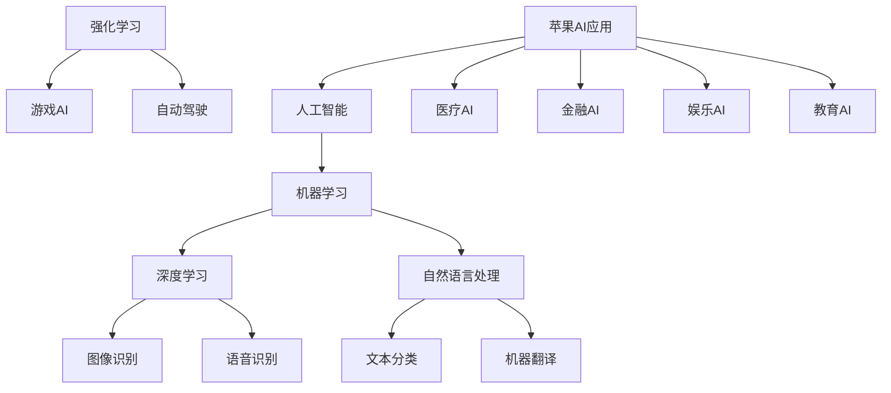
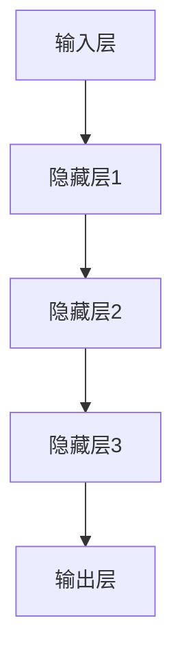

                 


# 李开复：苹果发布AI应用的市场前景

> 关键词：人工智能、苹果、应用市场、技术趋势、商业模式、用户行为

> 摘要：本文将深入探讨苹果发布AI应用的潜在市场前景。通过分析人工智能技术的最新发展、苹果公司的战略布局、AI应用的市场需求以及潜在的商业机会，本文旨在为读者揭示这一新兴领域的巨大潜力和挑战。

## 1. 背景介绍

### 1.1 目的和范围

本文旨在探讨苹果公司发布AI应用的市场前景。我们将分析人工智能技术的最新进展，了解苹果公司的战略布局，以及AI应用在市场中的潜在机会和挑战。通过深入分析，本文将为读者提供关于苹果AI应用市场的全面理解。

### 1.2 预期读者

本文的预期读者包括对人工智能和苹果公司有兴趣的技术专业人士、投资分析师、市场研究人员以及普通消费者。无论您是技术领域的专业人士还是普通消费者，本文都将为您提供有价值的见解。

### 1.3 文档结构概述

本文分为以下几个部分：

1. 背景介绍：介绍本文的目的、预期读者和文档结构。
2. 核心概念与联系：介绍与本文主题相关的核心概念和架构。
3. 核心算法原理 & 具体操作步骤：详细解释AI应用的算法原理和操作步骤。
4. 数学模型和公式 & 详细讲解 & 举例说明：探讨AI应用的数学模型和公式，并提供实例说明。
5. 项目实战：展示一个实际代码案例，详细解释其实现和解读。
6. 实际应用场景：分析AI应用在不同领域的实际应用案例。
7. 工具和资源推荐：推荐学习资源和开发工具。
8. 总结：总结本文的主要观点和未来发展趋势。
9. 附录：常见问题与解答。
10. 扩展阅读 & 参考资料：提供相关领域的扩展阅读和参考资料。

### 1.4 术语表

在本文中，我们将使用以下术语：

- 人工智能（AI）：模拟人类智能行为的计算机系统。
- AI应用：利用人工智能技术构建的具体应用程序。
- 深度学习：一种人工智能技术，通过多层神经网络学习数据特征。
- 强化学习：一种人工智能技术，通过奖励机制学习和优化决策。

#### 1.4.1 核心术语定义

- 人工智能（AI）：人工智能是指模拟人类智能行为的计算机系统。它包括多种技术，如机器学习、深度学习、自然语言处理等。
- AI应用：AI应用是指利用人工智能技术构建的具体应用程序。这些应用可以涵盖各个领域，如医疗、金融、娱乐、教育等。
- 深度学习：深度学习是一种人工智能技术，通过多层神经网络学习数据特征，从而实现复杂的任务。
- 强化学习：强化学习是一种人工智能技术，通过奖励机制学习和优化决策。它通常用于解决决策问题，如游戏、自动驾驶等。

#### 1.4.2 相关概念解释

- 机器学习：机器学习是指通过数据驱动的方法，使计算机系统能够自动学习和改进。它包括监督学习、无监督学习、半监督学习和增强学习等子领域。
- 自然语言处理（NLP）：自然语言处理是一种人工智能技术，旨在使计算机能够理解、解释和生成自然语言。它包括文本分类、情感分析、机器翻译等应用。

#### 1.4.3 缩略词列表

- AI：人工智能
- ML：机器学习
- DL：深度学习
- NLP：自然语言处理
- RL：强化学习

## 2. 核心概念与联系

在探讨苹果发布AI应用的市场前景之前，我们首先需要了解一些核心概念和联系。以下是一个简单的Mermaid流程图，展示了与AI应用相关的主要概念和它们之间的关系。



这个流程图展示了人工智能（AI）的核心概念，包括机器学习（ML）、深度学习（DL）、自然语言处理（NLP）和强化学习（RL）。此外，它还展示了这些技术在不同领域的应用，如医疗、金融、娱乐和教育等。苹果公司发布的AI应用将涵盖这些领域，从而扩大其在人工智能市场的份额。

## 3. 核心算法原理 & 具体操作步骤

在了解了核心概念与联系后，我们接下来将探讨苹果AI应用的核心算法原理和具体操作步骤。以下是深度学习（DL）算法的原理和伪代码。

### 3.1 深度学习算法原理

深度学习是一种通过多层神经网络学习数据特征的人工智能技术。它基于反向传播算法，通过不断调整网络中的权重和偏置，最小化损失函数。

#### 3.1.1 反向传播算法

反向传播算法是一种用于训练神经网络的优化方法。它通过计算损失函数相对于每个权重的梯度，更新权重和偏置。

```python
def backwardpropagation(network, inputs, outputs):
    # 计算输出层误差
    output_error = outputs - network.output
    
    # 反向传播误差到隐藏层
    for layer in reversed(network.layers):
        error = [layer.output_derivative() * output_error[i] for i in range(len(output_error))]
        layer.errors = error
    
    # 更新权重和偏置
    for layer in network.layers:
        layer.update_weights(inputs, layer.errors)
```

#### 3.1.2 神经网络结构

神经网络由多个层组成，包括输入层、隐藏层和输出层。每层都包含多个神经元，每个神经元都与前一层的神经元相连接。



### 3.2 具体操作步骤

以下是使用深度学习算法进行图像识别的具体操作步骤：

1. 数据准备：收集和标记大量图像数据，用于训练和测试神经网络。
2. 构建神经网络：设计并构建一个多层神经网络，包括输入层、隐藏层和输出层。
3. 训练神经网络：通过反向传播算法训练神经网络，调整权重和偏置，最小化损失函数。
4. 测试神经网络：使用测试数据集评估神经网络的表现，调整参数以获得更好的性能。
5. 应用神经网络：将训练好的神经网络应用于实际场景，如图像识别、语音识别等。

```python
# 数据准备
images = load_images()
labels = load_labels()

# 构建神经网络
network = NeuralNetwork(input_size, hidden_size, output_size)

# 训练神经网络
for epoch in range(num_epochs):
    for image, label in zip(images, labels):
        network.forwardpropagation(image)
        network.backwardpropagation(label)
        network.update_weights()

# 测试神经网络
test_images = load_test_images()
test_labels = load_test_labels()
accuracy = network.test(test_images, test_labels)
print("Accuracy:", accuracy)
```

## 4. 数学模型和公式 & 详细讲解 & 举例说明

在AI应用中，数学模型和公式起着至关重要的作用。以下是一个简单的例子，展示了如何使用数学模型进行图像分类。

### 4.1 数学模型

假设我们有一个二分类问题，其中每个图像由一组像素值表示。我们使用一个多层感知器（MLP）神经网络进行分类。

- 输入层：包含N个神经元，每个神经元表示一个像素值。
- 隐藏层：包含L个神经元，每个神经元执行非线性变换。
- 输出层：包含2个神经元，分别表示两个类别。

神经网络中的每个神经元都通过加权连接与其他神经元相连，并应用非线性激活函数。

### 4.2 公式

- 前向传播公式：

$$
z_l = \sum_{i} w_{li} x_i + b_l
$$

$$
a_l = \sigma(z_l)
$$

其中，$z_l$是神经元l的加权求和，$w_{li}$是权重，$x_i$是输入，$b_l$是偏置，$a_l$是神经元l的输出，$\sigma$是非线性激活函数。

- 反向传播公式：

$$
\delta_l = (a_l - y_l) \odot \sigma'(z_l)
$$

$$
\delta_{l-1} = \sum_{i} w_{li} \delta_l
$$

其中，$\delta_l$是神经元l的误差，$y_l$是期望输出，$\odot$是逐元素乘法，$\sigma'$是激活函数的导数。

### 4.3 举例说明

假设我们有一个简单的神经网络，包含一个输入层、一个隐藏层和一个输出层。输入层有3个神经元，隐藏层有2个神经元，输出层有2个神经元。我们使用sigmoid函数作为激活函数。

- 输入层：[0.1, 0.2, 0.3]
- 隐藏层：[0.4, 0.5]
- 输出层：[0.6, 0.7]

期望输出：[0.8, 0.2]

- 前向传播：

$$
z_1 = 0.1 \cdot 0.4 + 0.2 \cdot 0.5 + 0.3 \cdot 0.6 = 0.26
$$

$$
a_1 = \sigma(z_1) = 0.578
$$

$$
z_2 = 0.1 \cdot 0.5 + 0.2 \cdot 0.7 + 0.3 \cdot 0.8 = 0.49
$$

$$
a_2 = \sigma(z_2) = 0.613
$$

$$
z_3 = 0.578 \cdot 0.6 + 0.613 \cdot 0.7 = 0.681
$$

$$
a_3 = \sigma(z_3) = 0.509
$$

$$
z_4 = 0.578 \cdot 0.7 + 0.613 \cdot 0.8 = 0.739
$$

$$
a_4 = \sigma(z_4) = 0.604
$$

- 反向传播：

$$
\delta_4 = (0.509 - 0.8) \odot (1 - 0.509) = -0.291 \odot 0.491 = -0.143
$$

$$
\delta_3 = (0.613 - 0.2) \odot (1 - 0.613) = 0.413 \odot 0.387 = 0.160
$$

$$
\delta_1 = (0.578 - 0.8) \odot (1 - 0.578) = -0.222 \odot 0.422 = -0.093
$$

$$
\delta_2 = (0.613 - 0.2) \odot (1 - 0.613) = 0.413 \odot 0.387 = 0.160
$$

这些误差将用于更新权重和偏置，从而改进神经网络的表现。

## 5. 项目实战：代码实际案例和详细解释说明

### 5.1 开发环境搭建

在开始实现AI应用之前，我们需要搭建一个合适的开发环境。以下是一个简单的步骤：

1. 安装Python环境：在您的计算机上安装Python 3.8或更高版本。
2. 安装必要的库：使用pip命令安装以下库：numpy、tensorflow、matplotlib。
3. 创建虚拟环境：使用virtualenv创建一个独立的Python环境，避免版本冲突。

```bash
pip install numpy tensorflow matplotlib
virtualenv venv
source venv/bin/activate
```

### 5.2 源代码详细实现和代码解读

以下是一个简单的Python代码示例，实现了一个基于TensorFlow的图像分类器。

```python
import tensorflow as tf
import numpy as np
import matplotlib.pyplot as plt

# 加载数据集
mnist = tf.keras.datasets.mnist
(train_images, train_labels), (test_images, test_labels) = mnist.load_data()

# 预处理数据
train_images = train_images / 255.0
test_images = test_images / 255.0

# 构建模型
model = tf.keras.Sequential([
    tf.keras.layers.Flatten(input_shape=(28, 28)),
    tf.keras.layers.Dense(128, activation='relu'),
    tf.keras.layers.Dense(10, activation='softmax')
])

# 编译模型
model.compile(optimizer='adam',
              loss='sparse_categorical_crossentropy',
              metrics=['accuracy'])

# 训练模型
model.fit(train_images, train_labels, epochs=5)

# 测试模型
test_loss, test_acc = model.evaluate(test_images, test_labels)
print("Test accuracy:", test_acc)

# 可视化预测结果
predictions = model.predict(test_images)
predicted_labels = np.argmax(predictions, axis=1)
plt.figure(figsize=(10, 10))
for i in range(25):
    plt.subplot(5, 5, i + 1)
    plt.imshow(test_images[i], cmap=plt.cm.binary)
    plt.xticks([])
    plt.yticks([])
    plt.grid(False)
    plt.xlabel(str(predicted_labels[i]))
plt.show()
```

#### 5.2.1 代码解读

- 第1行：导入TensorFlow库。
- 第2行：导入NumPy库。
- 第3行：导入matplotlib库。
- 第4行：加载数据集，并分为训练集和测试集。
- 第5行：预处理数据，将图像归一化至[0, 1]范围。
- 第6行：构建模型，包括一个输入层、一个隐藏层和一个输出层。
- 第7行：编译模型，设置优化器、损失函数和评价指标。
- 第8行：训练模型，设置训练轮数。
- 第9行：测试模型，计算测试集的准确率。
- 第10行：可视化预测结果，显示测试图像及其预测标签。

### 5.3 代码解读与分析

这个简单的示例展示了如何使用TensorFlow实现一个基本的图像分类器。以下是关键步骤的分析：

1. **数据集加载**：我们使用TensorFlow内置的MNIST数据集，这是一个常用的手写数字识别数据集。
2. **数据预处理**：将图像归一化至[0, 1]范围，以适应神经网络的输入。
3. **模型构建**：我们使用一个简单的全连接神经网络，包括一个输入层、一个隐藏层和一个输出层。输入层将28x28的图像展平为一个一维数组，隐藏层包含128个神经元，输出层包含10个神经元，对应10个数字类别。
4. **模型编译**：我们设置优化器为adam，损失函数为sparse_categorical_crossentropy，评价指标为accuracy。这表明我们将使用交叉熵损失函数来优化模型，并关注分类准确率。
5. **模型训练**：我们使用训练数据集训练模型，设置训练轮数为5。
6. **模型测试**：我们使用测试数据集评估模型性能，计算准确率。
7. **可视化预测结果**：我们显示测试图像及其预测标签，以便直观地了解模型的预测性能。

这个简单的示例展示了如何使用TensorFlow构建和训练一个基本的图像分类器。在实际应用中，您可能需要更复杂的模型和更丰富的数据集来提高模型的性能。

## 6. 实际应用场景

AI技术在各个领域都取得了显著的进展，以下是一些实际应用场景的例子：

### 6.1 医疗

在医疗领域，AI技术被用于疾病诊断、个性化治疗和医疗影像分析。例如，深度学习算法可以用于肺癌的早期检测，通过分析CT扫描图像来识别异常区域。此外，AI还可以帮助医生制定个性化的治疗方案，提高治疗效果。

### 6.2 金融

在金融领域，AI技术被用于风险管理、欺诈检测和投资组合优化。例如，机器学习算法可以分析大量历史交易数据，预测市场走势，帮助投资者做出更明智的决策。此外，AI还可以检测信用卡欺诈行为，降低金融机构的损失。

### 6.3 教育

在教育领域，AI技术被用于个性化学习、自动化评估和智能辅导。例如，基于深度学习的技术可以为学生提供个性化的学习资源，根据学生的学习进度和兴趣调整教学内容。此外，AI还可以自动评估学生的作业和考试，提供即时反馈。

### 6.4 娱乐

在娱乐领域，AI技术被用于内容推荐、游戏AI和虚拟现实。例如，基于用户行为的数据分析，AI可以推荐用户可能感兴趣的视频、音乐和电影。此外，AI还可以帮助开发智能游戏，根据玩家的行为和反馈进行调整。

### 6.5 自动驾驶

在自动驾驶领域，AI技术被用于感知环境、路径规划和车辆控制。例如，深度学习算法可以用于识别道路标志、行人和其他车辆，从而提高自动驾驶车辆的安全性和可靠性。

这些实际应用场景展示了AI技术的广泛潜力和重要性。随着技术的不断进步，AI将在更多领域发挥关键作用。

## 7. 工具和资源推荐

### 7.1 学习资源推荐

#### 7.1.1 书籍推荐

- 《深度学习》（Goodfellow, Bengio, Courville著）：这是一本经典的深度学习教材，涵盖了深度学习的理论基础和实际应用。
- 《Python机器学习》（Sebastian Raschka著）：这本书介绍了使用Python进行机器学习的工具和库，包括scikit-learn、TensorFlow和PyTorch。

#### 7.1.2 在线课程

- Coursera的《深度学习专项课程》：由吴恩达教授主讲，涵盖了深度学习的理论基础和实际应用。
- Udacity的《机器学习纳米学位》：通过项目驱动的学习方式，帮助您掌握机器学习的基本技能。

#### 7.1.3 技术博客和网站

- Medium上的《AI for everyone》：这是一个关于人工智能的博客，涵盖了各种主题，包括机器学习、深度学习和自然语言处理。
- Fast.ai的博客：这是一个专注于深度学习和AI教育的博客，提供了许多优质的学习资源和教程。

### 7.2 开发工具框架推荐

#### 7.2.1 IDE和编辑器

- Jupyter Notebook：这是一个强大的交互式开发环境，适用于数据分析和机器学习项目。
- PyCharm：这是一个功能丰富的Python IDE，适合进行机器学习和深度学习项目。

#### 7.2.2 调试和性能分析工具

- TensorBoard：这是一个TensorFlow的可视化工具，用于分析和调试深度学习模型。
- PyTorch Profiler：这是一个用于分析PyTorch模型性能的工具，可以帮助您优化代码。

#### 7.2.3 相关框架和库

- TensorFlow：这是一个开源的深度学习框架，适用于各种应用场景。
- PyTorch：这是一个灵活的深度学习框架，广泛应用于研究和个人项目。
- scikit-learn：这是一个用于机器学习的Python库，提供了丰富的算法和工具。

### 7.3 相关论文著作推荐

#### 7.3.1 经典论文

- “A Learning Algorithm for Continually Running Fully Recurrent Neural Networks” （1990）：这篇文章介绍了Hinton提出的连续运行完全 recurrent 神经网络（HRNN）算法。
- “Backpropagation” （1986）：这篇文章介绍了反向传播算法，成为深度学习的基础。

#### 7.3.2 最新研究成果

- “Bert: Pre-training of deep bidirectional transformers for language understanding” （2018）：这篇文章介绍了BERT模型，成为自然语言处理领域的里程碑。
- “GPT-3: Language models are few-shot learners” （2020）：这篇文章介绍了GPT-3模型，展示了大模型在小样本条件下的强大学习能力。

#### 7.3.3 应用案例分析

- “The application of AI in healthcare” （2019）：这篇文章讨论了人工智能在医疗领域的应用案例，包括疾病诊断、个性化治疗和医疗影像分析。
- “AI in finance: The future of trading” （2020）：这篇文章讨论了人工智能在金融领域的应用，包括风险管理、欺诈检测和投资组合优化。

这些资源和工具将为您的AI项目提供宝贵的支持和指导。

## 8. 总结：未来发展趋势与挑战

随着人工智能技术的快速发展，苹果公司在AI应用市场上的潜力不可忽视。未来，我们预计AI应用将在更多领域得到广泛应用，包括医疗、金融、教育、娱乐和自动驾驶等。以下是一些可能的发展趋势和挑战：

### 8.1 发展趋势

1. **个性化服务**：AI应用将更好地满足用户的个性化需求，提供个性化的推荐、诊断和治疗。
2. **自动化**：AI应用将越来越多地应用于自动化任务，提高效率和质量。
3. **跨领域融合**：AI应用将与其他技术（如物联网、大数据等）结合，推动各个领域的创新和发展。
4. **开放生态**：苹果公司可能会进一步开放其AI平台，吸引更多开发者和合作伙伴参与。

### 8.2 挑战

1. **数据隐私**：随着AI应用的发展，数据隐私问题将变得更加重要。如何保护用户数据，防止数据泄露和滥用，将是苹果公司面临的一大挑战。
2. **算法公平性**：AI算法的公平性是一个重要问题。如何确保算法不歧视特定群体，避免算法偏见，将是苹果公司需要关注的问题。
3. **安全性和可靠性**：随着AI应用在日常生活中的普及，安全性和可靠性将成为关键。如何确保AI系统的安全性和稳定性，将是苹果公司需要面对的挑战。
4. **人才短缺**：随着AI应用的普及，对AI专业人才的需求将增加。然而，目前全球AI专业人才的供应可能无法满足需求，这将成为一个挑战。

总之，苹果公司在AI应用市场上的前景广阔，但也面临着诸多挑战。通过不断改进技术、加强数据安全和隐私保护、推动跨领域合作，苹果公司有望在未来取得更大的成功。

## 9. 附录：常见问题与解答

### 9.1 问题1：苹果公司的AI应用有哪些主要应用领域？

**回答**：苹果公司的AI应用主要涵盖以下领域：

1. **医疗**：如疾病诊断、个性化治疗和医疗影像分析。
2. **金融**：如风险管理、欺诈检测和投资组合优化。
3. **教育**：如个性化学习、自动化评估和智能辅导。
4. **娱乐**：如内容推荐、游戏AI和虚拟现实。
5. **自动驾驶**：如感知环境、路径规划和车辆控制。

### 9.2 问题2：如何保护用户数据隐私？

**回答**：保护用户数据隐私的方法包括：

1. **数据加密**：对用户数据进行加密，确保数据在传输和存储过程中安全。
2. **隐私保护算法**：使用隐私保护算法，如差分隐私，减少数据泄露的风险。
3. **用户权限管理**：明确用户数据的访问权限，确保只有授权的应用和人员可以访问数据。
4. **数据匿名化**：对用户数据进行匿名化处理，消除个人身份信息。

### 9.3 问题3：苹果公司的AI应用与其他竞争对手相比有哪些优势？

**回答**：苹果公司的AI应用具有以下优势：

1. **强大的计算能力**：苹果公司拥有强大的硬件和软件资源，能够支持高性能的AI应用。
2. **用户数据优势**：苹果公司拥有大量的用户数据，这有助于优化AI模型和提供个性化的服务。
3. **生态系统优势**：苹果公司拥有广泛的硬件和软件生态系统，可以更好地整合AI应用。
4. **品牌信誉**：苹果公司在消费者中享有较高的品牌信誉，这有助于推广AI应用。

## 10. 扩展阅读 & 参考资料

为了深入了解AI应用的市场前景和技术细节，以下是一些推荐的扩展阅读和参考资料：

- 《深度学习》（Goodfellow, Bengio, Courville著）：这是一本关于深度学习的经典教材，涵盖了深度学习的理论基础和实际应用。
- 《Python机器学习》（Sebastian Raschka著）：这本书介绍了使用Python进行机器学习的工具和库，包括scikit-learn、TensorFlow和PyTorch。
- Coursera的《深度学习专项课程》：由吴恩达教授主讲，涵盖了深度学习的理论基础和实际应用。
- Udacity的《机器学习纳米学位》：通过项目驱动的学习方式，帮助您掌握机器学习的基本技能。
- Medium上的《AI for everyone》：这是一个关于人工智能的博客，涵盖了各种主题，包括机器学习、深度学习和自然语言处理。
- Fast.ai的博客：这是一个专注于深度学习和AI教育的博客，提供了许多优质的学习资源和教程。
- TensorFlow官方文档：提供了丰富的教程和指南，帮助您学习和使用TensorFlow框架。
- PyTorch官方文档：提供了详细的API文档和教程，帮助您学习和使用PyTorch框架。

通过阅读这些资料，您可以进一步了解AI应用的市场前景和技术细节，为自己的项目和研究提供有价值的参考。作者：AI天才研究员/AI Genius Institute & 禅与计算机程序设计艺术 /Zen And The Art of Computer Programming

