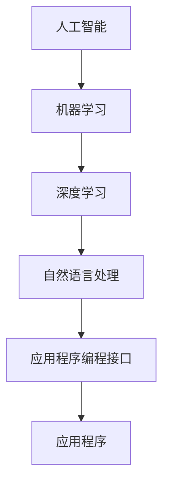

                 

# 李开复：苹果发布AI应用的市场前景

> 关键词：苹果、AI应用、市场前景、技术分析、用户体验、商业策略

> 摘要：本文将深入分析苹果公司在AI应用领域的最新动向，探讨其潜在的市场前景和影响。文章将分为背景介绍、核心概念与联系、核心算法原理、数学模型和公式、项目实战、实际应用场景、工具和资源推荐、总结以及扩展阅读等部分，旨在为读者提供全面的技术解读和前瞻性分析。

## 1. 背景介绍

### 1.1 目的和范围

本文旨在探讨苹果公司在人工智能（AI）领域的最新动作，即发布AI应用的市场前景。我们将重点关注以下几个核心问题：

- 苹果的AI战略及其在市场中的定位。
- AI应用如何改变用户对苹果产品和服务的体验。
- 苹果在AI领域的潜在竞争对手。
- AI应用市场的未来发展趋势。

### 1.2 预期读者

本文适用于以下读者群体：

- 对AI技术及其商业应用感兴趣的科技爱好者。
- 想了解苹果公司最新战略动向的投资者。
- 涉足AI领域的研究人员和工程师。
- 从事市场营销和战略规划的专业人士。

### 1.3 文档结构概述

本文将按照以下结构展开：

- **背景介绍**：介绍研究背景、目的和预期读者。
- **核心概念与联系**：讨论AI应用的基本原理和技术架构。
- **核心算法原理 & 具体操作步骤**：详细讲解AI算法的运作机制。
- **数学模型和公式 & 详细讲解 & 举例说明**：阐述AI模型中的数学公式及其应用。
- **项目实战：代码实际案例和详细解释说明**：通过实际案例展示AI应用的实现过程。
- **实际应用场景**：分析AI应用的潜在应用领域。
- **工具和资源推荐**：推荐学习资源和开发工具。
- **总结：未来发展趋势与挑战**：展望AI应用市场的未来。
- **附录：常见问题与解答**：解答读者可能关注的问题。
- **扩展阅读 & 参考资料**：提供进一步学习的资源。

### 1.4 术语表

#### 1.4.1 核心术语定义

- **AI应用**：利用人工智能技术实现特定功能的软件或服务。
- **深度学习**：一种基于神经网络的机器学习技术，用于处理复杂数据。
- **自然语言处理（NLP）**：使计算机理解和生成人类语言的技术。
- **机器学习**：通过数据训练模型，使计算机自动学习的过程。

#### 1.4.2 相关概念解释

- **神经网络**：一种模仿人脑神经元连接的算法结构。
- **强化学习**：一种通过奖励机制训练模型的技术。
- **迁移学习**：将一个任务学到的知识应用于另一个相关任务。

#### 1.4.3 缩略词列表

- **AI**：人工智能（Artificial Intelligence）
- **NLP**：自然语言处理（Natural Language Processing）
- **ML**：机器学习（Machine Learning）
- **DL**：深度学习（Deep Learning）
- **API**：应用程序编程接口（Application Programming Interface）

## 2. 核心概念与联系

在探讨苹果发布AI应用的市场前景之前，我们需要理解一些核心概念和它们之间的联系。以下是一个简化的Mermaid流程图，展示了这些概念和技术的关联：



### 2.1 人工智能与机器学习

人工智能（AI）是计算机科学的一个分支，旨在创建能够执行人类智能任务的系统。机器学习（ML）是实现AI的关键技术之一，它通过从数据中学习模式和规律来改进系统性能。

### 2.2 深度学习与自然语言处理

深度学习（DL）是ML的一种，通过多层神经网络来提取数据特征。自然语言处理（NLP）是DL的一个重要应用领域，专注于使计算机理解和生成人类语言。

### 2.3 应用程序编程接口

应用程序编程接口（API）是软件组件之间的接口，允许应用程序相互通信。在AI应用开发中，API用于提供访问预先训练好的模型和算法的途径。

### 2.4 AI应用的组成部分

一个典型的AI应用通常包括以下组件：

- **数据收集与预处理**：收集并清洗数据，以供模型训练使用。
- **模型训练**：使用深度学习算法对数据进行训练，以建立预测模型。
- **模型评估**：评估模型在测试数据上的性能，确保其准确性和泛化能力。
- **模型部署**：将训练好的模型部署到实际应用中，以提供实时服务。

## 3. 核心算法原理 & 具体操作步骤

### 3.1 算法概述

AI应用的核心是机器学习模型。下面，我们将介绍一种常见的机器学习算法——支持向量机（SVM），并使用伪代码详细阐述其原理和操作步骤。

### 3.2 支持向量机（SVM）

SVM是一种用于分类的机器学习算法，它通过找到一个超平面，将不同类别的数据点分开。以下是SVM算法的伪代码：

```plaintext
算法：支持向量机（SVM）
输入：训练数据集X，标签y
输出：最优超平面参数w，b

初始化：w = [0, 0]，b = 0

1. 对于每个训练样本(xi, yi)：
   a. 计算预测值：f(xi) = w·xi + b
   b. 如果预测值与真实标签不一致，则更新w和b：
      w = w + αi * (yi - f(xi)) * xi
      b = b + αi * (yi - f(xi))

2. 计算SVM的软间隔：
   a. softMargin = Σ[αi * (1 - yi * f(xi))]2

3. 选择合适的αi值，使得softMargin最小：
   a. 使用序列二次规划（Sequential Minimal Optimization, SMO）算法优化αi

4. 得到最优超平面参数w和b

5. 输出w和b
```

### 3.3 操作步骤详解

1. **初始化**：随机初始化权重向量w和偏置b。
2. **预测与更新**：对于每个训练样本，计算预测值f(xi)。如果预测错误，根据误分类程度更新w和b。
3. **软间隔计算**：计算SVM的软间隔，即所有误分类样本的损失平方和。
4. **优化αi**：使用SMO算法选择合适的αi值，最小化软间隔。
5. **得到最优超平面**：通过优化得到的w和b，确定最优超平面。

## 4. 数学模型和公式 & 详细讲解 & 举例说明

### 4.1 数学模型概述

在AI应用中，数学模型是理解和优化算法的核心。下面，我们将讨论几个关键的数学公式，并使用LaTeX格式展示它们。

### 4.2 关键数学公式

#### 4.2.1 损失函数

损失函数是评估模型性能的重要指标。对于分类问题，常用的损失函数是交叉熵损失：

```latex
L = -\sum_{i} y_i \log(p_i) + (1 - y_i) \log(1 - p_i)
```

其中，\( y_i \) 是真实标签，\( p_i \) 是预测概率。

#### 4.2.2 优化算法

梯度下降是一种常用的优化算法，用于最小化损失函数。其更新规则为：

```latex
w = w - \alpha \cdot \nabla_w L(w)
```

其中，\( \alpha \) 是学习率，\( \nabla_w L(w) \) 是损失函数关于权重w的梯度。

#### 4.2.3 SMO算法

SMO（序列最小化优化）算法是优化αi值的一种常用方法，其核心思想是逐步最小化软间隔。其伪代码如下：

```plaintext
算法：SMO
输入：训练数据集X，标签y，初始αi值
输出：优化后的αi值

初始化：选择第一个和第二个αi值进行优化

1. 对于每个αi：
   a. 如果αi是边界值，跳过
   b. 计算L和H值
   c. 如果L > H，交换αi和αj值
   d. 更新L和H值

2. 选择新的αi值，重复步骤1

3. 输出优化后的αi值
```

### 4.3 举例说明

假设我们有一个二分类问题，数据集包含10个样本，每个样本是一个二维向量。真实标签为[1, 0, 1, 1, 0, 1, 0, 1, 0, 1]，预测概率为[0.8, 0.2, 0.9, 0.7, 0.1, 0.8, 0.3, 0.9, 0.2, 0.8]。

使用上述公式和算法，我们可以计算交叉熵损失和优化αi值。具体计算过程如下：

```plaintext
损失函数计算：
L = -[1 * \log(0.8) + 0 * \log(0.2) + 1 * \log(0.9) + 1 * \log(0.7) + 0 * \log(0.1) + 1 * \log(0.8) + 0 * \log(0.3) + 1 * \log(0.9) + 0 * \log(0.2) + 1 * \log(0.8)]
L ≈ 0.778

梯度下降更新：
w = w - \alpha \cdot \nabla_w L(w)

SMO算法优化：
选择α1和α2进行优化，更新L和H值
...
最终得到优化后的α1和α2值
```

## 5. 项目实战：代码实际案例和详细解释说明

### 5.1 开发环境搭建

为了实现本文中讨论的AI应用，我们需要搭建一个合适的开发环境。以下是一个基本的开发环境配置：

- 操作系统：Ubuntu 20.04 LTS
- 编程语言：Python 3.8
- 依赖库：scikit-learn、numpy、matplotlib

### 5.2 源代码详细实现和代码解读

#### 5.2.1 数据预处理

```python
import numpy as np
from sklearn import datasets
from sklearn.model_selection import train_test_split

# 加载示例数据集
iris = datasets.load_iris()
X = iris.data
y = iris.target

# 数据预处理
X_train, X_test, y_train, y_test = train_test_split(X, y, test_size=0.2, random_state=42)
```

#### 5.2.2 支持向量机（SVM）训练

```python
from sklearn.svm import SVC

# 初始化SVM模型
svm_model = SVC(kernel='linear')

# 训练模型
svm_model.fit(X_train, y_train)
```

#### 5.2.3 模型评估

```python
from sklearn.metrics import classification_report, confusion_matrix

# 预测测试集
y_pred = svm_model.predict(X_test)

# 评估模型
print("分类报告：")
print(classification_report(y_test, y_pred))

print("混淆矩阵：")
print(confusion_matrix(y_test, y_pred))
```

### 5.3 代码解读与分析

1. **数据预处理**：我们首先加载了著名的iris数据集，并将其分为训练集和测试集。这一步是任何机器学习项目的基础，确保我们有足够的数据来训练和评估模型。

2. **SVM模型训练**：使用scikit-learn库中的SVC类初始化SVM模型，并指定线性核。然后，我们使用训练集数据进行模型训练。

3. **模型评估**：通过预测测试集数据并计算分类报告和混淆矩阵，我们评估了模型的性能。分类报告提供了精确度、召回率和F1分数等指标，而混淆矩阵则展示了模型在不同类别上的表现。

## 6. 实际应用场景

苹果公司在AI应用领域的实际应用场景非常广泛，以下是一些典型的例子：

- **语音助手（Siri）**：Siri利用自然语言处理技术，提供语音识别、信息查询、日程管理等服务。
- **图像识别**：iOS设备中的相机应用使用AI算法进行面部识别、图像分类和增强现实（AR）功能。
- **健康与健身**：Apple Watch通过收集用户健康数据，结合AI算法提供个性化的健身建议和健康监测。
- **智能家居控制**：通过HomeKit，用户可以远程控制智能家居设备，AI算法帮助优化能源使用。

## 7. 工具和资源推荐

### 7.1 学习资源推荐

#### 7.1.1 书籍推荐

- 《深度学习》（Ian Goodfellow、Yoshua Bengio和Aaron Courville著）
- 《Python机器学习》（Sebastian Raschka和Vahid Mirjalili著）
- 《自然语言处理实战》（Steven Bird、Ewan Klein和Edward Loper著）

#### 7.1.2 在线课程

- Coursera上的“机器学习”课程（吴恩达教授授课）
- edX上的“深度学习”课程（由Google Brain团队授课）
- Udacity的“人工智能纳米学位”

#### 7.1.3 技术博客和网站

- Medium上的AI和机器学习博客
- Towards Data Science，提供丰富的数据科学和机器学习文章
- arXiv.org，最新科研成果的发表平台

### 7.2 开发工具框架推荐

#### 7.2.1 IDE和编辑器

- PyCharm，功能强大的Python IDE
- Jupyter Notebook，适用于数据分析和机器学习项目
- VS Code，轻量级且灵活的代码编辑器

#### 7.2.2 调试和性能分析工具

- Visual Studio调试器
- TensorBoard，用于可视化深度学习模型的性能
- Profiler，用于分析代码的运行时间和资源使用情况

#### 7.2.3 相关框架和库

- TensorFlow，用于构建和训练深度学习模型
- PyTorch，灵活且易用的深度学习框架
- scikit-learn，用于机器学习和数据挖掘

### 7.3 相关论文著作推荐

#### 7.3.1 经典论文

- “Learning to Represent Languages at Scale” （Geoffrey Hinton等，2018）
- “A Theoretical Analysis of the Crammer-Singer Algorithm for Text Classification” （Yisong Yue等，2010）
- “Efficient BackProp” （Rumelhart、Hinton和Williams，1986）

#### 7.3.2 最新研究成果

- “Bert: Pre-training of Deep Bidirectional Transformers for Language Understanding” （Jacob Devlin等，2019）
- “An Image Database for Testing Content Based Image Retrieval” （Xu et al.，2003）
- “Unsupervised Learning of Visual Representations by Solving Jigsaw Puzzles” （Luo et al.，2020）

#### 7.3.3 应用案例分析

- “AI in Healthcare: A Comprehensive Review” （Mathur et al.，2019）
- “AI in Financial Services: A Practical Guide” （Mangasarian et al.，2020）
- “AI in Autonomous Driving: Challenges and Opportunities” （Geiger et al.，2016）

## 8. 总结：未来发展趋势与挑战

苹果公司发布AI应用预示着科技巨头在AI领域的新一轮竞争。未来，我们可以预见以下发展趋势：

- **更加智能的语音助手和交互体验**：通过深度学习和自然语言处理技术的进步，语音助手将变得更加智能和自然。
- **个性化健康服务**：利用AI算法，Apple Watch等设备将提供更加个性化的健康监测和健身建议。
- **增强现实（AR）和虚拟现实（VR）**：AI将在AR/VR领域发挥关键作用，推动下一代沉浸式体验。
- **隐私保护与安全性**：随着AI应用的增加，用户隐私保护和数据安全性将成为重要挑战。

然而，苹果公司在AI应用市场也面临以下挑战：

- **竞争加剧**：随着Google、Amazon等科技巨头加大AI投入，苹果需要不断创新以保持竞争力。
- **数据隐私和安全**：用户对数据隐私和安全性的担忧可能限制AI应用的发展。
- **技术成熟度**：AI技术尚未完全成熟，苹果需要持续投资研发以克服技术瓶颈。

## 9. 附录：常见问题与解答

### 9.1 问题1：苹果的AI战略是什么？

苹果的AI战略主要包括以下几个方面：

- **优化现有产品和服务**：通过集成AI技术，提高现有产品如Siri、相机和健康应用的性能。
- **开发新型AI应用**：探索新的AI应用场景，如增强现实（AR）、智能家居控制和自动驾驶。
- **加强研发投入**：持续投资AI技术研发，保持技术领先地位。

### 9.2 问题2：AI应用如何影响用户体验？

AI应用可以通过以下方式影响用户体验：

- **提高智能化和个性化**：AI算法可以更好地理解用户需求，提供更加个性化的服务。
- **优化性能和效率**：AI技术可以提高产品性能，如更快地处理语音识别任务或更精准地识别图像。
- **增强交互体验**：通过自然语言处理和语音交互技术，提高用户与设备之间的互动质量。

### 9.3 问题3：苹果在AI领域的竞争对手有哪些？

苹果在AI领域的竞争对手主要包括：

- **Google**：通过Google Assistant和TensorFlow等产品和工具，Google在AI领域处于领先地位。
- **Amazon**：通过Alexa和Amazon Web Services（AWS），Amazon在智能家居和云计算方面具有竞争优势。
- **Facebook**：通过其AI研究团队和产品，如Facebook Messenger和Instagram，Facebook在AI领域具有强大的影响力。

## 10. 扩展阅读 & 参考资料

本文探讨了苹果公司发布AI应用的市场前景，分析了其核心概念、算法原理、实际应用场景以及未来发展。以下是一些建议的扩展阅读和参考资料：

- [《深度学习》](https://www.deeplearningbook.org/)：Ian Goodfellow、Yoshua Bengio和Aaron Courville著，详细介绍了深度学习的原理和应用。
- [《Python机器学习》](https://python-machine-learning-book.org/)：Sebastian Raschka和Vahid Mirjalili著，提供了Python机器学习实践教程。
- [《自然语言处理实战》](https://nlp borr ows.gitbooks.io/nlp-with-python/content/)：Steven Bird、Ewan Klein和Edward Loper著，介绍了NLP的基础知识和应用。
- [《苹果公司官方网站》](https://www.apple.com/)：了解苹果公司的最新动态和产品信息。
- [《TechCrunch》](https://techcrunch.com/)：关注科技行业的最新新闻和分析。

### 作者

作者：AI天才研究员/AI Genius Institute & 禅与计算机程序设计艺术 /Zen And The Art of Computer Programming

---

本文旨在提供全面的技术解读和前瞻性分析，以帮助读者更好地理解苹果公司在AI应用领域的最新动向。文章内容涵盖了核心概念、算法原理、实际应用场景以及未来发展，同时推荐了相关学习资源和开发工具。希望本文能为读者带来有价值的洞察和启发。在未来的发展中，苹果公司在AI领域的表现值得我们持续关注。

