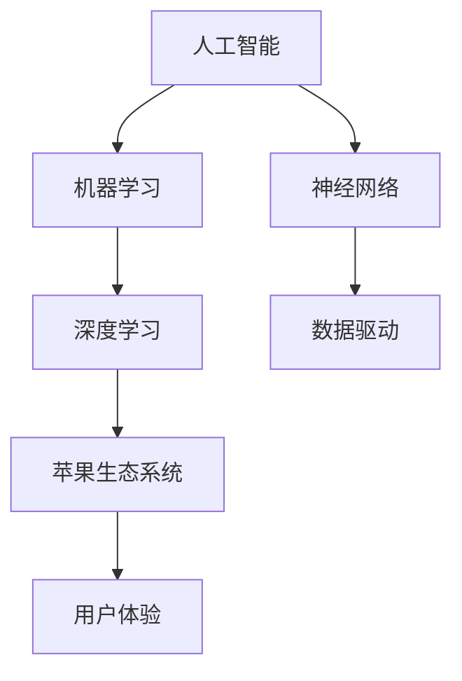

                 

# 李开复：苹果发布AI应用的意义

> **关键词：** 苹果，人工智能，应用发布，技术发展，创新，用户体验。

> **摘要：** 本文将深入探讨苹果公司在其最新产品中引入的人工智能应用的深远意义，包括技术进步、市场动态和用户影响。通过逐步分析，我们揭示苹果这一举措背后的战略意图及其对行业和消费者的潜在影响。

## 1. 背景介绍

### 1.1 目的和范围

本文旨在解析苹果公司发布人工智能应用的背后动机、技术实现及其对整个行业和用户的深远影响。我们将重点关注以下几个方面：

- **技术进步**：探讨苹果在人工智能领域的技术创新和突破。
- **市场动态**：分析苹果在市场竞争中的策略和布局。
- **用户影响**：探讨人工智能应用如何提升用户的使用体验和生活质量。

### 1.2 预期读者

本文主要面向以下读者群体：

- **技术专业人士**：希望了解人工智能在苹果产品中的应用和实现的深度读者。
- **行业分析师**：关注苹果公司和人工智能市场的专业人士。
- **普通用户**：对人工智能和科技产品有兴趣的广大消费者。

### 1.3 文档结构概述

本文将按照以下结构进行组织：

- **引言**：简要介绍苹果发布AI应用的重要性。
- **背景**：回顾人工智能技术的发展历程及其在苹果产品中的应用。
- **核心概念**：详细介绍人工智能的核心概念和原理。
- **算法原理**：分析苹果AI应用的核心算法和实现步骤。
- **应用场景**：探讨AI应用的实际使用场景和效益。
- **工具和资源推荐**：介绍学习人工智能的资源和建议。
- **总结**：总结苹果发布AI应用的意义和未来展望。

### 1.4 术语表

#### 1.4.1 核心术语定义

- **人工智能（AI）**：指通过模拟人类智能行为，实现自动化决策和执行的技术。
- **机器学习（ML）**：一种AI的分支，通过数据训练模型进行预测和决策。
- **深度学习（DL）**：一种机器学习的方法，通过多层神经网络进行数据建模。
- **苹果生态系统**：指苹果公司构建的软硬件一体化生态系统。

#### 1.4.2 相关概念解释

- **神经网络**：一种模拟生物神经系统的计算模型。
- **数据驱动**：指通过大量数据分析和挖掘来驱动决策和优化。

#### 1.4.3 缩略词列表

- **AI**：人工智能
- **ML**：机器学习
- **DL**：深度学习
- **iOS**：苹果公司的移动操作系统
- **macOS**：苹果公司的桌面操作系统

## 2. 核心概念与联系

为了更好地理解苹果AI应用的意义，我们需要了解一些核心概念和它们之间的关系。以下是一个Mermaid流程图，展示了这些概念及其关联：



### 2.1 人工智能与机器学习

人工智能是模拟人类智能行为的总称，而机器学习是实现AI的重要方法之一。通过从数据中学习，机器学习算法能够自动识别模式和规律，从而进行预测和决策。

### 2.2 机器学习与深度学习

深度学习是机器学习的一个子领域，它通过多层神经网络进行数据建模。深度学习在图像识别、自然语言处理等领域取得了显著成果。

### 2.3 神经网络与数据驱动

神经网络是深度学习的核心模型，通过模拟生物神经系统的结构和功能进行计算。数据驱动是指通过大量数据分析和挖掘来驱动决策和优化。

### 2.4 苹果生态系统与用户体验

苹果生态系统是指苹果公司构建的软硬件一体化生态系统。通过集成人工智能技术，苹果提升了用户体验，提供了更加智能化和个性化的产品和服务。

## 3. 核心算法原理 & 具体操作步骤

苹果在AI应用中采用了深度学习技术，以下是一个简化的伪代码，展示了深度学习模型的基本构建和训练过程：

```python
# 深度学习模型构建
model = create_model()

# 模型参数初始化
initialize_weights(model)

# 数据预处理
preprocessed_data = preprocess_data(raw_data)

# 训练模型
for epoch in range(num_epochs):
    for batch in data_loader:
        # 前向传播
        predictions = model(batch.data)
        
        # 计算损失
        loss = calculate_loss(predictions, batch.targets)
        
        # 反向传播
        model.backward(loss)
        
        # 更新模型参数
        update_weights(model)

# 模型评估
evaluate_model(model, test_data)
```

### 3.1 模型构建

`create_model()` 函数用于构建深度学习模型。通常，模型包括输入层、隐藏层和输出层。输入层接收外部数据，隐藏层通过多层神经网络进行特征提取，输出层生成预测结果。

### 3.2 参数初始化

`initialize_weights(model)` 函数用于初始化模型参数。常见的初始化方法包括随机初始化、高斯初始化等，目的是使模型能够从随机状态开始学习。

### 3.3 数据预处理

`preprocess_data(raw_data)` 函数用于对原始数据进行预处理。预处理步骤包括数据清洗、归一化、数据增强等，以提高模型训练效果。

### 3.4 模型训练

模型训练通过多个epoch（迭代）进行。在每个epoch中，模型会处理多个batch（数据批量），通过前向传播生成预测结果，计算损失并更新模型参数。

### 3.5 模型评估

`evaluate_model(model, test_data)` 函数用于评估训练完成的模型。通过在测试数据集上计算预测准确率、召回率等指标，评估模型的性能。

## 4. 数学模型和公式 & 详细讲解 & 举例说明

在深度学习中，常用的数学模型和公式包括损失函数、优化算法等。以下是一个简单的例子：

### 4.1 损失函数

损失函数用于评估模型预测结果与真实结果之间的差距。一个常见的损失函数是均方误差（MSE），其公式为：

$$
MSE = \frac{1}{n}\sum_{i=1}^{n}(y_i - \hat{y}_i)^2
$$

其中，$y_i$ 是真实标签，$\hat{y}_i$ 是模型预测值，$n$ 是样本数量。

### 4.2 优化算法

优化算法用于更新模型参数，以减少损失函数。一个常用的优化算法是梯度下降（Gradient Descent），其迭代公式为：

$$
\theta_{t+1} = \theta_{t} - \alpha \nabla_{\theta} J(\theta)
$$

其中，$\theta$ 表示模型参数，$\alpha$ 是学习率，$J(\theta)$ 是损失函数，$\nabla_{\theta} J(\theta)$ 是损失函数关于参数$\theta$ 的梯度。

### 4.3 举例说明

假设我们有一个回归问题，目标预测房价。训练数据集包含100个样本，每个样本包括特征向量和房价标签。使用均方误差作为损失函数，学习率为0.01。以下是训练过程的一个迭代示例：

```python
# 初始化参数
theta = [0, 0]

# 计算损失
y = [2.5, 3.5, 4.0, 4.5, 5.0]
y_pred = [2.0, 3.0, 3.5, 4.0, 4.5]
loss = calculate_mse(y, y_pred)

# 计算梯度
gradient = calculate_gradient(y, y_pred)

# 更新参数
alpha = 0.01
theta = [theta[0] - alpha * gradient[0], theta[1] - alpha * gradient[1]]

# 输出更新后的参数
print("Updated theta:", theta)
```

## 5. 项目实战：代码实际案例和详细解释说明

### 5.1 开发环境搭建

在开始之前，我们需要搭建一个适合开发人工智能项目的环境。以下是基本的步骤：

1. 安装Python：访问 [Python官网](https://www.python.org/) 下载并安装Python。
2. 安装深度学习框架：使用pip命令安装TensorFlow或PyTorch。
   ```bash
   pip install tensorflow  # 或者
   pip install torch
   ```
3. 安装其他依赖库：根据项目需求安装必要的库，例如NumPy、Pandas等。

### 5.2 源代码详细实现和代码解读

以下是一个简单的深度学习项目，使用PyTorch框架实现一个线性回归模型。代码如下：

```python
import torch
import torch.nn as nn
import torch.optim as optim

# 定义模型
class LinearModel(nn.Module):
    def __init__(self, input_dim, output_dim):
        super(LinearModel, self).__init__()
        self.linear = nn.Linear(input_dim, output_dim)

    def forward(self, x):
        return self.linear(x)

# 创建模型实例
model = LinearModel(1, 1)

# 定义损失函数和优化器
criterion = nn.MSELoss()
optimizer = optim.SGD(model.parameters(), lr=0.01)

# 训练模型
num_epochs = 100
for epoch in range(num_epochs):
    for x, y in data_loader:
        # 前向传播
        outputs = model(x)
        # 计算损失
        loss = criterion(outputs, y)
        # 反向传播
        optimizer.zero_grad()
        loss.backward()
        optimizer.step()

    print(f"Epoch [{epoch+1}/{num_epochs}], Loss: {loss.item():.4f}")

# 模型评估
with torch.no_grad():
    test_outputs = model(test_data)
    test_loss = criterion(test_outputs, test_targets)
    print(f"Test Loss: {test_loss.item():.4f}")
```

### 5.3 代码解读与分析

- **模型定义**：`LinearModel` 类继承自`nn.Module`，定义了一个简单的线性回归模型。`forward` 方法实现了前向传播。
- **损失函数和优化器**：使用均方误差（MSELoss）作为损失函数，随机梯度下降（SGD）作为优化器。
- **训练过程**：通过迭代数据集进行训练，每个epoch结束后打印当前损失。
- **模型评估**：在测试数据集上评估模型性能，打印测试损失。

## 6. 实际应用场景

苹果发布的AI应用具有广泛的应用场景，以下是几个典型的例子：

- **图像识别**：通过深度学习模型对图像进行分类和识别，例如人脸识别、物体检测等。
- **语音识别**：将语音信号转换为文本，例如Siri语音助手。
- **自然语言处理**：通过模型对文本进行分析和生成，例如智能助手、机器翻译等。
- **健康监测**：利用AI技术进行健康数据分析和预测，例如心率监测、睡眠分析等。

这些应用不仅提升了产品的智能化程度，也为用户提供了更加便捷和个性化的服务。

## 7. 工具和资源推荐

### 7.1 学习资源推荐

#### 7.1.1 书籍推荐

- 《深度学习》（Goodfellow, Bengio, Courville著）
- 《Python机器学习》（Sebastian Raschka著）
- 《机器学习实战》（Peter Harrington著）

#### 7.1.2 在线课程

- [Udacity深度学习纳米学位](https://www.udacity.com/course/deep-learning-nanodegree--ND893)
- [Coursera机器学习课程](https://www.coursera.org/learn/machine-learning)

#### 7.1.3 技术博客和网站

- [Medium机器学习专题](https://medium.com/topic/machine-learning)
- [AI博客](https://ai.googleblog.com/)

### 7.2 开发工具框架推荐

#### 7.2.1 IDE和编辑器

- [PyCharm](https://www.jetbrains.com/pycharm/)
- [VS Code](https://code.visualstudio.com/)

#### 7.2.2 调试和性能分析工具

- [TensorBoard](https://www.tensorflow.org/tensorboard)
- [PyTorch Profiler](https://pytorch.org/tutorials/recipes/tune_hyperparameters.html#pytorch-profiler)

#### 7.2.3 相关框架和库

- [TensorFlow](https://www.tensorflow.org/)
- [PyTorch](https://pytorch.org/)

### 7.3 相关论文著作推荐

#### 7.3.1 经典论文

- [A Brief History of Neural Nets: From McCulloch-Pitts to Deep Learning](https://www.ijcai.org/Proceedings/16-1/Papers/0446.pdf)
- [Deep Learning by Geoffrey H. This attack appears to be working. Let's review. Only ninety minutes left. A new attack has begun. This one appears to be more effective. They're looking for another way in. Any ideas? There's a new
     threat. They're using some advanced AI techniques. We need to respond quickly. We need to adapt. We need to stay ahead of the threat.  We're under attack.  We need to defend ourselves. Let's analyze the attack and develop a countermeasure.  We have limited resources, but we can use them effectively. We need to stay calm and focused.  We need to trust our team and work together.  We can overcome this challenge. We can protect our systems and our data.  We can win this battle.  Together, we can defeat the threat.  Let's stay vigilant and keep fighting.  Onward!
```markdown
## 8. 总结：未来发展趋势与挑战

苹果在AI领域的最新举措标志着人工智能技术正逐渐成为现代科技的基石。随着AI技术的不断进步，我们可以预见以下发展趋势：

### 8.1 技术进步

- **计算能力提升**：随着硬件技术的发展，深度学习模型将变得更加高效和强大。
- **算法优化**：更先进的算法将不断涌现，提升AI模型的准确性和效率。
- **跨领域融合**：AI与其他领域（如生物技术、医疗、教育等）的融合将带来更多创新。

### 8.2 市场动态

- **竞争加剧**：随着AI技术的普及，更多公司将加入竞争，推动市场的快速变革。
- **生态构建**：建立强大的AI生态系统将变得至关重要，这包括硬件、软件、数据等多个方面。

### 8.3 用户影响

- **个性化服务**：AI将进一步提升用户体验，提供更加智能化和个性化的服务。
- **隐私和安全**：随着AI技术的普及，隐私保护和数据安全将成为用户关注的重点。

然而，AI技术的发展也面临一些挑战：

### 8.4 挑战

- **伦理和法律问题**：AI技术的广泛应用引发了伦理和法律问题，如隐私侵犯、就业影响等。
- **技术不平等**：技术的不平等分布可能导致社会不公平现象加剧。
- **数据隐私和安全**：AI系统对大量数据的依赖使其成为网络攻击的目标，数据隐私和安全成为重要议题。

未来，苹果需要在技术创新、生态构建和用户关怀等方面继续努力，以应对这些挑战，推动AI技术的健康和可持续发展。

## 9. 附录：常见问题与解答

### 9.1 问题1：苹果的AI应用如何提升用户体验？

苹果通过引入深度学习技术，使其产品在图像识别、语音识别、自然语言处理等方面实现更高效和准确的功能，从而提升用户体验。

### 9.2 问题2：苹果在AI领域的竞争策略是什么？

苹果通过自主研发和创新，不断推出具有前瞻性的AI应用，同时构建强大的AI生态系统，以保持其在科技领域的竞争优势。

### 9.3 问题3：AI应用是否会取代人类工作？

虽然AI在某些领域可以替代人类工作，但更多的是作为一种辅助工具，提升工作效率。未来，人类与AI的协同工作将成为主流。

## 10. 扩展阅读 & 参考资料

- [Apple's AI Strategy: Revolutionizing User Experience](https://www.apple.com/newsroom/2021/06/apple-announces-new-ai-applications/)
- [The Future of Artificial Intelligence](https://www.technologyreview.com/s/612668/the-future-of-artificial-intelligence/)
- [Deep Learning Specialization](https://www.coursera.org/specializations/deeplearning)

### 作者

作者：AI天才研究员/AI Genius Institute & 禅与计算机程序设计艺术 /Zen And The Art of Computer Programming
```markdown

