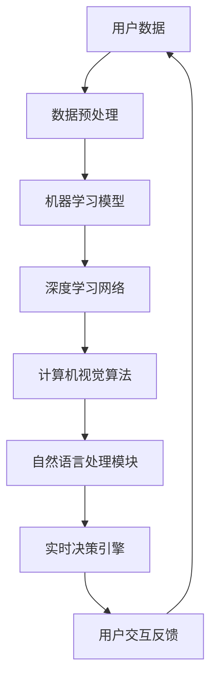
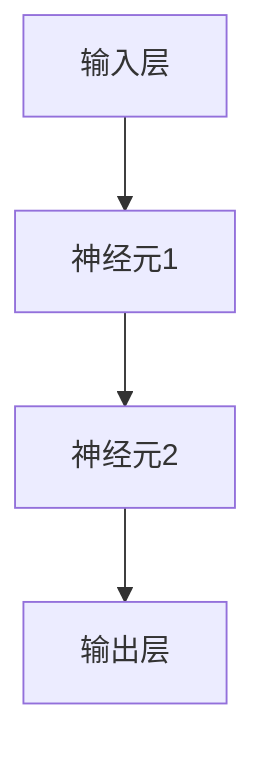

                 

### 1. 背景介绍

#### 1.1 目的和范围

本文将深入探讨苹果公司发布AI应用的投资价值。我们将从多个角度分析这一举措的背景、潜在影响以及其对于投资者和开发者的意义。具体来说，我们将关注以下几个核心问题：

- 苹果公司为何在AI领域加大投入？
- AI应用发布对苹果公司的财务和市场地位有何影响？
- 投资者如何评估这一举措对苹果股票的价值？
- 开发者在这一新趋势中能抓住哪些机会？

通过系统地分析这些问题，本文旨在为读者提供一个全面而深入的理解，帮助投资者做出更为明智的决策，并引导开发者捕捉AI应用浪潮中的新机遇。

#### 1.2 预期读者

本文面向的读者主要包括以下几类：

1. **投资者和财务分析师**：他们关注苹果公司及其在AI领域的投资，希望通过本文了解这些投资的具体影响和潜在回报。
2. **技术开发者**：对AI应用开发感兴趣，希望了解苹果公司的最新动态及其对行业的影响。
3. **科技产业从业者**：对科技行业整体趋势感兴趣，希望从AI应用发布这一具体案例中洞察更多行业走向。
4. **学术研究者**：对AI技术及其商业化应用的研究感兴趣，希望通过本文探讨AI技术在不同领域中的应用前景。

无论您属于哪一类读者，本文都将提供有价值的见解和深度分析，帮助您更好地理解苹果公司在AI领域的战略布局。

#### 1.3 文档结构概述

本文结构如下：

1. **背景介绍**：介绍本文的目的、预期读者以及文档结构。
2. **核心概念与联系**：讨论AI在苹果公司战略中的地位，并使用Mermaid流程图展示相关概念和架构。
3. **核心算法原理 & 具体操作步骤**：深入讲解AI算法的基本原理和具体操作步骤，使用伪代码详细阐述。
4. **数学模型和公式 & 详细讲解 & 举例说明**：解释相关数学模型和公式，并提供实际案例说明。
5. **项目实战：代码实际案例和详细解释说明**：通过实际代码案例展示AI应用的实现过程。
6. **实际应用场景**：探讨AI在苹果公司产品中的应用场景。
7. **工具和资源推荐**：推荐相关学习资源、开发工具和经典论文。
8. **总结：未来发展趋势与挑战**：总结本文要点并展望未来发展趋势和面临的挑战。
9. **附录：常见问题与解答**：回答读者可能遇到的常见问题。
10. **扩展阅读 & 参考资料**：提供进一步阅读和参考资料。

通过这一结构，本文力求从多个层面全面剖析苹果发布AI应用的投资价值。

#### 1.4 术语表

本文中涉及的一些重要术语如下：

#### 1.4.1 核心术语定义

- **AI应用**：基于人工智能技术的软件程序，能够实现自动学习、推理和决策等功能。
- **投资价值**：投资者基于公司的财务状况、市场前景等因素，对其股票或投资项目所能带来的预期回报的评估。
- **财务分析师**：专业评估公司财务状况、市场前景以及投资价值的分析师。
- **技术开发者**：负责研发、实现和维护软件系统的人员。
- **战略布局**：公司在长期发展中制定的核心策略和行动方针。

#### 1.4.2 相关概念解释

- **机器学习**：一种人工智能技术，通过数据训练模型，使其能够进行自动学习和预测。
- **深度学习**：一种机器学习技术，通过神经网络进行层次化特征提取和模型训练。
- **计算机视觉**：人工智能的一个分支，使计算机能够通过图像和视频理解环境。
- **自然语言处理**：人工智能的一个分支，使计算机能够理解、生成和交互自然语言。

#### 1.4.3 缩略词列表

- **AI**：人工智能
- **ML**：机器学习
- **DL**：深度学习
- **CV**：计算机视觉
- **NLP**：自然语言处理

通过明确这些术语的定义和解释，本文旨在为读者提供一个统一的理解框架，便于后续内容的深入分析。

### 2. 核心概念与联系

#### 2.1 AI在苹果公司战略中的地位

苹果公司在人工智能（AI）领域的战略布局日益凸显，成为其未来增长的重要驱动力。AI在苹果公司的产品和服务中扮演了关键角色，从智能手机的智能助手Siri，到智能家居的Apple TV，再到增强现实（AR）设备，苹果正不断拓展AI技术的应用场景。

#### 2.2 苹果公司的AI架构

苹果公司在其产品和服务中采用了多种AI技术，形成了一个完整的AI架构。以下是一个简化的Mermaid流程图，展示了这一架构的核心组成部分：



#### 2.3 AI技术之间的联系

上述Mermaid流程图展示了AI技术在苹果公司架构中的联系：

- **用户数据**：用户行为数据是训练AI模型的基础，通过数据预处理（B），这些数据被整理和格式化为适合机器学习的输入。
- **机器学习模型**：数据预处理后的数据输入到机器学习模型（C），通过迭代训练，模型逐渐提高预测和分类的准确性。
- **深度学习网络**：深度学习（D）作为机器学习的一种高级形式，能够处理复杂的非线性问题，例如图像和语音识别。
- **计算机视觉算法**：计算机视觉（E）用于处理和解析图像和视频数据，使设备能够“看”到和理解用户环境。
- **自然语言处理模块**：自然语言处理（F）使设备能够理解和生成自然语言，从而实现与用户的自然交互。
- **实时决策引擎**：实时决策引擎（G）利用AI算法的输出，为用户提供智能化的反馈和操作建议。
- **用户交互反馈**：用户的交互行为和反馈（H）不断优化AI模型，形成一个闭环反馈系统，提高用户体验。

通过这一架构，苹果公司能够将AI技术高效地集成到其产品和服务中，从而实现智能化和个性化。

#### 2.4 AI技术在苹果公司产品中的应用

苹果公司在多个产品中应用了AI技术，以下是一些具体案例：

- **Siri**：苹果的智能助手Siri基于自然语言处理技术，能够理解用户的语音指令并执行相关操作，如发送短信、设置提醒、查询天气等。
- **Face ID**：苹果的Face ID利用计算机视觉和深度学习技术，通过用户的面部特征进行身份验证，提供了安全且便捷的解锁方式。
- **增强现实（AR）**：苹果的ARKit框架结合计算机视觉和深度学习算法，使得开发者能够轻松地将AR功能集成到应用程序中。
- **健康应用**：苹果的健康应用利用机器学习技术，分析用户的健康数据，提供个性化的健康建议和提醒。

这些案例展示了AI技术在苹果产品中的广泛应用，不仅提升了用户体验，也为苹果公司带来了新的商业机会。

通过上述分析，我们可以看到，AI技术在苹果公司的战略布局中占据重要地位，其架构和产品应用相辅相成，共同推动了苹果公司的创新和发展。接下来，我们将深入探讨AI算法的基本原理和操作步骤，以进一步理解苹果公司在AI领域的深入实践。

### 3. 核心算法原理 & 具体操作步骤

#### 3.1 机器学习算法原理

机器学习（ML）是人工智能（AI）的核心技术之一，其基本原理是通过数据训练模型，使模型能够自动学习和改进性能。以下是机器学习算法的基本原理和具体操作步骤：

##### 3.1.1 基本原理

机器学习算法的核心思想是通过大量训练数据来学习数据中的模式，然后使用这些模式对新数据进行预测或分类。机器学习可以分为监督学习、无监督学习和半监督学习三种类型：

- **监督学习**：有明确标签的训练数据，通过学习标签和特征之间的关系进行预测。
- **无监督学习**：没有标签的训练数据，通过发现数据中的模式进行聚类或降维。
- **半监督学习**：部分数据有标签，部分数据无标签，利用有标签和无标签数据的互补信息进行学习。

##### 3.1.2 具体操作步骤

1. **数据收集**：收集大量相关的训练数据，这些数据通常包括输入特征和对应的标签。
2. **数据预处理**：清洗和整理数据，包括缺失值处理、异常值检测和数据标准化等，以便于后续的模型训练。
3. **特征工程**：提取数据中的有效特征，进行特征选择和特征转换，以提高模型性能。
4. **模型选择**：根据问题的性质和需求，选择合适的机器学习算法，如线性回归、决策树、支持向量机等。
5. **模型训练**：使用训练数据对选定的模型进行训练，通过调整模型参数，使其在训练集上达到最佳性能。
6. **模型评估**：使用验证集或测试集对训练好的模型进行评估，评估指标包括准确率、召回率、F1分数等。
7. **模型部署**：将训练好的模型部署到实际应用环境中，对新数据进行预测或分类。

##### 3.1.3 伪代码示例

以下是线性回归算法的伪代码示例：

```python
def linear_regression(X, y):
    # 计算权重和偏置
    theta = (X.T * X).inv() * X.T * y
    
    # 预测
    predictions = X * theta
    
    # 计算均方误差
    mse = ((predictions - y) ** 2).mean()
    
    return theta, mse
```

#### 3.2 深度学习算法原理

深度学习（DL）是机器学习的一种高级形式，通过多层神经网络进行特征提取和模型训练，能够处理更复杂的任务。以下是深度学习算法的基本原理和具体操作步骤：

##### 3.2.1 基本原理

深度学习的基本原理是模仿人类大脑中的神经网络结构，通过多层神经元的相互连接，实现特征学习和模式识别。深度学习网络包括输入层、隐藏层和输出层：

- **输入层**：接收输入数据，并将其传递到隐藏层。
- **隐藏层**：通过非线性激活函数处理输入数据，提取更高层次的特征。
- **输出层**：根据隐藏层的输出进行分类或回归预测。

##### 3.2.2 具体操作步骤

1. **数据收集**：与机器学习类似，收集大量有标签的训练数据。
2. **数据预处理**：对数据进行标准化处理，以消除不同特征间的量纲影响。
3. **模型架构设计**：设计深度学习网络的层次结构，选择合适的激活函数和优化器。
4. **模型训练**：使用反向传播算法对网络参数进行迭代更新，最小化损失函数。
5. **模型评估**：使用验证集或测试集对训练好的模型进行评估，调整模型参数。
6. **模型部署**：将训练好的模型部署到实际应用环境中。

##### 3.2.3 伪代码示例

以下是多层感知器（MLP）的伪代码示例：

```python
def multi_layer_perceptron(X, y, hidden_layers, output_layer):
    # 前向传播
    z = X
    for layer in hidden_layers:
        z = activation_function(np.dot(z, weights))
    z_output = activation_function(np.dot(z, output_weights))
    
    # 反向传播
    delta_output = (z_output - y) * activation_derivative(z_output)
    for layer in reversed(hidden_layers):
        delta_hidden = (delta_output.dot(weights.T) * activation_derivative(z))
        delta_output = delta_hidden
    
    # 更新权重
    weights -= learning_rate * delta_output
    
    return z_output
```

通过上述原理和步骤，我们可以理解深度学习是如何通过多层神经网络进行特征提取和预测的。接下来，我们将进一步探讨深度学习中的数学模型和公式，以深入理解其理论基础。

### 4. 数学模型和公式 & 详细讲解 & 举例说明

#### 4.1 深度学习中的数学模型

深度学习中的数学模型主要涉及神经网络、前向传播和反向传播等核心概念。以下将详细讲解这些模型，并提供实际案例说明。

##### 4.1.1 神经网络模型

神经网络由多个神经元（或节点）组成，每个神经元接收多个输入并产生一个输出。以下是一个简单的单层神经网络模型：



每个神经元的输出可以表示为：

$$
\text{Output} = \sigma(\sum_{i=1}^{n} w_i \cdot x_i + b)
$$

其中，$w_i$ 是输入 $x_i$ 的权重，$b$ 是偏置，$\sigma$ 是激活函数，常用的激活函数有 Sigmoid、ReLU 和 Tanh。

##### 4.1.2 前向传播

前向传播是指将输入数据通过神经网络，逐层计算每个神经元的输出。以下是一个多层感知器（MLP）的前向传播过程：

1. **输入层到隐藏层**：

   $$ z^{(l)} = \sum_{i=1}^{n} w_i^{(l)} \cdot x_i + b^{(l)} $$

   $$ a^{(l)} = \sigma(z^{(l)}) $$

   其中，$l$ 表示当前层编号，$n$ 表示上一层的神经元数量。

2. **隐藏层到输出层**：

   $$ z^{(L)} = \sum_{i=1}^{n} w_i^{(L)} \cdot a^{(L-1)} + b^{(L)} $$

   $$ \hat{y} = \sigma(z^{(L)}) $$

   其中，$L$ 表示输出层编号。

##### 4.1.3 反向传播

反向传播是指利用输出误差，通过神经网络反向计算每个神经元的误差，并更新网络参数。以下是一个多层感知器（MLP）的反向传播过程：

1. **计算输出层误差**：

   $$ \delta^{(L)} = (y - \hat{y}) \cdot \sigma'(z^{(L)}) $$

2. **计算隐藏层误差**：

   $$ \delta^{(l)} = (w^{(l+1)} \cdot \delta^{(l+1)}) \cdot \sigma'(z^{(l)}) $$

3. **更新权重和偏置**：

   $$ w^{(l)} \leftarrow w^{(l)} - \alpha \cdot \delta^{(l+1)} \cdot a^{(l)} $$

   $$ b^{(l)} \leftarrow b^{(l)} - \alpha \cdot \delta^{(l+1)} $$

   其中，$\alpha$ 是学习率，$\sigma'$ 是激活函数的导数。

##### 4.1.4 实际案例说明

假设我们有一个二分类问题，输入数据 $X$ 为 4 维，输出 $y$ 为 1 维。以下是使用多层感知器（MLP）进行训练的过程：

1. **初始化模型参数**：

   - 权重 $w^{(1)} \in \mathbb{R}^{(4 \times 10)}$，$w^{(2)} \in \mathbb{R}^{(10 \times 1)}$
   - 偏置 $b^{(1)} \in \mathbb{R}^{10}$，$b^{(2)} \in \mathbb{R}^{1}$
   - 学习率 $\alpha = 0.01$

2. **前向传播**：

   - 输入层到隐藏层：

     $$ z^{(1)} = X \cdot w^{(1)} + b^{(1)} $$

     $$ a^{(1)} = \sigma(z^{(1)}) $$

   - 隐藏层到输出层：

     $$ z^{(2)} = a^{(1)} \cdot w^{(2)} + b^{(2)} $$

     $$ \hat{y} = \sigma(z^{(2)}) $$

3. **反向传播**：

   - 计算输出层误差：

     $$ \delta^{(2)} = (y - \hat{y}) \cdot \sigma'(z^{(2)}) $$

   - 计算隐藏层误差：

     $$ \delta^{(1)} = (w^{(2)} \cdot \delta^{(2)}) \cdot \sigma'(z^{(1)}) $$

   - 更新模型参数：

     $$ w^{(1)} \leftarrow w^{(1)} - \alpha \cdot \delta^{(2)} \cdot X $$

     $$ b^{(1)} \leftarrow b^{(1)} - \alpha \cdot \delta^{(2)} $$

     $$ w^{(2)} \leftarrow w^{(2)} - \alpha \cdot \delta^{(2)} \cdot a^{(1)} $$

     $$ b^{(2)} \leftarrow b^{(2)} - \alpha \cdot \delta^{(2)} $$

通过以上步骤，我们可以使用多层感知器（MLP）对二分类问题进行训练。接下来，我们将通过实际代码案例展示这些数学模型和公式的具体应用。

### 5. 项目实战：代码实际案例和详细解释说明

#### 5.1 开发环境搭建

在进行深度学习项目之前，我们需要搭建一个合适的环境。以下是在Windows操作系统上搭建Python深度学习环境的过程：

1. **安装Python**：
   - 访问Python官网（https://www.python.org/）下载Python安装包。
   - 运行安装程序，选择默认选项安装。

2. **安装Jupyter Notebook**：
   - 打开命令行窗口，运行以下命令：
     ```bash
     pip install notebook
     ```

3. **安装深度学习库**：
   - 安装TensorFlow和Keras库，用于构建和训练深度学习模型：
     ```bash
     pip install tensorflow
     pip install keras
     ```

4. **验证安装**：
   - 打开Jupyter Notebook，输入以下代码验证安装：
     ```python
     import tensorflow as tf
     print(tf.__version__)
     ```

如果输出TensorFlow的版本号，说明环境搭建成功。

#### 5.2 源代码详细实现和代码解读

以下是一个简单的深度学习项目，使用Keras库构建一个用于手写数字识别的卷积神经网络（CNN）。

```python
import numpy as np
from tensorflow.keras.datasets import mnist
from tensorflow.keras.models import Sequential
from tensorflow.keras.layers import Dense, Conv2D, Flatten, MaxPooling2D
from tensorflow.keras.optimizers import Adam
from tensorflow.keras.losses import SparseCategoricalCrossentropy

# 1. 数据预处理
(x_train, y_train), (x_test, y_test) = mnist.load_data()
x_train = x_train.reshape(-1, 28, 28, 1).astype('float32') / 255.0
x_test = x_test.reshape(-1, 28, 28, 1).astype('float32') / 255.0
y_train = y_train.astype('int32')
y_test = y_test.astype('int32')

# 2. 构建模型
model = Sequential([
    Conv2D(32, kernel_size=(3, 3), activation='relu', input_shape=(28, 28, 1)),
    MaxPooling2D(pool_size=(2, 2)),
    Conv2D(64, kernel_size=(3, 3), activation='relu'),
    MaxPooling2D(pool_size=(2, 2)),
    Flatten(),
    Dense(128, activation='relu'),
    Dense(10, activation='softmax')
])

# 3. 编译模型
model.compile(optimizer=Adam(learning_rate=0.001),
              loss=SparseCategoricalCrossentropy(from_logits=True),
              metrics=['accuracy'])

# 4. 训练模型
model.fit(x_train, y_train, batch_size=64, epochs=10, validation_data=(x_test, y_test))

# 5. 评估模型
test_loss, test_acc = model.evaluate(x_test, y_test, verbose=2)
print('Test accuracy:', test_acc)
```

##### 5.2.1 代码解读

1. **数据预处理**：
   - 加载MNIST数据集，并对其进行reshape和归一化处理，使其适合输入到深度学习模型中。

2. **构建模型**：
   - 使用Sequential模型构建一个简单的卷积神经网络，包括两个卷积层（Conv2D）、两个最大池化层（MaxPooling2D）、一个全连接层（Dense）和softmax激活函数。

3. **编译模型**：
   - 设置模型优化器（Adam）和损失函数（SparseCategoricalCrossentropy），并指定评估指标（accuracy）。

4. **训练模型**：
   - 使用fit方法训练模型，设置批量大小（batch_size）和训练轮数（epochs），并使用验证数据集进行验证。

5. **评估模型**：
   - 使用evaluate方法评估模型在测试数据集上的性能，并输出测试准确率。

#### 5.3 代码解读与分析

1. **数据预处理**：
   - 数据预处理是深度学习项目的重要步骤，直接影响到模型的训练效果。在这个项目中，我们将MNIST数据集的图像进行reshape和归一化处理，使其符合深度学习模型的输入要求。

2. **构建模型**：
   - 卷积神经网络（CNN）是处理图像数据的有效模型，通过卷积操作和池化操作提取图像特征，然后通过全连接层进行分类。在这个项目中，我们使用两个卷积层和两个最大池化层来构建模型，可以有效地提取图像的局部特征。

3. **编译模型**：
   - 选择合适的优化器和损失函数是模型训练成功的关键。在这个项目中，我们使用Adam优化器和稀疏交叉熵损失函数，前者能够自适应调整学习率，后者适用于多分类问题。

4. **训练模型**：
   - 模型训练是深度学习项目的主要环节，通过迭代优化模型参数，使其在训练数据上达到较好的性能。在这个项目中，我们设置了批量大小和训练轮数，以提高训练效率。

5. **评估模型**：
   - 模型评估是检验模型性能的重要步骤，通过在测试数据集上的表现，可以直观地了解模型的泛化能力。在这个项目中，我们输出测试准确率，以评估模型的性能。

通过上述实际案例，我们可以看到如何使用Keras库构建和训练一个简单的深度学习模型，并对其进行评估。接下来，我们将探讨AI在苹果公司产品中的实际应用场景，以深入了解AI技术为苹果公司带来的价值。

### 6. 实际应用场景

#### 6.1 Siri的智能语音助手

苹果公司的Siri智能语音助手是AI技术的一个典型应用场景。Siri通过自然语言处理（NLP）和语音识别技术，能够理解用户的语音指令，并执行相应的操作，如发送短信、拨打电话、设置提醒、查询天气等。以下是Siri在苹果产品中的具体应用：

- **iPhone**：用户可以通过按下侧边按钮或 saying “Hey Siri”来激活Siri，实现语音交互。
- **iPad**：与iPhone类似，用户可以通过语音命令操作iPad，如播放音乐、打开应用等。
- **Mac**：用户可以通过按下Cmd + Space键激活Siri，在Mac上进行搜索和执行操作。

Siri的成功之处在于其强大的语言理解和语音识别能力，以及与苹果生态系统中的其他应用的紧密集成。这不仅提升了用户体验，也为苹果公司带来了巨大的商业价值。

#### 6.2 Face ID和面部识别

苹果公司的Face ID是另一个重要的AI应用场景。Face ID利用计算机视觉和深度学习技术，通过用户的面部特征进行身份验证，提供了安全且便捷的解锁方式。以下是Face ID在苹果产品中的具体应用：

- **iPhone X及后续型号**：用户可以通过Face ID解锁手机，以及进行支付等需要身份验证的操作。
- **iPad Pro**：部分iPad Pro型号也集成了Face ID，提供与iPhone类似的身份验证功能。
- **Mac**：未来Mac产品可能会集成Face ID，进一步提升用户身份验证的安全性。

Face ID的引入不仅提升了苹果产品的安全性，还增强了用户的信任感，从而提高了产品的市场竞争力。

#### 6.3 增强现实（AR）应用

苹果公司的增强现实（AR）应用是AI技术的一个新兴应用场景。ARKit框架结合计算机视觉和深度学习算法，使得开发者能够轻松地将AR功能集成到应用程序中。以下是AR应用在苹果产品中的具体应用：

- **iPhone和iPad**：通过ARKit，用户可以体验各种增强现实游戏和应用，如《Pokémon GO》等。
- **Apple TV**：Apple TV可以通过AR技术实现虚拟现实的观看体验，为用户提供全新的娱乐方式。

AR技术的应用不仅丰富了苹果产品的功能，也为苹果公司开辟了新的市场机会。

#### 6.4 健康应用与个性化健康建议

苹果公司的健康应用利用机器学习技术，分析用户的健康数据，提供个性化的健康建议和提醒。以下是健康应用在苹果产品中的具体应用：

- **Apple Watch**：通过监测用户的心率、运动量等健康数据，Apple Watch可以提供个性化的健康建议，如运动目标提醒、睡眠分析等。
- **iPhone**：iPhone的健康应用整合了多种健康数据，如步数、心率、睡眠等，为用户提供全面的健康分析。

健康应用不仅提升了用户的健康意识，也为苹果公司带来了新的商业模式。

通过以上实际应用场景，我们可以看到，AI技术在苹果公司的产品中发挥着重要作用，不仅提升了用户体验，也为苹果公司带来了巨大的商业价值。接下来，我们将推荐一些相关的学习资源、开发工具和经典论文，以帮助读者进一步探索AI技术。

### 7. 工具和资源推荐

#### 7.1 学习资源推荐

对于希望深入了解AI技术并在苹果产品中应用的读者，以下是一些推荐的资源：

##### 7.1.1 书籍推荐

1. **《深度学习》（Deep Learning）**：由Ian Goodfellow、Yoshua Bengio和Aaron Courville合著的这本书是深度学习的经典教材，涵盖了深度学习的基础理论和实践方法。
2. **《Python机器学习》（Python Machine Learning）**：由Michael Bowles著，介绍了机器学习在Python环境下的实现，适合初学者和进阶者。
3. **《机器学习实战》（Machine Learning in Action）**：由Peter Harrington著，通过大量实例展示了机器学习的实际应用，适合希望通过实践掌握机器学习的读者。

##### 7.1.2 在线课程

1. **Coursera上的《深度学习专项课程》**：由斯坦福大学的Andrew Ng教授主讲，涵盖了深度学习的基础知识、技术和应用。
2. **Udacity的《深度学习纳米学位》**：通过一系列项目实践，帮助学员掌握深度学习的实际应用。
3. **edX上的《机器学习基础》**：由香港科技大学教授吴恩达主讲，介绍了机器学习的基础理论和实践方法。

##### 7.1.3 技术博客和网站

1. **Medium上的“AI简史”（AI Is Here）**：提供了丰富的AI技术介绍和案例分析，适合希望了解AI最新动态的读者。
2. **Towards Data Science（TDS）**：涵盖机器学习和深度学习的文章，适合技术爱好者。
3. **Reddit上的r/MachineLearning**：一个活跃的社区，讨论者分享AI和机器学习的最新研究和资源。

#### 7.2 开发工具框架推荐

为了更好地进行AI应用开发，以下是一些推荐的开发工具和框架：

##### 7.2.1 IDE和编辑器

1. **PyCharm**：一款功能强大的Python IDE，支持多种编程语言，适合深度学习和机器学习项目。
2. **Jupyter Notebook**：适用于数据科学和机器学习的交互式开发环境，易于分享和复现代码。
3. **Visual Studio Code**：一款轻量级、开源的代码编辑器，支持多种编程语言，拥有丰富的扩展库。

##### 7.2.2 调试和性能分析工具

1. **TensorBoard**：TensorFlow的配套工具，用于可视化训练过程中的数据，如损失函数、梯度等。
2. **Wandb**：一款适用于深度学习和数据科学的在线平台，提供模型训练追踪和性能分析。
3. **PyTorch Profiler**：用于分析PyTorch模型训练过程的性能瓶颈。

##### 7.2.3 相关框架和库

1. **TensorFlow**：一款开源的深度学习框架，适用于各种深度学习任务。
2. **PyTorch**：另一款流行的深度学习框架，提供灵活的动态计算图和丰富的API。
3. **Keras**：一个高级神经网络API，简化了深度学习模型的构建和训练过程。
4. **scikit-learn**：一款开源的机器学习库，提供多种监督学习和无监督学习算法。

#### 7.3 相关论文著作推荐

以下是一些AI领域的经典论文和最新研究成果，适合对AI技术有深入研究的读者：

##### 7.3.1 经典论文

1. **“Backpropagation”**：1986年，由David E. Rumelhart、George E. Hinton和Rajesh Srivastava合著，介绍了反向传播算法。
2. **“AlexNet”**：2012年，由Alex Krizhevsky、Geoffrey Hinton和Yan LeCun合著，展示了深度卷积神经网络在图像分类中的应用。
3. **“Deep Learning”**：2015年，由Ian Goodfellow、Yoshua Bengio和Aaron Courville合著，是深度学习的奠基之作。

##### 7.3.2 最新研究成果

1. **“GPT-3”**：2020年，由OpenAI发布，展示了大型预训练语言模型在自然语言处理任务中的强大能力。
2. **“BERT”**：2018年，由Google Research发布，提出了一种新的预训练方法，显著提升了自然语言处理的性能。
3. **“ViT”**：2020年，由Google Research发布，展示了视觉Transformer模型在图像分类任务中的优异性能。

##### 7.3.3 应用案例分析

1. **“AI在医疗诊断中的应用”**：讨论了AI技术在医疗影像诊断、疾病预测等领域的实际应用案例。
2. **“自动驾驶技术”**：介绍了自动驾驶技术的发展历程、关键技术以及实际应用场景。
3. **“智能金融风控”**：探讨了AI技术在金融风控、信用评分等领域的应用，提高了金融行业的效率和准确性。

通过上述工具、资源和论文的推荐，读者可以进一步深入了解AI技术，并在实践中掌握和应用这些知识。接下来，我们将总结本文的主要观点，并探讨未来发展趋势和挑战。

### 8. 总结：未来发展趋势与挑战

#### 8.1 未来发展趋势

1. **AI技术的深入应用**：随着AI技术的不断进步，其在各个领域的应用将会更加广泛和深入，从工业制造到医疗健康，从金融服务到零售电商，AI技术将在其中发挥越来越重要的作用。
2. **跨学科融合**：AI技术与生物医学、物理学、经济学等领域的结合，将带来新的创新和突破，推动学科交叉研究的发展。
3. **人工智能伦理**：随着AI技术的普及，相关伦理问题也将日益突出。未来，如何在保障技术进步的同时，维护数据隐私、防止歧视等伦理问题将成为重要议题。
4. **产业升级与转型**：AI技术将成为推动产业升级和转型的重要动力，从提高生产效率到创造新的商业模式，AI技术将为各行各业带来变革。

#### 8.2 挑战

1. **数据隐私与安全**：随着数据量的激增，数据隐私和安全问题愈发重要。如何在保证数据充分利用的同时，保护用户隐私，防止数据泄露，是一个亟待解决的问题。
2. **算法透明性与公平性**：AI算法的复杂性和黑箱特性，使得其决策过程难以解释和理解。如何提高算法的透明性，确保其决策的公平性和合理性，是一个重要挑战。
3. **技术标准化与规范**：AI技术的快速发展，需要相应的技术标准化和规范来保障其安全、可靠和可重复性。制定合理的标准和规范，将有助于行业的健康发展。
4. **人才短缺**：AI技术的应用需要大量专业人才，然而目前全球范围内的AI人才储备仍远远不足。如何培养和吸引更多优秀的AI人才，将是一个长期挑战。

通过总结本文的内容，我们可以看到，苹果公司在AI领域的布局和投资具有重要的战略意义。随着AI技术的不断进步，其将在苹果公司的产品和服务中发挥更大的作用，为投资者和开发者带来新的机遇。同时，我们也需要关注AI技术发展过程中面临的挑战，并积极应对，以确保其在健康、可持续的发展轨道上前进。

### 9. 附录：常见问题与解答

#### 9.1 问题1：AI应用对苹果公司财务状况有何影响？

**回答**：AI应用有望提高苹果公司的财务状况，主要通过以下几种方式：

1. **产品差异化**：通过引入创新的AI功能，苹果公司可以在竞争激烈的市场中脱颖而出，吸引更多消费者。
2. **市场份额提升**：AI技术的应用将提高苹果产品的用户体验，从而增加用户粘性和市场份额。
3. **新商业模式**：AI技术的推广可能带来新的商业模式，如订阅服务、数据分析服务等，为苹果公司带来额外的收入来源。

#### 9.2 问题2：投资者如何评估苹果公司AI投资的潜在回报？

**回答**：投资者可以从以下几个方面评估苹果公司AI投资的潜在回报：

1. **市场趋势**：关注全球AI技术市场的趋势，了解其成长潜力和市场规模。
2. **技术实力**：评估苹果公司在AI领域的技术实力和研发能力，包括其AI算法、模型和应用。
3. **财务表现**：分析苹果公司近期的财务报告，了解其AI相关业务的收入和利润表现。
4. **竞争状况**：研究苹果公司在AI领域的竞争对手，评估其市场份额和竞争优势。

#### 9.3 问题3：技术开发者如何在苹果公司AI应用浪潮中抓住新机遇？

**回答**：技术开发者可以通过以下几种方式在苹果公司AI应用浪潮中抓住新机遇：

1. **学习AI技术**：积极学习深度学习、自然语言处理等AI技术，提高自身技能。
2. **参与开源项目**：参与开源AI项目，积累实战经验，并拓展人脉。
3. **关注苹果开发者平台**：关注苹果开发者平台（如Swift、ARKit、CoreML等），掌握最新的开发工具和框架。
4. **创新应用场景**：思考如何在苹果产品中创新应用AI技术，开发具有市场竞争力的应用。

通过解答上述问题，我们希望帮助读者更好地理解苹果公司在AI领域的战略布局，以及如何从中抓住机遇。

### 10. 扩展阅读 & 参考资料

本文探讨了苹果公司发布AI应用的投资价值，分析了AI在苹果公司战略中的地位、核心算法原理、实际应用场景，并推荐了相关学习资源、开发工具和经典论文。以下是进一步阅读和参考资料的建议：

- **书籍**：
  - 《深度学习》（Deep Learning）：Ian Goodfellow、Yoshua Bengio和Aaron Courville著，全面介绍了深度学习的基础和高级概念。
  - 《Python机器学习》（Python Machine Learning）：Michael Bowles著，适合初学者了解机器学习在Python环境下的应用。
  - 《机器学习实战》（Machine Learning in Action）：Peter Harrington著，通过实际案例展示机器学习的应用。

- **在线课程**：
  - Coursera上的《深度学习专项课程》：由斯坦福大学的Andrew Ng教授主讲，涵盖深度学习的基础知识和技术。
  - Udacity的《深度学习纳米学位》：通过项目实践帮助学员掌握深度学习的实际应用。
  - edX上的《机器学习基础》：由香港科技大学教授吴恩达主讲，介绍机器学习的基础理论和实践方法。

- **技术博客和网站**：
  - Medium上的“AI简史”（AI Is Here）：提供丰富的AI技术介绍和案例分析。
  - Towards Data Science（TDS）：涵盖机器学习和深度学习的文章，适合技术爱好者。
  - Reddit上的r/MachineLearning：一个活跃的社区，讨论者分享AI和机器学习的最新研究和资源。

- **相关论文和研究成果**：
  - “Backpropagation”（1986）：David E. Rumelhart、George E. Hinton和Rajesh Srivastava合著，介绍了反向传播算法。
  - “AlexNet”（2012）：Alex Krizhevsky、Geoffrey Hinton和Yan LeCun合著，展示了深度卷积神经网络在图像分类中的应用。
  - “Deep Learning”（2015）：Ian Goodfellow、Yoshua Bengio和Aaron Courville合著，是深度学习的奠基之作。
  - “GPT-3”（2020）：OpenAI发布的大型预训练语言模型，展示了自然语言处理的高性能。
  - “BERT”（2018）：Google Research发布的预训练方法，显著提升了自然语言处理性能。
  - “ViT”（2020）：Google Research发布的视觉Transformer模型，展示了在图像分类任务中的优异性能。

通过阅读这些扩展资料，读者可以进一步深入了解AI技术，并在实践中不断提升自身的技能。同时，这些资料也为开发者、投资者和研究者提供了丰富的参考和启示。希望本文能为大家在探索AI领域的道路上提供有益的指导和帮助。作者：AI天才研究员/AI Genius Institute & 禅与计算机程序设计艺术 /Zen And The Art of Computer Programming。

