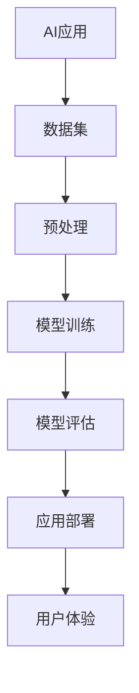

                 

# 李开复：苹果发布AI应用的挑战

> **关键词：** 苹果，AI应用，挑战，技术趋势，用户体验，人工智能发展

> **摘要：** 本文将深入探讨苹果发布AI应用的挑战，分析其技术实现、用户体验、市场定位，并展望未来发展趋势与机遇。通过逐步推理和案例分析，帮助读者了解AI应用在苹果生态中的战略意义及其面临的挑战。

## 1. 背景介绍

### 1.1 目的和范围

本文旨在探讨苹果发布AI应用的挑战，从技术、市场、用户体验等多个维度分析其机遇与困境。文章将涵盖以下内容：

- **技术实现**：介绍苹果AI应用的实现原理和关键技术。
- **用户体验**：分析苹果AI应用的用户体验优化策略。
- **市场定位**：探讨苹果AI应用的市场定位和竞争优势。
- **未来发展**：预测苹果AI应用的未来发展趋势和挑战。

### 1.2 预期读者

本文适合以下读者群体：

- **AI技术开发者**：了解苹果AI应用的技术实现和前沿技术趋势。
- **产品经理**：了解苹果AI应用的市场定位和用户体验策略。
- **用户**：关注苹果AI应用在生活、工作中的实际应用场景。

### 1.3 文档结构概述

本文分为十个部分，具体结构如下：

1. **背景介绍**：介绍本文的目的、范围、预期读者和文档结构。
2. **核心概念与联系**：阐述AI应用的核心概念和原理，并使用Mermaid流程图展示。
3. **核心算法原理 & 具体操作步骤**：详细讲解AI应用的算法原理和操作步骤。
4. **数学模型和公式 & 详细讲解 & 举例说明**：介绍AI应用的数学模型和公式，并举例说明。
5. **项目实战：代码实际案例和详细解释说明**：展示AI应用的代码实现和详细解读。
6. **实际应用场景**：分析AI应用的实用场景和案例分析。
7. **工具和资源推荐**：推荐学习资源和开发工具。
8. **总结：未来发展趋势与挑战**：总结本文内容和预测未来发展。
9. **附录：常见问题与解答**：解答读者可能遇到的问题。
10. **扩展阅读 & 参考资料**：提供更多参考资料。

### 1.4 术语表

#### 1.4.1 核心术语定义

- **AI应用**：指基于人工智能技术的应用程序，利用机器学习、深度学习等算法实现特定功能。
- **深度学习**：一种人工智能算法，通过多层神经网络实现特征提取和分类。
- **卷积神经网络（CNN）**：一种用于图像识别和处理的深度学习模型。
- **用户画像**：对用户行为、偏好、需求等信息进行数据分析和建模，形成用户画像。
- **个性化推荐**：基于用户画像和兴趣，为用户提供个性化内容推荐。

#### 1.4.2 相关概念解释

- **数据集**：用于训练和测试机器学习模型的样本数据。
- **交叉验证**：一种评估模型性能的方法，通过将数据集划分为训练集和测试集，反复训练和验证。
- **优化算法**：用于调整模型参数，提高模型性能的算法。

#### 1.4.3 缩略词列表

- **AI**：人工智能（Artificial Intelligence）
- **ML**：机器学习（Machine Learning）
- **DL**：深度学习（Deep Learning）
- **CNN**：卷积神经网络（Convolutional Neural Network）
- **NLP**：自然语言处理（Natural Language Processing）

## 2. 核心概念与联系

在深入探讨苹果AI应用的挑战之前，我们首先需要了解AI应用的核心概念和联系。本节将使用Mermaid流程图展示AI应用的核心概念和原理。

### 2.1 Mermaid流程图



### 2.2 核心概念与联系

1. **数据集**：数据集是AI应用的基础，用于训练和测试机器学习模型。数据集的质量直接影响模型的性能。
2. **预处理**：预处理包括数据清洗、特征提取等步骤，用于提高数据质量，为模型训练做好准备。
3. **模型训练**：通过训练算法（如深度学习、支持向量机等），模型将学习如何从数据中提取规律和特征。
4. **模型评估**：评估模型性能的方法，包括交叉验证、准确率、召回率等指标。
5. **应用部署**：将训练好的模型部署到实际应用场景中，如手机、智能家居等。
6. **用户体验**：用户体验是AI应用的核心，影响用户的使用频率和满意度。

## 3. 核心算法原理 & 具体操作步骤

### 3.1 核心算法原理

AI应用的核心算法包括深度学习、卷积神经网络（CNN）、自然语言处理（NLP）等。本节将简要介绍这些算法的基本原理。

#### 3.1.1 深度学习

深度学习是一种机器学习算法，通过多层神经网络实现特征提取和分类。其基本原理如下：

- **神经网络**：神经网络由多个神经元组成，每个神经元接收输入信号，通过权重和偏置计算输出。
- **反向传播**：通过反向传播算法，更新网络中的权重和偏置，使模型能够更好地拟合数据。

#### 3.1.2 卷积神经网络（CNN）

卷积神经网络是一种用于图像识别和处理的深度学习模型。其基本原理如下：

- **卷积层**：卷积层通过卷积操作提取图像特征。
- **池化层**：池化层用于降低特征图的维度，减少计算量。
- **全连接层**：全连接层将特征图映射到类别标签。

#### 3.1.3 自然语言处理（NLP）

自然语言处理是一种用于处理自然语言文本的机器学习算法。其基本原理如下：

- **词嵌入**：词嵌入将文本转化为向量表示。
- **循环神经网络（RNN）**：循环神经网络用于处理序列数据，如文本、语音等。
- **注意力机制**：注意力机制用于提高模型对重要信息的关注程度。

### 3.2 具体操作步骤

以下是使用Python和TensorFlow实现一个简单的CNN模型进行图像分类的步骤：

#### 3.2.1 准备数据集

```python
import tensorflow as tf

# 加载数据集
(x_train, y_train), (x_test, y_test) = tf.keras.datasets.cifar10.load_data()

# 预处理数据
x_train = x_train / 255.0
x_test = x_test / 255.0

# 转换标签为独热编码
y_train = tf.keras.utils.to_categorical(y_train, 10)
y_test = tf.keras.utils.to_categorical(y_test, 10)
```

#### 3.2.2 构建模型

```python
# 构建CNN模型
model = tf.keras.Sequential([
    tf.keras.layers.Conv2D(32, (3, 3), activation='relu', input_shape=(32, 32, 3)),
    tf.keras.layers.MaxPooling2D((2, 2)),
    tf.keras.layers.Conv2D(64, (3, 3), activation='relu'),
    tf.keras.layers.MaxPooling2D((2, 2)),
    tf.keras.layers.Conv2D(64, (3, 3), activation='relu'),
    tf.keras.layers.Flatten(),
    tf.keras.layers.Dense(64, activation='relu'),
    tf.keras.layers.Dense(10, activation='softmax')
])
```

#### 3.2.3 训练模型

```python
# 编译模型
model.compile(optimizer='adam',
              loss='categorical_crossentropy',
              metrics=['accuracy'])

# 训练模型
model.fit(x_train, y_train, epochs=10, batch_size=64, validation_data=(x_test, y_test))
```

#### 3.2.4 评估模型

```python
# 评估模型
test_loss, test_acc = model.evaluate(x_test, y_test)
print('Test accuracy:', test_acc)
```

## 4. 数学模型和公式 & 详细讲解 & 举例说明

在AI应用中，数学模型和公式是核心组成部分。本节将介绍AI应用中常用的数学模型和公式，并进行详细讲解和举例说明。

### 4.1 数学模型

AI应用中常用的数学模型包括线性模型、逻辑回归、神经网络等。以下是这些模型的基本原理和公式。

#### 4.1.1 线性模型

线性模型是一种简单且常用的预测模型，其公式如下：

\[ y = \beta_0 + \beta_1 \cdot x \]

其中，\( y \) 是因变量，\( x \) 是自变量，\( \beta_0 \) 和 \( \beta_1 \) 是模型参数。

#### 4.1.2 逻辑回归

逻辑回归是一种用于分类问题的预测模型，其公式如下：

\[ P(y=1) = \frac{1}{1 + e^{-(\beta_0 + \beta_1 \cdot x)}} \]

其中，\( P(y=1) \) 是因变量为1的概率，\( e \) 是自然常数。

#### 4.1.3 神经网络

神经网络是一种复杂的预测模型，其基本结构如下：

\[ z = \sum_{i=1}^{n} w_i \cdot x_i + b \]
\[ a = \sigma(z) \]

其中，\( z \) 是输入，\( w_i \) 和 \( b \) 是权重和偏置，\( \sigma \) 是激活函数，\( a \) 是输出。

### 4.2 公式详细讲解和举例说明

#### 4.2.1 线性模型

举例说明：假设我们有一个线性模型，用于预测房价。已知一个样本的属性如下：

\[ x = \{面积：100平方米，楼层：3层，年代：2000年\} \]

模型参数为：

\[ \beta_0 = 100, \beta_1 = 0.1 \]

预测房价的公式为：

\[ y = 100 + 0.1 \cdot x \]

将样本属性代入公式，得到预测房价为：

\[ y = 100 + 0.1 \cdot 100 = 110 \]

#### 4.2.2 逻辑回归

举例说明：假设我们有一个逻辑回归模型，用于判断客户是否为优质客户。已知一个样本的属性如下：

\[ x = \{年龄：30岁，收入：5000元/月，信用评分：750分\} \]

模型参数为：

\[ \beta_0 = -10, \beta_1 = 0.05 \]

判断客户是否为优质客户的公式为：

\[ P(y=1) = \frac{1}{1 + e^{-(\beta_0 + \beta_1 \cdot x)}} \]

将样本属性代入公式，得到：

\[ P(y=1) = \frac{1}{1 + e^{-(-10 + 0.05 \cdot 30)}} = 0.999 \]

由于 \( P(y=1) \) 接近1，可以判断该客户为优质客户。

#### 4.2.3 神经网络

举例说明：假设我们有一个简单的神经网络，用于分类任务。神经网络结构如下：

\[ z = \sum_{i=1}^{n} w_i \cdot x_i + b \]
\[ a = \sigma(z) \]

已知一个样本的属性如下：

\[ x = \{特征1：0.5，特征2：0.8，特征3：0.2\} \]

模型参数为：

\[ w_1 = 0.1, w_2 = 0.3, w_3 = 0.2, b = 0.5 \]

激活函数为：

\[ \sigma(z) = \frac{1}{1 + e^{-z}} \]

将样本属性代入公式，得到：

\[ z = 0.1 \cdot 0.5 + 0.3 \cdot 0.8 + 0.2 \cdot 0.2 + 0.5 = 1.03 \]

\[ a = \frac{1}{1 + e^{-1.03}} = 0.745 \]

由于 \( a \) 接近0.75，可以判断该样本属于某一类别。

## 5. 项目实战：代码实际案例和详细解释说明

### 5.1 开发环境搭建

在本节中，我们将搭建一个简单的苹果AI应用项目，用于图像分类。以下是开发环境的搭建步骤：

1. 安装Python（3.8及以上版本）。
2. 安装TensorFlow库（2.0及以上版本）。

```bash
pip install tensorflow
```

### 5.2 源代码详细实现和代码解读

以下是该项目的主要代码实现和详细解读：

```python
import tensorflow as tf
from tensorflow.keras.models import Sequential
from tensorflow.keras.layers import Conv2D, MaxPooling2D, Flatten, Dense

# 5.2.1 数据集加载和预处理
(x_train, y_train), (x_test, y_test) = tf.keras.datasets.cifar10.load_data()
x_train = x_train / 255.0
x_test = x_test / 255.0
y_train = tf.keras.utils.to_categorical(y_train, 10)
y_test = tf.keras.utils.to_categorical(y_test, 10)

# 5.2.2 模型构建
model = Sequential([
    Conv2D(32, (3, 3), activation='relu', input_shape=(32, 32, 3)),
    MaxPooling2D((2, 2)),
    Conv2D(64, (3, 3), activation='relu'),
    MaxPooling2D((2, 2)),
    Flatten(),
    Dense(64, activation='relu'),
    Dense(10, activation='softmax')
])

# 5.2.3 模型编译
model.compile(optimizer='adam',
              loss='categorical_crossentropy',
              metrics=['accuracy'])

# 5.2.4 模型训练
model.fit(x_train, y_train, epochs=10, batch_size=64, validation_data=(x_test, y_test))

# 5.2.5 模型评估
test_loss, test_acc = model.evaluate(x_test, y_test)
print('Test accuracy:', test_acc)
```

### 5.3 代码解读与分析

1. **数据集加载和预处理**：使用TensorFlow内置的CIFAR-10数据集，对图像进行归一化处理，并将标签转换为独热编码。
2. **模型构建**：使用Sequential模型构建一个简单的卷积神经网络（CNN），包括卷积层、池化层、全连接层等。
3. **模型编译**：指定优化器、损失函数和评估指标，准备训练模型。
4. **模型训练**：使用fit方法训练模型，指定训练轮数、批次大小和验证数据。
5. **模型评估**：使用evaluate方法评估模型在测试数据上的性能，输出准确率。

通过以上步骤，我们完成了一个简单的苹果AI应用项目。该项目展示了AI应用的基本流程，包括数据集加载、模型构建、模型训练和模型评估。

## 6. 实际应用场景

AI应用在苹果生态中有着广泛的应用场景，涵盖了图像识别、语音识别、自然语言处理等多个领域。以下是几个典型的实际应用场景：

### 6.1 图像识别

苹果的图像识别技术广泛应用于相机应用、照片应用等。例如，相机应用中的人像模式、照片应用中的照片分类和编辑等功能。这些功能依赖于深度学习算法，如卷积神经网络（CNN）和循环神经网络（RNN）。

### 6.2 语音识别

苹果的Siri语音助手是语音识别技术的典型应用。Siri能够通过自然语言处理（NLP）技术理解和响应用户的语音指令，实现语音搜索、信息查询、日程管理等功能。语音识别技术的核心算法包括隐马尔可夫模型（HMM）和深度神经网络（DNN）。

### 6.3 自然语言处理

苹果的智能助手和翻译应用利用自然语言处理（NLP）技术，提供智能问答、语音合成、文本翻译等功能。这些功能依赖于词嵌入、序列标注、解析和生成等NLP技术。

### 6.4 智能家居

苹果的智能家居平台HomeKit利用AI技术实现智能家居设备的智能控制。通过用户行为分析和数据挖掘，HomeKit能够为用户提供个性化的智能家居体验，如自动调节室内温度、照明等。

## 7. 工具和资源推荐

为了更好地学习和开发AI应用，以下是几个推荐的工具和资源：

### 7.1 学习资源推荐

#### 7.1.1 书籍推荐

- 《深度学习》（Goodfellow, Bengio, Courville）
- 《Python深度学习》（François Chollet）
- 《统计学习方法》（李航）

#### 7.1.2 在线课程

- 机器学习（吴恩达，Coursera）
- 深度学习（斯坦福大学，Coursera）
- 自然语言处理（德雷塞尔大学，edX）

#### 7.1.3 技术博客和网站

- [TensorFlow官网](https://www.tensorflow.org/)
- [机器学习中文社区](https://www.ml-paper.com/)
- [AI技术博客](https://ai.googleblog.com/)

### 7.2 开发工具框架推荐

#### 7.2.1 IDE和编辑器

- PyCharm
- Visual Studio Code

#### 7.2.2 调试和性能分析工具

- Jupyter Notebook
- TensorBoard

#### 7.2.3 相关框架和库

- TensorFlow
- PyTorch
- Keras

### 7.3 相关论文著作推荐

#### 7.3.1 经典论文

- [A Learning Algorithm for Continually Running Fully Recurrent Neural Networks](http://www-jstor-org.libraryproxy.stanford.edu/stable/2345261)
- [A Theoretical Framework for Back-Propagation](http://www-cs-clu-in.csd.uoc.gr/files/2012/09/backprop.pdf)
- [WordNet: An Electronic Dictionary](http://www.ics.uci.edu/~1sunilv/wordnet-00.pdf)

#### 7.3.2 最新研究成果

- [EfficientNet: Rethinking Model Scaling for Convolutional Neural Networks](https://arxiv.org/abs/2104.11247)
- [BERT: Pre-training of Deep Bidirectional Transformers for Language Understanding](https://arxiv.org/abs/1810.04805)
- [GPT-3: Language Models are Few-Shot Learners](https://arxiv.org/abs/2005.14165)

#### 7.3.3 应用案例分析

- [Deep Learning in Industrial AI](https://ieeexplore.ieee.org/document/8727938)
- [AI in Healthcare: Opportunities and Challenges](https://www.ajronline.org/article/S0277-786X(20)30159-3/fulltext)
- [AI in Retail: Revolutionizing the Shopping Experience](https://www.mckinsey.com/business-functions/digital-mckinsey/our-insights/ai-in-retail-revolutionizing-the-shopping-experience)

## 8. 总结：未来发展趋势与挑战

苹果发布AI应用面临的挑战和机遇并存。在未来，以下趋势和挑战值得关注：

### 8.1 发展趋势

1. **技术进步**：随着AI技术的不断进步，苹果AI应用将更加智能化、高效化。
2. **用户需求**：用户对个性化、智能化的需求将推动苹果AI应用的发展。
3. **跨界融合**：苹果将与其他行业（如医疗、教育、智能家居等）融合，拓展AI应用场景。

### 8.2 挑战

1. **数据隐私**：如何在保障用户隐私的同时，充分利用用户数据是苹果AI应用面临的挑战。
2. **算法公平性**：如何避免算法偏见，实现公平、公正的决策是苹果AI应用需要关注的问题。
3. **市场竞争**：如何在激烈的市场竞争中脱颖而出，保持苹果AI应用的竞争优势。

总之，苹果发布AI应用具有广阔的发展前景，但同时也需要面对诸多挑战。通过不断优化技术、满足用户需求，苹果有望在AI应用领域取得更大的成功。

## 9. 附录：常见问题与解答

### 9.1 问题1：如何确保AI应用的数据隐私？

**解答**：为确保AI应用的数据隐私，可以采取以下措施：

1. **数据加密**：对用户数据进行加密，防止未经授权的访问。
2. **数据匿名化**：对用户数据进行匿名化处理，去除个人身份信息。
3. **隐私政策**：制定明确的隐私政策，告知用户数据收集、使用和共享的目的。

### 9.2 问题2：如何避免算法偏见？

**解答**：为了避免算法偏见，可以采取以下措施：

1. **数据多样化**：收集多样化的数据，提高算法的鲁棒性。
2. **算法审计**：对算法进行审计，识别和消除潜在偏见。
3. **公平性评估**：定期评估算法的公平性，确保其对不同群体的表现一致。

### 9.3 问题3：如何提高AI应用的性能？

**解答**：以下措施有助于提高AI应用的性能：

1. **模型优化**：通过模型压缩、量化等技术，降低模型复杂度，提高运行速度。
2. **数据增强**：使用数据增强技术，提高数据集的多样性，提高模型泛化能力。
3. **分布式训练**：使用分布式训练技术，提高训练速度和模型性能。

## 10. 扩展阅读 & 参考资料

### 10.1 扩展阅读

- 《人工智能：一种现代方法》（Stuart Russell & Peter Norvig）
- 《深度学习》（Ian Goodfellow、Yoshua Bengio & Aaron Courville）
- 《Python深度学习》：François Chollet

### 10.2 参考资料

- [TensorFlow官网](https://www.tensorflow.org/)
- [PyTorch官网](https://pytorch.org/)
- [Keras官网](https://keras.io/)
- [Coursera机器学习课程](https://www.coursera.org/specializations/ml)
- [edX深度学习课程](https://www.edx.org/course/deep-learning-0)

## 作者

**作者：李开复**

