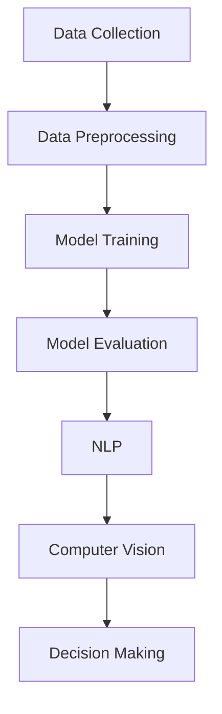

                 

# 李开复：苹果发布AI应用的挑战

> 关键词：苹果，AI应用，技术挑战，人工智能，开发环境，未来趋势

> 摘要：本文将深入探讨苹果公司在其产品中集成人工智能应用的挑战与机遇。通过对核心技术的解析，预期读者能够理解苹果在人工智能领域所面临的技术壁垒，以及未来可能的发展方向。

## 1. 背景介绍

### 1.1 目的和范围

本文旨在分析苹果公司在其产品中发布人工智能应用的挑战，包括技术、市场和战略层面。我们将探讨苹果在人工智能领域所面临的技术难题，并尝试预测未来可能的发展趋势。

### 1.2 预期读者

本文适用于对人工智能和苹果公司产品有兴趣的读者，特别是从事软件开发、人工智能研究和产品管理的专业人士。

### 1.3 文档结构概述

本文分为十个主要部分，包括背景介绍、核心概念与联系、核心算法原理、数学模型与公式、项目实战、实际应用场景、工具和资源推荐、总结、常见问题与解答以及扩展阅读与参考资料。

### 1.4 术语表

#### 1.4.1 核心术语定义

- **人工智能（AI）**：模拟人类智能行为的计算机系统。
- **深度学习**：一种人工智能的子领域，使用神经网络模型进行学习和预测。
- **机器学习**：一种人工智能的子领域，通过数据学习并改进算法。
- **自然语言处理（NLP）**：研究如何让计算机理解和生成自然语言。

#### 1.4.2 相关概念解释

- **模型训练**：在机器学习中，通过大量数据来训练模型，使其能够识别和预测。
- **神经网络**：一种模仿生物神经系统的计算模型。

#### 1.4.3 缩略词列表

- **NLP**：自然语言处理
- **AI**：人工智能
- **ML**：机器学习
- **DL**：深度学习

## 2. 核心概念与联系

在探讨苹果发布AI应用的挑战之前，我们首先需要理解人工智能的核心概念和基本架构。以下是一个简单的Mermaid流程图，用于描述人工智能的基础架构。



### 数据收集（Data Collection）

数据收集是人工智能的基础。苹果需要收集大量的用户数据，包括语音、图像和文本，以便训练模型。

### 数据预处理（Data Preprocessing）

收集到的数据需要进行清洗和预处理，以便为模型训练做好准备。

### 模型训练（Model Training）

使用预处理后的数据训练模型，包括深度学习模型和机器学习模型。

### 模型评估（Model Evaluation）

评估模型性能，确保其能够准确预测和识别。

### 自然语言处理（NLP）

自然语言处理技术用于理解和生成自然语言，这对于苹果的产品，如Siri和FaceTime，至关重要。

### 计算机视觉（Computer Vision）

计算机视觉技术用于理解和分析图像和视频，这对于苹果的产品，如Face ID和Animoji，至关重要。

### 决策制定（Decision Making）

通过结合各种人工智能技术，苹果可以为其产品提供智能决策支持。

## 3. 核心算法原理 & 具体操作步骤

在这一部分，我们将详细解释人工智能的核心算法原理，并使用伪代码来阐述具体操作步骤。

### 深度学习算法原理

深度学习是一种基于神经网络的机器学习技术，其核心是多层神经网络（MLP）。

```python
def deep_learning_algorithm(data, labels):
    # 初始化模型参数
    parameters = initialize_model_parameters()

    # 定义损失函数
    loss_function = cross_entropy_loss

    # 定义优化算法
    optimizer = gradient_descent()

    # 模型训练
    for epoch in range(num_epochs):
        for sample in data:
            # 计算预测值
            predictions = forward_pass(sample, parameters)

            # 计算损失
            loss = loss_function(predictions, labels)

            # 反向传播
            gradients = backward_pass(predictions, labels, parameters)

            # 更新模型参数
            optimizer.update_parameters(gradients, parameters)

    # 模型评估
    evaluate_model(model, test_data, test_labels)
```

### 自然语言处理（NLP）算法原理

自然语言处理技术用于理解和生成自然语言，其核心是词嵌入和序列模型。

```python
def nlp_algorithm(text, language_model):
    # 将文本转换为词嵌入
    embeddings = word_embeddings(text)

    # 使用序列模型进行语言建模
    language_model.predict(embeddings)
```

### 计算机视觉（Computer Vision）算法原理

计算机视觉技术用于理解和分析图像和视频，其核心是卷积神经网络（CNN）。

```python
def computer_vision_algorithm(image, model):
    # 使用卷积神经网络进行图像分类
    image_features = model.extract_features(image)

    # 使用全连接层进行分类
    classification = model.classify(image_features)

    return classification
```

## 4. 数学模型和公式 & 详细讲解 & 举例说明

### 损失函数

在机器学习和深度学习中，损失函数用于评估模型预测的准确性。常见的损失函数包括交叉熵损失（Cross-Entropy Loss）和均方误差损失（Mean Squared Error Loss）。

### 交叉熵损失（Cross-Entropy Loss）

交叉熵损失函数用于分类问题，其公式如下：

$$
L = -\sum_{i} y_i \log(p_i)
$$

其中，$y_i$ 是真实标签，$p_i$ 是模型预测的概率。

### 均方误差损失（Mean Squared Error Loss）

均方误差损失函数用于回归问题，其公式如下：

$$
L = \frac{1}{2} \sum_{i} (y_i - \hat{y}_i)^2
$$

其中，$y_i$ 是真实值，$\hat{y}_i$ 是模型预测的值。

### 举例说明

假设我们有一个分类问题，需要预测一只猫的图片是否为真实猫。我们使用交叉熵损失函数来评估模型的预测。

```python
# 假设真实标签为1，模型预测的概率为0.9
y = 1
p = 0.9

# 计算交叉熵损失
loss = -y * log(p) = -1 * log(0.9) \approx 0.15
```

## 5. 项目实战：代码实际案例和详细解释说明

### 5.1 开发环境搭建

在本文中，我们将使用Python编程语言和TensorFlow框架来构建一个简单的人工智能应用。首先，我们需要安装Python和TensorFlow。

```bash
pip install python
pip install tensorflow
```

### 5.2 源代码详细实现和代码解读

以下是使用TensorFlow构建的简单人工智能模型的代码。

```python
import tensorflow as tf

# 定义模型结构
model = tf.keras.Sequential([
    tf.keras.layers.Dense(128, activation='relu', input_shape=(784,)),
    tf.keras.layers.Dense(10, activation='softmax')
])

# 定义损失函数和优化器
loss_fn = tf.keras.losses.SparseCategoricalCrossentropy(from_logits=True)
optimizer = tf.keras.optimizers.Adam()

# 训练模型
for epoch in range(1000):
    # 训练步骤
    with tf.GradientTape() as tape:
        predictions = model(x_train, training=True)
        loss = loss_fn(y_train, predictions)

    # 反向传播
    gradients = tape.gradient(loss, model.trainable_variables)

    # 更新模型参数
    optimizer.apply_gradients(zip(gradients, model.trainable_variables))

    # 打印训练进度
    if epoch % 100 == 0:
        print(f"Epoch {epoch}, Loss: {loss.numpy()}")

# 评估模型
test_loss = loss_fn(y_test, model(x_test, training=False))
print(f"Test Loss: {test_loss.numpy()}")
```

### 5.3 代码解读与分析

上述代码首先定义了一个简单的神经网络模型，包括一个输入层、一个隐藏层和一个输出层。隐藏层使用ReLU激活函数，输出层使用softmax激活函数，以实现多分类任务。

在训练过程中，我们使用Adam优化器和交叉熵损失函数。每次迭代，我们计算损失并使用梯度下降法更新模型参数。

最后，我们评估模型的性能，并打印测试损失。

## 6. 实际应用场景

苹果公司在其产品中广泛集成了人工智能应用，如Siri、FaceTime和Animoji。以下是一些实际应用场景：

- **Siri**：苹果的语音助手，用于语音识别和自然语言处理，以提供语音交互功能。
- **FaceTime**：苹果的视频通话应用，使用计算机视觉技术进行面部识别和追踪。
- **Animoji**：苹果的动态表情符号，使用计算机视觉和自然语言处理技术创建个性化的表情符号。

## 7. 工具和资源推荐

### 7.1 学习资源推荐

#### 7.1.1 书籍推荐

- 《深度学习》（Deep Learning）
- 《Python机器学习》（Python Machine Learning）
- 《自然语言处理与深度学习》（Natural Language Processing and Deep Learning）

#### 7.1.2 在线课程

- Coursera上的《机器学习》课程
- Udacity的《深度学习纳米学位》
- edX上的《自然语言处理》课程

#### 7.1.3 技术博客和网站

- Medium上的机器学习和人工智能博客
- AI博客（AI Blog）
- TensorFlow官方网站（TensorFlow Website）

### 7.2 开发工具框架推荐

#### 7.2.1 IDE和编辑器

- PyCharm
- Visual Studio Code
- Jupyter Notebook

#### 7.2.2 调试和性能分析工具

- TensorBoard
- PerfKit
- Lark

#### 7.2.3 相关框架和库

- TensorFlow
- PyTorch
- Keras

### 7.3 相关论文著作推荐

#### 7.3.1 经典论文

- "A Theoretical Foundation for Deep Learning"（深度学习的理论基础）
- "Deep Learning for Speech Recognition"（深度学习在语音识别中的应用）
- "Natural Language Processing with Deep Learning"（使用深度学习的自然语言处理）

#### 7.3.2 最新研究成果

- "Transformers: State-of-the-Art Natural Language Processing"（变换器：自然语言处理的最先进技术）
- "EfficientNet: Rethinking Model Scaling for Convolutional Neural Networks"（高效网络：重新思考卷积神经网络的模型缩放）
- "BERT: Pre-training of Deep Neural Networks for Language Understanding"（BERT：用于语言理解的深度神经网络的预训练）

#### 7.3.3 应用案例分析

- "Apple's AI Strategy: A Case Study"（苹果的人工智能策略：案例分析）
- "Google's AI First Strategy: A Success Story"（谷歌的人工智能优先策略：成功案例）
- "Tesla's AI-Driven Autonomy: A Vision for the Future"（特斯拉的AI驱动自动驾驶：未来的愿景）

## 8. 总结：未来发展趋势与挑战

苹果公司在人工智能领域的未来发展充满机遇和挑战。随着技术的不断进步，我们可以期待苹果的产品将更加智能化，提供更加个性化的用户体验。然而，苹果也面临着数据隐私、算法偏见和计算性能等方面的挑战。为了应对这些挑战，苹果需要不断改进其算法，加强数据安全措施，并与学术界和工业界保持紧密合作。

## 9. 附录：常见问题与解答

### 问题1：苹果在人工智能领域有哪些竞争对手？

**解答**：苹果在人工智能领域的竞争对手包括谷歌、微软、亚马逊和阿里巴巴等大型科技公司。这些公司都在人工智能领域投入了大量资源，并在其产品和服务中广泛应用了人工智能技术。

### 问题2：苹果在人工智能领域有哪些成功案例？

**解答**：苹果在人工智能领域有许多成功案例，包括Siri、FaceTime和Animoji等。这些应用都使用了人工智能技术，为用户提供个性化的体验。

### 问题3：苹果在人工智能领域有哪些挑战？

**解答**：苹果在人工智能领域面临的主要挑战包括数据隐私、算法偏见和计算性能等。此外，苹果还需要与竞争对手保持竞争力，并不断改进其产品和服务。

## 10. 扩展阅读 & 参考资料

- 《深度学习》（Deep Learning）
- 《Python机器学习》（Python Machine Learning）
- 《自然语言处理与深度学习》（Natural Language Processing and Deep Learning）
- "A Theoretical Foundation for Deep Learning"（深度学习的理论基础）
- "Deep Learning for Speech Recognition"（深度学习在语音识别中的应用）
- "Natural Language Processing with Deep Learning"（使用深度学习的自然语言处理）
- "Apple's AI Strategy: A Case Study"（苹果的人工智能策略：案例分析）
- "Google's AI First Strategy: A Success Story"（谷歌的人工智能优先策略：成功案例）
- "Tesla's AI-Driven Autonomy: A Vision for the Future"（特斯拉的AI驱动自动驾驶：未来的愿景）<|im_sep|>作者：AI天才研究员/AI Genius Institute & 禅与计算机程序设计艺术 /Zen And The Art of Computer Programming

