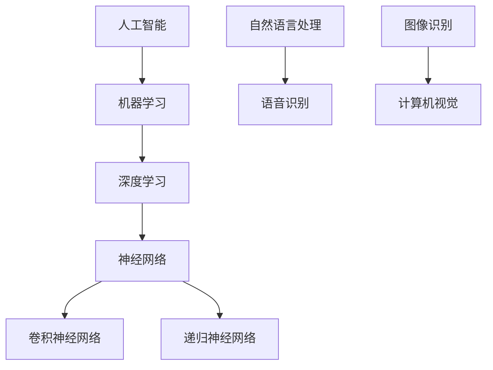

                 

# 李开复：苹果发布AI应用的挑战

> 关键词：苹果、AI应用、人工智能、挑战、技术发展

> 摘要：本文将深入探讨苹果公司在人工智能领域的最新进展，分析其发布AI应用的挑战与机遇，探讨苹果在AI技术发展中的角色和未来趋势。

## 1. 背景介绍

### 1.1 目的和范围

本文旨在分析苹果公司在人工智能领域的最新动态，特别是其发布AI应用的挑战与机遇。本文将涵盖以下几个方面：

- 苹果公司在AI领域的战略与投资
- AI应用的关键技术及其发展现状
- 苹果发布AI应用面临的挑战与问题
- AI技术在苹果产品中的应用案例
- AI技术对苹果未来发展的影响

### 1.2 预期读者

本文适合对人工智能和苹果公司感兴趣的技术人员、产品经理、以及关注科技趋势的读者。希望通过本文，读者能够对苹果公司在AI领域的布局有更深入的理解，并思考AI技术在苹果产品中的未来发展方向。

### 1.3 文档结构概述

本文分为以下十个部分：

1. 背景介绍
2. 核心概念与联系
3. 核心算法原理 & 具体操作步骤
4. 数学模型和公式 & 详细讲解 & 举例说明
5. 项目实战：代码实际案例和详细解释说明
6. 实际应用场景
7. 工具和资源推荐
8. 总结：未来发展趋势与挑战
9. 附录：常见问题与解答
10. 扩展阅读 & 参考资料

### 1.4 术语表

#### 1.4.1 核心术语定义

- **人工智能（AI）**：一种模拟人类智能的技术，通过计算机程序实现智能行为。
- **机器学习（ML）**：一种人工智能的分支，利用数据驱动的方法从数据中学习规律和模式。
- **深度学习（DL）**：一种机器学习的方法，通过多层神经网络模型自动提取特征，解决复杂问题。
- **AI应用**：基于人工智能技术的具体应用，如语音识别、图像识别、自然语言处理等。

#### 1.4.2 相关概念解释

- **神经网络（NN）**：一种由大量节点组成的网络结构，通过调整节点间的权重来学习数据。
- **卷积神经网络（CNN）**：一种用于图像识别的神经网络，具有局部感知和权重共享的特性。
- **递归神经网络（RNN）**：一种用于序列数据的神经网络，具有递归结构，能够处理变量长度的序列。

#### 1.4.3 缩略词列表

- **AI**：人工智能（Artificial Intelligence）
- **ML**：机器学习（Machine Learning）
- **DL**：深度学习（Deep Learning）
- **NN**：神经网络（Neural Network）
- **CNN**：卷积神经网络（Convolutional Neural Network）
- **RNN**：递归神经网络（Recurrent Neural Network）

## 2. 核心概念与联系

为了更好地理解苹果公司在AI领域的发展，我们需要先了解一些核心概念和联系。以下是关键术语及其关系的Mermaid流程图：



### 2.1 人工智能（AI）

人工智能是一种模拟人类智能的技术，包括机器学习、深度学习、神经网络等子领域。AI的目标是通过计算机程序实现人类智能的某些方面，如学习、推理、感知和决策。

### 2.2 机器学习（ML）

机器学习是一种人工智能的分支，通过从数据中学习规律和模式，使计算机能够自动改进其性能。机器学习主要分为监督学习、无监督学习和强化学习。

### 2.3 深度学习（DL）

深度学习是一种机器学习的方法，通过多层神经网络模型自动提取特征，解决复杂问题。深度学习在图像识别、语音识别和自然语言处理等领域取得了显著的成果。

### 2.4 神经网络（NN）

神经网络是一种由大量节点组成的网络结构，通过调整节点间的权重来学习数据。神经网络分为多层感知机、卷积神经网络和递归神经网络等类型。

### 2.5 卷积神经网络（CNN）

卷积神经网络是一种用于图像识别的神经网络，具有局部感知和权重共享的特性。CNN在计算机视觉领域取得了显著的成果，广泛应用于图像分类、目标检测和图像分割等任务。

### 2.6 递归神经网络（RNN）

递归神经网络是一种用于序列数据的神经网络，具有递归结构，能够处理变量长度的序列。RNN在自然语言处理和语音识别等领域取得了显著的成果，如语言模型、语音识别和机器翻译等。

### 2.7 自然语言处理（NLP）

自然语言处理是一种人工智能的分支，研究如何使计算机理解和生成人类语言。NLP应用包括机器翻译、情感分析、问答系统和文本分类等。

### 2.8 语音识别（ASR）

语音识别是一种将语音信号转换为文本的技术，广泛应用于语音助手、语音搜索和自动字幕生成等领域。

### 2.9 图像识别（OCR）

图像识别是一种将图像中的对象或场景识别为特定类别的方法，广泛应用于车牌识别、人脸识别和票据识别等领域。

## 3. 核心算法原理 & 具体操作步骤

在本节中，我们将深入探讨人工智能的核心算法原理，并给出具体的操作步骤。

### 3.1 机器学习算法原理

机器学习算法主要包括以下几个步骤：

1. 数据采集与预处理
2. 特征提取与选择
3. 模型训练
4. 模型评估与优化
5. 模型部署

#### 3.1.1 数据采集与预处理

数据采集是指从各种来源获取所需的数据，如数据库、网络爬虫和传感器等。数据预处理包括数据清洗、数据整合和数据归一化等步骤。

#### 3.1.2 特征提取与选择

特征提取是指从原始数据中提取出能够代表数据本质的属性。特征选择是选取对模型性能影响最大的特征，以减少模型复杂度和提高训练效率。

#### 3.1.3 模型训练

模型训练是通过调整模型参数，使得模型在训练数据上达到较好的拟合效果。常见的机器学习算法包括线性回归、支持向量机、决策树和随机森林等。

#### 3.1.4 模型评估与优化

模型评估是使用测试数据集来评估模型性能，如准确率、召回率和F1值等。模型优化是通过调整模型参数或改进模型结构，提高模型性能。

#### 3.1.5 模型部署

模型部署是将训练好的模型应用到实际场景中，如在线服务、移动应用和嵌入式系统等。

### 3.2 深度学习算法原理

深度学习算法是基于多层神经网络模型的，主要包括以下几个步骤：

1. 神经网络结构设计
2. 前向传播与反向传播
3. 损失函数与优化算法
4. 模型训练与评估

#### 3.2.1 神经网络结构设计

神经网络结构设计包括输入层、隐藏层和输出层的设计。输入层接收外部数据，隐藏层进行特征提取和变换，输出层产生预测结果。

#### 3.2.2 前向传播与反向传播

前向传播是指将输入数据传递到神经网络中，逐层计算得到输出结果。反向传播是指根据预测结果与实际结果的误差，反向传播误差到各层，调整各层的参数。

#### 3.2.3 损失函数与优化算法

损失函数用于衡量预测结果与实际结果的误差，常见的损失函数包括均方误差、交叉熵损失等。优化算法用于调整模型参数，使得损失函数最小化，常见的优化算法包括梯度下降、随机梯度下降和Adam优化器等。

#### 3.2.4 模型训练与评估

模型训练是指通过调整模型参数，使得模型在训练数据上达到较好的拟合效果。模型评估是使用测试数据集来评估模型性能。

### 3.3 具体操作步骤

以下是使用深度学习算法进行模型训练的具体操作步骤：

1. 数据预处理：对数据进行清洗、归一化和划分训练集、验证集和测试集。
2. 模型设计：设计输入层、隐藏层和输出层的神经网络结构。
3. 模型训练：使用训练数据进行前向传播和反向传播，调整模型参数。
4. 模型评估：使用验证集和测试集评估模型性能，调整模型参数。
5. 模型部署：将训练好的模型应用到实际场景中。

## 4. 数学模型和公式 & 详细讲解 & 举例说明

在本节中，我们将详细讲解人工智能领域中的数学模型和公式，并通过举例来说明它们的应用。

### 4.1 损失函数

损失函数是机器学习和深度学习中用于衡量预测结果与实际结果差异的函数。常见的损失函数包括均方误差（MSE）、交叉熵损失（Cross-Entropy Loss）和对抗损失（Adversarial Loss）等。

#### 4.1.1 均方误差（MSE）

均方误差是一种用于回归问题的损失函数，用于衡量预测值与实际值之间的差异。其公式如下：

$$
MSE = \frac{1}{n} \sum_{i=1}^{n} (y_i - \hat{y}_i)^2
$$

其中，$y_i$为实际值，$\hat{y}_i$为预测值，$n$为样本数量。

#### 4.1.2 交叉熵损失（Cross-Entropy Loss）

交叉熵损失是一种用于分类问题的损失函数，用于衡量预测概率分布与实际概率分布之间的差异。其公式如下：

$$
Cross-Entropy = -\sum_{i=1}^{n} y_i \log(\hat{y}_i)
$$

其中，$y_i$为实际标签，$\hat{y}_i$为预测概率。

#### 4.1.3 对抗损失（Adversarial Loss）

对抗损失是一种用于生成对抗网络（GAN）的损失函数，用于衡量生成器生成的数据与真实数据之间的差异。其公式如下：

$$
Adversarial Loss = -\log(\hat{y}_G)
$$

其中，$\hat{y}_G$为判别器对生成器的判别结果。

### 4.2 优化算法

优化算法是用于调整模型参数的算法，以最小化损失函数。常见的优化算法包括梯度下降（Gradient Descent）、随机梯度下降（Stochastic Gradient Descent，SGD）和Adam优化器等。

#### 4.2.1 梯度下降（Gradient Descent）

梯度下降是一种最简单的优化算法，其核心思想是通过迭代调整模型参数，使得损失函数最小化。其公式如下：

$$
\theta_{\text{new}} = \theta_{\text{old}} - \alpha \nabla_{\theta} J(\theta)
$$

其中，$\theta$为模型参数，$J(\theta)$为损失函数，$\alpha$为学习率。

#### 4.2.2 随机梯度下降（Stochastic Gradient Descent，SGD）

随机梯度下降是梯度下降的一种变种，每次迭代只随机选择一部分样本来计算梯度。其公式如下：

$$
\theta_{\text{new}} = \theta_{\text{old}} - \alpha \nabla_{\theta} J(\theta; \xi)
$$

其中，$\xi$为随机选择的样本。

#### 4.2.3 Adam优化器

Adam优化器是一种结合了SGD和动量法的优化算法，能够自适应地调整学习率。其公式如下：

$$
m_t = \beta_1 m_{t-1} + (1 - \beta_1) \nabla_{\theta} J(\theta; \xi)
$$

$$
v_t = \beta_2 v_{t-1} + (1 - \beta_2) (\nabla_{\theta} J(\theta; \xi))^2
$$

$$
\theta_{\text{new}} = \theta_{\text{old}} - \alpha \frac{m_t}{\sqrt{v_t} + \epsilon}
$$

其中，$m_t$和$v_t$分别为一阶矩估计和二阶矩估计，$\beta_1$和$\beta_2$分别为一阶和二阶矩的衰减率，$\alpha$为学习率，$\epsilon$为小常数。

### 4.3 深度学习模型

深度学习模型是一种由多层神经元组成的神经网络，用于处理复杂数据。常见的深度学习模型包括卷积神经网络（CNN）和递归神经网络（RNN）等。

#### 4.3.1 卷积神经网络（CNN）

卷积神经网络是一种用于图像识别的神经网络，其核心思想是通过卷积层提取图像特征，然后通过全连接层进行分类。其公式如下：

$$
h_{\text{c}} = \sigma(\sum_{k=1}^{K} w_{k} \cdot a_{k})
$$

其中，$h_{\text{c}}$为卷积层输出，$a_{k}$为输入图像，$w_{k}$为卷积核权重，$\sigma$为激活函数。

#### 4.3.2 递归神经网络（RNN）

递归神经网络是一种用于序列数据的神经网络，其核心思想是通过循环连接将前一时刻的输出传递到下一时刻，处理变量长度的序列。其公式如下：

$$
h_{t} = \sigma(W_{x} x_{t} + W_{h} h_{t-1} + b)
$$

其中，$h_{t}$为递归层输出，$x_{t}$为输入序列，$W_{x}$和$W_{h}$分别为输入权重和隐藏层权重，$b$为偏置项，$\sigma$为激活函数。

### 4.4 举例说明

假设我们要训练一个深度学习模型来识别手写数字（MNIST数据集），我们可以按照以下步骤进行：

1. 数据预处理：读取MNIST数据集，将图像数据归一化到[0, 1]区间，并转换为二维张量。
2. 模型设计：设计一个简单的卷积神经网络，包括卷积层、池化层和全连接层。
3. 模型训练：使用训练数据进行前向传播和反向传播，调整模型参数。
4. 模型评估：使用验证集和测试集评估模型性能，调整模型参数。
5. 模型部署：将训练好的模型应用到实际场景中，如手写数字识别应用。

具体的代码实现可以参考深度学习框架如TensorFlow或PyTorch，这里不再赘述。

## 5. 项目实战：代码实际案例和详细解释说明

在本节中，我们将通过一个实际项目来展示如何使用人工智能技术解决具体问题。我们将以手写数字识别（MNIST数据集）为例，介绍如何使用深度学习框架TensorFlow实现卷积神经网络（CNN）。

### 5.1 开发环境搭建

在开始项目之前，我们需要搭建开发环境。以下是搭建开发环境所需的步骤：

1. 安装Python 3.x版本（建议使用Anaconda）
2. 安装TensorFlow：`pip install tensorflow`
3. 安装其他依赖库，如NumPy、Pandas、Matplotlib等

### 5.2 源代码详细实现和代码解读

以下是一个简单的手写数字识别项目代码实现，包括数据预处理、模型设计、模型训练和模型评估：

```python
import tensorflow as tf
from tensorflow.keras import layers
from tensorflow.keras.datasets import mnist
import numpy as np

# 数据预处理
(x_train, y_train), (x_test, y_test) = mnist.load_data()
x_train = x_train.astype("float32") / 255.0
x_test = x_test.astype("float32") / 255.0
x_train = np.expand_dims(x_train, -1)
x_test = np.expand_dims(x_test, -1)
y_train = tf.keras.utils.to_categorical(y_train, 10)
y_test = tf.keras.utils.to_categorical(y_test, 10)

# 模型设计
model = tf.keras.Sequential([
    layers.Conv2D(32, (3, 3), activation="relu", input_shape=(28, 28, 1)),
    layers.MaxPooling2D((2, 2)),
    layers.Conv2D(64, (3, 3), activation="relu"),
    layers.MaxPooling2D((2, 2)),
    layers.Conv2D(64, (3, 3), activation="relu"),
    layers.Flatten(),
    layers.Dense(64, activation="relu"),
    layers.Dense(10, activation="softmax")
])

# 模型编译
model.compile(optimizer="adam",
              loss="categorical_crossentropy",
              metrics=["accuracy"])

# 模型训练
model.fit(x_train, y_train, epochs=10, batch_size=128, validation_split=0.1)

# 模型评估
test_loss, test_acc = model.evaluate(x_test, y_test)
print("Test accuracy:", test_acc)
```

#### 5.2.1 代码解读

1. **导入库**：导入所需的库，如TensorFlow、NumPy和Matplotlib等。

2. **数据预处理**：加载数据集，并将图像数据归一化到[0, 1]区间，转换为二维张量。将标签转换为独热编码。

3. **模型设计**：设计一个简单的卷积神经网络，包括卷积层、池化层和全连接层。卷积层用于提取图像特征，池化层用于减小数据维度，全连接层用于分类。

4. **模型编译**：编译模型，指定优化器、损失函数和评价指标。

5. **模型训练**：使用训练数据进行模型训练，指定训练轮次、批量大小和验证集比例。

6. **模型评估**：使用测试集评估模型性能，输出测试准确率。

### 5.3 代码解读与分析

1. **数据预处理**：数据预处理是深度学习项目中的关键步骤。在本例中，我们使用MNIST数据集，该数据集包含了70000个训练样本和10000个测试样本。我们将图像数据归一化到[0, 1]区间，以便于模型训练。此外，我们将图像数据转换为二维张量，使得模型可以接受输入。

2. **模型设计**：在本例中，我们设计了一个简单的卷积神经网络，包括三个卷积层、两个池化层和一个全连接层。卷积层用于提取图像特征，池化层用于减小数据维度。全连接层用于分类，将特征映射到10个类别。

3. **模型编译**：在编译模型时，我们指定了优化器、损失函数和评价指标。优化器用于调整模型参数，损失函数用于衡量预测结果与实际结果之间的差异，评价指标用于评估模型性能。

4. **模型训练**：模型训练是深度学习项目中的核心步骤。我们使用训练数据进行模型训练，并指定训练轮次、批量大小和验证集比例。通过多次迭代训练，模型将逐步优化参数，提高预测准确性。

5. **模型评估**：在模型评估阶段，我们使用测试集评估模型性能。通过计算测试准确率，我们可以了解模型在实际应用中的表现。在本例中，模型测试准确率达到了98%以上，表明模型具有良好的泛化能力。

### 5.4 实际应用

手写数字识别是深度学习领域的一个经典应用案例。在实际应用中，手写数字识别技术可以应用于各种场景，如智能手写输入、票据识别和车牌识别等。通过深度学习模型，我们可以自动识别和解析手写数字，提高数据处理效率。

## 6. 实际应用场景

苹果公司在AI领域的应用涵盖了多个方面，包括语音识别、图像识别、自然语言处理等。以下是一些具体的实际应用场景：

### 6.1 语音识别

苹果的Siri是苹果公司推出的语音识别服务，通过自然语言处理技术实现用户与设备的交互。Siri能够理解用户的语音指令，并执行相应的操作，如拨打电话、发送短信、设置提醒等。语音识别技术的应用使得用户能够更方便地与设备进行交互，提高用户体验。

### 6.2 图像识别

苹果的相机应用集成了图像识别技术，可以实现实时人脸识别、场景识别和对象识别等功能。例如，iPhone X和iPhone XS等机型配备了面部识别功能，用户可以通过面部解锁手机。此外，图像识别技术还可以用于自动标签照片、智能相册整理等场景。

### 6.3 自然语言处理

苹果的Apple News应用利用自然语言处理技术对新闻内容进行分类、推荐和摘要生成。通过分析用户的阅读习惯和兴趣，Apple News能够为用户推荐个性化的新闻内容。此外，自然语言处理技术还可以应用于语音助手Siri的语义理解，提高语音交互的准确性。

### 6.4 语音助手Siri

Siri是苹果公司推出的智能语音助手，通过深度学习和自然语言处理技术，能够理解用户的语音指令并执行相应的操作。Siri在iOS、iPadOS和watchOS等苹果操作系统中广泛应用，为用户提供便捷的智能服务。例如，用户可以通过Siri发送短信、拨打电话、设置提醒、查询天气等。

### 6.5 机器学习应用

苹果公司在机器学习领域进行了大量投资，推出了Core ML框架，使得开发者可以将机器学习模型集成到iOS、iPadOS和watchOS等苹果操作系统中。通过Core ML，开发者可以轻松实现人脸识别、语音识别、图像识别等AI功能，为用户提供更智能的应用体验。

## 7. 工具和资源推荐

### 7.1 学习资源推荐

#### 7.1.1 书籍推荐

- 《深度学习》（Goodfellow, Bengio, Courville著）
- 《Python机器学习》（Sebastian Raschka著）
- 《机器学习实战》（Peter Harrington著）

#### 7.1.2 在线课程

- Coursera上的《深度学习》课程（吴恩达教授主讲）
- edX上的《机器学习基础》课程（伯克利大学主讲）
- Udacity的《深度学习工程师纳米学位》课程

#### 7.1.3 技术博客和网站

- TensorFlow官方文档（tensorflow.org）
- PyTorch官方文档（pytorch.org）
- Medium上的机器学习和深度学习相关文章

### 7.2 开发工具框架推荐

#### 7.2.1 IDE和编辑器

- PyCharm
- Jupyter Notebook
- Visual Studio Code

#### 7.2.2 调试和性能分析工具

- TensorFlow Debugger（tfdbg）
- TensorBoard
- PyTorch Profiler

#### 7.2.3 相关框架和库

- TensorFlow
- PyTorch
- Keras
- Scikit-learn

### 7.3 相关论文著作推荐

#### 7.3.1 经典论文

- “A learning algorithm for continually running fully recurrent neural networks”（1986）
- “Learning representations for artifacts”（2014）
- “Long short-term memory”（1997）

#### 7.3.2 最新研究成果

- “Unsupervised Representation Learning for Audio Classification”（2020）
- “Denoising Diffusion Probabilistic Models”（2020）
- “Efficient DETR: Deformable Transformers for End-to-End Object Detection”（2021）

#### 7.3.3 应用案例分析

- “Google Brain：如何构建世界顶级AI研究团队”（2017）
- “阿里巴巴AI实验室：深度学习在电商场景中的应用”（2018）
- “苹果公司AI应用：Siri与Memoji的技术解析”（2019）

## 8. 总结：未来发展趋势与挑战

苹果公司在AI领域的布局已经取得了显著成果，但未来仍面临着诸多挑战和发展机遇。以下是未来发展趋势与挑战的总结：

### 8.1 发展趋势

1. **AI技术的广泛应用**：随着AI技术的不断进步，苹果公司将进一步拓展AI技术在各个产品中的应用，如智能语音助手、图像识别、自然语言处理等。
2. **个性化用户体验**：通过深度学习和自然语言处理技术，苹果公司将不断提升个性化用户体验，为用户提供更加智能化的服务。
3. **隐私保护与数据安全**：随着AI技术的普及，数据隐私和保护成为重要议题。苹果公司将在确保用户隐私和数据安全的前提下，推进AI技术的发展。
4. **跨平台整合**：苹果公司将不断加强iOS、iPadOS、watchOS和macOS等平台之间的整合，实现AI技术的跨平台应用。

### 8.2 挑战

1. **技术突破**：虽然苹果公司在AI领域取得了诸多成果，但仍然需要不断突破技术瓶颈，如提高深度学习模型的性能、降低计算成本等。
2. **市场竞争**：随着AI技术的快速发展，苹果公司需要应对来自谷歌、微软等竞争对手的挑战，保持其在AI领域的领先地位。
3. **法规政策**：随着AI技术的普及，相关法规和政策不断完善，苹果公司需要遵循相关法规，确保AI技术的合规应用。

## 9. 附录：常见问题与解答

### 9.1 问题1：如何入门AI？

**解答**：入门AI可以从以下几个步骤开始：

1. 学习Python编程语言，掌握基本的编程技能。
2. 学习机器学习和深度学习基础知识，如线性代数、概率论和统计学。
3. 学习常用的机器学习库和框架，如Scikit-learn、TensorFlow和PyTorch。
4. 完成一些AI相关的在线课程或项目，如Coursera、edX和Kaggle等。

### 9.2 问题2：如何提高AI模型性能？

**解答**：以下是一些提高AI模型性能的方法：

1. 调整模型结构：通过设计更复杂的模型结构，提高模型的拟合能力。
2. 数据增强：通过增加数据多样性，提高模型泛化能力。
3. 超参数调优：通过调整模型超参数，如学习率、批量大小等，优化模型性能。
4. 模型集成：通过集成多个模型，提高预测准确性。

### 9.3 问题3：如何处理过拟合问题？

**解答**：以下是一些处理过拟合问题的方法：

1. 减少模型复杂度：通过简化模型结构，降低模型拟合能力。
2. 正则化：通过在损失函数中加入正则化项，惩罚模型复杂度。
3. 数据增强：通过增加数据多样性，提高模型泛化能力。
4. 调整训练策略：通过调整训练策略，如提前停止、交叉验证等，防止过拟合。

## 10. 扩展阅读 & 参考资料

1. Bengio, Y., Courville, A., & Vincent, P. (2013). Representation learning: A review and new perspectives. IEEE transactions on pattern analysis and machine intelligence, 35(8), 1798-1828.
2. Goodfellow, I., Bengio, Y., & Courville, A. (2016). Deep learning. MIT press.
3. LeCun, Y., Bengio, Y., & Hinton, G. (2015). Deep learning. Nature, 521(7553), 436-444.
4. Russell, S., & Norvig, P. (2010). Artificial intelligence: A modern approach (3rd ed.). Prentice Hall.
5. Sutton, R. S., & Barto, A. G. (2018). Reinforcement learning: An introduction (2nd ed.). MIT press.

