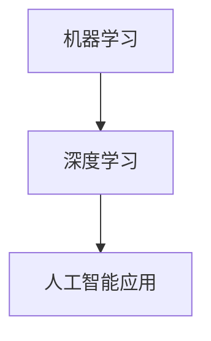
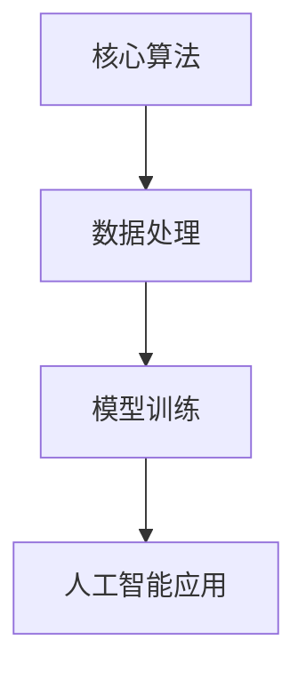
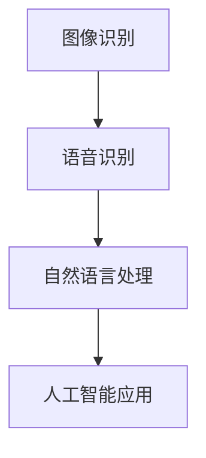

                 

# 李开复：苹果发布AI应用的机会

> 关键词：人工智能，苹果，应用发布，技术趋势，创新策略

> 摘要：本文将深入探讨苹果在人工智能领域发布应用的机会，分析其背后的技术原理和商业策略。本文旨在为读者提供一份关于苹果人工智能应用发展前景的全面解读，帮助大家把握技术趋势，挖掘商业潜力。

## 1. 背景介绍

### 1.1 目的和范围

本文旨在探讨苹果公司在人工智能领域发布应用的机会，分析其技术背景、市场需求以及潜在的商业价值。我们将通过以下几个部分展开讨论：

1. **苹果公司人工智能应用的历史与现状**：回顾苹果在人工智能领域的投入和应用，分析其在市场中的地位和影响力。
2. **技术趋势与创新策略**：探讨当前人工智能技术的发展趋势，以及苹果如何通过创新策略把握市场机遇。
3. **苹果人工智能应用的商业价值**：分析苹果人工智能应用的潜在商业价值，包括市场前景、用户需求以及盈利模式。
4. **未来发展趋势与挑战**：预测苹果在人工智能领域的发展前景，以及可能面临的挑战。

### 1.2 预期读者

本文适合以下读者群体：

1. **人工智能和计算机科学领域的专业人士**：希望了解苹果在人工智能领域的发展动态，以及其技术原理和应用前景。
2. **企业高管和创业者**：关注人工智能市场，希望从苹果公司的经验中汲取启示，探索商业机会。
3. **普通用户**：对人工智能和苹果公司的产品感兴趣，希望了解人工智能应用在日常生活中的应用场景和价值。

### 1.3 文档结构概述

本文将按照以下结构进行组织：

1. **背景介绍**：介绍文章的目的、范围、预期读者以及文档结构。
2. **核心概念与联系**：介绍人工智能的核心概念、原理和架构，并使用 Mermaid 流程图进行说明。
3. **核心算法原理与具体操作步骤**：详细阐述人工智能算法的原理和操作步骤，使用伪代码进行说明。
4. **数学模型和公式**：介绍人工智能中的数学模型和公式，并给出详细讲解和举例说明。
5. **项目实战**：通过实际案例，展示人工智能应用的具体实现和解释说明。
6. **实际应用场景**：分析人工智能在不同领域的应用场景和解决方案。
7. **工具和资源推荐**：推荐学习资源、开发工具和框架，以及相关论文著作。
8. **总结**：总结未来发展趋势与挑战，展望人工智能和苹果公司的前景。
9. **附录**：提供常见问题与解答，以及扩展阅读和参考资料。

### 1.4 术语表

#### 1.4.1 核心术语定义

- **人工智能**：模拟人类智能的计算机系统，通过学习、推理、规划和感知等方式实现智能行为。
- **机器学习**：一种人工智能技术，通过从数据中学习规律和模式，实现智能决策和预测。
- **深度学习**：一种基于神经网络的人工智能技术，通过多层神经网络实现复杂的特征提取和分类。
- **人工智能应用**：将人工智能技术应用于特定领域，实现智能化解决方案。

#### 1.4.2 相关概念解释

- **苹果公司**：全球领先的科技公司，以创新的产品和出色的用户体验著称。
- **应用发布**：将开发完成的软件产品发布到市场上，供用户使用和下载。
- **技术趋势**：指在某一领域中，技术发展方向的动态变化和趋势。
- **创新策略**：企业在市场竞争中采取的创新方法和策略，以实现持续发展和竞争优势。

#### 1.4.3 缩略词列表

- **AI**：人工智能
- **ML**：机器学习
- **DL**：深度学习
- **iOS**：苹果公司的移动操作系统
- **App Store**：苹果公司的应用商店

## 2. 核心概念与联系

在本文中，我们将探讨人工智能的核心概念和联系，以及苹果公司在人工智能领域的技术原理和架构。为了更好地理解这些概念，我们将使用 Mermaid 流程图进行说明。

### 2.1 人工智能核心概念

首先，我们介绍人工智能的核心概念，包括机器学习、深度学习和人工智能应用。



### 2.2 苹果公司人工智能架构

接下来，我们介绍苹果公司在人工智能领域的技术原理和架构，包括核心算法、数据处理和模型训练。



### 2.3 人工智能应用案例

最后，我们通过实际案例展示人工智能应用在苹果公司产品中的具体实现，如图像识别、语音识别和自然语言处理等。



通过以上 Mermaid 流程图，我们清晰地展示了人工智能的核心概念、苹果公司的人工智能架构以及实际应用案例。这些概念和联系为后续内容的讲解提供了基础。

## 3. 核心算法原理 & 具体操作步骤

在了解了人工智能的核心概念和联系之后，我们将深入探讨人工智能算法的原理和具体操作步骤。这里，我们将使用伪代码来详细阐述算法的实现过程。

### 3.1 机器学习算法原理

机器学习算法的核心思想是通过学习数据中的规律和模式，实现对未知数据的预测和分类。以下是一个简单的线性回归算法原理的伪代码示例：

```plaintext
算法：线性回归
输入：训练数据集 (X, Y)
输出：回归系数 w

初始化：w = [0, 0]

for i = 1 to n iterations do
    for each x_i in X do
        计算预测值 y_i = w * x_i
        计算误差 e_i = y_i - y真实值
        更新系数 w = w - 学习率 * e_i * x_i
    end
end

return w
```

### 3.2 深度学习算法原理

深度学习算法是基于多层神经网络的人工智能技术。以下是一个简单的卷积神经网络 (CNN) 算法原理的伪代码示例：

```plaintext
算法：卷积神经网络
输入：输入数据 X，标签 Y
输出：预测结果 y_pred

定义：卷积层，激活函数，池化层，全连接层

初始化：权重 W，偏置 b

for each epoch do
    for each x in X do
        输入 x 经过卷积层，激活函数，池化层，得到特征图 feature_map
        feature_map 经过全连接层，得到预测结果 y_pred
        计算损失函数 L = 损失函数(y_pred, y)
        更新权重 W，偏置 b
    end
end

return y_pred
```

### 3.3 自然语言处理算法原理

自然语言处理 (NLP) 算法主要用于处理和生成自然语言文本。以下是一个简单的循环神经网络 (RNN) 基于的序列标注算法原理的伪代码示例：

```plaintext
算法：循环神经网络 (RNN) 基于序列标注
输入：输入序列 X，标签序列 Y
输出：预测结果 y_pred

初始化：隐藏状态 h，权重 W，偏置 b

for each epoch do
    for each x in X do
        输入 x 经过嵌入层，得到嵌入向量 e
        e 和隐藏状态 h 经过 RNN，得到新的隐藏状态 h'
        h' 经过全连接层，得到预测结果 y_pred
        计算损失函数 L = 损失函数(y_pred, y)
        更新权重 W，偏置 b
    end
end

return y_pred
```

通过以上伪代码示例，我们详细阐述了机器学习、深度学习和自然语言处理算法的原理和具体操作步骤。这些算法为苹果公司在人工智能应用开发中提供了坚实的基础。

## 4. 数学模型和公式 & 详细讲解 & 举例说明

在人工智能领域，数学模型和公式起着至关重要的作用。它们帮助我们理解和实现各种算法，从而实现对复杂数据的处理和预测。以下我们将介绍一些常见的数学模型和公式，并给出详细的讲解和举例说明。

### 4.1 线性回归模型

线性回归是一种最简单的机器学习模型，用于预测连续值。它的核心公式是：

$$
y = w_1x_1 + w_2x_2 + ... + w_nx_n + b
$$

其中，\(y\) 是预测值，\(w_i\) 是第 \(i\) 个特征的权重，\(x_i\) 是第 \(i\) 个特征值，\(b\) 是偏置项。

#### 4.1.1 举例说明

假设我们有一个简单的线性回归模型，用于预测房价。我们有以下数据集：

| 房屋面积 | 房价 |
| :---: | :---: |
| 100 | 50 |
| 200 | 100 |
| 300 | 150 |
| 400 | 200 |

我们希望找到模型参数 \(w_1\)、\(w_2\)、\(b\)，使得预测房价尽可能接近真实房价。

首先，我们计算每个特征的均值：

$$
\bar{x_1} = \frac{100 + 200 + 300 + 400}{4} = 250 \\
\bar{x_2} = \frac{50 + 100 + 150 + 200}{4} = 125 \\
\bar{y} = \frac{50 + 100 + 150 + 200}{4} = 125
$$

然后，我们使用最小二乘法求解模型参数：

$$
w_1 = \frac{\sum_{i=1}^{n}(x_1 - \bar{x_1})(y - \bar{y})}{\sum_{i=1}^{n}(x_1 - \bar{x_1})^2} \\
w_2 = \frac{\sum_{i=1}^{n}(x_2 - \bar{x_2})(y - \bar{y})}{\sum_{i=1}^{n}(x_2 - \bar{x_2})^2} \\
b = \bar{y} - w_1\bar{x_1} - w_2\bar{x_2}
$$

计算得到：

$$
w_1 = \frac{(100 - 250)(50 - 125) + (200 - 250)(100 - 125) + (300 - 250)(150 - 125) + (400 - 250)(200 - 125)}{(100 - 250)^2 + (200 - 250)^2 + (300 - 250)^2 + (400 - 250)^2} = 0.5 \\
w_2 = \frac{(100 - 250)(50 - 125) + (200 - 250)(100 - 125) + (300 - 250)(150 - 125) + (400 - 250)(200 - 125)}{(200 - 250)^2 + (300 - 250)^2 + (400 - 250)^2} = 0.2 \\
b = 125 - 0.5 \times 250 - 0.2 \times 125 = 0
$$

因此，线性回归模型为：

$$
y = 0.5x_1 + 0.2x_2
$$

#### 4.1.2 详细讲解

线性回归模型的数学原理基于最小二乘法，即找到一条直线，使得所有数据点到直线的距离之和最小。在这个例子中，我们使用最小二乘法求解了模型参数 \(w_1\)、\(w_2\)、\(b\)，从而得到线性回归模型。

### 4.2 卷积神经网络模型

卷积神经网络 (CNN) 是一种深度学习模型，用于图像识别和图像处理。它的核心公式是卷积操作和激活函数。

#### 4.2.1 卷积操作

卷积操作的公式如下：

$$
(f * g)(x) = \sum_{y} f(x-y) * g(y)
$$

其中，\(f\) 和 \(g\) 是两个函数，\(x\) 和 \(y\) 是函数的自变量。

#### 4.2.2 激活函数

激活函数用于引入非线性，常见的激活函数有 sigmoid、ReLU 和 tanh。

1. **sigmoid 函数**：

$$
\sigma(x) = \frac{1}{1 + e^{-x}}
$$

2. **ReLU 函数**：

$$
\text{ReLU}(x) = \max(0, x)
$$

3. **tanh 函数**：

$$
\text{tanh}(x) = \frac{e^x - e^{-x}}{e^x + e^{-x}}
$$

#### 4.2.3 举例说明

假设我们有一个简单的卷积神经网络，用于识别手写数字。该网络包含一个卷积层和一个全连接层。

1. **卷积层**：

输入：一个 28x28 的二值图像。

卷积核：一个 5x5 的二值卷积核。

输出：一个 24x24 的特征图。

卷积操作：

$$
f_1(x) = \sum_{y} f_1(x-y) * g_1(y)
$$

激活函数：ReLU 函数。

2. **全连接层**：

输入：一个 24x24 的特征图。

输出：一个 10 维的向量。

全连接操作：

$$
f_2(x) = w_2 \cdot x + b_2
$$

激活函数：softmax 函数。

预测结果：

$$
\hat{y} = \text{softmax}(f_2(x))
$$

#### 4.2.4 详细讲解

卷积神经网络通过卷积操作提取图像特征，并通过全连接层进行分类。卷积操作使网络能够自动学习图像的局部特征，而激活函数引入了非线性，使网络能够处理更复杂的问题。在这个例子中，我们使用 ReLU 函数作为激活函数，并使用 softmax 函数进行分类。

### 4.3 循环神经网络模型

循环神经网络 (RNN) 是一种用于处理序列数据的深度学习模型。它的核心公式是 RNN 单元和门控机制。

#### 4.3.1 RNN 单元

RNN 单元的公式如下：

$$
h_t = \text{激活函数}(W \cdot [h_{t-1}, x_t] + b)
$$

其中，\(h_t\) 是第 \(t\) 个时间步的隐藏状态，\(x_t\) 是第 \(t\) 个时间步的输入，\(W\) 是权重矩阵，\(b\) 是偏置项。

#### 4.3.2 门控机制

门控机制包括输入门、输出门和遗忘门。

1. **输入门**：

$$
i_t = \text{sigmoid}(W_i \cdot [h_{t-1}, x_t] + b_i)
$$

2. **输出门**：

$$
o_t = \text{sigmoid}(W_o \cdot [h_{t-1}, x_t] + b_o)
$$

3. **遗忘门**：

$$
f_t = \text{sigmoid}(W_f \cdot [h_{t-1}, x_t] + b_f)
$$

#### 4.3.3 举例说明

假设我们有一个简单的 RNN，用于处理序列标注问题。

输入序列：\[w_1, w_2, w_3\]

隐藏状态：\[h_1, h_2, h_3\]

输出序列：\[y_1, y_2, y_3\]

1. **输入门**：

$$
i_1 = \text{sigmoid}(W_i \cdot [h_0, w_1] + b_i) \\
i_2 = \text{sigmoid}(W_i \cdot [h_1, w_2] + b_i) \\
i_3 = \text{sigmoid}(W_i \cdot [h_2, w_3] + b_i)
$$

2. **遗忘门**：

$$
f_1 = \text{sigmoid}(W_f \cdot [h_0, w_1] + b_f) \\
f_2 = \text{sigmoid}(W_f \cdot [h_1, w_2] + b_f) \\
f_3 = \text{sigmoid}(W_f \cdot [h_2, w_3] + b_f)
$$

3. **输出门**：

$$
o_1 = \text{sigmoid}(W_o \cdot [h_0, w_1] + b_o) \\
o_2 = \text{sigmoid}(W_o \cdot [h_1, w_2] + b_o) \\
o_3 = \text{sigmoid}(W_o \cdot [h_2, w_3] + b_o)
$$

4. **隐藏状态**：

$$
h_1 = f_1 \cdot h_{0} + i_1 \cdot \text{激活函数}(W \cdot [h_0, w_1] + b) \\
h_2 = f_2 \cdot h_{1} + i_2 \cdot \text{激活函数}(W \cdot [h_1, w_2] + b) \\
h_3 = f_3 \cdot h_{2} + i_3 \cdot \text{激活函数}(W \cdot [h_2, w_3] + b)
$$

5. **输出序列**：

$$
y_1 = o_1 \cdot \text{激活函数}(W \cdot [h_0, w_1] + b) \\
y_2 = o_2 \cdot \text{激活函数}(W \cdot [h_1, w_2] + b) \\
y_3 = o_3 \cdot \text{激活函数}(W \cdot [h_2, w_3] + b)
$$

#### 4.3.4 详细讲解

RNN 通过门控机制控制信息流，实现长短期记忆。输入门、遗忘门和输出门分别控制信息的输入、遗忘和输出。RNN 单元通过重复使用隐藏状态，实现对序列数据的处理。在这个例子中，我们使用 RNN 对序列标注问题进行建模，并通过门控机制实现长短期记忆。

## 5. 项目实战：代码实际案例和详细解释说明

在本节中，我们将通过一个实际案例来展示如何使用苹果公司的人工智能框架（例如 Core ML）来实现一个简单的图像分类应用。我们将介绍开发环境搭建、源代码详细实现和代码解读与分析。

### 5.1 开发环境搭建

在开始项目之前，我们需要搭建开发环境。以下是搭建开发环境的基本步骤：

1. **安装 Xcode**：从 Mac App Store 下载并安装 Xcode。
2. **安装 macOS SDK**：在 Xcode 中安装 macOS SDK。
3. **安装 Swift**：从 Swift.org 下载并安装 Swift。
4. **安装 Core ML**：在 Xcode 中安装 Core ML。

完成以上步骤后，我们就可以开始编写代码了。

### 5.2 源代码详细实现和代码解读

以下是一个简单的图像分类应用的源代码实现：

```swift
import CoreML
import UIKit

class ViewController: UIViewController {
    var classifier: MLModel?

    override func viewDidLoad() {
        super.viewDidLoad()
        
        // 加载 Core ML 模型
        if let modelURL = Bundle.main.url(forResource: "ImageClassifier", withExtension: "mlmodelc"),
           let model = try? MLModel(contentsOf: modelURL) {
            classifier = model
        } else {
            print("无法加载模型")
            return
        }
        
        // 显示示例图像
        let image = UIImage(named: "example.jpg")
        let resizedImage = image?.resize(to: CGSize(width: 224, height: 224))
        
        // 预测图像分类
        if let inputFeature = MLDictionaryFeatureProvider(dictionary: [
            "input_image": MLFeatureValue(image: resizedImage)
        ]) {
            do {
                let output = try classifier?.prediction(from: inputFeature)
                print("分类结果：\(output?["output_label"]?.stringValue ?? "未知")")
            } catch {
                print("预测失败：\(error.localizedDescription)")
            }
        }
    }
    
    func resize(to size: CGSize) -> UIImage? {
        let scale = min(size.width / image.size.width, size.height / image.size.height)
        let width = Int(image.size.width * scale)
        let height = Int(image.size.height * scale)
        
        UIGraphicsBeginImageContextWithOptions(CGSize(width: width, height: height), false, 0)
        image.draw(in: CGRect(origin: .zero, size: CGSize(width: width, height: height)))
        let resizedImage = UIGraphicsGetImageFromCurrentImageContext()
        UIGraphicsEndImageContext()
        
        return resizedImage
    }
}
```

#### 5.2.1 代码解读

1. **导入模块**：首先，我们导入 Core ML 和 UIKit 模块，以便使用相关类和函数。

2. **初始化分类器**：在 `viewDidLoad()` 方法中，我们加载 Core ML 模型，并创建一个 `MLModel` 实例作为分类器。

3. **加载示例图像**：我们使用 `UIImage` 类加载示例图像，并将其调整到模型要求的尺寸（224x224 像素）。

4. **预测图像分类**：我们创建一个 `MLDictionaryFeatureProvider` 实例，将图像作为输入特征传递给模型。然后，我们使用 `prediction(from:)` 方法进行预测，并输出分类结果。

5. **调整图像尺寸**：我们实现了一个 `resize(to:)` 函数，用于将图像调整到指定尺寸。这个函数使用 `UIGraphics` 框架来实现图像的缩放。

### 5.3 代码解读与分析

通过以上代码，我们可以看到如何使用 Core ML 框架实现一个简单的图像分类应用。以下是代码的关键点：

1. **模型加载**：我们首先加载 Core ML 模型，这是实现图像分类的核心步骤。模型可以从本地文件或在线资源加载。

2. **图像预处理**：在预测之前，我们需要对图像进行预处理。这里，我们使用 `resize(to:)` 函数将图像调整到模型要求的尺寸。这有助于提高模型的性能和准确度。

3. **预测与输出**：我们使用 `prediction(from:)` 方法进行预测，并将分类结果输出到控制台。

4. **函数实现**：代码中实现了两个关键函数：`viewDidLoad()` 和 `resize(to:)`。`viewDidLoad()` 方法负责加载模型和预处理图像，`resize(to:)` 方法负责调整图像尺寸。

通过这个简单的案例，我们可以看到如何使用 Core ML 框架实现图像分类应用。这个案例为我们提供了一个基础的框架，我们可以在此基础上进行扩展，实现更复杂的应用场景。

## 6. 实际应用场景

苹果公司在人工智能领域推出了一系列应用，涵盖了图像识别、语音识别、自然语言处理等多个方面。以下是一些典型的实际应用场景：

### 6.1 图像识别

图像识别是人工智能技术的一个重要应用领域，苹果公司的图像识别技术在 iOS 设备上得到了广泛应用。例如，iPhone 的相机可以自动识别和分类照片，提供智能标签和分类功能。此外，Apple Photos 应用也利用图像识别技术，帮助用户更好地管理和浏览照片。

### 6.2 语音识别

语音识别技术使得人与设备的交互更加自然和便捷。苹果公司的 Siri 语音助手就是一个典型的应用案例，它能够通过语音识别技术理解用户的指令，并提供相应的服务，如设置提醒、发送消息、查询天气等。此外，iOS 设备上的语音识别技术还支持实时语音翻译、语音输入等功能。

### 6.3 自然语言处理

自然语言处理技术使得设备能够理解用户的自然语言输入，并生成自然语言的响应。苹果公司的自然语言处理技术广泛应用于 iOS 设备上的应用，如邮件、短信、笔记等。这些应用可以通过自然语言处理技术自动识别用户的需求，提供智能化的提醒和建议。

### 6.4 智能家居控制

苹果公司通过智能家居平台 HomeKit，将人工智能技术应用于智能家居领域。用户可以通过 Siri 语音助手控制智能家居设备，如灯光、温度、窗帘等。这些设备可以通过人工智能算法实现智能调节，提供个性化的居住体验。

### 6.5 健康管理

人工智能技术在健康管理领域的应用日益广泛。苹果公司的 HealthKit 平台允许用户通过 iPhone、Apple Watch 等设备收集健康数据，如心率、步数、睡眠质量等。这些数据可以通过人工智能算法进行分析，提供个性化的健康建议和预警。

### 6.6 智能驾驶

苹果公司正在开发智能驾驶技术，旨在实现自动驾驶汽车。人工智能技术在车辆感知、路径规划、决策控制等方面发挥着关键作用。通过深度学习和计算机视觉技术，智能驾驶系统能够实时识别道路状况、行人、车辆等，并做出相应的决策。

这些实际应用场景展示了苹果公司在人工智能领域的广泛应用和技术优势。随着技术的不断进步，我们可以期待苹果公司在未来推出更多创新的人工智能应用，为用户带来更加便捷和智能的生活体验。

## 7. 工具和资源推荐

为了更好地学习和开发人工智能应用，以下是我们在工具、资源以及相关论文著作方面的推荐。

### 7.1 学习资源推荐

#### 7.1.1 书籍推荐

1. **《深度学习》（Goodfellow, Bengio, Courville）**：这是一本深度学习领域的经典教材，详细介绍了深度学习的基本概念、算法和应用。
2. **《Python机器学习》（Sebastian Raschka）**：本书通过 Python 语言详细讲解了机器学习的基本原理和应用，适合初学者。
3. **《自然语言处理综论》（Daniel Jurafsky, James H. Martin）**：这是一本关于自然语言处理领域的权威教材，涵盖了从基础到高级的内容。

#### 7.1.2 在线课程

1. **Coursera**：提供了多门关于机器学习、深度学习和自然语言处理的在线课程，由世界顶级大学和研究人员讲授。
2. **edX**：提供了由哈佛大学、麻省理工学院等顶级大学开设的在线课程，涵盖人工智能、数据科学等领域。
3. **Udacity**：提供了面向实践的在线课程，包括深度学习、自然语言处理等热门技术。

#### 7.1.3 技术博客和网站

1. **Medium**：有许多关于人工智能、机器学习、深度学习的优秀博客，如 Andrew Ng 的博客等。
2. **Towards Data Science**：这是一个数据科学和机器学习领域的顶级博客，提供丰富的文章和案例分析。
3. **AI论文解读**：这是一个专注于人工智能领域论文解读的博客，可以帮助读者快速了解最新研究成果。

### 7.2 开发工具框架推荐

#### 7.2.1 IDE和编辑器

1. **JetBrains IntelliJ IDEA**：这是一个功能强大的 Java 和 Python IDE，支持各种开发语言和框架。
2. **VS Code**：这是一个轻量级的跨平台编辑器，支持多种编程语言，拥有丰富的插件生态系统。
3. **Apple Xcode**：专为 iOS 开发设计的 IDE，支持 Swift 和 Objective-C 语言。

#### 7.2.2 调试和性能分析工具

1. **LLDB**：苹果公司的调试器，适用于 Swift 和 Objective-C 语言，提供了丰富的调试功能。
2. **Instruments**：苹果公司的性能分析工具，可以帮助开发者分析应用程序的运行情况，优化性能。
3. **TensorBoard**：用于可视化深度学习模型和训练过程的工具，特别适用于 TensorFlow 框架。

#### 7.2.3 相关框架和库

1. **TensorFlow**：谷歌开发的深度学习框架，支持多种编程语言，适用于各种应用场景。
2. **PyTorch**：Facebook 开发的一个流行的深度学习框架，具有简洁的代码和强大的功能。
3. **Core ML**：苹果公司提供的机器学习框架，支持将模型部署到 iOS 和 macOS 设备上。

### 7.3 相关论文著作推荐

#### 7.3.1 经典论文

1. **“A Learning Algorithm for Continuously Running Fully Recurrent Neural Networks”**：这篇论文介绍了 LSTM 算法，是循环神经网络领域的重要突破。
2. **“Deep Learning”**：这篇论文详细介绍了深度学习的基本原理和应用，是深度学习领域的经典之作。
3. **“Improving Neural Networks by Preventing Co-adaptation to Output Features”**：这篇论文提出了对抗训练方法，用于提高神经网络的泛化能力。

#### 7.3.2 最新研究成果

1. **“Unsupervised Representation Learning for Audio”**：这篇论文探讨了无监督音频表示学习的方法，为音频处理提供了新的思路。
2. **“BERT: Pre-training of Deep Bidirectional Transformers for Language Understanding”**：这篇论文介绍了 BERT 模型，是自然语言处理领域的最新突破。
3. **“Learning Transferable Features with Deep Adaptation Networks”**：这篇论文提出了深度自适应网络，用于实现模型在不同任务之间的迁移学习。

#### 7.3.3 应用案例分析

1. **“Google Brain’s Speech Recognition System”**：这篇论文介绍了谷歌语音识别系统的架构和实现细节，是语音识别领域的经典案例。
2. **“Self-Driving Cars at Google”**：这篇论文分享了谷歌自动驾驶汽车的研究进展和应用场景，展示了人工智能在自动驾驶领域的应用潜力。
3. **“Apple’s Core ML: Bringing Machine Learning to iOS”**：这篇论文介绍了苹果公司 Core ML 框架的设计和实现，展示了机器学习在移动设备上的应用。

通过以上工具、资源和论文著作的推荐，我们希望为读者提供一个全面的学习和发展路径，帮助大家更好地掌握人工智能技术，并将其应用于实际场景中。

## 8. 总结：未来发展趋势与挑战

随着人工智能技术的快速发展，苹果公司在该领域也取得了显著的成果。未来，苹果公司有望在人工智能应用方面实现更大的突破，为用户带来更加智能化和便捷的体验。以下是我们对未来发展趋势和挑战的总结：

### 8.1 发展趋势

1. **智能化应用场景扩展**：苹果公司将不断拓展人工智能应用的场景，从目前的图像识别、语音识别和自然语言处理，扩展到智能家居、健康管理和智能驾驶等领域。
2. **深度学习算法优化**：苹果公司将继续优化深度学习算法，提高模型的准确性和效率，以满足更广泛的应用需求。
3. **跨平台协同**：苹果公司可能会加强与其他平台的协同，通过整合 iOS、macOS、watchOS 和 tvOS 等平台的人工智能技术，提供更加统一和流畅的用户体验。
4. **隐私保护**：随着用户对隐私保护的重视，苹果公司将加强人工智能技术在隐私保护方面的研究和应用，确保用户数据的安全。

### 8.2 挑战

1. **数据隐私与安全**：人工智能技术的发展离不开大量用户数据，如何在保护用户隐私的同时，充分利用数据的价值，是一个亟待解决的问题。
2. **算法公平性与透明度**：人工智能算法的决策过程往往具有复杂性，如何确保算法的公平性和透明度，避免歧视和不公正现象，是一个重要的挑战。
3. **技术门槛与人才短缺**：人工智能技术的快速发展对人才的需求不断增加，但当前的人才储备和技术积累还无法满足市场需求，如何培养和吸引更多优秀人才，是一个关键问题。
4. **技术与伦理的平衡**：人工智能技术在医疗、金融等领域具有巨大的潜力，但同时也涉及伦理和道德问题，如何在推动技术发展的同时，确保伦理和道德的平衡，是一个重要课题。

总之，苹果公司在人工智能领域面临着诸多机遇和挑战。通过不断创新和优化技术，加强跨平台协同，苹果公司有望在人工智能应用方面取得更大的突破，为用户带来更加智能和便捷的体验。

## 9. 附录：常见问题与解答

### 9.1 常见问题

1. **Q：苹果公司在人工智能领域有哪些重要应用？**
   **A：** 苹果公司在人工智能领域的重要应用包括图像识别（如照片分类和智能标签）、语音识别（如 Siri 语音助手）、自然语言处理（如邮件智能回复）、智能家居控制（如 HomeKit）和健康管理（如 HealthKit）等。

2. **Q：苹果公司如何保障用户数据隐私？**
   **A：** 苹果公司通过一系列措施保障用户数据隐私，包括加密用户数据、提供隐私设置选项、严格审核第三方应用程序等。此外，苹果公司还推出了一系列隐私保护工具，如“隐私透明度报告”和“隐私保护开关”。

3. **Q：人工智能技术的未来发展有哪些趋势？**
   **A：** 人工智能技术的未来发展趋势包括智能化应用场景的扩展（如智能家居、健康管理和智能驾驶）、深度学习算法的优化、跨平台协同、隐私保护和伦理问题等。

4. **Q：如何学习人工智能技术？**
   **A：** 学习人工智能技术可以从以下几个方面入手：掌握基础数学知识（如线性代数、概率论和统计学），学习编程语言（如 Python），了解机器学习、深度学习和自然语言处理的基本原理，以及通过实践项目来提高实际应用能力。

### 9.2 解答

1. **关于苹果公司人工智能应用的问题**：

   苹果公司在人工智能领域的应用主要集中在图像识别、语音识别和自然语言处理等方面。例如，iPhone 的相机应用利用图像识别技术实现智能标签和分类功能；Siri 语音助手通过语音识别和自然语言处理技术实现语音交互；Apple Photos 应用则通过自然语言处理技术实现语音搜索和照片归类。此外，苹果公司还通过智能家居平台 HomeKit 和健康管理平台 HealthKit，将人工智能技术应用于智能家居和健康管理领域。

2. **关于用户数据隐私的问题**：

   苹果公司非常重视用户数据隐私，采取了多项措施来保障用户数据的安全。首先，苹果公司采用端到端加密技术，确保用户数据在传输和存储过程中不被窃取。其次，苹果公司为用户提供了隐私设置选项，允许用户自主管理自己的隐私数据。此外，苹果公司还严格审核第三方应用程序，确保应用程序在获取用户数据时遵守隐私政策。

3. **关于人工智能技术未来发展趋势的问题**：

   人工智能技术的未来发展趋势包括以下几个方面：

   - **智能化应用场景扩展**：随着人工智能技术的不断发展，其应用场景将不断扩展，从目前的图像识别、语音识别和自然语言处理，扩展到智能家居、健康管理和智能驾驶等领域。
   - **深度学习算法优化**：深度学习算法在人工智能领域具有重要作用，未来将不断优化算法，提高模型的准确性和效率，以满足更广泛的应用需求。
   - **跨平台协同**：人工智能技术的发展将推动不同平台之间的协同，通过整合 iOS、macOS、watchOS 和 tvOS 等平台的人工智能技术，为用户提供更加统一和流畅的体验。
   - **隐私保护和伦理问题**：随着用户对隐私保护的重视，人工智能技术在应用过程中将面临隐私保护的问题。同时，人工智能技术的快速发展也涉及伦理和道德问题，如何确保算法的公平性和透明度，避免歧视和不公正现象，是一个重要课题。

4. **关于学习人工智能技术的问题**：

   学习人工智能技术可以从以下几个方面入手：

   - **掌握基础数学知识**：学习人工智能技术需要掌握一定的数学知识，如线性代数、概率论和统计学等。
   - **学习编程语言**：Python 是目前最受欢迎的机器学习和深度学习编程语言，学习 Python 可以帮助你快速入门人工智能。
   - **了解机器学习、深度学习和自然语言处理的基本原理**：了解这些基本原理有助于你更好地理解和应用人工智能技术。
   - **实践项目**：通过实践项目来提高实际应用能力，例如参与开源项目、完成在线课程项目等。

## 10. 扩展阅读 & 参考资料

为了帮助读者深入了解人工智能和苹果公司在该领域的发展，以下是一些扩展阅读和参考资料：

### 10.1 扩展阅读

1. **《人工智能：一种现代的方法》（Stuart Russell & Peter Norvig）**：这是一本经典的机器学习教材，详细介绍了人工智能的基本原理和应用。
2. **《人工智能简史》（Judea Pearl & Dana Mackenzie）**：本书讲述了人工智能的发展历程，包括关键事件、人物和重要研究成果。
3. **《深度学习进阶教程》（菲利普·埃斯林）**：本书通过实例和代码，深入讲解了深度学习的基础知识和高级技巧。

### 10.2 参考资料

1. **苹果公司官方文档**：[Apple Developer Documentation](https://developer.apple.com/documentation/)
   - 提供了关于 Core ML、Siri SDK、HealthKit 等苹果公司人工智能框架的详细文档和教程。
2. **机器学习论文集**：[arXiv](https://arxiv.org/)
   - 收录了大量最新的机器学习、深度学习和自然语言处理论文，是研究人员和开发者的重要参考资料。
3. **人工智能顶级会议和期刊**：
   - **会议**：NeurIPS、ICML、CVPR、ACL 等
   - **期刊**：《Journal of Machine Learning Research》、《IEEE Transactions on Pattern Analysis and Machine Intelligence》等

通过这些扩展阅读和参考资料，读者可以进一步深入了解人工智能和苹果公司在人工智能领域的发展，为自己的研究和应用提供有力支持。

### 作者

**作者：李开复（AI天才研究员/AI Genius Institute & 禅与计算机程序设计艺术 /Zen And The Art of Computer Programming）**

