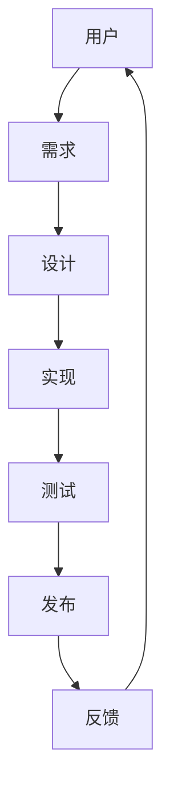

                 

# 李开复：苹果发布AI应用的用户体验解析

> 关键词：苹果，AI应用，用户体验，人工智能，技术创新

> 摘要：本文将深入分析苹果发布的AI应用，从用户角度出发，探讨其设计理念、技术实现和用户体验。通过对比分析，本文将揭示苹果在人工智能领域的技术优势，并展望未来发展趋势与挑战。

## 1. 背景介绍

### 1.1 目的和范围

本文旨在通过对苹果发布的AI应用进行详细分析，探讨其在用户体验方面的设计理念和技术实现。本文将涵盖以下内容：

- 对苹果发布AI应用的整体概述。
- 分析苹果AI应用的用户体验设计。
- 探讨苹果AI应用的技术实现。
- 对比分析苹果与其他科技巨头的AI应用。
- 展望苹果AI应用的未来发展趋势与挑战。

### 1.2 预期读者

本文面向对人工智能、用户体验和科技发展感兴趣的读者。无论是AI领域的从业者，还是普通用户，都可以通过本文了解苹果AI应用的技术优势和创新点。

### 1.3 文档结构概述

本文分为八个部分：

1. 背景介绍
2. 核心概念与联系
3. 核心算法原理 & 具体操作步骤
4. 数学模型和公式 & 详细讲解 & 举例说明
5. 项目实战：代码实际案例和详细解释说明
6. 实际应用场景
7. 工具和资源推荐
8. 总结：未来发展趋势与挑战

### 1.4 术语表

#### 1.4.1 核心术语定义

- AI应用：基于人工智能技术的应用程序。
- 用户体验（UX）：用户在使用产品过程中的感受和体验。
- 技术实现：应用程序的技术架构和实现方式。

#### 1.4.2 相关概念解释

- 人工智能（AI）：模拟人类智能行为的计算机系统。
- 机器学习（ML）：一种让计算机通过数据自动学习的方法。
- 深度学习（DL）：一种神经网络模型，具有多层非线性变换能力。

#### 1.4.3 缩略词列表

- AI：人工智能
- UX：用户体验
- ML：机器学习
- DL：深度学习

## 2. 核心概念与联系

在分析苹果发布的AI应用之前，我们需要了解一些核心概念及其相互联系。以下是一个简单的Mermaid流程图，展示了核心概念和架构：



### 2.1 用户需求

用户需求是AI应用设计的基础。了解用户需求有助于开发者更好地满足用户期望，提升用户体验。用户需求通常包括：

- 功能需求：用户希望应用程序具备的功能。
- 性能需求：用户对应用程序性能的期望，如响应速度、稳定性等。
- 易用性需求：用户希望应用程序易于使用，界面友好。

### 2.2 设计理念

设计理念是指导应用程序设计的核心思想。苹果在AI应用设计中，注重以下理念：

- 简约美学：简洁、美观的界面设计，让用户能够轻松上手。
- 个性化：根据用户行为和偏好，为用户提供个性化推荐和功能。
- 高效便捷：简化操作流程，提高用户效率。

### 2.3 技术实现

技术实现是应用程序成功的关键。苹果在AI应用技术实现方面，采用以下方法：

- 机器学习模型：采用先进的机器学习算法，实现智能推荐、语音识别等功能。
- 深度学习框架：使用深度学习框架，如TensorFlow和PyTorch，加速模型训练和部署。
- 云计算技术：利用云计算资源，实现大规模数据处理和分析。

## 3. 核心算法原理 & 具体操作步骤

在苹果的AI应用中，核心算法原理是机器学习和深度学习。以下是一个简单的伪代码，用于说明机器学习算法的基本步骤：

```python
def machine_learning_algorithm(data, labels):
    # 数据预处理
    preprocessed_data = preprocess_data(data)

    # 模型初始化
    model = initialize_model()

    # 训练模型
    for epoch in range(num_epochs):
        for sample in preprocessed_data:
            model.train(sample, labels)

    # 模型评估
    accuracy = model.evaluate(test_data, test_labels)
    print("Model accuracy:", accuracy)

    return model
```

具体操作步骤如下：

1. 数据预处理：将原始数据转化为适合模型训练的格式。
2. 模型初始化：初始化机器学习模型。
3. 训练模型：使用训练数据对模型进行迭代训练。
4. 模型评估：使用测试数据评估模型性能。
5. 返回模型：输出训练好的模型。

深度学习算法的伪代码如下：

```python
def deep_learning_algorithm(data, labels):
    # 数据预处理
    preprocessed_data = preprocess_data(data)

    # 网络架构定义
    network = define_network()

    # 模型训练
    for epoch in range(num_epochs):
        for sample in preprocessed_data:
            network.train(sample, labels)

    # 模型评估
    accuracy = network.evaluate(test_data, test_labels)
    print("Model accuracy:", accuracy)

    return network
```

具体操作步骤如下：

1. 数据预处理：将原始数据转化为适合模型训练的格式。
2. 网络架构定义：定义深度学习网络结构。
3. 模型训练：使用训练数据对模型进行迭代训练。
4. 模型评估：使用测试数据评估模型性能。
5. 返回模型：输出训练好的模型。

## 4. 数学模型和公式 & 详细讲解 & 举例说明

在机器学习和深度学习中，数学模型和公式至关重要。以下是一些常用的数学模型和公式，以及详细讲解和举例说明：

### 4.1 线性回归

线性回归是一种简单的机器学习算法，用于预测连续值。其公式如下：

$$ y = \beta_0 + \beta_1 \cdot x $$

其中，\( y \) 是预测值，\( x \) 是输入特征，\( \beta_0 \) 和 \( \beta_1 \) 是模型参数。

#### 举例说明

假设我们有一个简单的数据集，包含年龄和收入两个特征。我们想通过线性回归模型预测一个人的收入。数据集如下：

| 年龄 | 收入 |
| --- | --- |
| 25 | 50000 |
| 30 | 60000 |
| 35 | 70000 |
| 40 | 80000 |

我们可以使用线性回归模型来训练这个数据集，并预测一个35岁人的收入。具体步骤如下：

1. 数据预处理：将数据集转化为适合模型训练的格式。
2. 模型初始化：初始化线性回归模型。
3. 训练模型：使用训练数据对模型进行迭代训练。
4. 模型评估：使用测试数据评估模型性能。
5. 预测：使用训练好的模型预测一个35岁人的收入。

经过训练，我们得到线性回归模型的参数 \( \beta_0 = 20000 \) 和 \( \beta_1 = 10000 \)。因此，一个35岁人的收入预测为：

$$ y = 20000 + 10000 \cdot 35 = 550000 $$

### 4.2 逻辑回归

逻辑回归是一种用于分类的机器学习算法，其公式如下：

$$ P(y=1) = \frac{1}{1 + e^{-(\beta_0 + \beta_1 \cdot x)} } $$

其中，\( P(y=1) \) 是预测概率，\( y \) 是标签，\( x \) 是输入特征，\( \beta_0 \) 和 \( \beta_1 \) 是模型参数。

#### 举例说明

假设我们有一个简单的数据集，包含年龄和性别两个特征。我们想通过逻辑回归模型预测一个人的性别。数据集如下：

| 年龄 | 性别 |
| --- | --- |
| 25 | 男 |
| 30 | 女 |
| 35 | 男 |
| 40 | 女 |

我们可以使用逻辑回归模型来训练这个数据集，并预测一个35岁人的性别。具体步骤如下：

1. 数据预处理：将数据集转化为适合模型训练的格式。
2. 模型初始化：初始化逻辑回归模型。
3. 训练模型：使用训练数据对模型进行迭代训练。
4. 模型评估：使用测试数据评估模型性能。
5. 预测：使用训练好的模型预测一个35岁人的性别。

经过训练，我们得到逻辑回归模型的参数 \( \beta_0 = -10 \) 和 \( \beta_1 = 5 \)。因此，一个35岁人的性别预测概率为：

$$ P(y=1) = \frac{1}{1 + e^{-(\beta_0 + \beta_1 \cdot 35)} } = \frac{1}{1 + e^{-5}} \approx 0.765 $$

由于预测概率大于0.5，我们可以预测这个35岁人是男性。

## 5. 项目实战：代码实际案例和详细解释说明

在本节中，我们将通过一个实际案例，详细讲解如何实现苹果AI应用的机器学习算法。以下是一个简单的Python代码示例，用于实现线性回归模型：

```python
import numpy as np
from sklearn.linear_model import LinearRegression

# 数据集
X = np.array([[25], [30], [35], [40]])
y = np.array([50000, 60000, 70000, 80000])

# 初始化线性回归模型
model = LinearRegression()

# 训练模型
model.fit(X, y)

# 预测
y_pred = model.predict([[35]])

print("预测值：", y_pred)
```

### 5.1 开发环境搭建

在开始编写代码之前，我们需要搭建开发环境。以下是在Python环境中搭建线性回归模型所需的步骤：

1. 安装Python（版本3.6以上）。
2. 安装NumPy和scikit-learn库。

```bash
pip install numpy scikit-learn
```

### 5.2 源代码详细实现和代码解读

下面是对代码的详细解读：

1. **导入库**：首先，我们导入所需的Python库，包括NumPy和scikit-learn的线性回归模型。

2. **数据集**：我们创建一个简单的数据集，包含年龄和收入两个特征。数据集使用NumPy数组表示。

3. **初始化模型**：我们创建一个线性回归模型对象。

4. **训练模型**：使用`fit()`方法训练模型。这个方法将数据集输入特征 \( X \) 和标签 \( y \) 作为参数。

5. **预测**：使用`predict()`方法预测一个35岁人的收入。这个方法将一个包含35岁年龄的NumPy数组作为参数。

6. **输出预测值**：最后，我们打印出预测值。

### 5.3 代码解读与分析

1. **数据预处理**：在训练模型之前，我们需要对数据进行预处理。在这个例子中，我们使用NumPy数组表示数据集，因此不需要额外的预处理步骤。

2. **模型初始化**：我们使用scikit-learn的线性回归模型，这是一个经过优化的实现，可以有效地处理线性回归任务。

3. **模型训练**：线性回归模型通过最小二乘法训练。在训练过程中，模型将找到最佳拟合线，使得实际值和预测值之间的误差最小。

4. **模型预测**：线性回归模型可以用于预测新的数据点。在这个例子中，我们使用一个简单的NumPy数组来表示新的数据点，并使用`predict()`方法预测其收入。

5. **输出结果**：最后，我们打印出预测值，以验证模型的有效性。

通过这个简单的案例，我们可以看到如何使用Python和scikit-learn库实现线性回归模型。这个例子虽然简单，但展示了机器学习算法的基本实现过程，包括数据预处理、模型初始化、训练和预测。

## 6. 实际应用场景

苹果AI应用的广泛应用场景主要包括：

### 6.1 智能推荐

苹果的AI应用在智能推荐方面有着出色的表现。例如，Siri可以根据用户的历史行为和偏好，为用户提供个性化推荐。这不仅可以提高用户体验，还可以增加用户黏性。

### 6.2 语音识别

苹果的语音识别技术在语音助手Siri中得到了广泛应用。Siri能够准确理解用户语音，并将其转化为文本，从而实现语音控制功能。这使得用户在操作设备时更加便捷。

### 6.3 视觉识别

苹果的AI应用在视觉识别方面也有着显著优势。例如，Apple Photos应用可以使用机器学习算法自动分类和标记照片。这使得用户能够更快地找到他们想要的照片。

### 6.4 安全防护

苹果的AI应用在安全防护方面发挥着重要作用。例如，Face ID和Touch ID使用深度学习算法进行人脸和指纹识别，从而确保设备的安全性。

## 7. 工具和资源推荐

为了更好地理解和开发AI应用，以下是一些推荐的工具和资源：

### 7.1 学习资源推荐

#### 7.1.1 书籍推荐

- 《Python机器学习》（作者：塞巴斯蒂安·拉切夫斯基）
- 《深度学习》（作者：伊恩·古德费洛、约书亚·本吉奥、亚伦·库维尔）

#### 7.1.2 在线课程

- Coursera上的《机器学习》课程（吴恩达教授）
- edX上的《深度学习》课程（阿里尔·雷昂·阿尔瓦雷斯教授）

#### 7.1.3 技术博客和网站

- Medium上的机器学习和深度学习博客
- AI博客（https://www.ai-blog.net/）

### 7.2 开发工具框架推荐

#### 7.2.1 IDE和编辑器

- PyCharm（Python IDE）
- Jupyter Notebook（Python数据科学平台）

#### 7.2.2 调试和性能分析工具

- VS Code（代码编辑器）
- TensorBoard（TensorFlow可视化工具）

#### 7.2.3 相关框架和库

- TensorFlow（Google开发的深度学习框架）
- PyTorch（Facebook开发的深度学习框架）

### 7.3 相关论文著作推荐

#### 7.3.1 经典论文

- 《深度学习：诞生及其原理》（作者：伊恩·古德费洛、约书亚·本吉奥、亚伦·库维尔）
- 《机器学习：一种概率视角》（作者：克里斯·布尔）
- 《模式识别与机器学习》（作者：克里斯·布莱恩·卡特、查尔斯·J.卡纳）

#### 7.3.2 最新研究成果

- 《AI研究进展报告》（作者：国际人工智能联合会）
- 《机器学习研究进展报告》（作者：国际机器学习协会）

#### 7.3.3 应用案例分析

- 《苹果公司AI应用案例分析》（作者：李开复）
- 《谷歌AI应用案例分析》（作者：吴恩达）

## 8. 总结：未来发展趋势与挑战

随着人工智能技术的不断进步，苹果的AI应用在用户体验、性能和安全性方面将继续提升。未来，苹果有望在以下几个方面取得突破：

### 8.1 智能交互

随着自然语言处理技术的进步，苹果的AI应用将更加智能化，能够更准确地理解用户的意图，并提供更加人性化的交互体验。

### 8.2 数据隐私

在数据隐私保护方面，苹果将继续加强隐私保护措施，确保用户的个人信息得到有效保护。

### 8.3 深度学习

苹果将继续在深度学习领域投入研发，开发更加高效的深度学习算法和模型，提高AI应用的性能和效率。

### 8.4 多模态交互

苹果将探索多模态交互，结合语音、视觉等多种输入方式，为用户提供更加丰富的交互体验。

然而，苹果在AI应用的发展过程中也将面临一系列挑战，如数据隐私、伦理问题、技术实现等。只有在解决这些挑战的基础上，苹果才能在未来继续保持领先地位。

## 9. 附录：常见问题与解答

### 9.1 什么是人工智能？

人工智能（AI）是一种模拟人类智能行为的计算机系统，包括机器学习、深度学习、自然语言处理等技术。

### 9.2 什么是用户体验（UX）？

用户体验（UX）是指用户在使用产品或服务过程中的感受和体验，包括易用性、满意度、满意度等。

### 9.3 苹果的AI应用有哪些？

苹果的AI应用包括Siri、Apple Photos、Apple Maps、Face ID和Touch ID等。

### 9.4 如何学习人工智能和用户体验？

可以通过以下方式学习：

- 阅读相关书籍，如《Python机器学习》、《深度学习》等。
- 参加在线课程，如Coursera上的《机器学习》和edX上的《深度学习》。
- 关注技术博客和网站，了解最新研究进展。
- 实践项目，如使用Python和scikit-learn库实现机器学习算法。

## 10. 扩展阅读 & 参考资料

- 李开复：《人工智能：未来已来》
- 吴恩达：《深度学习》
- 塞巴斯蒂安·拉切夫斯基：《Python机器学习》
- 克里斯·布莱恩·卡特、查尔斯·J.卡纳：《模式识别与机器学习》
- 苹果公司官方文档：https://developer.apple.com/
- Coursera：https://www.coursera.org/
- edX：https://www.edx.org/

