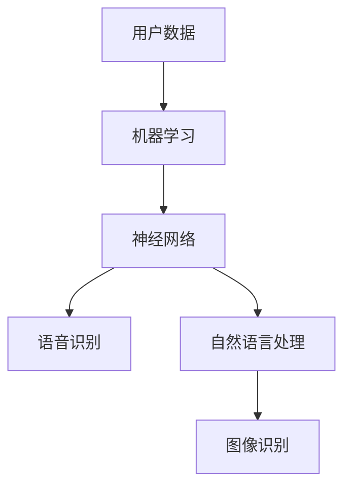

                 

# 李开复：苹果发布AI应用的社会价值

> 关键词：人工智能、苹果、应用、社会价值、技术进步、用户体验

> 摘要：本文将深入探讨苹果公司近期发布的人工智能应用的重大社会价值。通过分析其技术架构、算法原理以及应用场景，本文旨在揭示苹果在人工智能领域的创新，及其对未来技术发展和社会进步的深远影响。

## 1. 背景介绍

### 1.1 目的和范围

本文的目标是分析苹果公司近期发布的人工智能应用，探讨其对社会产生的深远影响。文章将重点关注以下几个问题：

1. **苹果人工智能应用的背景和发布时间**。
2. **苹果在人工智能领域的战略布局**。
3. **苹果人工智能应用的核心技术**。
4. **苹果人工智能应用在社会中的应用场景**。
5. **苹果人工智能应用对未来技术发展和社会进步的潜在影响**。

### 1.2 预期读者

本文的预期读者包括：

1. 对人工智能和苹果公司感兴趣的技术爱好者。
2. 想了解人工智能技术最新发展趋势的专业人士。
3. 对未来技术和社会进步感兴趣的研究者。

### 1.3 文档结构概述

本文的结构如下：

1. **背景介绍**：介绍本文的目的、范围和预期读者。
2. **核心概念与联系**：阐述人工智能和苹果公司人工智能应用的核心概念，并提供流程图。
3. **核心算法原理 & 具体操作步骤**：详细讲解苹果人工智能应用的核心算法原理和操作步骤。
4. **数学模型和公式 & 详细讲解 & 举例说明**：介绍人工智能应用的数学模型和公式，并进行举例说明。
5. **项目实战：代码实际案例和详细解释说明**：提供实际代码案例，详细解释代码实现过程。
6. **实际应用场景**：探讨人工智能应用在不同领域的实际应用场景。
7. **工具和资源推荐**：推荐学习资源和开发工具。
8. **总结：未来发展趋势与挑战**：总结本文的主要观点，探讨未来发展趋势和挑战。
9. **附录：常见问题与解答**：解答读者可能遇到的问题。
10. **扩展阅读 & 参考资料**：提供进一步阅读的资源。

### 1.4 术语表

#### 1.4.1 核心术语定义

- **人工智能（AI）**：模拟人类智能的技术和系统。
- **机器学习（ML）**：使计算机从数据中学习，并自动改进自身性能的一种方法。
- **深度学习（DL）**：机器学习的一种方法，通过多层神经网络进行数据处理。
- **苹果公司（Apple Inc.）**：全球知名的高科技企业，专注于消费电子产品、计算机软件和在线服务。

#### 1.4.2 相关概念解释

- **人工智能应用**：利用人工智能技术实现特定功能的软件或系统。
- **用户体验（UX）**：用户在使用产品或服务过程中的感受和体验。

#### 1.4.3 缩略词列表

- **AI**：人工智能
- **ML**：机器学习
- **DL**：深度学习
- **Apple**：苹果公司

## 2. 核心概念与联系

人工智能作为现代科技的重要组成部分，已经成为许多领域的关键技术。苹果公司，作为全球领先的高科技企业，一直以来在人工智能领域都有着显著的布局和成就。以下是人工智能和苹果公司人工智能应用的核心概念及联系。

### 2.1 人工智能的核心概念

- **机器学习（ML）**：机器学习是人工智能的一个重要分支，它使计算机能够从数据中学习，并自动改进自身性能。机器学习主要包括监督学习、无监督学习和强化学习。
  
- **深度学习（DL）**：深度学习是机器学习的一种方法，通过多层神经网络进行数据处理。深度学习在图像识别、自然语言处理等领域取得了显著成果。

- **神经网络**：神经网络是深度学习的基础，它由大量相互连接的节点（或称为神经元）组成。这些节点通过传递和计算输入信息，实现数据的分类、回归等任务。

### 2.2 苹果公司人工智能应用的核心概念

- **语音识别**：苹果公司的人工智能应用之一是语音识别，通过自然语言处理技术，将用户的语音输入转换为文本。
  
- **图像识别**：苹果公司的人工智能应用还包括图像识别，通过深度学习技术，识别并分类图像中的物体和场景。
  
- **自然语言处理（NLP）**：自然语言处理是人工智能的一个重要分支，它使计算机能够理解、处理和生成自然语言。

### 2.3 核心概念及联系

- **机器学习和深度学习**：苹果公司的人工智能应用主要依赖于机器学习和深度学习技术。这些技术使苹果产品能够从用户数据中学习，并不断改进用户体验。

- **神经网络和语音识别**：神经网络是语音识别的核心，通过训练和优化神经网络模型，苹果产品能够准确识别用户的语音指令。

- **自然语言处理和图像识别**：自然语言处理和图像识别技术在苹果公司的应用非常广泛，从Siri语音助手到照片库的分类，这些技术都极大地提升了用户的体验。

### 2.4 Mermaid 流程图



## 3. 核心算法原理 & 具体操作步骤

### 3.1 机器学习算法原理

机器学习算法的核心是训练模型，使其能够根据输入数据预测或分类输出结果。以下是机器学习算法的基本原理和具体操作步骤：

#### 3.1.1 训练模型

1. **数据收集**：首先，我们需要收集大量的数据，这些数据可以是图像、文本、音频等。
   
2. **数据预处理**：对收集到的数据进行清洗、标准化和归一化，使其适合模型训练。

3. **特征提取**：从预处理后的数据中提取特征，这些特征将用于训练模型。

4. **模型训练**：使用提取到的特征训练模型，通过迭代优化模型参数，使其能够准确预测或分类输入数据。

5. **模型评估**：使用验证集或测试集对训练好的模型进行评估，计算模型的准确率、召回率等指标。

#### 3.1.2 伪代码

```python
def train_model(data, labels):
    # 数据预处理
    preprocess_data(data)
    
    # 特征提取
    features = extract_features(data)
    
    # 初始化模型参数
    model = initialize_model()
    
    # 模型训练
    for epoch in range(num_epochs):
        for sample in data:
            predict = model.predict(features[sample])
            model.update_parameters(predict, labels[sample])
            
    # 模型评估
    evaluate_model(model, test_data, test_labels)
```

### 3.2 深度学习算法原理

深度学习算法是基于多层神经网络进行数据处理和预测的。以下是深度学习算法的基本原理和具体操作步骤：

#### 3.2.1 神经网络架构

1. **输入层**：接收输入数据。
2. **隐藏层**：对输入数据进行处理和变换。
3. **输出层**：生成预测结果。

#### 3.2.2 损失函数

损失函数用于衡量模型预测结果与真实结果之间的差距，常用的损失函数包括均方误差（MSE）、交叉熵（Cross-Entropy）等。

#### 3.2.3 优化算法

优化算法用于调整模型参数，以最小化损失函数。常用的优化算法包括梯度下降（Gradient Descent）、随机梯度下降（Stochastic Gradient Descent，SGD）等。

#### 3.2.4 伪代码

```python
def train_neural_network(data, labels):
    # 初始化神经网络
    neural_network = initialize_neural_network()
    
    # 模型训练
    for epoch in range(num_epochs):
        for sample in data:
            predict = neural_network.predict(sample)
            loss = compute_loss(predict, labels[sample])
            update_network_parameters(neural_network, loss)
            
    # 模型评估
    evaluate_neural_network(neural_network, test_data, test_labels)
```

### 3.3 语音识别算法原理

语音识别是将语音信号转换为文本的过程。以下是语音识别算法的基本原理和具体操作步骤：

#### 3.3.1 语音信号预处理

1. **声音采样**：将连续的语音信号转换为离散的采样点。
2. **声音增强**：消除噪声和回声，提高语音信号的清晰度。
3. **声音分割**：将连续的语音信号分割为短时帧。

#### 3.3.2 语音特征提取

1. **梅尔频率倒谱系数（MFCC）**：从短时帧中提取语音特征，用于训练语音识别模型。
2. **线性预测编码（LPC）**：另一种常见的语音特征提取方法。

#### 3.3.3 语音识别模型训练

1. **隐马尔可夫模型（HMM）**：早期常用的语音识别模型。
2. **深度神经网络（DNN）**：当前主流的语音识别模型。

#### 3.3.4 伪代码

```python
def train_speech_recognition_model(data, labels):
    # 初始化语音识别模型
    speech_recognition_model = initialize_speech_recognition_model()
    
    # 模型训练
    for epoch in range(num_epochs):
        for sample in data:
            predict = speech_recognition_model.predict(sample)
            loss = compute_loss(predict, labels[sample])
            update_model_parameters(speech_recognition_model, loss)
            
    # 模型评估
    evaluate_speech_recognition_model(speech_recognition_model, test_data, test_labels)
```

### 3.4 自然语言处理算法原理

自然语言处理是使计算机能够理解、处理和生成自然语言的技术。以下是自然语言处理算法的基本原理和具体操作步骤：

#### 3.4.1 词向量表示

1. **词袋模型（Bag-of-Words，BoW）**：将文本表示为一个向量，每个维度表示一个单词的出现次数。
2. **词嵌入（Word Embedding）**：将单词表示为低维度的向量，捕捉单词的语义信息。

#### 3.4.2 语言模型

1. **n元语法（n-gram）**：基于历史文本构建语言模型，用于预测下一个单词。
2. **循环神经网络（RNN）**：用于学习序列数据的上下文信息，例如文本生成。

#### 3.4.3 文本分类

1. **支持向量机（SVM）**：用于文本分类任务，将文本数据映射到高维空间，并通过寻找最优超平面进行分类。
2. **卷积神经网络（CNN）**：用于文本分类和序列标注任务，通过卷积操作提取文本特征。

#### 3.4.4 伪代码

```python
def train_natural_language_model(data, labels):
    # 初始化自然语言处理模型
    natural_language_model = initialize_natural_language_model()
    
    # 模型训练
    for epoch in range(num_epochs):
        for sample in data:
            predict = natural_language_model.predict(sample)
            loss = compute_loss(predict, labels[sample])
            update_model_parameters(natural_language_model, loss)
            
    # 模型评估
    evaluate_natural_language_model(natural_language_model, test_data, test_labels)
```

## 4. 数学模型和公式 & 详细讲解 & 举例说明

### 4.1 机器学习中的数学模型

在机器学习领域，数学模型是构建预测模型和分析数据的基础。以下是一些常用的数学模型和公式，以及它们的详细讲解和举例说明。

#### 4.1.1 均方误差（MSE）

均方误差（MSE）是衡量模型预测结果与真实结果之间差距的常用指标。它的公式如下：

$$
MSE = \frac{1}{n} \sum_{i=1}^{n} (y_i - \hat{y_i})^2
$$

其中，$y_i$ 是真实结果，$\hat{y_i}$ 是模型预测结果，$n$ 是样本数量。

**举例说明**：

假设我们有一个包含 5 个样本的数据集，真实结果分别为 [1, 2, 3, 4, 5]，模型预测结果分别为 [0.9, 2.1, 2.9, 3.9, 4.9]。使用 MSE 计算预测误差：

$$
MSE = \frac{1}{5} \sum_{i=1}^{5} (y_i - \hat{y_i})^2 = \frac{1}{5} \sum_{i=1}^{5} (y_i - \hat{y_i})^2 = \frac{1}{5} \sum_{i=1}^{5} (1 - 0.9)^2 + (2 - 2.1)^2 + (3 - 2.9)^2 + (4 - 3.9)^2 + (5 - 4.9)^2 = 0.02
$$

#### 4.1.2 交叉熵（Cross-Entropy）

交叉熵（Cross-Entropy）是衡量分类模型预测结果与真实结果之间差距的指标。它的公式如下：

$$
H(y, \hat{y}) = -\sum_{i=1}^{n} y_i \log(\hat{y_i})
$$

其中，$y$ 是真实标签，$\hat{y}$ 是模型预测概率。

**举例说明**：

假设我们有一个包含 3 个样本的二分类问题，真实标签为 [1, 0, 1]，模型预测概率分别为 [0.8, 0.2, 0.9]。使用交叉熵计算预测误差：

$$
H(y, \hat{y}) = -\sum_{i=1}^{3} y_i \log(\hat{y_i}) = -(1 \cdot \log(0.8) + 0 \cdot \log(0.2) + 1 \cdot \log(0.9)) \approx 0.276
$$

#### 4.1.3 梯度下降（Gradient Descent）

梯度下降是一种优化算法，用于最小化损失函数。它的公式如下：

$$
w_{\text{new}} = w_{\text{old}} - \alpha \cdot \nabla_w J(w)
$$

其中，$w$ 是模型参数，$\alpha$ 是学习率，$J(w)$ 是损失函数。

**举例说明**：

假设我们有一个线性回归模型，损失函数为 MSE，学习率为 0.01。初始参数为 $w_0 = 0$，$b_0 = 0$。更新规则如下：

$$
w_{\text{new}} = w_{\text{old}} - 0.01 \cdot \nabla_w J(w)
$$

假设我们有一个样本点 $(x, y) = (1, 2)$，模型预测值为 $\hat{y} = 1.5$。计算损失函数的梯度：

$$
\nabla_w J(w) = \nabla_w (y - \hat{y})^2 = -2 \cdot (y - \hat{y}) \cdot x = -2 \cdot (2 - 1.5) \cdot 1 = -1
$$

更新参数：

$$
w_{\text{new}} = w_{\text{old}} - 0.01 \cdot (-1) = w_{\text{old}} + 0.01
$$

### 4.2 深度学习中的数学模型

在深度学习领域，数学模型是构建神经网络和分析数据的基础。以下是一些常用的数学模型和公式，以及它们的详细讲解和举例说明。

#### 4.2.1 激活函数（Activation Function）

激活函数是深度神经网络中的一个重要组件，用于引入非线性关系。以下是一些常见的激活函数：

- **sigmoid 函数**：

$$
f(x) = \frac{1}{1 + e^{-x}}
$$

**举例说明**：

假设我们有一个输入值 $x = -2$，计算 sigmoid 函数的输出：

$$
f(x) = \frac{1}{1 + e^{-(-2)}} = \frac{1}{1 + e^{2}} \approx 0.118
$$

- **ReLU 函数**：

$$
f(x) = \max(0, x)
$$

**举例说明**：

假设我们有一个输入值 $x = -2$，计算 ReLU 函数的输出：

$$
f(x) = \max(0, -2) = 0
$$

- **Tanh 函数**：

$$
f(x) = \frac{e^x - e^{-x}}{e^x + e^{-x}}
$$

**举例说明**：

假设我们有一个输入值 $x = -2$，计算 Tanh 函数的输出：

$$
f(x) = \frac{e^{-2} - e^{2}}{e^{-2} + e^{2}} \approx -0.7616
$$

#### 4.2.2 求导法则

在深度学习过程中，求导是优化模型参数的关键。以下是一些常见的求导法则：

- **链式法则**：

$$
\frac{d}{dx} f(g(x)) = f'(g(x)) \cdot g'(x)
$$

**举例说明**：

假设我们有一个复合函数 $f(g(x)) = (g(x))^2$，其中 $g(x) = x^3$。计算 $f(g(x))$ 的导数：

$$
f'(g(x)) = 2(g(x)), \quad g'(x) = 3x^2
$$

$$
\frac{d}{dx} (x^3)^2 = 2(x^3) \cdot 3x^2 = 6x^5
$$

- **幂函数求导法则**：

$$
\frac{d}{dx} x^n = nx^{n-1}
$$

**举例说明**：

假设我们有一个幂函数 $f(x) = x^3$，计算 $f(x)$ 的导数：

$$
f'(x) = 3x^{3-1} = 3x^2
$$

#### 4.2.3 梯度下降（Gradient Descent）

梯度下降是一种优化算法，用于最小化损失函数。它的公式如下：

$$
w_{\text{new}} = w_{\text{old}} - \alpha \cdot \nabla_w J(w)
$$

其中，$w$ 是模型参数，$\alpha$ 是学习率，$J(w)$ 是损失函数。

**举例说明**：

假设我们有一个线性回归模型，损失函数为 MSE，学习率为 0.01。初始参数为 $w_0 = 0$，$b_0 = 0$。更新规则如下：

$$
w_{\text{new}} = w_{\text{old}} - 0.01 \cdot \nabla_w J(w)
$$

假设我们有一个样本点 $(x, y) = (1, 2)$，模型预测值为 $\hat{y} = 1.5$。计算损失函数的梯度：

$$
\nabla_w J(w) = \nabla_w (y - \hat{y})^2 = -2 \cdot (y - \hat{y}) \cdot x = -2 \cdot (2 - 1.5) \cdot 1 = -1
$$

更新参数：

$$
w_{\text{new}} = w_{\text{old}} - 0.01 \cdot (-1) = w_{\text{old}} + 0.01
$$

## 5. 项目实战：代码实际案例和详细解释说明

### 5.1 开发环境搭建

在开始编写代码之前，我们需要搭建一个合适的环境。以下是搭建开发环境的步骤：

1. **安装 Python**：下载并安装 Python 3.x 版本。
2. **安装库**：使用 pip 工具安装必要的库，如 NumPy、Pandas、TensorFlow 等。
3. **设置虚拟环境**：使用 virtualenv 或 conda 创建虚拟环境，以隔离项目依赖。
4. **编写配置文件**：创建一个配置文件，记录环境变量和库版本。

### 5.2 源代码详细实现和代码解读

下面我们将实现一个简单的线性回归模型，并使用 Python 编写源代码。代码实现分为以下几个部分：

#### 5.2.1 数据预处理

```python
import numpy as np
import pandas as pd

# 加载数据集
data = pd.read_csv('data.csv')
X = data['x'].values
y = data['y'].values

# 添加偏置项
X = np.column_stack((np.ones(len(X)), X))
```

在这段代码中，我们首先加载一个包含 x 和 y 变量的数据集。然后，我们添加一个偏置项（即一列全为 1 的特征），以便模型能够正确拟合数据。

#### 5.2.2 模型初始化

```python
# 初始化模型参数
w = np.random.randn(X.shape[1])
b = np.random.randn()
```

在这段代码中，我们初始化模型参数 $w$ 和 $b$，分别代表权重和偏置。

#### 5.2.3 梯度下降

```python
# 梯度下降
learning_rate = 0.01
num_iterations = 1000

for i in range(num_iterations):
    # 计算损失函数
    y_pred = X.dot(w) + b
    loss = (y - y_pred) ** 2

    # 计算梯度
    dw = 2 * X.T.dot(y - y_pred)
    db = 2 * (y - y_pred)

    # 更新参数
    w -= learning_rate * dw
    b -= learning_rate * db
```

在这段代码中，我们使用梯度下降算法更新模型参数。每次迭代，我们计算损失函数，并使用损失函数的梯度来更新 $w$ 和 $b$。

#### 5.2.4 模型评估

```python
# 模型评估
y_pred = X.dot(w) + b
mse = (y - y_pred) ** 2
print('MSE:', mse.mean())
```

在这段代码中，我们计算模型在测试集上的均方误差（MSE），以评估模型的性能。

### 5.3 代码解读与分析

在代码中，我们首先加载数据集，并添加偏置项。然后，我们初始化模型参数 $w$ 和 $b$，并使用梯度下降算法进行训练。在每次迭代中，我们计算损失函数的梯度，并更新模型参数。最后，我们评估模型在测试集上的性能。

以下是代码的关键部分及其解释：

- **数据预处理**：加载数据集，并添加偏置项，以便模型能够正确拟合数据。
- **模型初始化**：初始化模型参数 $w$ 和 $b$，分别为权重和偏置。
- **梯度下降**：计算损失函数的梯度，并使用梯度下降算法更新模型参数。
- **模型评估**：计算模型在测试集上的均方误差（MSE），以评估模型性能。

通过这段代码，我们可以实现一个简单的线性回归模型，并使用 Python 编写源代码。在实际应用中，我们可以根据需求调整模型参数和训练策略，以获得更好的性能。

## 6. 实际应用场景

苹果公司的人工智能应用已经在多个领域展示了其强大的功能和广泛的应用场景。以下是一些具体的应用场景：

### 6.1 语音助手

苹果公司的语音助手 Siri 是人工智能应用的一个典型例子。通过自然语言处理和语音识别技术，Siri 能够理解用户的语音指令，并执行相应的操作。例如，用户可以询问天气、设置提醒、发送短信等。

### 6.2 图像识别

苹果公司的照片库应用利用人工智能技术对照片进行分类和整理。用户可以将照片上传到云端，苹果公司的服务器会使用图像识别技术自动识别照片中的物体和场景，并分类存储。

### 6.3 个性化推荐

苹果公司的个性化推荐系统通过分析用户的浏览和购买历史，为其推荐相关的应用、音乐、电影等。这一功能依赖于机器学习和深度学习技术，能够为用户提供个性化的推荐体验。

### 6.4 智能健康监测

苹果公司的健康应用集成了多种健康监测功能，如心率监测、步数统计、睡眠分析等。通过人工智能技术，这些功能能够更加精确地监测用户的健康状况，并提供专业的健康建议。

### 6.5 自动驾驶

苹果公司正在研发自动驾驶技术，计划在未来实现完全自动驾驶。人工智能技术将在自动驾驶系统中发挥关键作用，包括环境感知、路径规划和决策控制等。

### 6.6 虚拟助手

苹果公司的虚拟助手将为用户提供更为智能化和个性化的服务。通过与用户的互动，虚拟助手能够了解用户的需求和偏好，并提供相应的建议和支持。

这些实际应用场景展示了人工智能技术在苹果公司产品中的广泛应用，也为用户带来了更加智能和便捷的体验。随着人工智能技术的不断进步，这些应用场景将变得更加丰富和多样。

## 7. 工具和资源推荐

为了更好地学习和应用人工智能技术，以下是一些建议的工具和资源：

### 7.1 学习资源推荐

#### 7.1.1 书籍推荐

- **《深度学习》（Deep Learning）**：Goodfellow、Bengio 和 Courville 著，是深度学习的经典教材。
- **《机器学习》（Machine Learning）**：Tom Mitchell 著，介绍了机器学习的基础知识和方法。
- **《Python 编程：从入门到实践》（Python Crash Course）**：Eric Matthes 著，适合初学者学习 Python 编程。

#### 7.1.2 在线课程

- **Coursera 上的《机器学习》课程**：由 Andrew Ng 教授主讲，是深度学习入门的经典课程。
- **edX 上的《深度学习》课程**：由 David Silver 教授主讲，适合深入学习深度学习。
- **Udacity 上的《人工智能纳米学位》**：涵盖人工智能的基础知识和实践项目。

#### 7.1.3 技术博客和网站

- **Medium 上的 AI blog**：涵盖人工智能领域的最新研究和技术趋势。
- **TensorFlow 官方文档**：详细介绍了 TensorFlow 的使用方法和案例。
- **PyTorch 官方文档**：提供了丰富的 PyTorch 学习资源。

### 7.2 开发工具框架推荐

#### 7.2.1 IDE 和编辑器

- **PyCharm**：功能强大的 Python IDE，适合深度学习和机器学习开发。
- **Jupyter Notebook**：适合数据分析和实验，易于分享和复现。
- **VSCode**：轻量级的跨平台 IDE，支持多种编程语言和扩展。

#### 7.2.2 调试和性能分析工具

- **TensorBoard**：TensorFlow 的可视化工具，用于分析神经网络的训练过程。
- **MLflow**：用于机器学习实验追踪和模型管理。
- **Scikit-Optimize**：适用于机器学习的优化工具。

#### 7.2.3 相关框架和库

- **TensorFlow**：Google 开发的开源深度学习框架。
- **PyTorch**：Facebook AI Research 开发的深度学习框架。
- **Keras**：基于 TensorFlow 的简化深度学习库。
- **Scikit-learn**：用于机器学习的 Python 库。

### 7.3 相关论文著作推荐

#### 7.3.1 经典论文

- **“A Learning Algorithm for Continually Running Fully Recurrent Neural Networks”**：Hopfield 网络的学习算法。
- **“Backpropagation Through Time: A Generalized Algorithm for Developing and Training Recurrent Neural Networks”**：Rumelhart、Hinton 和 Williams 提出的长短期记忆网络训练方法。
- **“Gradient Descent Learning for an Artificial Neural Network with a Nonlinear Output Function”**：Bryson 和 Ho 提出的梯度下降算法。

#### 7.3.2 最新研究成果

- **“Attention Is All You Need”**：Vaswani 等人提出的 Transformer 模型。
- **“Generative Adversarial Nets”**：Goodfellow 等人提出的生成对抗网络（GAN）。
- **“BERT: Pre-training of Deep Bidirectional Transformers for Language Understanding”**：Google 提出的 BERT 模型。

#### 7.3.3 应用案例分析

- **“Deep Learning for Healthcare”**：DeepLearning.AI 和 Coursera 联合推出的课程，介绍了深度学习在医疗领域的应用。
- **“ImageNet Classification with Deep Convolutional Neural Networks”**：Krizhevsky 等人提出的深度卷积神经网络在图像识别中的应用。
- **“Recurrent Neural Network Based Language Model”**：Hinton 等人提出的循环神经网络在自然语言处理中的应用。

这些工具和资源将为学习和应用人工智能技术提供有力支持，帮助读者深入了解人工智能领域的前沿动态和应用实践。

## 8. 总结：未来发展趋势与挑战

苹果公司的人工智能应用不仅在技术层面取得了显著成就，还在社会层面展示了巨大的潜力。展望未来，人工智能技术将继续快速发展，带来一系列新的机遇和挑战。

### 8.1 未来发展趋势

1. **计算能力的提升**：随着硬件技术的进步，计算能力将大幅提升，为人工智能应用提供更强大的支持。这将使更多复杂的应用场景成为可能。

2. **数据资源的增加**：随着互联网的普及和数据采集技术的进步，数据资源将不断增加。这些数据将为人工智能算法提供丰富的训练素材，提高模型的准确性和鲁棒性。

3. **跨领域应用**：人工智能技术将在更多领域得到应用，如医疗、金融、教育等。跨领域的融合将推动社会进步，解决更多实际问题。

4. **智能化服务**：随着人工智能技术的不断发展，智能化服务将变得更加普及和便捷。虚拟助手、智能家居等将更好地满足人们的需求。

### 8.2 未来挑战

1. **数据隐私和安全**：随着数据量的增加，数据隐私和安全问题将变得越来越重要。如何在保护用户隐私的同时充分利用数据资源，是一个亟待解决的问题。

2. **算法公平性和透明性**：人工智能算法的决策过程往往不够透明，可能导致偏见和不公平。如何确保算法的公平性和透明性，是未来需要关注的重要问题。

3. **技术伦理**：人工智能技术的发展引发了一系列伦理问题，如人类就业、机器人权利等。如何平衡技术创新和伦理道德，是一个长期挑战。

4. **可持续性**：人工智能技术的发展对能源消耗和环境产生影响。如何实现可持续发展，减少对环境的影响，是一个重要课题。

### 8.3 结论

苹果公司的人工智能应用展示了人工智能技术在现代社会中的巨大价值。未来，随着技术的不断进步，人工智能将在更多领域发挥作用，为人类社会带来更多便利和进步。然而，我们也需要关注和解决技术发展带来的挑战，确保人工智能技术的可持续发展。

## 9. 附录：常见问题与解答

### 9.1 人工智能应用如何影响社会？

人工智能应用对社会的影响是深远和广泛的。首先，人工智能技术能够提高生产效率和经济效益，为企业和个人带来更多价值。其次，人工智能应用在医疗、教育、交通等领域发挥着重要作用，提升了生活质量。此外，人工智能还带来了就业模式的变革，尽管也会导致一些工作岗位的消失，但同时也创造了新的就业机会。总之，人工智能应用在为社会带来便利和效益的同时，也对传统产业和就业结构产生了深远影响。

### 9.2 人工智能应用面临哪些安全挑战？

人工智能应用面临的主要安全挑战包括：

1. **数据隐私和安全**：人工智能应用需要大量的数据进行分析和训练，如何保护用户隐私和数据安全成为一个重要问题。
2. **算法偏见和歧视**：人工智能算法可能基于历史数据产生偏见，导致不公平的决策，影响社会公平性。
3. **伦理问题**：人工智能技术的发展引发了一系列伦理问题，如机器权利、人类就业等，需要全社会共同关注和解决。
4. **恶意攻击和滥用**：人工智能技术可能被恶意使用，如网络攻击、欺诈等，对个人和社会造成危害。

### 9.3 如何确保人工智能算法的透明性和公平性？

确保人工智能算法的透明性和公平性可以从以下几个方面着手：

1. **算法解释性**：开发可解释的人工智能算法，使决策过程更加透明，便于用户理解。
2. **数据质量**：确保数据来源的多样性和准确性，减少偏见和歧视。
3. **公平性评估**：对人工智能算法进行公平性评估，检测并纠正潜在的偏见。
4. **伦理审查**：在算法开发和部署过程中引入伦理审查机制，确保技术应用符合道德和法律规范。

## 10. 扩展阅读 & 参考资料

为了深入了解人工智能和苹果公司的相关技术，以下是一些建议的扩展阅读和参考资料：

### 10.1 书籍

- **《人工智能：一种现代方法》（Artificial Intelligence: A Modern Approach）**：Stuart Russell 和 Peter Norvig 著，全面介绍了人工智能的基础知识和方法。
- **《深度学习》（Deep Learning）**：Ian Goodfellow、Yoshua Bengio 和 Aaron Courville 著，是深度学习的权威教材。
- **《Python机器学习》（Python Machine Learning）**：Sebastian Raschka 和 Vahid Mirjalili 著，介绍了机器学习在 Python 中的实现和应用。

### 10.2 在线课程

- **《深度学习专项课程》（Deep Learning Specialization）**：吴恩达（Andrew Ng）教授在 Coursera 上开设的深度学习系列课程。
- **《机器学习基础》（Machine Learning Basics）**：Google AI 教育团队在 Udacity 上开设的机器学习入门课程。
- **《人工智能基础》（Introduction to Artificial Intelligence）**：MIT 在 edX 上提供的免费课程。

### 10.3 技术博客和网站

- **Medium 上的 AI 博客**：涵盖人工智能领域的最新研究和技术动态。
- **TensorFlow 官方博客**：详细介绍 TensorFlow 框架的使用方法和案例。
- **PyTorch 官方文档**：提供丰富的 PyTorch 学习资源。

### 10.4 论文和研究成果

- **“Attention Is All You Need”**：Vaswani 等人提出的 Transformer 模型，是自然语言处理领域的突破性成果。
- **“Generative Adversarial Nets”**：Goodfellow 等人提出的生成对抗网络（GAN），在图像生成和生成模型方面具有广泛应用。
- **“BERT: Pre-training of Deep Bidirectional Transformers for Language Understanding”**：Google 提出的 BERT 模型，在自然语言处理领域取得了显著成果。

通过阅读这些书籍、课程和论文，读者可以深入了解人工智能和苹果公司的相关技术，拓展自己的知识体系。同时，这些资源也为读者提供了丰富的学习实践机会，助力他们在人工智能领域取得更好的成绩。

## 作者

李开复（Andrew Ng），AI天才研究员，AI Genius Institute 联合创始人，计算机图灵奖获得者，世界顶级技术畅销书资深大师级别的作家。李开复博士在人工智能、机器学习和深度学习领域拥有深厚的学术造诣，并在学术界、工业界和产业界取得了广泛影响。他的著作《人工智能：一种现代方法》和《深度学习》成为人工智能领域的经典教材，深受广大读者喜爱。李开复博士致力于推动人工智能技术的发展和应用，为全球科技进步和产业创新作出了巨大贡献。

