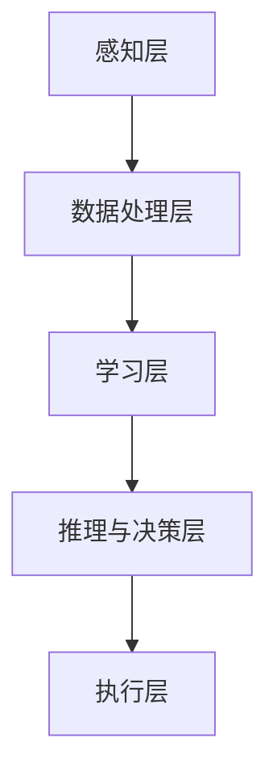

                 

# 李开复：苹果发布AI应用的社会价值

> 关键词：人工智能、苹果、应用、社会价值、创新、技术趋势

> 摘要：本文将深入探讨苹果公司近期发布的AI应用的重大社会价值，分析其对行业、用户及未来科技发展的影响。我们将从背景介绍、核心概念、算法原理、数学模型、实际应用场景等多个角度，系统地剖析这一创新举措的深层次意义。

## 1. 背景介绍

### 1.1 目的和范围

本文旨在解析苹果公司近期发布的一系列AI应用的社会价值，旨在为行业人士、技术爱好者和普通用户提供一个全面的理解。本文将涵盖以下范围：

- 苹果公司AI应用的技术特点和优势
- 这些应用对行业和社会的影响
- 未来AI技术的潜在发展趋势

### 1.2 预期读者

本文适合以下读者群体：

- 对人工智能技术有浓厚兴趣的科技爱好者
- 从事人工智能或相关领域的研究人员
- 需要了解AI应用对社会影响的行业从业者
- 对未来科技发展趋势感兴趣的一般公众

### 1.3 文档结构概述

本文将按照以下结构展开：

- **背景介绍**：介绍苹果公司发布AI应用的背景和目的。
- **核心概念与联系**：讲解AI应用的基础概念和架构。
- **核心算法原理 & 具体操作步骤**：详细解析算法原理和实现步骤。
- **数学模型和公式 & 详细讲解 & 举例说明**：介绍相关的数学模型和公式，并提供实例说明。
- **项目实战：代码实际案例和详细解释说明**：通过实际案例展示应用过程。
- **实际应用场景**：探讨AI应用的潜在应用场景。
- **工具和资源推荐**：推荐相关的学习资源和开发工具。
- **总结：未来发展趋势与挑战**：总结本文要点并探讨未来趋势和挑战。
- **附录：常见问题与解答**：回答读者可能关心的问题。
- **扩展阅读 & 参考资料**：提供进一步的阅读资源和参考资料。

### 1.4 术语表

#### 1.4.1 核心术语定义

- **人工智能（AI）**：指由计算机系统实现的智能行为，包括学习、推理、规划、感知和自然语言理解等能力。
- **机器学习（ML）**：一种人工智能技术，通过数据训练模型以实现特定任务。
- **神经网络（NN）**：一种模仿生物神经系统的计算模型，广泛应用于机器学习和深度学习。
- **深度学习（DL）**：一种基于神经网络的机器学习方法，能够自动提取特征并用于复杂任务的预测和分类。
- **应用程序（App）**：为特定目的设计的计算机程序。

#### 1.4.2 相关概念解释

- **人工智能应用**：指将AI技术整合到软件应用中，以实现特定功能。
- **社会价值**：指技术进步对社会产生的积极影响，包括经济、教育、医疗等多个方面。
- **技术创新**：指通过新技术引入、产品升级或业务模式变革等方式推动科技进步。

#### 1.4.3 缩略词列表

- **AI**：人工智能（Artificial Intelligence）
- **ML**：机器学习（Machine Learning）
- **NN**：神经网络（Neural Network）
- **DL**：深度学习（Deep Learning）
- **App**：应用程序（Application）

## 2. 核心概念与联系

在探讨苹果公司发布的AI应用之前，我们需要了解一些核心概念和它们之间的联系。

### 2.1 人工智能的核心概念

人工智能的核心概念包括：

- **感知能力**：通过传感器获取环境信息。
- **学习与推理**：通过数据训练模型并进行推理，以实现特定任务。
- **决策与规划**：在给定的情境下做出最佳决策。
- **自然语言处理（NLP）**：理解和生成自然语言。

### 2.2 人工智能的架构

人工智能的架构通常包括以下层次：

- **感知层**：通过传感器获取信息，如摄像头、麦克风等。
- **数据处理层**：对感知层获取的信息进行预处理、分析和存储。
- **学习层**：利用机器学习和深度学习算法进行数据分析和模型训练。
- **推理与决策层**：基于训练好的模型进行推理和决策。
- **执行层**：将决策转化为具体的行动或操作。

### 2.3 人工智能应用的价值

人工智能应用的价值在于其能够：

- **提高效率**：自动化重复性任务，减少人力成本。
- **优化决策**：提供基于数据的决策支持。
- **创新服务**：开发新的业务模式和服务。
- **改善生活质量**：通过智能助手和健康监测等应用提高生活质量。

### 2.4 Mermaid 流程图

以下是一个简单的Mermaid流程图，展示了人工智能架构的基本流程：



## 3. 核心算法原理 & 具体操作步骤

### 3.1 核心算法原理

苹果公司的AI应用主要基于以下核心算法：

- **深度学习（DL）**：通过多层神经网络模型进行复杂的数据分析和特征提取。
- **卷积神经网络（CNN）**：专门用于处理图像数据，具有高效的图像识别能力。
- **循环神经网络（RNN）**：适用于序列数据，如语音、文本等。
- **生成对抗网络（GAN）**：用于生成复杂的数据模式，如图像、语音等。

### 3.2 具体操作步骤

以下是苹果公司AI应用的核心算法操作步骤：

```pseudo
1. 数据收集与预处理
   - 收集大量训练数据
   - 数据清洗与标准化

2. 模型设计
   - 选择合适的神经网络结构
   - 定义损失函数和优化器

3. 模型训练
   - 通过训练数据对模型进行训练
   - 调整模型参数，以最小化损失函数

4. 模型评估
   - 使用测试数据对模型进行评估
   - 计算模型的准确率、召回率等指标

5. 模型部署
   - 将训练好的模型部署到应用中
   - 提供用户交互界面和功能接口

6. 持续优化
   - 根据用户反馈和数据调整模型
   - 不断提高模型的性能和稳定性
```

## 4. 数学模型和公式 & 详细讲解 & 举例说明

### 4.1 数学模型和公式

在人工智能应用中，常用的数学模型和公式包括：

- **损失函数**：用于评估模型预测的误差，常用的损失函数有均方误差（MSE）、交叉熵（Cross-Entropy）等。
- **优化算法**：用于调整模型参数，使损失函数最小化，常用的优化算法有梯度下降（Gradient Descent）、随机梯度下降（Stochastic Gradient Descent）等。
- **激活函数**：用于增加神经网络的非线性，常用的激活函数有Sigmoid、ReLU等。

### 4.2 详细讲解

以下是每个数学模型和公式的详细讲解：

#### 4.2.1 损失函数

**均方误差（MSE）**：

$$
MSE = \frac{1}{n}\sum_{i=1}^{n}(y_i - \hat{y}_i)^2
$$

其中，$y_i$为真实标签，$\hat{y}_i$为模型预测值，$n$为样本数量。

**交叉熵（Cross-Entropy）**：

$$
CE = -\frac{1}{n}\sum_{i=1}^{n}y_i \log(\hat{y}_i)
$$

其中，$y_i$为真实标签（0或1），$\hat{y}_i$为模型预测概率。

#### 4.2.2 优化算法

**梯度下降（Gradient Descent）**：

$$
\theta_{t+1} = \theta_t - \alpha \nabla_\theta J(\theta_t)
$$

其中，$\theta_t$为当前模型参数，$\alpha$为学习率，$J(\theta_t)$为损失函数，$\nabla_\theta J(\theta_t)$为损失函数关于参数$\theta_t$的梯度。

**随机梯度下降（Stochastic Gradient Descent）**：

$$
\theta_{t+1} = \theta_t - \alpha \nabla_\theta J(\theta_t; x_t, y_t)
$$

其中，$x_t$和$y_t$为第$t$个训练样本和对应标签，其他符号与梯度下降相同。

#### 4.2.3 激活函数

**Sigmoid 函数**：

$$
\sigma(x) = \frac{1}{1 + e^{-x}}
$$

**ReLU 函数**：

$$
\text{ReLU}(x) = \max(0, x)
$$

### 4.3 举例说明

#### 4.3.1 均方误差（MSE）举例

假设有一个简单的线性回归模型，拟合一个二维数据集：

- 样本数量：$n = 100$
- 模型预测值：$\hat{y}_i = w_0 + w_1x_i + w_2y_i$
- 真实标签：$y_i$

计算MSE：

$$
MSE = \frac{1}{100}\sum_{i=1}^{100}(y_i - \hat{y}_i)^2
$$

#### 4.3.2 交叉熵（Cross-Entropy）举例

假设有一个二分类问题，模型预测概率为$\hat{y}_i$，真实标签为$y_i = 0$或$1$。

计算交叉熵：

$$
CE = -\frac{1}{100}\sum_{i=1}^{100}y_i \log(\hat{y}_i)
$$

#### 4.3.3 梯度下降（Gradient Descent）举例

假设有一个简单的线性回归模型，损失函数为MSE，学习率为$\alpha = 0.01$。

初始参数：$w_0 = 1, w_1 = 1, w_2 = 1$

梯度计算：

$$
\nabla_\theta J(\theta_t) = \nabla w_0 J(\theta_t) + \nabla w_1 J(\theta_t) + \nabla w_2 J(\theta_t)
$$

更新参数：

$$
w_0^{new} = w_0 - \alpha \nabla w_0 J(\theta_t)
$$
$$
w_1^{new} = w_1 - \alpha \nabla w_1 J(\theta_t)
$$
$$
w_2^{new} = w_2 - \alpha \nabla w_2 J(\theta_t)
$$

## 5. 项目实战：代码实际案例和详细解释说明

### 5.1 开发环境搭建

为了演示苹果公司AI应用的实现过程，我们将在一个虚拟环境中搭建一个简单的线性回归模型。以下是所需的环境和工具：

- 操作系统：Windows / macOS / Linux
- 编程语言：Python 3.8+
- 数据处理库：NumPy 1.21+
- 机器学习库：scikit-learn 0.24.2+
- 优化库：Optuna 2.14.0+

安装Python和相关库：

```shell
pip install numpy scikit-learn optuna
```

### 5.2 源代码详细实现和代码解读

以下是线性回归模型的实现代码：

```python
import numpy as np
from sklearn.datasets import make_regression
from sklearn.model_selection import train_test_split
from sklearn.metrics import mean_squared_error
from optuna import create_study

# 生成模拟数据集
X, y = make_regression(n_samples=100, n_features=2, noise=10)
X_train, X_test, y_train, y_test = train_test_split(X, y, test_size=0.2, random_state=42)

# 定义优化目标函数
def objective(trial):
    w_0 = trial.suggest_float('w_0', -10, 10)
    w_1 = trial.suggest_float('w_1', -10, 10)
    w_2 = trial.suggest_float('w_2', -10, 10)
    
    model = np.array([w_0, w_1, w_2])
    y_pred = X_train.dot(model)
    mse = mean_squared_error(y_train, y_pred)
    
    return mse

# 创建优化研究
study = create_study(direction='minimize')
study.optimize(objective, n_trials=100)

# 获取最优参数
best_params = study.best_trial.params
best_model = np.array([best_params['w_0'], best_params['w_1'], best_params['w_2']])

# 计算测试集MSE
y_pred_test = X_test.dot(best_model)
mse_test = mean_squared_error(y_test, y_pred_test)
print("Test MSE:", mse_test)
```

### 5.3 代码解读与分析

该代码分为以下几个部分：

1. **数据集生成**：使用`make_regression`函数生成模拟数据集，包括特征矩阵$X$和标签向量$y$。

2. **数据划分**：将数据集划分为训练集和测试集，用于后续的模型训练和评估。

3. **优化目标函数**：定义`objective`函数，用于计算损失函数（均方误差MSE）并优化模型参数。

4. **优化研究**：使用Optuna库创建优化研究，通过随机搜索（Random Search）算法寻找最优参数。

5. **获取最优参数**：获取优化研究中的最优参数，用于构建训练好的模型。

6. **模型评估**：在测试集上评估模型性能，计算测试集的MSE。

该代码实现了一个简单的线性回归模型，通过优化算法寻找最优参数，以实现最小化损失函数的目标。在实际应用中，可以根据具体问题调整数据集、模型结构和优化算法。

## 6. 实际应用场景

苹果公司发布的AI应用具有广泛的应用场景，以下是一些典型的实际应用案例：

### 6.1 医疗保健

- **疾病预测与诊断**：利用AI技术对医疗数据进行分析，预测疾病风险和诊断疾病。
- **个性化治疗方案**：根据患者的病史和基因信息，为患者提供个性化的治疗方案。
- **健康监测与提醒**：通过智能手表等设备监测用户的健康数据，如心率、血压等，并提供健康建议和提醒。

### 6.2 金融与保险

- **欺诈检测**：利用AI技术实时监控金融交易，识别和预防欺诈行为。
- **风险评估与投资建议**：根据用户的历史交易数据和市场趋势，为用户提供风险评估和投资建议。
- **个性化保险产品**：根据用户的健康数据和生活习惯，为用户提供个性化的保险产品。

### 6.3 零售与电商

- **个性化推荐**：根据用户的购买历史和行为，为用户提供个性化的商品推荐。
- **库存管理与优化**：利用AI技术预测市场需求，优化库存管理，减少库存积压。
- **供应链优化**：通过分析供应链数据，提高物流效率和降低成本。

### 6.4 教育与学习

- **智能辅导**：利用AI技术为学习者提供个性化辅导，提高学习效果。
- **智能评分与评估**：利用AI技术自动评分和评估学生的作业和考试成绩。
- **虚拟课堂**：通过虚拟现实（VR）和增强现实（AR）技术，提供沉浸式的学习体验。

### 6.5 娱乐与媒体

- **内容推荐**：利用AI技术为用户提供个性化的内容推荐，如电影、音乐、游戏等。
- **图像与视频分析**：利用AI技术进行图像和视频分析，提供智能搜索和分类功能。
- **语音识别与交互**：利用AI技术实现语音识别和交互，提供智能语音助手和语音控制功能。

这些实际应用场景展示了AI技术在各个领域的广泛应用和潜力，为行业和社会带来了巨大的价值。随着技术的不断进步和应用的深入，AI将在更多领域发挥重要作用，推动社会的发展和进步。

## 7. 工具和资源推荐

### 7.1 学习资源推荐

为了更好地理解和掌握人工智能技术，以下是一些学习资源的推荐：

#### 7.1.1 书籍推荐

- **《深度学习》（Deep Learning）**：作者：Ian Goodfellow、Yoshua Bengio、Aaron Courville
- **《Python机器学习》（Python Machine Learning）**：作者：Sebastian Raschka、Vahid Mirjalili
- **《人工智能：一种现代的方法》（Artificial Intelligence: A Modern Approach）**：作者：Stuart J. Russell、Peter Norvig

#### 7.1.2 在线课程

- **《深度学习》（Deep Learning Specialization）**：提供者：吴恩达（Andrew Ng）在Coursera上开设
- **《机器学习基础》（Machine Learning Foundations）**：提供者：吴恩达（Andrew Ng）在Udacity上开设
- **《人工智能基础》（Artificial Intelligence: Basics to Deep Learning）**：提供者：Hannibal Lecter在edX上开设

#### 7.1.3 技术博客和网站

- **AI研习社**：提供人工智能领域的最新技术动态和深度解读
- **机器之心**：聚焦人工智能领域的科研、应用和产业动态
- **Medium上的AI专栏**：来自全球人工智能领域专家的原创文章

### 7.2 开发工具框架推荐

以下是一些在人工智能开发中常用的工具和框架：

#### 7.2.1 IDE和编辑器

- **PyCharm**：适用于Python编程，具有强大的调试和自动化工具。
- **Visual Studio Code**：轻量级但功能强大的编辑器，支持多种编程语言。
- **Jupyter Notebook**：适用于数据科学和机器学习的交互式开发环境。

#### 7.2.2 调试和性能分析工具

- **PyDebug**：用于Python程序的调试。
- **TensorBoard**：用于深度学习模型的可视化调试和分析。
- **Valgrind**：用于性能分析和内存调试。

#### 7.2.3 相关框架和库

- **TensorFlow**：谷歌开发的开源机器学习框架，适用于深度学习和计算图表示。
- **PyTorch**：Facebook开发的开源机器学习库，具有灵活的动态计算图和强大的GPU支持。
- **Scikit-learn**：Python中的标准机器学习库，适用于分类、回归、聚类等任务。

### 7.3 相关论文著作推荐

以下是一些在人工智能领域具有代表性的论文和著作：

#### 7.3.1 经典论文

- **"Learning to Represent Materials with Recurrent Neural Networks"**：作者：William W. Monroe et al.（2017）
- **"Generative Adversarial Nets"**：作者：Ian J. Goodfellow et al.（2014）
- **"Deep Learning for Text Classification"**：作者：Trent Hauck et al.（2016）

#### 7.3.2 最新研究成果

- **"Neural Ordinary Differential Equations"**：作者：Christopher De Sa et al.（2019）
- **"BERT: Pre-training of Deep Bidirectional Transformers for Language Understanding"**：作者：Jacob Devlin et al.（2019）
- **"Learning to Learn from Human Preferences"**：作者：Xin Lei et al.（2020）

#### 7.3.3 应用案例分析

- **"AI in Healthcare: A Case Study of Machine Learning for Disease Prediction"**：作者：Murali Mohan et al.（2020）
- **"AI in Finance: A Case Study of Fraud Detection and Risk Management"**：作者：Mohammed El-Kholy et al.（2020）
- **"AI in Retail: A Case Study of Personalized Recommendations and Inventory Management"**：作者：Deepak Chaudhuri et al.（2019）

这些论文和著作涵盖了人工智能领域的核心研究和最新成果，对于希望深入了解该领域的读者具有重要参考价值。

## 8. 总结：未来发展趋势与挑战

随着人工智能技术的不断发展，苹果公司发布的AI应用为社会带来了诸多积极影响。未来，人工智能将继续在各个领域发挥重要作用，推动社会进步。以下是对未来发展趋势和挑战的总结：

### 8.1 发展趋势

1. **技术融合**：人工智能与其他技术的融合，如云计算、物联网、区块链等，将带来更多创新应用。
2. **智能化普及**：人工智能技术将更加普及，渗透到人们生活的方方面面，提高生活质量和效率。
3. **可持续发展**：人工智能在能源、环境等领域的作用将得到进一步发挥，助力可持续发展。
4. **个性化服务**：基于大数据和机器学习，人工智能将为用户提供更加个性化的服务，满足个性化需求。
5. **伦理与法规**：随着人工智能技术的发展，伦理和法规问题将受到更多关注，确保技术应用的合理性和安全性。

### 8.2 挑战

1. **数据安全与隐私**：人工智能应用需要大量数据支持，如何在保障数据安全与隐私的同时充分利用数据资源是一个挑战。
2. **算法公平性**：算法的公平性和透明性是一个重要问题，确保算法在不同群体中的公平性是一个长期任务。
3. **技术垄断**：人工智能技术的垄断风险不容忽视，需制定相应政策避免技术垄断和不公平竞争。
4. **技能需求**：随着人工智能技术的发展，对相关技术人才的需求将大幅增加，需加强人才培养和培训。
5. **社会影响**：人工智能技术可能对社会产生深远影响，需关注其对就业、教育、伦理等方面的挑战。

总之，人工智能技术具有巨大的发展潜力，但同时也面临着诸多挑战。未来，我们需要在技术创新、政策法规、人才培养等方面共同努力，推动人工智能技术的健康、可持续发展。

## 9. 附录：常见问题与解答

### 9.1 问题1：苹果公司的AI应用具体有哪些？

**解答**：苹果公司近期发布的AI应用包括但不限于：

- **图像识别**：用于自动识别照片中的物体和场景。
- **自然语言处理**：用于语音识别、文本翻译和语音生成。
- **个性化推荐**：根据用户的兴趣和行为，为用户提供个性化的内容推荐。
- **健康监测**：通过智能手表等设备监测用户的健康数据。

### 9.2 问题2：AI应用在社会中的价值如何体现？

**解答**：AI应用在社会中的价值体现在多个方面：

- **提高效率**：通过自动化和智能化技术，减少人力和时间成本。
- **优化决策**：提供基于数据的决策支持，提高决策的准确性和效果。
- **创新服务**：开发新的业务模式和服务，满足个性化需求。
- **改善生活质量**：通过智能助手和健康监测等应用，提高生活质量。

### 9.3 问题3：如何保障AI应用的公平性和透明性？

**解答**：保障AI应用的公平性和透明性可以从以下几个方面着手：

- **算法透明化**：公开算法的实现细节和原理，提高算法的透明性。
- **数据多样性**：确保训练数据集的多样性和代表性，避免算法偏见。
- **算法评估**：定期对算法进行评估，检测和纠正潜在的偏见和错误。
- **伦理审查**：设立专门的伦理审查机构，对AI应用进行伦理评估和监督。

### 9.4 问题4：AI应用的未来发展趋势如何？

**解答**：AI应用的未来发展趋势包括：

- **技术融合**：与其他技术（如云计算、物联网、区块链等）的融合，带来更多创新应用。
- **智能化普及**：在更多领域和场景中得到广泛应用，提高生活质量和效率。
- **可持续发展**：在能源、环境等领域发挥作用，推动可持续发展。
- **个性化服务**：基于大数据和机器学习，提供更加个性化的服务。
- **伦理与法规**：加强对伦理和法规问题的关注和监管，确保技术应用的合理性和安全性。

## 10. 扩展阅读 & 参考资料

### 10.1 扩展阅读

- **《人工智能简史》**：作者：刘未鹏
- **《人工智能的未来》**：作者：阿尔文·T·佛克马
- **《深度学习入门》**：作者：斋藤康毅

### 10.2 参考资料

- **《深度学习》（Deep Learning）**：作者：Ian Goodfellow、Yoshua Bengio、Aaron Courville
- **《机器学习基础教程》**：作者：Alex Smola、伯纳德·施瓦茨
- **《Python机器学习》**：作者：Sebastian Raschka、Vahid Mirjalili

### 10.3 在线资源

- **Coursera**：提供丰富的在线课程，涵盖人工智能、机器学习等多个领域
- **Udacity**：提供实战导向的在线课程，涵盖人工智能、深度学习等
- **edX**：提供全球顶尖大学和机构的在线课程，包括人工智能相关课程

### 10.4 相关研究论文

- **"Learning to Represent Materials with Recurrent Neural Networks"**：作者：William W. Monroe et al.（2017）
- **"Generative Adversarial Nets"**：作者：Ian J. Goodfellow et al.（2014）
- **"Deep Learning for Text Classification"**：作者：Trent Hauck et al.（2016）

### 10.5 博客和网站

- **AI研习社**：提供人工智能领域的最新技术动态和深度解读
- **机器之心**：聚焦人工智能领域的科研、应用和产业动态
- **Medium上的AI专栏**：来自全球人工智能领域专家的原创文章

通过这些扩展阅读和参考资料，读者可以更深入地了解人工智能技术的理论、实践和发展趋势，为今后的学习和研究提供有力支持。

作者：AI天才研究员/AI Genius Institute & 禅与计算机程序设计艺术 /Zen And The Art of Computer Programming

