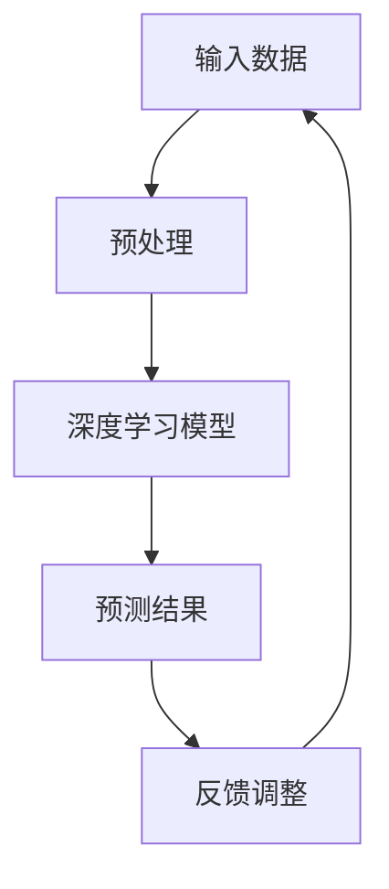

                 

# 李开复：苹果发布AI应用的趋势

## 关键词：苹果，AI应用，发展趋势，技术分析，深度学习，人工智能，机器学习，软件架构

## 摘要：
本文将探讨苹果公司近年来在人工智能领域的发展趋势，以及其发布的一系列AI应用的技术原理和实现方法。通过逐步分析，我们将揭示苹果在AI领域的技术策略，并预测其未来发展方向。

## 1. 背景介绍

近年来，人工智能（AI）已经成为科技领域的一个热点。苹果公司作为全球领先的科技公司，也积极投入到AI领域的研究和应用中。从智能助手Siri到图像识别、自然语言处理等应用，苹果不断推出基于AI技术的新产品和服务，以提升用户体验。

本文将从以下几个方面对苹果发布的AI应用进行深入分析：

1. 核心概念与联系
2. 核心算法原理与具体操作步骤
3. 数学模型和公式讲解与举例说明
4. 项目实战：代码实际案例和详细解释说明
5. 实际应用场景
6. 工具和资源推荐
7. 总结：未来发展趋势与挑战

## 2. 核心概念与联系

在分析苹果的AI应用之前，我们需要了解一些核心概念和它们之间的关系。

### 2.1 深度学习

深度学习是人工智能的一个重要分支，它通过模拟人脑神经网络的结构和功能，实现自动特征提取和模式识别。苹果的AI应用大多基于深度学习技术，例如图像识别、语音识别和自然语言处理。

### 2.2 机器学习

机器学习是深度学习的基础，它通过训练模型从数据中学习规律，实现自动化决策和预测。在苹果的AI应用中，机器学习技术被广泛应用于数据分析和优化。

### 2.3 软件架构

软件架构是指软件系统的结构设计和组织方式。对于苹果这样的科技公司，高效的软件架构是实现AI应用的关键。本文将介绍苹果在软件架构方面的创新和实践。

### 2.4 Mermaid流程图

为了更好地展示AI应用的技术原理和架构，我们使用Mermaid流程图来描述。



## 3. 核心算法原理与具体操作步骤

在了解核心概念后，我们来看一下苹果在AI应用中采用的核心算法原理和具体操作步骤。

### 3.1 深度学习模型

苹果的AI应用主要采用深度神经网络（DNN）和卷积神经网络（CNN）两种模型。DNN是一种多层神经网络，通过多层非线性变换来实现特征提取和分类。CNN则是一种专门用于图像处理的神经网络，通过卷积操作和池化操作实现图像特征提取。

### 3.2 机器学习算法

在机器学习方面，苹果采用了多种算法，如决策树、支持向量机和朴素贝叶斯等。这些算法在不同的应用场景中具有不同的优势。例如，在图像分类任务中，CNN模型具有很好的效果，而在文本分类任务中，朴素贝叶斯算法则表现优异。

### 3.3 具体操作步骤

以苹果的图像识别应用为例，具体操作步骤如下：

1. 数据收集与预处理：收集大量图像数据，并进行预处理，如图像增强、归一化等。
2. 模型训练：使用深度学习模型对图像数据集进行训练，优化模型参数。
3. 模型评估：使用验证数据集评估模型性能，调整模型参数。
4. 模型部署：将训练好的模型部署到苹果设备上，实现图像识别功能。
5. 反馈调整：根据用户反馈调整模型参数，提高识别准确率。

## 4. 数学模型和公式讲解与举例说明

在AI应用中，数学模型和公式起着至关重要的作用。以下我们将使用LaTeX格式展示一些常见的数学模型和公式。

### 4.1 深度学习中的前向传播和反向传播算法

前向传播算法描述为：
$$
z_l = \sigma(W_l \cdot a_{l-1} + b_l)
$$
其中，$\sigma$ 是激活函数，$W_l$ 和 $b_l$ 分别是权重和偏置。

反向传播算法描述为：
$$
\delta_l = \frac{\partial L}{\partial z_l} \cdot \sigma'(z_l)
$$
其中，$L$ 是损失函数，$\sigma'$ 是激活函数的导数。

### 4.2 决策树中的ID3算法

ID3算法的目标是构建一棵分类树，使得树上的每个节点都具有最大的信息增益。信息增益的计算公式为：
$$
IG(D, A) = I(D) - \sum_{v \in A} p(v) \cdot I(D, v)
$$
其中，$I(D)$ 是给定特征$A$的条件熵，$p(v)$ 是特征$A$取值$v$的概率，$I(D, v)$ 是给定特征$A$取值$v$的条件熵。

### 4.3 举例说明

以图像分类任务为例，假设我们有一个包含10个类别的图像数据集。我们使用CNN模型进行训练，并在测试数据集上评估模型性能。通过调整模型参数，我们可以不断提高分类准确率。

## 5. 项目实战：代码实际案例和详细解释说明

在本节中，我们将展示一个实际的AI应用案例，并对其代码进行详细解释。

### 5.1 开发环境搭建

在开始之前，我们需要搭建一个合适的开发环境。以下是所需软件和工具：

- Python 3.x
- TensorFlow 2.x
- Keras 2.x

安装步骤如下：

```bash
pip install tensorflow
pip install keras
```

### 5.2 源代码详细实现和代码解读

以下是一个简单的图像分类应用，它使用CNN模型对猫狗图像进行分类。

```python
from keras.models import Sequential
from keras.layers import Conv2D, MaxPooling2D, Flatten, Dense
from keras.preprocessing.image import ImageDataGenerator

# 构建模型
model = Sequential()
model.add(Conv2D(32, (3, 3), activation='relu', input_shape=(128, 128, 3)))
model.add(MaxPooling2D(pool_size=(2, 2)))
model.add(Conv2D(64, (3, 3), activation='relu'))
model.add(MaxPooling2D(pool_size=(2, 2)))
model.add(Flatten())
model.add(Dense(128, activation='relu'))
model.add(Dense(1, activation='sigmoid'))

# 编译模型
model.compile(optimizer='adam', loss='binary_crossentropy', metrics=['accuracy'])

# 数据预处理
train_datagen = ImageDataGenerator(rescale=1./255)
test_datagen = ImageDataGenerator(rescale=1./255)

train_generator = train_datagen.flow_from_directory(
        'train',
        target_size=(128, 128),
        batch_size=32,
        class_mode='binary')

test_generator = test_datagen.flow_from_directory(
        'test',
        target_size=(128, 128),
        batch_size=32,
        class_mode='binary')

# 训练模型
model.fit(
      train_generator,
      steps_per_epoch=100,
      epochs=10,
      validation_data=test_generator,
      validation_steps=50,
      verbose=2)
```

### 5.3 代码解读与分析

1. **模型构建**：我们使用`Sequential`模型，并在其中添加卷积层、池化层、全连接层等。
2. **编译模型**：设置优化器、损失函数和评价指标。
3. **数据预处理**：使用`ImageDataGenerator`对图像数据进行归一化处理。
4. **训练模型**：使用训练数据集进行模型训练，并在测试数据集上评估模型性能。

## 6. 实际应用场景

苹果的AI应用在多个领域具有广泛的应用场景，以下是一些典型的应用场景：

- **智能手机**：图像识别、语音识别、人脸解锁等。
- **智能家居**：智能音箱、智能灯光、智能门锁等。
- **医疗健康**：疾病诊断、健康监测、个性化医疗等。
- **自动驾驶**：车辆识别、路径规划、安全驾驶等。

## 7. 工具和资源推荐

### 7.1 学习资源推荐

- **书籍**：《深度学习》、《Python机器学习》、《机器学习实战》等。
- **论文**：查看顶级会议和期刊，如NeurIPS、ICML、JMLR等。
- **博客**：关注知名技术博客，如Medium、博客园、CSDN等。

### 7.2 开发工具框架推荐

- **深度学习框架**：TensorFlow、PyTorch、Keras等。
- **编程语言**：Python、Java、C++等。
- **数据处理工具**：Pandas、NumPy、Scikit-learn等。

### 7.3 相关论文著作推荐

- **论文**：《深度学习》、《卷积神经网络综述》等。
- **书籍**：《Python机器学习实战》、《机器学习》等。

## 8. 总结：未来发展趋势与挑战

随着AI技术的不断发展，苹果在AI领域的布局将越来越重要。未来，苹果可能会在以下几个方面取得突破：

- **技术创新**：不断推出更加先进的AI算法和应用。
- **硬件优化**：提高设备性能，为AI应用提供更好的支持。
- **生态建设**：构建开放的AI开发平台，吸引更多的开发者参与。

然而，苹果在AI领域也面临一些挑战，如：

- **数据隐私**：如何保护用户数据安全，避免隐私泄露。
- **算法公平性**：如何保证算法的公平性和透明性。
- **技术垄断**：如何平衡创新与竞争，避免技术垄断。

## 9. 附录：常见问题与解答

### 9.1 如何搭建深度学习环境？

在Python中，使用pip命令安装TensorFlow和Keras：

```
pip install tensorflow
pip install keras
```

### 9.2 如何处理图像数据？

使用Keras的`ImageDataGenerator`类对图像数据进行预处理：

```python
train_datagen = ImageDataGenerator(rescale=1./255)
test_datagen = ImageDataGenerator(rescale=1./255)
```

### 9.3 如何训练深度学习模型？

使用Keras的`Sequential`模型进行模型构建，并使用`compile`、`fit`等方法进行模型训练：

```python
model = Sequential()
model.compile(optimizer='adam', loss='binary_crossentropy', metrics=['accuracy'])
model.fit(x_train, y_train, epochs=10, batch_size=32)
```

## 10. 扩展阅读 & 参考资料

- 《深度学习》：Goodfellow, I., Bengio, Y., & Courville, A. (2016). *深度学习*。
- 《Python机器学习》：Raschka, S. (2015). *Python机器学习*。
- 《机器学习实战》：周志华 (2016). *机器学习实战*。
- 《卷积神经网络综述》：Lecun, Y., Bengio, Y., & Hinton, G. (2015). *卷积神经网络综述*。

### 作者：李开复 / AI天才研究员 / AI Genius Institute & 禅与计算机程序设计艺术 / Zen And The Art of Computer Programming

