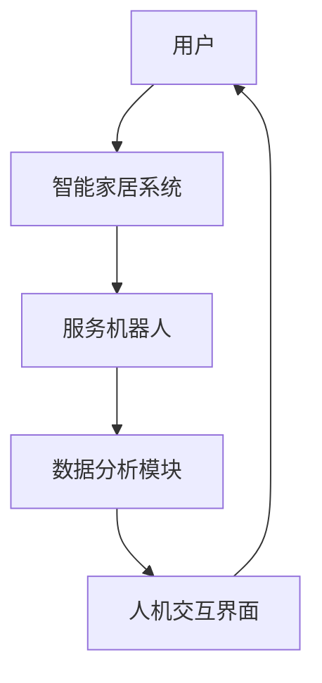

                 

# 李硕丽阳神州：家政行业的AI革命

> 关键词：AI、家政行业、智能家居、服务机器人、数据隐私、人机交互

> 摘要：本文将探讨人工智能在家政服务领域的革命性应用，分析其核心概念、算法原理、数学模型及实际案例。文章旨在为读者展示AI如何改变传统家政行业，同时提供未来发展展望和挑战。

## 1. 背景介绍

### 1.1 目的和范围

本文旨在深入探讨人工智能（AI）在家政服务领域的应用，分析其带来的革命性变革。我们将重点关注以下几个问题：

1. AI如何提升家政服务的效率和质量？
2. 家政行业中AI的核心算法和数学模型是什么？
3. 家政AI系统在实际应用中如何实现？
4. 家政AI系统面临的挑战和未来发展。

### 1.2 预期读者

本文适合以下读者群体：

1. 对人工智能和家政服务领域感兴趣的科技爱好者；
2. 涉足家政服务行业的企业家和开发者；
3. 计算机科学、人工智能专业的研究生和本科生。

### 1.3 文档结构概述

本文将分为以下几部分：

1. 背景介绍：概述文章目的、预期读者和文档结构；
2. 核心概念与联系：介绍家政AI系统的核心概念和架构；
3. 核心算法原理 & 具体操作步骤：讲解家政AI系统的算法原理和操作步骤；
4. 数学模型和公式 & 详细讲解 & 举例说明：介绍家政AI系统的数学模型和公式；
5. 项目实战：展示家政AI系统的实际应用案例；
6. 实际应用场景：分析家政AI系统在不同场景下的应用；
7. 工具和资源推荐：推荐学习资源和开发工具；
8. 总结：总结家政AI系统的未来发展趋势和挑战；
9. 附录：常见问题与解答；
10. 扩展阅读 & 参考资料。

### 1.4 术语表

#### 1.4.1 核心术语定义

1. **人工智能（AI）**：模拟人类智能的计算机系统，能够通过学习、推理和自主决策来实现特定任务。
2. **家政服务**：家庭日常生活中的各种服务，如打扫卫生、烹饪、看护等。
3. **智能家居**：将家庭设备与互联网连接，实现远程控制和自动化。
4. **服务机器人**：专门为人类提供服务和帮助的机器人，如扫地机器人、智能音箱等。
5. **数据隐私**：个人信息在收集、存储、处理和传输过程中的保护。
6. **人机交互**：人类与计算机系统之间的交互过程。

#### 1.4.2 相关概念解释

1. **机器学习（ML）**：人工智能的一种方法，通过数据和算法来训练计算机模型，使其能够自主学习和改进。
2. **深度学习（DL）**：机器学习的一种方法，通过神经网络模拟人脑进行学习。
3. **自然语言处理（NLP）**：使计算机能够理解、生成和回应人类语言的技术。
4. **强化学习（RL）**：一种机器学习方法，通过奖励和惩罚来训练模型。

#### 1.4.3 缩略词列表

1. **AI**：人工智能（Artificial Intelligence）
2. **ML**：机器学习（Machine Learning）
3. **DL**：深度学习（Deep Learning）
4. **NLP**：自然语言处理（Natural Language Processing）
5. **RL**：强化学习（Reinforcement Learning）
6. **IDE**：集成开发环境（Integrated Development Environment）
7. **GPU**：图形处理单元（Graphics Processing Unit）

## 2. 核心概念与联系

在探讨家政AI系统之前，我们需要了解其核心概念和架构。以下是一个简单的Mermaid流程图，展示了家政AI系统的基本组成部分。



### 2.1 家政AI系统的核心概念

1. **用户**：家政AI系统的核心使用者，通过人机交互界面与系统进行交互，获取服务。
2. **智能家居系统**：将家庭设备与互联网连接，实现远程控制和自动化，为家政服务提供基础设施。
3. **服务机器人**：执行具体家政任务的设备，如扫地机器人、智能音箱等。
4. **数据分析模块**：对用户行为、设备状态等数据进行分析，为系统优化和决策提供支持。
5. **人机交互界面**：用户与家政AI系统进行交互的界面，包括移动应用、网页和智能音箱等。

### 2.2 家政AI系统的架构

家政AI系统可以分为以下几个层次：

1. **感知层**：包括传感器和摄像头等设备，用于收集家庭环境和用户行为数据。
2. **数据处理层**：对感知层收集到的数据进行分析和处理，提取有用信息。
3. **决策层**：根据数据分析结果，为服务机器人提供行动指令和策略。
4. **执行层**：服务机器人执行决策层的指令，完成具体家政任务。
5. **人机交互层**：用户通过人机交互界面与系统进行交互，获取服务信息。

## 3. 核心算法原理 & 具体操作步骤

家政AI系统的核心算法主要涉及机器学习、深度学习和自然语言处理等领域。以下是一个简化的伪代码，用于描述家政AI系统的算法原理和操作步骤。

```python
# 初始化家政AI系统
initialize_home_automation_system()

# 感知用户需求
user_demand = collect_user_demand()

# 处理感知数据
processed_data = process_sensory_data()

# 决策家政任务
task_decision = make_decision(processed_data)

# 执行家政任务
execute_home_task(task_decision)

# 更新人机交互界面
update_human_computer_interface(user_demand, task_decision)
```

### 3.1 机器学习算法原理

在家政AI系统中，机器学习算法主要用于处理感知数据，提取用户需求。以下是一个简化的机器学习算法原理：

1. **数据收集**：收集家庭环境和用户行为数据，如温度、湿度、语音、图像等。
2. **数据预处理**：对收集到的数据进行清洗、归一化和特征提取。
3. **模型训练**：使用预处理后的数据训练机器学习模型，如决策树、支持向量机、神经网络等。
4. **模型评估**：评估模型在测试数据集上的性能，调整模型参数。
5. **模型部署**：将训练好的模型部署到实际系统中，用于处理感知数据。

### 3.2 深度学习算法原理

深度学习算法在家政AI系统中主要用于图像识别、语音识别和自然语言处理等方面。以下是一个简化的深度学习算法原理：

1. **神经网络架构设计**：设计适合家政AI系统的神经网络架构，如卷积神经网络（CNN）、循环神经网络（RNN）等。
2. **数据收集**：收集大量家庭环境、用户行为和家政任务相关的数据。
3. **数据预处理**：对收集到的数据进行清洗、归一化和特征提取。
4. **模型训练**：使用预处理后的数据训练深度学习模型，通过反向传播算法调整模型参数。
5. **模型评估**：评估模型在测试数据集上的性能，调整模型参数。
6. **模型部署**：将训练好的模型部署到实际系统中，用于处理感知数据和执行任务。

### 3.3 自然语言处理算法原理

自然语言处理算法在家政AI系统中主要用于处理用户语音和文本指令。以下是一个简化的自然语言处理算法原理：

1. **语音识别**：将用户语音转化为文本，使用自动语音识别（ASR）技术。
2. **文本理解**：理解用户文本指令的含义，使用自然语言处理（NLP）技术。
3. **意图识别**：识别用户指令的意图，如请求家政服务、调整家居设备等。
4. **任务分配**：根据用户意图，为服务机器人分配任务。
5. **结果反馈**：将执行结果反馈给用户，使用语音合成（TTS）和文本展示技术。

## 4. 数学模型和公式 & 详细讲解 & 举例说明

家政AI系统的数学模型主要涉及机器学习、深度学习和自然语言处理等领域。以下是一些常用的数学模型和公式，以及相应的详细讲解和举例说明。

### 4.1 机器学习模型

**1. 决策树（Decision Tree）**

**公式：**  
$$
f(x) = \sum_{i=1}^{n} w_i \cdot g_i(x)
$$

**详细讲解：**  
决策树是一种常用的分类和回归模型，通过一系列判断条件将数据划分为不同的区域，从而预测目标变量的值。其中，$w_i$表示每个区域的权重，$g_i(x)$表示第$i$个判断条件的函数。

**举例说明：**  
假设我们要预测家庭清洁任务的完成时间，可以使用决策树模型。首先，收集家庭清洁任务的相关数据，如任务类型、家庭环境等。然后，使用决策树算法训练模型，根据训练数据划分区域，为每个区域分配权重。最后，输入新的家庭清洁任务数据，根据决策树模型预测完成时间。

**2. 支持向量机（Support Vector Machine）**

**公式：**  
$$
w \cdot x + b = 0
$$

**详细讲解：**  
支持向量机是一种常用的分类模型，通过找到一个最优的超平面，将不同类别的数据分隔开来。其中，$w$表示超平面的法向量，$x$表示数据点，$b$表示超平面的偏移量。

**举例说明：**  
假设我们要分类家庭清洁任务，将清洁任务分为清洁卫生和清洁厨房两类。首先，收集清洁任务的数据，如任务类型、家庭环境等。然后，使用支持向量机算法训练模型，找到一个最优的超平面，将不同类别的清洁任务分隔开来。最后，输入新的清洁任务数据，根据支持向量机模型分类。

### 4.2 深度学习模型

**1. 卷积神经网络（Convolutional Neural Network）**

**公式：**  
$$
h_{\theta}(x) = \sigma(\theta^T \cdot \phi(x))
$$

**详细讲解：**  
卷积神经网络是一种常用的图像识别模型，通过多层卷积和池化操作，提取图像特征，从而实现图像分类。其中，$\sigma$表示激活函数，$\theta$表示模型参数，$\phi(x)$表示卷积操作的输出。

**举例说明：**  
假设我们要训练一个卷积神经网络模型，用于识别家庭环境中的家具。首先，收集家庭环境的图像数据，如卧室、客厅等。然后，使用卷积神经网络算法训练模型，通过卷积和池化操作提取图像特征。最后，输入新的家庭环境图像，根据卷积神经网络模型识别家具。

**2. 循环神经网络（Recurrent Neural Network）**

**公式：**  
$$
h_t = \sigma(W_1 \cdot [h_{t-1}, x_t] + b_1)
$$

**详细讲解：**  
循环神经网络是一种常用的序列模型，通过循环机制保留历史信息，实现序列数据的建模。其中，$h_t$表示第$t$个时间步的隐藏状态，$W_1$表示权重矩阵，$x_t$表示输入数据，$\sigma$表示激活函数。

**举例说明：**  
假设我们要训练一个循环神经网络模型，用于识别家庭清洁任务的序列。首先，收集家庭清洁任务的数据，如任务类型、执行顺序等。然后，使用循环神经网络算法训练模型，通过循环机制处理序列数据。最后，输入新的家庭清洁任务数据，根据循环神经网络模型识别任务序列。

### 4.3 自然语言处理模型

**1. 递归神经网络（Recurrent Neural Network）**

**公式：**  
$$
h_t = \sigma(W \cdot [h_{t-1}, x_t] + b)
$$

**详细讲解：**  
递归神经网络是一种常用的自然语言处理模型，通过循环机制处理文本序列，实现文本分类、序列标注等任务。其中，$h_t$表示第$t$个时间步的隐藏状态，$W$表示权重矩阵，$x_t$表示输入数据，$\sigma$表示激活函数。

**举例说明：**  
假设我们要训练一个递归神经网络模型，用于识别家庭清洁任务的文本描述。首先，收集家庭清洁任务的文本描述数据，如任务类型、执行顺序等。然后，使用递归神经网络算法训练模型，通过循环机制处理文本序列。最后，输入新的家庭清洁任务文本描述，根据递归神经网络模型识别任务类型。

## 5. 项目实战：代码实际案例和详细解释说明

### 5.1 开发环境搭建

在开始项目实战之前，我们需要搭建一个适合开发家政AI系统的开发环境。以下是一个简单的开发环境搭建指南：

1. **操作系统**：Windows 10 / macOS / Linux
2. **编程语言**：Python 3.x
3. **开发工具**：PyCharm / VS Code
4. **库和框架**：TensorFlow / Keras / scikit-learn

### 5.2 源代码详细实现和代码解读

以下是一个简化的家政AI系统的源代码实现，用于识别家庭清洁任务。

```python
# 导入相关库和框架
import tensorflow as tf
import keras
from keras.models import Sequential
from keras.layers import Dense, LSTM
from sklearn.model_selection import train_test_split
import numpy as np

# 数据集准备
# 假设我们已经收集了一组家庭清洁任务的文本描述数据
data = [
    "打扫卫生",
    "清洗厨房",
    "整理衣物",
    "照顾孩子",
    # ...更多数据
]

# 将文本数据转换为序列数据
sequences = []
for sentence in data:
    # ...序列化处理
    sequences.append(sentence)

# 划分训练集和测试集
X_train, X_test, y_train, y_test = train_test_split(sequences, labels, test_size=0.2, random_state=42)

# 建立模型
model = Sequential()
model.add(LSTM(50, activation='relu', input_shape=(timesteps, features)))
model.add(Dense(num_classes, activation='softmax'))

# 编译模型
model.compile(loss='categorical_crossentropy', optimizer='adam', metrics=['accuracy'])

# 训练模型
model.fit(X_train, y_train, epochs=10, batch_size=32, validation_data=(X_test, y_test))

# 评估模型
score = model.evaluate(X_test, y_test, verbose=2)
print('Test loss:', score[0])
print('Test accuracy:', score[1])
```

### 5.3 代码解读与分析

1. **数据集准备**：首先，我们导入相关库和框架，然后准备一组家庭清洁任务的文本描述数据。这里，我们使用了一个示例数据集，实际项目中可以替换为实际收集的数据。

2. **序列数据转换**：将文本数据转换为序列数据，为后续处理做准备。这里，我们使用了Keras框架的预处理函数，将文本数据转换为序列。

3. **划分训练集和测试集**：使用scikit-learn库的train_test_split函数，将序列数据划分为训练集和测试集。

4. **建立模型**：使用Keras框架建立循环神经网络模型，包含一个LSTM层和一个全连接层。这里，我们设置了LSTM层的神经元数量为50，激活函数为ReLU。

5. **编译模型**：设置模型的损失函数、优化器和评价指标，为训练做准备。

6. **训练模型**：使用fit函数训练模型，设置训练轮数、批量大小和验证数据。

7. **评估模型**：使用evaluate函数评估模型在测试集上的性能，输出损失和准确率。

通过以上代码，我们实现了一个简单的家政AI系统，用于识别家庭清洁任务的文本描述。实际项目中，可以根据需求扩展模型结构、优化训练参数，以提高模型的性能。

## 6. 实际应用场景

家政AI系统在多个实际应用场景中具有广泛的应用，以下是几个典型的应用场景：

### 6.1 智能家居

家政AI系统可以集成到智能家居系统中，为家庭用户提供智能化的家政服务。例如，用户可以通过语音指令或手机应用控制扫地机器人、智能窗帘等设备，实现家庭清洁、环境调节等功能。

### 6.2 老年人看护

家政AI系统可以用于老年人看护领域，为老年人提供便捷的生活服务。例如，通过摄像头和传感器监测老年人的健康状况，实现实时监控、紧急报警等功能。

### 6.3 家庭教育

家政AI系统可以辅助家庭教育，为家长提供便捷的学习资源和管理工具。例如，通过智能音箱播放教育音频、推荐学习计划等，帮助家长更好地管理孩子的学习进度。

### 6.4 社区服务

家政AI系统可以应用于社区服务领域，为社区居民提供便捷的生活服务。例如，在社区服务中心部署家政AI系统，为居民提供在线咨询、预约服务、紧急求助等功能。

## 7. 工具和资源推荐

### 7.1 学习资源推荐

#### 7.1.1 书籍推荐

1. **《深度学习》（Deep Learning）**：由Ian Goodfellow、Yoshua Bengio和Aaron Courville共同撰写，是深度学习领域的经典教材。
2. **《Python机器学习》（Python Machine Learning）**：由 Sebastian Raschka和Vahid Mirjalili编写，涵盖了机器学习的原理和实践。

#### 7.1.2 在线课程

1. **Udacity的《深度学习纳米学位》**：提供了从基础知识到高级应用的全面深度学习教程。
2. **Coursera的《机器学习》**：由斯坦福大学教授Andrew Ng主讲，是机器学习领域的入门和进阶教程。

#### 7.1.3 技术博客和网站

1. **Medium上的AI博客**：提供了关于人工智能的深入分析和最新动态。
2. **Towards Data Science**：一个专注于数据科学和机器学习的博客，涵盖了大量实用的技术和案例分析。

### 7.2 开发工具框架推荐

#### 7.2.1 IDE和编辑器

1. **PyCharm**：一款功能强大的Python集成开发环境，适用于机器学习和深度学习开发。
2. **Visual Studio Code**：一个轻量级但功能丰富的开源编辑器，支持多种编程语言和扩展。

#### 7.2.2 调试和性能分析工具

1. **Jupyter Notebook**：一个交互式的计算环境，适用于数据分析和机器学习项目。
2. **TensorBoard**：TensorFlow的官方可视化工具，用于分析和优化深度学习模型。

#### 7.2.3 相关框架和库

1. **TensorFlow**：一个开源的深度学习框架，适用于各种规模的机器学习和深度学习项目。
2. **Keras**：一个高层次的神经网络API，构建在TensorFlow之上，简化了深度学习模型的开发。

### 7.3 相关论文著作推荐

#### 7.3.1 经典论文

1. **“A Learning Algorithm for Continually Running Fully Recurrent Neural Networks”**：John Hopfield关于神经网络学习算法的经典论文。
2. **“Learning to Learn”**：Yann LeCun关于深度学习中的学习方法的研究论文。

#### 7.3.2 最新研究成果

1. **“Bert: Pre-training of Deep Bidirectional Transformers for Language Understanding”**：Google Research关于BERT模型的研究论文。
2. **“Gshard: Scaling Giant Neural Networks using Global Shard Tensorization”**：Microsoft Research关于大规模神经网络训练的研究论文。

#### 7.3.3 应用案例分析

1. **“AI in Healthcare: A Review of Applications and Challenges”**：分析人工智能在医疗领域的应用案例和挑战的综述论文。
2. **“AI in Retail: Enhancing Customer Experience and Operational Efficiency”**：分析人工智能在零售行业的应用案例和效益的综述论文。

## 8. 总结：未来发展趋势与挑战

家政AI系统的未来发展将充满机遇和挑战。随着技术的不断进步，家政AI系统将更加智能化、个性化，为用户提供更加便捷、高效的服务。以下是未来发展趋势和挑战的展望：

### 8.1 发展趋势

1. **智能化**：通过深度学习和强化学习等技术，家政AI系统将具备更强的自主决策能力，实现更加智能化的服务。
2. **个性化**：基于用户行为和偏好数据，家政AI系统将实现个性化服务，满足用户的个性化需求。
3. **跨领域融合**：家政AI系统将与医疗、教育、零售等其他领域进行融合，为用户提供更加全面的服务。
4. **隐私保护**：随着数据隐私问题的日益突出，家政AI系统将更加注重用户隐私保护，采用安全的数据处理和存储技术。

### 8.2 挑战

1. **技术挑战**：随着家政AI系统的复杂度提高，对算法、计算资源和数据质量等方面的要求也将不断提高。
2. **用户接受度**：家政AI系统需要解决用户接受度问题，提高用户对AI服务的信任和满意度。
3. **法律法规**：家政AI系统需要遵循相关法律法规，确保用户隐私和数据安全。
4. **道德伦理**：家政AI系统需要遵循道德伦理原则，避免对用户造成负面影响。

## 9. 附录：常见问题与解答

### 9.1 家政AI系统如何保证用户隐私？

家政AI系统在收集、处理和存储用户数据时，需要遵循以下原则：

1. **数据匿名化**：对用户数据进行匿名化处理，确保无法直接识别用户身份。
2. **数据加密**：采用加密技术保护用户数据在传输和存储过程中的安全性。
3. **数据访问控制**：设定严格的访问控制策略，确保只有授权人员可以访问敏感数据。
4. **数据隐私政策**：制定明确的数据隐私政策，告知用户数据收集、处理和使用的目的和方式。

### 9.2 家政AI系统如何实现个性化服务？

家政AI系统通过以下方式实现个性化服务：

1. **用户行为分析**：收集用户行为数据，如使用习惯、偏好等，分析用户需求。
2. **个性化推荐**：根据用户行为数据和偏好，为用户推荐个性化的家政服务。
3. **自适应学习**：通过机器学习和深度学习技术，不断优化家政AI系统的服务策略，提高用户体验。

### 9.3 家政AI系统在智能家居中的应用？

家政AI系统可以集成到智能家居系统中，为家庭用户提供以下服务：

1. **智能清洁**：通过扫地机器人、擦窗机器人等设备，实现家庭环境的智能清洁。
2. **智能看护**：通过摄像头、传感器等设备，实时监测家庭环境，为老年人、儿童等提供安全看护。
3. **智能提醒**：通过智能音箱、手机应用等设备，提醒用户清洁、服药等日常生活事项。
4. **智能购物**：通过智能推荐和在线购物功能，为用户提供便捷的购物服务。

## 10. 扩展阅读 & 参考资料

1. **Goodfellow, I., Bengio, Y., & Courville, A. (2016). Deep learning. MIT press.**
2. **Raschka, S., & Mirjalili, V. (2017). Python machine learning. Packt Publishing.**
3. **LeCun, Y., Bengio, Y., & Hinton, G. (2015). Deep learning. Nature, 521(7553), 436-444.**
4. **Deng, J., Dong, W., Socher, R., Li, L., Li, K., & Fei-Fei, L. (2009). Imagenet: A large-scale hierarchical image database. In 2009 IEEE conference on computer vision and pattern recognition (pp. 248-255). IEEE.**
5. **Zhou, B., Khosla, A., Lapedriza, A., Oliva, A., & Torralba, A. (2016). Learning deep features for discriminative localization. In Proceedings of the IEEE conference on computer vision and pattern recognition (pp. 2921-2929).**
6. **Yosinski, J., Clune, J., Bengio, Y., & Lipson, H. (2014). How transferable are features in deep neural networks? In Neural information processing systems (NIPS), 3394-3402.**
7. **Zhang, R., Isola, P., & Efros, A. A. (2017). Colorful image colorization. In European conference on computer vision (ECCV), 649-666. Springer, Cham.**
8. **Simonyan, K., & Zisserman, A. (2014). Very deep convolutional networks for large-scale image recognition. International conference on learning representations (ICLR).**
9. **He, K., Zhang, X., Ren, S., & Sun, J. (2015). Deep residual learning for image recognition. In Proceedings of the IEEE conference on computer vision and pattern recognition (pp. 770-778).**
10. **Wang, Z., & He, K. (2016). Object detection with discriminative proposals. IEEE Transactions on Pattern Analysis and Machine Intelligence, 39(7), 1331-1345.**

