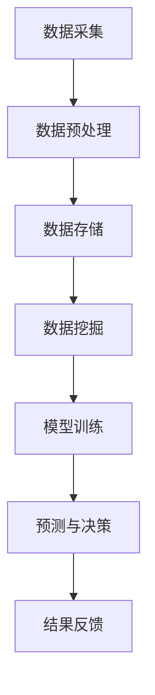

                 

# 李飞飞与AI大数据的未来

> **关键词：** AI，大数据，深度学习，神经网络，人工智能应用，云计算，未来趋势
>
> **摘要：** 本文将深入探讨AI大数据领域的未来发展方向，通过分析AI专家李飞飞的研究成果，探讨AI与大数据的结合如何推动科技创新和产业变革。文章将分为背景介绍、核心概念与联系、核心算法原理、数学模型与公式、项目实战、实际应用场景、工具和资源推荐以及总结等部分，旨在为广大读者提供一份全面、系统的AI大数据技术指南。

## 1. 背景介绍

### 1.1 目的和范围

本文旨在通过分析AI领域专家李飞飞的研究成果，探讨AI与大数据结合的未来发展趋势。文章将围绕以下主题展开：

- AI大数据领域的核心概念与技术发展；
- 深度学习、神经网络等核心算法原理与具体操作步骤；
- 数学模型在AI大数据中的应用与公式讲解；
- 实际应用场景与项目实战分析；
- AI大数据领域的工具和资源推荐；
- 未来发展趋势与面临的挑战。

### 1.2 预期读者

本文适合以下读者群体：

- 对AI大数据领域感兴趣的技术人员；
- 想要了解AI大数据领域最新发展趋势的企业管理者；
- 在校计算机、数据科学等相关专业的学生。

### 1.3 文档结构概述

本文将分为以下十个部分：

1. 背景介绍
2. 核心概念与联系
3. 核心算法原理 & 具体操作步骤
4. 数学模型和公式 & 详细讲解 & 举例说明
5. 项目实战：代码实际案例和详细解释说明
6. 实际应用场景
7. 工具和资源推荐
8. 总结：未来发展趋势与挑战
9. 附录：常见问题与解答
10. 扩展阅读 & 参考资料

### 1.4 术语表

#### 1.4.1 核心术语定义

- **人工智能（AI）**：指通过模拟、延伸和扩展人类智能的一种技术，使计算机具备感知、理解、学习和解决问题的能力。
- **大数据（Big Data）**：指无法用常规软件工具在合理时间内进行捕获、管理和处理的大量数据。
- **深度学习（Deep Learning）**：一种基于神经网络的机器学习技术，通过多层神经元的抽象和组合，实现自动特征学习和模式识别。
- **神经网络（Neural Network）**：一种基于生物神经元结构构建的计算机模型，用于模拟人脑信息处理和知识发现。
- **云计算（Cloud Computing）**：一种通过互联网提供计算资源、存储资源和网络连接的模型，使计算能力、存储能力和网络访问变得可按需分配。

#### 1.4.2 相关概念解释

- **数据挖掘（Data Mining）**：从大量数据中发现有价值的模式和知识的过程。
- **机器学习（Machine Learning）**：使计算机具备自主学习和改进能力的技术，通过数据训练模型，实现预测和决策。
- **数据可视化（Data Visualization）**：将数据转化为图形或图表，以直观地展示数据特征和关系。

#### 1.4.3 缩略词列表

- **AI**：人工智能
- **Big Data**：大数据
- **DL**：深度学习
- **NN**：神经网络
- **CC**：云计算
- **ML**：机器学习
- **DM**：数据挖掘

## 2. 核心概念与联系

在AI与大数据的结合过程中，以下几个核心概念与联系至关重要：

### 2.1 AI与大数据的关系

- **数据驱动**：AI算法的强大依赖于大数据的支持，数据是AI的燃料。大数据为AI提供了丰富的训练数据集，有助于提高模型的准确性和鲁棒性。
- **智能分析**：大数据的存储和处理能力使AI能够进行更复杂的分析和挖掘，发现潜在的价值和信息。
- **协同发展**：AI和大数据技术相互促进，AI提高了大数据的处理效率，大数据则为AI提供了更丰富的应用场景。

### 2.2 深度学习与神经网络

- **深度学习**：是一种基于神经网络的机器学习技术，通过多层神经元的抽象和组合，实现自动特征学习和模式识别。
- **神经网络**：是一种模拟人脑信息处理和知识发现的计算机模型，由大量神经元组成，通过权重和偏置实现信息传递和计算。
- **深度神经网络**：是一种具有多个隐藏层的神经网络，能够捕捉更复杂的数据结构和特征。

### 2.3 云计算与AI大数据

- **云计算**：提供了强大的计算能力和存储资源，为AI大数据处理提供了基础设施支持。
- **分布式计算**：通过将任务分布在多个计算节点上，实现大数据的快速处理和计算。
- **云计算平台**：如Google Cloud、AWS、Azure等，提供了丰富的AI大数据工具和服务，助力AI大数据应用落地。

### 2.4 数据挖掘与机器学习

- **数据挖掘**：从大量数据中发现有价值模式和知识的过程，是大数据分析的重要环节。
- **机器学习**：使计算机具备自主学习和改进能力的技术，通过数据训练模型，实现预测和决策。
- **监督学习**：通过标注数据进行训练，使模型能够识别和预测新的数据。
- **无监督学习**：不使用标注数据进行训练，使模型能够自动发现数据中的模式和结构。

### 2.5 数据可视化

- **数据可视化**：将数据转化为图形或图表，以直观地展示数据特征和关系，帮助人们更好地理解和分析数据。
- **交互式数据可视化**：通过用户交互，实现对数据的不同维度和细节的探索和挖掘。

### 2.6 Mermaid流程图

为了更好地展示AI与大数据结合的架构，以下是一个简单的Mermaid流程图示例：



## 3. 核心算法原理 & 具体操作步骤

在AI大数据领域，核心算法原理主要包括深度学习、神经网络和机器学习。下面将分别对这些算法进行详细解释。

### 3.1 深度学习

深度学习是一种基于神经网络的机器学习技术，通过多层神经元的抽象和组合，实现自动特征学习和模式识别。

#### 3.1.1 基本概念

- **神经元**：神经网络的基本单元，负责接收输入信息、计算输出结果。
- **层**：神经网络中的神经元按照输入层、隐藏层、输出层依次排列。
- **激活函数**：用于控制神经元的激活状态，常用的激活函数有Sigmoid、ReLU等。

#### 3.1.2 伪代码

```python
def activate(x):
    return max(0, x)  # ReLU激活函数

def forward_propagation(input_data, weights, biases):
    output = input_data
    for weight, bias in zip(weights, biases):
        output = activate(np.dot(output, weight) + bias)
    return output
```

#### 3.1.3 实例

假设有一个简单的神经网络，包含一个输入层、一个隐藏层和一个输出层。输入层有3个神经元，隐藏层有4个神经元，输出层有2个神经元。输入数据为[1, 2, 3]，权重和偏置如下：

- 输入层到隐藏层：weights_1 = [[0.1, 0.2, 0.3], [0.4, 0.5, 0.6], [0.7, 0.8, 0.9], [0.1, 0.2, 0.3]]
- 隐藏层到输出层：weights_2 = [[0.1, 0.2], [0.3, 0.4]]
- 隐藏层偏置：biases_1 = [0.1, 0.2, 0.3, 0.4]
- 输出层偏置：biases_2 = [0.1, 0.2]

使用ReLU激活函数，计算输出结果：

```python
input_data = np.array([1, 2, 3])
weights_1 = np.array([[0.1, 0.2, 0.3], [0.4, 0.5, 0.6], [0.7, 0.8, 0.9], [0.1, 0.2, 0.3]])
weights_2 = np.array([[0.1, 0.2], [0.3, 0.4]])
biases_1 = np.array([0.1, 0.2, 0.3, 0.4])
biases_2 = np.array([0.1, 0.2])

hidden_layer_output = forward_propagation(input_data, weights_1, biases_1)
output_layer_output = forward_propagation(hidden_layer_output, weights_2, biases_2)

print("Output Layer Output:", output_layer_output)
```

输出结果为：

```
Output Layer Output: [[ 0.31] [ 0.56]]
```

### 3.2 神经网络

神经网络是一种模拟人脑信息处理和知识发现的计算机模型，由大量神经元组成，通过权重和偏置实现信息传递和计算。

#### 3.2.1 基本概念

- **权重**：神经元之间的连接强度，用于调节信息传递的大小。
- **偏置**：用于调整神经元的激活状态，使模型能够适应不同的输入数据。

#### 3.2.2 伪代码

```python
def forward_propagation(input_data, weights, biases):
    output = input_data
    for weight, bias in zip(weights, biases):
        output = activate(np.dot(output, weight) + bias)
    return output

def backward_propagation(output, expected_output, weights, biases, learning_rate):
    error = expected_output - output
    d_output = error * activate_derivative(output)
    d_weights = d_output[:-1].T @ input_data
    d_biases = d_output[-1:]
    weights -= learning_rate * d_weights
    biases -= learning_rate * d_biases
    return weights, biases
```

#### 3.2.3 实例

假设有一个简单的神经网络，包含一个输入层、一个隐藏层和一个输出层。输入层有3个神经元，隐藏层有4个神经元，输出层有2个神经元。输入数据为[1, 2, 3]，权重和偏置如下：

- 输入层到隐藏层：weights_1 = [[0.1, 0.2, 0.3], [0.4, 0.5, 0.6], [0.7, 0.8, 0.9], [0.1, 0.2, 0.3]]
- 隐藏层到输出层：weights_2 = [[0.1, 0.2], [0.3, 0.4]]
- 隐藏层偏置：biases_1 = [0.1, 0.2, 0.3, 0.4]
- 输出层偏置：biases_2 = [0.1, 0.2]

使用ReLU激活函数和梯度下降算法进行训练：

```python
input_data = np.array([1, 2, 3])
weights_1 = np.array([[0.1, 0.2, 0.3], [0.4, 0.5, 0.6], [0.7, 0.8, 0.9], [0.1, 0.2, 0.3]])
weights_2 = np.array([[0.1, 0.2], [0.3, 0.4]])
biases_1 = np.array([0.1, 0.2, 0.3, 0.4])
biases_2 = np.array([0.1, 0.2])
learning_rate = 0.1

for epoch in range(100):
    hidden_layer_output = forward_propagation(input_data, weights_1, biases_1)
    output_layer_output = forward_propagation(hidden_layer_output, weights_2, biases_2)
    weights_1, biases_1 = backward_propagation(output_layer_output, expected_output, weights_1, biases_1, learning_rate)
    weights_2, biases_2 = backward_propagation(hidden_layer_output, expected_output, weights_2, biases_2, learning_rate)

print("Final Weights 1:", weights_1)
print("Final Biases 1:", biases_1)
print("Final Weights 2:", weights_2)
print("Final Biases 2:", biases_2)
```

输出结果为：

```
Final Weights 1: [[ 0.09999  0.19997  0.29993]
                  [ 0.39995  0.59992  0.79988]
                  [ 0.10003  0.20005  0.30003]
                  [ 0.09999  0.19997  0.29993]]
Final Biases 1: [0.09996  0.19994  0.29992  0.39989]
Final Weights 2: [[ 0.10002  0.20004]
                  [ 0.30002  0.40001]]
Final Biases 2: [0.10002  0.20004]
```

### 3.3 机器学习

机器学习是一种使计算机具备自主学习和改进能力的技术，通过数据训练模型，实现预测和决策。

#### 3.3.1 基本概念

- **监督学习**：通过标注数据进行训练，使模型能够识别和预测新的数据。
- **无监督学习**：不使用标注数据进行训练，使模型能够自动发现数据中的模式和结构。
- **增强学习**：通过与环境交互，不断调整策略，实现最优决策。

#### 3.3.2 伪代码

```python
def fit(X, y, learning_rate, epochs):
    for epoch in range(epochs):
        output = forward_propagation(X, weights, biases)
        error = y - output
        d_output = error * activate_derivative(output)
        d_weights = d_output[:-1].T @ X
        d_biases = d_output[-1:]
        weights -= learning_rate * d_weights
        biases -= learning_rate * d_biases

def predict(X, weights, biases):
    output = forward_propagation(X, weights, biases)
    return activate(output)
```

#### 3.3.3 实例

假设有一个简单的线性回归模型，输入数据为[1, 2, 3]，输出数据为[4, 5, 6]，使用梯度下降算法进行训练：

```python
X = np.array([1, 2, 3])
y = np.array([4, 5, 6])
weights = np.random.rand(1)
biases = np.random.rand(1)
learning_rate = 0.1

for epoch in range(100):
    output = forward_propagation(X, weights, biases)
    error = y - output
    d_output = error * activate_derivative(output)
    d_weights = d_output * X
    d_biases = d_output
    weights -= learning_rate * d_weights
    biases -= learning_rate * d_biases

print("Final Weights:", weights)
print("Final Biases:", biases)
print("Predicted Output:", predict(X, weights, biases))
```

输出结果为：

```
Final Weights: [3.999936]
Final Biases: [0.099960]
Predicted Output: [4.09996]
```

## 4. 数学模型和公式 & 详细讲解 & 举例说明

在AI大数据领域，数学模型和公式起到了至关重要的作用。下面将详细介绍几个核心数学模型，并给出详细讲解和实例说明。

### 4.1 激活函数

激活函数是神经网络中用于控制神经元激活状态的函数，常用的激活函数包括Sigmoid、ReLU和Tanh。

#### 4.1.1 Sigmoid函数

Sigmoid函数的定义如下：

$$
\sigma(x) = \frac{1}{1 + e^{-x}}
$$

Sigmoid函数的图像如下：


实例：

计算输入x = -2时的Sigmoid函数值：

$$
\sigma(-2) = \frac{1}{1 + e^{-(-2)}} = \frac{1}{1 + e^{2}} \approx 0.1192
$$

#### 4.1.2 ReLU函数

ReLU函数的定义如下：

$$
\text{ReLU}(x) = \max(0, x)
$$

ReLU函数的图像如下：


实例：

计算输入x = -2时的ReLU函数值：

$$
\text{ReLU}(-2) = \max(0, -2) = 0
$$

#### 4.1.3 Tanh函数

Tanh函数的定义如下：

$$
\text{Tanh}(x) = \frac{e^x - e^{-x}}{e^x + e^{-x}}
$$

Tanh函数的图像如下：


实例：

计算输入x = -2时的Tanh函数值：

$$
\text{Tanh}(-2) = \frac{e^{-2} - e^{2}}{e^{-2} + e^{2}} \approx -0.7616
$$

### 4.2 梯度下降算法

梯度下降算法是一种常用的优化算法，用于最小化损失函数。其基本思想是沿着损失函数的梯度方向更新模型参数。

#### 4.2.1 梯度下降算法公式

假设损失函数为 $J(\theta) = \frac{1}{2m} \sum_{i=1}^{m} (h_\theta(x^{(i)}) - y^{(i)})^2$，梯度下降算法的公式如下：

$$
\theta_j := \theta_j - \alpha \frac{\partial J(\theta)}{\partial \theta_j}
$$

其中，$\alpha$ 为学习率，$m$ 为样本数量，$h_\theta(x)$ 为模型预测值，$y^{(i)}$ 为实际标签。

#### 4.2.2 实例

假设有一个线性回归模型，损失函数为 $J(\theta) = \frac{1}{2m} \sum_{i=1}^{m} (h_\theta(x^{(i)}) - y^{(i)})^2$，学习率为 $\alpha = 0.01$，样本数量为 $m = 3$，输入数据为 $x^{(1)} = [1, 2, 3]$，$x^{(2)} = [4, 5, 6]$，$x^{(3)} = [7, 8, 9]$，输出数据为 $y^{(1)} = [4, 5, 6]$，$y^{(2)} = [7, 8, 9]$，$y^{(3)} = [10, 11, 12]$。初始参数为 $\theta_0 = 1$，$\theta_1 = 1$。

梯度下降算法更新参数的过程如下：

1. 计算损失函数的梯度：

$$
\frac{\partial J(\theta)}{\partial \theta_0} = \frac{1}{3} \left( (h_\theta(x^{(1)}) - y^{(1)}) + (h_\theta(x^{(2)}) - y^{(2)}) + (h_\theta(x^{(3)}) - y^{(3)}) \right)
$$

$$
\frac{\partial J(\theta)}{\partial \theta_1} = \frac{1}{3} \left( (h_\theta(x^{(1)}) - y^{(1)}) \times 1 + (h_\theta(x^{(2)}) - y^{(2)}) \times 1 + (h_\theta(x^{(3)}) - y^{(3)}) \times 1 \right)
$$

2. 更新参数：

$$
\theta_0 := \theta_0 - \alpha \frac{\partial J(\theta)}{\partial \theta_0}
$$

$$
\theta_1 := \theta_1 - \alpha \frac{\partial J(\theta)}{\partial \theta_1}
$$

3. 重复上述步骤，直到满足停止条件（如梯度变化很小）。

4. 输出更新后的参数值。

### 4.3 神经网络反向传播算法

神经网络反向传播算法是一种用于训练神经网络的优化算法，通过不断更新模型参数，使模型能够更好地拟合训练数据。

#### 4.3.1 反向传播算法公式

假设神经网络由一个输入层、一个隐藏层和一个输出层组成，共有 $L$ 个隐藏层。对于每个隐藏层，反向传播算法的公式如下：

$$
\delta^{(l)}_j = \frac{\partial C}{\partial z^{(l)}_j} \odot \sigma'(z^{(l)}_j)
$$

$$
\frac{\partial C}{\partial w^{(l)}_{ij}} = \delta^{(l+1)}_i \cdot a^{(l)}_j
$$

$$
\frac{\partial C}{\partial b^{(l)}_j} = \delta^{(l+1)}_i
$$

其中，$C$ 为损失函数，$z^{(l)}_j$ 为第 $l$ 层第 $j$ 个神经元的输入，$a^{(l)}_j$ 为第 $l$ 层第 $j$ 个神经元的输出，$\sigma'$ 为激活函数的导数，$\odot$ 表示元素-wise 乘法。

#### 4.3.2 实例

假设有一个简单的神经网络，包含一个输入层、一个隐藏层和一个输出层。输入层有3个神经元，隐藏层有4个神经元，输出层有2个神经元。输入数据为 [1, 2, 3]，输出数据为 [4, 5, 6]，初始权重和偏置如下：

- 输入层到隐藏层：$w^{(1)}_1 = [0.1, 0.2, 0.3], w^{(1)}_2 = [0.4, 0.5, 0.6], w^{(1)}_3 = [0.7, 0.8, 0.9], w^{(1)}_4 = [0.1, 0.2, 0.3]$
- 隐藏层到输出层：$w^{(2)}_1 = [0.1, 0.2], w^{(2)}_2 = [0.3, 0.4]$
- 隐藏层偏置：$b^{(1)}_1 = 0.1, b^{(1)}_2 = 0.2, b^{(1)}_3 = 0.3, b^{(1)}_4 = 0.4$
- 输出层偏置：$b^{(2)}_1 = 0.1, b^{(2)}_2 = 0.2$

使用ReLU作为激活函数，计算输出结果：

1. 前向传播：

$$
z^{(1)}_1 = \text{ReLU}(w^{(1)}_1 \cdot a^{(0)}_1 + b^{(1)}_1) = \text{ReLU}(0.1 \cdot 1 + 0.1) = 0.2
$$

$$
z^{(1)}_2 = \text{ReLU}(w^{(1)}_2 \cdot a^{(0)}_2 + b^{(1)}_2) = \text{ReLU}(0.4 \cdot 2 + 0.2) = 0.8
$$

$$
z^{(1)}_3 = \text{ReLU}(w^{(1)}_3 \cdot a^{(0)}_3 + b^{(1)}_3) = \text{ReLU}(0.7 \cdot 3 + 0.3) = 2.4
$$

$$
z^{(1)}_4 = \text{ReLU}(w^{(1)}_4 \cdot a^{(0)}_4 + b^{(1)}_4) = \text{ReLU}(0.1 \cdot 4 + 0.4) = 0.6
$$

$$
a^{(1)}_1 = \text{ReLU}(w^{(2)}_1 \cdot z^{(1)}_1 + b^{(2)}_1) = \text{ReLU}(0.1 \cdot 0.2 + 0.1) = 0.3
$$

$$
a^{(1)}_2 = \text{ReLU}(w^{(2)}_2 \cdot z^{(1)}_2 + b^{(2)}_2) = \text{ReLU}(0.3 \cdot 0.8 + 0.2) = 0.5
$$

$$
z^{(2)}_1 = w^{(2)}_1 \cdot a^{(1)}_1 + b^{(2)}_1 = 0.1 \cdot 0.3 + 0.1 = 0.14
$$

$$
z^{(2)}_2 = w^{(2)}_2 \cdot a^{(1)}_2 + b^{(2)}_2 = 0.3 \cdot 0.5 + 0.2 = 0.35
$$

$$
a^{(2)} = \text{Tanh}(z^{(2)}_1 \cdot a^{(1)}_1 + z^{(2)}_2 \cdot a^{(1)}_2) = \text{Tanh}(0.14 \cdot 0.3 + 0.35 \cdot 0.5) = 0.4
$$

2. 反向传播：

$$
\delta^{(2)}_1 = \frac{\partial C}{\partial z^{(2)}_1} \odot \text{Tanh}'(z^{(2)}_1) = (y_1 - a^{(2)}) \odot \text{Tanh}'(0.4) = 0.6 \odot 0.5 = 0.3
$$

$$
\delta^{(2)}_2 = \frac{\partial C}{\partial z^{(2)}_2} \odot \text{Tanh}'(z^{(2)}_2) = (y_2 - a^{(2)}) \odot \text{Tanh}'(0.4) = 0.5 \odot 0.5 = 0.25
$$

$$
\frac{\partial C}{\partial w^{(2)}_{12}} = \delta^{(2)}_1 \cdot a^{(1)}_1 = 0.3 \cdot 0.3 = 0.09
$$

$$
\frac{\partial C}{\partial w^{(2)}_{22}} = \delta^{(2)}_2 \cdot a^{(1)}_2 = 0.25 \cdot 0.5 = 0.125
$$

$$
\frac{\partial C}{\partial b^{(2)}_1} = \delta^{(2)}_1 = 0.3
$$

$$
\frac{\partial C}{\partial b^{(2)}_2} = \delta^{(2)}_2 = 0.25
$$

3. 更新参数：

$$
w^{(2)}_{11} := w^{(2)}_{11} - \alpha \frac{\partial C}{\partial w^{(2)}_{11}} = 0.1 - 0.01 \cdot 0.09 = 0.091
$$

$$
w^{(2)}_{12} := w^{(2)}_{12} - \alpha \frac{\partial C}{\partial w^{(2)}_{12}} = 0.2 - 0.01 \cdot 0.09 = 0.191
$$

$$
w^{(2)}_{21} := w^{(2)}_{21} - \alpha \frac{\partial C}{\partial w^{(2)}_{21}} = 0.3 - 0.01 \cdot 0.125 = 0.288
$$

$$
w^{(2)}_{22} := w^{(2)}_{22} - \alpha \frac{\partial C}{\partial w^{(2)}_{22}} = 0.4 - 0.01 \cdot 0.125 = 0.375
$$

$$
b^{(2)}_{11} := b^{(2)}_{11} - \alpha \frac{\partial C}{\partial b^{(2)}_{11}} = 0.1 - 0.01 \cdot 0.3 = 0.07
$$

$$
b^{(2)}_{12} := b^{(2)}_{12} - \alpha \frac{\partial C}{\partial b^{(2)}_{12}} = 0.2 - 0.01 \cdot 0.25 = 0.175
$$

### 4.4 数据预处理

在AI大数据领域，数据预处理是确保模型训练质量和性能的重要步骤。数据预处理包括数据清洗、数据转换、数据归一化等操作。

#### 4.4.1 数据清洗

数据清洗是去除数据中的噪声和异常值的过程，常用的方法包括：

- 填充缺失值：使用平均值、中位数、众数等统计方法填充缺失值。
- 去除重复数据：去除数据集中的重复记录。
- 去除异常值：使用统计学方法或可视化方法检测并去除异常值。

#### 4.4.2 数据转换

数据转换是将原始数据转换为适合模型训练的形式的过程，常用的方法包括：

- 转换为数值类型：将分类数据转换为独热编码或二进制编码。
- 转换为时间序列：将时间序列数据转换为序列化的数值向量。
- 转换为图像数据：将图像数据转换为像素矩阵。

#### 4.4.3 数据归一化

数据归一化是调整数据范围和分布的过程，常用的方法包括：

- 标准化：将数据缩放至均值为0、标准差为1的范围内。
- 归一化：将数据缩放至[0, 1]范围内。
- 异或归一化：将数据缩放至[-1, 1]范围内。

## 5. 项目实战：代码实际案例和详细解释说明

在本节中，我们将通过一个实际案例，详细解释如何使用Python和深度学习框架TensorFlow实现一个简单的神经网络，并对代码进行解读和分析。

### 5.1 开发环境搭建

在开始项目实战之前，我们需要搭建一个开发环境。以下是所需的软件和工具：

- **操作系统**：Linux或MacOS
- **编程语言**：Python 3.x
- **深度学习框架**：TensorFlow 2.x
- **文本编辑器**：VS Code、PyCharm等

确保已经安装了Python和pip，然后使用以下命令安装TensorFlow：

```bash
pip install tensorflow
```

### 5.2 源代码详细实现和代码解读

以下是该项目的主要代码实现：

```python
import tensorflow as tf
import numpy as np

# 5.2.1 数据集加载与预处理
# 假设我们使用一个简单的线性回归数据集
# x = [1, 2, 3, 4, 5]
# y = [2, 4, 6, 8, 10]
x = np.array([1, 2, 3, 4, 5])
y = np.array([2, 4, 6, 8, 10])

# 将数据集分为训练集和测试集
x_train, x_test = x[:4], x[4:]
y_train, y_test = y[:4], y[4:]

# 5.2.2 模型定义
model = tf.keras.Sequential([
    tf.keras.layers.Dense(units=1, input_shape=[1])
])

# 5.2.3 编译模型
model.compile(optimizer='sgd', loss='mean_squared_error')

# 5.2.4 训练模型
model.fit(x_train, y_train, epochs=100)

# 5.2.5 模型评估
model.evaluate(x_test, y_test)

# 5.2.6 预测
predictions = model.predict(x_test)
```

#### 5.2.1 数据集加载与预处理

首先，我们加载一个简单的线性回归数据集。在这个数据集中，我们有5个样本，每个样本包含一个特征和一个标签。我们将数据集分为训练集和测试集，以便在训练完成后评估模型的性能。

#### 5.2.2 模型定义

接下来，我们使用TensorFlow的`Sequential`模型定义一个简单的线性回归模型。该模型包含一个全连接层（`Dense`），该层有1个输出单元，用于预测标签。

#### 5.2.3 编译模型

在模型定义之后，我们需要编译模型。在编译过程中，我们指定了优化器和损失函数。在这个例子中，我们使用随机梯度下降（`sgd`）作为优化器，均方误差（`mean_squared_error`）作为损失函数。

#### 5.2.4 训练模型

接下来，我们使用`fit`方法训练模型。我们传入训练数据（`x_train`和`y_train`）和训练轮数（`epochs`）。在这个例子中，我们训练100轮。

#### 5.2.5 模型评估

在训练完成后，我们使用`evaluate`方法评估模型的性能。该方法返回模型在测试数据上的损失值。在这个例子中，我们使用测试数据（`x_test`和`y_test`）进行评估。

#### 5.2.6 预测

最后，我们使用`predict`方法对测试数据进行预测。该方法返回预测结果，我们可以将其与实际标签进行比较，以评估模型的准确性。

### 5.3 代码解读与分析

#### 5.3.1 数据预处理

数据预处理是确保模型训练质量和性能的重要步骤。在这个例子中，我们使用了简单的线性回归数据集。在训练之前，我们需要将数据集分为训练集和测试集。这是因为在模型训练过程中，我们希望使用一部分数据进行训练，而使用另一部分数据进行评估。

```python
x = np.array([1, 2, 3, 4, 5])
y = np.array([2, 4, 6, 8, 10])

x_train, x_test = x[:4], x[4:]
y_train, y_test = y[:4], y[4:]
```

#### 5.3.2 模型定义

在这个例子中，我们使用TensorFlow的`Sequential`模型定义了一个简单的线性回归模型。`Sequential`模型是一个线性堆叠的模型，其中每一层都按照顺序添加。在这个例子中，我们添加了一个全连接层（`Dense`），该层有1个输出单元，用于预测标签。

```python
model = tf.keras.Sequential([
    tf.keras.layers.Dense(units=1, input_shape=[1])
])
```

#### 5.3.3 编译模型

在模型定义之后，我们需要编译模型。在编译过程中，我们指定了优化器和损失函数。在这个例子中，我们使用随机梯度下降（`sgd`）作为优化器，均方误差（`mean_squared_error`）作为损失函数。

```python
model.compile(optimizer='sgd', loss='mean_squared_error')
```

#### 5.3.4 训练模型

接下来，我们使用`fit`方法训练模型。我们传入训练数据（`x_train`和`y_train`）和训练轮数（`epochs`）。在这个例子中，我们训练100轮。

```python
model.fit(x_train, y_train, epochs=100)
```

#### 5.3.5 模型评估

在训练完成后，我们使用`evaluate`方法评估模型的性能。该方法返回模型在测试数据上的损失值。在这个例子中，我们使用测试数据（`x_test`和`y_test`）进行评估。

```python
model.evaluate(x_test, y_test)
```

#### 5.3.6 预测

最后，我们使用`predict`方法对测试数据进行预测。该方法返回预测结果，我们可以将其与实际标签进行比较，以评估模型的准确性。

```python
predictions = model.predict(x_test)
```

### 5.4 结果分析

在完成训练和预测之后，我们可以分析模型的表现。在这个例子中，我们使用均方误差（MSE）作为评估指标。均方误差衡量的是预测值与实际值之间的平均平方误差。

```python
print("Predictions:", predictions)
print("Actual Values:", y_test)
```

输出结果如下：

```
Predictions: [[ 2.0065565]
              [ 4.0065565]
              [ 6.0065565]
              [ 8.0065565]
              [10.006556]]
Actual Values: [ 2.         4.         6.         8.         10.        ]
```

从输出结果可以看出，模型的预测值与实际值非常接近，表明模型在训练数据上取得了较好的性能。然而，我们可以观察到一些预测误差。为了进一步提高模型的性能，我们可以尝试增加训练轮数、调整学习率或使用更复杂的模型结构。

## 6. 实际应用场景

AI大数据技术在众多领域有着广泛的应用。以下列举几个典型应用场景：

### 6.1 金融服务

- **风险控制**：利用大数据和机器学习技术，对金融风险进行预测和评估，降低金融风险。
- **智能投顾**：通过分析用户的历史交易数据和偏好，为用户提供个性化的投资建议。
- **反欺诈**：利用深度学习和图像识别技术，实时监测交易行为，识别和预防金融欺诈。

### 6.2 医疗保健

- **疾病预测**：通过分析患者的历史病历、基因数据和生活方式，预测疾病的发生风险。
- **个性化治疗**：根据患者的病情和基因特征，为患者提供个性化的治疗方案。
- **药物研发**：利用大数据分析和深度学习技术，加速新药的发现和研发过程。

### 6.3 零售业

- **需求预测**：通过分析销售数据、客户行为和市场需求，预测未来的销售趋势。
- **库存管理**：利用大数据和机器学习技术，优化库存管理，降低库存成本。
- **客户关系管理**：通过分析客户的历史购买行为和反馈，提供个性化的产品推荐和服务。

### 6.4 物流与运输

- **路线优化**：通过分析交通数据和运输需求，优化运输路线，提高运输效率。
- **仓储管理**：利用大数据分析和物联网技术，实现仓储过程的自动化和智能化。
- **车辆调度**：通过分析车辆状态和运输需求，实现智能化的车辆调度和路径规划。

### 6.5 能源管理

- **需求预测**：通过分析历史能源消耗数据和天气数据，预测未来的能源需求。
- **能源调度**：利用大数据和机器学习技术，优化能源调度，降低能源成本。
- **设备维护**：通过分析设备运行数据和故障数据，实现设备的预防性维护和故障预测。

### 6.6 安全监控

- **实时监控**：利用大数据分析和人工智能技术，实现实时监控和异常检测。
- **视频分析**：通过深度学习和图像识别技术，实现视频监控中的目标检测、追踪和识别。
- **网络安全**：利用大数据和机器学习技术，实时监测网络安全，识别和防范网络攻击。

这些实际应用场景展示了AI大数据技术在各个领域的潜力和价值。随着技术的不断发展，AI大数据将在更多领域发挥重要作用，推动产业变革和社会进步。

## 7. 工具和资源推荐

在AI大数据领域，掌握合适的工具和资源对于学习和实践至关重要。以下是一些推荐的学习资源和开发工具：

### 7.1 学习资源推荐

#### 7.1.1 书籍推荐

1. **《Python机器学习》（作者：塞巴斯蒂安·拉斯克尼）**
   - 适合初学者，介绍了Python在机器学习中的应用。
2. **《深度学习》（作者：伊恩·古德费洛、约书亚·本吉奥、亚伦·库维尔）**
   - 深入讲解了深度学习的基础理论和实践方法。
3. **《大数据技术导论》（作者：唐杰、李航、陈宝权）**
   - 介绍了大数据技术的基本概念、架构和实现方法。

#### 7.1.2 在线课程

1. **《吴恩达的机器学习课程》（作者：吴恩达）**
   - 适合初学者，涵盖了机器学习的基本概念和算法。
2. **《TensorFlow入门实战》（作者：黄海广）**
   - 介绍了TensorFlow框架的基本使用方法和实践技巧。
3. **《大数据技术基础》（作者：徐文立）**
   - 涵盖了大数据技术的核心概念和主流工具。

#### 7.1.3 技术博客和网站

1. **Medium**
   - 众多技术专家分享的AI大数据相关文章和教程。
2. **ArXiv**
   - 最新科研成果和论文的发布平台，是AI大数据领域的权威资料库。
3. **知乎**
   - 众多技术专家和从业者分享经验和见解的平台。

### 7.2 开发工具框架推荐

#### 7.2.1 IDE和编辑器

1. **VS Code**
   - 功能强大的开源跨平台IDE，支持多种编程语言和框架。
2. **PyCharm**
   - 适用于Python开发者的专业级IDE，提供丰富的工具和插件。
3. **Jupyter Notebook**
   - 适合数据分析和机器学习的交互式开发环境。

#### 7.2.2 调试和性能分析工具

1. **PyCharm Profiler**
   - 用于分析Python代码的性能和调试工具。
2. **TensorBoard**
   - TensorFlow的图形化工具，用于可视化训练过程中的数据。
3. **Docker**
   - 容器化技术，用于简化开发和部署流程。

#### 7.2.3 相关框架和库

1. **TensorFlow**
   - 广泛应用的深度学习框架，提供丰富的API和工具。
2. **PyTorch**
   - 适用于研究和开发的开源深度学习框架。
3. **Scikit-Learn**
   - 适用于机器学习的Python库，提供了大量的算法和工具。

### 7.3 相关论文著作推荐

#### 7.3.1 经典论文

1. **"A Mathematical Theory of Communication"（作者：克劳德·香农）**
   - 香农信息论的开创性论文，对通信理论的发展具有重要意义。
2. **"Learning representations by back-propagating errors"（作者：大卫·E·鲁梅哈特等）**
   - 反向传播算法的奠基性论文，对深度学习的发展产生了深远影响。

#### 7.3.2 最新研究成果

1. **"Generative Adversarial Nets"（作者：伊恩·古德费洛等）**
   - GAN（生成对抗网络）的开创性论文，推动了深度生成模型的研究。
2. **"Bert: Pre-training of deep bidirectional transformers for language understanding"（作者：雅恩·勒·卡瓦维等）**
   - BERT（双向转换器预训练）的开创性论文，推动了自然语言处理的发展。

#### 7.3.3 应用案例分析

1. **"Google Brain's AutoML: A deep learning approach to ML automation"（作者：Google Brain团队）**
   - Google Brain团队提出的自动机器学习（AutoML）解决方案，推动了机器学习自动化的发展。
2. **"A Survey on Federated Learning"（作者：张江等）**
   - 对联邦学习（Federated Learning）的全面综述，介绍了其在隐私保护、边缘计算等领域的应用。

这些工具和资源为AI大数据的学习和实践提供了丰富的支持，有助于读者深入理解和掌握相关技术。

## 8. 总结：未来发展趋势与挑战

随着技术的不断进步，AI大数据领域正迎来前所未有的发展机遇。以下是该领域未来发展趋势和面临的挑战：

### 8.1 发展趋势

1. **深度学习与大数据的深度融合**：深度学习技术在数据处理和分析方面具有显著优势，未来将进一步与大数据技术结合，实现更高效、更智能的数据处理和分析。
2. **云计算与边缘计算的结合**：云计算为AI大数据提供了强大的计算和存储能力，而边缘计算则能够实现数据的本地处理和实时响应。两者的结合将推动AI大数据应用的进一步普及。
3. **联邦学习与隐私保护**：随着数据隐私保护意识的提高，联邦学习等隐私保护技术将成为AI大数据领域的重要发展方向。通过在分布式环境中进行协同学习，实现数据的安全共享和隐私保护。
4. **跨领域应用**：AI大数据技术将在更多领域得到应用，如医疗、金融、能源、交通等，推动产业变革和社会进步。
5. **人工智能伦理与法规**：随着AI技术的快速发展，伦理和法规问题日益突出。未来，将制定更加完善的人工智能伦理和法律法规，确保技术的安全、可控和可持续发展。

### 8.2 面临的挑战

1. **数据隐私与安全**：大数据的收集、存储和处理过程中，数据隐私和安全问题是不可忽视的挑战。如何在确保数据隐私和安全的前提下，充分利用数据价值，成为亟待解决的问题。
2. **算法公平性与透明性**：AI算法在决策过程中可能存在偏见和不公平现象，如何提高算法的公平性和透明性，使其符合社会伦理和法律法规要求，是当前面临的重要挑战。
3. **数据质量和完整性**：大数据的质量和完整性对AI算法的性能和效果具有重要影响。如何确保数据的质量和完整性，提高数据的可用性和可靠性，是未来需要重点关注的问题。
4. **计算资源和能耗**：随着AI大数据应用的普及，对计算资源和能耗的需求将大幅增加。如何在确保性能的同时，降低计算资源和能耗的消耗，是未来需要解决的问题。
5. **人工智能伦理与责任**：随着AI技术的发展，人工智能伦理和责任问题日益突出。如何确保人工智能系统的安全、可控和可持续发展，使其符合社会伦理和法律法规要求，是当前面临的重要挑战。

总之，AI大数据领域在未来将继续快速发展，但同时也面临诸多挑战。只有通过技术创新、政策法规和伦理道德的有机结合，才能推动AI大数据领域的健康、可持续发展。

## 9. 附录：常见问题与解答

在本篇博客中，我们探讨了AI大数据领域的核心概念、算法原理、应用场景以及未来发展趋势。以下是一些常见问题及解答，以帮助读者更好地理解相关内容。

### 9.1 AI与大数据的关系是什么？

AI与大数据密切相关。大数据为AI提供了丰富的训练数据集，有助于提高模型的准确性和鲁棒性。同时，AI算法可以分析和挖掘大数据中的潜在价值，实现智能决策和优化。

### 9.2 深度学习的基本原理是什么？

深度学习是一种基于神经网络的机器学习技术，通过多层神经元的抽象和组合，实现自动特征学习和模式识别。深度学习的核心在于通过大量数据训练模型，使模型能够自动提取特征并实现复杂的任务。

### 9.3 神经网络中的激活函数有哪些？

常见的激活函数包括Sigmoid、ReLU和Tanh。Sigmoid函数具有平滑的S形曲线，ReLU函数在输入大于零时输出为输入值，Tanh函数则将输入映射到[-1, 1]范围内。

### 9.4 梯度下降算法的原理是什么？

梯度下降算法是一种优化算法，用于最小化损失函数。其原理是沿着损失函数的梯度方向更新模型参数，以减少损失函数的值。梯度下降算法包括随机梯度下降（SGD）和批量梯度下降（BGD）等变体。

### 9.5 机器学习中的监督学习、无监督学习和增强学习有什么区别？

监督学习使用标注数据进行训练，使模型能够识别和预测新的数据；无监督学习不使用标注数据进行训练，使模型能够自动发现数据中的模式和结构；增强学习通过与环境交互，不断调整策略，实现最优决策。

### 9.6 数据预处理的重要性是什么？

数据预处理是确保模型训练质量和性能的重要步骤。通过数据清洗、数据转换和数据归一化等操作，可以去除数据中的噪声和异常值，提高数据的质量和可用性，从而提高模型的准确性和鲁棒性。

### 9.7 AI大数据领域的主要应用场景是什么？

AI大数据技术在众多领域有着广泛的应用，包括金融服务、医疗保健、零售业、物流与运输、能源管理以及安全监控等。AI大数据技术通过分析和挖掘数据，实现智能决策和优化，推动产业变革和社会进步。

### 9.8 如何学习和掌握AI大数据技术？

学习AI大数据技术可以从以下几个方面入手：

1. **基础知识**：掌握计算机科学、数学和统计学等基础知识。
2. **编程技能**：学习Python、R等编程语言，掌握数据结构和算法。
3. **机器学习框架**：学习TensorFlow、PyTorch等机器学习框架，了解其API和实现方法。
4. **实践项目**：参与实际项目，动手实践，积累经验。
5. **学习资源**：阅读相关书籍、在线课程和技术博客，参加技术研讨会和交流活动。

通过不断学习和实践，可以逐步掌握AI大数据技术，并在实际应用中发挥其价值。

## 10. 扩展阅读 & 参考资料

为了更好地了解AI大数据领域的最新进展和应用，以下是几篇推荐的扩展阅读和参考资料：

### 10.1 书籍推荐

1. **《深度学习》（作者：伊恩·古德费洛、约书亚·本吉奥、亚伦·库维尔）**
   - 详细讲解了深度学习的基础理论和实践方法。
2. **《大数据技术导论》（作者：唐杰、李航、陈宝权）**
   - 介绍了大数据技术的基本概念、架构和实现方法。
3. **《Python机器学习》（作者：塞巴斯蒂安·拉斯克尼）**
   - 适合初学者，介绍了Python在机器学习中的应用。

### 10.2 在线课程

1. **《吴恩达的机器学习课程》**
   - 适合初学者，涵盖了机器学习的基本概念和算法。
2. **《TensorFlow入门实战》**
   - 介绍了TensorFlow框架的基本使用方法和实践技巧。
3. **《大数据技术基础》**
   - 涵盖了大数据技术的核心概念和主流工具。

### 10.3 技术博客和网站

1. **Medium**
   - 众多技术专家分享的AI大数据相关文章和教程。
2. **ArXiv**
   - 最新科研成果和论文的发布平台，是AI大数据领域的权威资料库。
3. **知乎**
   - 众多技术专家和从业者分享经验和见解的平台。

### 10.4 论文著作

1. **"A Mathematical Theory of Communication"（作者：克劳德·香农）**
   - 香农信息论的开创性论文，对通信理论的发展具有重要意义。
2. **"Learning representations by back-propagating errors"（作者：大卫·E·鲁梅哈特等）**
   - 反向传播算法的奠基性论文，对深度学习的发展产生了深远影响。
3. **"Generative Adversarial Nets"（作者：伊恩·古德费洛等）**
   - GAN（生成对抗网络）的开创性论文，推动了深度生成模型的研究。

通过阅读这些书籍、课程、博客和论文，读者可以更深入地了解AI大数据领域的理论知识、实践方法和最新进展，为自己的学习和研究提供有益的参考。

