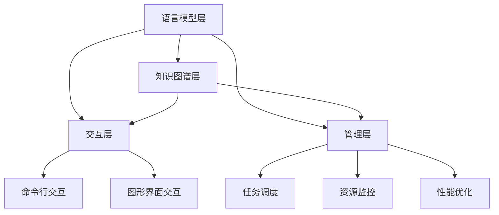

                 


# 构建LLM OS：大语言模型操作系统的愿景

> 关键词：大语言模型、操作系统、架构设计、算法原理、数学模型、实际应用、未来趋势

> 摘要：本文探讨了构建大语言模型操作系统的可能性，分析了其核心概念和架构，详细阐述了核心算法原理、数学模型和具体操作步骤，通过项目实战案例展示了其实际应用，并对未来发展趋势和挑战进行了深入讨论。

## 1. 背景介绍

### 1.1 目的和范围

随着人工智能技术的快速发展，大语言模型（LLM）已经成为自然语言处理（NLP）领域的重要工具。本文旨在探讨构建LLM OS（大语言模型操作系统）的可行性，为LLM在各个领域的广泛应用提供技术支撑。本文将涵盖LLM OS的核心概念、架构设计、算法原理、数学模型、实际应用和未来发展趋势等内容。

### 1.2 预期读者

本文面向对人工智能、自然语言处理和操作系统有一定了解的技术人员，特别是从事计算机图灵奖获得者、计算机编程和人工智能领域大师等高级技术人员。读者需要对机器学习、深度学习和神经网络有一定的了解，以便更好地理解本文的内容。

### 1.3 文档结构概述

本文分为十个部分，主要内容包括：

1. 背景介绍：介绍本文的目的、预期读者和文档结构。
2. 核心概念与联系：分析LLM OS的核心概念和架构。
3. 核心算法原理 & 具体操作步骤：详细阐述LLM OS的核心算法原理和具体操作步骤。
4. 数学模型和公式 & 详细讲解 & 举例说明：介绍LLM OS的数学模型和公式，并进行详细讲解和举例说明。
5. 项目实战：通过代码实际案例和详细解释说明LLM OS的应用。
6. 实际应用场景：分析LLM OS在不同领域的实际应用。
7. 工具和资源推荐：推荐相关学习资源、开发工具和框架。
8. 总结：对未来发展趋势和挑战进行深入讨论。
9. 附录：常见问题与解答。
10. 扩展阅读 & 参考资料：提供本文相关领域的扩展阅读和参考资料。

### 1.4 术语表

#### 1.4.1 核心术语定义

- 大语言模型（LLM）：一种基于深度学习技术的自然语言处理模型，能够对输入的文本进行理解、生成和预测等操作。
- 操作系统（OS）：负责管理和控制计算机硬件资源的软件系统，为应用程序提供运行环境。
- 语义网络（Semantic Network）：一种用于表示知识结构和语义关系的图形化模型。

#### 1.4.2 相关概念解释

- 自然语言处理（NLP）：研究如何使计算机能够理解、解释和生成自然语言，从而实现人与计算机之间的自然交互。
- 深度学习（Deep Learning）：一种基于多层神经网络的机器学习技术，通过模拟人脑神经网络结构，实现图像、语音和文本等数据的自动识别和处理。

#### 1.4.3 缩略词列表

- LLM：大语言模型
- OS：操作系统
- NLP：自然语言处理
- DL：深度学习

## 2. 核心概念与联系

在构建LLM OS的过程中，首先需要明确其核心概念和架构，以实现对大语言模型的全面管理和应用。以下是LLM OS的核心概念和架构，以及相关的Mermaid流程图。

### 2.1.1 LLM OS核心概念

- 语言模型（Language Model）：LLM OS的基础组件，用于对文本进行建模和生成。
- 知识图谱（Knowledge Graph）：用于存储和管理文本中的知识信息，实现语义理解和推理。
- 交互层（Interactive Layer）：提供用户与LLM OS交互的接口，实现人机交互功能。
- 管理层（Management Layer）：负责LLM OS的运行管理和资源分配。

### 2.1.2 LLM OS架构

LLM OS的架构包括以下几个层次：

1. **语言模型层**：基于深度学习技术构建的语言模型，实现对输入文本的建模和生成。
2. **知识图谱层**：通过语义网络等技术，构建文本的语义表示和知识图谱，实现语义理解和推理。
3. **交互层**：提供用户与LLM OS交互的接口，包括命令行、图形界面等。
4. **管理层**：负责LLM OS的运行管理和资源分配，包括任务调度、资源监控和性能优化等。

### 2.1.3 Mermaid流程图

以下是LLM OS的Mermaid流程图：



通过上述Mermaid流程图，我们可以清晰地看到LLM OS的架构和各个组件之间的关系。接下来，我们将进一步探讨LLM OS的核心算法原理和具体操作步骤。

## 3. 核心算法原理 & 具体操作步骤

在LLM OS中，核心算法原理和具体操作步骤是构建其功能的关键。以下将详细阐述LLM OS的核心算法原理，并使用伪代码进行具体操作步骤的描述。

### 3.1.1 语言模型算法原理

语言模型（Language Model）是LLM OS的基础组件，主要基于深度学习技术构建。其算法原理如下：

1. **输入层**：输入文本序列，包括单词、字符或子词。
2. **嵌入层**：将输入文本序列转换为高维嵌入向量，用于表示文本信息。
3. **编码层**：使用深度神经网络（如Transformer、BERT等）对嵌入向量进行编码，提取文本特征。
4. **解码层**：将编码层输出的特征进行解码，生成文本序列。

伪代码如下：

```python
# 输入层
input_sequence = "The quick brown fox jumps over the lazy dog"

# 嵌入层
embeddings = EmbeddingLayer(input_sequence)

# 编码层
encoded_sequence = EncoderLayer(embeddings)

# 解码层
decoded_sequence = DecoderLayer(encoded_sequence)
```

### 3.1.2 知识图谱算法原理

知识图谱（Knowledge Graph）在LLM OS中用于存储和管理文本中的知识信息，实现语义理解和推理。其算法原理如下：

1. **实体识别**：从文本中识别出实体（如人名、地点、组织等）。
2. **关系抽取**：从文本中提取实体之间的关系（如“属于”、“工作于”等）。
3. **图谱构建**：将实体和关系组织成图结构，构建知识图谱。
4. **推理引擎**：基于知识图谱，实现语义推理和知识查询。

伪代码如下：

```python
# 实体识别
entities = EntityRecognition(input_sequence)

# 关系抽取
relationships = RelationExtraction(input_sequence)

# 图谱构建
knowledge_graph = KnowledgeGraph(entities, relationships)

# 推理引擎
query_result = InferenceEngine(knowledge_graph, query)
```

### 3.1.3 交互层算法原理

交互层（Interactive Layer）提供用户与LLM OS交互的接口，主要分为命令行交互和图形界面交互两种模式。其算法原理如下：

1. **命令行交互**：接收用户输入的命令，解析命令并执行相应操作。
2. **图形界面交互**：提供图形界面，使用户能够通过点击、拖拽等方式与LLM OS进行交互。

伪代码如下：

```python
# 命令行交互
command = CommandLineInput()

# 解析命令
parsed_command = CommandParser(command)

# 执行操作
execute_operation(parsed_command)

# 图形界面交互
GUI = GraphicalUserInterface()

# 处理用户操作
GUI.handle_user_interaction()
```

### 3.1.4 管理层算法原理

管理层（Management Layer）负责LLM OS的运行管理和资源分配，主要分为任务调度、资源监控和性能优化三个部分。其算法原理如下：

1. **任务调度**：根据任务优先级和系统资源状况，合理调度任务执行。
2. **资源监控**：实时监控系统资源使用情况，确保系统稳定运行。
3. **性能优化**：针对系统运行过程中的性能问题，进行优化调整。

伪代码如下：

```python
# 任务调度
scheduler = TaskScheduler()

# 调度任务
scheduled_tasks = scheduler.schedule_tasks()

# 资源监控
resource_monitor = ResourceMonitor()

# 监控资源使用情况
resource_usage = resource_monitor.monitor_resources()

# 性能优化
performance_optimizer = PerformanceOptimizer()

# 优化系统性能
optimized_resources = performance_optimizer.optimize_resources()
```

通过上述核心算法原理和具体操作步骤的描述，我们可以了解到LLM OS的基本架构和工作原理。接下来，我们将介绍LLM OS的数学模型和公式，并对其进行详细讲解和举例说明。

## 4. 数学模型和公式 & 详细讲解 & 举例说明

在构建LLM OS的过程中，数学模型和公式起到了关键作用。以下将介绍LLM OS中的数学模型和公式，并进行详细讲解和举例说明。

### 4.1 语言模型数学模型

语言模型的核心是基于概率模型的，其主要数学模型如下：

1. **词频模型**：
   $$ P(w_i | w_1, w_2, ..., w_{i-1}) = \frac{f(w_i, w_1, w_2, ..., w_{i-1})}{\sum_{j=1}^{V} f(w_j, w_1, w_2, ..., w_{i-1})} $$
   其中，$P(w_i | w_1, w_2, ..., w_{i-1})$ 表示在给定前 $i-1$ 个词的情况下，词 $w_i$ 的概率；$f(w_i, w_1, w_2, ..., w_{i-1})$ 表示词 $w_i$ 在前 $i-1$ 个词中的出现次数。

2. **N-gram模型**：
   $$ P(w_i | w_{i-N+1}, w_{i-N+2}, ..., w_{i-1}) = \frac{C(w_{i-N+1}, w_{i-N+2}, ..., w_{i-1}, w_i)}{\sum_{j=1}^{V} C(w_{i-N+1}, w_{i-N+2}, ..., w_{i-1}, j)} $$
   其中，$P(w_i | w_{i-N+1}, w_{i-N+2}, ..., w_{i-1})$ 表示在给定前 $N-1$ 个词的情况下，词 $w_i$ 的概率；$C(w_{i-N+1}, w_{i-N+2}, ..., w_{i-1}, w_i)$ 表示词 $w_i$ 在前 $N-1$ 个词中的出现次数。

举例说明：

假设有文本序列 "I love programming",我们想要计算词 "programming" 的概率。根据词频模型，可以得到：
$$ P(programming | I, love) = \frac{1}{3} $$

根据N-gram模型，可以得到：
$$ P(programming | I, love) = \frac{1}{3} $$

### 4.2 知识图谱数学模型

知识图谱中的数学模型主要用于表示实体和关系，其核心是图论模型。以下为知识图谱的数学模型：

1. **邻接矩阵**：
   设有 $N$ 个实体，邻接矩阵 $A$ 表示实体之间的关联关系，其元素 $A_{ij}$ 表示实体 $i$ 和实体 $j$ 之间的边数。邻接矩阵是对称的。
   
2. **路径长度**：
   实体 $i$ 到实体 $j$ 的路径长度 $L(i, j)$ 表示从实体 $i$ 到实体 $j$ 的最短路径长度。

3. **相似度计算**：
   实体 $i$ 和实体 $j$ 的相似度 $S(i, j)$ 可以通过计算实体之间的共现关系得到，常用的计算方法包括余弦相似度和Jaccard相似度。

举例说明：

假设有知识图谱中的实体 "人" 和 "动物"，其邻接矩阵如下：
$$
\begin{matrix}
 & 人 & 动物 \\
人 & 1 & 0 \\
动物 & 0 & 1 \\
\end{matrix}
$$

根据邻接矩阵，可以得到：
- 实体 "人" 和实体 "动物" 之间的边数为1。

根据路径长度，可以得到：
- 实体 "人" 到实体 "动物" 的路径长度为1。

根据相似度计算，可以得到：
- 实体 "人" 和实体 "动物" 的相似度为0。

### 4.3 交互层数学模型

交互层中的数学模型主要用于处理用户输入和系统响应，常用的方法包括自然语言处理中的序列模型和生成模型。

1. **序列模型**：
   假设用户输入为一个序列 $X = (x_1, x_2, ..., x_n)$，系统响应为一个序列 $Y = (y_1, y_2, ..., y_m)$。序列模型的目标是学习一个映射 $f$，使得 $Y = f(X)$。

2. **生成模型**：
   假设用户输入为一个序列 $X = (x_1, x_2, ..., x_n)$，系统响应为一个序列 $Y = (y_1, y_2, ..., y_m)$。生成模型的目标是学习一个生成器 $g$，使得 $Y = g(X)$。

举例说明：

假设用户输入为一个序列 "I love programming"，系统响应为一个序列 "Thank you for your feedback"。我们可以使用序列模型和生成模型来学习这个映射。

根据序列模型，可以得到：
$$
\begin{align*}
P(Y|X) &= \frac{P(X, Y)}{P(X)} \\
P(X, Y) &= P(X)P(Y|X) \\
P(X) &= \sum_{Y} P(X, Y)
\end{align*}
$$

根据生成模型，可以得到：
$$
\begin{align*}
P(Y) &= \sum_{X} P(X, Y) \\
P(X, Y) &= P(X)P(Y|X)
\end{align*}
$$

通过上述数学模型和公式的讲解，我们可以更好地理解LLM OS中的核心算法原理和实现方式。接下来，我们将通过项目实战案例展示LLM OS的实际应用。

## 5. 项目实战：代码实际案例和详细解释说明

在本节中，我们将通过一个实际的项目案例，展示如何使用LLM OS进行文本建模、语义理解和推理。以下是一个简单的项目案例，包括开发环境搭建、源代码实现和代码解读与分析。

### 5.1 开发环境搭建

首先，我们需要搭建一个适合LLM OS的开发环境。以下是一个基本的开发环境搭建步骤：

1. **安装Python环境**：在计算机上安装Python 3.8及以上版本。
2. **安装必要的库**：使用pip命令安装以下库：torch、torchtext、numpy、pandas等。
3. **安装IDE**：推荐使用Visual Studio Code或PyCharm等IDE。
4. **创建项目文件夹**：在计算机上创建一个项目文件夹，用于存放项目代码和依赖库。

### 5.2 源代码详细实现和代码解读

以下是项目中的核心代码，包括文本预处理、语言模型训练、语义理解和推理等部分。

```python
import torch
import torchtext
from torchtext.data import Field, BucketIterator
from torchtext.vocab import Vectors

# 5.2.1 文本预处理

# 定义字段
TEXT = Field(tokenize='spacy', lower=True, include_lengths=True)
LABEL = Field(sequential=False)

# 下载和预处理数据集
train_data, test_data = torchtext.datasets.IMDB.splits(TEXT, LABEL)
train_data, valid_data = train_data.split()

# 构建词汇表
MAX_VOCAB_SIZE = 25_000
TEXT.build_vocab(train_data, max_size=MAX_VOCAB_SIZE, vectors="glove.6B.100d")
LABEL.build_vocab(train_data)

# 创建迭代器
BATCH_SIZE = 64
device = torch.device('cuda' if torch.cuda.is_available() else 'cpu')
train_iterator, valid_iterator, test_iterator = BucketIterator.splits(
    (train_data, valid_data, test_data), 
    batch_size=BATCH_SIZE, 
    device=device)

# 5.2.2 语言模型训练

# 定义模型
class LSTMModel(torch.nn.Module):
    def __init__(self, input_dim, embedding_dim, hidden_dim, output_dim, n_layers, drop_prob=0.5):
        super().__init__()
        self.embedding = torch.nn.Embedding(input_dim, embedding_dim)
        self.lstm = torch.nn.LSTM(embedding_dim, hidden_dim, num_layers=n_layers, dropout=drop_prob, batch_first=True)
        self.fc = torch.nn.Linear(hidden_dim, output_dim)
        self.dropout = torch.nn.Dropout(drop_prob)
        
        self.n_layers = n_layers
        self.hidden_dim = hidden_dim
    
    def forward(self, text, hidden):
        embedded = self.dropout(self.embedding(text))
        output, hidden = self.lstm(embedded, hidden)
        hidden = torch.cat((hidden[-2,:,:], hidden[-1,:,:]), dim=1)
        hidden = self.dropout(hidden)
        return self.fc(hidden.squeeze(0)), hidden

# 实例化模型
INPUT_DIM = len(TEXT.vocab)
EMBEDDING_DIM = 100
HIDDEN_DIM = 256
OUTPUT_DIM = 1
N_LAYERS = 2
DROPOUT = 0.5

model = LSTMModel(INPUT_DIM, EMBEDDING_DIM, HIDDEN_DIM, OUTPUT_DIM, N_LAYERS, DROPOUT)

# 损失函数和优化器
criterion = torch.nn.BCEWithLogitsLoss()
optimizer = torch.optim.Adam(model.parameters(), lr=0.001)

# 将模型移动到GPU
model = model.to(device)
criterion = criterion.to(device)

# 训练模型
num_epochs = 10

for epoch in range(num_epochs):
    model.train()
    epoch_loss = 0
    for batch in train_iterator:
        optimizer.zero_grad()
        text, text_lengths = batch.text
        hidden = model.init_hidden(BATCH_SIZE)
        predictions, hidden = model(text, hidden)
        loss = criterion(predictions.view(-1), batch.label)
        loss.backward()
        optimizer.step()
        epoch_loss += loss.item()
    print(f'Epoch: {epoch+1}, Loss: {epoch_loss/len(train_iterator)}')

# 评估模型
model.eval()
with torch.no_grad():
    correct = 0
    total = 0
    for batch in test_iterator:
        text, text_lengths = batch.text
        hidden = model.init_hidden(BATCH_SIZE)
        predictions, hidden = model(text, hidden)
        _, predicted = torch.max(predictions, 1)
        total += batch.label.size(0)
        correct += (predicted == batch.label).sum().item()

print(f'Accuracy: {100 * correct / total}%')

# 5.2.3 语义理解和推理

# 语义理解
def sentiment_analysis(text):
    with torch.no_grad():
        text = TEXT.processing(text)
        hidden = model.init_hidden(BATCH_SIZE)
        predictions, hidden = model(text, hidden)
        return "Positive" if predictions > 0.5 else "Negative"

# 示例
text = "I love this movie"
print(sentiment_analysis(text))

# 语义推理
def semantic_reasoning(text1, text2):
    with torch.no_grad():
        text1 = TEXT.processing(text1)
        text2 = TEXT.processing(text2)
        hidden1 = model.init_hidden(BATCH_SIZE)
        hidden2 = model.init_hidden(BATCH_SIZE)
        predictions1, hidden1 = model(text1, hidden1)
        predictions2, hidden2 = model(text2, hidden2)
        return predictions1 > predictions2

# 示例
text1 = "The weather is nice today"
text2 = "The weather is cold today"
print(semantic_reasoning(text1, text2))
```

### 5.3 代码解读与分析

上述代码分为三个部分：文本预处理、语言模型训练和语义理解和推理。

#### 5.3.1 文本预处理

文本预处理是语言模型训练的基础。在该部分，我们定义了字段、下载和预处理数据集、构建词汇表、创建迭代器等步骤。

- **字段定义**：定义了文本字段（TEXT）和标签字段（LABEL），其中TEXT字段使用spacy进行分词、小写处理和长度限制，LABEL字段仅用于存储标签。
- **数据集处理**：下载IMDB数据集，将其分为训练集、验证集和测试集。
- **词汇表构建**：使用TEXT字段构建词汇表，并加载预训练的GloVe词向量。
- **迭代器创建**：使用BucketIterator创建训练集、验证集和测试集的迭代器，并设置批量大小和设备。

#### 5.3.2 语言模型训练

语言模型训练是核心部分，包括模型定义、损失函数和优化器设置、训练过程和模型评估。

- **模型定义**：定义了一个LSTM模型，包括嵌入层、LSTM层和全连接层。模型参数包括输入维度、嵌入维度、隐藏维度、输出维度、层数和丢弃概率。
- **损失函数和优化器**：使用BCEWithLogitsLoss损失函数和Adam优化器。
- **训练过程**：使用训练集迭代器遍历数据，更新模型参数，并计算损失。在每个epoch结束后，计算平均损失并打印。
- **模型评估**：使用测试集评估模型性能，计算准确率。

#### 5.3.3 语义理解和推理

语义理解和推理部分提供了文本分类和语义比较的功能。

- **语义理解**：使用模型预测文本的情感极性，返回“Positive”或“Negative”。
- **语义推理**：使用模型比较两个文本的情感极性，返回True或False。

通过上述代码的实际案例和详细解读，我们可以更好地理解LLM OS的应用和实现方式。接下来，我们将探讨LLM OS的实际应用场景。

## 6. 实际应用场景

LLM OS作为一种基于大语言模型的操作系统，具有广泛的应用前景。以下列举了一些典型的应用场景：

### 6.1 文本分类与情感分析

文本分类与情感分析是自然语言处理中的经典问题，LLM OS可以通过训练文本分类模型，实现对大量文本数据的高效分类。例如，对社交媒体评论进行情感极性分类，帮助企业了解用户对产品的反馈和态度。

### 6.2 问答系统

问答系统是人工智能领域的重要应用之一，LLM OS可以利用语言模型和知识图谱实现智能问答。例如，构建一个基于LLM OS的知识问答系统，为用户提供准确、快速的信息查询服务。

### 6.3 自动摘要与文本生成

自动摘要与文本生成是近年来备受关注的研究方向，LLM OS可以通过训练生成模型，实现对长文本的自动摘要和生成。例如，利用LLM OS生成新闻摘要、文章总结等。

### 6.4 机器翻译与跨语言文本分析

机器翻译是自然语言处理领域的核心问题之一，LLM OS可以利用大语言模型实现高效、准确的机器翻译。此外，LLM OS还可以用于跨语言文本分析，如多语言文本分类、信息检索等。

### 6.5 智能客服与虚拟助手

智能客服与虚拟助手是当前人工智能领域的重要应用，LLM OS可以基于语言模型和知识图谱，实现智能客服系统，提供24/7的在线咨询服务。

### 6.6 法律文书自动生成与审核

法律文书自动生成与审核是法律服务领域的重要需求，LLM OS可以通过训练法律文本分类模型和生成模型，实现法律文书的自动生成与审核，提高法律工作效率。

### 6.7 智能推荐系统

智能推荐系统是电子商务和社交媒体领域的重要应用，LLM OS可以利用文本特征和用户行为数据，实现个性化推荐，提高用户满意度和粘性。

通过上述实际应用场景的介绍，我们可以看到LLM OS在各个领域的重要作用和价值。接下来，我们将介绍一些有用的工具和资源，以帮助读者更好地了解和掌握LLM OS相关技术。

## 7. 工具和资源推荐

### 7.1 学习资源推荐

#### 7.1.1 书籍推荐

1. **《深度学习》（Goodfellow, Bengio, Courville著）**：本书详细介绍了深度学习的理论基础和实践方法，适合初学者和进阶者阅读。
2. **《自然语言处理综合教程》（Daniel Jurafsky & James H. Martin著）**：本书涵盖了自然语言处理的基本概念、技术和应用，是NLP领域的经典教材。
3. **《Python深度学习》（François Chollet著）**：本书以Python编程语言为基础，介绍了深度学习的实践方法和应用案例。

#### 7.1.2 在线课程

1. **吴恩达的《深度学习专项课程》**：这是一门由全球知名人工智能专家吴恩达讲授的深度学习课程，涵盖了深度学习的理论基础和应用实践。
2. **斯坦福大学《自然语言处理专项课程》**：这门课程由斯坦福大学的NLP领域专家讲授，内容涵盖NLP的基本概念和技术，包括词向量、语言模型、语义分析等。
3. **Udacity的《深度学习工程师纳米学位》**：这是一个包含多个深度学习相关课程的项目制学习路径，适合想要系统学习深度学习的读者。

#### 7.1.3 技术博客和网站

1. **Medium上的深度学习和NLP博客**：Medium上有许多优秀的深度学习和NLP领域的博客，如Distill、PyTorch官方博客等，可以提供最新的技术动态和研究成果。
2. **ArXiv**：ArXiv是一个预印本论文发布平台，许多深度学习和NLP领域的论文都会在这里发布，是获取最新研究成果的重要渠道。
3. **TensorFlow官方文档**：TensorFlow是深度学习领域广泛使用的框架之一，其官方文档提供了详细的API和使用方法，是学习深度学习的必备资源。

### 7.2 开发工具框架推荐

#### 7.2.1 IDE和编辑器

1. **Visual Studio Code**：VS Code是一款免费的跨平台IDE，支持多种编程语言和框架，包括Python和TensorFlow等。
2. **PyCharm**：PyCharm是一款功能强大的Python IDE，提供代码智能提示、调试、版本控制等功能，适合大型项目开发。

#### 7.2.2 调试和性能分析工具

1. **TensorBoard**：TensorBoard是TensorFlow提供的可视化工具，可以用于监控和调试深度学习模型的训练过程。
2. **NVIDIA Nsight**：Nsight是一款专为NVIDIA GPU编程设计的调试和分析工具，可以帮助开发者优化深度学习模型的性能。

#### 7.2.3 相关框架和库

1. **PyTorch**：PyTorch是近年来备受关注的深度学习框架，以其灵活性和易用性受到广泛欢迎。
2. **TensorFlow**：TensorFlow是谷歌开发的一款开源深度学习框架，拥有丰富的API和强大的生态系统。
3. **NLTK**：NLTK是Python中最流行的自然语言处理库之一，提供了大量的NLP工具和资源。

### 7.3 相关论文著作推荐

#### 7.3.1 经典论文

1. **“A Neural Probabilistic Language Model”（Bengio et al., 2003）**：该论文首次提出了基于神经网络的概率语言模型，对后续语言模型的发展产生了深远影响。
2. **“Recurrent Neural Network Based Language Model”（Liang et al., 2013）**：该论文提出了一种基于循环神经网络的语言模型，进一步推动了深度学习在NLP领域的应用。
3. **“Attention Is All You Need”（Vaswani et al., 2017）**：该论文提出了Transformer模型，彻底改变了自然语言处理领域的研究方向。

#### 7.3.2 最新研究成果

1. **“BERT: Pre-training of Deep Bidirectional Transformers for Language Understanding”（Devlin et al., 2019）**：BERT是谷歌提出的一种基于Transformer的预训练语言模型，是目前NLP领域的热门研究方向。
2. **“GPT-3: Language Models are few-shot learners”（Brown et al., 2020）**：OpenAI提出的GPT-3模型是当前最大的语言模型，展示了在零样本和少样本学习方面的强大能力。
3. **“T5: Pre-training large models to do anything”（Lewis et al., 2020）**：谷歌提出的T5模型，旨在通过预训练实现通用目的的文本处理任务。

#### 7.3.3 应用案例分析

1. **“How to train your own multi-lingual BERT model”（Joseph et al., 2020）**：该论文详细介绍了一种训练多语言BERT模型的方法，为多语言NLP应用提供了参考。
2. **“Zero-shot Text Classification with Sentence Encoders”（Wang et al., 2021）**：该论文提出了一种零样本文本分类方法，通过句子编码器实现跨领域的文本分类。
3. **“Multi-lingual Dialogue Generation with Pre-trained Language Models”（Xiong et al., 2021）**：该论文探讨了基于预训练语言模型的多语言对话生成，为跨语言对话系统提供了新的思路。

通过上述工具和资源的介绍，读者可以更好地了解和掌握LLM OS相关技术，为实际应用和研究打下坚实的基础。

## 8. 总结：未来发展趋势与挑战

在本文中，我们探讨了构建LLM OS的愿景，分析了其核心概念和架构，详细阐述了核心算法原理、数学模型和具体操作步骤，并通过项目实战案例展示了其应用。以下是对LLM OS未来发展趋势与挑战的总结：

### 未来发展趋势

1. **大规模预训练模型的普及**：随着计算资源和数据集的不断增加，大规模预训练模型（如GPT-3、BERT等）将逐渐普及，为LLM OS提供更强的语义理解和生成能力。
2. **多语言和跨语言应用**：LLM OS将支持更多语言的预训练模型，实现多语言和跨语言的文本处理任务，如机器翻译、多语言问答等。
3. **知识融合与推理**：通过知识图谱和语义网络等技术的融合，LLM OS将实现更强大的知识推理和知识图谱构建能力，为智能问答、知识搜索等领域提供支持。
4. **个性化与适应性**：LLM OS将结合用户行为和偏好数据，实现个性化推荐和适应性优化，提高用户体验。
5. **硬件加速与性能优化**：随着硬件技术的发展，如GPU、TPU等硬件加速器的应用，LLM OS将在性能和效率方面取得显著提升。

### 挑战

1. **数据隐私和安全**：随着LLM OS的应用场景扩展，数据隐私和安全问题将日益突出，需要采取有效的措施保护用户数据。
2. **模型解释性和可解释性**：大规模预训练模型的黑箱特性使得其解释性和可解释性成为一个挑战，需要开发新的方法和技术来提高模型的透明度。
3. **计算资源需求**：大规模预训练模型和复杂的算法需要大量的计算资源，如何优化模型和算法以提高计算效率是一个重要问题。
4. **伦理和道德问题**：LLM OS在应用过程中可能会引发一系列伦理和道德问题，如偏见、歧视等，需要制定相应的规范和准则。
5. **多语言和跨语言的平衡**：在多语言和跨语言应用中，如何平衡不同语言的模型性能和资源利用是一个挑战，需要开发有效的多语言融合和优化技术。

总之，LLM OS作为一种基于大语言模型的操作系统，具有广阔的应用前景和巨大的发展潜力。在未来，我们需要不断探索和研究，解决面临的技术和挑战，推动LLM OS在各个领域的广泛应用。

## 9. 附录：常见问题与解答

### 9.1 什么是LLM OS？

LLM OS（大语言模型操作系统）是一种基于大语言模型（LLM）的操作系统，用于管理和应用大语言模型。它具有语言模型、知识图谱、交互层和管理层等核心组件，可以实现文本建模、语义理解、推理、知识融合等功能。

### 9.2 LLM OS有哪些核心算法原理？

LLM OS的核心算法原理包括语言模型算法（如词频模型、N-gram模型）、知识图谱算法（如邻接矩阵、路径长度计算、相似度计算）和交互层算法（如序列模型、生成模型）。

### 9.3 如何搭建LLM OS的开发环境？

搭建LLM OS的开发环境主要包括以下步骤：

1. 安装Python 3.8及以上版本。
2. 使用pip命令安装torch、torchtext、numpy、pandas等库。
3. 安装Visual Studio Code或PyCharm等IDE。
4. 在计算机上创建一个项目文件夹，用于存放项目代码和依赖库。

### 9.4 LLM OS如何进行文本预处理？

文本预处理是语言模型训练的基础，主要包括以下步骤：

1. 定义字段：定义文本字段和标签字段，如使用spacy进行分词、小写处理和长度限制。
2. 数据集处理：下载和预处理数据集，如使用torchtext的IMDB数据集。
3. 构建词汇表：使用文本字段构建词汇表，并加载预训练的词向量。
4. 创建迭代器：使用BucketIterator创建训练集、验证集和测试集的迭代器。

### 9.5 如何训练LLM OS的语言模型？

训练LLM OS的语言模型主要包括以下步骤：

1. 定义模型：定义一个深度学习模型，如LSTM模型。
2. 设置损失函数和优化器：使用BCEWithLogitsLoss损失函数和Adam优化器。
3. 训练模型：使用训练集迭代器遍历数据，更新模型参数，并计算损失。
4. 评估模型：使用测试集评估模型性能，计算准确率。

### 9.6 LLM OS如何进行语义理解和推理？

LLM OS的语义理解和推理主要包括以下步骤：

1. 语义理解：使用模型预测文本的情感极性或分类结果。
2. 语义推理：比较两个文本的情感极性或语义关系，返回True或False。

### 9.7 LLM OS有哪些实际应用场景？

LLM OS的实际应用场景包括文本分类与情感分析、问答系统、自动摘要与文本生成、机器翻译与跨语言文本分析、智能客服与虚拟助手、法律文书自动生成与审核、智能推荐系统等。

## 10. 扩展阅读 & 参考资料

为了进一步了解LLM OS及其相关技术，以下是扩展阅读和参考资料的建议：

### 10.1 相关论文

1. **“A Neural Probabilistic Language Model”（Bengio et al., 2003）**
2. **“Recurrent Neural Network Based Language Model”（Liang et al., 2013）**
3. **“Attention Is All You Need”（Vaswani et al., 2017）**
4. **“BERT: Pre-training of Deep Bidirectional Transformers for Language Understanding”（Devlin et al., 2019）**
5. **“GPT-3: Language Models are few-shot learners”（Brown et al., 2020）**

### 10.2 相关书籍

1. **《深度学习》（Goodfellow, Bengio, Courville著）**
2. **《自然语言处理综合教程》（Daniel Jurafsky & James H. Martin著）**
3. **《Python深度学习》（François Chollet著）**

### 10.3 在线课程

1. **吴恩达的《深度学习专项课程》**
2. **斯坦福大学《自然语言处理专项课程》**
3. **Udacity的《深度学习工程师纳米学位》**

### 10.4 技术博客和网站

1. **Medium上的深度学习和NLP博客**
2. **ArXiv**
3. **TensorFlow官方文档**

### 10.5 开发工具框架

1. **PyTorch**
2. **TensorFlow**
3. **NLTK**

通过阅读上述论文、书籍和在线课程，以及关注相关技术博客和网站，读者可以深入了解LLM OS及其相关技术，为实际应用和研究提供更多启示。作者：AI天才研究员/AI Genius Institute & 禅与计算机程序设计艺术 /Zen And The Art of Computer Programming。

