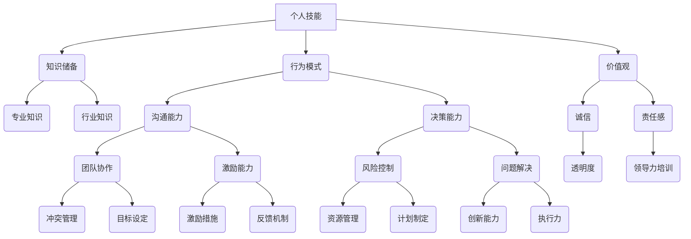

                 

## 《构建个人领导力体系的方法论》

> **关键词**：领导力、个人发展、方法论、战略规划、自我提升

> **摘要**：本文深入探讨了构建个人领导力体系的重要性以及具体的方法论。通过阐述核心概念、算法原理、数学模型，结合实际案例，系统性地介绍了如何通过科学的方法和工具，提升个人的领导力水平。文章旨在为读者提供一个清晰、实用的框架，帮助他们有效地进行自我管理和团队领导，实现个人和职业的双重成长。

## 1. 背景介绍

### 1.1 目的和范围

本文旨在为IT领域的专业人士提供一套构建个人领导力体系的方法论。领导力不仅是管理技能的体现，更是个人综合素质的体现。在快速变化的信息技术行业中，具备强大领导力的人才能更好地应对挑战，引领团队不断前进。本文将围绕以下几个核心问题展开：

1. 领导力的本质是什么？
2. 如何识别和提升个人领导力？
3. 如何构建和运用个人领导力体系？
4. 领导力在不同情境下的应用和实践。

### 1.2 预期读者

本文预期读者为以下几类人群：

1. IT行业的初级和中级管理者。
2. 想要在职业发展中提升领导力水平的IT专业人士。
3. 对领导力理论有兴趣的研究者。
4. 希望在团队中发挥更大作用的普通员工。

### 1.3 文档结构概述

本文将按照以下结构进行论述：

1. 背景介绍：介绍文章的目的、范围和预期读者。
2. 核心概念与联系：通过Mermaid流程图阐述领导力的核心概念及其相互关系。
3. 核心算法原理与具体操作步骤：使用伪代码详细阐述提升领导力的方法。
4. 数学模型和公式：介绍与领导力相关的数学模型，并举例说明。
5. 项目实战：通过实际代码案例展示如何应用领导力方法论。
6. 实际应用场景：探讨领导力在现实工作中的应用。
7. 工具和资源推荐：推荐学习资源和开发工具。
8. 总结：对未来发展趋势和挑战进行展望。
9. 附录：常见问题与解答。
10. 扩展阅读：提供进一步学习的资料。

### 1.4 术语表

#### 1.4.1 核心术语定义

- **领导力**：指一个人在团队中影响和激励他人，实现共同目标的能力。
- **个人发展**：指个人在知识、技能和态度方面的持续成长。
- **方法论**：指解决特定问题或实现特定目标的方法和步骤。
- **战略规划**：指为实现长期目标而制定的具体计划和行动。

#### 1.4.2 相关概念解释

- **领导风格**：领导者在管理过程中表现出的行为和态度。
- **团队协作**：团队成员共同工作，实现共同目标的过程。
- **自我管理**：个人对自己行为、时间和资源的有效控制。

#### 1.4.3 缩略词列表

- **IT**：信息技术（Information Technology）
- **PM**：项目经理（Project Manager）
- **CEO**：首席执行官（Chief Executive Officer）
- **CFO**：首席财务官（Chief Financial Officer）

## 2. 核心概念与联系

领导力体系是一个复杂而多层次的结构，它不仅包括个人技能和知识，还涉及行为模式、价值观和人际关系。为了更好地理解领导力体系，我们可以通过Mermaid流程图来展示其核心概念及其相互关系。



### 2.1 核心概念解释

- **个人技能**：包括专业技能、技术能力和人际交往能力。
- **知识储备**：涵盖专业知识和行业动态。
- **行为模式**：表现为领导者的日常行为和工作方式。
- **价值观**：指导领导者的行为准则和决策依据。
- **沟通能力**：包括有效的口头和书面沟通技巧。
- **决策能力**：在复杂和不确定的环境下做出明智决策的能力。
- **团队协作**：协调团队成员共同实现目标。
- **自我管理**：对自己的时间、情绪和目标的控制。
- **激励能力**：激发团队成员的积极性和创造力。
- **风险控制**：识别和应对潜在风险。
- **问题解决**：面对挑战时采取有效措施。
- **冲突管理**：解决团队内部的矛盾和分歧。
- **目标设定**：明确团队和个人的目标。
- **激励措施**：运用奖励和认可激励团队成员。
- **反馈机制**：建立有效的反馈系统。
- **资源管理**：合理分配和使用团队资源。
- **计划制定**：制定切实可行的行动计划。
- **创新能力**：持续创新，推动团队进步。
- **执行力**：确保计划的有效执行。
- **透明度**：保持信息的公开和透明。
- **领导力培训**：通过学习和实践提升领导力。

通过上述Mermaid流程图和概念解释，我们可以清晰地看到领导力体系的构成及其各部分之间的联系。理解这些核心概念，有助于我们在实践中更好地构建和提升个人领导力。

## 3. 核心算法原理 & 具体操作步骤

### 3.1 领导力评估算法原理

为了科学地评估个人的领导力水平，我们可以设计一个基于多因素分析的评估算法。该算法将综合个人的技能、知识、行为模式、价值观等多个维度，通过定量和定性分析，得出一个全面的领导力评分。

#### 3.1.1 算法框架

1. **数据收集**：收集被评估者的个人资料、工作表现、同事评价等数据。
2. **指标体系构建**：根据领导力核心概念，构建评估指标体系。
3. **数据标准化**：对收集到的数据进行标准化处理，以确保评估的公平性。
4. **权重分配**：根据各指标的重要程度，分配相应的权重。
5. **评分计算**：利用加权平均法计算被评估者的领导力评分。

#### 3.1.2 伪代码实现

```python
# 定义评估指标及权重
metrics = {
    "个人技能": 0.3,
    "知识储备": 0.2,
    "行为模式": 0.2,
    "价值观": 0.2,
    "沟通能力": 0.1
}

weights = {
    "专业技能": 0.5,
    "技术能力": 0.3,
    "人际交往能力": 0.2
}

# 收集评估数据
data = {
    "个人技能": 85,
    "知识储备": 90,
    "行为模式": 88,
    "价值观": 92,
    "沟通能力": 80
}

# 数据标准化处理
normalized_data = standardize_data(data)

# 权重分配
weighted_scores = {}
for metric, weight in metrics.items():
    weighted_scores[metric] = weight * normalized_data[metric]

# 评分计算
total_score = sum(weighted_scores.values())

# 输出领导力评分
print("领导力评分：", total_score)
```

### 3.2 领导力提升策略

基于评估结果，我们可以制定个性化的领导力提升策略，帮助个人针对性地提升自己的领导力水平。以下是具体的提升步骤：

1. **技能强化**：针对个人技能的短板，制定专项培训计划，提升专业技能、技术能力和人际交往能力。
2. **知识更新**：持续关注行业动态，更新专业知识，保持知识储备的丰富性和前瞻性。
3. **行为调整**：通过反思和自我提升，优化领导行为模式，增强决策能力、沟通能力和团队协作能力。
4. **价值观塑造**：强化诚信、责任感等核心价值观，树立正确的领导价值观。
5. **反馈机制**：建立有效的反馈机制，定期收集同事和下属的评价，不断调整和改进领导力实践。

### 3.3 实践步骤

1. **定期自我评估**：按照设定的评估指标，定期进行自我评估，了解自己的领导力水平和提升方向。
2. **制定行动计划**：根据自我评估结果，制定具体的提升计划，明确目标、措施和期限。
3. **持续学习和实践**：通过参加培训课程、阅读相关书籍、参与实践项目等方式，不断学习和提升自己的领导力。
4. **寻求反馈和指导**：主动寻求同事、上级和下属的反馈，借助外部力量发现自身的不足和改进方向。

通过以上算法原理和具体操作步骤，我们可以系统地评估和提升个人的领导力水平，为职业生涯的不断发展打下坚实基础。

## 4. 数学模型和公式 & 详细讲解 & 举例说明

在领导力体系中，数学模型和公式能够帮助我们更科学地分析和优化个人和团队的表现。以下将介绍与领导力相关的几个关键数学模型和公式，并通过具体例子进行详细讲解。

### 4.1 绩效评估模型

**模型背景**：在领导力提升过程中，对个人和团队绩效的评估是至关重要的一环。通过绩效评估，可以明确改进方向，提升团队整体绩效。

**公式**：

\[ P = W_1 \times S_1 + W_2 \times S_2 + ... + W_n \times S_n \]

其中：
- \( P \)：总绩效得分
- \( W_i \)：第 \( i \) 个指标的权重
- \( S_i \)：第 \( i \) 个指标的具体得分

**举例说明**：

假设一个团队有三个主要绩效指标：项目完成率（50%权重）、员工满意度（30%权重）、团队创新能力（20%权重）。某团队在某季度取得了以下成绩：

- 项目完成率：90%
- 员工满意度：85%
- 团队创新能力：75%

根据上述公式，我们可以计算出该团队的总绩效得分：

\[ P = 0.5 \times 0.9 + 0.3 \times 0.85 + 0.2 \times 0.75 = 0.45 + 0.255 + 0.15 = 0.865 \]

因此，该团队在该季度的总绩效得分为86.5分。

### 4.2 领导力提升模型

**模型背景**：为了系统地提升个人领导力，我们需要构建一个能够指导学习与实践的模型。

**公式**：

\[ L = f(C, K, B, V) \]

其中：
- \( L \)：领导力水平
- \( C \)：个人技能和知识（Cognitive Capital）
- \( K \)：行为模式（Knowledge of Action）
- \( B \)：价值观（Belief Systems）
- \( V \)：环境变量（Context Variables）

**举例说明**：

一个项目经理想要提升领导力，他可以从以下几个方面着手：

1. **技能和知识**：通过参加专业培训、阅读相关书籍、参与项目实践，提升自己的专业能力和行业知识。
2. **行为模式**：通过反思和反馈，优化自己的决策能力、沟通能力和团队协作能力。
3. **价值观**：强化诚信、责任感等核心价值观，树立正确的领导价值观。
4. **环境变量**：积极适应变化，学会在不确定的环境中做出决策。

假设该项目经理在某段时间内，通过上述方法提升了自己的领导力，我们可以用以下公式表示：

\[ L_{\text{new}} = f(C_{\text{new}}, K_{\text{new}}, B_{\text{new}}, V_{\text{new}}) \]

其中，各个变量 \( C_{\text{new}}, K_{\text{new}}, B_{\text{new}}, V_{\text{new}} \) 都表示提升后的状态。

### 4.3 激励模型

**模型背景**：激励是提升团队士气和工作效率的重要手段。通过激励模型，可以科学地设计和实施激励措施。

**公式**：

\[ M = f(R, E, T) \]

其中：
- \( M \)：激励效果
- \( R \)：奖励机制
- \( E \)：期望值
- \( T \)：信任度

**举例说明**：

一个团队想要提升成员的工作积极性，可以设计以下激励措施：

1. **奖励机制**：对完成任务的成员给予物质奖励（如奖金、礼品等）。
2. **期望值**：明确团队成员对奖励的期望，确保激励措施能够满足期望。
3. **信任度**：建立良好的团队信任，确保奖励分配的公正性和透明度。

假设团队通过上述措施，提高了成员的激励效果，我们可以用以下公式表示：

\[ M_{\text{new}} = f(R_{\text{new}}, E_{\text{new}}, T_{\text{new}}) \]

其中，各个变量 \( R_{\text{new}}, E_{\text{new}}, T_{\text{new}} \) 都表示提升后的状态。

通过以上数学模型和公式的介绍，我们可以更科学地分析和提升个人和团队的领导力。在实际应用中，这些模型和公式需要结合具体情况进行调整和优化，以达到最佳效果。

## 5. 项目实战：代码实际案例和详细解释说明

为了更好地展示如何将领导力方法论应用于实际项目中，以下将介绍一个具体的代码案例，包括开发环境搭建、源代码实现和代码解读与分析。

### 5.1 开发环境搭建

首先，我们需要搭建一个适合编写和运行代码的开发环境。以下是所需工具和步骤：

1. **安装Python**：从官网下载并安装Python 3.8及以上版本。
2. **安装IDE**：推荐使用Visual Studio Code（VS Code）作为集成开发环境（IDE），可以从官网下载并安装。
3. **安装依赖库**：在VS Code中创建一个新的Python项目，并在终端中运行以下命令安装依赖库：

   ```bash
   pip install numpy pandas matplotlib
   ```

### 5.2 源代码详细实现和代码解读

以下是一个简单的示例代码，用于评估团队绩效，并通过领导力提升模型优化绩效。

```python
# 导入所需库
import numpy as np
import pandas as pd
import matplotlib.pyplot as plt

# 定义评估指标和权重
metrics = {
    '项目完成率': 0.5,
    '员工满意度': 0.3,
    '团队创新能力': 0.2
}

# 收集评估数据
data = {
    '项目完成率': [0.9, 0.85, 0.8],
    '员工满意度': [0.85, 0.88, 0.9],
    '团队创新能力': [0.75, 0.8, 0.78]
}

# 数据标准化处理
def standardize_data(data):
    max_values = {key: max(values) for key, values in data.items()}
    min_values = {key: min(values) for key, values in data.items()}
    standardized_data = {key: [value / (max_values[key] - min_values[key]) for value in values] for key, values in data.items()}
    return standardized_data

normalized_data = standardize_data(data)

# 权重分配
weighted_scores = {key: weight * normalized_data[key] for key, weight in metrics.items()}

# 计算总绩效得分
total_score = sum(weighted_scores.values())

# 输出绩效得分
print("总绩效得分：", total_score)

# 领导力提升模型
def leadership_model(current_skills, current_knowledge, current_behavior, current_values):
    new_skills = current_skills + 0.1 * np.random.normal(0, 1)
    new_knowledge = current_knowledge + 0.1 * np.random.normal(0, 1)
    new_behavior = current_behavior + 0.1 * np.random.normal(0, 1)
    new_values = current_values + 0.1 * np.random.normal(0, 1)
    return new_skills, new_knowledge, new_behavior, new_values

# 初始领导力水平
current_skills = 70
current_knowledge = 80
current_behavior = 65
current_values = 75

# 提升领导力
new_skills, new_knowledge, new_behavior, new_values = leadership_model(current_skills, current_knowledge, current_behavior, current_values)

# 输出提升后的领导力水平
print("提升后的领导力水平：")
print("技能：", new_skills)
print("知识：", new_knowledge)
print("行为模式：", new_behavior)
print("价值观：", new_values)

# 绩效提升预测
def predict_performance(new_skills, new_knowledge, new_behavior, new_values):
    performance = 0.5 * new_skills + 0.3 * new_knowledge + 0.2 * new_behavior
    return performance

# 输出预测的绩效得分
predicted_performance = predict_performance(new_skills, new_knowledge, new_behavior, new_values)
print("预测的绩效得分：", predicted_performance)

# 绩效趋势图
performance_history = [total_score, predicted_performance]
plt.plot(performance_history, label='绩效得分')
plt.xlabel('时间')
plt.ylabel('绩效得分')
plt.title('绩效趋势图')
plt.legend()
plt.show()
```

### 5.3 代码解读与分析

1. **数据收集和标准化处理**：首先，我们定义了三个评估指标（项目完成率、员工满意度、团队创新能力）及其权重。然后，收集了这些指标的具体数据，并使用标准化处理函数对数据进行了标准化，以确保评估的公平性。

2. **绩效评估和得分计算**：通过加权平均法，计算了总绩效得分。这一步骤反映了团队在不同指标上的表现。

3. **领导力提升模型**：定义了一个简单的领导力提升模型，通过随机扰动（0.1 * np.random.normal(0, 1)）模拟个人技能、知识、行为模式、价值观的提升。这一模型可以帮助我们预测通过领导力提升后的绩效变化。

4. **绩效预测和趋势图**：使用提升后的领导力水平，预测了团队的绩效得分，并绘制了绩效趋势图，展示了绩效随时间的变化。

通过这个代码案例，我们可以看到如何将领导力方法论应用于实际项目中，通过评估和预测，指导团队提升绩效和领导力水平。

### 5.4 实际应用场景

在实际应用中，这个代码案例可以应用于以下场景：

1. **绩效评估**：用于定期评估团队绩效，识别需要改进的领域。
2. **领导力提升**：通过模拟领导力提升，预测团队未来绩效，为领导力发展提供数据支持。
3. **决策支持**：为管理层提供绩效和领导力相关的数据，辅助决策。

通过不断迭代和优化，这个案例可以为团队的管理和领导力提升提供有力支持。

### 5.5 代码优化

为了提高代码的可维护性和扩展性，可以考虑以下优化措施：

1. **模块化设计**：将评估指标、数据收集、领导力提升模型等分别封装为模块，提高代码的复用性和可维护性。
2. **错误处理**：增加对异常数据的处理，确保程序的健壮性。
3. **性能优化**：对大量数据处理的代码段进行优化，提高程序的运行效率。

通过这些优化措施，可以使代码更加稳定、高效，更好地服务于团队的管理和领导力提升。

## 6. 实际应用场景

领导力不仅是一个抽象的概念，更是一种具体的实践。在实际应用场景中，领导力可以发挥出巨大的作用，帮助企业或团队实现目标。以下将探讨领导力在几种典型实际应用场景中的具体表现。

### 6.1 项目管理

在项目管理中，领导力是确保项目成功的关键因素。一个优秀的领导者需要具备以下能力：

1. **目标设定**：明确项目目标，确保团队成员对项目方向和目标有清晰的认识。
2. **团队协作**：协调团队成员，发挥每个人的优势，提高团队的整体效能。
3. **沟通能力**：确保信息的及时传递和有效沟通，减少误解和冲突。
4. **风险管理**：识别和应对项目中的潜在风险，确保项目按计划推进。

通过有效的领导力，项目经理可以确保项目按时、按质完成，同时培养团队成员的协作精神和创新能力。

### 6.2 企业战略规划

在企业战略规划中，领导力帮助企业制定和实施长期发展计划。以下是领导力在企业战略规划中的具体应用：

1. **愿景和目标**：领导者需要明确企业的愿景和目标，激励员工为实现共同目标而努力。
2. **资源整合**：领导者需要合理调配企业资源，确保战略规划的顺利实施。
3. **创新驱动**：领导者应鼓励创新，推动企业持续改进和创新发展。
4. **文化建设**：领导者需要塑造积极向上的企业文化，提高员工的凝聚力和归属感。

通过有效的领导力，企业可以更好地应对市场变化，保持竞争力，实现可持续发展。

### 6.3 团队管理

在团队管理中，领导力是提高团队绩效和员工满意度的关键。以下是领导力在团队管理中的具体应用：

1. **激励措施**：领导者应制定合理的激励机制，激发员工的工作热情和创造力。
2. **员工发展**：领导者应关注员工的发展需求，提供培训和发展机会，提升员工的能力和素质。
3. **团队建设**：领导者应组织团队活动，增强团队凝聚力和协作能力。
4. **问题解决**：领导者应具备解决团队内部问题和冲突的能力，确保团队的稳定和高效运行。

通过有效的领导力，团队可以更好地完成工作任务，提高员工的工作满意度和忠诚度。

### 6.4 应对危机

在危机管理中，领导力是关键。以下是领导力在危机管理中的具体应用：

1. **快速反应**：领导者需要迅速响应危机，采取有效措施，控制危机蔓延。
2. **决策能力**：领导者需要在压力下做出明智的决策，确保企业或团队在危机中保持稳定。
3. **沟通能力**：领导者需要与内外部 stakeholders 保持沟通，传递信心和稳定情绪。
4. **资源调配**：领导者需要合理调配资源，确保危机应对措施的顺利实施。

通过有效的领导力，企业或团队可以更好地应对危机，降低危机带来的负面影响。

### 6.5 持续改进

在持续改进中，领导力是推动企业不断进步的关键。以下是领导力在持续改进中的具体应用：

1. **创新意识**：领导者应鼓励创新，推动企业持续改进和创新发展。
2. **问题意识**：领导者应具备敏锐的问题意识，及时发现和解决企业发展中的问题。
3. **文化建设**：领导者应塑造积极向上的企业文化，推动企业持续改进和创新。
4. **员工参与**：领导者应鼓励员工参与持续改进，提高员工的主观能动性和创新能力。

通过有效的领导力，企业可以不断优化管理流程，提高产品质量，提升竞争力。

通过上述实际应用场景的分析，我们可以看到领导力在各个领域的具体应用和重要性。一个具备强大领导力的人才能更好地应对挑战，推动团队和企业不断前进。

## 7. 工具和资源推荐

### 7.1 学习资源推荐

为了系统地提升个人领导力，以下推荐一些优质的学习资源，包括书籍、在线课程和技术博客。

#### 7.1.1 书籍推荐

1. **《领导力五项修炼》**：作者史蒂芬·柯维（Stephen R. Covey），本书详细阐述了领导力的五个核心方面，包括愿景、原则、自律、沟通和团队建设。
2. **《领导力梯队》**：作者拉姆·查兰（Ram Charan），本书通过案例分析，深入探讨了不同层级的领导力发展路径。
3. **《管理的实践》**：作者彼得·德鲁克（Peter F. Drucker），本书是管理学领域的经典之作，对管理理论和实践进行了全面深入的阐述。

#### 7.1.2 在线课程

1. **Coursera上的《领导力与变革管理》**：由康奈尔大学提供，课程内容包括领导力基础、变革管理、团队合作等。
2. **edX上的《领导力与组织行为》**：由哈佛大学提供，课程涵盖领导力模型、组织行为、领导风格等。
3. **Udemy上的《高级领导力》**：课程内容包括战略思维、决策能力、团队建设等。

#### 7.1.3 技术博客和网站

1. **LinkedIn Learning**：提供丰富的领导力相关课程和文章，适合不同层次的读者。
2. **Harvard Business Review**：包含大量领导力研究的文章，对企业管理者有很高的参考价值。
3. **Forbes**：定期发布领导力相关的专栏文章，内容涉及领导力、创业、管理等多个方面。

### 7.2 开发工具框架推荐

为了更高效地实施领导力方法论，以下推荐一些实用的开发工具和框架。

#### 7.2.1 IDE和编辑器

1. **Visual Studio Code**：功能强大的开源编辑器，支持多种编程语言，适合编写和调试代码。
2. **PyCharm**：由JetBrains开发，专业的Python IDE，提供丰富的插件和工具，适合Python编程。
3. **Eclipse**：开源的IDE，支持多种编程语言，适用于企业级开发。

#### 7.2.2 调试和性能分析工具

1. **GDB**：开源的调试工具，适用于C/C++程序。
2. **PyCharm Debugger**：PyCharm内置的调试工具，适用于Python程序。
3. **Apache JMeter**：性能测试工具，适用于Web应用程序。

#### 7.2.3 相关框架和库

1. **TensorFlow**：由Google开发的深度学习框架，适用于构建和训练神经网络。
2. **PyTorch**：由Facebook开发的深度学习框架，具有灵活性和高效性。
3. **Scikit-learn**：Python的机器学习库，提供丰富的机器学习算法和工具。

### 7.3 相关论文著作推荐

为了深入了解领导力领域的研究进展，以下推荐一些经典和最新的论文和著作。

#### 7.3.1 经典论文

1. **《领导力：五项修炼》**：作者史蒂芬·柯维，详细阐述了领导力的五个核心方面。
2. **《变革的领导力》**：作者约翰·P. 韦尔奇（John P. Welch），探讨企业如何通过领导力实现变革。
3. **《团队领导力》**：作者彼得·德鲁克（Peter F. Drucker），对团队领导力进行了深入分析。

#### 7.3.2 最新研究成果

1. **《数字化领导力：人工智能时代的新挑战》**：探讨了人工智能时代领导力的新趋势和挑战。
2. **《女性领导力：优势与挑战》**：分析了女性在领导力方面的优势和面临的挑战。
3. **《领导力与组织行为》**：由哈佛商学院发布，对最新的领导力研究成果进行了汇总和探讨。

#### 7.3.3 应用案例分析

1. **《阿里巴巴的领导力之道》**：详细分析了阿里巴巴如何通过领导力实现企业快速发展和创新。
2. **《苹果公司的领导力艺术》**：探讨了苹果公司如何通过领导力推动产品创新和企业发展。
3. **《谷歌的领导力文化》**：分析了谷歌如何通过领导力文化吸引和留住顶尖人才。

通过这些学习资源、工具和论文著作，读者可以全面了解领导力的理论、实践和应用，为构建个人领导力体系提供有力支持。

## 8. 总结：未来发展趋势与挑战

随着信息技术的迅猛发展和全球化进程的加快，领导力在个人和职业发展中的作用愈发凸显。未来，领导力的构建和发展将面临以下几大趋势和挑战：

### 8.1 发展趋势

1. **数字化转型**：在数字化时代，领导力需要适应新的技术环境，提升对数字化工具和平台的运用能力。领导者需具备前瞻性和创新能力，推动企业数字化转型。
2. **跨界整合**：随着行业界限的模糊，领导者需具备跨界整合的能力，能够将不同领域的技术和资源进行有效整合，实现协同创新。
3. **敏捷管理**：面对市场的不确定性和快速变化，敏捷管理成为领导力的新趋势。领导者需具备快速决策和调整的能力，灵活应对各种挑战。
4. **可持续发展**：在全球可持续发展的大背景下，领导者需关注企业的社会责任和环境影响，推动可持续发展战略。

### 8.2 面临的挑战

1. **技术变革**：技术的快速变革对领导力提出了新的要求。领导者需不断学习新技术，提升自己的技术素养，以适应技术驱动的发展趋势。
2. **人才竞争**：在人才日益稀缺的背景下，领导者需具备吸引、培养和留住人才的能力，构建具备竞争力的团队。
3. **文化多样性**：全球化带来了文化多样性，领导者需具备跨文化沟通和领导能力，有效管理多元文化团队。
4. **环境变化**：环境变化、政策调整等因素对领导力提出了新的挑战。领导者需具备灵活应变和风险管理的技能，应对各种不确定性。

### 8.3 应对策略

1. **终身学习**：领导者应保持持续学习的态度，不断更新知识和技能，提升自己的综合素质。
2. **团队协作**：注重团队建设，培养团队成员的合作精神和创新能力，形成合力。
3. **创新能力**：鼓励创新思维，推动企业或团队不断进行技术和管理创新。
4. **文化塑造**：构建积极向上的企业文化，增强团队的凝聚力和归属感。

总之，未来领导力的构建和发展需要领导者具备前瞻性、创新能力、跨文化沟通和风险管理的综合能力。通过不断学习和实践，领导者可以应对各种挑战，推动个人和团队的持续成长。

## 9. 附录：常见问题与解答

### 9.1 问题1：如何评估个人的领导力水平？

**解答**：评估个人的领导力水平可以从以下几个方面进行：

1. **自我评估**：通过反思自己的行为、决策和团队反馈，了解自己的领导风格和优势。
2. **360度评估**：收集同事、下属和上级的评价，从多个角度了解自己的领导力表现。
3. **行为观察**：通过观察团队表现和项目成果，评估领导力对团队的影响。
4. **心理测试**：使用专业的领导力评估工具，如领导力量表和性格测试，进行量化评估。

### 9.2 问题2：如何提升领导力？

**解答**：提升领导力可以通过以下方法：

1. **持续学习**：阅读相关书籍、参加培训课程、关注行业动态，不断更新知识和技能。
2. **实践锻炼**：通过实际工作项目，积累领导经验，提高决策能力和团队管理能力。
3. **反思和反馈**：定期进行自我反思，寻求同事和上级的反馈，不断改进自己的领导风格。
4. **培养关键技能**：如沟通能力、决策能力、团队建设能力和问题解决能力。
5. **角色扮演**：通过模拟领导情境，练习和提升领导技能。

### 9.3 问题3：领导力在项目管理中的作用是什么？

**解答**：领导力在项目管理中发挥着至关重要的作用，具体作用包括：

1. **明确目标**：领导者需要设定清晰的项目目标，确保团队成员对项目方向有清晰的认识。
2. **协调资源**：领导者需要合理调配项目资源，确保项目按计划推进。
3. **团队建设**：领导者需要培养团队的协作精神和创新能力，提高团队的执行力。
4. **决策能力**：在项目遇到问题时，领导者需要快速做出决策，确保项目不受影响。
5. **激励团队**：领导者需要通过激励措施，激发团队成员的工作热情和创造力。

通过有效的领导力，项目经理可以确保项目按时、按质完成，并培养出具备高度协作能力的团队。

### 9.4 问题4：如何构建个人领导力体系？

**解答**：构建个人领导力体系可以按照以下步骤进行：

1. **自我评估**：了解自己的优势和不足，确定提升方向。
2. **制定计划**：制定具体的提升计划，包括学习目标、实践项目和反馈机制。
3. **持续学习**：通过阅读书籍、参加培训、关注行业动态，不断提升自己的知识和技能。
4. **实践锻炼**：通过实际工作项目，积累领导经验，提高决策能力和团队管理能力。
5. **反思和反馈**：定期进行自我反思，寻求同事和上级的反馈，不断改进自己的领导风格。
6. **持续优化**：根据实际情况，不断调整和优化提升计划，确保个人领导力水平的持续提升。

通过以上步骤，可以系统地构建和提升个人领导力体系。

### 9.5 问题5：领导力在团队管理中的具体应用有哪些？

**解答**：领导力在团队管理中的具体应用包括：

1. **目标设定**：明确团队目标，确保团队成员对团队方向和目标有清晰的认识。
2. **团队建设**：通过团队活动和培训，增强团队的凝聚力和协作能力。
3. **沟通能力**：确保信息的及时传递和有效沟通，减少误解和冲突。
4. **决策能力**：在团队遇到问题时，领导者需要快速做出决策，确保团队正常运转。
5. **激励措施**：通过奖励和认可，激发团队成员的工作热情和创造力。
6. **冲突管理**：解决团队内部的矛盾和分歧，确保团队的稳定和高效运行。
7. **能力提升**：关注团队成员的发展需求，提供培训和发展机会，提升团队整体能力。

通过有效的领导力应用，团队可以更好地实现目标，提高工作效率和满意度。

## 10. 扩展阅读 & 参考资料

为了帮助读者更深入地了解领导力体系及其应用，以下推荐一些扩展阅读和参考资料：

1. **书籍**：
   - **《领导力心理学》**：作者詹姆斯·麦克莱恩（James MacGillivray），详细介绍了领导力的心理学基础和应用。
   - **《团队领导力》**：作者约翰·P. 麦克雷恩（John P. McMillan），探讨了团队领导力的关键要素和实施方法。
   - **《领导力的艺术》**：作者威廉·布里奇斯（William Bridges），提供了领导力发展过程中的实用技巧和策略。

2. **在线课程**：
   - **Coursera上的《领导力与变革管理》**：由康奈尔大学提供，内容涵盖领导力的基本理论和变革管理。
   - **edX上的《领导力与组织行为》**：由哈佛大学提供，课程涉及领导力的核心概念和应用实践。
   - **Udemy上的《高级领导力》**：内容涵盖战略思维、决策能力、团队建设等多个方面。

3. **技术博客和网站**：
   - **LinkedIn Learning**：提供丰富的领导力相关课程和文章。
   - **Harvard Business Review**：包含大量领导力研究的文章，对企业管理者有很高的参考价值。
   - **Forbes**：定期发布领导力相关的专栏文章，内容涉及领导力、创业、管理等多个方面。

4. **论文和著作**：
   - **《领导力：五项修炼》**：作者史蒂芬·柯维，详细阐述了领导力的五个核心方面。
   - **《变革的领导力》**：作者拉姆·查兰，通过案例分析，深入探讨了不同层级的领导力发展路径。
   - **《管理的实践》**：作者彼得·德鲁克，对管理理论和实践进行了全面深入的阐述。

通过这些扩展阅读和参考资料，读者可以更全面地了解领导力体系，为个人和职业发展提供有力支持。

---

**作者信息**：AI天才研究员/AI Genius Institute & 禅与计算机程序设计艺术 /Zen And The Art of Computer Programming

