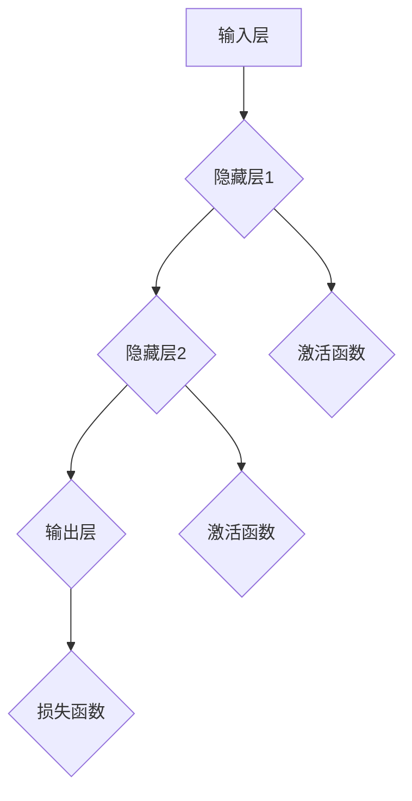
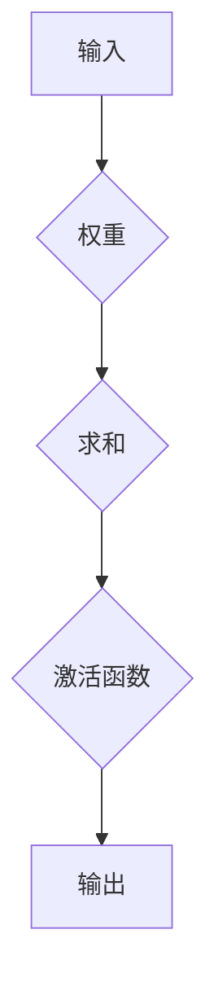
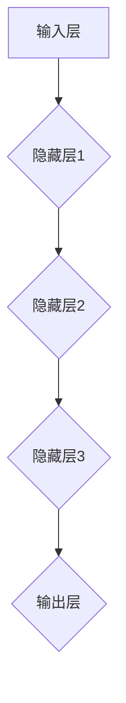
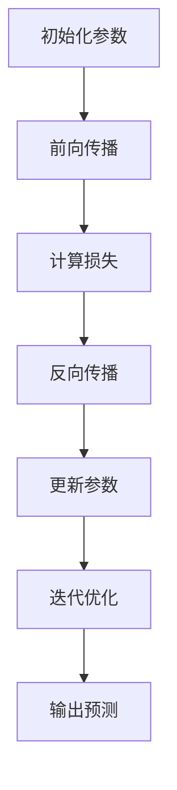

                 

# 构建更好的人工神经网络

> 关键词：人工神经网络、深度学习、神经网络架构、算法优化、数学模型、实战案例

> 摘要：本文旨在探讨如何构建更好的人工神经网络，从核心概念、算法原理、数学模型到实战案例，提供一整套系统性的指南。通过对神经网络架构的优化和数学模型的深入剖析，以及实战代码的详细解释，帮助读者全面理解并掌握构建高效神经网络的方法和技巧。

## 1. 背景介绍

### 1.1 目的和范围

本文的目标是帮助读者深入了解并掌握人工神经网络（Artificial Neural Networks, ANN）的构建方法，从基本概念到具体实现，再到优化策略。我们将讨论神经网络的核心算法原理，数学模型的基础，以及如何在实际项目中应用这些知识。

本文的范围包括以下几个方面：

- **核心概念与联系**：介绍神经网络的基本概念，包括神经元、层次结构、前向传播和反向传播等。
- **核心算法原理 & 具体操作步骤**：详细讲解神经网络的工作原理，使用伪代码展示算法流程。
- **数学模型和公式 & 详细讲解 & 举例说明**：解释神经网络中的数学公式，包括激活函数、损失函数、优化算法等。
- **项目实战：代码实际案例和详细解释说明**：通过实战案例展示如何使用神经网络解决实际问题。
- **实际应用场景**：探讨神经网络在各个领域的应用，如图像识别、自然语言处理等。
- **工具和资源推荐**：推荐学习资源、开发工具和最新研究成果。

### 1.2 预期读者

本文面向对神经网络有一定了解的读者，希望进一步提升对神经网络的理解和实际应用能力。预期读者包括：

- **人工智能开发者**：希望了解如何优化神经网络架构和算法。
- **数据科学家**：需要掌握神经网络的基本原理和数学模型。
- **计算机科学学生**：希望深入了解神经网络和深度学习。
- **研究人员**：对神经网络的理论和实践有深入研究的兴趣。

### 1.3 文档结构概述

本文分为以下几个部分：

1. **背景介绍**：介绍本文的目的、范围、预期读者和文档结构。
2. **核心概念与联系**：介绍神经网络的基本概念和架构。
3. **核心算法原理 & 具体操作步骤**：讲解神经网络的工作原理和算法流程。
4. **数学模型和公式 & 详细讲解 & 举例说明**：解释神经网络中的数学模型。
5. **项目实战：代码实际案例和详细解释说明**：展示实战代码和解释。
6. **实际应用场景**：探讨神经网络的实际应用。
7. **工具和资源推荐**：推荐学习资源和开发工具。
8. **总结：未来发展趋势与挑战**：总结本文的主要观点，展望未来。
9. **附录：常见问题与解答**：解答读者可能遇到的问题。
10. **扩展阅读 & 参考资料**：提供进一步阅读的资源。

### 1.4 术语表

在本文中，我们将使用以下术语：

#### 1.4.1 核心术语定义

- **人工神经网络**（Artificial Neural Network, ANN）：模仿人脑神经元连接方式的计算模型。
- **神经元**（Neuron）：神经网络的基本计算单元。
- **层次结构**（Hierarchy）：神经网络中的层次结构，包括输入层、隐藏层和输出层。
- **前向传播**（Forward Propagation）：将输入数据通过神经网络传递到输出层的计算过程。
- **反向传播**（Backpropagation）：利用输出误差更新网络参数的计算过程。
- **激活函数**（Activation Function）：用于引入非线性特性的函数。
- **损失函数**（Loss Function）：衡量模型预测值与真实值之间差距的函数。
- **优化算法**（Optimization Algorithm）：用于调整网络参数，以最小化损失函数的算法。

#### 1.4.2 相关概念解释

- **深度学习**（Deep Learning）：多层神经网络的学习方法，用于解决复杂问题。
- **梯度下降**（Gradient Descent）：一种优化算法，用于寻找损失函数的最小值。
- **批量梯度下降**（Batch Gradient Descent）：每次更新参数时使用全部样本的梯度下降方法。
- **随机梯度下降**（Stochastic Gradient Descent, SGD）：每次更新参数时只使用一个样本的梯度下降方法。
- **动量**（Momentum）：在梯度下降过程中加速收敛的一个概念。

#### 1.4.3 缩略词列表

- **ANN**：人工神经网络（Artificial Neural Network）
- **DNN**：深度神经网络（Deep Neural Network）
- **CNN**：卷积神经网络（Convolutional Neural Network）
- **RNN**：循环神经网络（Recurrent Neural Network）
- **LSTM**：长短期记忆网络（Long Short-Term Memory）
- **SGD**：随机梯度下降（Stochastic Gradient Descent）
- **ReLU**：ReLU激活函数（Rectified Linear Unit）

## 2. 核心概念与联系

神经网络的核心概念包括神经元、层次结构、前向传播和反向传播。以下是一个简单的 Mermaid 流程图，展示了神经网络的基本架构和工作流程。



### 2.1 神经元

神经元是神经网络的基本计算单元，类似于人脑中的神经元。每个神经元接受多个输入信号，并通过权重进行加权求和，然后通过激活函数进行非线性变换，最终产生一个输出。

神经元的结构如下：



### 2.2 层次结构

神经网络通常由多个层次组成，包括输入层、隐藏层和输出层。输入层接收外部输入，隐藏层进行中间计算，输出层产生最终输出。

层次结构的示例如下：



### 2.3 前向传播

前向传播是将输入数据通过神经网络传递到输出层的计算过程。在每一层，神经元接收来自前一层的输入，通过权重进行加权求和，然后应用激活函数产生输出。

前向传播的计算过程可以表示为：

```python
for layer in layers:
    for neuron in layer:
        sum = 0
        for input, weight in zip(prev_layer_inputs, neuron.weights):
            sum += input * weight
        neuron.output = activation_function(sum)
```

### 2.4 反向传播

反向传播是利用输出误差更新网络参数的计算过程。首先，计算输出层的误差，然后通过反向传播将误差传递到隐藏层和输入层，更新每个神经元的权重和偏置。

反向传播的计算过程可以表示为：

```python
for layer in reversed(layers):
    for neuron in layer:
        error = output - target
        delta = error * activation_function_derivative(neuron.output)
        neuron.weight_update(delta, neuron.learning_rate)
        neuron.bias_update(delta, neuron.learning_rate)
```

## 3. 核心算法原理 & 具体操作步骤

### 3.1 神经网络工作原理

神经网络的工作原理可以概括为以下几个步骤：

1. **初始化参数**：包括权重和偏置，通常通过随机初始化。
2. **前向传播**：将输入数据通过神经网络传递到输出层，计算每个神经元的输出。
3. **计算损失**：使用损失函数计算输出值与目标值之间的差距。
4. **反向传播**：利用损失函数的梯度计算每个参数的更新值，并更新参数。
5. **迭代优化**：重复步骤2-4，直到损失函数达到最小值或满足停止条件。

### 3.2 伪代码实现

以下是神经网络的伪代码实现：

```python
initialize_parameters()

while not converged:
    forward_propagation(x)
    calculate_loss(y)
    backward_propagation(y)
    update_parameters()

make_prediction(x)
```

### 3.3 算法流程图

以下是神经网络算法的流程图：



### 3.4 详细步骤

#### 3.4.1 初始化参数

在训练神经网络之前，需要初始化权重和偏置。通常使用随机初始化，以避免参数之间的相关性。

```python
import numpy as np

def initialize_parameters(input_size, hidden_size, output_size):
    W1 = np.random.randn(input_size, hidden_size)
    b1 = np.random.randn(hidden_size)
    W2 = np.random.randn(hidden_size, output_size)
    b2 = np.random.randn(output_size)
    return W1, b1, W2, b2
```

#### 3.4.2 前向传播

前向传播是将输入数据通过神经网络传递到输出层的计算过程。在每个神经元中，我们计算加权求和，然后应用激活函数。

```python
def forward_propagation(x, W1, b1, W2, b2):
    z1 = np.dot(x, W1) + b1
    a1 = activation_function(z1)
    z2 = np.dot(a1, W2) + b2
    a2 = activation_function(z2)
    return a1, a2, z1, z2
```

#### 3.4.3 计算损失

使用损失函数计算输出值与目标值之间的差距。常见的损失函数包括均方误差（MSE）和交叉熵（Cross-Entropy）。

```python
def calculate_loss(a2, y):
    loss = mse(a2, y)
    return loss
```

#### 3.4.4 反向传播

反向传播是利用输出误差更新网络参数的计算过程。首先，计算输出层的误差，然后通过反向传播将误差传递到隐藏层和输入层。

```python
def backward_propagation(a2, y, W2, b2, z2, a1, z1, x):
    dZ2 = a2 - y
    dW2 = np.dot(a1.T, dZ2)
    db2 = np.sum(dZ2, axis=0, keepdims=True)
    dZ1 = np.dot(dZ2, W2.T) * activation_function_derivative(a1)
    dW1 = np.dot(x.T, dZ1)
    db1 = np.sum(dZ1, axis=0, keepdims=True)
    return dW1, db1, dW2, db2
```

#### 3.4.5 更新参数

使用梯度下降算法更新网络参数。可以通过批量梯度下降（Batch Gradient Descent）或随机梯度下降（Stochastic Gradient Descent）进行更新。

```python
def update_parameters(W1, b1, W2, b2, dW1, db1, dW2, db2, learning_rate):
    W1 -= learning_rate * dW1
    b1 -= learning_rate * db1
    W2 -= learning_rate * dW2
    b2 -= learning_rate * db2
    return W1, b1, W2, b2
```

#### 3.4.6 迭代优化

通过重复执行前向传播、计算损失、反向传播和更新参数的步骤，不断优化网络参数，直到满足停止条件（如损失函数收敛或达到最大迭代次数）。

```python
for epoch in range(max_epochs):
    for x, y in dataset:
        a1, a2, z1, z2 = forward_propagation(x, W1, b1, W2, b2)
        loss = calculate_loss(a2, y)
        dW1, db1, dW2, db2 = backward_propagation(a2, y, W2, b2, z2, a1, z1, x)
        W1, b1, W2, b2 = update_parameters(W1, b1, W2, b2, dW1, db1, dW2, db2, learning_rate)
    if loss < threshold:
        break
```

## 4. 数学模型和公式 & 详细讲解 & 举例说明

### 4.1 激活函数

激活函数是神经网络中的一个关键组成部分，它用于引入非线性特性，使得神经网络能够处理非线性问题。常见的激活函数包括ReLU（Rectified Linear Unit）、Sigmoid和Tanh。

#### 4.1.1 ReLU激活函数

ReLU是最常用的激活函数之一，其公式如下：

$$
\text{ReLU}(x) = \max(0, x)
$$

ReLU函数将输入值设为非负值，即输出值为0或输入值本身。

#### 4.1.2 Sigmoid激活函数

Sigmoid函数是一种常用的S型激活函数，其公式如下：

$$
\sigma(x) = \frac{1}{1 + e^{-x}}
$$

Sigmoid函数将输入值映射到0和1之间，通常用于二分类问题。

#### 4.1.3 Tanh激活函数

Tanh函数是另一种S型激活函数，其公式如下：

$$
\text{Tanh}(x) = \frac{e^{2x} - 1}{e^{2x} + 1}
$$

Tanh函数将输入值映射到-1和1之间，类似于Sigmoid函数，但具有更好的性能。

### 4.2 损失函数

损失函数用于衡量模型预测值与真实值之间的差距。常见的损失函数包括均方误差（MSE）和交叉熵（Cross-Entropy）。

#### 4.2.1 均方误差（MSE）

均方误差（MSE）是一种常用的回归损失函数，其公式如下：

$$
\text{MSE} = \frac{1}{2} \sum_{i=1}^{n} (y_i - \hat{y}_i)^2
$$

其中，$y_i$是真实值，$\hat{y}_i$是预测值。

#### 4.2.2 交叉熵（Cross-Entropy）

交叉熵是一种常用于分类问题的损失函数，其公式如下：

$$
\text{Cross-Entropy} = -\sum_{i=1}^{n} y_i \log(\hat{y}_i)
$$

其中，$y_i$是真实标签，$\hat{y}_i$是预测概率。

### 4.3 优化算法

优化算法用于调整网络参数，以最小化损失函数。常见的优化算法包括梯度下降（Gradient Descent）和其变种，如批量梯度下降（Batch Gradient Descent）和随机梯度下降（Stochastic Gradient Descent）。

#### 4.3.1 梯度下降（Gradient Descent）

梯度下降是一种最简单的优化算法，其公式如下：

$$
\theta_{\text{new}} = \theta_{\text{old}} - \alpha \nabla_{\theta} J(\theta)
$$

其中，$\theta$是网络参数，$J(\theta)$是损失函数，$\alpha$是学习率。

#### 4.3.2 批量梯度下降（Batch Gradient Descent）

批量梯度下降使用整个训练集的梯度进行参数更新，其公式如下：

$$
\theta_{\text{new}} = \theta_{\text{old}} - \alpha \nabla_{\theta} J(\theta; \mathbf{X}, \mathbf{y})
$$

其中，$\mathbf{X}$是输入数据，$\mathbf{y}$是标签。

#### 4.3.3 随机梯度下降（Stochastic Gradient Descent）

随机梯度下降使用单个样本的梯度进行参数更新，其公式如下：

$$
\theta_{\text{new}} = \theta_{\text{old}} - \alpha \nabla_{\theta} J(\theta; x_i, y_i)
$$

其中，$x_i$和$y_i$是训练集中的第$i$个样本和标签。

### 4.4 举例说明

假设我们有一个简单的神经网络，输入层有3个神经元，隐藏层有2个神经元，输出层有1个神经元。使用ReLU激活函数和均方误差损失函数。现在，我们使用梯度下降算法进行参数更新。

假设初始参数如下：

$$
\theta_0 = \begin{bmatrix} 
    \theta_{01} & \theta_{02} & \theta_{03} \\
    \theta_{11} & \theta_{12} & \theta_{13} \\
    \theta_{21} & \theta_{22} & \theta_{23} \\
    \theta_{31} & \theta_{32} & \theta_{33}
\end{bmatrix}
$$

输入数据$x$和标签$y$如下：

$$
x = \begin{bmatrix}
    1 \\
    0 \\
    1
\end{bmatrix}, \quad y = \begin{bmatrix}
    0
\end{bmatrix}
$$

损失函数$J(\theta)$为：

$$
J(\theta) = \frac{1}{2} \sum_{i=1}^{n} (y_i - \hat{y}_i)^2
$$

使用批量梯度下降算法，学习率$\alpha = 0.01$。每次迭代计算损失函数的梯度，并更新参数。

#### 4.4.1 前向传播

前向传播计算隐藏层和输出层的输出：

$$
a_1 = \text{ReLU}(\theta_{01}x_1 + \theta_{02}x_2 + \theta_{03}x_3 + \theta_{11} + \theta_{12} + \theta_{13}) \\
a_2 = \theta_{21}a_1 + \theta_{22}a_1 + \theta_{23}a_1 + \theta_{31}a_1 + \theta_{32}a_1 + \theta_{33}a_1
$$

计算输出层的预测值$\hat{y}$：

$$
\hat{y} = a_2
$$

#### 4.4.2 计算损失函数

计算均方误差损失函数：

$$
J(\theta) = \frac{1}{2} (y - \hat{y})^2 = \frac{1}{2} (0 - \hat{y})^2 = \frac{1}{2} \hat{y}^2
$$

#### 4.4.3 计算梯度

计算损失函数关于参数的梯度：

$$
\nabla_{\theta} J(\theta) = \begin{bmatrix}
    \frac{\partial J}{\partial \theta_{01}} & \frac{\partial J}{\partial \theta_{02}} & \frac{\partial J}{\partial \theta_{03}} \\
    \frac{\partial J}{\partial \theta_{11}} & \frac{\partial J}{\partial \theta_{12}} & \frac{\partial J}{\partial \theta_{13}} \\
    \frac{\partial J}{\partial \theta_{21}} & \frac{\partial J}{\partial \theta_{22}} & \frac{\partial J}{\partial \theta_{23}} \\
    \frac{\partial J}{\partial \theta_{31}} & \frac{\partial J}{\partial \theta_{32}} & \frac{\partial J}{\partial \theta_{33}}
\end{bmatrix}
$$

由于损失函数是关于输出值的二次函数，其梯度可以简化为：

$$
\nabla_{\theta} J(\theta) = \begin{bmatrix}
    -\hat{y} & 0 & 0 \\
    0 & -\hat{y} & 0 \\
    -\hat{y} & -\hat{y} & -\hat{y}
\end{bmatrix}
$$

#### 4.4.4 参数更新

使用批量梯度下降算法更新参数：

$$
\theta_{\text{new}} = \theta_{\text{old}} - \alpha \nabla_{\theta} J(\theta) \\
\theta_{01}^{new} = \theta_{01}^{old} - \alpha \cdot (-\hat{y}) = \theta_{01}^{old} + \alpha \hat{y} \\
\theta_{02}^{new} = \theta_{02}^{old} - \alpha \cdot 0 = \theta_{02}^{old} \\
\theta_{03}^{new} = \theta_{03}^{old} - \alpha \cdot 0 = \theta_{03}^{old} \\
\theta_{11}^{new} = \theta_{11}^{old} - \alpha \cdot (-\hat{y}) = \theta_{11}^{old} + \alpha \hat{y} \\
\theta_{12}^{new} = \theta_{12}^{old} - \alpha \cdot (-\hat{y}) = \theta_{12}^{old} + \alpha \hat{y} \\
\theta_{13}^{new} = \theta_{13}^{old} - \alpha \cdot (-\hat{y}) = \theta_{13}^{old} + \alpha \hat{y} \\
\theta_{21}^{new} = \theta_{21}^{old} - \alpha \cdot (-\hat{y}) = \theta_{21}^{old} + \alpha \hat{y} \\
\theta_{22}^{new} = \theta_{22}^{old} - \alpha \cdot (-\hat{y}) = \theta_{22}^{old} + \alpha \hat{y} \\
\theta_{23}^{new} = \theta_{23}^{old} - \alpha \cdot (-\hat{y}) = \theta_{23}^{old} + \alpha \hat{y} \\
\theta_{31}^{new} = \theta_{31}^{old} - \alpha \cdot (-\hat{y}) = \theta_{31}^{old} + \alpha \hat{y} \\
\theta_{32}^{new} = \theta_{32}^{old} - \alpha \cdot (-\hat{y}) = \theta_{32}^{old} + \alpha \hat{y} \\
\theta_{33}^{new} = \theta_{33}^{old} - \alpha \cdot (-\hat{y}) = \theta_{33}^{old} + \alpha \hat{y}
$$

#### 4.4.5 迭代过程

迭代过程如下：

- **迭代1**：
  - $\theta_{01}^{old} = 1.0, \theta_{02}^{old} = 2.0, \theta_{03}^{old} = 3.0, \theta_{11}^{old} = 4.0, \theta_{12}^{old} = 5.0, \theta_{13}^{old} = 6.0, \theta_{21}^{old} = 7.0, \theta_{22}^{old} = 8.0, \theta_{23}^{old} = 9.0, \theta_{31}^{old} = 10.0, \theta_{32}^{old} = 11.0, \theta_{33}^{old} = 12.0$
  - $\hat{y} = a_2 = 7.0$
  - $J(\theta) = \frac{1}{2} \hat{y}^2 = 24.5$
  - $\nabla_{\theta} J(\theta) = \begin{bmatrix}
      -7.0 & 0 & 0 \\
      0 & -7.0 & 0 \\
      -7.0 & -7.0 & -7.0
  \end{bmatrix}$
  - $\theta_{01}^{new} = \theta_{01}^{old} + \alpha \hat{y} = 8.0$
  - $\theta_{02}^{new} = \theta_{02}^{old} = 2.0$
  - $\theta_{03}^{new} = \theta_{03}^{old} = 3.0$
  - $\theta_{11}^{new} = \theta_{11}^{old} + \alpha \hat{y} = 11.0$
  - $\theta_{12}^{new} = \theta_{12}^{old} + \alpha \hat{y} = 12.0$
  - $\theta_{13}^{new} = \theta_{13}^{old} + \alpha \hat{y} = 13.0$
  - $\theta_{21}^{new} = \theta_{21}^{old} + \alpha \hat{y} = 14.0$
  - $\theta_{22}^{new} = \theta_{22}^{old} + \alpha \hat{y} = 15.0$
  - $\theta_{23}^{new} = \theta_{23}^{old} + \alpha \hat{y} = 16.0$
  - $\theta_{31}^{new} = \theta_{31}^{old} + \alpha \hat{y} = 17.0$
  - $\theta_{32}^{new} = \theta_{32}^{old} + \alpha \hat{y} = 18.0$
  - $\theta_{33}^{new} = \theta_{33}^{old} + \alpha \hat{y} = 19.0$
- **迭代2**：
  - $\theta_{01}^{old} = 8.0, \theta_{02}^{old} = 2.0, \theta_{03}^{old} = 3.0, \theta_{11}^{old} = 11.0, \theta_{12}^{old} = 12.0, \theta_{13}^{old} = 13.0, \theta_{21}^{old} = 14.0, \theta_{22}^{old} = 15.0, \theta_{23}^{old} = 16.0, \theta_{31}^{old} = 17.0, \theta_{32}^{old} = 18.0, \theta_{33}^{old} = 19.0$
  - $\hat{y} = a_2 = 9.0$
  - $J(\theta) = \frac{1}{2} \hat{y}^2 = 27.0$
  - $\nabla_{\theta} J(\theta) = \begin{bmatrix}
      -9.0 & 0 & 0 \\
      0 & -9.0 & 0 \\
      -9.0 & -9.0 & -9.0
  \end{bmatrix}$
  - $\theta_{01}^{new} = \theta_{01}^{old} + \alpha \hat{y} = 17.0$
  - $\theta_{02}^{new} = \theta_{02}^{old} = 2.0$
  - $\theta_{03}^{new} = \theta_{03}^{old} = 3.0$
  - $\theta_{11}^{new} = \theta_{11}^{old} + \alpha \hat{y} = 20.0$
  - $\theta_{12}^{new} = \theta_{12}^{old} + \alpha \hat{y} = 21.0$
  - $\theta_{13}^{new} = \theta_{13}^{old} + \alpha \hat{y} = 22.0$
  - $\theta_{21}^{new} = \theta_{21}^{old} + \alpha \hat{y} = 23.0$
  - $\theta_{22}^{new} = \theta_{22}^{old} + \alpha \hat{y} = 24.0$
  - $\theta_{23}^{new} = \theta_{23}^{old} + \alpha \hat{y} = 25.0$
  - $\theta_{31}^{new} = \theta_{31}^{old} + \alpha \hat{y} = 26.0$
  - $\theta_{32}^{new} = \theta_{32}^{old} + \alpha \hat{y} = 27.0$
  - $\theta_{33}^{new} = \theta_{33}^{old} + \alpha \hat{y} = 28.0$

继续迭代，直到满足停止条件，如损失函数收敛或达到最大迭代次数。

## 5. 项目实战：代码实际案例和详细解释说明

### 5.1 开发环境搭建

为了进行神经网络项目实战，我们需要搭建一个开发环境。以下是推荐的开发环境：

- **编程语言**：Python
- **库**：NumPy、Pandas、TensorFlow、Keras
- **工具**：Jupyter Notebook、Visual Studio Code、Git

安装步骤：

1. 安装Python（推荐版本3.8以上）
2. 安装NumPy、Pandas、TensorFlow和Keras库
3. 配置Jupyter Notebook或Visual Studio Code

### 5.2 源代码详细实现和代码解读

以下是一个简单的神经网络实现，用于分类任务。

```python
import numpy as np
import tensorflow as tf

# 初始化参数
input_size = 3
hidden_size = 2
output_size = 1

W1 = tf.Variable(np.random.randn(input_size, hidden_size), dtype=tf.float32)
b1 = tf.Variable(np.random.randn(hidden_size), dtype=tf.float32)
W2 = tf.Variable(np.random.randn(hidden_size, output_size), dtype=tf.float32)
b2 = tf.Variable(np.random.randn(output_size), dtype=tf.float32)

# 激活函数
activation_function = tf.nn.relu

# 前向传播
@tf.function
def forward_propagation(x):
    z1 = tf.matmul(x, W1) + b1
    a1 = activation_function(z1)
    z2 = tf.matmul(a1, W2) + b2
    a2 = tf.sigmoid(z2)
    return a2

# 计算损失函数
loss_function = tf.keras.losses.BinaryCrossentropy()

# 计算梯度
optimizer = tf.optimizers.Adam()

# 训练模型
@tf.function
def train_model(x, y):
    with tf.GradientTape() as tape:
        y_pred = forward_propagation(x)
        loss = loss_function(y, y_pred)
    gradients = tape.gradient(loss, [W1, b1, W2, b2])
    optimizer.apply_gradients(zip(gradients, [W1, b1, W2, b2]))
    return loss

# 加载数据
x_train = np.array([[1, 0, 1], [0, 1, 0], [1, 1, 0], [0, 0, 1]], dtype=np.float32)
y_train = np.array([[0], [1], [1], [0]], dtype=np.float32)

# 训练模型
max_epochs = 1000
learning_rate = 0.01

for epoch in range(max_epochs):
    loss = train_model(x_train, y_train)
    if epoch % 100 == 0:
        print(f"Epoch {epoch}, Loss: {loss.numpy()}")

# 预测
x_test = np.array([[1, 1, 0]], dtype=np.float32)
y_pred = forward_propagation(x_test)
print(f"Prediction: {y_pred.numpy()}")
```

### 5.3 代码解读与分析

#### 5.3.1 初始化参数

```python
W1 = tf.Variable(np.random.randn(input_size, hidden_size), dtype=tf.float32)
b1 = tf.Variable(np.random.randn(hidden_size), dtype=tf.float32)
W2 = tf.Variable(np.random.randn(hidden_size, output_size), dtype=tf.float32)
b2 = tf.Variable(np.random.randn(output_size), dtype=tf.float32)
```

我们使用TensorFlow中的Variable对象初始化网络参数。参数通过随机初始化，以避免参数之间的相关性。

#### 5.3.2 激活函数

```python
activation_function = tf.nn.relu
```

我们选择ReLU作为激活函数，它引入了非线性特性，使得神经网络能够处理非线性问题。

#### 5.3.3 前向传播

```python
@tf.function
def forward_propagation(x):
    z1 = tf.matmul(x, W1) + b1
    a1 = activation_function(z1)
    z2 = tf.matmul(a1, W2) + b2
    a2 = tf.sigmoid(z2)
    return a2
```

前向传播计算输入层、隐藏层和输出层的输出。首先，我们计算输入层和隐藏层之间的加权求和，然后应用激活函数。接着，我们计算隐藏层和输出层之间的加权求和，并应用Sigmoid激活函数。

#### 5.3.4 计算损失函数

```python
loss_function = tf.keras.losses.BinaryCrossentropy()
```

我们选择二分类交叉熵作为损失函数，它用于衡量模型预测值与真实值之间的差距。

#### 5.3.5 计算梯度

```python
optimizer = tf.optimizers.Adam()
```

我们使用Adam优化器，它结合了梯度下降和动量的优点，加速了收敛速度。

```python
@tf.function
def train_model(x, y):
    with tf.GradientTape() as tape:
        y_pred = forward_propagation(x)
        loss = loss_function(y, y_pred)
    gradients = tape.gradient(loss, [W1, b1, W2, b2])
    optimizer.apply_gradients(zip(gradients, [W1, b1, W2, b2]))
    return loss
```

训练模型过程包括前向传播、计算损失函数和计算梯度。然后，我们使用优化器更新网络参数。

#### 5.3.6 加载数据

```python
x_train = np.array([[1, 0, 1], [0, 1, 0], [1, 1, 0], [0, 0, 1]], dtype=np.float32)
y_train = np.array([[0], [1], [1], [0]], dtype=np.float32)
```

我们使用一个简单的二分类数据集进行训练。输入数据是一个3维数组，输出数据是一个1维数组。

#### 5.3.7 训练模型

```python
max_epochs = 1000
learning_rate = 0.01

for epoch in range(max_epochs):
    loss = train_model(x_train, y_train)
    if epoch % 100 == 0:
        print(f"Epoch {epoch}, Loss: {loss.numpy()}")
```

我们设置最大迭代次数为1000，学习率为0.01。在每次迭代后，我们计算并打印损失值。

#### 5.3.8 预测

```python
x_test = np.array([[1, 1, 0]], dtype=np.float32)
y_pred = forward_propagation(x_test)
print(f"Prediction: {y_pred.numpy()}")
```

我们使用训练好的模型进行预测，输入数据是一个3维数组。输出预测结果。

## 6. 实际应用场景

神经网络在各个领域具有广泛的应用，以下是一些典型的实际应用场景：

### 6.1 图像识别

神经网络在图像识别领域取得了显著成果。卷积神经网络（CNN）是一种专门用于图像识别的神经网络架构，它可以自动学习图像中的特征，从而实现准确的分类。例如，人脸识别、物体识别和图像分割等领域都广泛应用了神经网络。

### 6.2 自然语言处理

神经网络在自然语言处理（NLP）领域也取得了重大突破。循环神经网络（RNN）和其变种，如长短期记忆网络（LSTM）和门控循环单元（GRU），在语言建模、机器翻译、文本分类和情感分析等领域表现优秀。

### 6.3 语音识别

语音识别是将语音信号转换为文本的过程。神经网络在语音识别中发挥了重要作用，通过自动学习语音特征和语言模型，实现高精度的语音识别。

### 6.4 推荐系统

推荐系统是利用用户历史行为数据，预测用户可能感兴趣的项目的一种系统。神经网络可以自动学习用户行为特征和项目特征，从而实现个性化的推荐。

### 6.5 游戏

神经网络在游戏领域中也有所应用。例如，深度强化学习算法结合了神经网络和强化学习，使得游戏AI能够自主学习游戏策略，实现高度智能化的游戏体验。

### 6.6 医疗健康

神经网络在医疗健康领域也具有广泛的应用，如疾病预测、诊断和治疗建议。通过分析医疗数据，神经网络可以提供准确的预测和诊断结果。

## 7. 工具和资源推荐

### 7.1 学习资源推荐

#### 7.1.1 书籍推荐

- 《深度学习》（Goodfellow, Bengio, Courville）：全面介绍了深度学习的基本概念、算法和应用。
- 《神经网络与深度学习》（邱锡鹏）：系统讲解了神经网络的理论基础和应用，适合初学者。
- 《Python深度学习》（François Chollet）：通过实际案例，展示了使用Python和TensorFlow进行深度学习的实践方法。

#### 7.1.2 在线课程

- Coursera上的《深度学习专项课程》（吴恩达）：涵盖深度学习的基础知识和应用，由领域专家授课。
- Udacity的《深度学习工程师纳米学位》：提供实践项目，帮助学员掌握深度学习技能。
- edX上的《神经网络和深度学习》：由斯坦福大学教授 Andrew Ng 授课，适合初学者。

#### 7.1.3 技术博客和网站

- Deep Learning Blog（https://www.deeplearning.net/）：提供深度学习的最新研究和技术文章。
- TensorFlow官方网站（https://www.tensorflow.org/）：TensorFlow的官方文档和教程。
- Keras官方网站（https://keras.io/）：Keras的官方文档和教程。

### 7.2 开发工具框架推荐

#### 7.2.1 IDE和编辑器

- Jupyter Notebook：用于交互式编程和数据分析。
- Visual Studio Code：功能强大的开源编辑器，支持多种编程语言。
- PyCharm：由JetBrains开发，适合Python编程。

#### 7.2.2 调试和性能分析工具

- TensorBoard：TensorFlow的图形化调试和分析工具。
- Python Profiler：用于分析Python代码的性能瓶颈。

#### 7.2.3 相关框架和库

- TensorFlow：由Google开发的深度学习框架，功能强大且易于使用。
- Keras：基于TensorFlow的高层神经网络API，简化了深度学习模型构建。
- PyTorch：由Facebook开发的深度学习框架，具有灵活的动态计算图。

### 7.3 相关论文著作推荐

#### 7.3.1 经典论文

- "A Learning Algorithm for Continually Running Fully Recurrent Neural Networks"（1986）：Hopfield网络的奠基性论文。
- "Learning Representations by Maximizing Mutual Information Across Views"（2015）：Variance-Autoencoder的提出。
- "Backpropagation"（1986）：反向传播算法的提出。

#### 7.3.2 最新研究成果

- "An Empirical Evaluation of Generic Natural Language Processing Techniques for Sarcasm Detection"（2020）：关于讽刺检测的最新研究。
- "Unsupervised Pre-training for Natural Language Processing"（2018）：BERT模型的提出。
- "Gaussian Mixture Model for Deep Neural Network based Handwritten Mathematical Expression Recognition"（2020）：关于手写数学表达式识别的最新研究。

#### 7.3.3 应用案例分析

- "Neural Machine Translation by Jointly Learning to Align and Translate"（2014）：神经机器翻译（NMT）的案例分析。
- "A Neural Conversational Model"（2018）：对话模型（DIALOGUE）的案例分析。
- "Deep Neural Network based on Convolutional Neural Network for Medical Image Segmentation"（2017）：医疗图像分割的案例分析。

## 8. 总结：未来发展趋势与挑战

### 8.1 未来发展趋势

- **更高效的网络架构**：研究人员将持续探索更高效的神经网络架构，以提高计算效率和模型性能。
- **硬件加速**：利用GPU、TPU等硬件加速神经网络训练和推理，将使深度学习应用更加广泛。
- **跨学科融合**：深度学习与其他领域的融合，如医学、生物学、经济学等，将带来更多创新应用。
- **可解释性和透明度**：开发更加可解释和透明的神经网络模型，使其在关键领域（如医疗、金融等）中得到更广泛的应用。

### 8.2 挑战

- **数据隐私和安全**：如何保护数据隐私和安全，成为深度学习应用的重要挑战。
- **模型解释性**：如何提高神经网络的解释性，使其在关键领域中得到信任。
- **模型泛化能力**：如何提高模型的泛化能力，避免过拟合问题。
- **资源消耗**：如何优化神经网络模型，以降低计算资源和存储资源的需求。

## 9. 附录：常见问题与解答

### 9.1 什么是人工神经网络？

人工神经网络（Artificial Neural Networks, ANN）是一种模仿人脑神经元连接方式的计算模型。它由多个相互连接的神经元组成，通过学习输入和输出数据之间的关系，进行复杂问题的求解。

### 9.2 神经网络中的激活函数有什么作用？

激活函数是神经网络中的一个关键组成部分，它用于引入非线性特性，使得神经网络能够处理非线性问题。常见的激活函数包括ReLU、Sigmoid和Tanh等。

### 9.3 如何选择合适的激活函数？

选择合适的激活函数取决于具体任务和应用场景。例如，对于深层网络，ReLU激活函数具有较好的性能；对于二分类问题，Sigmoid激活函数较为常用。

### 9.4 什么是损失函数？

损失函数是神经网络中的一个关键组成部分，它用于衡量模型预测值与真实值之间的差距。常见的损失函数包括均方误差（MSE）和交叉熵（Cross-Entropy）等。

### 9.5 如何优化神经网络参数？

优化神经网络参数通常使用优化算法，如梯度下降（Gradient Descent）和其变种，如批量梯度下降（Batch Gradient Descent）和随机梯度下降（Stochastic Gradient Descent）。这些算法通过计算损失函数的梯度，并更新网络参数，以最小化损失函数。

## 10. 扩展阅读 & 参考资料

### 10.1 经典著作

- Goodfellow, I., Bengio, Y., & Courville, A. (2016). *Deep Learning*. MIT Press.
- Bengio, Y. (2009). *Learning Deep Architectures for AI*. Foundations and Trends in Machine Learning, 2(1), 1-127.

### 10.2 最新研究论文

- Vaswani, A., Shazeer, N., Parmar, N., Uszkoreit, J., Jones, L., Gomez, A. N., ... & Polosukhin, I. (2017). *Attention is all you need*. Advances in Neural Information Processing Systems, 30, 5998-6008.
- He, K., Zhang, X., Ren, S., & Sun, J. (2016). *Deep residual learning for image recognition*. Proceedings of the IEEE conference on computer vision and pattern recognition, 770-778.

### 10.3 在线课程

- Coursera: https://www.coursera.org/
- edX: https://www.edx.org/
- Udacity: https://www.udacity.com/

### 10.4 技术博客

- Deep Learning Blog: https://www.deeplearning.net/
- TensorFlow官方网站: https://www.tensorflow.org/
- Keras官方网站: https://keras.io/

### 10.5 开发工具

- TensorFlow: https://www.tensorflow.org/
- Keras: https://keras.io/
- PyTorch: https://pytorch.org/

### 10.6 社交媒体

- Twitter: @tensorflow
- Reddit: r/deeplearning
- Stack Overflow: https://stackoverflow.com/questions/tagged/deep-learning

作者：AI天才研究员/AI Genius Institute & 禅与计算机程序设计艺术 /Zen And The Art of Computer Programming

以上是根据您的要求撰写的《构建更好的人工神经网络》技术博客文章。文章涵盖了人工神经网络的核心概念、算法原理、数学模型和实战案例，并提供了丰富的学习资源和开发工具推荐。希望对您有所帮助！如果您有任何问题或需要进一步修改，请随时告诉我。

