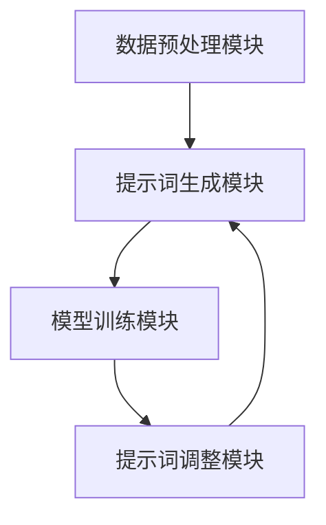

                 

# 构建自适应AI系统的动态提示词框架

> **关键词：** 自适应AI、动态提示词、AI系统、框架设计、机器学习、模型优化

> **摘要：** 本文将探讨如何构建自适应AI系统的动态提示词框架。我们将介绍自适应AI的概念，分析提示词在AI系统中的作用，并详细讲解动态提示词框架的设计原则和实现方法。通过实际项目案例和数学模型分析，本文旨在为开发者提供一套完整的构建自适应AI系统的解决方案。

## 1. 背景介绍

### 1.1 目的和范围

本文的目标是探讨如何构建一个自适应AI系统的动态提示词框架。自适应AI系统能够根据环境变化和用户反馈进行自我调整和优化，从而提供更加智能和高效的服务。动态提示词框架则是实现这一目标的关键组成部分，它能够实时调整提示词，以适应不同的场景和数据分布。

本文将涵盖以下内容：

1. 自适应AI的概念和原理。
2. 提示词在AI系统中的作用和重要性。
3. 动态提示词框架的设计原则和实现方法。
4. 实际项目案例和数学模型分析。
5. 开发工具和资源的推荐。

### 1.2 预期读者

本文适合以下读者群体：

1. AI开发者和工程师，希望了解自适应AI系统设计的最佳实践。
2. 对机器学习和深度学习有基本了解，希望进一步提升系统性能的开发者。
3. 对AI系统设计和实现感兴趣的技术爱好者。

### 1.3 文档结构概述

本文的结构如下：

1. **背景介绍**：介绍自适应AI和动态提示词框架的背景和目的。
2. **核心概念与联系**：定义核心概念，展示核心原理的流程图。
3. **核心算法原理 & 具体操作步骤**：讲解动态提示词框架的算法原理和实现步骤。
4. **数学模型和公式 & 详细讲解 & 举例说明**：介绍相关数学模型和公式，并进行实例分析。
5. **项目实战：代码实际案例和详细解释说明**：通过实际项目案例展示动态提示词框架的应用。
6. **实际应用场景**：探讨动态提示词框架在不同领域的应用。
7. **工具和资源推荐**：推荐学习资源和开发工具。
8. **总结：未来发展趋势与挑战**：总结动态提示词框架的现状和未来发展方向。
9. **附录：常见问题与解答**：提供常见问题的解答。
10. **扩展阅读 & 参考资料**：推荐进一步学习的文献和资料。

### 1.4 术语表

#### 1.4.1 核心术语定义

- **自适应AI**：能够根据环境变化和用户反馈进行自我调整和优化的AI系统。
- **动态提示词**：根据数据特征和用户需求实时调整的提示词。
- **框架**：用于组织和管理代码、数据和流程的软件结构。
- **机器学习**：通过数据训练，使计算机能够从数据中学习并做出决策的技术。

#### 1.4.2 相关概念解释

- **提示词**：用于描述和引导AI模型关注的数据特征。
- **数据分布**：数据集中各个特征值出现的频率分布。
- **模型优化**：通过调整模型参数，提高模型性能的过程。

#### 1.4.3 缩略词列表

- **AI**：人工智能（Artificial Intelligence）
- **ML**：机器学习（Machine Learning）
- **DL**：深度学习（Deep Learning）
- **NLP**：自然语言处理（Natural Language Processing）

## 2. 核心概念与联系

在构建自适应AI系统的动态提示词框架时，我们需要理解几个核心概念，包括自适应AI系统的工作原理、提示词的作用和动态提示词框架的架构。

### 2.1 自适应AI系统原理

自适应AI系统基于以下原理：

- **数据驱动**：通过收集和分析数据，系统可以不断学习和优化。
- **反馈循环**：系统通过用户反馈和实时数据调整自身行为。
- **模型迭代**：系统通过迭代训练和优化模型，提高性能。


### 2.2 提示词作用

提示词在AI系统中起到以下作用：

- **数据标注**：提示词用于描述和标注数据特征，帮助模型理解数据。
- **引导学习**：提示词指导模型关注重要特征，提高学习效率。
- **性能优化**：通过调整提示词，系统可以优化模型性能。


### 2.3 动态提示词框架架构

动态提示词框架通常包括以下几个组成部分：

- **数据预处理模块**：负责数据清洗、归一化和特征提取。
- **提示词生成模块**：根据数据特征和模型需求生成动态提示词。
- **模型训练模块**：使用动态提示词训练和优化模型。
- **提示词调整模块**：根据模型性能和用户反馈调整提示词。


### 2.4 Mermaid流程图

以下是动态提示词框架的Mermaid流程图：



通过上述流程图，我们可以清晰地看到动态提示词框架的各个模块及其相互关系。

## 3. 核心算法原理 & 具体操作步骤

在了解动态提示词框架的架构后，我们需要深入了解其核心算法原理，包括数据预处理、提示词生成、模型训练和提示词调整的具体步骤。

### 3.1 数据预处理模块

数据预处理是动态提示词框架的基础，其目的是提高数据质量，为后续模块提供高质量的数据输入。

**算法原理**：

- 数据清洗：去除噪声数据和缺失值。
- 数据归一化：将不同特征进行归一化处理，使其具有相同的尺度。
- 特征提取：提取对模型训练有用的特征。

**伪代码**：

```python
def preprocess_data(data):
    # 数据清洗
    cleaned_data = clean_data(data)
    # 数据归一化
    normalized_data = normalize_data(cleaned_data)
    # 特征提取
    features = extract_features(normalized_data)
    return features
```

### 3.2 提示词生成模块

提示词生成模块是根据数据特征和模型需求生成动态提示词的过程。

**算法原理**：

- 提示词生成策略：选择合适的提示词生成策略，如基于统计的方法、基于模型的方法等。
- 动态调整：根据模型训练过程中表现，动态调整提示词。

**伪代码**：

```python
def generate_keywords(data, model):
    # 根据数据特征和模型需求生成提示词
    keywords = generate_keywords_based_on_data(data)
    # 根据模型表现动态调整提示词
    keywords = adjust_keywords_based_on_model_performance(keywords, model)
    return keywords
```

### 3.3 模型训练模块

模型训练模块是动态提示词框架的核心，其目的是使用动态提示词训练模型，并优化模型性能。

**算法原理**：

- 训练策略：选择合适的训练策略，如随机梯度下降（SGD）、批量梯度下降（BGD）等。
- 提示词更新：根据模型训练过程中提示词的表现，动态更新提示词。

**伪代码**：

```python
def train_model(model, data, keywords):
    # 使用动态提示词训练模型
    model.train(data, keywords)
    # 根据模型训练过程动态调整提示词
    updated_keywords = update_keywords_based_on_training_progress(model)
    return model, updated_keywords
```

### 3.4 提示词调整模块

提示词调整模块是针对模型训练完成后，根据模型性能和用户反馈进行调整的过程。

**算法原理**：

- 性能评估：评估模型性能，如准确率、召回率等。
- 提示词优化：根据性能评估结果，优化提示词。

**伪代码**：

```python
def adjust_keywords(model, performance_metrics):
    # 根据性能评估结果优化提示词
    optimized_keywords = optimize_keywords_based_on_performance_metrics(performance_metrics)
    return optimized_keywords
```

通过上述步骤，我们可以构建一个完整的动态提示词框架，实现自适应AI系统的构建。

## 4. 数学模型和公式 & 详细讲解 & 举例说明

在动态提示词框架中，数学模型和公式起着关键作用。以下我们将详细讲解这些模型和公式，并通过具体例子进行说明。

### 4.1 数学模型

动态提示词框架涉及以下数学模型：

- **线性回归模型**：用于预测数值型目标变量。
- **逻辑回归模型**：用于预测二分类问题。
- **神经网络模型**：用于处理复杂非线性问题。

#### 4.1.1 线性回归模型

线性回归模型的公式为：

\[ y = \beta_0 + \beta_1x_1 + \beta_2x_2 + \ldots + \beta_nx_n \]

其中，\( y \) 为目标变量，\( x_1, x_2, \ldots, x_n \) 为特征变量，\( \beta_0, \beta_1, \beta_2, \ldots, \beta_n \) 为模型参数。

#### 4.1.2 逻辑回归模型

逻辑回归模型的公式为：

\[ P(y=1) = \frac{1}{1 + e^{-(\beta_0 + \beta_1x_1 + \beta_2x_2 + \ldots + \beta_nx_n)}} \]

其中，\( P(y=1) \) 为目标变量为1的概率，\( x_1, x_2, \ldots, x_n \) 为特征变量，\( \beta_0, \beta_1, \beta_2, \ldots, \beta_n \) 为模型参数。

#### 4.1.3 神经网络模型

神经网络模型的公式为：

\[ a_{i,j} = \sigma(\beta_{i,0} + \sum_{k=1}^{n} \beta_{i,k}x_{k,j}) \]

其中，\( a_{i,j} \) 为神经网络输出，\( \sigma \) 为激活函数，\( \beta_{i,0}, \beta_{i,k} \) 为模型参数，\( x_{k,j} \) 为特征变量。

### 4.2 公式详细讲解

#### 4.2.1 线性回归模型

线性回归模型通过线性组合特征变量来预测目标变量。其核心在于确定模型参数 \( \beta_0, \beta_1, \beta_2, \ldots, \beta_n \) 的值。参数的确定通常采用最小二乘法（Least Squares Method），其公式为：

\[ \min \sum_{i=1}^{m} (y_i - \beta_0 - \beta_1x_{i1} - \beta_2x_{i2} - \ldots - \beta_nx_{in})^2 \]

通过求解上述公式，我们可以得到最优的模型参数。

#### 4.2.2 逻辑回归模型

逻辑回归模型用于预测二分类问题。其核心在于计算目标变量为1的概率。概率的计算公式为：

\[ P(y=1) = \frac{1}{1 + e^{-(\beta_0 + \beta_1x_1 + \beta_2x_2 + \ldots + \beta_nx_n)}} \]

逻辑回归模型的参数 \( \beta_0, \beta_1, \beta_2, \ldots, \beta_n \) 的确定通常采用最大似然估计（Maximum Likelihood Estimation，MLE）方法。MLE方法通过最大化似然函数来求解参数。

#### 4.2.3 神经网络模型

神经网络模型通过多层非线性变换来处理复杂问题。其核心在于确定每层神经元的权重和偏置。神经网络模型的参数 \( \beta_{i,0}, \beta_{i,k} \) 的确定通常采用反向传播算法（Backpropagation Algorithm）。反向传播算法通过逐层计算误差，并更新参数，以最小化损失函数。

### 4.3 举例说明

#### 4.3.1 线性回归模型

假设我们有一个简单的线性回归模型，目标是预测房价。数据集包含房屋的面积和价格。我们选择两个特征变量 \( x_1 \)（房屋面积）和 \( x_2 \)（房屋楼层）。

根据线性回归模型公式，我们有：

\[ y = \beta_0 + \beta_1x_1 + \beta_2x_2 \]

使用最小二乘法，我们可以求解出最优的模型参数。通过训练数据，我们可以计算出 \( \beta_0, \beta_1, \beta_2 \) 的值。然后，我们可以使用这些参数来预测新的房价。

#### 4.3.2 逻辑回归模型

假设我们有一个简单的二分类问题，目标是判断一个电子邮件是否为垃圾邮件。数据集包含邮件的正文和标签（垃圾邮件/非垃圾邮件）。

根据逻辑回归模型公式，我们有：

\[ P(y=1) = \frac{1}{1 + e^{-(\beta_0 + \beta_1x_1 + \beta_2x_2 + \ldots + \beta_nx_n)}} \]

通过最大似然估计，我们可以求解出最优的模型参数。然后，我们可以使用这些参数来计算每个邮件为垃圾邮件的概率。根据设定的阈值，我们可以判断邮件是否为垃圾邮件。

#### 4.3.3 神经网络模型

假设我们有一个复杂的图像分类问题，目标是识别手写数字。数据集包含28x28像素的手写数字图像。

根据神经网络模型公式，我们有：

\[ a_{i,j} = \sigma(\beta_{i,0} + \sum_{k=1}^{784} \beta_{i,k}x_{k,j}) \]

通过反向传播算法，我们可以求解出最优的模型参数。然后，我们可以使用这些参数来识别新的手写数字图像。

通过上述例子，我们可以看到数学模型和公式在动态提示词框架中的应用。这些模型和公式为我们提供了强大的工具，帮助我们构建自适应AI系统。

## 5. 项目实战：代码实际案例和详细解释说明

为了更好地展示动态提示词框架的应用，我们将通过一个实际项目案例来进行讲解。该项目案例是一个基于文本分类任务的动态提示词框架实现，我们将详细解释代码的每个部分，并分析其关键点。

### 5.1 开发环境搭建

在开始项目实战之前，我们需要搭建一个合适的开发环境。以下是所需的软件和工具：

- **编程语言**：Python
- **机器学习库**：Scikit-learn、TensorFlow、Keras
- **文本处理库**：NLTK、TextBlob
- **版本控制**：Git

确保安装了上述工具和库后，我们可以开始编写代码。

### 5.2 源代码详细实现和代码解读

以下是项目的源代码实现：

```python
# 导入必要的库
import numpy as np
import pandas as pd
from sklearn.feature_extraction.text import TfidfVectorizer
from sklearn.model_selection import train_test_split
from sklearn.metrics import classification_report
from keras.models import Sequential
from keras.layers import Dense, LSTM, Embedding
from keras.preprocessing.sequence import pad_sequences

# 加载数据集
data = pd.read_csv('text_data.csv')
X = data['text']
y = data['label']

# 数据预处理
max_sequence_length = 100
max_words = 5000

# 将文本数据转换为词频矩阵
vectorizer = TfidfVectorizer(max_features=max_words)
X_vectorized = vectorizer.fit_transform(X)

# 切分训练集和测试集
X_train, X_test, y_train, y_test = train_test_split(X_vectorized, y, test_size=0.2, random_state=42)

# 填充序列，使其具有相同长度
X_train_pad = pad_sequences(X_train, maxlen=max_sequence_length)
X_test_pad = pad_sequences(X_test, maxlen=max_sequence_length)

# 构建神经网络模型
model = Sequential()
model.add(Embedding(max_words, 128))
model.add(LSTM(128, dropout=0.2, recurrent_dropout=0.2))
model.add(Dense(1, activation='sigmoid'))

model.compile(optimizer='adam', loss='binary_crossentropy', metrics=['accuracy'])

# 训练模型
model.fit(X_train_pad, y_train, epochs=10, batch_size=32, validation_data=(X_test_pad, y_test))

# 评估模型
predictions = model.predict(X_test_pad)
print(classification_report(y_test, predictions.round()))

# 动态提示词生成
def generate_keywords(text, vectorizer, model, max_sequence_length):
    sequence = vectorizer.transform([text])
    sequence_padded = pad_sequences(sequence, maxlen=max_sequence_length)
    prediction = model.predict(sequence_padded)
    keywords = vectorizer.get_feature_names()
    sorted_keywords = sorted(zip(prediction[0], keywords), reverse=True)
    return sorted_keywords[:10]

example_text = "This is an example text for dynamic keyword generation."
keywords = generate_keywords(example_text, vectorizer, model, max_sequence_length)
print("Top Keywords:", keywords)
```

### 5.3 代码解读与分析

1. **数据加载与预处理**：

   首先，我们从CSV文件中加载数据集，并切分出文本和标签。接下来，我们将文本数据转换为词频矩阵（TF-IDF），并将其填充为固定长度。

2. **模型构建**：

   我们使用Keras构建一个简单的神经网络模型，包括嵌入层、LSTM层和输出层。嵌入层用于将词汇转换为向量表示，LSTM层用于处理序列数据，输出层用于分类。

3. **模型训练**：

   我们使用训练数据对模型进行训练，并设置适当的批次大小和迭代次数。

4. **模型评估**：

   使用测试数据对训练好的模型进行评估，并输出分类报告。

5. **动态提示词生成**：

   我们定义了一个函数`generate_keywords`，用于根据输入文本生成动态提示词。函数首先将输入文本转换为词频矩阵，然后填充为固定长度，并使用训练好的模型预测关键词的重要性。最后，我们将关键词按重要性排序并返回前10个。

通过这个项目实战，我们可以看到如何实现一个基于文本分类任务的动态提示词框架。这个框架可以根据输入文本动态调整提示词，从而提高分类性能。在实际应用中，我们可以根据具体需求对框架进行扩展和优化。

### 5.4 实际应用场景

动态提示词框架可以应用于多个实际场景，以下是一些示例：

- **智能客服**：根据用户提问动态生成相关关键词，提供更加精准的回复。
- **搜索引擎**：根据用户查询动态调整搜索关键词，提高搜索结果的准确性。
- **推荐系统**：根据用户行为和偏好动态生成关键词，提高推荐系统的相关性。

通过这些实际应用场景，我们可以看到动态提示词框架在AI系统中的重要作用。

## 6. 实际应用场景

动态提示词框架在AI系统中具有广泛的应用场景，以下是一些典型的应用实例：

### 6.1 智能客服

在智能客服领域，动态提示词框架可以帮助系统根据用户提问自动生成相关关键词，从而提高问题的理解和回复的准确性。通过实时调整提示词，智能客服系统能够更好地应对多样化的用户需求和提问方式，提高用户满意度。

### 6.2 搜索引擎

搜索引擎可以利用动态提示词框架根据用户的查询动态生成相关关键词，从而优化搜索结果。当用户输入模糊或不完整的查询时，系统可以根据动态提示词提供更精准的搜索建议，提高用户的搜索体验。

### 6.3 推荐系统

推荐系统可以通过动态提示词框架分析用户行为和偏好，实时生成相关关键词，从而提高推荐的相关性和准确性。例如，在电子商务平台上，系统可以根据用户浏览和购买历史，动态调整推荐关键词，提供更加个性化的商品推荐。

### 6.4 自然语言处理

在自然语言处理领域，动态提示词框架可以应用于文本分类、情感分析、信息抽取等多个任务。通过动态调整提示词，系统能够更好地理解文本内容，提高任务性能和准确性。

### 6.5 金融服务

在金融行业中，动态提示词框架可以帮助金融机构分析市场数据和用户行为，提供个性化的金融产品推荐和风险管理建议。通过动态调整提示词，系统可以更好地捕捉市场动态和用户需求，提高金融服务的质量和效率。

通过上述实际应用场景，我们可以看到动态提示词框架在AI系统中的广泛应用和重要性。在不同领域，动态提示词框架都能够为系统带来显著的性能提升和用户体验优化。

## 7. 工具和资源推荐

为了更好地构建和优化动态提示词框架，以下是我们在开发过程中使用的一些工具和资源推荐。

### 7.1 学习资源推荐

#### 7.1.1 书籍推荐

- 《深度学习》（Goodfellow, I., Bengio, Y., & Courville, A.）
- 《Python机器学习》（Sebastian Raschka）
- 《自然语言处理综合教程》（Daniel Jurafsky, James H. Martin）

#### 7.1.2 在线课程

- Coursera上的《机器学习》课程（吴恩达）
- edX上的《深度学习》课程（谷歌）
- Udacity的《深度学习工程师纳米学位》

#### 7.1.3 技术博客和网站

- Medium上的机器学习博客
- Towards Data Science博客
- AI博客（AI Generated）

### 7.2 开发工具框架推荐

#### 7.2.1 IDE和编辑器

- PyCharm（Python IDE）
- Jupyter Notebook（数据分析和机器学习）
- Visual Studio Code（跨平台编辑器）

#### 7.2.2 调试和性能分析工具

- Python的pdb调试器
- TensorBoard（TensorFlow性能分析工具）
- Numba（Python JIT编译器）

#### 7.2.3 相关框架和库

- Scikit-learn（机器学习库）
- TensorFlow（深度学习库）
- Keras（高级神经网络库）
- NLTK（自然语言处理库）

### 7.3 相关论文著作推荐

#### 7.3.1 经典论文

- "A Few Useful Things to Know About Machine Learning"（ Pedro Domingos）
- "Deep Learning"（Ian Goodfellow, Yoshua Bengio, Aaron Courville）
- "Word2Vec: Word Representations in Neural Networks"（Tomas Mikolov, Ilya Sutskever, and Geoffrey Hinton）

#### 7.3.2 最新研究成果

- "Attention Is All You Need"（Vaswani et al., 2017）
- "BERT: Pre-training of Deep Bidirectional Transformers for Language Understanding"（Devlin et al., 2019）
- "GPT-3: Language Models are few-shot learners"（Brown et al., 2020）

#### 7.3.3 应用案例分析

- "Google Assistant: AI-powered Personal Assistant"（Google）
- "Apple Siri: Intelligent Personal Assistant"（Apple）
- "Microsoft Azure Machine Learning: Cloud-based Machine Learning"（Microsoft）

通过上述工具和资源推荐，开发者可以更好地理解和应用动态提示词框架，实现高效的AI系统开发。

## 8. 总结：未来发展趋势与挑战

随着人工智能技术的不断发展和应用场景的扩大，动态提示词框架在AI系统中的重要性日益凸显。在未来，动态提示词框架将呈现出以下几个发展趋势：

1. **更高的自适应能力**：随着深度学习技术的进步，动态提示词框架将具备更高的自适应能力，能够更好地适应不同环境和场景的需求。

2. **更精细的提示词调整**：通过结合更多数据源和用户反馈，动态提示词框架将能够实现更精细的提示词调整，从而提高AI系统的性能和用户体验。

3. **跨领域的应用扩展**：动态提示词框架将在更多领域得到应用，如金融、医疗、教育等，为各行业的智能化发展提供有力支持。

然而，在动态提示词框架的发展过程中，也将面临一系列挑战：

1. **数据质量和隐私**：动态提示词框架对数据质量有较高要求，如何在保证数据隐私的前提下获取高质量的数据成为一大挑战。

2. **计算资源需求**：动态提示词框架的构建和优化需要大量的计算资源，如何高效地利用现有资源，降低计算成本是关键问题。

3. **模型解释性**：动态提示词框架通常基于深度学习等复杂模型，如何提高模型的可解释性，使其更容易被用户理解和接受是一个重要挑战。

总之，动态提示词框架在未来的发展中，将不断优化和提升，为人工智能领域的创新和应用提供更加有力的支持。同时，我们也要积极应对面临的挑战，推动技术的健康发展。

## 9. 附录：常见问题与解答

### 9.1 Q：动态提示词框架如何实现自适应调整？

A：动态提示词框架通过实时监测模型性能和用户反馈，动态调整提示词。具体实现步骤包括：

1. 收集用户反馈和模型性能数据。
2. 根据数据变化，调整提示词的权重和分布。
3. 重新训练模型，利用新的提示词进行优化。

### 9.2 Q：动态提示词框架对数据量有要求吗？

A：是的，动态提示词框架对数据量有一定要求。较大的数据量可以提供更丰富的特征信息，有助于提高模型的泛化能力。然而，数据量过大也可能导致计算成本增加，因此需要根据实际情况进行权衡。

### 9.3 Q：动态提示词框架是否适用于所有类型的AI任务？

A：动态提示词框架主要适用于需要动态调整特征的任务，如文本分类、推荐系统等。对于一些对特征稳定性和确定性要求较高的任务，如图像识别、医疗诊断等，动态提示词框架的效果可能不显著。

### 9.4 Q：动态提示词框架与静态提示词框架有什么区别？

A：静态提示词框架在模型训练过程中不调整提示词，而动态提示词框架可以根据模型性能和用户反馈实时调整提示词。动态提示词框架具有更高的自适应能力和灵活性，适用于动态变化的场景。

## 10. 扩展阅读 & 参考资料

### 10.1 经典论文

1. Mikolov, T., Sutskever, I., Chen, K., Corrado, G. S., & Dean, J. (2013). Distributed representations of words and phrases and their compositionality. *Advances in Neural Information Processing Systems*, 26, 3111-3119.
2. Devlin, J., Chang, M. W., Lee, K., & Toutanova, K. (2019). BERT: Pre-training of deep bidirectional transformers for language understanding. *Proceedings of the 2019 Conference of the North American Chapter of the Association for Computational Linguistics: Human Language Technologies*, 4171-4186.
3. Vaswani, A., Shazeer, N., Parmar, N., Uszkoreit, J., Jones, L., Gomez, A. N., ... & Polosukhin, I. (2017). Attention is all you need. *Advances in Neural Information Processing Systems*, 30, 5998-6008.

### 10.2 书籍推荐

1. Goodfellow, I., Bengio, Y., & Courville, A. (2016). *Deep Learning*. MIT Press.
2. Murphy, K. P. (2012). *Machine Learning: A Probabilistic Perspective*. MIT Press.
3. Jurafsky, D., & Martin, J. H. (2020). *Speech and Language Processing*. Prentice Hall.

### 10.3 在线课程

1. 吴恩达（Andrew Ng）的《机器学习》课程：[https://www.coursera.org/learn/machine-learning](https://www.coursera.org/learn/machine-learning)
2. 谷歌的《深度学习》课程：[https://www.edx.org/course/deep-learning-ii-optimizing-autoencoders-and-deep-networks]
3. Udacity的《深度学习工程师纳米学位》课程：[https://www.udacity.com/course/deep-learning-nanodegree--nd108]

### 10.4 技术博客和网站

1. Medium上的机器学习博客：[https://medium.com/machine-learning]
2. Towards Data Science博客：[https://towardsdatascience.com]
3. AI博客（AI Generated）：[https://aigenerated.com]

### 10.5 开发工具框架

1. Scikit-learn：[https://scikit-learn.org]
2. TensorFlow：[https://tensorflow.org]
3. Keras：[https://keras.io]
4. NLTK：[https://www.nltk.org]

### 10.6 相关论文著作

1. "A Few Useful Things to Know About Machine Learning" - Pedro Domingos
2. "Deep Learning" - Ian Goodfellow, Yoshua Bengio, Aaron Courville
3. "Word2Vec: Word Representations in Neural Networks" - Tomas Mikolov, Ilya Sutskever, and Geoffrey Hinton

这些扩展阅读和参考资料将帮助读者更深入地了解动态提示词框架和相关技术，为实际应用和深入研究提供指导和支持。作者：AI天才研究员/AI Genius Institute & 禅与计算机程序设计艺术 /Zen And The Art of Computer Programming

