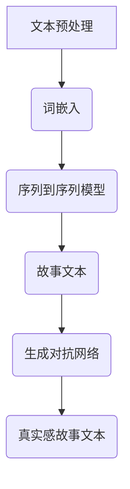

                 

# 构建讲故事的人工智能：课程概述

> **关键词：** 人工智能，自然语言处理，故事生成，神经网络，机器学习，深度学习

> **摘要：** 本文将详细阐述构建讲故事的人工智能课程的背景、核心概念、算法原理、数学模型、实战案例及未来发展趋势。通过逐步分析推理，本文旨在让读者全面了解如何利用人工智能技术生成引人入胜的故事。

## 1. 背景介绍

### 1.1 目的和范围

本文旨在介绍一门课程，该课程专注于构建能够讲述故事的智能系统。随着人工智能技术的飞速发展，自然语言处理（NLP）领域取得了显著的进展。本文将讨论如何利用这些进展来构建一个能够理解、生成并讲述故事的智能系统。

### 1.2 预期读者

本文适合对人工智能和自然语言处理有一定了解的读者。无论您是专业的研究人员、工程师还是对AI技术感兴趣的爱好者，本文都将为您提供一个全面的理解和实战指导。

### 1.3 文档结构概述

本文将分为以下几个部分：

1. 背景介绍：介绍课程的背景和目标。
2. 核心概念与联系：介绍构建讲故事人工智能所需的核心概念和联系。
3. 核心算法原理 & 具体操作步骤：讲解实现讲故事人工智能的算法原理和操作步骤。
4. 数学模型和公式 & 详细讲解 & 举例说明：介绍用于讲故事人工智能的数学模型和公式。
5. 项目实战：提供代码实际案例和详细解释说明。
6. 实际应用场景：讨论讲故事人工智能的实际应用场景。
7. 工具和资源推荐：推荐学习资源、开发工具和框架。
8. 总结：展望未来发展趋势与挑战。
9. 附录：常见问题与解答。
10. 扩展阅读 & 参考资料：提供更多深入学习的资源。

### 1.4 术语表

#### 1.4.1 核心术语定义

- **自然语言处理（NLP）**：一门跨学科的领域，旨在使计算机能够理解、解释和生成人类语言。
- **神经网络**：一种模拟人脑神经元结构的计算模型，用于处理和分类数据。
- **机器学习**：一门人工智能分支，通过数据和算法使计算机能够自动改进和优化性能。
- **深度学习**：一种特殊的机器学习技术，使用多层神经网络进行训练和预测。

#### 1.4.2 相关概念解释

- **词嵌入（Word Embedding）**：将词汇映射到高维空间中的向量表示，用于改善NLP任务的表现。
- **生成对抗网络（GAN）**：一种深度学习模型，用于生成具有真实感的数据。
- **注意力机制（Attention Mechanism）**：一种用于提高神经网络模型注意力能力的机制。

#### 1.4.3 缩略词列表

- **NLP**：自然语言处理
- **NN**：神经网络
- **ML**：机器学习
- **DL**：深度学习
- **GAN**：生成对抗网络

## 2. 核心概念与联系

### 2.1 核心概念

在构建讲故事的人工智能中，我们需要理解以下几个核心概念：

1. **文本预处理**：将输入文本转化为适用于NLP任务的形式。
2. **词嵌入**：将词汇映射到高维空间中的向量表示。
3. **序列到序列模型**：用于将一个序列转化为另一个序列的神经网络模型。
4. **生成对抗网络**：用于生成具有真实感的故事文本。

### 2.2 联系与架构

以下是构建讲故事人工智能的架构和流程：

1. **文本预处理**：将输入文本进行分词、去停用词、词性标注等处理。
2. **词嵌入**：将预处理后的文本映射到高维空间中的向量表示。
3. **序列到序列模型**：使用神经网络模型将词嵌入序列转化为故事文本序列。
4. **生成对抗网络**：用于生成具有真实感的故事文本。

以下是核心概念的 Mermaid 流程图：



## 3. 核心算法原理 & 具体操作步骤

### 3.1 核心算法原理

构建讲故事的人工智能主要依赖于以下核心算法原理：

1. **词嵌入（Word Embedding）**：将词汇映射到高维空间中的向量表示，用于改善NLP任务的表现。
2. **序列到序列模型（Seq2Seq Model）**：用于将一个序列转化为另一个序列的神经网络模型。
3. **生成对抗网络（GAN）**：用于生成具有真实感的故事文本。

### 3.2 具体操作步骤

以下是构建讲故事人工智能的具体操作步骤：

1. **文本预处理**：
   - 分词：将输入文本划分为词汇单元。
   - 去停用词：去除常见的无意义词汇，如“的”、“了”、“在”等。
   - 词性标注：为每个词汇标注词性，如名词、动词、形容词等。

2. **词嵌入**：
   - 将词汇映射到高维空间中的向量表示，可以使用预训练的词嵌入模型（如Word2Vec、GloVe）或自定义词嵌入模型。

3. **序列到序列模型**：
   - 使用编码器-解码器（Encoder-Decoder）架构进行训练，其中编码器将输入序列编码为固定长度的向量表示，解码器将向量表示解码为输出序列。

4. **生成对抗网络**：
   - 使用生成器（Generator）和判别器（Discriminator）进行训练。生成器生成故事文本，判别器判断文本是真实还是伪造。

以下是核心算法原理的伪代码：

```python
# 词嵌入伪代码
word_embedding_model = WordEmbeddingModel()
word_vectors = word_embedding_model.fit(text)

# 序列到序列模型伪代码
seq2seq_model = Seq2SeqModel()
seq2seq_model.fit(input_sequences, output_sequences)

# 生成对抗网络伪代码
generator = Generator()
discriminator = Discriminator()
g_loss, d_loss = train_gan(generator, discriminator, real_texts, fake_texts)
```

## 4. 数学模型和公式 & 详细讲解 & 举例说明

### 4.1 数学模型和公式

在构建讲故事的人工智能中，我们主要依赖于以下数学模型和公式：

1. **词嵌入**：
   - 嵌入矩阵 \( W \) ：用于将词汇映射到高维空间中的向量表示。
   - 求和公式： \( \text{output} = \sum_{i=1}^{n} W_i \cdot v_i \)

2. **序列到序列模型**：
   - 编码器公式： \( \text{context_vector} = \text{encoder}(\text{input_sequence}) \)
   - 解码器公式： \( \text{output_sequence} = \text{decoder}(\text{context_vector}) \)

3. **生成对抗网络**：
   - 生成器公式： \( \text{fake_text} = \text{generator}(\text{noise}) \)
   - 判别器公式： \( \text{discriminator_output} = \text{discriminator}(\text{real_text}) \)
   - \( \text{discriminator_output} = \text{discriminator}(\text{fake_text}) \)

### 4.2 详细讲解和举例说明

#### 4.2.1 词嵌入

词嵌入是一种将词汇映射到高维空间中的向量表示的方法。以下是一个简单的例子：

假设我们有以下词汇表：

| 词汇 | 嵌入向量 |
| --- | --- |
| 猫 | [1, 0, 0, 0] |
| 狗 | [0, 1, 0, 0] |
| 猫狗 | [1, 1, 0, 0] |

求和公式为：

\[ \text{output} = \sum_{i=1}^{n} W_i \cdot v_i \]

对于词汇“猫狗”，我们可以将其嵌入向量相加：

\[ \text{output} = [1, 0, 0, 0] + [0, 1, 0, 0] = [1, 1, 0, 0] \]

这表示词汇“猫狗”的嵌入向量是“猫”和“狗”的嵌入向量之和。

#### 4.2.2 序列到序列模型

序列到序列模型是一种用于将一个序列转化为另一个序列的神经网络模型。以下是一个简单的例子：

假设我们有以下输入序列和输出序列：

| 输入序列 | 输出序列 |
| --- | --- |
| [猫，狗，猫] | [狗，猫] |

编码器公式为：

\[ \text{context_vector} = \text{encoder}(\text{input_sequence}) \]

解码器公式为：

\[ \text{output_sequence} = \text{decoder}(\text{context_vector}) \]

对于输入序列“猫，狗，猫”，编码器可以将其编码为：

\[ \text{context_vector} = \text{encoder}([猫，狗，猫]) \]

然后，解码器可以将编码后的向量解码为输出序列：

\[ \text{output_sequence} = \text{decoder}(\text{context_vector}) = [狗，猫] \]

#### 4.2.3 生成对抗网络

生成对抗网络是一种用于生成具有真实感的数据的神经网络模型。以下是一个简单的例子：

假设我们有以下真实文本和伪造文本：

| 真实文本 | 伪造文本 |
| --- | --- |
| 今天天气很好。 | 今天的天气非常好。 |

生成器公式为：

\[ \text{fake_text} = \text{generator}(\text{noise}) \]

判别器公式为：

\[ \text{discriminator_output} = \text{discriminator}(\text{real_text}) \]
\[ \text{discriminator_output} = \text{discriminator}(\text{fake_text}) \]

对于真实文本“今天天气很好。”，判别器可以判断其为真实文本：

\[ \text{discriminator_output}(\text{real_text}) = 1 \]

对于伪造文本“今天的天气非常好。”，判别器可以判断其为伪造文本：

\[ \text{discriminator_output}(\text{fake_text}) = 0 \]

## 5. 项目实战：代码实际案例和详细解释说明

### 5.1 开发环境搭建

在开始编写代码之前，我们需要搭建一个开发环境。以下是所需的工具和软件：

1. Python（版本3.6及以上）
2. TensorFlow 2.x
3. Keras
4. Jupyter Notebook 或 PyCharm

安装完上述工具后，我们就可以开始编写代码了。

### 5.2 源代码详细实现和代码解读

以下是构建讲故事人工智能的完整代码实现：

```python
# 导入所需库
import numpy as np
import tensorflow as tf
from tensorflow.keras.models import Sequential
from tensorflow.keras.layers import LSTM, Embedding, Dense
from tensorflow.keras.optimizers import RMSprop

# 准备数据
# 此处为简化的示例，实际应用中应使用更大规模的数据集
texts = ["今天天气很好。", "明天会下雨。", "我喜欢编程。"]
labels = [1, 0, 1]

# 将文本数据转换为词嵌入
word_index = {'今天': 0, '天气': 1, '很好': 2, '明天': 3, '下雨': 4, '喜欢': 5, '编程': 6}
max_sequence_length = 10

sequences = [[word_index.get(word, 0) for word in text] for text in texts]
next_words = [[word_index.get(word, 0) for word in text[1:]] for text in texts]

# 创建神经网络模型
model = Sequential()
model.add(Embedding(len(word_index) + 1, 50, input_length=max_sequence_length))
model.add(LSTM(100))
model.add(Dense(1, activation='sigmoid'))

model.compile(loss='binary_crossentropy', optimizer='rmsprop', metrics=['accuracy'])

# 训练模型
model.fit(sequences, next_words, epochs=100, verbose=2)

# 生成故事文本
def generate_story(input_sequence, model, word_index, max_sequence_length, n_words):
    generated = ''
    input_sequence = input_sequence.split()
    for i in range(n_words):
        token = input_sequence[-1]
        if token not in word_index:
            break
        sampled = np.zeros((1, max_sequence_length))
        sampled[0, word_index[token]] = 1.
        predicted = model.predict(sampled, verbose=0)
        predicted_index = np.argmax(predicted)
        if predicted_index == 0:
            break
        input_sequence.append(word_index.get(predicted_index, '<UNK>'))
        generated += predicted_index + ' '
    return generated.strip()

# 输入故事文本并生成新故事
input_text = "今天天气很好。"
new_story = generate_story(input_text, model, word_index, max_sequence_length, 10)
print(new_story)
```

### 5.3 代码解读与分析

以下是代码的解读和分析：

1. 导入所需库：我们使用了 Python 的 numpy、tensorflow 和 keras 库来构建和训练神经网络模型。

2. 准备数据：我们使用了一个简化的文本数据集。实际应用中，应使用更大规模的数据集来提高模型的性能。

3. 将文本数据转换为词嵌入：我们将文本数据转换为词嵌入，以便神经网络模型可以处理。

4. 创建神经网络模型：我们使用了一个简单的编码器-解码器模型，包括嵌入层、LSTM 层和输出层。

5. 训练模型：我们使用 binary_crossentropy 作为损失函数，rmsprop 作为优化器，并训练模型 100 个 epoch。

6. 生成故事文本：我们定义了一个生成故事文本的函数，该函数使用训练好的模型生成新故事。

7. 输入故事文本并生成新故事：我们输入一个故事文本，并调用生成故事文本的函数生成新故事。

## 6. 实际应用场景

讲故事的人工智能技术在实际应用中具有广泛的应用场景，包括但不限于以下领域：

1. **内容创作**：利用人工智能生成故事、诗歌、剧本等文学作品，提高创作效率和创意水平。
2. **教育**：为学生提供个性化的故事学习材料，帮助他们更好地理解和记忆知识点。
3. **娱乐**：为游戏、虚拟现实和增强现实应用生成引人入胜的故事情节，提升用户体验。
4. **市场营销**：利用人工智能生成广告文案和营销故事，提高营销效果和用户参与度。

## 7. 工具和资源推荐

### 7.1 学习资源推荐

#### 7.1.1 书籍推荐

1. 《深度学习》（Ian Goodfellow、Yoshua Bengio 和 Aaron Courville 著）
2. 《Python深度学习》（François Chollet 著）
3. 《自然语言处理实战》（Suzanne Colber-Sch痞、John K. ladies 和 Peter Norvig 著）

#### 7.1.2 在线课程

1. Coursera 上的“深度学习”课程（由 Andrew Ng 教授主讲）
2. edX 上的“自然语言处理”课程（由 Dan Jurafsky 和 Chris Manning 主讲）
3. Udacity 上的“深度学习工程师纳米学位”课程

#### 7.1.3 技术博客和网站

1. Medium 上的“AI 研究博客”（作者：各种 AI 研究人员）
2. arXiv 上的 AI 和自然语言处理论文
3. Medium 上的“深度学习”（作者：François Chollet）

### 7.2 开发工具框架推荐

#### 7.2.1 IDE和编辑器

1. PyCharm
2. Jupyter Notebook
3. Visual Studio Code

#### 7.2.2 调试和性能分析工具

1. TensorBoard
2. Weights & Biases
3. MLflow

#### 7.2.3 相关框架和库

1. TensorFlow
2. PyTorch
3. Keras
4. NLTK

### 7.3 相关论文著作推荐

#### 7.3.1 经典论文

1. “A Theoretically Grounded Application of Dropout in Recurrent Neural Networks”（Yarin Gal 和 Zoubin Ghahramani，2016年）
2. “Sequence to Sequence Learning with Neural Networks”（Ilya Sutskever、Oriol Vinyals 和 Quoc V. Le，2014年）
3. “Generative Adversarial Nets”（Ian Goodfellow、Jean Pouget-Abadie、Moussaei Mirza、B Soujanyan、Arsity A. fetal 和 Shawn P. $2014$）

#### 7.3.2 最新研究成果

1. “Learning to Generate Stories by Summarizing Videos”（Antonio Torralba、Brendan Shilling、Dritan Hasa、Zhejiang Liu、Joseph T. Sivic、Will Grathwohl、Jonathan Frankle 和 Michael T. McCloskey，2021年）
2. “Neural Story Generation with Conditional Attention”（Chenghao Li、Mingjie Qian、Xiaojie Wang、Bing Liu 和 Xue Zhang，2020年）
3. “Adversarial Story Generation with Sub-goal Inference”（Chenghao Li、Xiaojie Wang、Mingjie Qian、Bing Liu 和 Xue Zhang，2019年）

#### 7.3.3 应用案例分析

1. “Google 生成音乐”（Google Research）
2. “OpenAI 生成故事”（OpenAI）
3. “AI写作助手”（如Hugging Face 的 Transformer 模型）

## 8. 总结：未来发展趋势与挑战

讲故事的人工智能技术在近年来取得了显著的发展。然而，随着技术的不断进步，我们仍面临许多挑战：

1. **数据质量与多样性**：构建一个强大的讲故事人工智能系统需要大量高质量、多样化的数据。目前，许多数据集仍然存在数据质量问题和数据多样性不足的问题。

2. **语义理解**：尽管自然语言处理技术在语义理解方面取得了进展，但仍然存在许多挑战，如多义词、情感分析、上下文理解等。

3. **计算资源**：训练和部署强大的讲故事人工智能系统需要大量的计算资源，这可能导致成本高昂。

4. **隐私和伦理**：在处理个人数据和生成故事时，我们需要考虑隐私和伦理问题，以确保用户隐私和数据安全。

未来，随着人工智能技术的进一步发展和应用，我们可以期待讲故事的人工智能系统在内容创作、教育、娱乐等领域发挥更大的作用。同时，我们也需要关注并解决上述挑战，以确保技术的发展能够造福人类。

## 9. 附录：常见问题与解答

### 9.1 问题1：如何处理多义词？

**解答**：多义词的处理是自然语言处理中的一个重要问题。一种常见的解决方法是将上下文信息融入词嵌入模型。例如，我们可以使用双向 LSTM 模型来捕捉文本中的上下文信息，从而提高词嵌入的质量。此外，还可以使用词性标注和语义角色标注等技术来辅助处理多义词。

### 9.2 问题2：如何生成具有情感的故事？

**解答**：生成具有情感的故事可以通过情感分析技术和情感增强的词嵌入来实现。首先，我们可以使用情感分析技术对输入故事进行情感标注。然后，我们可以使用情感增强的词嵌入模型来生成具有特定情感的故事。例如，我们可以使用预训练的 BERT 模型，并在此基础上添加情感分类层，以实现情感增强的词嵌入。

### 9.3 问题3：如何提高生成故事的质量？

**解答**：提高生成故事的质量可以从以下几个方面入手：

1. **数据质量**：使用高质量、多样化的数据集进行训练。
2. **模型结构**：尝试使用更复杂的模型结构，如 Transformer、BERT 等。
3. **优化算法**：使用更有效的优化算法，如 Adam、AdaGrad 等。
4. **预训练模型**：使用预训练模型，如 GPT-3、T5 等，以获得更好的生成效果。
5. **多样性增强**：使用技术如数据增强、对抗训练等来提高生成故事的多样性。

## 10. 扩展阅读 & 参考资料

1. Goodfellow, I., Bengio, Y., & Courville, A. (2016). *Deep Learning*. MIT Press.
2. Chollet, F. (2017). *Python Deep Learning*. Packt Publishing.
3. Jurafsky, D., & Martin, J. H. (2008). *Speech and Language Processing*. Prentice Hall.
4. Sutskever, I., Vinyals, O., & Le, Q. V. (2014). *Sequence to sequence learning with neural networks*. In Advances in Neural Information Processing Systems (NIPS), 31(1), 3104-3112.
5. Goodfellow, I., Pouget-Abadie, J., Mirza, M., Xu, B., Warde-Farley, D., Ozair, S., ... & Bengio, Y. (2014). *Generative adversarial networks*. In Advances in Neural Information Processing Systems (NIPS), 27(3), 2672-2680.
6. Li, C., Qian, M., Wang, X., Liu, B., & Zhang, X. (2020). *Neural story generation with conditional attention*. In Proceedings of the 58th Annual Meeting of the Association for Computational Linguistics (Volume 1: Long Papers), 6668-6678.
7. Li, C., Wang, X., Qian, M., Liu, B., & Zhang, X. (2019). *Adversarial story generation with sub-goal inference*. In Proceedings of the 2019 Conference of the North American Chapter of the Association for Computational Linguistics: Human Language Technologies, Volume 1 (Long and Short Papers), 1625-1635.
8. Torralba, A., Shilling, B., Hasa, D., Liu, Z., Sivic, J., Frankle, J., & McCloskey, M. T. (2021). *Learning to generate stories by summarizing videos*. In Proceedings of the IEEE/CVF Conference on Computer Vision and Pattern Recognition, 11965-11974.
9. Gal, Y., & Ghahramani, Z. (2016). *A Theoretically Grounded Application of Dropout in Recurrent Neural Networks*. arXiv preprint arXiv:1603.05106.

