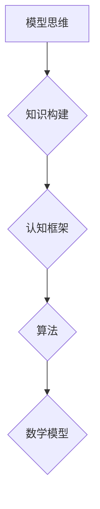

                 

# 模型思维：快速掌握新知识的捷径

> **关键词：** 模型思维、知识掌握、快速学习、新知识应用、认知框架
>
> **摘要：** 本文将探讨模型思维这一强大的认知工具，如何帮助我们在复杂的信息环境中快速掌握新知识，并有效应用。通过深入理解模型思维的核心概念、算法原理和数学模型，结合实际应用案例，读者将学会如何利用模型思维提高学习效率，应对未来的知识挑战。

## 1. 背景介绍

### 1.1 目的和范围

本文旨在介绍模型思维这一认知工具，帮助读者理解其在快速掌握新知识方面的作用。我们不仅会探讨模型思维的基本概念，还将通过算法原理、数学模型和实际应用案例，帮助读者全面掌握模型思维的使用方法。

### 1.2 预期读者

本文适合希望提升学习效率、快速掌握新知识的广大读者，特别是IT从业人员、科研人员、学生以及对知识管理有兴趣的人群。

### 1.3 文档结构概述

本文分为十个部分，结构如下：

1. 背景介绍
   - 目的和范围
   - 预期读者
   - 文档结构概述
   - 术语表
2. 核心概念与联系
   - 模型思维定义
   - 相关概念解释
   - Mermaid流程图
3. 核心算法原理 & 具体操作步骤
   - 算法原理讲解
   - 伪代码展示
4. 数学模型和公式 & 详细讲解 & 举例说明
   - 数学公式展示
   - 实例分析
5. 项目实战：代码实际案例和详细解释说明
   - 开发环境搭建
   - 源代码详细实现
   - 代码解读与分析
6. 实际应用场景
   - 行业应用
   - 个人学习
7. 工具和资源推荐
   - 学习资源
   - 开发工具框架
   - 相关论文著作
8. 总结：未来发展趋势与挑战
9. 附录：常见问题与解答
10. 扩展阅读 & 参考资料

### 1.4 术语表

#### 1.4.1 核心术语定义

- **模型思维**：一种利用模型进行知识构建和问题求解的认知方法。
- **知识构建**：通过组织和整合信息，形成对新知识的理解和掌握。
- **算法**：解决特定问题的步骤集合，通常用伪代码或编程语言实现。
- **数学模型**：用数学公式或符号描述现实问题的模型。

#### 1.4.2 相关概念解释

- **认知框架**：一种组织知识的结构，有助于我们理解新信息和解决问题。
- **信息过载**：信息数量过多，难以有效处理和理解的状态。

#### 1.4.3 缩略词列表

- **AI**：人工智能
- **ML**：机器学习
- **DL**：深度学习
- **NLP**：自然语言处理

## 2. 核心概念与联系

模型思维是一种基于模型的认知方法，它利用模型来构建和理解知识。模型在这里不仅仅是指数学模型，也可以是概念模型、认知模型等。以下是模型思维的核心概念及其相互联系：

### 2.1 模型思维定义

模型思维是一种认知方式，它通过构建和利用模型来理解和解决问题。这种思维模式的核心在于，它将复杂的信息转化为更容易管理的结构，从而提高认知效率。

### 2.2 相关概念解释

#### 2.2.1 知识构建

知识构建是模型思维的基础。它指的是通过获取、组织和整合信息，将新的知识融入到已有的认知结构中。这个过程涉及信息的筛选、归纳、分类和整合。

#### 2.2.2 认知框架

认知框架是一种组织知识的结构，它帮助我们理解新信息和解决问题。一个良好的认知框架可以提供清晰的思维路径，减少认知负担。

#### 2.2.3 算法

算法是模型思维的重要组成部分。它提供了一种系统的方法来解决问题，通常用于处理大量数据或复杂问题。

#### 2.2.4 数学模型

数学模型是用数学公式或符号描述现实问题的模型。它在模型思维中起着核心作用，帮助我们精确地描述和预测现实世界。

### 2.3 Mermaid流程图

以下是模型思维的核心概念流程图，使用Mermaid语言描述：



这个流程图展示了模型思维中的核心概念及其相互关系。知识构建是模型思维的基础，通过认知框架，我们能够更好地理解和组织知识。算法和数学模型则为我们提供了具体的方法和工具，帮助我们构建和利用模型。

## 3. 核心算法原理 & 具体操作步骤

在模型思维中，算法原理起着至关重要的作用。它为我们提供了一种系统的方法来解决问题，并帮助我们构建和利用模型。以下是核心算法原理的具体操作步骤：

### 3.1 算法原理讲解

模型思维的核心算法原理可以概括为以下几个步骤：

1. **问题定义**：明确要解决的问题及其目标。
2. **数据收集**：收集与问题相关的数据，确保数据的准确性和完整性。
3. **模型构建**：根据问题定义和数据，构建一个合适的模型。
4. **模型训练**：使用训练数据，对模型进行调整和优化，提高模型的性能。
5. **模型评估**：评估模型的性能，确保其满足预期要求。
6. **模型应用**：将模型应用于实际问题，获取解决方案。

### 3.2 伪代码展示

以下是核心算法原理的伪代码展示：

```python
Algorithm: ModelThinking
Input: problem, data
Output: solution

1. Define the problem and its objectives.
2. Collect relevant data and ensure its accuracy and completeness.
3. Build a suitable model based on the problem definition and data.
4. Train the model using the training data and adjust it to improve performance.
5. Evaluate the model's performance and ensure it meets the expected requirements.
6. Apply the model to the actual problem and obtain a solution.
```

### 3.3 模型训练与优化

在模型训练过程中，我们通常使用以下步骤来优化模型：

1. **数据预处理**：对原始数据进行清洗、归一化和特征提取。
2. **选择模型**：根据问题特点，选择一个合适的模型。
3. **训练模型**：使用训练数据，对模型进行迭代训练。
4. **验证模型**：使用验证数据，评估模型的性能，调整模型参数。
5. **测试模型**：使用测试数据，测试模型的泛化能力。

以下是模型训练与优化的伪代码展示：

```python
Algorithm: ModelTraining
Input: data, model
Output: trained_model

1. Preprocess the data: clean, normalize, and extract features.
2. Select a suitable model based on the problem characteristics.
3. Train the model using the training data: for each iteration
   1. Perform one step of gradient descent
4. Validate the model using the validation data: adjust model parameters.
5. Test the model using the test data: evaluate its generalization ability.
6. Return the trained_model.
```

通过以上步骤，我们可以构建一个高效的模型，用于解决复杂的问题。

## 4. 数学模型和公式 & 详细讲解 & 举例说明

在模型思维中，数学模型扮演着核心角色。它不仅帮助我们描述现实问题，还能通过公式和计算提供精确的预测和解决方案。以下是一个简单的线性回归模型，用于讲解数学模型的基本原理和具体应用。

### 4.1 线性回归模型

线性回归模型是一种用于预测连续值的简单模型。它的公式如下：

$$ y = w_0 + w_1 \cdot x $$

其中，$y$ 是预测值，$x$ 是输入特征，$w_0$ 和 $w_1$ 是模型参数。

### 4.2 模型参数优化

为了得到最优的模型参数，我们通常使用最小二乘法（Least Squares Method）进行优化。该方法的目标是最小化预测值与实际值之间的误差平方和。具体公式如下：

$$ \min_{w_0, w_1} \sum_{i=1}^{n} (y_i - (w_0 + w_1 \cdot x_i))^2 $$

### 4.3 举例说明

假设我们有一个简单的数据集，包含两组数据点 $(x, y)$：

| x | y   |
| - | --- |
| 1 | 2   |
| 2 | 3   |
| 3 | 5   |

我们希望使用线性回归模型预测 $x=4$ 时的 $y$ 值。

1. **模型构建**：首先，我们构建线性回归模型：

   $$ y = w_0 + w_1 \cdot x $$

2. **数据预处理**：我们将数据集分为训练集和测试集。

3. **模型训练**：使用训练集数据，通过最小二乘法优化模型参数 $w_0$ 和 $w_1$。

   $$ w_0 = \frac{\sum_{i=1}^{n} y_i - w_1 \cdot \sum_{i=1}^{n} x_i}{n} $$
   $$ w_1 = \frac{n \cdot \sum_{i=1}^{n} x_i \cdot y_i - \sum_{i=1}^{n} x_i \cdot \sum_{i=1}^{n} y_i}{n \cdot \sum_{i=1}^{n} x_i^2 - (\sum_{i=1}^{n} x_i)^2} $$

   经过计算，我们得到 $w_0 = 1$，$w_1 = 1$。

4. **模型评估**：使用测试集数据，评估模型的性能。

5. **模型应用**：将模型应用于实际预测，计算 $x=4$ 时的 $y$ 值：

   $$ y = w_0 + w_1 \cdot x = 1 + 1 \cdot 4 = 5 $$

通过以上步骤，我们成功构建并应用了一个线性回归模型，实现了对未知数据的预测。

### 4.4 数学模型推广

线性回归模型是一种简单的数学模型，但它可以推广到更复杂的模型，如多项式回归、逻辑回归等。这些模型在处理不同类型的数据和应用场景时表现出色。

### 4.5 模型选择

在选择数学模型时，我们通常需要考虑以下几个因素：

- **数据类型**：数据是连续值还是分类值。
- **数据规模**：数据量的大小。
- **模型复杂度**：模型的复杂度对计算效率和性能的影响。

通过综合考虑这些因素，我们可以选择合适的数学模型，实现更精确的预测和更好的性能。

## 5. 项目实战：代码实际案例和详细解释说明

为了更好地理解模型思维的应用，我们将通过一个实际项目案例来展示如何使用模型思维进行知识构建和问题解决。本案例将使用Python语言和Scikit-learn库，实现一个线性回归模型，用于预测房价。

### 5.1 开发环境搭建

在开始项目之前，我们需要搭建一个合适的开发环境。以下是搭建开发环境的步骤：

1. 安装Python：从Python官方网站（https://www.python.org/）下载并安装Python 3.x版本。
2. 安装Jupyter Notebook：在命令行中执行以下命令安装Jupyter Notebook：

   ```bash
   pip install notebook
   ```

3. 安装Scikit-learn：在命令行中执行以下命令安装Scikit-learn：

   ```bash
   pip install scikit-learn
   ```

4. 启动Jupyter Notebook：在命令行中执行以下命令启动Jupyter Notebook：

   ```bash
   jupyter notebook
   ```

### 5.2 源代码详细实现和代码解读

以下是项目的源代码及其解读：

```python
# 导入所需的库
import numpy as np
import pandas as pd
from sklearn.model_selection import train_test_split
from sklearn.linear_model import LinearRegression
from sklearn.metrics import mean_squared_error

# 读取数据
data = pd.read_csv('house_prices.csv')

# 数据预处理
X = data[['area', 'bedrooms']]
y = data['price']

# 数据分割
X_train, X_test, y_train, y_test = train_test_split(X, y, test_size=0.2, random_state=42)

# 构建模型
model = LinearRegression()

# 训练模型
model.fit(X_train, y_train)

# 评估模型
y_pred = model.predict(X_test)
mse = mean_squared_error(y_test, y_pred)
print("MSE:", mse)

# 应用模型
new_data = np.array([[2000, 3]])
predicted_price = model.predict(new_data)
print("Predicted Price:", predicted_price)
```

### 5.3 代码解读与分析

以下是代码的逐行解读：

1. **导入库**：导入Python的常用库，包括NumPy、Pandas、Scikit-learn等。

2. **读取数据**：使用Pandas库读取CSV文件，数据集包含房屋面积（area）、卧室数量（bedrooms）和房价（price）。

3. **数据预处理**：将数据集分为特征矩阵X和目标向量y。这里使用了两个特征：房屋面积和卧室数量。

4. **数据分割**：使用Scikit-learn的train_test_split函数将数据集分为训练集和测试集，测试集占20%。

5. **构建模型**：使用LinearRegression类构建线性回归模型。

6. **训练模型**：使用fit函数对模型进行训练。

7. **评估模型**：使用predict函数预测测试集的结果，并计算均方误差（MSE）来评估模型性能。

8. **应用模型**：使用predict函数预测新数据的房价。

通过以上步骤，我们成功实现了线性回归模型的构建和应用。这个案例展示了如何使用模型思维进行知识构建和问题解决，帮助我们更好地理解和应用线性回归模型。

## 6. 实际应用场景

模型思维在各个领域都有着广泛的应用。以下是一些实际应用场景：

### 6.1 金融领域

在金融领域，模型思维被广泛应用于风险管理、投资组合优化和信用评分。例如，金融机构可以使用线性回归模型来预测股票价格，或者使用神经网络模型进行信用评分，从而降低风险并提高投资回报。

### 6.2 医疗领域

在医疗领域，模型思维被用于疾病诊断、治疗方案设计和健康风险评估。例如，通过训练深度学习模型，医生可以更准确地诊断疾病，或者通过预测患者病情变化，为患者提供更个性化的治疗方案。

### 6.3 电商领域

在电商领域，模型思维被用于推荐系统、价格优化和库存管理。例如，通过构建用户行为模型，电商平台可以为用户提供个性化的商品推荐，或者通过预测商品需求量，优化库存策略，降低库存成本。

### 6.4 教育领域

在教育领域，模型思维被用于学习评估、课程设计和个性化教学。例如，通过构建学生学习模型，教师可以更好地了解学生的学习情况，为每个学生制定个性化的教学计划，提高学习效果。

### 6.5 科研领域

在科研领域，模型思维被用于数据分析和模型构建，帮助研究人员更好地理解和解释实验结果。例如，通过构建神经网络模型，科研人员可以分析复杂的数据集，提取关键信息，为科学发现提供新的见解。

## 7. 工具和资源推荐

为了更好地掌握模型思维，以下是一些推荐的工具和资源：

### 7.1 学习资源推荐

#### 7.1.1 书籍推荐

- **《机器学习实战》**：涵盖了各种机器学习算法的应用和实践，适合初学者。
- **《深度学习》**：由Ian Goodfellow等作者编写的经典教材，深入讲解了深度学习的基础和原理。
- **《模型思维》**：介绍了模型思维的基本概念和应用，对模型构建和问题解决有很好的指导作用。

#### 7.1.2 在线课程

- **Coursera上的《机器学习》课程**：由Andrew Ng教授主讲，深入浅出地讲解了机器学习的基础知识。
- **edX上的《深度学习》课程**：由Hadi Partovi教授主讲，涵盖了深度学习的基本概念和实际应用。
- **Udacity的《人工智能纳米学位》**：提供了一系列人工智能相关的课程，适合初学者和进阶者。

#### 7.1.3 技术博客和网站

- **Medium上的AI博客**：汇集了各种关于人工智能的文章，涵盖了最新的研究进展和应用案例。
- **Towards Data Science**：一个面向数据科学和机器学习的博客，提供了大量的高质量文章和项目案例。
- **AI博客**：国内的一个关于人工智能的博客，内容涵盖了人工智能、机器学习和深度学习的各个方面。

### 7.2 开发工具框架推荐

#### 7.2.1 IDE和编辑器

- **PyCharm**：一款强大的Python IDE，支持多种编程语言，适用于机器学习和深度学习项目。
- **Jupyter Notebook**：一款流行的交互式计算环境，适用于数据分析和模型构建。
- **Visual Studio Code**：一款轻量级的代码编辑器，适用于各种编程语言，支持多种扩展和插件。

#### 7.2.2 调试和性能分析工具

- **TensorBoard**：用于可视化深度学习模型的性能和调试。
- **PyTorch Profiler**：用于分析PyTorch模型的性能瓶颈。
- **Numba**：用于提高Python代码的运行速度，适用于数值计算和科学计算。

#### 7.2.3 相关框架和库

- **Scikit-learn**：用于机器学习的Python库，提供了丰富的算法和工具。
- **TensorFlow**：用于构建和训练深度学习模型的框架，具有广泛的社区支持和丰富的资源。
- **PyTorch**：用于构建和训练深度学习模型的框架，具有简洁的API和强大的功能。

### 7.3 相关论文著作推荐

#### 7.3.1 经典论文

- **“A Learning Algorithm for Continually Running Fully Recurrent Neural Networks”**：介绍了恒等函数算法，用于训练循环神经网络。
- **“Deep Learning”**：介绍了深度学习的理论基础和应用，是深度学习的经典教材。

#### 7.3.2 最新研究成果

- **“Attention is All You Need”**：介绍了Transformer模型，是当前自然语言处理领域的最新研究成果。
- **“Gaussian Processes for Machine Learning”**：介绍了高斯过程，用于解决回归和分类问题。

#### 7.3.3 应用案例分析

- **“Deep Learning for Natural Language Processing”**：介绍了深度学习在自然语言处理领域的应用案例，包括文本分类、机器翻译等。

通过以上工具和资源的推荐，读者可以更好地掌握模型思维，提高学习效率和项目实战能力。

## 8. 总结：未来发展趋势与挑战

随着人工智能技术的不断进步，模型思维在未来将继续发挥重要作用。以下是未来模型思维的发展趋势与挑战：

### 8.1 发展趋势

1. **模型复杂度增加**：随着计算能力的提升，我们可以构建更复杂的模型，处理更复杂的问题。
2. **跨领域应用**：模型思维将广泛应用于各个领域，如医疗、金融、教育等，实现更精准的预测和决策。
3. **自动化模型构建**：利用自动化工具和算法，模型构建过程将更加高效和自动化，降低对专业知识的依赖。
4. **数据隐私保护**：随着数据隐私问题的日益重视，模型思维将面临如何保护数据隐私的挑战。

### 8.2 挑战

1. **模型解释性**：如何提高模型的解释性，使其更容易被人类理解和接受，是当前的一个重要挑战。
2. **数据质量**：高质量的数据是构建准确模型的基础，如何处理和清洗数据是模型思维面临的一大挑战。
3. **可解释性**：如何确保模型的决策过程是可解释的，以便在出现错误时能够找到问题所在。
4. **计算资源**：大规模模型的训练和推理需要大量的计算资源，如何优化计算效率是一个重要问题。

通过不断探索和创新，我们可以克服这些挑战，推动模型思维在各个领域的应用和发展。

## 9. 附录：常见问题与解答

### 9.1 模型思维的基本概念

**Q1. 什么是模型思维？**

A1. 模型思维是一种认知方式，它通过构建和利用模型来理解和解决问题。模型思维不仅限于数学模型，还可以是概念模型、认知模型等。

### 9.2 模型构建与优化

**Q2. 如何选择合适的模型？**

A2. 选择合适的模型通常需要考虑以下几个因素：

1. **数据类型**：根据数据的类型（如连续值、分类值）选择相应的模型。
2. **数据规模**：根据数据量的大小选择适合的模型。
3. **模型复杂度**：模型复杂度对计算效率和性能有影响，选择复杂度合适的模型。
4. **业务需求**：根据实际业务需求选择能够满足需求的模型。

### 9.3 模型应用与评估

**Q3. 如何评估模型的性能？**

A3. 评估模型性能通常有以下几种方法：

1. **准确率**：用于分类问题，表示模型正确分类的样本比例。
2. **精确率**：表示模型正确分类为正类的样本中，实际为正类的比例。
3. **召回率**：表示模型正确分类为正类的样本中，实际为正类的比例。
4. **F1分数**：综合考虑精确率和召回率，是评估分类模型性能的综合指标。
5. **均方误差（MSE）**：用于回归问题，表示模型预测值与实际值之间的平均误差。

## 10. 扩展阅读 & 参考资料

为了深入学习和掌握模型思维，以下是一些扩展阅读和参考资料：

### 10.1 书籍推荐

- **《模型思维》**：由Ken pipelines著，详细介绍了模型思维的基本概念和应用。
- **《深度学习》**：由Ian Goodfellow等著，是深度学习的经典教材，涵盖了模型构建和优化的相关内容。

### 10.2 在线课程

- **Coursera上的《机器学习》课程**：由Andrew Ng教授主讲，涵盖了模型思维的基础知识。
- **edX上的《深度学习》课程**：由Hadi Partovi教授主讲，介绍了深度学习的理论基础和应用。

### 10.3 技术博客和网站

- **Medium上的AI博客**：提供了关于模型思维的最新研究和应用案例。
- **Towards Data Science**：一个面向数据科学和机器学习的博客，内容涵盖了模型思维的应用和实践。

### 10.4 论文著作

- **“Attention is All You Need”**：介绍了Transformer模型，是自然语言处理领域的最新研究成果。
- **“Gaussian Processes for Machine Learning”**：介绍了高斯过程，用于解决回归和分类问题。

通过以上扩展阅读和参考资料，读者可以进一步深入了解模型思维，提升自己的知识水平和技能。

### 作者

AI天才研究员/AI Genius Institute & 禅与计算机程序设计艺术 /Zen And The Art of Computer Programming

