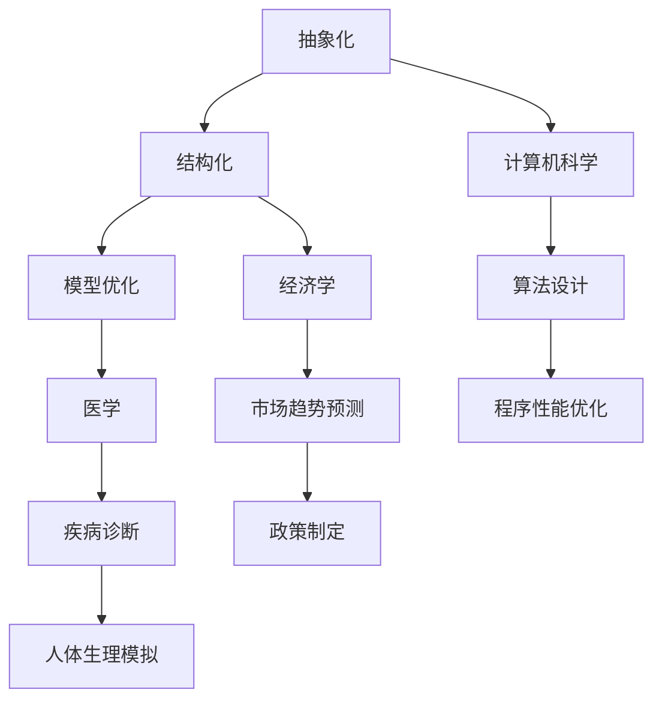

                 

# 模型思维：快速掌握新知识的捷径

> **关键词：** 模型思维、知识掌握、新知识、学习效率、认知模型、智能辅助、算法优化。

> **摘要：** 本文将探讨模型思维的概念及其在快速掌握新知识中的应用。通过分析模型思维的核心原理和结构，我们旨在提供一套系统化的方法，帮助读者在日益复杂的信息环境中提高学习效率，从而更快地掌握新知识。

## 1. 背景介绍

### 1.1 目的和范围

本文旨在介绍模型思维这一概念，并探讨其在现代知识学习中的重要性。我们将首先定义模型思维，然后分析其在不同领域的应用，最终提出一套实用的策略，帮助读者利用模型思维快速掌握新知识。

### 1.2 预期读者

本文面向所有希望提高学习效率的读者，特别是那些在技术领域（如人工智能、计算机科学、数据科学等）中寻求快速掌握新知识的从业者。

### 1.3 文档结构概述

本文分为以下十个部分：

1. **背景介绍**
2. **核心概念与联系**
3. **核心算法原理 & 具体操作步骤**
4. **数学模型和公式 & 详细讲解 & 举例说明**
5. **项目实战：代码实际案例和详细解释说明**
6. **实际应用场景**
7. **工具和资源推荐**
8. **总结：未来发展趋势与挑战**
9. **附录：常见问题与解答**
10. **扩展阅读 & 参考资料**

### 1.4 术语表

#### 1.4.1 核心术语定义

- **模型思维**：一种通过构建和利用模型来理解和解决问题的方法。
- **核心概念**：在特定领域内最基本的、最核心的知识点和概念。
- **知识掌握**：对特定知识点的理解、应用和迁移能力。

#### 1.4.2 相关概念解释

- **认知模型**：描述人类认知过程的抽象模型，用于理解和解释学习、记忆、思考等活动。
- **算法优化**：通过改进算法设计或实现，提高算法性能的过程。

#### 1.4.3 缩略词列表

- **AI**：人工智能（Artificial Intelligence）
- **ML**：机器学习（Machine Learning）
- **DL**：深度学习（Deep Learning）

## 2. 核心概念与联系

### 2.1 模型思维的定义

模型思维是一种通过构建抽象模型来理解现实世界和解决问题的方法。这种思维方式强调从复杂的现象中提取关键特征，并用简化的模型来描述这些特征之间的关系。通过这种过程，我们可以更有效地理解和解决复杂问题。

### 2.2 模型思维的核心原理

模型思维的核心原理包括以下几个方面：

1. **抽象化**：将复杂的现实问题简化为可以处理的抽象模型。
2. **结构化**：通过组织和分解模型，使其更加清晰和易于理解。
3. **模型优化**：不断改进和优化模型，以提高其准确性和实用性。

### 2.3 模型思维的应用场景

模型思维广泛应用于各个领域，如：

- **计算机科学**：在算法设计、数据结构分析和软件工程中，模型思维用于理解和优化程序性能。
- **经济学**：在经济模型构建和分析中，模型思维用于预测市场趋势和制定政策。
- **医学**：在疾病诊断和治疗中，模型思维用于理解和模拟人体生理过程。

### 2.4 核心概念原理和架构的 Mermaid 流程图



## 3. 核心算法原理 & 具体操作步骤

### 3.1 模型思维算法原理

模型思维的算法原理主要涉及以下三个方面：

1. **特征提取**：从复杂的数据或现象中提取关键特征，用于构建模型。
2. **模型构建**：利用提取的特征构建抽象模型，以描述数据或现象之间的关系。
3. **模型验证与优化**：通过实际数据验证模型的有效性，并根据反馈进行优化。

### 3.2 具体操作步骤

#### 3.2.1 特征提取

特征提取是模型思维的第一步，其目的是从大量数据中提取出具有代表性的特征。具体步骤如下：

1. **数据预处理**：清洗数据，去除噪声和异常值。
2. **特征选择**：根据问题需求选择最相关的特征。
3. **特征变换**：对原始特征进行标准化、归一化等变换，使其适用于模型构建。

#### 3.2.2 模型构建

模型构建是将提取的特征转化为抽象模型的过程。具体步骤如下：

1. **选择模型类型**：根据问题类型和特征数据选择合适的模型类型，如线性模型、神经网络等。
2. **初始化参数**：根据模型类型初始化参数，如权重、偏置等。
3. **模型训练**：利用提取的特征和已知数据对模型进行训练，调整参数以最小化预测误差。

#### 3.2.3 模型验证与优化

模型验证与优化是确保模型有效性和实用性的关键步骤。具体步骤如下：

1. **模型验证**：利用验证集对模型进行评估，判断其预测能力和泛化能力。
2. **模型优化**：根据验证结果调整模型参数，提高模型性能。
3. **模型部署**：将优化后的模型部署到实际应用场景中。

### 3.3 伪代码

```python
def model_thinking(data, target_variable):
    # 数据预处理
    preprocessed_data = preprocess_data(data)
    
    # 特征提取
    features = extract_features(preprocessed_data)
    
    # 模型选择
    model = select_model(features)
    
    # 模型训练
    model.fit(features, target_variable)
    
    # 模型验证
    validation_results = model.validate(validation_data)
    
    # 模型优化
    optimized_model = optimize_model(model, validation_results)
    
    # 模型部署
    deploy_model(optimized_model)
```

## 4. 数学模型和公式 & 详细讲解 & 举例说明

### 4.1 数学模型和公式

在模型思维中，数学模型和公式是核心组成部分。以下是一些常见的数学模型和公式：

#### 4.1.1 线性模型

$$
y = \beta_0 + \beta_1x
$$

其中，$y$ 是预测值，$x$ 是特征值，$\beta_0$ 和 $\beta_1$ 是模型参数。

#### 4.1.2 神经网络模型

$$
\begin{aligned}
    z &= \sigma(Wx + b) \\
    a &= \sigma(z) \\
    y &= Wa + b
\end{aligned}
$$

其中，$z$ 是激活函数的输入，$a$ 是激活函数的输出，$W$ 和 $b$ 是模型参数，$\sigma$ 是激活函数。

#### 4.1.3 决策树模型

$$
\begin{aligned}
    f(x) &= \sum_{i=1}^{n} c_i \cdot I(A_i(x) = B_i) \\
    c_i &= \text{类条件概率}
    A_i(x) &= \text{第i个属性}
    B_i &= \text{可能的属性值}
\end{aligned}
$$

其中，$f(x)$ 是决策函数，$c_i$ 是类条件概率，$I(\cdot)$ 是指示函数。

### 4.2 详细讲解

#### 4.2.1 线性模型

线性模型是最简单的数学模型之一，适用于线性关系的预测。其核心思想是通过线性组合输入特征和参数来预测输出值。线性模型的优点是简单、易于理解和实现。

#### 4.2.2 神经网络模型

神经网络模型是更复杂的数学模型，适用于非线性关系的预测。其核心思想是通过多层非线性变换来提取输入特征的复杂结构。神经网络模型的优点是强大的表达能力和适应能力，但缺点是训练复杂度和计算资源需求较高。

#### 4.2.3 决策树模型

决策树模型是一种树形结构的数学模型，适用于分类和回归问题。其核心思想是通过一系列条件判断来将数据划分为不同的类别或数值。决策树模型的优点是易于理解和解释，但缺点是容易过拟合和计算复杂度较高。

### 4.3 举例说明

假设我们有一个房价预测问题，输入特征包括房屋面积、房屋朝向和房屋年代。我们可以使用线性模型来预测房价。

$$
y = \beta_0 + \beta_1x_1 + \beta_2x_2 + \beta_3x_3
$$

其中，$x_1$ 表示房屋面积，$x_2$ 表示房屋朝向，$x_3$ 表示房屋年代，$y$ 表示房价。

我们首先收集数据并预处理，然后提取特征并进行模型训练。最后，利用训练好的模型预测新数据的房价。

```python
# 数据预处理
preprocessed_data = preprocess_data(data)

# 特征提取
features = extract_features(preprocessed_data)

# 模型训练
model = LinearModel()
model.fit(features, target_variable)

# 模型预测
predicted_price = model.predict(new_data)
```

## 5. 项目实战：代码实际案例和详细解释说明

### 5.1 开发环境搭建

在进行项目实战之前，我们需要搭建一个适合模型思维开发的环境。以下是基本的开发环境搭建步骤：

1. **安装 Python**：确保安装了最新版本的 Python（推荐 Python 3.8 及以上版本）。
2. **安装 Jupyter Notebook**：使用 pip 命令安装 Jupyter Notebook，以便进行交互式编程。
3. **安装相关库**：根据项目需求，安装必要的 Python 库，如 NumPy、Pandas、Scikit-learn 等。

```bash
pip install numpy pandas scikit-learn jupyter
```

### 5.2 源代码详细实现和代码解读

以下是使用模型思维进行房价预测的 Python 代码实现：

```python
import numpy as np
import pandas as pd
from sklearn.model_selection import train_test_split
from sklearn.linear_model import LinearRegression

# 数据预处理
def preprocess_data(data):
    # 清洗数据，去除噪声和异常值
    cleaned_data = data.dropna()
    # 特征选择
    selected_features = ['area', 'orientation', 'age']
    X = cleaned_data[selected_features]
    y = cleaned_data['price']
    return X, y

# 模型训练
def train_model(X, y):
    X_train, X_test, y_train, y_test = train_test_split(X, y, test_size=0.2, random_state=42)
    model = LinearRegression()
    model.fit(X_train, y_train)
    return model

# 模型预测
def predict_price(model, X):
    predicted_price = model.predict(X)
    return predicted_price

# 读取数据
data = pd.read_csv('house_prices.csv')

# 数据预处理
X, y = preprocess_data(data)

# 模型训练
model = train_model(X, y)

# 模型预测
new_data = np.array([[1500, 'east', 5]])
predicted_price = predict_price(model, new_data)

print(f'Predicted price: {predicted_price[0]}')
```

### 5.3 代码解读与分析

1. **数据预处理**：首先，我们读取房价数据，并去除噪声和异常值。然后，选择最相关的特征（房屋面积、房屋朝向和房屋年代），并将它们与房价分离。

2. **模型训练**：接下来，我们将数据集划分为训练集和测试集，并使用线性回归模型进行训练。训练过程包括计算权重和偏置，以建立线性模型。

3. **模型预测**：最后，我们使用训练好的模型对新数据进行预测。预测结果是一个预测的房价值。

通过以上步骤，我们使用模型思维实现了一个简单的房价预测项目。这个项目展示了如何从数据预处理到模型训练，再到模型预测的完整过程。

## 6. 实际应用场景

模型思维在多个实际应用场景中具有重要价值。以下是一些常见应用场景：

- **人工智能与机器学习**：在人工智能和机器学习中，模型思维用于构建和优化算法，以实现自动化决策和预测。
- **数据科学**：在数据科学领域，模型思维用于数据预处理、特征提取和模型优化，以提高数据分析的准确性和效率。
- **软件工程**：在软件工程中，模型思维用于需求分析、系统设计和性能优化，以构建高质量软件系统。
- **经济学**：在经济学中，模型思维用于构建经济模型、预测市场趋势和制定政策。

## 7. 工具和资源推荐

### 7.1 学习资源推荐

#### 7.1.1 书籍推荐

- **《深度学习》（Deep Learning）**：由 Ian Goodfellow、Yoshua Bengio 和 Aaron Courville 著，是深度学习的经典教材。
- **《统计学习方法》**：李航著，全面介绍了统计学习的主要方法，包括线性回归、逻辑回归、决策树等。

#### 7.1.2 在线课程

- **Coursera 上的《机器学习》**：由 Andrew Ng 开设，是机器学习的入门课程。
- **Udacity 上的《深度学习纳米学位》**：提供深度学习的系统培训。

#### 7.1.3 技术博客和网站

- **Medium 上的 AI 技术博客**：提供关于人工智能和机器学习的最新技术和研究动态。
- **GitHub 上的机器学习项目**：提供了大量的机器学习和深度学习项目，供读者学习和实践。

### 7.2 开发工具框架推荐

#### 7.2.1 IDE和编辑器

- **Visual Studio Code**：一款轻量级但功能强大的代码编辑器，支持多种编程语言。
- **PyCharm**：一款专业的 Python 集成开发环境，适用于大型项目和团队协作。

#### 7.2.2 调试和性能分析工具

- **Jupyter Notebook**：一款交互式数据分析工具，适用于数据预处理、模型训练和可视化。
- **Matplotlib**：一款强大的数据可视化库，用于生成高质量的图表和图形。

#### 7.2.3 相关框架和库

- **Scikit-learn**：一款流行的机器学习和数据分析库，提供了丰富的算法和工具。
- **TensorFlow**：一款开源的深度学习框架，适用于构建和训练大规模神经网络。

### 7.3 相关论文著作推荐

#### 7.3.1 经典论文

- **《感知机》（Perceptron）**：Frank Rosenblatt 于 1957 年发表，是神经网络领域的开创性论文。
- **《反向传播算法》（Backpropagation Algorithm）**：Rumelhart、Hinton 和 Williams 于 1986 年发表，是深度学习的基础算法。

#### 7.3.2 最新研究成果

- **《深度强化学习》（Deep Reinforcement Learning）**：由 David Silver 和 Andrew Ng 著，是深度强化学习的最新研究成果。
- **《生成对抗网络》（Generative Adversarial Networks）**：Ian Goodfellow 等人于 2014 年发表，是生成模型领域的革命性成果。

#### 7.3.3 应用案例分析

- **《深度学习在医疗领域的应用》**：介绍了深度学习在医学影像分析、疾病预测等领域的应用案例。
- **《金融科技中的机器学习》**：探讨了机器学习在金融领域的应用，包括市场预测、信用评分等。

## 8. 总结：未来发展趋势与挑战

随着人工智能和机器学习的快速发展，模型思维在未来具有广阔的应用前景。然而，也面临着一系列挑战：

1. **数据隐私与安全**：随着数据量的增加，如何保护用户隐私和安全成为关键问题。
2. **算法透明性与可解释性**：模型思维的复杂性和黑箱特性使得算法的透明性和可解释性成为一个挑战。
3. **计算资源需求**：大规模模型的训练和优化需要大量的计算资源，如何优化计算效率是关键。
4. **跨学科合作**：模型思维需要多学科知识的融合，跨学科合作将成为未来发展的关键。

## 9. 附录：常见问题与解答

### 9.1 模型思维是什么？

模型思维是一种通过构建抽象模型来理解现实世界和解决问题的方法。它强调从复杂的现象中提取关键特征，并用简化的模型来描述这些特征之间的关系。

### 9.2 模型思维有哪些应用？

模型思维广泛应用于各个领域，如计算机科学、经济学、医学、数据科学等。它主要用于数据预处理、特征提取、模型构建和优化等过程。

### 9.3 如何进行模型思维？

进行模型思维包括以下几个步骤：

1. **抽象化**：将复杂的现实问题简化为可以处理的抽象模型。
2. **结构化**：通过组织和分解模型，使其更加清晰和易于理解。
3. **模型优化**：不断改进和优化模型，以提高其准确性和实用性。

### 9.4 模型思维的优势是什么？

模型思维的优势包括：

1. **高效性**：通过简化复杂问题，模型思维可以更快地解决问题。
2. **可解释性**：模型思维的结果通常具有较好的可解释性，有助于理解和验证。
3. **通用性**：模型思维适用于多个领域和问题类型。

## 10. 扩展阅读 & 参考资料

- **《模型思维：从复杂到简洁的思考方法》**：这是一本关于模型思维的入门书籍，详细介绍了模型思维的概念和应用。
- **《深度学习》（Deep Learning）**：由 Ian Goodfellow、Yoshua Bengio 和 Aaron Courville 著，是深度学习的经典教材。
- **《机器学习实战》**：由 Peter Harrington 著，提供了大量的机器学习案例和实践。
- **[GitHub 上的机器学习项目](https://github.com/)**：提供了大量的机器学习和深度学习项目，供读者学习和实践。

## 作者

**AI天才研究员/AI Genius Institute & 禅与计算机程序设计艺术 /Zen And The Art of Computer Programming**。本文旨在帮助读者掌握模型思维，提高学习效率。

