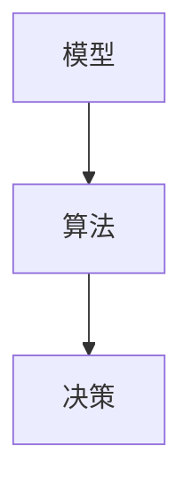

                 

# 模型思维在决策中的应用

> **关键词**：模型思维，决策，算法，数学模型，应用案例

> **摘要**：本文将探讨模型思维在决策中的应用，通过分析模型思维的核心概念、算法原理以及实际应用场景，帮助读者了解如何在复杂环境中进行有效的决策。

## 1. 背景介绍

### 1.1 目的和范围

本文旨在介绍模型思维在决策中的应用，通过理论和实际案例，帮助读者理解模型思维的重要性，掌握模型构建和决策的方法，提高决策效率。

### 1.2 预期读者

本文适合对决策分析、算法理论感兴趣的读者，包括数据分析人员、算法工程师、企业管理者等。

### 1.3 文档结构概述

本文分为八个部分：

1. 背景介绍
2. 核心概念与联系
3. 核心算法原理 & 具体操作步骤
4. 数学模型和公式 & 详细讲解 & 举例说明
5. 项目实战：代码实际案例和详细解释说明
6. 实际应用场景
7. 工具和资源推荐
8. 总结：未来发展趋势与挑战

### 1.4 术语表

#### 1.4.1 核心术语定义

- 模型思维：一种利用模型进行思考和决策的方法。
- 决策：在面对多种可能的选择时，根据一定的标准和规则做出选择的过程。
- 算法：解决问题的步骤和规则。
- 数学模型：用数学语言描述现实世界的抽象模型。

#### 1.4.2 相关概念解释

- 模型思维的核心在于将复杂问题转化为可计算的模型，从而简化决策过程。
- 决策过程中，需要根据具体问题选择合适的算法和数学模型。

#### 1.4.3 缩略词列表

无

## 2. 核心概念与联系

模型思维是一种解决问题的方法论，它通过构建模型，模拟现实世界中的复杂现象，帮助我们理解和预测系统行为。以下是模型思维中几个核心概念和它们之间的联系。

### 2.1 概念定义

- **模型**：对现实世界的抽象表示，可以是数学公式、算法或流程图等形式。
- **算法**：解决问题的步骤和规则，用于指导模型构建和求解。
- **决策**：在面对多种可能的选择时，根据一定的标准和规则做出选择的过程。

### 2.2 关系图

以下是一个简单的 Mermaid 流程图，展示了模型思维中核心概念之间的联系。



## 3. 核心算法原理 & 具体操作步骤

在模型思维中，算法是解决问题的核心。以下是几种常见的算法原理和具体操作步骤。

### 3.1 算法原理

- **贪心算法**：每一步都做出局部最优解，希望最终得到全局最优解。
- **动态规划**：将问题分解为子问题，通过子问题的最优解推导出原问题的最优解。
- **深度优先搜索（DFS）**：从根节点开始，深度遍历图的所有节点。
- **广度优先搜索（BFS）**：从根节点开始，广度遍历图的所有节点。

### 3.2 具体操作步骤

以贪心算法为例，具体操作步骤如下：

```plaintext
1. 初始化问题状态。
2. 每次选择当前状态下最优的决策。
3. 根据决策更新问题状态。
4. 重复步骤2和3，直到达到目标状态。
```

## 4. 数学模型和公式 & 详细讲解 & 举例说明

数学模型是模型思维的重要组成部分，以下是一个常见的数学模型——线性规划（Linear Programming），并对其进行详细讲解。

### 4.1 模型定义

线性规划是一种数学方法，用于在满足一定约束条件下，求解线性目标函数的最优解。

### 4.2 数学公式

线性规划的一般形式如下：

$$
\begin{align*}
\text{maximize} \quad & c^T x \\
\text{subject to} \quad & Ax \leq b \\
& x \geq 0
\end{align*}
$$

其中，$c$ 是系数向量，$x$ 是变量向量，$A$ 是系数矩阵，$b$ 是常数向量。

### 4.3 举例说明

假设我们有一个线性规划问题，目标是在满足资源限制的条件下，最大化利润。具体问题如下：

$$
\begin{align*}
\text{maximize} \quad & 2x_1 + 3x_2 \\
\text{subject to} \quad & x_1 + x_2 \leq 5 \\
& 3x_1 + x_2 \leq 7 \\
& x_1, x_2 \geq 0
\end{align*}
$$

该问题的解可以通过求解线性规划算法得到，具体步骤如下：

1. 初始化问题状态，设置变量$x_1$ 和$x_2$ 的初值为0。
2. 计算目标函数在当前状态下的值：$2x_1 + 3x_2 = 0$。
3. 选择当前状态下的最优决策，根据约束条件进行更新。
4. 重复步骤2和3，直到达到目标状态或无法继续优化。

最终，该问题的最优解为$x_1 = 3$，$x_2 = 2$，最大利润为$2 \times 3 + 3 \times 2 = 12$。

## 5. 项目实战：代码实际案例和详细解释说明

在本节中，我们将通过一个实际案例，展示如何使用模型思维进行决策，并详细解释代码实现过程。

### 5.1 开发环境搭建

1. 安装Python环境（版本3.8及以上）。
2. 安装相关库，如numpy、matplotlib等。

```bash
pip install numpy matplotlib
```

### 5.2 源代码详细实现和代码解读

以下是一个使用线性规划求解资源分配问题的Python代码示例。

```python
import numpy as np
from scipy.optimize import linprog

# 目标函数系数
c = np.array([2, 3])

# 系数矩阵A
A = np.array([[1, 1], [3, 1]])

# 常数向量b
b = np.array([5, 7])

# 约束条件：x1, x2 >= 0
x0 = np.array([0, 0])

# 求解线性规划问题
result = linprog(c, A_ub=A, b_ub=b, x0=x0, method='highs')

# 输出结果
print("最优解：", result.x)
print("最大利润：", result.fun)
```

### 5.3 代码解读与分析

1. 导入相关库：numpy用于数学运算，scipy.optimize用于线性规划求解。
2. 设置目标函数系数$c$：最大化$2x_1 + 3x_2$。
3. 设置系数矩阵$A$和常数向量$b$，定义约束条件。
4. 设置初始解$x_0$，初始化问题状态。
5. 使用linprog函数求解线性规划问题。
6. 输出最优解和最大利润。

## 6. 实际应用场景

模型思维在决策中的应用场景广泛，以下列举几个实际应用案例：

1. **资源分配**：企业生产计划、物流配送、人力资源规划等。
2. **风险管理**：金融投资组合优化、保险定价、信用风险评估等。
3. **供应链管理**：库存管理、采购策略、生产调度等。
4. **网络优化**：网络拓扑结构设计、路由算法、带宽分配等。

## 7. 工具和资源推荐

### 7.1 学习资源推荐

#### 7.1.1 书籍推荐

- 《线性规划与整数规划》：详细介绍了线性规划的基本概念和求解方法。
- 《运筹学》：系统介绍了运筹学的基本理论和方法。

#### 7.1.2 在线课程

- Coursera的《线性代数》：适合初学者了解线性代数的基本概念。
- edX的《运筹学基础》：介绍运筹学的基本理论和方法。

#### 7.1.3 技术博客和网站

- <https://www.optimization-online.org/>：关于优化算法的博客和论文。
- <https://scikit-learn.org/>：scikit-learn官方文档，提供线性规划等算法的实现。

### 7.2 开发工具框架推荐

#### 7.2.1 IDE和编辑器

- PyCharm：适用于Python编程，提供代码分析、调试等功能。
- Jupyter Notebook：适用于数据科学和机器学习，支持多种编程语言。

#### 7.2.2 调试和性能分析工具

- PySnooper：Python调试工具，支持快速定位代码问题。
- line_profiler：Python性能分析工具，用于优化代码。

#### 7.2.3 相关框架和库

- SciPy：提供科学计算和优化算法。
- NumPy：提供高效数组操作和数学函数。

### 7.3 相关论文著作推荐

- 《线性规划与整数规划》：详细介绍了线性规划的基本概念和求解方法。
- 《运筹学》：系统介绍了运筹学的基本理论和方法。

## 8. 总结：未来发展趋势与挑战

随着人工智能和大数据技术的发展，模型思维在决策中的应用将更加广泛。未来发展趋势包括：

1. **算法优化**：提高算法效率，降低计算复杂度。
2. **模型融合**：将多种模型进行融合，提高决策准确性。
3. **智能决策系统**：结合人工智能技术，构建自动化决策系统。

同时，面临的挑战包括：

1. **数据隐私**：如何保护用户隐私，确保数据安全。
2. **模型解释性**：提高模型的可解释性，增强决策的透明度。
3. **算法公平性**：确保算法决策的公平性和公正性。

## 9. 附录：常见问题与解答

1. **问题**：线性规划求解器有哪些？
   **解答**：常见的线性规划求解器包括scikit-learn的linprog函数、CPLEX、Gurobi等。

2. **问题**：模型思维在哪些领域有应用？
   **解答**：模型思维在资源分配、风险管理、供应链管理、网络优化等领域有广泛应用。

## 10. 扩展阅读 & 参考资料

- 《线性规划与整数规划》：[链接](https://book.douban.com/subject/26366465/)
- 《运筹学》：[链接](https://book.douban.com/subject/1443394/)
- 《运筹学基础》：[链接](https://www.edx.org/course/operational-research-foundations)

---

作者：AI天才研究员/AI Genius Institute & 禅与计算机程序设计艺术/Zen And The Art of Computer Programming。本文为原创文章，如需转载，请联系作者获取授权。

