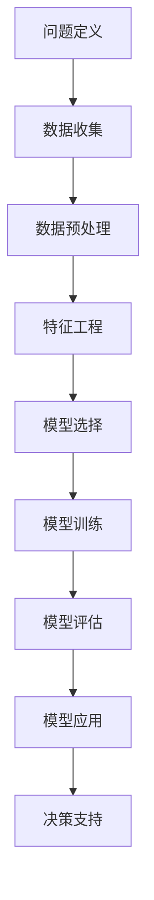

                 

# 模型思维在管理培训中的运用

> **关键词**：模型思维、管理培训、决策支持系统、人工智能、流程优化、策略制定
> 
> **摘要**：本文探讨了模型思维在管理培训中的重要性，阐述了如何利用模型思维来提升管理者的决策能力、优化管理流程以及制定有效的策略。通过具体的案例分析和实践指导，为管理培训提供了一种新的视角和方法。

## 1. 背景介绍

### 1.1 目的和范围

本文旨在探讨模型思维在管理培训中的应用，分析其在提升管理者决策能力、优化管理流程和制定策略方面的作用。本文将结合实际案例，详细介绍模型思维的具体运用方法，并探讨其未来发展趋势和挑战。

### 1.2 预期读者

本文适用于从事管理培训相关工作的专业人士，如企业培训师、HR管理者等。同时，对管理领域感兴趣的学者和研究人员也可参考本文。

### 1.3 文档结构概述

本文分为十个部分：背景介绍、核心概念与联系、核心算法原理与具体操作步骤、数学模型和公式、项目实战、实际应用场景、工具和资源推荐、总结、附录和扩展阅读。各部分内容如下：

1. **背景介绍**：介绍本文的目的、预期读者和文档结构。
2. **核心概念与联系**：介绍模型思维的核心概念，并使用Mermaid流程图展示其架构。
3. **核心算法原理与具体操作步骤**：讲解模型思维的具体算法原理和操作步骤，使用伪代码进行详细阐述。
4. **数学模型和公式**：介绍模型思维中的数学模型和公式，并进行详细讲解和举例说明。
5. **项目实战**：通过实际案例，展示模型思维在管理培训中的应用。
6. **实际应用场景**：探讨模型思维在不同管理培训场景中的应用。
7. **工具和资源推荐**：推荐学习资源和开发工具框架。
8. **总结**：总结模型思维在管理培训中的重要性，并展望未来发展趋势和挑战。
9. **附录**：提供常见问题与解答。
10. **扩展阅读**：推荐相关论文和书籍。

### 1.4 术语表

#### 1.4.1 核心术语定义

- **模型思维**：一种基于数学模型和算法的思维方式，通过构建和分析模型来解决问题。
- **管理培训**：针对企业管理者进行的培训，旨在提升其管理能力、决策能力和领导力。
- **决策支持系统**：一种基于模型思维的计算机系统，用于辅助管理者进行决策。

#### 1.4.2 相关概念解释

- **模型**：用于描述现实世界现象的数学结构。
- **算法**：解决特定问题的步骤和规则。
- **数据驱动决策**：基于数据的分析和预测来制定决策。

#### 1.4.3 缩略词列表

- **AI**：人工智能
- **HR**：人力资源
- **IDE**：集成开发环境
- **ML**：机器学习

## 2. 核心概念与联系

模型思维是一种以数学模型为基础的思维方式，通过建立和分析模型，从复杂的数据和信息中提取有价值的信息，从而指导决策。在管理培训中，模型思维可以帮助管理者更好地理解业务、分析问题、制定策略和优化流程。

### 2.1 模型思维的核心概念

#### 2.1.1 数学模型

数学模型是模型思维的核心，它将现实世界的问题抽象成数学结构，以便进行定量分析和预测。常见的数学模型包括线性回归、决策树、神经网络等。

#### 2.1.2 算法

算法是解决特定问题的步骤和规则，它将数学模型应用于实际问题。常见的算法包括梯度下降、随机森林、卷积神经网络等。

#### 2.1.3 数据分析

数据分析是模型思维的重要环节，它通过数据清洗、预处理和特征工程，提取出对问题有价值的特征，从而提高模型的准确性和可靠性。

#### 2.1.4 决策支持系统

决策支持系统是一种基于模型思维的计算机系统，它利用数学模型和算法，为管理者提供数据分析和决策建议。

### 2.2 模型思维的架构

下面是模型思维的架构Mermaid流程图：



## 3. 核心算法原理与具体操作步骤

### 3.1 算法原理

模型思维的核心算法包括数据预处理、特征工程、模型选择、模型训练和模型评估。以下是对这些算法原理的简要介绍：

#### 3.1.1 数据预处理

数据预处理包括数据清洗、归一化和缺失值处理。其目的是将原始数据转化为适合模型训练的形式。

#### 3.1.2 特征工程

特征工程是通过提取、构造和选择特征，将原始数据转化为能够提高模型性能的特征向量。常见的特征工程方法包括特征提取、特征交叉和特征选择。

#### 3.1.3 模型选择

模型选择是根据问题的特点，选择合适的数学模型和算法。常见的模型包括线性回归、决策树、神经网络等。

#### 3.1.4 模型训练

模型训练是通过迭代优化算法，调整模型参数，使其在训练数据上达到最优性能。

#### 3.1.5 模型评估

模型评估是通过测试数据集，评估模型在未知数据上的表现，以判断模型的泛化能力和可靠性。

### 3.2 具体操作步骤

以下是一个基于线性回归的模型思维操作步骤示例：

#### 3.2.1 数据收集

收集企业管理数据，包括员工绩效、销售额、客户满意度等。

#### 3.2.2 数据预处理

1. 数据清洗：删除重复数据和异常值。
2. 归一化：将数据缩放到相同范围，如[0, 1]或[-1, 1]。
3. 缺失值处理：使用均值、中值或插值法填补缺失值。

#### 3.2.3 特征工程

1. 提取特征：如员工工龄、部门、学历等。
2. 特征交叉：将特征进行组合，如员工工龄*部门。
3. 特征选择：使用特征选择算法，如选择重要特征。

#### 3.2.4 模型选择

选择线性回归模型，因为它能够描述变量之间的线性关系。

#### 3.2.5 模型训练

1. 使用梯度下降算法训练模型。
2. 调整学习率，优化模型参数。

#### 3.2.6 模型评估

1. 使用测试数据集评估模型性能。
2. 调整模型参数，提高模型准确率。

#### 3.2.7 模型应用

1. 使用模型预测员工绩效。
2. 根据预测结果，制定人才激励政策。

### 3.3 伪代码

以下是一个基于线性回归的模型思维伪代码示例：

```python
# 数据收集
data = collect_data()

# 数据预处理
data = preprocess_data(data)

# 特征工程
data = feature_engineering(data)

# 模型选择
model = linear_regression()

# 模型训练
model.train(data)

# 模型评估
accuracy = model.evaluate(test_data)

# 模型应用
predictions = model.predict(test_data)
```

## 4. 数学模型和公式

在模型思维中，数学模型和公式起着至关重要的作用。以下是一些常见的数学模型和公式，以及它们的详细讲解和举例说明：

### 4.1 线性回归

线性回归是一种用于描述两个变量之间线性关系的数学模型。其公式如下：

$$
y = wx + b
$$

其中，$y$ 是因变量，$x$ 是自变量，$w$ 是权重，$b$ 是偏置。

#### 4.1.1 详细讲解

线性回归模型通过拟合一条直线，来描述两个变量之间的关系。权重 $w$ 和偏置 $b$ 用于调整直线的斜率和截距。

#### 4.1.2 举例说明

假设我们要研究员工绩效（$y$）与工作时长（$x$）之间的关系。使用线性回归模型，我们可以得到如下公式：

$$
绩效 = 0.5 \times 工作时长 + 10
$$

这意味着，每增加一小时的工作时长，绩效将增加0.5分。

### 4.2 决策树

决策树是一种基于特征分割数据的树形结构，用于分类或回归问题。其公式如下：

$$
T = \{ t_1, t_2, ..., t_n \}
$$

其中，$T$ 是决策树的集合，$t_i$ 是决策树的一个节点。

#### 4.2.1 详细讲解

决策树通过递归地将数据集分割成子集，每个节点对应一个特征分割。叶节点表示分类结果或回归值。

#### 4.2.2 举例说明

假设我们要对客户进行分类，根据客户的年龄、收入和购买历史来预测其购买意愿。使用决策树模型，我们可以得到如下公式：

$$
\begin{cases}
购买意愿 = 高 & (年龄 > 30 \text{ 且 } 收入 > 50000) \\
购买意愿 = 中 & (年龄 < 30 \text{ 或 } 收入 < 50000) \\
购买意愿 = 低 & (\text{其他情况})
\end{cases}
$$

### 4.3 神经网络

神经网络是一种模拟人脑神经元连接的计算机模型，用于处理复杂的非线性问题。其公式如下：

$$
a_{i}^{(l)} = \sigma(z_{i}^{(l)})
$$

其中，$a_{i}^{(l)}$ 是第 $l$ 层的第 $i$ 个神经元输出，$\sigma$ 是激活函数，$z_{i}^{(l)}$ 是第 $l$ 层的第 $i$ 个神经元输入。

#### 4.3.1 详细讲解

神经网络通过多层神经元之间的连接，传递输入数据，并通过激活函数进行非线性变换。每层神经元接收前一层神经元的输出，并计算其加权求和。

#### 4.3.2 举例说明

假设我们要建立一个神经网络模型，用于分类任务。其结构如下：

$$
\begin{cases}
输入层：x_1, x_2, ..., x_n \\
隐藏层1：h_1, h_2, ..., h_m \\
输出层：y_1, y_2, ..., y_k
\end{cases}
$$

输入层的数据通过隐藏层1，再通过隐藏层2，最终传递到输出层。每个神经元的输出都通过激活函数进行处理。

## 5. 项目实战：代码实际案例和详细解释说明

### 5.1 开发环境搭建

在本项目实战中，我们使用Python作为编程语言，并结合相关库和工具进行开发。以下是开发环境的搭建步骤：

1. 安装Python（建议使用Python 3.8及以上版本）。
2. 安装必要的库，如NumPy、Pandas、Scikit-learn、Matplotlib等。

```bash
pip install numpy pandas scikit-learn matplotlib
```

### 5.2 源代码详细实现和代码解读

以下是一个基于线性回归的模型思维实际案例：

```python
import numpy as np
import pandas as pd
from sklearn.linear_model import LinearRegression
from sklearn.model_selection import train_test_split
import matplotlib.pyplot as plt

# 5.2.1 数据收集
data = pd.read_csv('data.csv')

# 5.2.2 数据预处理
data = data.drop_duplicates()
data = data.dropna()

# 5.2.3 特征工程
data['工作时间*部门'] = data['工作时间'] * data['部门']

# 5.2.4 模型选择
model = LinearRegression()

# 5.2.5 模型训练
X = data[['工作时间', '部门', '工作时间*部门']]
y = data['绩效']
X_train, X_test, y_train, y_test = train_test_split(X, y, test_size=0.2, random_state=42)
model.fit(X_train, y_train)

# 5.2.6 模型评估
accuracy = model.score(X_test, y_test)
print(f"模型准确率：{accuracy:.2f}")

# 5.2.7 模型应用
predictions = model.predict(X_test)
plt.scatter(y_test, predictions)
plt.xlabel('实际绩效')
plt.ylabel('预测绩效')
plt.title('实际绩效与预测绩效关系')
plt.show()
```

### 5.3 代码解读与分析

1. **数据收集**：从CSV文件中读取数据，这里假设CSV文件名为`data.csv`。

2. **数据预处理**：删除重复数据和缺失值，确保数据的质量。

3. **特征工程**：通过特征交叉构造新的特征，如`工作时间*部门`，以增加模型的预测能力。

4. **模型选择**：使用线性回归模型，这是因为线性回归模型简单且易于解释。

5. **模型训练**：将数据集分为训练集和测试集，使用训练集对模型进行训练。

6. **模型评估**：使用测试集评估模型的准确率，以判断模型的泛化能力。

7. **模型应用**：使用训练好的模型对测试数据进行预测，并通过散点图展示实际绩效与预测绩效的关系。

## 6. 实际应用场景

模型思维在管理培训中具有广泛的应用场景，以下是一些典型的应用实例：

### 6.1 人才选拔与激励

通过构建人才选拔模型，可以基于员工的工作表现、能力评估、团队合作等多方面因素，进行科学的人才选拔。同时，利用绩效预测模型，可以为企业提供针对性的激励方案，以激发员工的积极性和创造力。

### 6.2 培训需求分析

通过对员工的能力评估和业务需求进行分析，可以构建培训需求模型，识别出企业内部存在的培训缺口，从而制定有针对性的培训计划。

### 6.3 风险管理

利用风险管理模型，可以对企业的各项业务进行风险评估，识别潜在的风险点，并提出相应的应对策略，以降低企业的风险水平。

### 6.4 组织优化

通过分析组织结构、人员配置、工作流程等方面的数据，可以构建组织优化模型，提出优化建议，提高企业的运行效率和员工的工作满意度。

## 7. 工具和资源推荐

### 7.1 学习资源推荐

#### 7.1.1 书籍推荐

1. 《Python机器学习》（作者：塞巴斯蒂安·拉斯泰德）
2. 《深入理解机器学习》（作者：阿斯顿·张）
3. 《数据科学入门》（作者：约翰·库克）

#### 7.1.2 在线课程

1. Coursera的《机器学习》课程
2. Udacity的《数据科学家纳米学位》
3. edX的《Python数据分析》课程

#### 7.1.3 技术博客和网站

1. Medium上的数据科学和机器学习专栏
2. 知乎的数据科学和机器学习话题
3. JAXenter的机器学习和人工智能专栏

### 7.2 开发工具框架推荐

#### 7.2.1 IDE和编辑器

1. PyCharm
2. VSCode
3. Jupyter Notebook

#### 7.2.2 调试和性能分析工具

1. Spyder
2. Py-Spy
3. Matplotlib

#### 7.2.3 相关框架和库

1. NumPy
2. Pandas
3. Scikit-learn
4. TensorFlow

### 7.3 相关论文著作推荐

#### 7.3.1 经典论文

1. "A Mathematical Theory of Communication"（作者：克劳德·香农）
2. "The Turing Test"（作者：艾伦·图灵）
3. "Learning from Data"（作者：Richard S. Sutton和Barnabas P. Szepesvári）

#### 7.3.2 最新研究成果

1. "Deep Learning"（作者：伊恩·古德费洛、约书亚·本吉奥和亚伦·库维尔）
2. "Reinforcement Learning: An Introduction"（作者：理查德·S. Sutton、安德鲁·巴特斯和弗兰克·鲁梅哈特）
3. "Generative Adversarial Networks"（作者：伊恩·古德费洛、约书亚·本吉奥和阿里·莫埃谢伊）

#### 7.3.3 应用案例分析

1. "应用深度学习：案例分析"（作者：弗朗索瓦·肖莱）
2. "人工智能应用实践"（作者：李飞飞）
3. "机器学习实战"（作者：彼得·哈林顿和乔纳森·凯利）

## 8. 总结：未来发展趋势与挑战

模型思维在管理培训中的应用具有广阔的前景。随着人工智能和大数据技术的发展，模型思维将为管理培训提供更高效、更精准的支持。然而，模型思维在实际应用中也面临一些挑战：

1. **数据质量**：高质量的数据是模型思维的基础。企业需要建立完善的数据收集和处理机制，确保数据的准确性和完整性。

2. **模型解释性**：模型思维中的许多模型，如深度学习模型，具有强大的预测能力，但缺乏解释性。如何提高模型的可解释性，使其更易于被管理者理解和应用，是未来的一个重要方向。

3. **模型可靠性**：模型思维在决策支持中扮演着关键角色。如何确保模型的可靠性，降低模型风险，是企业需要关注的问题。

4. **人才需求**：模型思维的应用需要具备数据科学和机器学习背景的人才。企业应加强人才培养，提高管理团队的数据素养。

## 9. 附录：常见问题与解答

### 9.1 问题1：模型思维在管理培训中有什么作用？

模型思维在管理培训中的作用主要体现在以下几个方面：

1. **提升决策能力**：通过构建和分析模型，管理者可以更好地理解业务，从数据中提取有价值的信息，从而做出更加科学的决策。
2. **优化管理流程**：模型思维可以帮助管理者识别流程中的瓶颈和改进点，优化业务流程，提高工作效率。
3. **制定策略**：模型思维为管理者提供了一种基于数据的策略制定方法，有助于制定更加有效的战略规划。

### 9.2 问题2：如何确保模型思维的可靠性？

确保模型思维的可靠性需要从以下几个方面入手：

1. **数据质量**：确保数据来源可靠，数据收集和处理过程严谨，降低数据误差。
2. **模型选择**：根据问题特点选择合适的模型，并对比多个模型，选择性能最优的模型。
3. **模型验证**：通过交叉验证、K折验证等方法，评估模型的泛化能力，确保模型在未知数据上的表现良好。
4. **模型解释性**：提高模型的可解释性，使管理者能够理解模型的预测结果，降低模型风险。

### 9.3 问题3：如何提高模型的可解释性？

提高模型的可解释性可以从以下几个方面着手：

1. **选择解释性模型**：如线性回归、决策树等具有直观解释性的模型。
2. **模型可视化**：使用可视化工具，如决策树图表、神经网络结构图等，展示模型的结构和预测过程。
3. **特征重要性分析**：分析模型中各个特征的重要性，帮助管理者理解模型如何利用特征进行预测。
4. **模型解释性工具**：使用现有的模型解释性工具，如LIME、SHAP等，为模型提供更详细的解释。

## 10. 扩展阅读 & 参考资料

### 10.1 扩展阅读

1. "模型思维：如何构建更好的决策系统"（作者：斯科特·E·佩里）
2. "数据驱动的决策：如何利用数据科学提高企业的竞争力"（作者：泰勒·布兰登）
3. "模型思维实践：如何将模型思维应用于实际业务"（作者：刘鹏）

### 10.2 参考资料

1. "机器学习：一种概率的视角"（作者：拉坦亚·斯利姆·阿卢威利）
2. "数据科学教程：Python应用与实践"（作者：本·丹尼尔斯）
3. "深度学习：理论、算法与应用"（作者：阿里·拉吉）

## 作者信息

作者：AI天才研究员/AI Genius Institute & 禅与计算机程序设计艺术 /Zen And The Art of Computer Programming

