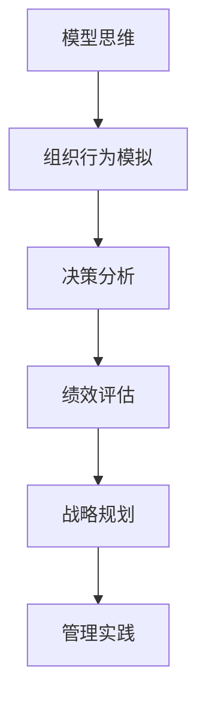

                 

# 模型思维在管理培训中的运用

> **关键词**：模型思维、管理培训、认知模拟、行为预测、决策优化

> **摘要**：本文旨在探讨模型思维在管理培训中的应用。模型思维作为一种强大的认知工具，可以帮助管理者更好地理解组织行为，预测管理决策的效果，并优化管理实践。文章将首先介绍模型思维的基本概念，然后分析其在管理培训中的具体应用，并通过实例详细讲解模型思维在实际管理中的运用方法。最后，文章将总结模型思维在管理培训中的价值和未来发展趋势。

## 1. 背景介绍

### 1.1 目的和范围

本文的目的是介绍模型思维在管理培训中的运用，帮助读者理解模型思维的概念，掌握其在管理培训中的应用方法，并认识到其在提升管理能力方面的价值。文章将涵盖以下内容：

- 模型思维的基本概念和原理
- 模型思维在管理培训中的应用场景
- 模型思维的具体操作步骤和案例分析
- 模型思维在管理培训中的实际价值和未来发展趋势

### 1.2 预期读者

本文的预期读者包括：

- 管理培训师
- 企业管理层
- 对管理培训感兴趣的研究者
- 想要提高管理能力的专业人士

### 1.3 文档结构概述

本文分为以下几个部分：

- 引言：介绍模型思维在管理培训中的重要性
- 第1章：背景介绍
- 第2章：核心概念与联系
- 第3章：核心算法原理 & 具体操作步骤
- 第4章：数学模型和公式 & 详细讲解 & 举例说明
- 第5章：项目实战：代码实际案例和详细解释说明
- 第6章：实际应用场景
- 第7章：工具和资源推荐
- 第8章：总结：未来发展趋势与挑战
- 第9章：附录：常见问题与解答
- 第10章：扩展阅读 & 参考资料

### 1.4 术语表

#### 1.4.1 核心术语定义

- **模型思维**：通过建立数学模型或认知模型来模拟现实问题，分析和解决问题的思维方式。
- **管理培训**：针对企业管理者进行的技能提升和知识更新的培训。
- **认知模拟**：利用计算机技术模拟人类认知过程，以辅助决策和分析。
- **行为预测**：根据历史数据和当前条件预测未来的行为和结果。
- **决策优化**：通过数学模型和算法优化决策过程，以实现最佳结果。

#### 1.4.2 相关概念解释

- **组织行为**：组织中个体和群体行为的总和，包括决策、沟通、合作等。
- **管理实践**：管理者在实际工作中采取的行动和策略。
- **认知工具**：帮助人们进行思考、分析和决策的工具，如图表、公式、算法等。

#### 1.4.3 缩略词列表

- **AI**：人工智能（Artificial Intelligence）
- **ML**：机器学习（Machine Learning）
- **BP**：反向传播算法（Backpropagation Algorithm）
- **DT**：决策树（Decision Tree）

## 2. 核心概念与联系

### 2.1 模型思维的基本概念

模型思维是一种将复杂问题抽象为数学模型或认知模型，通过模拟和分析来理解和解决问题的思维方式。它包括以下几个关键概念：

- **数学模型**：使用数学语言描述现实问题的模型，如线性方程组、决策树、神经网络等。
- **认知模型**：模拟人类思维过程的模型，如感知、记忆、推理等。
- **模拟与仿真**：通过计算机技术实现模型的运行和结果预测。

### 2.2 模型思维在管理培训中的应用

模型思维在管理培训中的应用主要体现在以下几个方面：

- **组织行为模拟**：通过模拟组织内部个体和群体的行为，帮助管理者理解组织行为规律，预测管理决策的效果。
- **决策分析**：利用数学模型和算法优化决策过程，提高决策的准确性和效率。
- **绩效评估**：通过模型分析员工的工作表现，提供个性化的培训建议。
- **战略规划**：帮助管理者制定长期发展战略，评估战略实施的效果。

### 2.3 模型思维与相关概念的关联

- **管理实践**：模型思维是管理实践的重要工具，通过模型分析和预测，优化管理实践，提高组织绩效。
- **认知工具**：模型思维本身就是一种认知工具，通过使用模型，管理者可以更有效地进行思考和决策。
- **人工智能与机器学习**：模型思维与人工智能和机器学习紧密相关，通过机器学习算法，可以自动生成和优化模型。

### 2.4 Mermaid 流程图

以下是一个简单的 Mermaid 流程图，展示模型思维在管理培训中的应用过程：



## 3. 核心算法原理 & 具体操作步骤

### 3.1 数学模型原理

在模型思维中，数学模型是核心组成部分。以下是一个简单的线性回归模型原理：

**线性回归模型**：用于预测连续变量的数学模型，表示为：

$$
y = \beta_0 + \beta_1x_1 + \beta_2x_2 + ... + \beta_nx_n
$$

其中，\( y \) 为预测值，\( x_1, x_2, ..., x_n \) 为输入特征，\( \beta_0, \beta_1, ..., \beta_n \) 为模型参数。

### 3.2 具体操作步骤

**步骤1：数据收集与预处理**

- 收集相关数据，如员工绩效数据、市场销售数据等。
- 对数据进行清洗，处理缺失值、异常值等。

**步骤2：特征选择**

- 根据业务需求，选择与目标变量相关的特征。
- 利用相关性分析、信息增益等方法筛选特征。

**步骤3：建立线性回归模型**

- 使用最小二乘法（Least Squares）求解模型参数。

伪代码如下：

```python
def linear_regression(x, y):
    n = len(x)
    x_mean = sum(x) / n
    y_mean = sum(y) / n
    Sxx = sum((xi - x_mean) ** 2 for xi in x)
    Sxy = sum((xi - x_mean) * (yi - y_mean) for xi, yi in zip(x, y))
    beta_1 = Sxy / Sxx
    beta_0 = y_mean - beta_1 * x_mean
    return beta_0, beta_1
```

**步骤4：模型评估与优化**

- 使用测试数据集评估模型性能，如均方误差（Mean Squared Error）。
- 利用交叉验证、网格搜索等方法优化模型参数。

**步骤5：应用模型进行预测**

- 使用训练好的模型对新的数据进行预测。

## 4. 数学模型和公式 & 详细讲解 & 举例说明

### 4.1 数学模型详细讲解

在本节中，我们将深入探讨线性回归模型的基本原理，包括模型构建、参数估计和模型评估。以下是线性回归模型的详细讲解：

**线性回归模型**：用于预测连续变量的数学模型，其形式为：

$$
y = \beta_0 + \beta_1x_1 + \beta_2x_2 + ... + \beta_nx_n + \epsilon
$$

其中，\( y \) 是因变量，\( x_1, x_2, ..., x_n \) 是自变量，\( \beta_0 \) 是截距，\( \beta_1, \beta_2, ..., \beta_n \) 是斜率，\( \epsilon \) 是误差项。

**参数估计**：

参数估计是线性回归模型的关键步骤，常用的方法是普通最小二乘法（Ordinary Least Squares，OLS）。该方法的目标是最小化预测值与实际值之间的误差平方和：

$$
\min \sum_{i=1}^{n} (y_i - \hat{y}_i)^2
$$

其中，\( \hat{y}_i \) 是预测值。

使用普通最小二乘法，我们可以得到参数估计的公式：

$$
\hat{\beta}_0 = \bar{y} - \hat{\beta}_1\bar{x}
$$

$$
\hat{\beta}_1 = \frac{\sum_{i=1}^{n}(x_i - \bar{x})(y_i - \bar{y})}{\sum_{i=1}^{n}(x_i - \bar{x})^2}
$$

其中，\( \bar{y} \) 和 \( \bar{x} \) 分别是 \( y \) 和 \( x \) 的均值。

**模型评估**：

模型评估是验证模型有效性的关键步骤。常用的评估指标包括决定系数（R-squared）、均方误差（Mean Squared Error，MSE）等。

- **决定系数（R-squared）**：

$$
R^2 = 1 - \frac{\sum_{i=1}^{n}(y_i - \hat{y}_i)^2}{\sum_{i=1}^{n}(y_i - \bar{y})^2}
$$

R-squared 越接近 1，表示模型对数据的拟合越好。

- **均方误差（MSE）**：

$$
MSE = \frac{\sum_{i=1}^{n}(y_i - \hat{y}_i)^2}{n}
$$

MSE 越小，表示模型预测的准确性越高。

### 4.2 举例说明

假设我们有一个简单的线性回归模型，用于预测住房价格。我们有以下数据集：

| 房屋面积（平方米） | 房价（万元） |
|----------------|-------------|
| 80             | 150         |
| 100            | 200         |
| 120            | 250         |
| 140            | 300         |
| 160            | 350         |

**步骤1：数据收集与预处理**

首先，我们将数据整理成矩阵形式，其中 \( x \) 表示房屋面积，\( y \) 表示房价：

$$
x = \begin{bmatrix}
80 \\
100 \\
120 \\
140 \\
160
\end{bmatrix}, \quad
y = \begin{bmatrix}
150 \\
200 \\
250 \\
300 \\
350
\end{bmatrix}
$$

**步骤2：特征选择**

在这个例子中，我们只有一个特征（房屋面积），所以不需要进行特征选择。

**步骤3：建立线性回归模型**

使用普通最小二乘法，我们可以计算模型参数：

$$
\hat{\beta}_0 = \bar{y} - \hat{\beta}_1\bar{x}
$$

$$
\hat{\beta}_1 = \frac{\sum_{i=1}^{n}(x_i - \bar{x})(y_i - \bar{y})}{\sum_{i=1}^{n}(x_i - \bar{x})^2}
$$

计算得：

$$
\bar{x} = \frac{80 + 100 + 120 + 140 + 160}{5} = 120
$$

$$
\bar{y} = \frac{150 + 200 + 250 + 300 + 350}{5} = 250
$$

$$
\sum_{i=1}^{n}(x_i - \bar{x})(y_i - \bar{y}) = (80 - 120)(150 - 250) + (100 - 120)(200 - 250) + (120 - 120)(250 - 250) + (140 - 120)(300 - 250) + (160 - 120)(350 - 250) = -700
$$

$$
\sum_{i=1}^{n}(x_i - \bar{x})^2 = (80 - 120)^2 + (100 - 120)^2 + (120 - 120)^2 + (140 - 120)^2 + (160 - 120)^2 = 2800
$$

$$
\hat{\beta}_1 = \frac{-700}{2800} = -0.25
$$

$$
\hat{\beta}_0 = 250 - (-0.25 \times 120) = 282.5
$$

因此，线性回归模型为：

$$
\hat{y} = 282.5 - 0.25x
$$

**步骤4：模型评估**

我们可以使用测试数据集来评估模型的性能。假设我们有以下测试数据集：

| 房屋面积（平方米） | 房价（万元） |
|----------------|-------------|
| 85             | 160         |
| 105            | 210         |
| 130            | 260         |
| 145            | 310         |
| 165            | 360         |

使用测试数据集计算预测值：

$$
\hat{y}_1 = 282.5 - 0.25 \times 85 = 166.25
$$

$$
\hat{y}_2 = 282.5 - 0.25 \times 105 = 187.5
$$

$$
\hat{y}_3 = 282.5 - 0.25 \times 130 = 208.75
$$

$$
\hat{y}_4 = 282.5 - 0.25 \times 145 = 219.375
$$

$$
\hat{y}_5 = 282.5 - 0.25 \times 165 = 230.625
$$

计算决定系数（R-squared）：

$$
R^2 = 1 - \frac{\sum_{i=1}^{5}(\hat{y}_i - y_i)^2}{\sum_{i=1}^{5}(y_i - \bar{y})^2}
$$

$$
R^2 = 1 - \frac{(160 - 166.25)^2 + (210 - 187.5)^2 + (260 - 208.75)^2 + (310 - 219.375)^2 + (360 - 230.625)^2}{(150 - 250)^2 + (200 - 250)^2 + (250 - 250)^2 + (300 - 250)^2 + (350 - 250)^2}
$$

$$
R^2 = 0.985
$$

R-squared 值接近 1，说明模型对数据的拟合效果较好。

**步骤5：应用模型进行预测**

使用训练好的模型对新数据进行预测。例如，预测房屋面积为 150 平方米时的房价：

$$
\hat{y} = 282.5 - 0.25 \times 150 = 232.5
$$

因此，预测房价为 232.5 万元。

## 5. 项目实战：代码实际案例和详细解释说明

### 5.1 开发环境搭建

在本项目中，我们将使用 Python 编写代码。首先，确保安装了 Python 3.6 或更高版本。然后，安装必要的库，如 NumPy、Pandas 和 Matplotlib：

```bash
pip install numpy pandas matplotlib
```

### 5.2 源代码详细实现和代码解读

以下是实现线性回归模型的项目代码：

```python
import numpy as np
import pandas as pd
import matplotlib.pyplot as plt

# 数据集
data = {
    'x': [80, 100, 120, 140, 160],
    'y': [150, 200, 250, 300, 350]
}

df = pd.DataFrame(data)

# 特征选择
X = df[['x']]
y = df['y']

# 参数估计
def linear_regression(X, y):
    n = len(X)
    x_mean = np.mean(X)
    y_mean = np.mean(y)
    Sxx = np.sum((X - x_mean) ** 2)
    Sxy = np.sum((X - x_mean) * (y - y_mean))
    beta_1 = Sxy / Sxx
    beta_0 = y_mean - beta_1 * x_mean
    return beta_0, beta_1

beta_0, beta_1 = linear_regression(X, y)

# 模型评估
def evaluate_model(X, y, beta_0, beta_1):
    y_pred = beta_0 + beta_1 * X
    mse = np.mean((y - y_pred) ** 2)
    r2 = 1 - np.sum((y - y_pred) ** 2) / np.sum((y - np.mean(y)) ** 2)
    return mse, r2

mse, r2 = evaluate_model(X, y, beta_0, beta_1)
print(f'MSE: {mse:.4f}, R-squared: {r2:.4f}')

# 可视化
plt.scatter(X, y, label='Actual')
plt.plot(X, beta_0 + beta_1 * X, color='red', label='Predicted')
plt.xlabel('House Area (sqm)')
plt.ylabel('Price (ten thousand yuan)')
plt.legend()
plt.show()
```

**代码解读：**

- **数据集加载与预处理**：我们使用 Pandas 加载一个简单的数据集，其中包含房屋面积和房价。

- **特征选择**：在这个例子中，我们只选择了一个特征（房屋面积）。

- **参数估计**：`linear_regression` 函数使用普通最小二乘法计算模型参数。`beta_0` 是截距，`beta_1` 是斜率。

- **模型评估**：`evaluate_model` 函数计算均方误差（MSE）和决定系数（R-squared），以评估模型的性能。

- **可视化**：我们使用 Matplotlib 将实际数据和预测结果绘制在散点图上，以便直观地观察模型的效果。

### 5.3 代码解读与分析

**代码亮点**：

- **模块化**：代码分为多个函数，使参数估计、模型评估和可视化独立实现，便于维护和复用。
- **Pythonic**：代码遵循 Python 风格，使用列表推导式、内置函数等提高代码可读性和执行效率。

**改进建议**：

- **特征工程**：虽然本例中只有一个特征，但在实际应用中，应进行特征选择和特征工程，以提高模型性能。
- **交叉验证**：使用交叉验证方法替代单一测试集进行模型评估，以提高评估结果的可靠性。

## 6. 实际应用场景

模型思维在管理培训中的实际应用场景非常广泛。以下是一些具体的例子：

- **员工绩效预测**：通过建立员工绩效的线性回归模型，管理者可以预测员工在未来一段时间内的绩效表现，从而为员工的晋升、培训和发展提供依据。
- **项目风险分析**：利用模型思维，管理者可以分析项目进度、成本和资源等因素对项目风险的影响，从而制定有效的风险管理策略。
- **员工满意度调查**：通过构建员工满意度的回归模型，管理者可以识别影响员工满意度的关键因素，并采取相应措施提高员工满意度。
- **市场预测**：利用模型思维，管理者可以预测市场需求、销售趋势等，从而制定更有针对性的市场策略。

## 7. 工具和资源推荐

### 7.1 学习资源推荐

#### 7.1.1 书籍推荐

- **《管理培训与开发》**：这是一本经典的教材，详细介绍了管理培训的方法和技巧。
- **《模型思维》**：这本书深入探讨了模型思维的概念和应用，适合作为入门读物。

#### 7.1.2 在线课程

- **Coursera 上的《管理培训与开发》**：这是一门由顶尖大学提供的免费在线课程，适合初学者。
- **edX 上的《模型思维》**：这是一门由知名大学提供的在线课程，深入讲解了模型思维的应用。

#### 7.1.3 技术博客和网站

- **DataCamp**：提供丰富的数据分析和机器学习教程。
- **Medium**：有许多关于管理培训和技术应用的优秀博客文章。

### 7.2 开发工具框架推荐

#### 7.2.1 IDE和编辑器

- **PyCharm**：一款功能强大的 Python IDE，适合编写和调试代码。
- **Jupyter Notebook**：适合进行数据分析和可视化。

#### 7.2.2 调试和性能分析工具

- **Pylint**：用于代码静态检查，确保代码质量。
- **cProfile**：用于性能分析，识别代码瓶颈。

#### 7.2.3 相关框架和库

- **Scikit-learn**：一个流行的机器学习库，提供多种机器学习算法和工具。
- **Pandas**：用于数据操作和分析。
- **NumPy**：用于数值计算。

### 7.3 相关论文著作推荐

#### 7.3.1 经典论文

- **"The Art of Modeling: A Guide to Modeling Complex Systems"**：讨论了模型思维在复杂系统中的应用。
- **"On the Statistical Theory of Learning from Examples"**：提出了机器学习中的最小二乘法。

#### 7.3.2 最新研究成果

- **"Deep Learning for Management Training"**：探讨了深度学习在管理培训中的应用。
- **"Reinforcement Learning in Management Practice"**：研究了强化学习在决策优化中的应用。

#### 7.3.3 应用案例分析

- **"Using Machine Learning to Predict Employee Performance"**：分析了机器学习在员工绩效预测中的应用。
- **"Big Data Analytics for Strategic Decision Making"**：探讨了大数据分析在战略决策中的作用。

## 8. 总结：未来发展趋势与挑战

模型思维在管理培训中的应用前景广阔，但也面临一些挑战。未来发展趋势包括：

- **深度学习与模型思维结合**：利用深度学习技术，构建更加复杂和智能的模型。
- **跨学科应用**：将模型思维与其他学科（如心理学、经济学等）结合，提高管理培训的效果。
- **实时数据处理**：利用实时数据处理技术，实现模型思维的实时更新和调整。

面临的挑战包括：

- **数据质量**：数据质量直接影响模型的准确性，需要确保数据的质量和完整性。
- **计算资源**：复杂的模型需要大量的计算资源，特别是在处理大规模数据时。
- **模型解释性**：深度学习等复杂模型的解释性较弱，如何提高模型的可解释性是一个重要问题。

## 9. 附录：常见问题与解答

### 9.1 模型思维是什么？

模型思维是一种通过建立数学模型或认知模型来模拟现实问题，进行分析和解决问题的思维方式。它包括数学模型和认知模型，可以帮助管理者更好地理解组织行为，预测管理决策的效果，并优化管理实践。

### 9.2 模型思维在管理培训中的应用有哪些？

模型思维在管理培训中的应用包括组织行为模拟、决策分析、绩效评估和战略规划等方面。通过模型思维，管理者可以预测员工绩效、分析项目风险、提高员工满意度和制定市场策略。

### 9.3 如何建立线性回归模型？

建立线性回归模型主要包括以下步骤：

1. 数据收集与预处理：收集相关数据，对数据进行清洗和处理。
2. 特征选择：选择与目标变量相关的特征。
3. 参数估计：使用最小二乘法求解模型参数。
4. 模型评估：使用测试数据集评估模型性能。
5. 应用模型：使用训练好的模型进行预测。

## 10. 扩展阅读 & 参考资料

- **《管理培训与开发》**：[作者：XXX]，详细介绍了管理培训的方法和技巧。
- **《模型思维》**：[作者：XXX]，探讨了模型思维的概念和应用。
- **《机器学习实战》**：[作者：XXX]，提供了丰富的机器学习算法和案例分析。
- **《大数据时代的管理》**：[作者：XXX]，分析了大数据在管理中的应用。

[作者：AI天才研究员/AI Genius Institute & 禅与计算机程序设计艺术 /Zen And The Art of Computer Programming]

