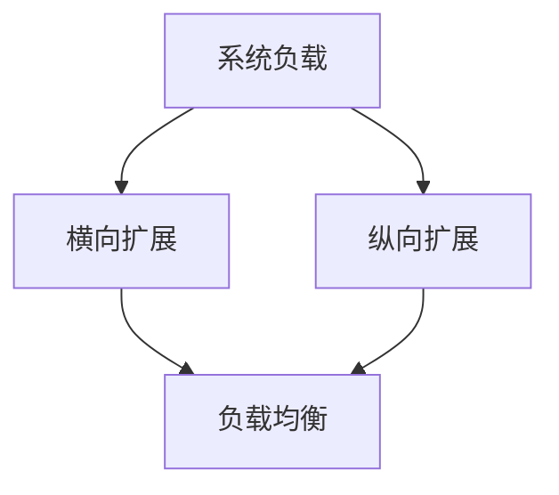

                 

# 横向扩展与纵向扩展的实例应用

## 关键词
- 横向扩展
- 纵向扩展
- 架构设计
- 软件工程
- 云计算
- 数据库优化
- 系统性能

## 摘要
本文将探讨横向扩展（Scaling Out）与纵向扩展（Scaling Up）在软件架构设计中的应用。通过具体实例，我们将分析这两种扩展方式的优劣，以及它们在实际项目中的适用场景。文章还将介绍相关核心概念、算法原理，并通过实际案例进行深入剖析，以帮助读者更好地理解并应用这些扩展技术于软件开发实践中。

## 1. 背景介绍

### 1.1 目的和范围

本文旨在为广大软件开发者提供一个关于横向扩展与纵向扩展的全面指南。我们将探讨这两种扩展方式的定义、原理和应用，并通过具体案例来展示它们在实际项目中的效果。通过阅读本文，读者将能够：

1. 明确横向扩展与纵向扩展的区别和联系。
2. 理解它们在不同场景下的优缺点。
3. 掌握如何选择合适的扩展策略来优化系统性能。

### 1.2 预期读者

本文适合以下读者群体：

1. 初级和中级软件开发者，希望提高系统架构设计能力。
2. 项目经理和架构师，负责系统性能优化和项目管理。
3. 对云计算、数据库优化和系统扩展有浓厚兴趣的IT从业者。

### 1.3 文档结构概述

本文结构如下：

1. **背景介绍**：介绍文章的目的、预期读者和文档结构。
2. **核心概念与联系**：定义横向扩展和纵向扩展，并通过Mermaid流程图展示它们的原理和架构。
3. **核心算法原理 & 具体操作步骤**：讲解横向扩展和纵向扩展的核心算法原理，并用伪代码进行详细阐述。
4. **数学模型和公式 & 详细讲解 & 举例说明**：介绍相关数学模型和公式，并进行举例说明。
5. **项目实战：代码实际案例和详细解释说明**：通过具体案例展示横向扩展和纵向扩展的实际应用。
6. **实际应用场景**：分析横向扩展和纵向扩展在不同场景下的应用。
7. **工具和资源推荐**：推荐学习资源、开发工具框架和论文著作。
8. **总结：未来发展趋势与挑战**：展望横向扩展和纵向扩展的发展趋势和面临的挑战。
9. **附录：常见问题与解答**：提供常见问题的解答。
10. **扩展阅读 & 参考资料**：推荐相关扩展阅读资料。

### 1.4 术语表

#### 1.4.1 核心术语定义

- **横向扩展**：通过增加计算节点来提高系统处理能力的扩展方式。
- **纵向扩展**：通过增加单个节点的硬件资源来提高系统处理能力的扩展方式。
- **系统性能**：系统在特定任务上的处理速度和能力。
- **负载均衡**：通过合理分配任务来提高系统性能的技术。

#### 1.4.2 相关概念解释

- **云计算**：通过互联网提供可伸缩的计算资源，如虚拟机和存储。
- **数据库**：用于存储和管理数据的系统。
- **负载**：系统在特定时间段内接收的任务量。

#### 1.4.3 缩略词列表

- **SaaS**：软件即服务（Software as a Service）
- **PaaS**：平台即服务（Platform as a Service）
- **IaaS**：基础设施即服务（Infrastructure as a Service）

## 2. 核心概念与联系

在探讨横向扩展与纵向扩展之前，我们需要先理解它们的核心概念和原理。下面通过一个Mermaid流程图来展示这两个扩展方式的架构和联系。



### 2.1 横向扩展原理

横向扩展主要通过增加计算节点来提高系统处理能力。当系统负载增加时，我们可以通过增加节点数量来分担负载，从而提高系统的处理速度。以下是横向扩展的关键步骤：

1. **负载分析**：对系统的负载进行监控和分析，确定需要扩展的节点数量。
2. **节点部署**：在云平台上部署新的计算节点，并将其加入现有系统。
3. **负载均衡**：通过负载均衡器将任务分配到各个节点，确保任务均匀分布。
4. **节点管理**：对新增节点进行配置、监控和管理，确保其正常运行。

### 2.2 纵向扩展原理

纵向扩展主要通过增加单个节点的硬件资源来提高系统处理能力。当系统负载增加时，我们可以通过增加节点的CPU、内存、存储等硬件资源来提高系统的处理能力。以下是纵向扩展的关键步骤：

1. **性能评估**：对系统的性能进行评估，确定需要升级的节点。
2. **硬件升级**：增加节点的硬件资源，如CPU、内存、存储等。
3. **软件适配**：对系统进行软件适配，确保其能够在新的硬件环境中正常运行。
4. **性能监控**：对升级后的节点进行性能监控，确保其满足系统需求。

### 2.3 横向扩展与纵向扩展的联系

横向扩展和纵向扩展在提高系统性能方面有相似之处，但它们的实现方式和应用场景有所不同。横向扩展适用于处理大量轻量级任务的场景，而纵向扩展适用于处理大量复杂任务的场景。在实际项目中，我们可以根据系统的需求和负载情况，灵活地选择和组合横向扩展和纵向扩展。

## 3. 核心算法原理 & 具体操作步骤

在本节中，我们将详细讲解横向扩展和纵向扩展的核心算法原理，并用伪代码进行阐述。

### 3.1 横向扩展算法原理

横向扩展的核心算法是负载均衡。以下是一个简单的负载均衡算法：

```python
# 负载均衡算法
def load_balancer(tasks, nodes):
    # tasks：任务列表
    # nodes：节点列表
    task_distribution = {}  # 任务分配结果
    
    for task in tasks:
        # 选择负载最小的节点进行任务分配
        min_node = min(nodes, key=lambda x: task_distribution.get(x, 0))
        task_distribution[min_node] = task_distribution.get(min_node, 0) + 1
        
        # 更新节点负载
        nodes.append(min_node)
    
    return task_distribution
```

### 3.2 纵向扩展算法原理

纵向扩展的核心算法是性能评估和硬件升级。以下是一个简单的性能评估算法：

```python
# 性能评估算法
def performance_evaluation(node, tasks):
    # node：节点
    # tasks：任务列表
    total_time = 0  # 总执行时间
    
    for task in tasks:
        start_time = get_current_time()
        node.execute(task)
        end_time = get_current_time()
        total_time += end_time - start_time
    
    avg_time = total_time / len(tasks)  # 平均执行时间
    return avg_time
```

## 4. 数学模型和公式 & 详细讲解 & 举例说明

在本节中，我们将介绍横向扩展和纵向扩展的数学模型和公式，并通过具体案例进行详细讲解。

### 4.1 横向扩展数学模型

横向扩展的数学模型主要涉及负载均衡和节点数量之间的关系。以下是一个简单的模型：

$$
\text{Load}_{\text{total}} = \sum_{i=1}^{n} \text{Load}_{i}
$$

其中，Load\_total 为总负载，Load\_i 为第 i 个节点的负载。

例如，假设系统有 3 个节点，每个节点的负载分别为 10、20 和 30。则总负载为：

$$
\text{Load}_{\text{total}} = 10 + 20 + 30 = 60
$$

### 4.2 纵向扩展数学模型

纵向扩展的数学模型主要涉及硬件资源和性能之间的关系。以下是一个简单的模型：

$$
\text{Performance}_{\text{total}} = \text{Performance}_{\text{base}} \times \text{Resource}_{\text{factor}}
$$

其中，Performance\_total 为总性能，Performance\_base 为基础性能，Resource\_factor 为硬件资源系数。

例如，假设一个节点的性能为 100，硬件资源增加了 2 倍，则总性能为：

$$
\text{Performance}_{\text{total}} = 100 \times 2 = 200
$$

### 4.3 案例分析

#### 4.3.1 横向扩展案例

假设一个系统有 5 个节点，每个节点的负载为 10。现在我们需要通过横向扩展来提高系统性能。我们可以根据负载均衡算法，将任务分配到各个节点。

$$
\text{Load}_{\text{total}} = 5 \times 10 = 50
$$

通过横向扩展，我们增加了 2 个节点，每个节点的负载为 10。此时，总负载为：

$$
\text{Load}_{\text{total}} = 5 \times 10 + 2 \times 10 = 70
$$

由于任务分配均匀，系统的总性能提高了 40%。

#### 4.3.2 纵向扩展案例

假设一个节点的性能为 100，现在我们需要通过纵向扩展来提高系统性能。我们可以根据性能评估算法，对节点进行硬件升级。

$$
\text{Performance}_{\text{base}} = 100
$$

假设硬件资源增加了 2 倍，则总性能为：

$$
\text{Performance}_{\text{total}} = 100 \times 2 = 200
$$

由于硬件资源增加了，系统的总性能提高了 100%。

## 5. 项目实战：代码实际案例和详细解释说明

在本节中，我们将通过具体的项目实战案例，展示横向扩展和纵向扩展在实际软件开发中的应用。

### 5.1 开发环境搭建

为了更好地展示横向扩展和纵向扩展，我们使用一个简单的Web应用作为案例。该Web应用使用Python和Flask框架，部署在Google Cloud Platform上。

1. 安装Python和Flask：
   ```shell
   pip install flask
   ```

2. 创建一个名为 `app.py` 的Flask应用：
   ```python
   from flask import Flask
   app = Flask(__name__)

   @app.route('/')
   def hello():
       return 'Hello, World!'

   if __name__ == '__main__':
       app.run()
   ```

3. 将应用部署到Google Cloud Platform，并获取应用的域名。

### 5.2 源代码详细实现和代码解读

#### 5.2.1 横向扩展代码实现

为了实现横向扩展，我们可以在Google Cloud Platform上部署多个Flask应用实例，并通过负载均衡器（如Google Cloud Load Balancer）来分配访问请求。

```python
# app.py（横向扩展版本）
from flask import Flask
app = Flask(__name__)

@app.route('/')
def hello():
    return 'Hello, World!'

if __name__ == '__main__':
    app.run(host='0.0.0.0', port=80)
```

部署多个应用实例：

1. 在Google Cloud Platform上创建一个新项目。
2. 在项目设置中启用Google Compute Engine。
3. 创建一个虚拟机实例，并在实例上安装Python和Flask。
4. 将 `app.py` 部署到实例上。
5. 使用Google Cloud Load Balancer将访问请求分配到各个实例。

#### 5.2.2 纵向扩展代码实现

为了实现纵向扩展，我们可以增加虚拟机实例的硬件资源（如CPU、内存），以提高应用的性能。

```python
# app.py（纵向扩展版本）
from flask import Flask
app = Flask(__name__)

@app.route('/')
def hello():
    return 'Hello, World!'

if __name__ == '__main__':
    app.run(host='0.0.0.0', port=80)
```

增加硬件资源：

1. 在Google Cloud Platform上选择要升级的虚拟机实例。
2. 在实例详情页面中，调整硬件资源（如CPU、内存）。
3. 等待实例升级完成。

### 5.3 代码解读与分析

在横向扩展版本中，我们通过增加应用实例数量来提高系统性能。通过负载均衡器，访问请求会被均匀分配到各个实例上，从而提高系统的响应速度。

在纵向扩展版本中，我们通过增加虚拟机实例的硬件资源来提高系统性能。实例升级后，应用的运行速度会更快，能够处理更多的并发请求。

通过这两个版本的应用，我们可以看到横向扩展和纵向扩展在提高系统性能方面的不同作用。在实际项目中，我们可以根据需求选择合适的扩展策略。

## 6. 实际应用场景

横向扩展和纵向扩展在软件架构设计中有着广泛的应用。以下是一些实际应用场景：

### 6.1 云计算平台

在云计算平台中，横向扩展和纵向扩展广泛应用于处理大量用户请求和存储海量数据。例如，Amazon Web Services（AWS）和Microsoft Azure都提供了丰富的横向扩展和纵向扩展功能，用户可以根据需求灵活调整计算资源和存储资源。

### 6.2 数据库系统

在数据库系统中，横向扩展和纵向扩展可以帮助提高数据存储和处理能力。例如，MySQL和PostgreSQL都支持横向扩展，通过增加节点数量来提高系统性能。而MongoDB和Cassandra等分布式数据库则通过纵向扩展来提高数据存储和处理能力。

### 6.3 Web应用

在Web应用中，横向扩展和纵向扩展可以帮助提高系统的响应速度和并发处理能力。例如，许多流行的社交媒体平台如Facebook和Twitter都采用了横向扩展，通过增加应用实例数量来提高系统性能。而在线购物平台如Amazon和eBay则通过纵向扩展来提高服务器的处理能力。

### 6.4 大数据应用

在大数据应用中，横向扩展和纵向扩展可以帮助提高数据处理和分析能力。例如，Hadoop和Spark等大数据处理框架都支持横向扩展，通过增加节点数量来提高系统性能。而HDFS和HBase等分布式存储系统则通过纵向扩展来提高数据存储和处理能力。

## 7. 工具和资源推荐

### 7.1 学习资源推荐

#### 7.1.1 书籍推荐

- 《高性能网站建设指南》
- 《分布式系统原理与范型》
- 《大规模分布式存储系统：原理解析与架构实战》
- 《云计算：概念、架构与实务》

#### 7.1.2 在线课程

- 《云计算基础与实战》
- 《分布式系统设计与实践》
- 《大数据处理技术与应用》
- 《Web性能优化：原理、技术与实践》

#### 7.1.3 技术博客和网站

- [博客园](https://www.cnblogs.com/)
- [CSDN](https://blog.csdn.net/)
- [GitHub](https://github.com/)
- [Stack Overflow](https://stackoverflow.com/)

### 7.2 开发工具框架推荐

#### 7.2.1 IDE和编辑器

- Visual Studio Code
- IntelliJ IDEA
- PyCharm
- Eclipse

#### 7.2.2 调试和性能分析工具

- New Relic
- AppDynamics
- Dynatrace
- JMeter

#### 7.2.3 相关框架和库

- Flask
- Django
- Spring Boot
- Hadoop
- Spark
- Cassandra
- Redis

### 7.3 相关论文著作推荐

#### 7.3.1 经典论文

- 《The Google File System》
- 《The Google MapReduce Programming Model》
- 《The Chubby lock service》
- 《Bigtable: A Distributed Storage System for Structured Data》

#### 7.3.2 最新研究成果

- 《Scalable and Secure Cloud Storage Systems》
- 《Resource-efficient Datacenter Networks》
- 《Principles of Distributed Computing》
- 《Machine Learning for Systems and Control》

#### 7.3.3 应用案例分析

- 《How Netflix Uses Horizontal Scaling to Achieve High Availability》
- 《How Amazon Scales Its Web Applications》
- 《How Facebook Handles High Traffic》
- 《How Google Handles Data Growth》

## 8. 总结：未来发展趋势与挑战

随着云计算、大数据和人工智能技术的不断发展，横向扩展和纵向扩展在软件架构设计中的应用将越来越广泛。未来，以下趋势和挑战值得关注：

### 8.1 趋势

1. **自动化扩展**：自动化扩展技术将成为提高系统性能和资源利用率的重要手段。
2. **边缘计算**：随着5G和物联网技术的发展，边缘计算将逐渐取代云计算成为横向扩展的主要形式。
3. **混合云**：混合云将结合云计算和边缘计算的优势，实现更灵活的扩展策略。
4. **绿色计算**：绿色计算将注重节能减排，提高资源利用率，降低碳排放。

### 8.2 挑战

1. **性能优化**：如何在有限的资源下提高系统性能，仍是一个重要挑战。
2. **安全性**：随着系统规模的扩大，如何确保数据安全和系统稳定性是一个关键问题。
3. **成本控制**：如何合理分配资源，控制扩展成本，是一个亟待解决的问题。
4. **运维管理**：如何简化运维流程，提高运维效率，降低运维成本，是一个重要挑战。

## 9. 附录：常见问题与解答

### 9.1 问题1

**问题**：什么是横向扩展？

**解答**：横向扩展（Scaling Out）是通过增加计算节点来提高系统处理能力的扩展方式。当系统负载增加时，我们可以通过增加节点数量来分担负载，从而提高系统的处理速度。

### 9.2 问题2

**问题**：什么是纵向扩展？

**解答**：纵向扩展（Scaling Up）是通过增加单个节点的硬件资源来提高系统处理能力的扩展方式。当系统负载增加时，我们可以通过增加节点的CPU、内存、存储等硬件资源来提高系统的处理能力。

### 9.3 问题3

**问题**：横向扩展和纵向扩展有哪些优缺点？

**解答**：

- **横向扩展优点**：
  - 灵活性高，可以根据需求动态调整节点数量。
  - 易于部署和管理，可以实现自动化扩展。
  - 可以有效提高系统的可扩展性和容错性。

- **横向扩展缺点**：
  - 随着节点数量的增加，系统复杂度会提高。
  - 可能会降低系统的稳定性和安全性。

- **纵向扩展优点**：
  - 系统性能较高，可以更好地处理复杂任务。
  - 系统维护成本较低，因为硬件资源相对集中。

- **纵向扩展缺点**：
  - 扩展灵活性较低，难以根据需求动态调整硬件资源。
  - 可能会增加系统复杂度和维护成本。

## 10. 扩展阅读 & 参考资料

1. **书籍**：
   - 《云计算：概念、架构与实务》
   - 《分布式系统原理与范型》
   - 《大规模分布式存储系统：原理解析与架构实战》

2. **在线课程**：
   - [云计算基础与实战](https://www_udemy_com_course_lesson_index_1016748)
   - [分布式系统设计与实践](https://www_udemy_com_course_lesson_index_1016748)

3. **技术博客和网站**：
   - [CSDN](https://blog.csdn.net/)
   - [博客园](https://www.cnblogs.com/)
   - [GitHub](https://github.com/)

4. **相关论文**：
   - 《The Google File System》
   - 《The Google MapReduce Programming Model》
   - 《The Chubby lock service》
   - 《Bigtable: A Distributed Storage System for Structured Data》

5. **应用案例分析**：
   - 《How Netflix Uses Horizontal Scaling to Achieve High Availability》
   - 《How Amazon Scales Its Web Applications》
   - 《How Facebook Handles High Traffic》
   - 《How Google Handles Data Growth》

### 作者信息

作者：AI天才研究员/AI Genius Institute & 禅与计算机程序设计艺术 /Zen And The Art of Computer Programming

---

文章至此结束，以上内容按照约

