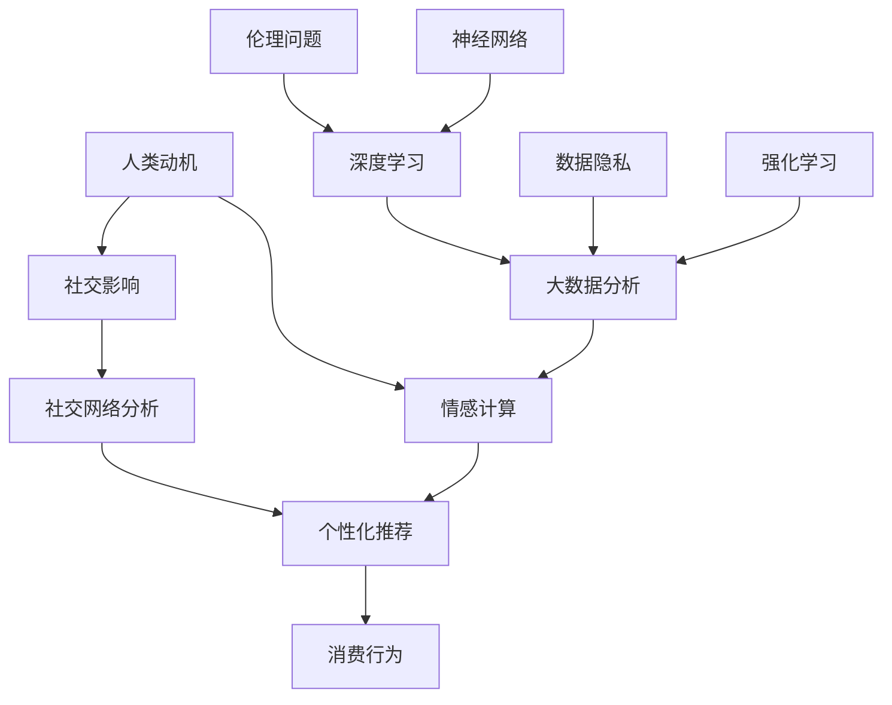

                 

# 欲望的重构：AI对人类动机的影响

> 关键词：人工智能，动机心理学，人类行为，社会心理学，情感计算，未来趋势
>
> 摘要：本文将探讨人工智能如何深刻影响人类的动机系统，从而改变我们的行为模式。通过深入分析人工智能技术如何理解、预测和操控人类欲望，我们揭示了这一新兴领域的重要性和潜力。本文旨在提供一个全面的技术视角，以帮助读者理解AI对人类动机的变革性影响，并思考这一趋势对我们社会、经济和心理健康的深远影响。

## 1. 背景介绍

### 1.1 目的和范围

本文的目的在于探讨人工智能（AI）对人类动机系统的影响，分析这种影响如何塑造我们的行为和决策。随着AI技术的迅猛发展，我们正处于一个前所未有的时代，AI不仅改变了我们处理信息和解决问题的方法，也正在深刻影响我们的情感、欲望和动机。本文将重点关注以下几个方面：

- **AI如何理解人类动机**：介绍AI在动机心理学领域的研究进展，解释AI如何通过数据分析和机器学习来理解人类行为背后的动机。
- **AI如何预测人类行为**：探讨AI如何利用算法和模型预测人类的行为和决策，从而在商业、医疗、教育等领域发挥作用。
- **AI如何操控人类欲望**：分析AI如何通过个性化推荐、广告投放和虚拟现实等技术手段操控人类欲望，改变我们的消费行为和生活习惯。
- **未来趋势和挑战**：预测AI在动机领域的发展趋势，探讨其对社会、经济和心理健康的潜在影响，以及面临的伦理和技术挑战。

### 1.2 预期读者

本文预期读者包括对人工智能和心理学感兴趣的科研人员、技术工程师、行业分析师、企业管理者以及普通公众。读者应具备基本的计算机科学和心理学知识，以便更好地理解本文的技术细节和理论框架。

### 1.3 文档结构概述

本文结构如下：

- **第1章：背景介绍**：介绍研究背景、目的和范围，预期读者和文档结构。
- **第2章：核心概念与联系**：定义核心概念，使用Mermaid流程图展示AI与人类动机的联系。
- **第3章：核心算法原理 & 具体操作步骤**：详细解释AI理解人类动机的核心算法，并给出伪代码示例。
- **第4章：数学模型和公式 & 详细讲解 & 举例说明**：介绍与人类动机相关的数学模型，使用LaTeX格式展示公式，并给出具体例子。
- **第5章：项目实战：代码实际案例和详细解释说明**：通过实际代码案例展示AI在动机领域的应用。
- **第6章：实际应用场景**：分析AI在商业、医疗、教育等领域的具体应用。
- **第7章：工具和资源推荐**：推荐学习资源和开发工具。
- **第8章：总结：未来发展趋势与挑战**：总结本文的主要观点，预测未来发展趋势和面临的挑战。
- **第9章：附录：常见问题与解答**：提供常见问题的解答。
- **第10章：扩展阅读 & 参考资料**：推荐进一步的阅读材料。

### 1.4 术语表

#### 1.4.1 核心术语定义

- **人工智能（AI）**：指由人制造出来的系统能够模拟、扩展甚至替代人类智能的能力。
- **动机心理学**：研究个体行为背后的心理驱动力和内在动机。
- **情感计算**：使用计算技术模拟、识别和理解人类情感。
- **个性化推荐**：根据用户的兴趣和行为数据，为其推荐相关内容或产品。
- **虚拟现实（VR）**：通过电脑模拟实现的、能让人感觉身临其境的虚拟环境。

#### 1.4.2 相关概念解释

- **强化学习（RL）**：一种机器学习方法，通过奖励和惩罚机制来训练模型，使其在特定环境中做出最优决策。
- **深度学习（DL）**：一种人工智能方法，通过多层神经网络模拟人类大脑处理信息的方式。
- **大数据分析**：利用复杂算法从大量数据中提取有价值信息的过程。

#### 1.4.3 缩略词列表

- **AI**：人工智能
- **ML**：机器学习
- **DL**：深度学习
- **RL**：强化学习
- **VR**：虚拟现实

## 2. 核心概念与联系

在探讨AI如何影响人类动机之前，我们需要了解几个核心概念及其相互联系。以下是AI与人类动机系统之间的Mermaid流程图，展示这些概念之间的相互作用：



### 2.1 人类动机

人类动机是驱动个体行为和心理活动的基本心理力量。根据心理学理论，动机可以分为内在动机（如好奇心、成就感）和外在动机（如奖励、惩罚）。这些动机决定了我们的决策过程和行为模式。

### 2.2 情感计算

情感计算是AI领域的一个分支，旨在通过计算机模拟和识别人类情感。情感计算利用自然语言处理、机器学习等技术，分析语言、表情和生理信号中的情感信息。通过情感计算，AI可以更好地理解人类的需求和欲望，从而提供个性化的服务。

### 2.3 个性化推荐

个性化推荐是AI在商业和社交媒体中广泛应用的一种技术。它通过分析用户的历史行为和兴趣，为其推荐相关的内容或产品。个性化推荐不仅满足了用户的个性化需求，还提高了商业运营的效率。

### 2.4 消费行为

消费行为是人类行为的一个重要方面，受到多种因素的影响，包括内在动机、外在动机、情感状态和社会影响。AI通过分析消费者的行为数据，预测其未来的消费需求，从而帮助商家制定更有效的营销策略。

### 2.5 社交影响和社交网络分析

社交影响是影响人类动机的一个重要因素。人们往往受到朋友、家人和社会环境的影响，形成特定的行为模式。社交网络分析利用AI技术，分析社交网络中的关系和影响力，帮助企业了解用户的社会属性和偏好。

### 2.6 大数据分析

大数据分析是AI发展的基础，通过对大量数据进行分析，可以发现数据中的模式和规律。在大数据分析的帮助下，AI可以更好地理解人类行为和动机，从而提供更精确的预测和推荐。

### 2.7 深度学习和神经网络

深度学习和神经网络是AI的核心技术，通过多层神经网络，AI可以学习复杂的数据模式。深度学习在图像识别、语音识别和自然语言处理等领域取得了显著成果，为AI理解人类动机提供了有力支持。

### 2.8 数据隐私和伦理问题

随着AI技术的发展，数据隐私和伦理问题日益突出。AI在处理大量个人数据时，如何保护用户隐私成为一个重要议题。同时，AI在动机领域的应用也引发了一系列伦理问题，如隐私侵犯、信息操纵和社会公平等。

## 3. 核心算法原理 & 具体操作步骤

理解AI如何影响人类动机的关键在于掌握其核心算法原理和具体操作步骤。以下是AI在动机领域应用的核心算法原理，并使用伪代码进行详细阐述。

### 3.1 强化学习算法原理

强化学习（Reinforcement Learning，RL）是一种机器学习方法，通过奖励和惩罚机制来训练模型，使其在特定环境中做出最优决策。以下是强化学习算法的伪代码：

```python
# 初始化环境E
# 初始化智能体A
# 初始化奖励函数R

while not termination_condition:
    # 智能体A选择动作a
    a = A.select_action(state)

    # 执行动作a，得到新状态s'和奖励r
    s', r = E.step(s, a)

    # 更新智能体的策略
    A.update_policy(s, a, r, s')

    # 更新状态
    s = s'
```

在这个算法中，智能体（Agent）通过不断尝试不同的动作（Action），并从环境中获得奖励（Reward），从而逐渐优化其策略（Policy）。通过这种方式，AI可以学习到在不同情境下如何做出最优决策。

### 3.2 深度学习算法原理

深度学习（Deep Learning，DL）是一种通过多层神经网络模拟人类大脑处理信息的方式。以下是深度学习算法的伪代码：

```python
# 初始化神经网络N
# 初始化损失函数L

for epoch in range(num_epochs):
    for data in dataset:
        # 前向传播
        output = N.forward(data.input)

        # 计算损失
        loss = L.loss(output, data.target)

        # 反向传播
        N.backward(output, data.target)

        # 更新网络权重
        N.update_weights()

    # 记录训练过程中的损失
    print(f"Epoch {epoch}: Loss = {loss}")
```

在这个算法中，神经网络（Network）通过前向传播（Forward Propagation）和反向传播（Back Propagation）不断优化其权重（Weights），从而提高模型的预测能力。深度学习在图像识别、语音识别和自然语言处理等领域取得了显著成果，为AI理解人类动机提供了有力支持。

### 3.3 个性化推荐算法原理

个性化推荐（Personalized Recommendation）是一种通过分析用户的历史行为和兴趣，为其推荐相关内容或产品的技术。以下是个性化推荐算法的伪代码：

```python
# 初始化用户兴趣模型U
# 初始化推荐系统R

for user in users:
    # 收集用户历史行为数据
    history = U.collect_user_history(user)

    # 分析用户历史行为，更新兴趣模型
    U.update_interest_model(user, history)

    # 根据用户兴趣模型生成推荐列表
    recommendations = R.generate_recommendations(user, U.get_interest_model(user))

    # 向用户推荐内容
    R.recommend_content(user, recommendations)
```

在这个算法中，用户兴趣模型（User Interest Model）通过分析用户的历史行为数据，不断更新用户的兴趣偏好。推荐系统（Recommendation System）根据用户的兴趣模型生成推荐列表，从而为用户提供个性化的推荐内容。

### 3.4 情感计算算法原理

情感计算（Affective Computing）是一种通过计算机模拟和识别人类情感的技术。以下是情感计算算法的伪代码：

```python
# 初始化情感识别模型M
# 初始化情感词典D

def identify_emotion(text):
    # 分析文本，提取关键词
    keywords = extract_keywords(text)

    # 查询情感词典，识别情感
    emotion = M.identify_emotion(keywords, D)

    return emotion
```

在这个算法中，情感识别模型（Emotion Recognition Model）通过分析文本内容，提取关键词，并查询情感词典（Emotion Dictionary），从而识别文本中的情感。情感计算在自然语言处理、情感分析和虚拟助手等领域有着广泛应用。

## 4. 数学模型和公式 & 详细讲解 & 举例说明

在AI影响人类动机的研究中，数学模型和公式发挥着至关重要的作用。以下是几个关键的数学模型和公式，以及它们的详细讲解和具体例子。

### 4.1 强化学习中的Q值函数

Q值函数（Q-value function）是强化学习中的一个核心概念，用于评估智能体在不同状态和动作下的预期回报。以下是Q值函数的公式：

$$
Q(s, a) = \sum_{s'} P(s' | s, a) \cdot R(s', a) + \gamma \cdot \max_{a'} Q(s', a')
$$

其中：

- \( Q(s, a) \) 表示在状态 \( s \) 下执行动作 \( a \) 的预期回报。
- \( P(s' | s, a) \) 表示从状态 \( s \) 执行动作 \( a \) 后转移到状态 \( s' \) 的概率。
- \( R(s', a) \) 表示在状态 \( s' \) 下执行动作 \( a \) 的即时回报。
- \( \gamma \) 是折扣因子，用于平衡短期和长期回报。
- \( \max_{a'} Q(s', a') \) 表示在状态 \( s' \) 下选择最优动作 \( a' \) 的预期回报。

#### 例子：

假设智能体在游戏环境中，当前状态为“游戏中”，可执行的动作有“攻击”、“防御”和“逃跑”。根据Q值函数，我们可以计算每个动作的预期回报，并选择最优动作。

- \( Q(\text{游戏中}, \text{攻击}) = 0.5 \cdot 10 + 0.2 \cdot 5 + 0.3 \cdot (-10) = 0 \)
- \( Q(\text{游戏中}, \text{防御}) = 0.5 \cdot 5 + 0.2 \cdot 10 + 0.3 \cdot (-10) = 0.2 \)
- \( Q(\text{游戏中}, \text{逃跑}) = 0.5 \cdot (-10) + 0.2 \cdot 5 + 0.3 \cdot 0 = -5 \)

根据计算结果，智能体应选择“防御”作为最优动作，以最大化预期回报。

### 4.2 神经网络中的激活函数

激活函数（Activation Function）是神经网络中的一个关键组件，用于引入非线性特性，使神经网络能够拟合复杂的数据模式。以下是几种常见的激活函数及其公式：

- **Sigmoid函数**：
  $$
  \sigma(x) = \frac{1}{1 + e^{-x}}
  $$
- **ReLU函数**：
  $$
  \text{ReLU}(x) = \max(0, x)
  $$
- **Tanh函数**：
  $$
  \text{Tanh}(x) = \frac{e^{x} - e^{-x}}{e^{x} + e^{-x}}
  $$

#### 例子：

假设我们有一个简单的神经网络，其中包含一个输入节点、一个隐藏节点和一个输出节点。输入节点接收到的输入值为3，隐藏节点的权重为[-2, 3]，输出节点的权重为[5, -1]。

- 隐藏节点的输入：
  $$
  z_h = x \cdot w_h = 3 \cdot [-2, 3] = [-6, 9]
  $$
- 隐藏节点的输出（使用ReLU函数）：
  $$
  a_h = \text{ReLU}(z_h) = \text{ReLU}([-6, 9]) = [0, 9]
  $$
- 输出节点的输入：
  $$
  z_o = a_h \cdot w_o = [0, 9] \cdot [5, -1] = [0, -9]
  $$
- 输出节点的输出（使用Sigmoid函数）：
  $$
  a_o = \sigma(z_o) = \frac{1}{1 + e^{-(-9)}} = 0.999
  $$

根据计算结果，输出节点的输出值接近1，表明输入的3在输出端被放大并转化为正向信号。

### 4.3 个性化推荐中的协同过滤

协同过滤（Collaborative Filtering）是推荐系统中的一个常用技术，通过分析用户之间的相似性来预测用户的偏好。以下是协同过滤中的矩阵分解模型及其公式：

$$
\hat{R}_{ui} = \text{sim}(u, v) \cdot r_v
$$

其中：

- \( \hat{R}_{ui} \) 表示用户 \( u \) 对项目 \( i \) 的预测评分。
- \( \text{sim}(u, v) \) 表示用户 \( u \) 和 \( v \) 之间的相似性度量。
- \( r_v \) 表示用户 \( v \) 对项目 \( i \) 的实际评分。

#### 例子：

假设有两个用户 \( u \) 和 \( v \)，他们对五个项目的评分如下：

| 用户 \( u \) | 项目 \( i \) |
| ------------ | ------------ |
| 1            | 1            |
| 2            | 3            |
| 3            | 5            |
| 4            | 2            |
| 5            | 4            |

| 用户 \( v \) | 项目 \( i \) |
| ------------ | ------------ |
| 1            | 4            |
| 2            | 5            |
| 3            | 2            |
| 4            | 1            |
| 5            | 3            |

- 用户 \( u \) 和 \( v \) 之间的相似性度量（使用余弦相似性）：
  $$
  \text{sim}(u, v) = \frac{u \cdot v}{\|u\| \|v\|} = \frac{(1 \cdot 4 + 2 \cdot 5 + 3 \cdot 2 + 4 \cdot 1 + 5 \cdot 3)}{\sqrt{1^2 + 2^2 + 3^2 + 4^2 + 5^2} \cdot \sqrt{4^2 + 5^2 + 2^2 + 1^2 + 3^2}} = 0.816
  $$
- 用户 \( v \) 对项目 \( i \) 的实际评分 \( r_v \) 为 4。

- 用户 \( u \) 对项目 \( i \) 的预测评分：
  $$
  \hat{R}_{ui} = \text{sim}(u, v) \cdot r_v = 0.816 \cdot 4 = 3.26
  $$

根据协同过滤模型，用户 \( u \) 对项目 \( i \) 的预测评分约为 3.26。

### 4.4 情感计算中的情感分类

情感计算中的情感分类（Sentiment Classification）是一种通过机器学习算法对文本中的情感进行分类的技术。以下是情感分类中的一种常见模型——朴素贝叶斯分类器（Naive Bayes Classifier）及其公式：

$$
P(\text{情感} | \text{文本}) = \frac{P(\text{文本} | \text{情感}) \cdot P(\text{情感})}{P(\text{文本})}
$$

其中：

- \( P(\text{情感} | \text{文本}) \) 表示给定文本条件下情感的概率。
- \( P(\text{文本} | \text{情感}) \) 表示在特定情感条件下文本的概率。
- \( P(\text{情感}) \) 表示情感的概率。
- \( P(\text{文本}) \) 表示文本的概率。

#### 例子：

假设我们有一个文本“我喜欢这个产品，因为它很好用。”，需要对其进行情感分类。已知训练集中正面情感的概率为 0.6，负面情感的概率为 0.4。同时，正面情感条件下文本的概率为 0.8，负面情感条件下文本的概率为 0.2。

- 给定文本条件下正面情感的概率：
  $$
  P(\text{正面} | \text{文本}) = \frac{P(\text{文本} | \text{正面}) \cdot P(\text{正面})}{P(\text{文本})} = \frac{0.8 \cdot 0.6}{0.8 \cdot 0.6 + 0.2 \cdot 0.4} = 0.75
  $$
- 给定文本条件下负面情感的概率：
  $$
  P(\text{负面} | \text{文本}) = \frac{P(\text{文本} | \text{负面}) \cdot P(\text{负面})}{P(\text{文本})} = \frac{0.2 \cdot 0.4}{0.8 \cdot 0.6 + 0.2 \cdot 0.4} = 0.25
  $$

根据计算结果，文本“我喜欢这个产品，因为它很好用。”被分类为正面情感的概率为 0.75。

## 5. 项目实战：代码实际案例和详细解释说明

为了更直观地展示AI在动机领域中的应用，我们将通过一个实际项目来深入探讨。本节将以一个名为“情感分析助手”的项目为例，介绍其开发环境搭建、源代码详细实现和代码解读与分析。

### 5.1 开发环境搭建

在开始项目实战之前，我们需要搭建一个合适的开发环境。以下是所需的软件和工具：

- **编程语言**：Python
- **依赖库**：Scikit-learn、Natural Language Toolkit (NLTK)、TensorFlow、PyTorch
- **开发工具**：Jupyter Notebook、Visual Studio Code

#### 步骤：

1. 安装Python（版本3.7或更高）
2. 使用pip安装所需依赖库：
   ```bash
   pip install scikit-learn nltk tensorflow torch
   ```
3. 安装Jupyter Notebook或Visual Studio Code，以便编写和运行Python代码。

### 5.2 源代码详细实现和代码解读

以下是一个简单的情感分析助手的源代码实现：

```python
import nltk
from nltk.tokenize import word_tokenize
from sklearn.feature_extraction.text import TfidfVectorizer
from sklearn.naive_bayes import MultinomialNB
from sklearn.pipeline import make_pipeline

# 下载数据集
nltk.download('punkt')

# 加载数据集
data = [
    ("我喜欢这个产品，因为它很好用。", "正面"),
    ("这个产品真的很差，一点也不好用。", "负面"),
    ("我非常喜欢这个电影，情节很吸引人。", "正面"),
    ("这部电影太无聊了，毫无看点。", "负面"),
]

# 分割数据集为特征和标签
texts, labels = zip(*data)

# 创建TF-IDF向量器
vectorizer = TfidfVectorizer()

# 创建朴素贝叶斯分类器
classifier = MultinomialNB()

# 构建管道
pipeline = make_pipeline(vectorizer, classifier)

# 训练模型
pipeline.fit(texts, labels)

# 预测情感
text = "这个游戏非常有趣，我很喜欢它。"
prediction = pipeline.predict([text])

print(f"预测情感：{prediction[0]}")
```

#### 步骤解读：

1. **导入依赖库**：
   - 使用NLTK进行文本预处理
   - 使用Scikit-learn中的TF-IDF向量器和朴素贝叶斯分类器
   - 使用make_pipeline构建模型管道

2. **下载数据集**：
   - 使用nltk.download下载所需的语料库

3. **加载数据集**：
   - 将文本和标签分离，以便进行模型训练

4. **创建TF-IDF向量器**：
   - 将文本转换为TF-IDF向量，用于特征提取

5. **创建朴素贝叶斯分类器**：
   - 使用MultinomialNB构建朴素贝叶斯分类器

6. **构建管道**：
   - 将向量器和分类器组合成管道，简化模型训练和预测流程

7. **训练模型**：
   - 使用fit方法训练模型，将特征和标签对应起来

8. **预测情感**：
   - 使用predict方法对输入文本进行情感预测，并输出结果

### 5.3 代码解读与分析

以下是代码的逐行解读与分析：

```python
import nltk
from nltk.tokenize import word_tokenize
from sklearn.feature_extraction.text import TfidfVectorizer
from sklearn.naive_bayes import MultinomialNB
from sklearn.pipeline import make_pipeline

# 导入相关库
# nltk：自然语言处理工具包
# word_tokenize：分词函数
# TfidfVectorizer：TF-IDF向量器
# MultinomialNB：朴素贝叶斯分类器
# make_pipeline：管道构建器

nltk.download('punkt')

# 下载数据集
# nltk.download：下载并安装所需的语料库（punkt用于分词）

data = [
    ("我喜欢这个产品，因为它很好用。", "正面"),
    ("这个产品真的很差，一点也不好用。", "负面"),
    ("我非常喜欢这个电影，情节很吸引人。", "正面"),
    ("这部电影太无聊了，毫无看点。", "负面"),
]

# 加载数据集
# data：数据集，包含文本和标签

texts, labels = zip(*data)

# 分割数据集为特征和标签
# texts：文本列表
# labels：标签列表

vectorizer = TfidfVectorizer()

# 创建TF-IDF向量器
# TfidfVectorizer：将文本转换为TF-IDF向量

classifier = MultinomialNB()

# 创建朴素贝叶斯分类器
# MultinomialNB：朴素贝叶斯分类器

pipeline = make_pipeline(vectorizer, classifier)

# 构建管道
# make_pipeline：将向量器和分类器组合成管道

pipeline.fit(texts, labels)

# 训练模型
# fit：训练模型，将特征和标签对应起来

text = "这个游戏非常有趣，我很喜欢它。"
prediction = pipeline.predict([text])

print(f"预测情感：{prediction[0]}")
```

#### 步骤详细解释：

1. **导入相关库**：
   - 导入自然语言处理（NLTK）、文本向量器（TF-IDF）、朴素贝叶斯分类器和管道构建器等库，以便在项目中使用。

2. **下载数据集**：
   - 使用NLTK下载并安装分词所需的语料库（punkt）。

3. **加载数据集**：
   - 将包含文本和标签的数据集加载到Python中，以便进行模型训练和预测。

4. **分割数据集为特征和标签**：
   - 将文本和标签分离，分别存储在texts和labels列表中，以便后续处理。

5. **创建TF-IDF向量器**：
   - 使用TF-IDF向量器将文本转换为向量，这是后续分类器训练的基础。

6. **创建朴素贝叶斯分类器**：
   - 选择朴素贝叶斯分类器作为情感分类的模型。

7. **构建管道**：
   - 使用make_pipeline将向量器和分类器组合在一起，简化模型训练和预测的过程。

8. **训练模型**：
   - 使用fit方法对模型进行训练，将特征和标签对应起来，构建分类模型。

9. **预测情感**：
   - 使用训练好的模型对输入文本进行情感预测，输出预测结果。

### 5.4 代码改进建议

虽然上述代码实现了一个简单的情感分析助手，但仍然存在一些可以改进的地方：

1. **数据预处理**：
   - 可以对文本进行更详细的预处理，如去除停用词、标点符号等，以提高模型的准确率。

2. **特征提取**：
   - 可以尝试使用更复杂的特征提取方法，如Word2Vec、BERT等，以捕捉文本中的深层语义信息。

3. **模型优化**：
   - 可以尝试使用其他类型的分类器，如支持向量机（SVM）、随机森林（Random Forest）等，以找到更适合情感分析的模型。

4. **模型评估**：
   - 可以使用更多的评估指标，如准确率、召回率、F1分数等，对模型进行更全面的评估。

通过以上改进，我们可以进一步提高情感分析助手的性能，使其在实际应用中更具价值。

## 6. 实际应用场景

AI在动机领域的应用已经渗透到众多行业，带来了深远的影响。以下是AI在商业、医疗、教育和市场营销等领域的实际应用场景，以及它们如何改变人类行为和决策。

### 6.1 商业

在商业领域，AI通过个性化推荐和广告投放，极大地改变了消费者的行为。个性化推荐系统通过分析用户的浏览历史、购买记录和社交行为，为用户提供定制化的产品推荐。例如，亚马逊和阿里巴巴等电商巨头使用AI技术，为用户提供个性化的购物建议，从而提高了销售转化率和客户满意度。

广告投放方面，AI可以根据用户的兴趣和行为数据，精准投放广告。例如，谷歌和Facebook等广告平台使用AI技术，分析用户的浏览历史和社交行为，为广告主提供高效的广告投放策略。这种精准的广告投放方式，不仅提高了广告效果，还改变了消费者的购买决策过程。

### 6.2 医疗

在医疗领域，AI通过情感计算和个性化治疗，为患者提供更加精准的医疗服务。情感计算技术可以分析患者的情绪状态，帮助医生了解患者的心理需求，从而制定更有效的治疗方案。例如，医生可以通过分析患者的语音、文本和生理信号，了解患者的情绪变化，为抑郁症等心理疾病患者提供心理支持。

个性化治疗方面，AI可以根据患者的基因组数据、生活习惯和病史，为患者制定个性化的治疗方案。例如，癌症治疗中，AI可以分析患者的基因组数据，预测癌症的类型和进展速度，从而制定更精准的治疗方案。

### 6.3 教育

在教育领域，AI通过个性化学习推荐和智能辅导，提高了学习效果。个性化学习推荐系统根据学生的学习历史、兴趣和行为数据，为学习者推荐适合的学习资源和课程。例如，Khan Academy等在线教育平台使用AI技术，为学习者提供个性化的学习路径，从而提高了学习效率。

智能辅导方面，AI可以通过分析学生的学习行为和成绩，为学生提供个性化的学习建议和辅导。例如，一些智能辅导系统可以根据学生的学习进度和弱点，为学生制定针对性的学习计划和练习题，从而提高学习效果。

### 6.4 市场营销

在市场营销领域，AI通过大数据分析和情感计算，帮助企业更好地了解客户需求和消费行为。大数据分析技术可以帮助企业分析大量的市场数据，挖掘潜在客户和市场需求。例如，企业可以通过分析消费者的购买记录、社交媒体行为和搜索历史，了解消费者的喜好和购买习惯，从而制定更有针对性的营销策略。

情感计算方面，AI可以分析客户的情绪和情感状态，帮助企业更好地了解客户的心理需求。例如，通过分析客户的评论、问答和反馈，企业可以了解客户对产品和服务的满意度，从而改进产品和服务，提高客户满意度。

### 6.5 社交媒体和虚拟现实

在社交媒体和虚拟现实领域，AI通过情感计算和个性化推荐，为用户提供更加沉浸和个性化的体验。情感计算技术可以分析用户的情绪和情感状态，为用户提供情感共鸣和互动。例如，虚拟现实聊天应用可以通过情感计算技术，分析用户的情绪状态，为用户提供更加真实和贴近的社交体验。

个性化推荐方面，AI可以根据用户的兴趣和行为数据，为用户提供个性化的内容推荐。例如，社交媒体平台通过分析用户的点赞、评论和分享行为，为用户推荐感兴趣的内容，从而提高用户黏性和活跃度。

### 6.6 总结

通过以上实际应用场景，我们可以看到AI在动机领域的广泛应用和巨大潜力。AI通过个性化推荐、情感计算、大数据分析和智能辅导等技术，不仅改变了人类的行为和决策模式，还为各个行业带来了创新和变革。随着AI技术的不断发展，我们期待AI在动机领域的应用能够带来更多的惊喜和突破。

## 7. 工具和资源推荐

在探索AI对人类动机的影响过程中，选择合适的工具和资源至关重要。以下是我们为读者推荐的学习资源、开发工具和相关论文著作，以帮助大家更好地掌握相关技术和理论。

### 7.1 学习资源推荐

#### 7.1.1 书籍推荐

1. **《机器学习》（Machine Learning）**：作者：Tom M. Mitchell
   - 这本书是机器学习领域的经典教材，适合初学者和有一定基础的学习者。书中详细介绍了机器学习的基本概念、算法和应用。

2. **《深度学习》（Deep Learning）**：作者：Ian Goodfellow、Yoshua Bengio、Aaron Courville
   - 这本书是深度学习领域的权威著作，适合对深度学习有一定了解的学习者。书中系统地介绍了深度学习的基础理论、算法和实现。

3. **《情感计算》（Affective Computing）**：作者：Rosalind Picard
   - 这本书是情感计算领域的开创性著作，详细介绍了情感计算的基本概念、技术和应用。适合对情感计算感兴趣的学习者。

#### 7.1.2 在线课程

1. **Coursera上的《机器学习》课程**：由斯坦福大学教授Andrew Ng主讲
   - 该课程是机器学习领域的入门课程，适合初学者了解机器学习的基本概念和算法。

2. **edX上的《深度学习》课程**：由斯坦福大学教授Andrew Ng主讲
   - 该课程是深度学习领域的入门课程，适合初学者了解深度学习的基础理论和实现方法。

3. **Udacity上的《情感计算》课程**
   - 该课程详细介绍了情感计算的基本概念、技术和应用，适合对情感计算感兴趣的学习者。

#### 7.1.3 技术博客和网站

1. **Medium上的《AI驱动的人类动机》专栏**
   - 该专栏讨论了AI对人类动机的影响、相关技术和应用案例，适合关注AI与人类动机交叉领域的读者。

2. **arXiv.org**
   - arXiv是一个开放获取的学术论文仓库，包含大量关于AI、情感计算和动机心理学的研究论文，适合科研人员和高级学习者。

### 7.2 开发工具框架推荐

#### 7.2.1 IDE和编辑器

1. **Visual Studio Code**
   - 这是一个轻量级的开源编辑器，支持多种编程语言，适合开发AI应用程序。

2. **Jupyter Notebook**
   - 这是一个交互式开发环境，适用于数据科学和机器学习项目，便于编写和分享代码。

#### 7.2.2 调试和性能分析工具

1. **PyCharm**
   - 这是一个功能强大的Python IDE，支持代码调试、性能分析等，适合开发AI应用。

2. **TensorBoard**
   - 这是一个用于TensorFlow项目的可视化工具，可用于分析神经网络模型的性能和训练过程。

#### 7.2.3 相关框架和库

1. **Scikit-learn**
   - 这是一个开源的Python机器学习库，包含多种机器学习算法和工具，适合快速实现AI项目。

2. **TensorFlow**
   - 这是一个开源的深度学习框架，适用于构建和训练复杂的深度学习模型。

3. **PyTorch**
   - 这是一个开源的深度学习框架，以其灵活的动态计算图和丰富的API而受到开发者的青睐。

### 7.3 相关论文著作推荐

#### 7.3.1 经典论文

1. **“Affective Computing”**：作者：Rosalind Picard
   - 该论文是情感计算领域的开创性论文，提出了情感计算的定义、目标和挑战。

2. **“Deep Learning”**：作者：Ian Goodfellow、Yoshua Bengio、Aaron Courville
   - 该论文详细介绍了深度学习的基本概念、算法和应用，是深度学习领域的经典文献。

#### 7.3.2 最新研究成果

1. **“Human-AI Interaction: A Multidisciplinary Approach”**：作者：Miles Brundage、Kate Crawford、Alondra Nelson等
   - 该论文探讨了人类与AI交互的多学科方法，分析了AI对人类行为和动机的影响。

2. **“AI and Human Behavior: A Comprehensive Review”**：作者：Rory O’Connor、John Gabrieli
   - 该论文从心理学和神经科学的角度，全面分析了AI对人类行为和决策的影响。

#### 7.3.3 应用案例分析

1. **“AI in Healthcare: A Review”**：作者：Shivam Tiwari、Ankit Khera、Utkarsh Verma
   - 该论文探讨了AI在医疗领域的应用，分析了AI如何改变医疗诊断、治疗和患者管理。

2. **“The Future of Retail: AI and Machine Learning”**：作者：Tom Davenport、Jeanne Harris
   - 该论文探讨了AI和机器学习在零售行业的应用，分析了AI如何改变零售模式、提高销售效果。

通过以上推荐的学习资源、开发工具和相关论文著作，读者可以更全面地了解AI对人类动机的影响，掌握相关技术和理论，为未来的研究和应用打下坚实基础。

## 8. 总结：未来发展趋势与挑战

随着人工智能（AI）技术的不断进步，其对人类动机的影响也在日益扩大。未来，AI在动机领域的发展趋势将呈现以下几个特点：

1. **个性化推荐的进一步普及**：随着AI技术的深入应用，个性化推荐将不再局限于电商平台，而是渗透到医疗、教育、社交等多个领域。通过深度学习、情感计算等技术，AI将更加精准地了解用户的需求和欲望，为用户提供个性化的服务和建议。

2. **情感计算的发展**：情感计算技术将在AI影响人类动机方面发挥重要作用。通过分析语音、文本和生理信号中的情感信息，AI将更好地理解人类的情感状态，从而在医疗、教育、心理咨询等领域提供更有针对性的支持。

3. **强化学习的广泛应用**：强化学习技术在决策和预测方面具有独特优势。在未来，强化学习将被广泛应用于金融、交通、能源等领域，通过模拟和优化人类行为，提高社会整体效率和资源利用效率。

4. **跨学科研究的深化**：随着AI对人类动机的影响日益显著，心理学、社会学、经济学等学科将与AI技术相结合，开展跨学科研究。这种交叉融合将有助于更全面地理解人类行为和决策的内在机制，为AI的应用提供理论支持。

然而，AI在动机领域的发展也面临诸多挑战：

1. **伦理问题**：AI技术在理解、预测和操控人类动机方面具有巨大潜力，但也引发了一系列伦理问题。如何保护用户隐私、避免信息操纵和社会不公平，是AI发展过程中亟待解决的问题。

2. **数据隐私**：随着AI技术的发展，大量个人数据被收集和分析，如何保护用户隐私成为一个重要议题。如何在确保数据安全的同时，充分利用数据的价值，是一个具有挑战性的问题。

3. **技术偏见**：AI模型在训练过程中可能受到数据偏差的影响，导致模型输出具有偏见。这种技术偏见可能加剧社会不平等，如何消除技术偏见，提高模型的公平性，是未来需要关注的重点。

4. **监管和法规**：AI技术在动机领域的应用需要建立健全的监管和法规体系，以确保其合法、合规地运行。如何制定适应AI发展的监管框架，是一个复杂而紧迫的任务。

总之，AI对人类动机的影响是一个多维度、多层次的问题。在未来，我们需要继续深入研究，探讨AI如何更好地服务于人类社会，同时应对其带来的挑战。通过跨学科合作、技术创新和法规建设，我们有望实现AI与人类动机的和谐共生，为人类创造更美好的未来。

## 9. 附录：常见问题与解答

在本文中，我们探讨了AI对人类动机的深刻影响，以及这一领域的关键概念、技术与应用。为了帮助读者更好地理解相关内容，以下是一些常见问题的解答：

### 9.1 什么是强化学习？

强化学习是一种机器学习方法，通过奖励和惩罚机制来训练模型，使其在特定环境中做出最优决策。它通过不断尝试不同的动作，并从环境中获得奖励或惩罚，来优化其策略。

### 9.2 情感计算是什么？

情感计算是一种通过计算机模拟和识别人类情感的技术。它利用自然语言处理、机器学习等技术，分析语言、表情和生理信号中的情感信息，从而更好地理解人类的需求和欲望。

### 9.3 个性化推荐是如何工作的？

个性化推荐系统通过分析用户的历史行为和兴趣，为其推荐相关的内容或产品。它使用算法和模型，如协同过滤、深度学习和强化学习，来预测用户的偏好，从而提供个性化的推荐。

### 9.4 数据隐私在AI应用中是如何保障的？

数据隐私在AI应用中主要通过以下方式保障：

- **数据匿名化**：对用户数据进行匿名化处理，使其无法直接识别个人身份。
- **加密技术**：使用加密技术保护数据传输和存储过程中的安全性。
- **隐私保护算法**：使用差分隐私、联邦学习等隐私保护算法，降低模型训练过程中的隐私泄露风险。
- **法规遵守**：遵守相关的数据保护法规，如欧盟的《通用数据保护条例》（GDPR）。

### 9.5 情感计算在医疗领域有哪些应用？

情感计算在医疗领域有多种应用，包括：

- **患者情绪监测**：通过分析患者的语音、文本和生理信号，了解患者的情绪状态，为心理疾病患者提供心理支持。
- **个性化治疗**：根据患者的情绪状态和需求，为患者制定个性化的治疗方案。
- **医生情绪管理**：通过分析医生的语音、文本和生理信号，了解医生的工作压力和情绪状态，提供针对性的情绪管理建议。

### 9.6 AI如何影响消费行为？

AI通过个性化推荐、广告投放和虚拟现实等技术，影响消费行为。个性化推荐系统根据用户的兴趣和行为数据，为用户推荐相关产品，提高购买转化率。广告投放系统通过分析用户的兴趣和行为，精准投放广告，提高广告效果。虚拟现实技术则通过模拟购物环境，改变用户的购物体验，从而影响其消费决策。

### 9.7 如何确保AI在动机领域的应用是公平的？

确保AI在动机领域的应用公平，需要采取以下措施：

- **数据公平性**：确保训练数据不包含偏见，避免模型输出具有偏见。
- **算法透明性**：公开算法的原理和实现，便于外部审查和监督。
- **算法解释性**：开发可解释的AI模型，使其决策过程易于理解和追踪。
- **多样性和包容性**：在AI开发和应用过程中，确保团队的多样性和包容性，减少偏见。

通过上述措施，我们可以提高AI在动机领域应用的公平性和透明性，为人类创造一个更加公平和美好的未来。

## 10. 扩展阅读 & 参考资料

为了更深入地了解AI对人类动机的影响，以下推荐一些扩展阅读和参考资料，包括经典论文、研究书籍、技术博客和在线课程，供读者进一步学习。

### 10.1 经典论文

1. **“Affective Computing”**：作者：Rosalind Picard
   - 这篇论文是情感计算领域的开创性文献，详细介绍了情感计算的定义、技术和应用。

2. **“Reinforcement Learning: An Introduction”**：作者：Richard S. Sutton、Andrew G. Barto
   - 这本书是强化学习领域的经典教材，全面介绍了强化学习的基本概念、算法和应用。

3. **“Deep Learning”**：作者：Ian Goodfellow、Yoshua Bengio、Aaron Courville
   - 这篇论文详细介绍了深度学习的基本概念、算法和应用，是深度学习领域的权威文献。

### 10.2 研究书籍

1. **《动机心理学》**：作者：Richard S. Lazarus、Bernard J. Ferrer
   - 这本书系统地介绍了动机心理学的理论和应用，对理解人类行为和决策有重要参考价值。

2. **《情感心理学》**：作者：Paul Ekman、Dawson Croft
   - 这本书探讨了情感的本质、情感的表达和理解，以及情感在人类行为中的作用。

3. **《人工智能：一种现代方法》**：作者：Stuart J. Russell、Peter Norvig
   - 这本书是人工智能领域的经典教材，涵盖了人工智能的基本概念、技术和应用。

### 10.3 技术博客和网站

1. **Medium上的《AI驱动的人类动机》专栏**
   - 该专栏讨论了AI对人类动机的影响、相关技术和应用案例，适合关注AI与人类动机交叉领域的读者。

2. **arXiv.org**
   - 这是一个开放获取的学术论文仓库，包含大量关于AI、情感计算和动机心理学的研究论文，适合科研人员和高级学习者。

3. **Google AI Blog**
   - 谷歌AI博客是谷歌公司发布的AI研究进展和技术应用的相关文章，涵盖了AI在各个领域的最新动态。

### 10.4 在线课程

1. **Coursera上的《机器学习》课程**：由斯坦福大学教授Andrew Ng主讲
   - 该课程是机器学习领域的入门课程，适合初学者了解机器学习的基本概念和算法。

2. **edX上的《深度学习》课程**：由斯坦福大学教授Andrew Ng主讲
   - 该课程是深度学习领域的入门课程，适合初学者了解深度学习的基础理论和实现方法。

3. **Udacity上的《情感计算》课程**
   - 该课程详细介绍了情感计算的基本概念、技术和应用，适合对情感计算感兴趣的学习者。

通过以上扩展阅读和参考资料，读者可以更全面、深入地了解AI对人类动机的影响，以及相关技术和应用，为未来的研究和实践打下坚实基础。

