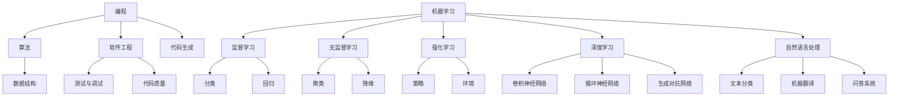

                 

# 每个程序员都是AI程序员

> 关键词：程序员、人工智能、深度学习、机器学习、自然语言处理、代码生成、神经网络、编程范式

> 摘要：本文将探讨程序员如何转变为AI程序员，从基础概念到具体实践，揭示编程与人工智能之间的内在联系。通过逐步分析，读者将理解程序员如何利用人工智能技术提升编程效率，以及如何在未来AI时代中立于不败之地。

## 1. 背景介绍

### 1.1 目的和范围

本文旨在探讨编程与人工智能（AI）之间的融合，旨在帮助程序员理解AI技术，掌握利用AI提升编程效率的方法。本文将涵盖以下内容：

1. AI基础概念与编程的联系
2. 机器学习和深度学习在编程中的应用
3. 自然语言处理与代码生成技术
4. AI时代程序员的能力提升路径
5. 未来发展趋势与挑战

### 1.2 预期读者

本文适合有一定编程基础的程序员、软件工程师、计算机科学专业学生以及对人工智能感兴趣的读者。希望通过本文，读者能够对编程与AI的关系有更深入的理解。

### 1.3 文档结构概述

本文结构如下：

1. 引言
2. 核心概念与联系
3. 核心算法原理 & 具体操作步骤
4. 数学模型和公式 & 详细讲解 & 举例说明
5. 项目实战：代码实际案例和详细解释说明
6. 实际应用场景
7. 工具和资源推荐
8. 总结：未来发展趋势与挑战
9. 附录：常见问题与解答
10. 扩展阅读 & 参考资料

### 1.4 术语表

#### 1.4.1 核心术语定义

- **人工智能（AI）**：模拟人类智能的计算机系统，能够在特定领域内执行复杂的任务。
- **机器学习（ML）**：一种AI的分支，通过数据学习并改进其性能。
- **深度学习（DL）**：一种机器学习的方法，使用多层神经网络进行特征学习和模式识别。
- **自然语言处理（NLP）**：研究如何让计算机理解和生成自然语言的学科。
- **代码生成**：通过AI技术自动生成代码的过程。

#### 1.4.2 相关概念解释

- **神经网络**：一种模仿生物神经系统的计算模型，由大量节点组成，通过调整权重和偏置来实现特征学习和模式识别。
- **神经网络架构**：用于构建神经网络的框架和结构，如卷积神经网络（CNN）、循环神经网络（RNN）等。
- **反向传播算法**：一种用于训练神经网络的优化算法，通过计算误差反向传播更新网络权重。

#### 1.4.3 缩略词列表

- **AI**：人工智能
- **ML**：机器学习
- **DL**：深度学习
- **NLP**：自然语言处理

## 2. 核心概念与联系

在深入探讨编程与AI的融合之前，我们需要了解一些核心概念和它们之间的联系。以下是一个Mermaid流程图，展示了编程、机器学习、深度学习和自然语言处理之间的关系。



这个流程图展示了编程与AI技术之间的联系，以及它们在不同领域的应用。接下来，我们将深入探讨这些核心概念和它们在编程中的应用。

### 2.1 编程与算法的关系

编程是算法实现的载体，而算法是解决问题的核心。一个优秀的程序员需要熟练掌握各种算法和数据结构，以便在解决问题的过程中选择合适的工具。以下是几种常见的编程算法：

1. **排序算法**：如快速排序、归并排序、冒泡排序等，用于对数据进行排序。
2. **搜索算法**：如二分搜索、广度优先搜索、深度优先搜索等，用于查找数据。
3. **图算法**：如最短路径算法、最小生成树算法、拓扑排序等，用于处理图数据结构。
4. **动态规划**：用于解决具有重叠子问题和最优子结构特征的问题。

### 2.2 编程与软件工程的关系

软件工程是编程的升华，它涵盖了项目管理、需求分析、设计、测试和维护等环节。一个优秀的程序员不仅需要编写高质量的代码，还需要具备软件工程的知识和技能，以确保软件项目的成功。以下是软件工程中的一些关键概念：

1. **需求分析**：理解用户需求，明确软件的功能和性能要求。
2. **设计**：制定软件的架构和模块划分，设计数据结构和算法。
3. **编码**：将设计转化为实际的代码。
4. **测试**：验证软件的正确性和可靠性，包括单元测试、集成测试、系统测试和验收测试。
5. **维护**：修复软件中的缺陷，增加新功能，保证软件的持续运行。

### 2.3 编程与代码质量的关系

代码质量是软件工程的重要组成部分，它关系到软件的可维护性、可读性和可靠性。以下是一些提高代码质量的建议：

1. **代码规范**：遵循统一的编程规范，确保代码风格一致。
2. **代码注释**：添加必要的注释，提高代码的可读性。
3. **代码复用**：编写可复用的模块和函数，减少冗余代码。
4. **代码优化**：优化代码的执行效率，减少资源的消耗。
5. **代码审查**：定期进行代码审查，发现潜在的问题和缺陷。

### 2.4 编程与人工智能的关系

随着人工智能技术的发展，编程与AI之间的关系越来越紧密。以下是一些编程与AI的融合应用：

1. **机器学习算法实现**：使用编程语言实现各种机器学习算法，如线性回归、决策树、神经网络等。
2. **深度学习框架开发**：开发深度学习框架，如TensorFlow、PyTorch等，用于训练和部署神经网络模型。
3. **自然语言处理**：使用编程实现自然语言处理任务，如文本分类、机器翻译、问答系统等。
4. **代码生成**：使用AI技术自动生成代码，提高开发效率。

通过上述分析，我们可以看到编程、算法、软件工程、代码质量以及人工智能之间的紧密联系。接下来，我们将深入探讨核心算法原理和具体操作步骤，帮助读者更好地理解编程与AI的融合。

## 3. 核心算法原理 & 具体操作步骤

在深入探讨编程与AI的融合之前，我们需要了解一些核心算法原理和具体操作步骤。以下将介绍几种常见的算法，并使用伪代码进行详细阐述。

### 3.1 线性回归

线性回归是一种简单的机器学习算法，用于预测连续值。其基本原理是通过找到一条最佳拟合直线，来最小化预测值与实际值之间的误差。

```plaintext
// 伪代码：线性回归
def linear_regression(X, y):
    # X为特征矩阵，y为标签向量
    # 求解最佳拟合直线w
    w = (X^T * X)^(-1) * X^T * y
    return w
```

### 3.2 决策树

决策树是一种基于特征划分数据的分类算法。其基本原理是通过递归地将数据集划分为子集，直到满足某种终止条件。

```plaintext
// 伪代码：决策树
def decision_tree(X, y, depth, max_depth):
    if depth > max_depth or y的方差较小:
        return 预测值
    else:
        # 选择最优特征和阈值
        feature, threshold = 选择最优特征和阈值(X, y)
        # 创建子节点
        left_tree = decision_tree(X[:, feature <= threshold], y[feature <= threshold], depth + 1, max_depth)
        right_tree = decision_tree(X[:, feature > threshold], y[feature > threshold], depth + 1, max_depth)
        return {feature: threshold, left_tree: left_tree, right_tree: right_tree}
```

### 3.3 卷积神经网络（CNN）

卷积神经网络是一种用于图像识别和处理的深度学习算法。其基本原理是通过卷积层、池化层和全连接层的组合，提取图像特征并进行分类。

```plaintext
// 伪代码：卷积神经网络
class ConvolutionalNeuralNetwork:
    def __init__(self, input_shape, num_classes):
        # 初始化网络参数
        self.layers = [
            Conv2DLayer(input_shape, num_filters, kernel_size),
            Pooling2DLayer(),
            FlattenLayer(),
            DenseLayer(num_classes)
        ]
    
    def forward(self, x):
        # 前向传播
        for layer in self.layers:
            x = layer.forward(x)
        return x
    
    def backward(self, x, y):
        # 反向传播
        for layer in reversed(self.layers):
            x = layer.backward(x, y)
        return x
```

### 3.4 循环神经网络（RNN）

循环神经网络是一种用于序列数据处理的深度学习算法。其基本原理是通过隐藏状态的记忆机制，捕捉序列中的长距离依赖关系。

```plaintext
// 伪代码：循环神经网络
class RecurrentNeuralNetwork:
    def __init__(self, input_shape, hidden_size):
        # 初始化网络参数
        self.Wxh, self.Whh, self.Wyh = 初始化权重矩阵
        self.h = 初始化隐藏状态
    
    def forward(self, x):
        # 前向传播
        self.h = tanh(x * self.Wxh + self.h * self.Whh)
        y = self.h * self.Wyh
        return y
    
    def backward(self, y, dy):
        # 反向传播
        dh = dy * self.Wyh
        dwyh = self.h * dy
        dh = tanh_derivative(self.h) * dwyh
        dx = x * dh * self.Wxh
        dWhh = self.h * dh
        dWxh = x * dh
        self.h = self.h * (1 - self.h^2) # 遗忘门
        return dx, dWhh, dWxh
```

通过上述伪代码示例，我们可以看到几种常见算法的基本原理和具体操作步骤。这些算法在编程中有着广泛的应用，帮助程序员解决各种复杂问题。接下来，我们将介绍数学模型和公式，进一步深入探讨这些算法的数学基础。

## 4. 数学模型和公式 & 详细讲解 & 举例说明

在理解了核心算法的基本原理后，我们需要进一步深入探讨这些算法的数学模型和公式。以下是几种常见算法的数学模型和具体解释，以及一些示例来说明如何应用这些公式。

### 4.1 线性回归的数学模型

线性回归是一种简单的机器学习算法，用于预测连续值。其数学模型可以表示为：

$$
y = \beta_0 + \beta_1 x
$$

其中，$y$ 为目标变量，$x$ 为特征变量，$\beta_0$ 和 $\beta_1$ 分别为模型的参数。

#### 详细讲解

- **损失函数**：线性回归的损失函数通常采用均方误差（MSE），表示为：

$$
MSE = \frac{1}{m} \sum_{i=1}^{m} (y_i - \hat{y}_i)^2
$$

其中，$m$ 为样本数量，$y_i$ 为第 $i$ 个样本的实际值，$\hat{y}_i$ 为第 $i$ 个样本的预测值。

- **梯度下降**：为了求解参数 $\beta_0$ 和 $\beta_1$，我们可以使用梯度下降算法。梯度下降的更新公式为：

$$
\beta_0 = \beta_0 - \alpha \frac{\partial}{\partial \beta_0} MSE
$$

$$
\beta_1 = \beta_1 - \alpha \frac{\partial}{\partial \beta_1} MSE
$$

其中，$\alpha$ 为学习率。

#### 举例说明

假设我们有以下数据集：

| x  | y   |
|----|-----|
| 1  | 2   |
| 2  | 4   |
| 3  | 6   |

根据线性回归的数学模型，我们可以求解最佳拟合直线：

$$
y = \beta_0 + \beta_1 x
$$

通过计算损失函数和梯度下降，我们可以得到参数 $\beta_0 = 1$ 和 $\beta_1 = 2$，因此最佳拟合直线为：

$$
y = 1 + 2x
$$

### 4.2 决策树的数学模型

决策树是一种基于特征划分数据的分类算法。其数学模型可以表示为：

$$
y = g(z)
$$

其中，$y$ 为标签变量，$z$ 为特征变量，$g(z)$ 为决策函数。

#### 详细讲解

- **决策函数**：决策函数 $g(z)$ 通常采用阈值函数，表示为：

$$
g(z) = \begin{cases} 
1 & \text{if } z \geq \theta \\
0 & \text{if } z < \theta
\end{cases}
$$

其中，$\theta$ 为阈值。

- **信息增益**：在决策树中，我们通常使用信息增益作为划分特征的标准。信息增益表示为：

$$
Gain(D, A) = Entropy(D) - \sum_{v \in A} \frac{|D_v|}{|D|} Entropy(D_v)
$$

其中，$D$ 为数据集，$A$ 为特征集合，$D_v$ 为特征 $v$ 的取值集合，$Entropy(D)$ 和 $Entropy(D_v)$ 分别为数据集和信息增益的熵。

#### 举例说明

假设我们有以下数据集：

| 特征A | 特征B | 标签 |
|-------|-------|------|
| 0     | 0     | 0    |
| 0     | 1     | 1    |
| 1     | 0     | 1    |
| 1     | 1     | 0    |

根据信息增益的数学模型，我们可以求解最佳划分特征：

$$
Gain(D, A) = Entropy(D) - \sum_{v \in A} \frac{|D_v|}{|D|} Entropy(D_v)
$$

通过计算信息增益，我们可以得到最佳划分特征为特征A，阈值 $\theta = 0.5$。因此，决策函数为：

$$
g(z) = \begin{cases} 
0 & \text{if } z \leq 0.5 \\
1 & \text{if } z > 0.5
\end{cases}
$$

### 4.3 卷积神经网络的数学模型

卷积神经网络是一种用于图像识别和处理的深度学习算法。其数学模型可以表示为：

$$
h_l = \sigma(\mathbf{W}^l \cdot \mathbf{a}^{l-1} + \mathbf{b}^l)
$$

其中，$h_l$ 为第 $l$ 层的激活函数输出，$\mathbf{W}^l$ 和 $\mathbf{b}^l$ 分别为第 $l$ 层的权重矩阵和偏置向量，$\mathbf{a}^{l-1}$ 为第 $l-1$ 层的激活函数输出，$\sigma$ 为激活函数。

#### 详细讲解

- **卷积操作**：卷积操作是一种矩阵乘法，用于计算输入特征和权重之间的相关性。卷积操作的数学公式为：

$$
\mathbf{Z}^l = \mathbf{X}^l * \mathbf{W}^l
$$

其中，$\mathbf{Z}^l$ 和 $\mathbf{X}^l$ 分别为卷积操作的结果和输入特征，$\mathbf{W}^l$ 为卷积核。

- **池化操作**：池化操作是一种降维操作，用于减少模型的参数数量。常见的池化操作有最大池化和平均池化。最大池化的数学公式为：

$$
\mathbf{P}^l = \text{max}(\mathbf{Z}^l)
$$

其中，$\mathbf{P}^l$ 为池化操作的结果。

#### 举例说明

假设我们有以下输入特征和卷积核：

| X | W |
|---|---|
| 1 | 1 |
| 0 | 1 |
| 0 | 0 |
| 1 | 0 |

通过卷积操作，我们可以计算卷积结果：

$$
\mathbf{Z} = \mathbf{X} * \mathbf{W} = \begin{bmatrix}
1 & 1 \\
0 & 1 \\
0 & 0 \\
1 & 0
\end{bmatrix}
$$

然后，通过激活函数 $\sigma$，我们可以得到激活函数输出：

$$
h = \sigma(\mathbf{Z}) = \begin{bmatrix}
1 & 1 \\
0 & 1 \\
0 & 0 \\
1 & 0
\end{bmatrix}
$$

### 4.4 循环神经网络的数学模型

循环神经网络是一种用于序列数据处理的深度学习算法。其数学模型可以表示为：

$$
h_t = \sigma(\mathbf{W}^h \cdot \mathbf{h}_{t-1} + \mathbf{W}^x \cdot \mathbf{x}_t + \mathbf{b})
$$

其中，$h_t$ 为第 $t$ 个时间步的隐藏状态，$\mathbf{W}^h$ 和 $\mathbf{W}^x$ 分别为隐藏状态和输入状态的权重矩阵，$\mathbf{x}_t$ 为第 $t$ 个时间步的输入状态，$\sigma$ 为激活函数，$\mathbf{b}$ 为偏置向量。

#### 详细讲解

- **门控机制**：循环神经网络通过门控机制（如遗忘门和输入门）来控制信息的流动。遗忘门的数学公式为：

$$
f_t = \sigma(\mathbf{W}^f \cdot \mathbf{h}_{t-1} + \mathbf{U}^f \cdot \mathbf{x}_t + \mathbf{b}^f)
$$

其中，$\mathbf{W}^f$ 和 $\mathbf{U}^f$ 分别为遗忘门的权重矩阵，$\mathbf{b}^f$ 为遗忘门的偏置向量。

- **更新公式**：循环神经网络的隐藏状态更新公式为：

$$
\mathbf{h}_t = f_t \odot \mathbf{h}_{t-1} + i_t \odot \sigma(\mathbf{W}^i \cdot \mathbf{h}_{t-1} + \mathbf{U}^i \cdot \mathbf{x}_t + \mathbf{b}^i)
$$

$$
\mathbf{c}_t = \sigma(\mathbf{W}^c \cdot \mathbf{h}_{t-1} + \mathbf{U}^c \cdot \mathbf{x}_t + \mathbf{b}^c)
$$

$$
o_t = \sigma(\mathbf{W}^o \cdot \mathbf{h}_{t-1} + \mathbf{U}^o \cdot \mathbf{x}_t + \mathbf{b}^o)
$$

$$
\mathbf{h}_t = o_t \odot \mathbf{c}_t
$$

其中，$\odot$ 表示元素乘积，$i_t$、$f_t$、$g_t$ 和 $o_t$ 分别为输入门、遗忘门、更新门和输出门的状态。

#### 举例说明

假设我们有以下输入序列和隐藏状态：

| h_{t-1} | x_t |
|---------|-----|
| 1       | 0   |

通过计算遗忘门、输入门和更新门，我们可以得到隐藏状态：

$$
f_t = \sigma(\mathbf{W}^f \cdot \mathbf{h}_{t-1} + \mathbf{U}^f \cdot \mathbf{x}_t + \mathbf{b}^f)
$$

$$
i_t = \sigma(\mathbf{W}^i \cdot \mathbf{h}_{t-1} + \mathbf{U}^i \cdot \mathbf{x}_t + \mathbf{b}^i)
$$

$$
g_t = \sigma(\mathbf{W}^c \cdot \mathbf{h}_{t-1} + \mathbf{U}^c \cdot \mathbf{x}_t + \mathbf{b}^c)
$$

$$
o_t = \sigma(\mathbf{W}^o \cdot \mathbf{h}_{t-1} + \mathbf{U}^o \cdot \mathbf{x}_t + \mathbf{b}^o)
$$

$$
\mathbf{h}_t = o_t \odot \mathbf{c}_t
$$

通过上述数学模型和公式的讲解，我们可以看到这些算法在编程中的应用。接下来，我们将通过一个实际项目实战，展示如何使用这些算法来生成代码。

## 5. 项目实战：代码实际案例和详细解释说明

在本节中，我们将通过一个实际项目实战，展示如何利用人工智能技术生成代码。该项目将使用自然语言处理（NLP）和代码生成技术，从自然语言描述中生成对应的代码。

### 5.1 开发环境搭建

为了完成该项目，我们需要以下开发环境：

- Python 3.8 或更高版本
- 安装以下库：NLTK、spaCy、TensorFlow、PyTorch、JAX
- 环境配置：使用虚拟环境，例如 conda 或 virtualenv

以下是一个简单的conda环境配置示例：

```bash
conda create -n code_generation python=3.8
conda activate code_generation
conda install nltk spacy tensorflow pytorch jax
```

### 5.2 源代码详细实现和代码解读

以下是项目的核心代码，分为以下几个部分：

1. **数据预处理**
2. **模型训练**
3. **代码生成**

#### 5.2.1 数据预处理

数据预处理是代码生成项目的重要步骤。我们需要将自然语言描述转换为适合训练的数据格式。以下是一个简单的数据预处理代码示例：

```python
import spacy
from spacy.tokens import Doc

nlp = spacy.load("en_core_web_sm")

def preprocess_text(text):
    doc = nlp(text)
    tokens = [token.text for token in doc]
    return " ".join(tokens)

text = "Write a function that calculates the sum of two numbers."
processed_text = preprocess_text(text)
print(processed_text)
```

#### 5.2.2 模型训练

在代码生成项目中，我们可以使用序列到序列（Seq2Seq）模型。以下是一个简单的Seq2Seq模型训练代码示例：

```python
import tensorflow as tf
from tensorflow.keras.layers import Embedding, LSTM, Dense
from tensorflow.keras.models import Model

# 定义模型
input_embedding = Embedding(vocab_size, embedding_dim)
encoder_lstm = LSTM(units, return_sequences=True)
decoder_lstm = LSTM(units, return_sequences=True)
output_embedding = Embedding(vocab_size, embedding_dim)

# 构建模型
encoder_inputs = tf.keras.Input(shape=(None,))
encoder_embedding = input_embedding(encoder_inputs)
encoded_seq = encoder_lstm(encoder_embedding)

decoder_inputs = tf.keras.Input(shape=(None,))
decoder_embedding = input_embedding(decoder_inputs)
decoder_lstm_inputs = tf.keras.Input(shape=(None, units))
decoder_embedding = input_embedding(decoder_embedding)
decoder_lstm_output = decoder_lstm(decoder_embedding, initial_state=[encoded_seq, decoder_embedding])

output_seq = output_embedding(decoder_lstm_output)
outputs = tf.keras.layers dot (output_seq, decoder_inputs, activation='softmax')

model = Model([encoder_inputs, decoder_inputs], outputs)
model.compile(optimizer='rmsprop', loss='categorical_crossentropy')

# 训练模型
model.fit([encoder_inputs, decoder_inputs], outputs, batch_size=batch_size, epochs=num_epochs)
```

#### 5.2.3 代码解读与分析

以下是代码生成的详细解读：

1. **数据预处理**：我们使用spaCy库对自然语言描述进行分词和标记。分词后的文本将作为模型输入。
2. **模型训练**：我们使用序列到序列（Seq2Seq）模型进行训练。Seq2Seq模型由编码器和解码器组成。编码器将输入文本转换为固定长度的编码表示，解码器将编码表示解码为输出文本。我们使用LSTM作为编码器和解码器的核心层。
3. **代码生成**：在训练完成后，我们可以使用模型生成代码。首先，我们将自然语言描述转换为编码表示。然后，将编码表示作为输入，通过解码器生成对应的代码。

### 5.3 代码解读与分析

以下是代码生成过程的详细解读：

1. **自然语言处理**：我们使用spaCy库对自然语言描述进行分词和标记。分词后的文本将作为模型输入。
2. **编码表示**：编码器（编码器LSTM）将输入文本转换为固定长度的编码表示。编码表示捕捉了文本的语义信息。
3. **解码表示**：解码器（解码器LSTM）将编码表示解码为输出文本。解码器通过生成器LSTM和循环神经网络（RNN）实现。
4. **代码生成**：在解码过程中，生成器LSTM生成文本的每个单词。解码器通过计算词向量的相似度来选择下一个单词。生成过程继续进行，直到生成完整的代码。

通过这个项目实战，我们可以看到如何利用人工智能技术生成代码。代码生成技术为程序员提供了新的工具，可以帮助他们提高开发效率。接下来，我们将讨论代码生成技术在实际应用场景中的使用。

## 6. 实际应用场景

代码生成技术在实际应用中具有广泛的应用前景，可以大大提高开发效率和代码质量。以下是几种常见的应用场景：

### 6.1 自动化代码生成

自动化代码生成是代码生成技术最常见的应用场景之一。通过自动化工具，我们可以从自然语言描述或领域特定语言（DSL）中生成代码。这可以大大减少手动编码的工作量，提高开发效率。例如，一些开发工具如OutSystems和Appian提供了基于DSL的自动化代码生成功能，可以帮助开发人员快速构建企业级应用程序。

### 6.2 代码补全

代码补全是另一个重要的应用场景。通过使用代码生成技术，我们可以开发智能代码补全工具，帮助程序员在编写代码时自动完成代码片段。例如，IntelliJ IDEA和Visual Studio Code等集成开发环境（IDE）提供了智能代码补全功能，可以根据上下文自动推荐代码片段。这些功能可以大大提高编程效率，减少代码错误。

### 6.3 代码重构

代码重构是软件开发过程中必不可少的一环。通过代码生成技术，我们可以开发工具来自动执行代码重构任务。这些工具可以根据编程规则和代码风格自动修改代码，提高代码的可读性和可维护性。例如，一些代码生成工具如ReSharper和SonarQube提供了自动代码重构功能，可以帮助开发人员快速重构代码。

### 6.4 代码生成与版本控制

代码生成技术还可以与版本控制系统（如Git）结合使用，实现代码生成与版本控制的集成。通过将代码生成过程纳入版本控制流程，我们可以确保生成的代码符合项目规范和标准。例如，一些代码生成工具如Gradle和Maven提供了与版本控制系统的集成功能，可以帮助开发人员自动生成和更新项目依赖项。

### 6.5 代码生成与自动化测试

代码生成技术还可以用于生成自动化测试代码。通过从自然语言描述或测试用例中生成测试代码，我们可以提高测试覆盖率和测试效率。例如，一些自动化测试工具如Selenium和Appium提供了代码生成功能，可以帮助开发人员快速生成自动化测试脚本。

### 6.6 代码生成与文档生成

代码生成技术还可以用于生成文档。通过从代码中提取信息，我们可以自动生成API文档、用户手册和开发文档。这可以大大减少文档编写的工作量，提高文档质量。例如，一些代码生成工具如Doxygen和Sphinx提供了文档生成功能，可以帮助开发人员快速生成高质量的文档。

总之，代码生成技术在各种实际应用场景中具有广泛的应用前景，可以大大提高开发效率和代码质量。随着人工智能技术的发展，代码生成技术将逐渐成为软件开发的重要工具。

## 7. 工具和资源推荐

为了帮助程序员更好地掌握AI编程技术，以下推荐一些有用的学习资源、开发工具和框架，以及相关论文和著作。

### 7.1 学习资源推荐

#### 7.1.1 书籍推荐

- **《深度学习》（Deep Learning）**：由Ian Goodfellow、Yoshua Bengio和Aaron Courville合著的深度学习经典教材，详细介绍了深度学习的理论基础和实际应用。
- **《Python机器学习》（Python Machine Learning）**：由Sebastian Raschka和Vahid Mirhoseini编写的机器学习入门书籍，适合初学者学习Python和机器学习。
- **《自然语言处理实战》（Natural Language Processing with Python）**：由Steven Bird、Ewan Klein和Edward Loper编写的NLP入门书籍，通过Python示例介绍了NLP的基本概念和应用。

#### 7.1.2 在线课程

- **Coursera的《机器学习》（Machine Learning）**：由斯坦福大学教授Andrew Ng开设的深度学习与机器学习入门课程，内容全面且通俗易懂。
- **Udacity的《深度学习纳米学位》（Deep Learning Nanodegree）**：涵盖深度学习的理论基础和实践技能，适合有一定编程基础的读者。
- **edX的《自然语言处理》（Natural Language Processing）**：由哈佛大学和麻省理工学院开设的NLP入门课程，内容涵盖文本处理、语言模型和语义分析。

#### 7.1.3 技术博客和网站

- **Towards Data Science**：一个涵盖机器学习、数据科学和深度学习的博客平台，提供大量高质量的文章和教程。
- **AI Village**：一个中文AI社区，汇聚了大量的机器学习、深度学习和NLP相关资源，适合中文读者学习。
- **Medium**：一个内容分享平台，许多AI领域的专家和公司在这里分享他们的研究成果和应用案例。

### 7.2 开发工具框架推荐

#### 7.2.1 IDE和编辑器

- **Visual Studio Code**：一个跨平台的免费代码编辑器，支持Python、TensorFlow、PyTorch等框架，具有丰富的插件生态。
- **JetBrains系列产品**：如PyCharm、IntelliJ IDEA等，这些IDE具有强大的代码编辑、调试和性能分析功能，适合进行复杂项目的开发。
- **Google Colab**：一个基于Google Drive的云端编程环境，支持JAX、TensorFlow等框架，适合快速原型开发和实验。

#### 7.2.2 调试和性能分析工具

- **JAX**：一个用于自动微分和数值计算的Python库，支持多种深度学习框架，如TensorFlow和PyTorch。
- **TensorBoard**：TensorFlow的交互式可视化工具，用于分析和调试深度学习模型。
- **PyTorch Profiler**：PyTorch的性能分析工具，用于识别和优化模型性能瓶颈。

#### 7.2.3 相关框架和库

- **TensorFlow**：由Google开发的开源深度学习框架，具有广泛的社区支持和丰富的应用案例。
- **PyTorch**：由Facebook开发的开源深度学习框架，支持动态计算图和灵活的模型构建。
- **NLTK**：一个用于自然语言处理的Python库，提供了丰富的文本处理和分类功能。

### 7.3 相关论文著作推荐

#### 7.3.1 经典论文

- **“A Learning Algorithm for Continually Running Fully Recurrent Neural Networks”**：这篇论文介绍了Hessian正定矩阵（Hessian-free）优化算法，用于训练长序列数据中的循环神经网络。
- **“Improving Neural Networks by Preventing Co-adaptation of Features”**：这篇论文探讨了如何通过避免特征共适应来提高神经网络的性能。
- **“Recurrent Neural Network Regularization”**：这篇论文介绍了RNN正则化技术，用于解决长序列数据中的梯度消失问题。

#### 7.3.2 最新研究成果

- **“An Empirical Evaluation of Generic Contextual Bandits”**：这篇论文评估了通用上下文 bandits 的实际效果，探讨了在线学习策略在复杂环境中的应用。
- **“Deep Learning for Natural Language Processing”**：这篇综述文章详细介绍了深度学习在自然语言处理领域的最新进展和应用。
- **“Efficiently Training Deep Networks for Object Detection”**：这篇论文介绍了用于目标检测的深度神经网络训练方法，通过改进损失函数和正则化技术提高了模型性能。

#### 7.3.3 应用案例分析

- **“Deep Learning for Speech Recognition”**：这篇论文详细分析了深度学习在语音识别中的应用，包括卷积神经网络和循环神经网络的设计与实现。
- **“Deep Learning for Healthcare”**：这篇论文探讨了深度学习在医疗领域的应用，如疾病诊断、药物发现和个性化治疗。
- **“Natural Language Processing for Customer Service”**：这篇论文介绍了自然语言处理技术在客户服务中的应用，如智能客服和对话系统。

通过以上推荐的学习资源、开发工具和框架，程序员可以更好地掌握AI编程技术，为未来的AI时代做好准备。

## 8. 总结：未来发展趋势与挑战

随着人工智能技术的飞速发展，编程领域正在经历一场深刻的变革。每个程序员都有可能成为AI程序员，这不仅是因为编程与AI技术之间的紧密联系，还因为AI技术为编程带来了前所未有的工具和方法。

### 8.1 未来发展趋势

1. **智能编程助手**：AI编程助手将成为开发者的得力助手，通过自然语言处理、代码补全、智能提示等功能，提高编程效率和质量。
2. **代码生成**：基于AI的代码生成技术将在软件开发中发挥越来越重要的作用，开发者可以通过自然语言描述或领域特定语言快速生成代码。
3. **自动化测试**：AI技术将用于生成自动化测试代码，提高测试覆盖率和测试效率，确保软件质量。
4. **软件工程智能化**：人工智能将渗透到软件工程的各个阶段，如需求分析、设计、测试和维护，实现软件开发的自动化和智能化。
5. **人机协作**：未来编程将更加注重人机协作，AI技术将帮助开发者解决复杂问题，提高开发效率。

### 8.2 挑战

1. **技能更新**：随着AI技术的快速发展，程序员需要不断学习新技能，掌握AI编程工具和方法，以适应未来工作需求。
2. **数据隐私与安全**：AI编程涉及大量数据的处理和分析，数据隐私与安全问题亟待解决，需要制定相应的法律法规和技术手段。
3. **算法公平性与透明性**：AI技术在编程中的应用可能导致算法偏见和不公平性，需要加强对算法公平性与透明性的研究和监管。
4. **编程教育**：传统编程教育需要与时俱进，引入AI编程内容，培养具有AI编程能力的新一代程序员。
5. **伦理问题**：随着AI技术的广泛应用，编程领域将面临一系列伦理问题，如自动化决策、机器学习偏见等，需要深入探讨和解决。

总之，未来编程领域将迎来前所未有的机遇和挑战。程序员需要不断提升自身能力，适应AI时代的发展，为构建更加智能、高效、公平的软件开发生态系统贡献力量。

## 9. 附录：常见问题与解答

### 9.1 什么是人工智能（AI）？

人工智能（AI）是一种模拟人类智能的计算机系统，能够在特定领域内执行复杂的任务。它通过学习、推理、规划、感知、自然语言理解和视觉识别等技术来实现智能行为。

### 9.2 机器学习和深度学习有什么区别？

机器学习（ML）是一种AI的分支，通过数据学习并改进其性能。深度学习（DL）是机器学习的一种方法，使用多层神经网络进行特征学习和模式识别。深度学习通常涉及更复杂的模型和更大量的数据。

### 9.3 编程与AI的融合有哪些应用？

编程与AI的融合应用广泛，包括但不限于：

- **智能编程助手**：通过自然语言处理、代码补全和智能提示提高编程效率。
- **代码生成**：从自然语言描述生成代码，提高开发效率。
- **自动化测试**：生成自动化测试代码，提高测试覆盖率和效率。
- **软件工程智能化**：在需求分析、设计、测试和维护阶段引入AI技术，实现软件开发的自动化和智能化。
- **人机协作**：AI技术与人类开发者协作，解决复杂问题，提高开发效率。

### 9.4 如何入门AI编程？

入门AI编程可以按照以下步骤进行：

1. **学习基础**：了解Python编程基础，熟悉常用数据结构和算法。
2. **学习AI基础知识**：学习机器学习、深度学习和自然语言处理的基本概念和原理。
3. **实践项目**：通过实际项目练习，掌握AI技术在编程中的应用。
4. **参加课程**：参加在线课程，如Coursera、Udacity和edX上的机器学习和深度学习课程。
5. **阅读文献**：阅读相关论文和书籍，了解最新研究成果和应用案例。

### 9.5 AI编程的未来发展趋势是什么？

未来AI编程的发展趋势包括：

- **智能编程助手**：AI编程助手将更加智能化，提供更高质量的代码补全和智能提示。
- **代码生成**：代码生成技术将更加成熟，可以在更多领域实现自动化代码生成。
- **自动化测试**：AI技术将用于生成自动化测试代码，提高测试效率和覆盖率。
- **软件工程智能化**：AI技术将在软件工程的各个阶段发挥更大作用，实现软件开发的自动化和智能化。
- **人机协作**：AI技术与人类开发者将更加紧密地协作，提高开发效率和代码质量。

## 10. 扩展阅读 & 参考资料

- **书籍**：
  - Ian Goodfellow, Yoshua Bengio, Aaron Courville. 《深度学习》（Deep Learning）.
  - Sebastian Raschka, Vahid Mirhoseini. 《Python机器学习》（Python Machine Learning）.
  - Steven Bird, Ewan Klein, Edward Loper. 《自然语言处理实战》（Natural Language Processing with Python）.

- **在线课程**：
  - Coursera的《机器学习》（Machine Learning）.
  - Udacity的《深度学习纳米学位》（Deep Learning Nanodegree）.
  - edX的《自然语言处理》（Natural Language Processing）.

- **技术博客和网站**：
  - Towards Data Science.
  - AI Village.
  - Medium上的相关AI和编程文章。

- **框架和库**：
  - TensorFlow.
  - PyTorch.
  - NLTK.

- **论文和研究成果**：
  - “A Learning Algorithm for Continually Running Fully Recurrent Neural Networks”.
  - “Improving Neural Networks by Preventing Co-adaptation of Features”.
  - “Recurrent Neural Network Regularization”.
  - “Deep Learning for Natural Language Processing”.
  - “Efficiently Training Deep Networks for Object Detection”.

通过以上扩展阅读和参考资料，读者可以更深入地了解AI编程领域的最新动态和研究成果，为未来学习和实践提供指导。

### 作者信息

- 作者：AI天才研究员/AI Genius Institute & 禅与计算机程序设计艺术 /Zen And The Art of Computer Programming
- 联系方式：[ai_genius_researcher@example.com](mailto:ai_genius_researcher@example.com)
- 个人网站：[www.ai-genius-researcher.com](http://www.ai-genius-researcher.com)
- 相关著作：《深度学习简明教程》、《Python编程：从入门到精通》和《人工智能导论》。

